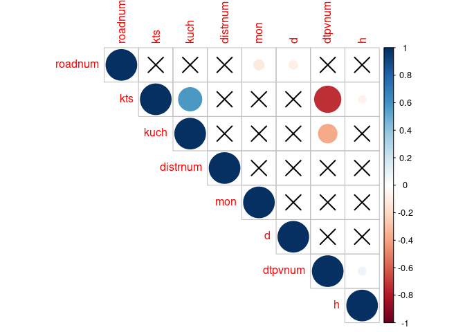

## Introduction

Traffic accidents in Russia caused 16981 deaths and 210877 injuries in 2019 
according to official statistics. Russian government had developed a strategy
to reduce the number of traffic accidents in 2016. The strategy targets 1.5 - 2
deaths per 100000 population by the end of 2024. While much effort has focused
on predicting whether Russia is able to reach the assigned level, what 
influences the severity of traffic accident remains unknown.

There are a variety of weather and traffic conditions that contribute to 
accidents. This paper attempts to find out if we could use quantitative 
characteristics to predict the severity of traffic accident in Russia?

This research is based on the data for Saint-Petersburg, Russia.


## Desired data

Ideal data set has to include both weather and traffic conditions. Weather
conditions include variables: air temperature, road temperature, rain, snow, 
ice, fog. Traffic conditions include variables: date, time, longitude, latitude,
type of accident, road type, place type, road condition, road lights, number of
vehicles, number of participants, fatal, injury, class of vehicles, model of 
vehicles, category of participants, sex of participants, cause of accident.

## Available data

We downloand the data from official [police site](http://stat.gibdd.ru). Police 
describes each accident in unique accident card. It contains the following data: 
type of accident, date, city district, info about an accident, number of 
vehicles, number of participants, ID of an accident, fatalities, injured, 
time of an accident etc. The data is available in *.pdf*, *.xls*, *.csv*, *.xml*
formats. We use *.csv* and *.xml* files, because we cannot read the data from
*.pdf* files and *.xls* files representation is not suitable for automated 
reading. Each card is given as separate spreadsheet in one file and different
number of rows and columns.

## Prerequisite packages


```r
library(reshape2)
library(ggplot2)
library(dplyr)
library(tidyr)
library(lubridate)
library(readr)
library(stringi)
library(stringr)
library(ROSE)
library(rpart)
```

## Get data

We start from reading in *.xml* format. We downlaod the data for 2019. The data 
was broken by 14 days intervals by police server. Total 2019 is 22 files. It 
covers the period from January 1, 2019 to November 26, 2019. The data for 
December is not available yet.


```r
files <- list.files("./raw_data")
files <- as.list(files)

setwd("./raw_data")
list_file <- list.files(pattern = "*.xml") %>% 
    lapply(xmlToDataFrame, stringsAsFactors = F) %>% bind_rows
setwd("C:/Users/Георгий/Documents/GitHub/rus_traffic_accidents/")
```

Each accident cards starts from a description of region and a name of the
document. This is not relevant to our research - we filter rows, which contain
that information. We also tranform the date to *date - month - year* format and
time to *time* format. Then we arrange the data by date, time, type of accident,
district of accident - we need these columns to create a key later.


```r
list_file <- list_file %>% 
    filter(!(is.na(DTPV))) %>% select(-text)
list_file$date <- dmy(list_file$date)
list_file$time <- as.POSIXct(list_file$time, format = "%H:%M")
xmldf <- list_file %>% arrange(date, time, DTPV, district)
rm(list_file)
```

Summary of the dataset shows that columns *KTS*, *KUCH*, *POG*, *RAN* downloaded
as characters, while they are numeric values. 


```r
summary(xmldf)
```

We tranform those to numeric.


```r
xmldf$KTS <- as.numeric(xmldf$KTS)
xmldf$KUCH <- as.numeric(xmldf$KUCH)
xmldf$POG <- as.numeric(xmldf$POG)
xmldf$RAN <- as.numeric(xmldf$RAN)
```

Check if there are missing values in the dataset after all transformations.


```r
sum(complete.cases(xmldf))
```

Column *infoDtp* contains descriptions of accidents: weather conditions, road
conditions, coordinates etc. Each description is a string with no delimiters
and different length. The order of description items differs by lines also.
This limits our ability to get the data from the column. We start from getting
driving mode after an accident, road type and coordinates.


```r
driving_mode <- xmldf %>% 
    separate(infoDtp, into = c("text1"), 
             sep = "([:digit:]+\\.[:digit:]+\\.[:digit:]+)")
driving_mode <- driving_mode %>% 
    separate(text1, into = c("text1"), 
             sep = "([:digit:]+\\.[:digit:]+)") %>% select(text1)


xmldf <- cbind(xmldf, driving_mode)
xmldf$driving_mode <- xmldf$text1
xmldf <- xmldf %>% select(-text1)

coords_dtp <- xmldf %>% 
    select(date, infoDtp) %>% 
    extract(infoDtp, c("text1"), 
            "([:digit:]+\\.[:digit:]+\\.[:digit:]+)", remove = TRUE) %>% 
    select(text1)

xmldf <- cbind(xmldf, coords_dtp)
xmldf$coords_dtp <- xmldf$text1
xmldf <- xmldf %>% select(-text1)

road_type <- xmldf %>% select(infoDtp) %>% 
    separate(infoDtp, into = c("text1", "text2"), 
             sep = "([:digit:]+\\.[:digit:]+\\.[:digit:]+)") %>% 
    select(text2)

road_type <- road_type %>% 
    extract(text2, c("text1"), "([^A-z]+[:punct:])", remove = FALSE)

road_type <- road_type %>% 
    extract(text1, c("text1"), "([:alnum:]+[:alnum:]+)", remove = TRUE)

xmldf$road_type <- road_type$text1
```

This is as far as we could get with sensible regular expressions - there should
be a more simple way to get the required data. We found out that *.csv* files
contain some of the information from accidents card in a format that we could
use for our analysis. The idea is to create a dataset with weather and road
conditions and join it with the first dataset on a key. The key is the date, 
time, type of accident and a district.

We download *.csv* files and merge them. Then make the columns and join both
datasets.


```r
### read all the csv files

setwd("./csv_data")
list_file <- list.files(pattern = "*.csv") %>% 
    lapply(read.csv, sep = ";", encoding = "UTF-8") %>% bind_rows
setwd("C:/Users/Георгий/Documents/GitHub/rus_traffic_accidents/")
raw_data <- data.frame(list_file)

### transform .csv file to split the columns

raw_data <- raw_data %>% filter(!is.na(Номер))
raw_data <- unique(raw_data)
raw_data <- raw_data %>% select(Номер, Дата, Время, Схема, Широта, Вид.ДТП,
                                     Адрес, Дорога, Категория.дороги, Состояние.погоды.1, 
                                     Состояние.проезжей.части, Освещение)

raw_data$weather_cond <- paste(raw_data$Состояние.погоды.1,
                               raw_data$Состояние.проезжей.части)
raw_data$road_cond <- raw_data$Освещение
raw_data$date <- raw_data$Дата
raw_data$time <- raw_data$Время
raw_data$id <- raw_data$Схема
raw_data$latitude <- raw_data$Широта
raw_data$longitude <- raw_data$Вид.ДТП
raw_data$road_cat <- raw_data$Категория.дороги
raw_data$type <- raw_data$Адрес
raw_data$district <- raw_data$Дорога

raw_data <- raw_data %>% select(date, time, type, district, latitude, longitude, 
                                road_cat, road_cond, weather_cond)

raw_data$date <- dmy(raw_data$date)
raw_data <- raw_data %>% arrange(date, time, type, district)
raw_data$time <- as.POSIXct(raw_data$time, format = "%H:%M")
raw_data$key <- paste(raw_data$date, raw_data$time, raw_data$type, raw_data$district)

### make key in xml file

xmldf$key <- paste(xmldf$date, xmldf$time, xmldf$DTPV, xmldf$district)

### check if all rows match by the key

set_raw <- raw_data
set_xml <- xmldf
d1 <- data.frame(set_raw, set_xml)
d1$check <- d1$key == d1$key.1
sum(d1$check == TRUE)
rm(set_raw, set_xml, d1)
rm(files, coords_dtp, driving_mode, road_type)

raw_data_sel <- raw_data %>% select(key.1 = key, latitude, longitude, road_cat,
                                    road_cond, weather_cond)

### merge two datasets

d2 <- cbind(xmldf, raw_data_sel)
rm(list_file, xmldf, raw_data, raw_data_sel)
```

Then we kick temporary columns and write the file as our raw data.


```r
### kick temporary columns

d2 <- d2 %>% select(dtpv = DTPV, date, time, district, kts = KTS, kuch = KUCH, 
                    fatal = POG, injury = RAN, driving_mode, latitude, 
                    longitude, road_cat, road_cond, weather_cond)

# save raw data

write.csv(d2, "raw_data.csv")
```

## Desired data vs available data

|desired data 			| available data 			| check 
|-----------------------|---------------------------|------
|air temperature		| air temperature			| no  
|road temperature		| road temperature			| no  
|rain, snow, ice, fog	| rain, snow, ice, fog		| yes  
|date					| date						| yes  
|time					| time						| yes  
|lognitude				| lognitude					| yes  
|latitude				| latitude					| yes  
|type of accident		| type of accident			| yes  
|road type				| road type					| yes  
|place type				| place type				| yes  
|road condition			| road condition			| yes  
|road lights			| road lights				| yes  
|number of vehicles		| number of vehicles		| yes  
|number of participants	| number of participants	| yes  
|fatal					| fatal						| yes  
|injury					| injury					| yes  
|class of vehicles		| class of vehicles			| no  
|model of vehicles		| model of vehicles			| no  
|category of participant| category of participant	| no  
|sex of participants	| sex of participants		| no  
|cause of accident		| cause of accident			| no  
|weather condition		| weather condition			| yes  

## Translate data

Data contains variables levels description on Russian. For the purpose of this
research we translate all Russian into English.


```r
raw_data <- read.csv("raw_data.csv")
raw_data <- raw_data %>% select(-X)

# check unique values in text columns and subsitute them with English words
str(raw_data)

## check accident types
unique(raw_data$dtpv)

raw_data <- raw_data %>% 
    mutate(dtpv_temp = 
               ifelse(
                   dtpv == "Столкновение", 
                              "collision", 
                   ifelse(dtpv == "Наезд на пешехода",
                                                  "pedestrian_hit", 
                          ifelse(dtpv == "Наезд на препятствие", "obstacle_hit",
                                 ifelse(dtpv == "Наезд на стоящее ТС", "hit_run",
                                        ifelse(dtpv == "Опрокидывание", "rollover",
                                               ifelse(dtpv == "Съезд с дороги", "off_road",
                                                      ifelse(dtpv == "Падение пассажира", "passenger_fall",
                                                             ifelse(dtpv == "Иной вид ДТП", "other",
                                                                    ifelse(dtpv == "Наезд на велосипедиста", "bicycle_hit",
                                                                           ifelse(dtpv == "Наезд на внезапно возникшее препятствие", "immediate_hit",
                                                                                  ifelse(dtpv == "Наезд на лицо, не являющееся участником дорожного движения, осуществляющее несение службы", "policeman_hit",
                                                                                         ifelse(dtpv == "Отбрасывание предмета", "throwing_object", dtpv)))))))))))))


raw_data$dtpv_temp <- as.factor(raw_data$dtpv_temp)
raw_data$dtpv <- raw_data$dtpv_temp
raw_data <- raw_data %>% select(-dtpv_temp)

## convert date to date format
raw_data$date <- ymd(raw_data$date)

## convert time to time
raw_data$time <- as.POSIXct(raw_data$time)

## check districts
unique(raw_data$district)

raw_data$district <- plyr::revalue(raw_data$district,
        c("Василеостровский район" = "vasil", "Калининский район" = "kalin", 
        "Кировский район" = "kirov", "Приморский район" = "primorsk",
        "Адмиралтейский район" = "admiral", "Центральный район" = "center",
        "Красногвардейский район" = "krasnogvard", "Фрунзенский район" = "frunz",
        "Красносельский район" = "krasnosel", "Невский район" = "nevski",
        "Московский район" = "mosk", "Петродворцовый район" = "petrodvorts",
        "Пушкинский район" = "pushkin", "Выборгский район" = "vyborg",
        "Петроградский район"  = "petrograd", "Колпинский район" = "kolpino",
        "Курортный район" = "kurort", "Кронштадтский район" = "kronshtadt"))

## check driving mode
unique(raw_data$driving_mode)

raw_data$driving_mode <- plyr::revalue(raw_data$driving_mode, 
                                       c("Режим движения не изменялся" = "open",
                                         "Движение частично перекрыто" = "part_closed",
                                         "Движение полностью перекрыто" = "closed"))

## check road category
unique(raw_data$road_cat)

raw_data$road_cat <- plyr::revalue(raw_data$road_cat,
                                   c("Местного значения (дорога местного значения, включая относящиеся к собственности поселений, муниципальных районов, городских округов)" = "local",
                                     "Региональная или межмуниципальная (дорога регионального или межмуниципального значения)" = "regional",
                                     "Частная (дорога, относящиеся к частной и иным формам собственности)" = "private",
                                     "Не указано" = "not_specified",
                                     "Федеральная (дорога федерального значения)" = "federal",
                                     "Другие места" = "other"))


## check road conditions
unique(raw_data$road_cond)

raw_data$road_cond <- plyr::revalue(raw_data$road_cond,
                                    c("Обработанное противогололедными материалами" = "wet",
                                      "Заснеженное" = "snow", "Мокрое" = "wet", 
                                      "Загрязненное" = "dirty", "Пасмурно" = "unknown",
                                      "Ясно" = "unknown", "Снегопад" = "snow", "Сухое" = "dry",
                                      "Со снежным накатом" = "snow", "Гололедица" = "sleet",
                                      "Дождь" = "wet", "Пыльное" = "dust"))

## check weather conditions
unique(raw_data$weather_cond)

raw_data$weather_cond <- plyr::revalue(raw_data$weather_cond,
                                       c("Ясно " = "clear", " Пасмурно" = "clouds",
                                         "Пасмурно " = "clouds", "Снегопад " = "snow",
                                         "Сведения отсутствуют " = "unknown",
                                         " Снегопад" = "snow", " Ясно" = "clear",
                                         "Пасмурно Снегопад" = "snow", "Метель " = "snow",
                                         "Сужение проезжей части припаркованным транспортом " = "unknown",
                                         "Дождь " = "rain", "Конструктивное сужение проезжей части вследствие уменьшения количества полос движения " = "unknown",
                                         "Пасмурно Дождь" = "rain", "Пасмурно Метель" = "snow", " Дождь" = "rain", 
                                         "Неправильное применение, плохая видимость дорожных знаков Сведения отсутствуют" = "unknown",
                                         "Сужение проезжей части вследствие проведения работ " = "unknown", "Ясно Дождь" = "rain", "Пасмурно Туман" = "fog",
                                         "Туман " = "fog"))


# Clean data --------------------------------------------------------------

# check unspecified values in factor columns that came from second dataset

levels(raw_data$road_cat)
str(raw_data$road_cat)

levels(raw_data$road_cond) # we have empty rows that do not read as NA
str(raw_data$road_cond)
levels(raw_data$road_cond)[levels(raw_data$road_cond) == ""] <- "unknown"

levels(raw_data$weather_cond)
str(raw_data$weather_cond)

levels(raw_data$driving_mode)
str(raw_data$driving_mode)

levels(raw_data$dtpv)
str(raw_data$dtpv)

# final check on the summary

summary(raw_data)

# write clean data set

write.csv(raw_data, "clean_data.csv")
```


## Exploratory data analysis

### Preprocessing

To explore the dataset we introduce the severity of an accident. The severity
is the number of casualties divided by the sum of vehicles and the number of
participants: $$ s_r = \frac{fatal + injury}{vehicles + participants} $$

There are two classes of accidents by the level of severity: serious and
moderate. The accident is considered serious if severity rate is over *0.35*.
The rate of fatal accidents in *serious* class is *4* times more than in 
*moderate* class.


```r
# read data

clean_data <- read.csv("clean_data.csv")
clean_data <- clean_data %>% select(-X)
clean_data <- data.frame(clean_data)
clean_data$date <- ymd(clean_data$date)
clean_data$time <- as.POSIXct(clean_data$time)
clean_data <- clean_data %>% mutate(hour = hour(clean_data$time),
                                    casualties = fatal + injury)
clean_data$month <- month(clean_data$date, label = TRUE)
clean_data$day <- wday(clean_data$date, label = TRUE)
clean_data <- clean_data %>% mutate(cas_type = case_when(
    fatal > 0 ~ "fatal",
    injury > 0 ~ "injury",
    TRUE ~ "non-injury"
))

# add severity rate and severity class to dataset

sev_rate <- clean_data %>% 
    mutate(kts_kuch = kts + kuch, 
           severity = casualties / kts_kuch) %>% 
    mutate(year = year(date),
           mmonth = month(date),
           mday = mday(date),
           hhour = hour(time),
           mminute = minute(time)) %>% 
    mutate(timeline = make_datetime(year, mmonth, mday, hhour, mminute))

sev_rate <- sev_rate %>% mutate(sev_class = case_when(
    severity > 0.35 ~ "serious",
    severity <= 0.35 ~ "moderate"
))

sev_rate$sev_class <- as.factor(sev_rate$sev_class)
sev_rate$cas_type <- as.factor(sev_rate$cas_type)

sev_rate <- sev_rate %>% select(-c(driving_mode, hour, year, mmonth, mday,
                                   hhour, mminute))

class_serious <- sev_rate %>% 
    filter(sev_class == "serious") %>% select(cas_type)

class_moderate <- sev_rate %>% 
    filter(sev_class == "moderate") %>% select(cas_type)

summary(class_serious)
```

```
##    cas_type  
##  fatal : 74  
##  injury:759
```

```r
summary(class_moderate)
```

```
##    cas_type   
##  fatal : 108  
##  injury:4919
```

Number of casualties by month increased from January to October 2019. Casualties
decreased to January level in November 2019. Peak of casualties was in August:
there were 800 casualties compared to the lowest level of 460 casualties in 
February. Casualties in summer and early fall were higher than other seasons.

Casualties were unevenly distributed by days of a week. Most accidents with
casualties happened in Friday - Sunday. We called them **weekend accidents**. 
There were more weekend accidents in May - August 2019 than in other months. 
The number of Monday accidents in June - August 2019 increased compared to
other months. The reason behind this seasonality could be summer weekend
migration - people travel outside of the city on Friday evening and return
on Sunday evening.

<!-- -->

Majority of accidents happened on dry road. There were half as many accidents
on wet road. Police officers did not fill in the road conditions 1216 times -
this is 21% of all cases.

### Accidents by class, day of week, time of day

**Sunday**. Accidents on dry road happened at night from *00:00AM* to *04:00AM*. 
The second peak was in late evening after *06:00PM*. There were few serious 
accidents registered with snow road conditions. They were in the evening. The 
pattern of accidents distribution with unknown road conditions follows that of 
dry road. Sunday accidents on wet road were evenly distributed by the time of 
the day.

**Monday**. There were fewer serious accidents on Mondays than on Sundays. 
Accidents were distributed more or less even during the day for all types of
road conditions. There was a time gap between *02:00AM* and *05:00AM* when 
there were very little accidents.

**Tuesday**. Patterns of accidents followed Monday distributions for all types
of road conditions except for outliers. There were two outliers: two major 
accidents happened on Tuesday early morning on dry and wet roads.

**Wednesday**. Dry road accidents were evenly distributed by the day. Snow road
accidents happened mainly in the evening. The pattern for unknown road 
conditions was different from other days: the number of serious accidents
progressively increased from *00:00AM* to *01:00PM*, then dropped. Serious
accidents on wet road were in the morning and in the late evening.

**Thursday**. Serious accidents on dry road looks like normal distribution.
Accidents happened mostly in day hours. The same is true for unknown road
conditions. Accidents on wet road happened during the night and evening hours.

**Friday**. Accidents on Fridays happend after *04:00PM* on dry road. This might
correlate to earlier findings that there were many accidents on Fridays during
May - August. Friday accidents were evenly distributed during the day for other
road conditions.

**Saturday**. Accidents were evenly distributed during the day for all road
conditions. There were some outliers for dry road in the evening - some serious
accidents with many casualties.

<!-- -->

### Accidents by type of accident, denisty by vehicles and participants

Collision of two or more vehicles caused 4000 casualties in 2019. This was the
major cause of injuries. Collisions happened in clear and cloudy weather 
equally often. Minor part of collisions was in heavy weather conditions: snow,
rain, fog.

Pedestrian hit was the second major cause of injury or death, but it was twice
as less as collisions. Cars hit pedestrians equally in clear and cloudy weather.
Third place by cause of injuries was passenger fall - there were many accidents
with public transport: buses, trams.


```r
ggplot(sev_rate) + 
    geom_col(aes(x = dtpv, y = casualties, fill = weather_cond)) + 
    coord_flip() + xlab("accident type") + 
    ggtitle("Casualties by type")
```

<!-- -->

### Severity by number of participants and vehicles

Collisions caused serious injuries when the number of cars was *2-3*, but the
cars were with passengers - the number of participants was more than *5*. When
the number of vehicles increased the severity decreased. There is an outlier
in collisions with *2* vehicles and 17 participants - it was an accident with
public transport.

The severity of pedestrian hit descreased when the number of the vehicles 
increased and increased when the number of participants increased. Pedestrian
hits when *1* vehicle hit *2* or more pedestrians caused serious casualties.

Passenger fall involved *1* or *2* vehicles. Number of casualties increased as
the number of participants increased. There were *2* outliers in this type of
accident - passenger falls that involved 11 and 14 passengers.

Obstacle hit severity increased as the number of participants increased. The 
severity of obstacle hit decreased when the number of vehicles increased.


```r
ggplot(sev_rate, aes(kts, dtpv, fill = severity)) +
    geom_tile(color = "white") + xlab("number of vehicles") +
    scale_x_continuous(breaks = c(1, 2, 3, 4, 5, 6, 7, 8, 9)) +
    facet_wrap(~ kuch, nrow = 2) + ylab("")
```

<!-- -->

### Geospatial distribution of accidents

Accident density map shows that more accidents happened in the northern 
districts of the city: Vyborgskiy, Kalininskiy districts. There were less 
accidents in the southern and western parts of the city. Accidents concentrated
along main avenues.

Many serious accidents happened on intersections of avenues and streets with
*3-4* lanes. Allocation of accidents corresponds to the routes of people
travelling to work and back.

There was high correlation between denisty of accidents and a number of lanes on
a road in the city center. The hottest point in this area was the intersection
of Nevskiy and Liteyniy prospects. Another place with hot points was Sadovaya
street.


```r
library(plotly)
df <- sev_rate

# geo styling
fig <- sev_rate
fig <- fig %>% 
    plot_ly(
        type = 'densitymapbox',
        lat = ~longitude,
        lon = ~latitude,
        coloraxis = 'coloraxis',
        radius = 10
    )
fig <- fig %>% 
    layout(
        mapbox = list(
            style = "open-street-map",
            center = list(lon = 30, lat = 59)), coloraxis = list(colorscale = "Viridis")
    )
fig
```

<!--html_preserve--><div id="htmlwidget-50420718069f5954cccb" style="width:672px;height:480px;" class="plotly html-widget"></div>
<script type="application/json" data-for="htmlwidget-50420718069f5954cccb">{"x":{"visdat":{"2277385ded99":["function () ","plotlyVisDat"]},"cur_data":"2277385ded99","attrs":{"2277385ded99":{"lat":{},"lon":{},"coloraxis":"coloraxis","radius":10,"alpha_stroke":1,"sizes":[10,100],"spans":[1,20],"type":"densitymapbox"}},"layout":{"margin":{"b":40,"l":60,"t":25,"r":10},"mapbox":{"style":"open-street-map","center":{"lon":30,"lat":59}},"coloraxis":{"colorscale":"Viridis"},"hovermode":"closest","showlegend":false},"source":"A","config":{"showSendToCloud":false},"data":[{"lat":[59.946269,60.004345,59.833328,59.999329,59.913369,59.87005,59.947967,59.970649,59.967825,59.824269,59.845057,59.824123,59.875683,59.911508,59.824436,59.994587,59.861675,59.870416,60.027294,59.873981,59.933581,59.846534,60.037932,59.790055,59.818433,59.874644,59.846739,59.830341,60.015612,60.024635,59.837732,59.946205,59.801763,59.841064,59.916365,59.929415,60.037358,59.833883,59.955676,59.878811,60.052556,59.843651,60.098991,59.778544,59.871208,59.878639,60.033243,59.845909,59.712876,59.785002,59.973258,59.772187,60.02344,59.864298,59.869835,59.912267,59.841398,59.861373,59.969328,59.929216,60.004039,59.904429,60.108275,59.851988,60.092198,59.957401,60.052856,59.844858,60.076633,59.915322,59.931329,59.90026,59.966407,59.888738,59.895347,59.926523,60.017231,59.852435,60.039839,59.971562,59.897241,60.062372,60.048341,59.90154,60.138898,59.855053,60.069916,59.75472,59.851804,59.849843,59.910535,59.7866,59.84773,59.952609,59.83302,59.852074,59.882908,59.859881,60.000188,59.890455,59.846022,59.992763,59.952947,59.81941,60.003369,59.988599,59.773532,60.033202,60.002596,59.938875,60.049964,59.786794,59.806624,59.951357,60.020159,59.790919,59.865203,59.859735,59.948719,60.015285,59.933549,59.985406,59.95782,59.858081,60.03201,59.853609,59.773424,59.907211,59.773445,59.875758,59.835252,60.030692,59.980822,59.971132,59.986484,60.053285,59.956353,59.6886,59.898323,59.901497,59.872786,59.915644,60.018234,59.838875,59.997795,59.848372,59.910782,59.928754,60.081861,59.970037,59.85674,59.894782,60.0092,59.944921,60,60.00051,59.851319,59.853356,60.004007,59.719488,59.944867,59.895142,59.847747,59.737087,59.952518,59.965032,59.929963,59.959979,59.935828,59.861195,60.030065,59.82346,59.988008,59.940654,60.037031,60.016926,59.871666,59.915601,59.913439,59.841101,59.771112,59.857526,59.905661,59.996454,59.946495,59.851271,59.861438,59.848436,59.920517,59.941476,59.966289,59.893382,59.919775,60.075932,59.84371,59.989956,59.853863,59.846486,59.874207,59.936215,59.935081,60.042748,59.989972,60.057981,60.062651,59.917957,59.748267,59.762166,59.833096,59.800321,59.963502,60.15477,59.901809,59.959189,59.932156,59.872586,59.9428,59.879516,59.920995,59.873077,59.912106,59.854719,59.84447,59.827402,59.897252,59.737433,60.020823,59.895341,59.935715,60.0067,59.853453,59.852133,59.909271,59.966708,59.915316,59.881987,59.853362,59.94088,60.008839,60.018926,59.890277,59.722025,60.120415,59.867158,59.832131,59.94463,59.750083,60.038167,60.010019,59.952867,59.9867,59.718222,60.010781,59.923985,59.848911,60.009322,59.852618,59.90834,60.050093,60.016942,59.900217,60.027728,59.869781,59.939085,59.846432,59.947129,59.925883,60.002848,59.964162,60.011349,59.992419,60.010025,60.048764,60.042079,59.957637,59.854245,59.922904,59.818514,59.859191,59.932226,59.865935,59.99111,59.942164,59.747294,59.84005,59.963019,60.019231,59.983957,59.960666,59.866307,60.003084,59.840891,59.992473,60.066698,59.837339,60.002301,59.736476,59.832568,60.02464,59.839317,59.915784,59.848302,60.010325,59.865461,59.88062,60.026098,60.005616,59.708915,59.948564,60.061344,59.941336,59.927625,59.922705,59.916016,59.973087,59.878574,60.054731,59.861438,59.936666,59.757865,59.819582,60.056471,59.87298,59.863027,59.955999,59.737244,59.94167,59.985491,59.961939,59.933737,59.969446,59.851885,59.851864,60.001588,59.809565,60.019665,59.841484,59.954011,60.038548,59.995649,59.966058,59.902928,60.03626,60.228263,60.097055,60.034416,59.981734,59.7297,60.00273,59.911508,59.991459,60.010604,59.939294,59.876932,59.823347,59.991808,60.000966,59.962079,59.998042,59.807541,60.047693,59.941455,59.888905,59.902379,59.979625,60.033532,60.028735,59.90409,59.981633,59.959307,60.085552,59.924119,59.883721,59.730814,59.851847,59.74138,59.877594,59.965269,60.048625,59.962256,59.958964,59.845672,59.746769,60.04698,59.87558,59.887021,59.760091,59.86175,59.924168,60.058431,59.854369,60.017087,59.744007,59.879096,59.930216,59.850969,59.747477,59.924469,59.855538,59.832999,59.851098,59.834595,59.961735,60.076943,59.947091,59.954747,59.933758,59.840692,59.908539,59.909056,59.833214,59.852505,59.955257,59.752223,60.004061,60.094391,59.871741,59.896364,59.870018,59.849999,59.726752,59.952405,59.884464,59.872807,59.929345,59.980913,60.0061,60.042266,59.921108,59.938655,59.954844,59.829467,59.849175,59.963292,60.053038,59.851858,59.851799,59.865429,59.977252,59.846033,59.870238,59.875047,60.00612,59.935296,59.958126,59.881917,60.002076,59.908674,59.953576,60.04802,60.001647,59.948155,59.920361,59.930544,60.19775,60.011044,59.937612,60.09284,60.02783,59.92648,60.047361,59.893985,59.865537,59.850533,60.060461,60.00192,59.827122,59.94736,59.851002,59.956912,60.034663,60.035483,59.787928,59.865176,59.839878,59.875807,59.910427,59.914289,59.950766,59.977709,59.946801,59.972517,59.92899,59.841931,59.84115,59.91501,59.963679,59.932705,59.834605,60.001523,60.189436,59.853852,59.917704,59.948929,59.936752,59.890003,59.973806,59.958319,59.936774,60.018969,59.742228,59.926818,60.033446,59.932382,59.843737,60.048743,59.83398,59.955725,59.857866,59.84295,59.955983,59.908921,59.996363,59.937397,59.902756,59.879877,59.995767,59.878956,59.828696,59.834956,59.892995,59.72176,59.978643,59.99419,59.950584,60.026077,59.758524,59.918215,59.848383,59.955349,60.02464,60.022732,59.927178,59.74212,59.833441,59.846033,59.725265,60.0133,60.046493,59.924372,60.007976,59.924071,60.017371,59.866011,59.833516,59.955413,60.00331,60.026307,60.045116,59.870836,59.823778,59.76283,59.973162,59.857101,59.989489,59.90734,60.004093,60.036538,60.01366,60.058993,59.79861,59.969661,59.924001,60.037701,59.849266,59.833387,59.857591,59.890525,60.0086,59.837031,59.848264,60.071773,59.931667,59.981031,59.863915,60.0059,59.833851,59.913321,59.832837,59.891197,59.849223,59.803926,60.049819,59.851831,60.000976,59.833171,59.833711,60.034829,59.941353,59.842282,59.902525,59.840681,59.914122,60.025611,59.851648,59.869307,59.947779,59.851357,60.071489,59.768292,59.850581,59.918581,59.964973,60.047404,59.908416,59.65274,59.781989,59.833263,59.93271,59.7603,59.750483,59.832789,59.828766,59.955499,60.037412,59.882337,59.961821,59.945195,60.074872,60.01958,59.850651,59.685957,59.83308,59.982996,59.715944,60.051282,59.830497,60.047666,59.971277,59.798341,59.965403,59.945453,60.000821,59.898473,59.90756,60.002999,59.846367,59.949327,59.975127,59.907603,59.905279,60.159105,59.915327,60.202927,59.932651,59.864734,59.85167,59.817781,60.024662,59.836482,60.202917,59.929297,59.862569,59.93521,59.825747,60.015639,59.828146,59.84094,59.849676,59.840374,60.087319,59.845117,59.973291,59.837414,59.854876,59.881454,59.84627,59.914585,60.025176,59.954591,59.8542,59.963212,59.833419,60.049712,60.070429,59.83026,60.002307,59.939531,59.982695,59.945243,59.997259,60.057906,59.719472,59.969462,59.901239,59.920285,59.819285,59.914375,60.003074,59.909384,59.846006,59.958287,59.956557,59.926055,59.874633,60.006319,60.153499,59.909206,59.858351,59.924657,60.006903,59.740699,59.85341,59.955333,59.748104,59.980462,59.933108,59.77109,59.927904,59.843667,59.936188,59.98371,59.884921,59.87075,60.010497,59.928641,59.948628,59.803915,59.704055,60.013832,59.908566,59.877933,59.875909,59.932302,59.937666,59.833085,60.039051,59.809063,59.875817,59.852877,59.883134,59.934172,59.992006,59.980978,59.954183,59.889594,60.019687,59.926055,59.842654,60.056359,59.963137,59.971079,59.9981,59.868682,60.019794,59.928614,59.926544,60.111103,59.859191,59.93185,59.955687,60.167689,59.917145,59.991239,59.951368,59.86572,59.841258,59.746337,59.923797,59.892715,60.013408,59.822732,60.047329,59.855867,59.862897,59.916629,59.916016,59.912686,60.031104,59.942798,60.002333,59.950003,59.7219,59.945168,59.892887,59.960612,59.94462,59.879538,59.972222,60.004216,60.008668,59.87621,59.993626,59.933242,59.717822,59.911751,59.861691,60.067603,59.904763,59.901615,59.959103,59.871235,59.915112,60.038826,60.035922,59.911525,59.925571,59.937521,60.193063,59.972394,59.926453,59.985996,59.959759,59.96109,59.941245,59.736568,59.93092,59.954623,59.838859,59.833727,59.86454,59.835279,60.006421,59.844901,60.0247,60.048962,59.997623,59.87613,60.077591,59.936139,59.846362,60.154599,60.025418,59.828831,59.860339,59.859008,59.810045,59.816303,59.830761,59.944942,60.03484,59.849584,59.854094,59.783349,59.93199,60.01107,60.038333,59.896165,59.853006,59.851998,59.916155,59.780898,59.9314,59.9883,59.9674,60.016443,59.859875,60.002248,60.013617,59.753806,59.948349,59.822813,59.810617,59.965618,59.992612,59.958324,59.956751,59.930673,59.941605,60.003052,60.079785,59.848857,59.869204,60.000638,59.871649,59.834692,59.96856,60.014711,59.946871,60.019151,59.892274,60.167646,59.852295,59.948327,59.94175,59.902041,59.990649,59.921791,59.901406,59.949112,59.846906,60.19246,59.862122,59.836897,59.831856,59.876,60.036313,59.906829,59.877998,59.81777,59.916403,59.952904,59.938219,59.943835,59.737968,59.977972,59.850032,59.752709,60.049969,59.733031,59.790562,59.703612,60.125605,59.902622,59.963749,59.957417,60.043552,59.884383,59.923512,59.881115,59.846739,59.9839,59.926001,59.943362,59.899754,59.998959,59.957546,59.850527,60.030954,59.925711,59.853782,59.661043,59.978235,59.749661,60.075894,59.95414,59.971068,59.851718,59.818762,59.948773,60.042775,60.046221,59.955639,60.112659,59.872037,59.880313,60.000681,59.831797,59.893953,59.861443,60.000579,59.860333,59.967186,59.995853,59.95638,59.949971,59.82216,59.848857,60.03306,59.946232,59.924221,59.870373,60.050098,60.048062,59.952851,59.827429,59.77351,60.008196,59.869603,59.975626,59.938811,59.9365,59.949971,59.859557,59.911379,60.014958,60.002848,59.911191,60.013274,59.97853,59.864836,59.721186,59.921302,59.827256,60.058672,59.854822,59.865806,59.941433,59.959506,59.665682,59.932275,59.945442,59.933699,59.862386,60.027535,59.869371,60.052996,60.017505,60.039726,59.883102,59.859886,59.956095,59.98291,59.917451,60.035145,59.968458,59.930512,59.967852,59.984139,59.93521,60.192135,59.840061,59.842756,60.039914,59.957841,59.858782,59.975116,60.030633,59.873567,59.838767,59.870982,59.943534,59.969419,59.93343,60.069038,59.933688,60.041795,59.921485,59.953426,59.986189,60.020357,59.802027,59.911917,59.915349,59.698096,59.730122,59.873007,59.852144,59.9353,60.092781,59.889001,59.968115,59.843133,60.081508,59.931726,59.988883,59.92556,59.875672,59.825871,59.932027,59.932404,59.859213,59.906759,59.926523,59.830664,59.833468,59.91537,59.865348,60.010716,59.9969,60.198561,59.850764,59.923963,60.038301,59.857047,59.885643,60.027562,59.848458,59.813411,59.871617,59.968222,59.983897,59.918027,59.937128,59.923431,59.934758,59.933973,59.817565,59.798389,59.830206,59.995408,59.869032,59.834012,59.885271,60.003835,59.812764,59.975631,60.001969,59.943642,59.849773,59.944233,59.86321,60.055652,59.898296,59.947167,59.859746,59.90926,59.878052,59.963196,59.912062,60.02063,59.883759,59.851912,59.868413,59.918,59.967191,59.7825,59.856093,59.919581,59.875974,59.955993,60.032342,59.938854,59.878084,59.943072,60.052974,59.86921,59.930426,59.8217,59.92071,59.875069,59.857629,59.820618,59.983876,59.93,60.049423,59.735243,60.042679,60.005037,59.945044,59.960199,59.937875,60.015789,59.997645,59.948956,59.85237,59.994614,59.884938,59.967454,59.926539,59.838239,59.931307,60.052663,59.93257,59.856109,59.756028,59.96326,59.983479,59.934032,60.091888,59.845462,59.855565,60.041618,59.737644,60.004779,59.9719,60.003278,59.810649,60.012127,59.802922,60.048962,59.839861,59.9864,59.890315,59.903864,60.079593,59.949407,59.859531,60.058977,59.856056,59.94412,59.851524,59.971497,59.921296,59.987536,59.9439,59.732761,59.953098,59.830707,59.908695,59.842454,59.836708,59.983753,59.702432,59.79718,59.665259,59.685367,59.879522,59.938553,59.955644,60.074642,60.0283,60.025267,59.742147,59.935457,59.84357,59.876081,60.022818,60.034727,59.934038,59.841861,60.178063,59.936037,59.972603,60.021215,60.015805,59.879958,59.836686,59.778014,59.868628,60.029357,59.931974,59.984552,59.917075,59.935097,59.873567,60.038435,59.846928,59.970987,59.939945,59.987788,60.021981,59.735416,60.068545,59.908496,59.932237,59.935812,59.866458,60.02448,60.015998,59.854692,59.747153,59.840104,59.86468,59.969629,59.85493,59.933957,59.869134,59.821448,59.834207,59.839754,59.851939,59.991292,59.973854,59.83673,59.920377,59.876286,59.840745,59.853593,59.95862,59.836557,60.115626,59.897155,59.968474,59.949369,59.777014,59.851794,60.012282,59.94397,60.030199,59.852117,59.840357,60.163648,59.911283,60.027513,59.888173,59.858238,59.918307,59.916032,59.831236,60.005439,59.897386,59.946576,59.92342,59.858534,59.990423,59.835371,59.918022,59.900163,59.939563,60.005031,59.926049,59.928528,59.832395,59.868526,59.942632,60.057275,59.760588,59.851794,59.915591,59.91779,59.920683,59.98774,59.853922,59.823703,59.84115,60.087041,59.906673,59.871639,59.935629,60.013424,60.031544,59.860295,59.936763,59.932764,59.740526,59.876286,59.894523,59.861012,59.848199,59.912923,59.979357,59.950911,59.800224,59.907227,60.033511,59.735324,60.033929,59.74785,59.816259,59.833064,59.851799,59.968485,60.042909,59.87229,60.013532,59.967239,59.998627,60.076023,60.006474,60.026399,59.724789,59.967809,59.754752,60.195084,59.745229,59.87145,59.933065,60.030311,59.9089,59.727612,59.860242,59.883538,59.872333,59.740817,59.980017,59.935473,59.832713,59.934903,59.83439,59.892893,60.002838,60.015794,59.810336,59.953861,59.968743,59.999973,59.849811,60.045593,59.829203,60.006855,59.910239,60.011671,59.890035,59.858238,59.892747,59.922071,59.919861,59.728629,59.835166,59.841268,59.839597,59.939601,59.972754,59.957245,59.878687,59.85473,59.942266,59.91608,59.873147,59.9839,60.013092,59.873114,59.921651,59.923963,59.9099,59.870002,60.038891,60.030183,59.861281,59.945673,59.953259,59.793898,59.935881,59.890697,59.835393,59.990885,59.954957,59.816103,59.805793,60.0025,59.939966,60.04031,60.028382,59.909169,60.04233,59.93823,59.81853,59.890988,59.962519,59.905306,59.708255,59.856104,59.93729,59.926539,59.98321,59.798454,59.863414,59.823816,59.840029,59.851794,59.996293,59.82868,59.929393,59.835058,59.975878,59.928619,59.845763,59.983253,59.953184,59.889798,59.908125,60.018089,59.991469,59.925243,59.774909,60.021703,59.900281,59.833441,59.979534,59.944416,59.844292,59.991679,60.077238,60.023552,60.001658,59.795097,59.915854,59.879581,59.937816,59.741131,60.003272,59.941127,59.97103,59.989452,59.965532,59.932151,59.942003,59.913187,59.941664,59.7397,59.74705,59.831058,60.053129,59.881417,59.833064,59.6844,59.981171,59.863091,59.830627,59.956826,60.016518,60.053943,59.836449,59.864357,59.832988,59.968254,59.925281,60.036088,59.825331,59.987316,59.946533,59.838223,59.829192,59.852268,60.042384,59.957148,59.883592,59.999909,60.007354,59.957524,59.997387,60.053504,59.829893,60.018979,59.89483,60.032712,59.876415,59.843155,59.721403,59.865213,59.798335,59.941358,59.873173,59.863274,59.918592,60.068738,59.988368,59.839856,59.93564,59.86259,59.922463,59.892602,59.859116,59.851993,59.851438,59.845904,59.868154,59.85765,59.92085,59.98965,59.899587,60.039126,59.926614,59.933608,59.902234,59.930915,59.835565,59.740942,59.959103,60.051319,59.685258,59.867142,60.003943,60.003444,59.9853,59.917704,59.954129,59.997559,59.986254,60.039641,59.988856,59.857661,59.888377,59.984418,60.061167,59.96311,60.047141,59.926195,60.002913,59.942664,60.000359,59.9947,59.930528,60.067448,59.865854,59.94246,59.928684,60.009102,59.81,59.949633,59.8714,60.014481,59.753012,59.922334,59.896988,59.824274,60.026259,59.971154,59.930646,60.006528,59.9853,59.859078,59.969371,60.00626,59.947752,59.989726,60.000612,59.851869,59.970187,59.929565,59.9444,59.968893,59.878396,59.960102,59.924426,59.961434,59.802545,59.750548,60.041425,59.899329,59.917226,59.952727,59.69691,59.840029,59.998911,59.921001,60.024678,59.997345,59.851061,60.092492,59.934398,59.920189,59.892338,59.749083,59.874536,60.035863,59.850711,59.962433,59.893103,60.004785,60.124344,59.931619,60.029609,59.911266,59.835344,59.99919,59.931194,60.033077,59.878493,59.863468,60.0341,59.918264,59.884975,59.933409,59.934075,59.859493,59.976807,59.940143,59.838751,59.961096,59.919312,59.914165,60.037406,59.908706,59.922302,60.076066,59.95804,59.945265,59.975266,59.85181,59.943411,59.898688,59.849956,59.927969,59.832913,59.835975,59.883705,59.957008,59.732999,59.91999,59.870061,60.004039,59.745802,60.006903,59.916182,59.968802,60.02203,59.845327,59.831667,60.025761,59.888652,60.039689,59.984005,59.932044,59.855652,60.020127,60.0463,59.851874,59.738898,59.862994,59.923087,59.869404,59.85723,59.916177,59.846593,59.918925,59.908313,60.051432,59.985314,59.929883,59.892231,59.89102,60.006485,59.919914,59.881013,59.986533,59.847035,60.000252,59.851777,59.943663,59.891391,59.846884,60.005702,59.709294,60.007177,59.934952,59.85778,59.943298,60.052792,59.884189,59.964248,59.932925,59.859574,59.944706,59.835824,59.870298,60.006195,59.932635,59.827645,59.851815,59.994018,59.851794,59.946995,59.726747,59.906796,59.817532,59.994308,59.878897,59.945861,60.0039,59.930926,59.841716,59.929211,59.838886,60.023922,59.833592,59.850306,59.999394,60.044677,60.01048,59.804483,60.035199,60.027347,60.007751,60.052562,59.909421,59.983119,59.93135,59.822101,59.948918,59.840126,59.928539,59.7419,59.94441,59.907092,59.850851,59.985325,59.941514,59.946581,59.951073,59.981386,60.034352,59.87291,59.761129,59.901879,60.052021,59.8064,59.851799,59.912778,60.043225,59.8816,60.017113,59.742639,59.882698,59.931571,59.947897,59.935828,59.947817,59.858836,59.911148,59.924302,59.836859,59.942868,59.924141,59.906393,59.985137,59.947801,60.032996,59.931608,59.838013,59.932226,60.005262,59.811383,60.05442,60.037814,59.996481,59.914558,59.687495,59.851891,60.145222,60.023745,59.827267,60.073989,59.929012,59.836762,60.156917,59.853049,59.912471,59.782507,59.95963,59.842443,59.832363,60.013441,59.985164,59.9892,60.044805,59.771733,59.851799,59.835425,60.0353,59.801627,59.833295,59.942669,59.843139,60.087983,59.85528,59.73023,60.078276,59.986447,59.848803,59.850861,59.891122,59.938246,59.851864,59.930055,59.876808,59.856115,59.959125,60.022078,59.891989,59.957653,59.87459,59.878806,60.010421,60.000338,59.923764,59.965768,59.899549,60.0053,59.849811,59.873044,59.864384,59.929893,59.929496,59.92749,59.9133,59.9981,59.872963,59.709132,59.955209,59.762771,59.9908,60.022657,59.861691,59.825515,59.844502,59.836347,59.837101,60.077083,59.951325,59.90855,59.9579,60.014003,59.932124,59.92491,60.042684,59.873933,59.931581,59.907049,60.003197,59.972539,59.855204,60.057408,60.035724,60.046509,59.937768,59.926571,59.994619,59.947151,60.003787,59.8083,60.048282,59.862822,59.842217,59.864594,59.884964,60.045598,59.833781,59.717724,59.988556,59.99522,59.943389,59.936801,59.925641,59.847908,59.906667,59.964903,60.076098,59.904704,59.858049,59.827715,59.848582,59.954661,59.892085,59.755606,60.065483,59.830422,59.96608,59.866086,59.778355,59.909362,59.933447,60.008598,59.930485,59.948972,60.037053,59.945684,60.232253,59.942841,59.912251,60.058881,59.893931,59.990783,59.949826,59.7558,59.928049,59.965757,59.909169,59.99845,60.035617,59.949058,59.878795,59.949085,59.9148,59.870621,59.993664,59.904327,59.986441,59.924426,59.959887,59.879468,59.85057,59.927232,59.983774,60.061714,59.723707,60.017902,59.867029,59.866652,59.851939,59.916161,60.009703,59.931167,60.087394,59.990101,59.864836,59.842896,59.933172,60.015827,59.799355,59.846324,59.759918,59.942191,59.952958,59.84516,60.009692,59.851664,59.952862,59.730208,59.856724,59.804239,59.989055,59.890256,59.804536,59.94463,59.938891,60.001625,59.877869,59.914139,59.998434,59.853259,59.871079,59.909863,59.977644,59.894265,59.953372,59.993777,59.842707,59.930329,59.865935,59.941535,59.85654,59.826755,59.770291,59.764932,60.045609,59.933258,59.776599,59.887053,60.0164,59.862359,59.768163,59.908566,59.852209,59.6733,59.899528,59.84585,59.861077,59.851821,59.977585,59.853437,60.00317,60.023488,59.840185,59.916494,59.906931,59.984107,59.870093,60.034154,59.866442,59.899151,59.992451,59.7467,59.853539,59.824242,59.879468,59.944716,59.956111,59.873093,60.006887,59.831123,59.990809,59.92385,59.945974,60.016979,59.976914,59.856126,59.932323,59.909884,59.737455,59.880189,59.962444,59.744602,59.864513,59.922076,59.85202,59.896342,59.928544,59.816923,59.97372,59.987338,59.925684,59.814118,59.943153,59.85042,59.833942,59.833959,60.003996,59.863587,59.916096,59.833495,59.996583,59.920915,60.109686,59.87131,59.822246,59.82958,59.925367,60.006646,59.911788,59.959753,59.870168,59.930377,59.931237,59.859557,59.967051,59.869738,59.917172,59.806311,59.984257,59.95934,59.78092,59.98277,59.947134,60.077414,59.989661,60.053702,60.039518,59.960602,59.98715,59.749445,59.74099,60.054602,59.697917,59.998857,59.886897,59.73016,59.91985,59.820612,59.924238,59.933581,60.033345,60.015902,59.85959,59.756703,59.953146,59.870933,60.023322,59.864729,59.87691,59.932108,59.876033,60.047409,59.874283,59.96203,59.869856,59.848383,59.985513,59.864481,59.860522,59.877417,60.039191,59.856239,59.722955,59.833134,59.853345,59.780066,59.955558,60.032208,59.931872,59.938257,59.953039,59.983645,59.939902,59.878343,59.7344,59.873103,60.122008,59.835657,59.959345,60.147892,60.004222,59.978519,59.739996,59.724454,59.967529,60.018513,59.961617,59.848426,59.9099,60.100441,59.867815,60.00804,60.010968,59.84026,59.857063,60.003996,59.971546,59.942863,59.939907,59.968297,60.025251,59.985572,59.950465,60.085179,59.865257,59.983468,59.882537,60.148832,59.833948,60.040198,60.0064,59.916032,60.014572,59.735843,59.945936,59.908561,60.022582,59.943835,59.908641,59.967084,59.908776,60.013188,59.922302,59.891897,59.805707,60.044147,59.975068,59.851988,59.872899,59.846566,60.021274,59.901718,59.847704,59.968797,59.878493,60.042529,60.006211,59.970354,59.851853,59.859875,60.050269,59.816702,60.044564,59.830659,59.703633,59.944534,60.050371,60.004661,59.943953,59.982459,59.748223,59.842158,59.958572,59.964624,59.833759,59.920931,59.970391,59.929904,59.946474,59.856066,59.912579,59.910933,59.9428,59.747899,59.929888,59.931651,59.9261,59.747472,59.867282,59.916209,60.013076,60.133182,59.930909,60.176099,59.915268,60.02404,59.992602,59.934108,59.841484,59.72612,59.927517,59.923587,59.994265,59.842152,59.964936,59.806273,60.004436,59.85292,59.961273,59.978895,59.831872,59.955644,60.194721,59.92228,59.970934,59.939466,59.902853,60.049134,59.983404,59.925673,59.937069,59.732074,59.976377,60.044961,59.999399,60.148325,60.03,60.108542,59.850349,59.916801,59.834713,59.991732,59.999802,59.730587,59.895438,60.021402,59.984542,59.877815,59.873981,60.085126,60.062565,60.115856,59.851346,59.806468,59.949407,60.0028,59.932544,60.051989,59.832557,59.929447,59.893598,59.948537,59.869064,60.00044,59.961574,59.91146,59.957755,59.850166,59.911707,59.834196,60.003047,59.961456,60.198507,60.008008,59.785358,59.815618,59.938327,59.928141,60.072442,59.930431,59.766823,59.964887,59.92285,59.916483,59.968491,59.996792,59.851988,59.955257,59.855738,60.016352,59.870405,59.747104,59.810358,59.83391,59.864513,59.866275,59.916387,59.962986,59.984048,59.892855,59.807444,59.844524,59.8704,59.763625,59.950433,60.035665,59.980398,59.997001,59.898419,60.174269,59.9928,59.901083,59.922625,59.963196,59.847014,59.841721,60.004034,60.012679,59.743191,59.849762,60.036897,59.844173,59.929861,59.956278,59.859601,59.91658,59.850269,59.946237,59.915822,59.856756,59.864675,59.857963,59.994608,59.950369,59.898053,60.05351,60.162789,59.85181,60.009756,59.840368,59.838061,59.923517,59.984445,59.831516,59.934608,59.884905,59.959458,59.946887,60.029175,60.003905,60.066559,59.855641,60.054067,59.926592,59.995188,60.070226,59.73109,59.959732,59.861314,59.848102,59.865203,59.893872,59.900206,59.85556,59.832999,60.01662,59.865332,59.836697,59.964903,59.892322,60.004243,59.814997,59.932253,59.922157,59.955408,60.0272,59.914407,59.961509,59.871299,59.929119,59.931861,59.810385,60.022518,59.927872,59.931485,60.012127,59.834088,60.008668,60.022378,59.912138,60.105345,59.878859,59.955999,59.95595,59.730895,59.866366,59.972168,59.908442,60.044436,59.946393,59.951766,59.968491,59.953366,60.078897,59.92641,59.722144,59.918199,60.053237,59.836072,60.016813,59.96377,59.936365,59.734308,59.996137,60.097269,59.977596,59.993578,59.798762,60.031142,60.001379,59.932699,59.822473,60.021365,59.99905,60.014411,60.039785,60.002355,60.083724,60.012861,59.906716,59.975755,59.852839,59.954151,59.763138,60.016143,59.884631,59.969489,59.945791,60.107398,59.7228,59.948488,60.02568,59.921748,59.970901,60.013719,59.725844,59.855194,59.993149,59.890143,59.95067,59.843656,59.945222,59.934817,59.953571,60.038307,59.919834,59.872856,59.844696,59.884534,59.975153,59.844923,59.860624,59.900986,59.865208,59.852672,59.926173,59.984354,60.011027,59.895304,60.081214,59.832422,59.868984,59.98131,59.843478,59.741753,59.948198,59.948247,59.837247,60.143043,60.054184,59.811642,59.833948,59.898301,59.8227,59.83888,59.915365,59.867034,60.01714,59.945592,59.859396,59.842098,60.017162,59.6556,59.888199,59.866409,59.950021,59.85042,59.971127,59.905806,59.993986,59.93636,59.877767,59.800095,59.862499,59.8703,59.818304,59.832298,60.016524,59.85153,59.910503,59.923716,60.023236,59.7111,59.936387,59.950003,59.831683,59.9222,59.882946,59.84842,59.876329,60.025,59.830583,59.879204,59.823142,60.049948,60.096788,59.851853,59.939966,59.799371,59.944872,59.974504,59.993659,59.885325,59.868892,59.957916,59.933232,59.806678,60.07757,59.9393,59.914746,59.944759,59.835069,59.909169,59.855991,59.824921,59.998686,59.759956,60.038853,59.735768,60.058897,59.897279,59.909448,59.854536,60.140063,60.076392,59.932871,59.957889,60.003696,59.893221,59.862089,60.03596,59.922151,59.873583,59.902767,60.047709,59.986044,60.078902,59.98759,60.0044,59.897139,59.918801,59.890013,60.010025,59.870147,59.93931,60.044468,60.012072,60.214921,59.832055,59.928259,59.8505,60.036533,59.860269,59.894136,59.938816,59.933914,59.915472,60.011885,59.835209,59.877853,59.924205,59.855075,59.737498,60.21102,59.933393,59.922087,59.873319,59.882752,59.729668,59.775779,60.05645,59.871079,59.761928,59.753066,60.024839,59.83315,59.870955,60.037396,59.732934,59.903579,60.029438,59.780369,59.72354,59.835646,59.748796,59.85278,59.934,59.750375,59.852855,59.948633,59.851373,60.002645,60.027219,59.855059,60.003535,59.934484,59.761777,59.875807,60.015467,59.933103,60.011848,59.903563,59.982137,59.848587,59.942675,59.831311,59.916091,59.833538,59.7433,59.983049,59.899592,59.978031,59.972324,60.043177,60.03507,59.949595,59.824361,60.051373,59.981595,60.050703,60.198545,60.011837,59.869732,59.839252,59.946672,60.040691,60.003401,60.027599,59.813406,59.911767,59.7372,59.949692,59.928066,59.909131,59.934672,59.82944,59.831381,60.193244,59.839867,59.953248,59.993181,59.980951,60.038992,59.942309,59.860032,59.892075,60.033811,59.950213,60.119426,59.901309,60.055673,59.84426,59.936666,59.919646,59.97372,59.861195,60.047077,60.029132,59.815202,59.850894,59.831441,59.937128,59.985288,59.828788,59.851847,59.969822,59.976592,59.989232,60.048255,60.028542,59.994785,59.926119,60.083734,59.919409,59.9908,59.959656,59.919689,60.098927,59.924238,59.91551,60.06007,59.875866,59.858221,59.991732,59.845586,59.853755,59.838508,59.877449,59.987402,59.993997,59.910266,59.869856,60.070611,59.846971,59.832729,60.039957,59.945399,60.017054,59.87278,59.92213,59.766337,59.968179,59.846938,59.851109,59.846367,59.983479,59.897149,59.930092,60.007783,60.057216,59.91835,60.08085,59.83302,59.879349,60.063909,59.845138,59.918651,60.067673,59.887048,59.847122,59.940729,60.097483,59.964893,60.006217,59.977902,59.912235,60.0022,59.92641,59.77,59.876722,59.956998,60.044789,60.081353,59.846372,59.86,59.913552,59.930323,59.866075,59.895379,60.080679,59.936236,60.024662,59.91608,59.982459,59.756687,60.180143,59.917688,59.889174,59.839533,59.928684,60.016197,59.922076,59.852306,59.979604,60.0028,59.990461,59.994147,59.912837,60.034202,59.985561,59.964001,59.89398,59.845645,59.86845,59.851767,59.871159,60.087383,59.868887,59.921678,59.922055,60.080203,59.928447,59.863361,59.983243,60.004146,60.121067,59.98788,59.911363,59.854084,60.028291,60.097997,59.7617,59.913289,59.941019,59.825482,60.001942,59.932769,59.91331,60.055861,59.986946,59.843025,60.088967,59.867282,59.803905,59.885562,59.963647,59.932914,59.861438,59.816696,59.905876,59.975669,59.918204,59.940353,60.042041,59.91018,59.841128,59.844734,59.913633,59.928829,59.875554,59.848399,59.95486,60.080695,60.07097,59.928377,60.021161,59.852844,59.833042,59.957508,59.956208,59.900001,59.856417,59.817743,59.970219,59.906237,60.014819,59.911266,59.939923,59.852009,59.983822,59.814274,60.045904,60.052621,59.932065,59.869942,59.945931,59.956611,59.938612,59.920522,59.930775,59.9401,60.0281,60.046504,59.75312,59.977553,60.07279,59.913369,59.919667,60.19622,59.916505,59.999399,59.905823,59.87746,59.957186,59.6925,59.74925,60.016256,59.957728,59.852737,60.036061,59.932388,59.977494,59.914526,59.880884,59.925211,59.889782,60.011548,59.830281,60.047768,60.049428,59.905365,59.913961,59.851794,59.908351,59.978578,59.872963,59.984617,59.854709,59.924205,59.857984,59.86328,60.048866,59.947468,59.881853,59.742569,59.894319,59.904402,59.949396,59.934102,59.96573,59.952776,59.851794,59.869161,59.981321,59.901454,59.834605,60.103847,59.958953,60.01254,59.844319,60.110937,60.144587,59.9964,59.851648,59.94391,59.939246,60.163392,59.6431,59.994024,59.896671,59.937381,59.92627,59.84281,59.901336,59.980087,60.016609,59.903359,59.825795,59.984477,59.801401,60.017205,59.979367,59.748823,59.889793,59.851794,59.9975,60.068128,59.7531,59.931592,60.165383,60.009461,59.966257,59.934011,59.84219,59.802404,59.836848,59.704353,59.911616,59.898812,60.001105,59.863511,59.906468,59.913117,59.953452,60.051507,59.872678,59.797396,59.842567,59.959952,59.866684,60.060611,59.74191,59.944136,59.833603,59.901798,59.953125,59.800958,59.952459,59.927635,59.952303,60.004935,59.906796,59.88624,59.992108,59.784311,59.98745,59.850899,59.868682,59.84447,60.014577,59.853173,60.052829,59.915596,59.945974,59.921162,59.930576,60.118718,59.81668,60.038039,59.84247,60.097077,59.975545,60.032755,59.855,59.836616,59.942626,59.73189,59.811307,60.016583,59.862326,60.025225,59.737828,59.894335,59.927286,59.945179,59.998493,59.955601,59.990981,59.834573,59.948956,59.912374,59.87586,60.075076,59.987719,59.95125,59.830179,59.851847,59.991877,60.004592,60.01277,59.943287,59.723394,59.846178,59.851804,59.943196,59.817662,59.911051,59.933033,59.948564,59.78329,60.177006,60.036329,59.876953,59.91914,59.824781,59.959264,59.927302,59.83957,59.95992,59.932033,59.980307,59.957723,59.934317,59.856158,59.968018,59.85501,59.951508,59.707558,59.780963,59.935656,60.042271,59.841236,59.930323,59.774007,59.895158,59.917236,59.891402,60.132321,59.954822,60.031383,59.842605,59.96239,59.987032,59.919613,59.908168,59.878956,59.945216,59.985851,60.022008,59.967803,59.959898,59.945345,59.933339,59.892312,59.970842,59.877777,59.861163,59.898818,59.933839,60.012545,59.853825,59.852904,59.84828,59.99448,60.040278,59.871795,59.935941,59.877793,59.874918,59.852112,59.953313,59.9972,59.757238,59.88265,60.065611,59.874003,59.93371,59.840864,59.918005,59.980908,60.047752,59.868741,59.857295,59.913574,59.996717,59.833878,59.822106,60.006405,60.052856,60.038585,59.854234,59.952061,59.906135,59.853502,59.992709,60.025075,59.880297,59.864411,60.021215,59.856411,59.952437,59.800537,59.82854,59.923883,59.999362,59.8517,59.988497,59.989167,60.128651,59.954543,59.90621,59.846841,60.124156,59.991148,59.838983,59.930404,59.889594,59.873184,59.952824,60.044661,59.932307,59.966198,60.052851,60.05894,60.124205,59.958067,59.989189,59.833026,59.930495,59.802987,59.926216,59.953802,60.048571,59.874008,60.037433,59.900265,59.872969,59.780855,60.19718,59.836514,59.729046,59.9257,59.860969,59.815121,59.841204,59.957191,59.997248,59.947236,60.010057,59.9892,59.86824,59.933748,60.0061,60.000644,59.9393,59.878601,59.977956,59.936709,59.842853,59.850355,59.725211,59.753028,60.030638,59.829459,59.877874,60.071131,59.939386,60.039801,59.851788,59.953517,59.852715,59.985373,59.955569,60.066677,59.906253,59.964141,59.777377,59.885508,59.863145,59.977575,60.054886,59.939509,60.01639,60.02382,59.838169,59.900114,59.998589,59.869705,60.006737,59.906613,59.945044,59.859304,59.999834,59.879866,59.838918,60.00619,59.9325,59.834983,59.986667,59.993943,59.843198,59.908631,59.875543,59.927157,60.00494,60.015006,60.052926,59.999292,60.025305,59.851923,59.895557,60.068481,59.942696,59.883188,60.011038,60.058501,59.925598,60.197158,59.962959,59.82724,59.818892,59.873017,59.930184,59.894362,59.875586,59.799209,59.96144,60.053242,59.929076,59.956482,59.937155,59.999828,59.874897,60.025879,59.877481,59.961037,59.965768,60.003235,59.908098,60.016374,59.862984,59.86572,59.828205,60.03499,60.096531,59.861788,59.935838,59.953152,59.908276,59.829753,60.124151,60.103563,59.852731,59.86852,59.740363,60.0086,60.056627,59.919511,60.08199,59.767703,59.906533,59.818946,59.832142,59.950283,59.9842,59.835393,59.986763,59.816001,60.042416,59.908674,60.026055,59.921275,59.981949,59.885088,60.032321,60.016154,59.901669,60.011682,60.122067,59.851961,59.997623,60.038344,60.007182,60.067052,60.033859,59.83357,59.854251,59.938074,60.033634,59.955961,60.09284,59.91515,59.935957,59.869059,59.920963,60.16059,60.228338,59.935484,60.180218,59.871601,59.842891,59.881347,59.942841,59.998031,59.932323,60.191356,60.004989,59.872823,60.000209,59.956933,59.90891,59.956289,60.004071,59.988014,59.916844,59.928598,59.932322,59.9475,59.88645,59.848237,59.931108,59.923264,59.825267,59.94765,59.861033,59.970617,60.058051,59.824986,59.966944,59.917312,59.730424,60.011612,59.929082,59.861303,60.204191,59.781006,60.027385,59.669989,59.987423,59.942621,59.835069,59.92784,59.952711,59.743529,59.928797,59.874692,59.997076,60.228347,59.968496,59.989339,59.926953,59.836983,59.828826,59.859859,59.851794,59.913751,59.912643,59.745899,59.708179,59.923216,59.995241,59.861454,59.942261,59.916709,60.06771,59.927006,59.989994,59.757768,59.937069,59.927829,60.025846,59.885901,60.033559,59.990343,59.914703,59.793585,59.732972,59.913499,59.883489,60.075707,59.952195,59.833031,59.8324,59.876006,59.785644,59.96602,59.859261,60.093338,59.782432,60.228775,59.757714,60.032626,59.886364,59.730879,59.929797,59.863571,59.935328,59.932613,59.833161,59.89201,59.865978,59.719477,60.138011,59.926173,59.856309,59.877815,60.187185,60.013494,59.828772,59.856228,59.937617,60.091738,60.159041,60.063116,59.851939,59.950111,60.052631,59.855916,59.989157,59.948832,59.934059,60.228263,59.855576,60.148982,60.046188,59.863134,59.864966,60.142482,59.921925,59.926625,59.908647,60.058608,59.957782,59.968985,60.045127,59.846669,60.053435,60.035445,59.853669,59.7236,59.915198,59.974445,59.939547,59.92591,59.945893,59.935752,60.051871,59.968018,59.933973,59.90182,60.011119,59.841543,60.053874,59.830449,60.039217,59.942567,59.782696,59.851993,60.081391,60.070231,59.82421,59.937198,59.873943,59.699796,60.007804,60.048191,60.004157,59.691632,60.043498,59.773775,59.897306,60.006244,60.0042,59.934135,59.730511,59.916344,60.003138,60.201312,59.913988,59.924377,59.903337,59.942207,59.955526,59.9842,59.883597,59.937365,59.874008,59.926678,60.027117,59.948897,59.842433,59.967025,59.910099,59.852025,59.893851,59.926463,59.994823,59.929302,60.03814,59.83881,59.797029,59.719423,59.867653,59.867551,59.916822,59.752504,59.815116,59.928243,59.926334,60.052963,59.936521,60.102425,60.025171,59.8762,60.05728,60.003331,59.898931,59.878483,59.873001,59.91203,59.852316,60.0139,59.965972,59.890934,59.81504,59.976286,60.003884,59.856637,59.982918,59.7961,59.842147,59.81135,60.044463,59.829483,59.776556,59.966735,59.830454,59.946645,59.948016,60.033066,59.844394,59.816055,59.9303,60.041843,59.753866,59.7368,60.000188,59.890465,59.827618,59.96688,60.052128,60.034952,59.949031,60.004602,59.968254,59.739179,59.661184,59.948311,59.926275,59.839495,60.0559,59.987021,59.829305,59.876361,60.038617,59.728218,59.889803,59.94981,59.730457,59.868569,59.9981,59.825498,59.762052,59.8717,59.963432,59.997495,59.848469,59.972147,60.002124,59.8523,60.0087,60.034534,59.9242,60.085366,60.03402,59.847208,59.862283,59.926388,60.00074,59.9822,59.876458,59.830745,59.961977,60.05464,59.993932,59.917279,60.011837,59.927555,59.980699,59.998648,59.960231,60.041682,59.93665,59.743337,59.995284,59.876329,59.851751,59.924173,59.824231,59.973736,60.051142,59.79209,59.98642,60.092439,59.987005,59.920791,59.869953,59.93959,59.935677,59.815386,59.907878,59.955676,60.043782,60.014819,59.959683,59.7439,59.977435,60.047189,59.788166,59.91189,59.919818,59.992881,59.856196,59.944905,59.83673,59.831586,59.772268,59.964517,59.928055,59.866732,60.166408,59.968421,59.86168,59.835565,59.833247,59.782162,59.6956,59.829764,59.825536,59.985143,59.99023,60.010298,60.022678,59.868709,59.945265,60.004527,59.833177,59.849353,60.012089,60.010716,60.00493,59.83302,59.74645,59.941933,59.933635,59.868208,59.953882,59.812893,59.834514,59.879549,59.9014,59.886639,59.895126,59.954054,59.904951,59.735465,59.964409,59.891709,59.979561,59.779046,60.194332,60.043354,60.048234,59.93263,59.947629,59.854132,60.19166,59.901572,59.747348,59.842249,60.057933,59.962127,59.86468,59.985717,59.987869,59.835668,59.877341,60.027267,59.985454,60.192375,59.821686,59.737763,59.92392,59.917667,59.938209,59.868731,59.877826,59.865095,59.867244,60.027631,59.828863,60.023638,59.834767,59.878606,59.897451,59.959769,59.94657,59.825191,59.949488,59.94578,60.035584,59.728797,59.949848,59.970971,59.997597,60.192444,59.738028,59.914633,59.773748,59.924017,59.921103,59.82896,59.929001,59.7925,59.926689,59.744877,59.97941,59.859768,59.8719,59.946995,59.748589,59.833624,59.82964,59.945818,59.919984,59.928958,60.000692,59.961096,59.925367,60.008056,59.895024,60.093632,59.912772,59.854633,59.945114,59.917538,59.749007,59.879274,59.970203,59.753671,59.857834,59.714651,60.051956,59.736903,59.887279,59.741266,59.934204,59.92956,59.83067,59.851923,59.957454,59.907124,59.937064,59.940401,59.837172,59.798216,59.859579,59.713293,59.987869,59.718611,59.989232,60.052846,60.061285,59.811566,59.904779,59.976522,59.99469,59.945845,59.771782,59.845677,59.961316,59.901809,59.909147,59.909287,59.859816,60.010046,59.985025,59.873421,59.846647,60.000349,59.97911,59.824053,60.010153,60.0106,60.043525,59.9831,60.228263,60.043675,59.720959,59.916172,59.722961,59.93515,59.898678,59.870093,60.023901,59.851023,59.985969,59.958341,59.865806,60.038735,59.862348,59.964608,59.917613,59.890148,59.852101,59.730263,59.830912,59.871849,60.008534,59.984075,59.954591,59.734729,59.930673,59.735735,59.849724,60.180554,59.983811,59.800256,59.850834,60.011633,60.030306,60.181865,59.95479,59.98964,59.944904,59.895067,59.790476,59.984649,59.837689,59.723567,59.926195,59.749969,59.866032,59.950541,59.970928,59.833031,59.805874,60.094621,59.728575,59.941879,59.986205,59.859245,60.193948,59.831031,59.924216,59.957524,59.941739,59.967497,59.97474,60.012073,60.029866,60.021156,59.947672,60.025964,59.832837,59.928662,60.056632,59.831813,60.039753,59.890191,59.963733,60.027851,59.83357,59.85848,59.738298,59.930646,59.752288,59.839533,59.920888,59.897747,60.045539,59.985835,59.852769,59.726769,59.843144,59.929318,60.038607,59.942992,59.978138,60.0103,60.006876,59.859719,59.855786,59.966928,59.859961,59.834929,59.914305,59.851578,59.749045,59.99824,60.035392,59.835031,60.02612,60.037122,59.862079,59.932216,59.833064,60.04352,59.985593,59.963964,59.862105,59.95096,59.851944,59.958566,59.766564,59.894895,59.995199,60.052663,59.938805,59.924039,59.80807,59.849169,59.931038,60.0094,59.98664,59.956455,60.148672,59.899533,59.780855,59.83302,59.821351,59.762652,59.827229,59.81039,59.982937,59.791977,59.925447,59.946323,59.844783,59.864147,59.985851,59.923893,59.93715,59.943131,59.935903,59.7036,59.933511,60.039844,59.945076,59.815494,59.801255,59.976377,59.86768,59.916812,59.740969,59.925531,59.910944,60.028446,59.834077,59.739152,59.847628,59.942137,59.852683,59.849692,59.858238,59.877847,59.899711,59.856185,59.803295,60.013365,59.870443,59.920764,59.998568,59.861077,59.827806,59.86635,59.969833,59.884211,59.851837,59.909255,59.893027,59.878687,59.959007,59.886622,59.831085,59.988202,60.085875,59.780617,59.946694,59.960097,59.95068,59.940106,59.948445,59.876044,59.913622,59.962508,60.083558,59.833506,59.829656,59.930076,59.728883,59.932167,60.009751,59.985781,59.937789,59.942406,59.876846,60.184769,59.931366,59.849417,59.726671,59.976254,59.933882,60.052653,59.917667,60.020716,59.829505,59.846362,60.027892,59.908561,60.0224,59.947306,59.82634,59.886079,59.985003,59.946844,59.857025,59.923367,59.971132,59.921882,60.009987,60.018411,59.740942,59.842578,60.080679,59.876264,59.982384,59.955504,59.712541,60.069648,59.99698,60.110745,59.853884,59.985787,59.992688,59.963572,59.834756,59.953597,59.968077,59.936462,59.828427,59.92491,59.853022,59.984381,60.015248,60.078228,59.996878,59.843624,59.919769,59.973688,60.037621,60.014315,59.980236,60.056359,59.859601,60.007129,59.667795,59.924759,59.937515,59.780812,59.725627,59.89476,60.043005,60.008223,59.92656,60.002634,60.094167,60.053724,59.938612,59.959973,59.926028,59.838729,59.895164,59.834956,59.956085,59.941621,59.976581,59.840589,59.994678,59.863167,59.985851,59.956246,60.034047,59.84814,59.999093,59.872974,59.97868,60.003278,59.831274,60.009789,59.991679,59.753012,59.822042,59.878741,59.934183,59.913332,59.783009,59.859531,59.968351,59.922431,60.015612,60.191687,60.075953,60.094916,60.167806,59.922565,60.047254,60.026243,60.029668,59.86593,59.929899,60.019408,59.685291,59.804709,59.980795,59.717914,60.048625,59.927544,59.91893,59.864125,60.026018,59.998171,59.9903,59.8964,59.98709,59.875844,59.934065,59.866129,60.025895,59.784213,59.851907,60.033173,59.963394,59.875747,59.918495,59.89956,60.067608,59.740985,60.02114,59.78228,60.046,60.020877,59.840826,60.038082,59.841473,60.023225,59.943448,59.957046,60.004028,60.022625,59.800915,59.796004,59.915994,59.940509,60.120399,60.003149,59.944862,60.053553,59.888958,59.739666,59.880798,59.85528,60.006764,60.021349,60.038312,59.99609,59.821222,59.901605,59.955139,60.052647,59.874584,59.849423,59.87775,59.938999,59.920791,59.952797,60.015403,59.838039,59.932355,60.067105,59.857101,59.746537,59.85334,59.922356,59.85064,60.00346,59.958851,59.846496,60.075728,59.99031,60.068973,59.925157,59.965048,59.83508,60.052605,59.948778,60.11352,59.821993,60.00855,59.734881,59.915123,59.852025,59.877869,60.038982,60.031029,59.977413,59.900593,59.941815,59.915268,59.91971,59.86537,59.944845,59.916032,59.814679,59.935279,59.70701,60.057044,60.078966,59.989371,59.847666,59.992532,59.738547,59.850592,59.807401,60.003471,59.847747,60.040075,60.003878,59.851616,60.000687,59.930915,59.847844,60.04525,60.039341,59.813023,59.730825,59.939026,60.062522,59.74644,60.085425,59.748223,59.863942,60.198193,59.832249,59.831575,60.026956,60.007601,60.142477,59.979974,59.850339,59.857015,59.789332,60.01225,60.004007,60.000075,59.861362,59.864212,59.884211,60.064583,59.941363,59.907523,59.839333,60.032074,60.044088,59.949708,60.042871,59.935215,60.00781,59.992022,59.989994,59.913945,59.953662,59.876017,59.927555,60.032267,59.753834,59.986135,59.831877,59.92135,60.083943,59.916338,59.839064,59.830955,60.047762,59.835759,59.953302,59.699823,59.933366,60.068235,60.056616,59.974386,60.02375,59.689044,59.857834,59.862779,60.121858,60.049107,59.953549,60.071323,60.01632,60.002371,60.001904,60.034416,60.034143,60.035992,59.994759,59.746575,59.99522,59.91829,59.848539,60.00745,59.956337,60.018513,59.930823,59.852979,59.909088,59.877153,60.189569,59.967599,59.971046,59.916268,59.845505,59.870201,59.907189,59.806495,59.953592,59.880841,60.007365,59.972856,60.040423,59.928592,59.886429,59.937102,59.922974,59.942809,59.967229,59.903956,59.934027,60.094477,59.924211,59.832848,59.94196,60.01491,59.944738,59.934049,59.913391,59.945394,59.928447,59.861066,59.86754,59.720635,59.948225,59.734416,59.817187,59.932027,59.928184,59.916602,59.813104,59.839015,59.931366,59.939031,59.839269,59.915747,60.001057,60.040171,60.033537,59.842379,59.960457,59.851944,59.834589,60.005203,59.914563,59.7336,60.10051,59.875737,59.852112,59.94276,59.747823,59.735438,59.69074,59.962385,59.95963,59.925867,59.98833,59.878003,59.729711,59.67292,59.856077,59.873943,59.73553,59.884636,59.73023,59.983349,59.853857,59.939488,59.938133,60.008142,60.05209,59.997677,59.853405,59.999485,59.765926,59.729581,59.847709,59.954393,59.746553,59.960301,59.944953,59.835285,60.033339,59.829613,60.149153,59.96369,60.044623,60.056643,60.000848,59.985175,59.822171,59.929082,59.909949,59.847854,59.930877,59.703945,59.906576,59.96057,59.94125,60.052937,59.958034,60.036024,59.732566,59.919603,59.93593,59.890546,59.943792,59.925033,59.853394,59.931366,59.935236,59.965661,59.976871,59.853367,59.910901,59.862903,59.938133,59.851303,59.960929,59.871935,59.881115,59.83846,59.843974,59.820682,59.949729,59.931409,59.988169,59.973946,59.98488,60.010781,59.930103,60.004887,59.862585,60.006989,59.70726,59.984595,59.918608,59.987289,59.831015,59.935054,59.910255,60.047211,59.74664,59.978884,59.874579,60.007767,59.828707,59.971669,59.835296,59.932199,60.000054,59.923867,60.013473,59.901228,59.966418,59.863253,59.861367,59.763344,59.880475,59.996314,60.000102,59.849638,59.986264,59.953033,59.999447,59.900679,59.93106,59.745148,60.044993,59.916414,59.808566,59.930899,59.930501,59.900163,59.967202,60.145692,60.00022,59.853518,59.728802,59.770464,59.831031,59.842303,59.933737,59.938472,59.837808,59.938569,59.814873,59.823023,59.963776,59.931667,59.939493,59.924915,59.83177,59.966353,59.998664,59.82792,59.964877,60.057976,59.875602,59.959737,59.858787,59.924431,59.865601,59.843343,59.959587,60.049669,59.746423,60.0119,59.891413,59.924463,59.994855,59.939257,59.89236,59.908539,59.927388,59.977671,59.753473,59.986506,60.023093,59.909158,59.833107,59.948795,60.007885,59.830411,59.851368,59.880001,60.023858,60.015172,59.848792,59.851034,59.950648,59.851982,59.83819,60.046,59.859967,59.94247,59.935306,59.791135,59.897359,59.87621,59.839317,59.88076,59.737168,59.812354,59.813843,59.796068,59.926254,59.74132,59.938622,60.047687,59.963513,60.012363,59.943104,59.986404,59.976157,59.86705,60.000086,59.873141,59.81647,59.845904,59.945265,60.035981,59.920323,60.024672,59.937241,59.870863,59.892317,60.023579,59.844394,59.940004,60.072094,59.851783,60.0219,60.052797,59.873136,59.884491,59.849196,60.06968,59.957046,59.981391,59.916462,60.033527,59.818892,59.931941,59.944802,59.934215,59.842379,59.892613,60.0483,60.001904,59.831241,59.943244,59.958335,59.883597,59.911568,59.824156,59.722139,59.999866,59.972652,59.939633,59.918909,59.915085,59.921232,60.012314,59.810498,59.873033,59.90827,59.922071,59.864804,59.904973,59.939778,59.861093,59.877939,59.998621,59.859654,59.955886,59.703568,60.025209,59.833123,59.843532,59.918565,59.946006,59.832104,60.036908,59.96775,59.924404,59.837705,59.932587,59.855409,59.91942,59.86656,60.023365,59.879506,59.979228,59.91601,59.854064,60.014433,60.031383,60.026956,60.000456,60.011805,59.840853,59.954414,59.960124,59.86663,59.861427,59.910148,59.83543,60.01373,59.841678,60.021151,60.013939,59.990976,59.85876,59.864266,60.000853,60.0031,59.837522,60.010867,60.057671,60.195905,59.906737,59.964995,59.941895,60.03642,59.900787,59.917677,60.049873,59.988244,59.735903,60.003176,60.017376,60.032723,59.7383,59.836773,59.812559,60.048266,59.89292,59.862811,60.009574,59.931028,60.025911,59.932178,60.014647,59.984107,59.707335,59.990745,59.960134,59.95928,59.915451,59.850005,59.983736,59.859358,60.014143,59.979287,59.912127,59.947151,59.776945,60.192481,59.911729,59.925695,59.844917,59.961026,59.733031,59.91196,59.984477,60.000311,59.897634,60.062399,59.816195,59.863161,59.831867,59.858275,59.703655,59.984794,60.017601,59.892866,60.013253,59.981675,59.747542,59.828405,59.926372,59.954564,60.032273,59.896106,59.979448,60.021435,59.868477,59.964141,59.916026,59.944287,59.897887,59.852004,59.934054,59.730657,59.941621,60.007788,59.851918,59.95761,60.035692,60.028998,59.919377,59.854299,59.942755,60.200859,59.838508,59.794158,59.720462,60.055588,60.038028,60.023456,60.002677,60.028285,60.061762,59.723945,59.957137,59.882165,59.975717,60.007595,59.938644,60.01511,59.848453,59.959544,60.005836,59.903262,59.783188,59.869851,59.85431,59.914187,59.989071,59.905048,60.004474,59.713959,60.022861,59.836843,59.945114,60.058667,59.967068,60.053306,60.020357,59.939095,60.02077,59.933097,59.918048,59.85029,59.956923,59.977639,59.908808,59.921904,60.05676,59.834147,59.861427,59.953135,59.945082,59.828955,60.008566,59.842389,59.904472,59.829451,59.883651,59.956004,59.852408,59.850355,59.942465,59.892936,59.91182,60.022303,60.066522,60.010009,59.835349,59.854375,59.844378,60.006932,60.09598,59.813509,59.789472,59.977252,60.056926,59.765818,59.968082,59.905338,59.890998,60.198145,59.999941,60.006115,59.942223,59.844853,59.92498,60.050387,60.048614,59.925888,59.958061,59.851794,59.998509,59.908475,60.037171,59.852817,59.830249,59.8753,59.839193,59.850991,59.857354,60.006587,59.937252,59.878246,60.05164,60.036153,59.930323,59.965918,60.009992,59.8315,59.943276,59.775271,60.058115,59.84606,59.985797,59.834859,59.684706,59.834411,59.998873,59.7397,60.027899,59.87578,60.042668,59.972362,59.953307,59.833236,59.756703,59.855942,60.010218,59.922307,59.878816,59.975234,59.869684,59.912213,59.835414,59.852984,59.729197,60.003615,59.960032,59.85244,59.930872,59.916032,59.952324,59.841258,60.042571,59.73029,59.830799,59.78153,59.805372,59.967835,60.036254,59.987821,59.888829,59.934667,60.038875,60.009848,59.916871,60.036297,60.030879,60.003717,59.865811,59.974676,59.85251,59.892613,59.859735,59.911514,59.81524,59.907582,59.814593,59.983575,59.860166,59.846292,60.181648,60.028103,59.986044,59.915752,59.999217,59.954086,59.830648,59.72287,59.890482,59.841732,59.933382,59.931506,59.924721,59.873238,59.981675,59.8887,59.928415,60.018148,59.833613,59.945205,59.900254,59.958142,60.035381,60.011816,59.839635,60.039346,59.866522,59.961488,59.740839,59.938338,59.848814,60.027428,59.918054,59.996669,60.054806,59.960596,59.873125,59.841371,59.86461,60.16391,59.731414,59.973967,59.741088,59.834379,59.965435,59.924195,59.91943,59.950116,59.944007,60.067442,59.828923,59.965091,59.813217,59.806354,59.739531,60.037358,59.921226,59.854622,59.86474,59.912896,59.878041,59.864573,59.754482,59.872059,59.861594,59.985159,59.94693,59.910384,59.82271,59.904074,59.885557,59.932753,59.833268,59.914886,59.759897,59.875414,59.842767,59.988341,60.035209,59.835069,60.01944,59.853502,60.00715,59.906845,59.980682,60.052465,59.937623,60.061639,59.987762,59.853884,59.933334,59.834859,59.929162,59.854854,60.035992,59.846437,59.913762,59.991319,59.851928,59.850743,59.88265,59.740477,60.025016,59.846717,59.935425,59.87214,60.04323,59.915225,60.0006,59.818595,59.936285,60.046396,60.014937,60.197692,59.744148,59.853965,59.799792,59.854041,59.926157,59.937564,59.782594,60.013634,59.959452,59.99603,59.865515,59.980881,59.931624,59.74211,60.027921,60.036013,59.773397,59.893985,60.094017,60.007488,59.918312,59.969199,59.983865,59.959662,59.719466,59.91729,59.979035,59.923958,60.080138,60.192651,60.083253,60.0197,59.946135,59.933764,60.004468,59.999362,59.846841,59.996612,59.909163,59.923469,60.051474,59.839813,60.193703,60.042454,59.837139,59.937193,59.980462,59.98218,60.071602,59.72335,59.987332,59.966337,59.906162,59.92698,59.912971,59.859013,59.970219,60.009542,59.734697,59.738017,59.825148,59.831478,59.935855,59.858469,59.93335,59.887817,59.835215,60.036704,59.941885,59.966321,59.959785,59.874498,60.025761,59.839991,59.903079,59.846933,59.966858,60.035145,59.928614,60.039298,59.812019,59.73766,59.99911,59.955999,59.693186,59.7281,59.74511,59.963615,59.914316,59.972818,59.749429,59.914542,59.909206,59.824512,59.901115,59.92841,59.914741,59.85918,59.859671,59.9922,60.023429,59.880819,59.846248,59.884055,60.051271,59.810822,59.942159,59.916032,60.039587,59.869366,60.010534,60.054586,59.993787,59.979706,60.014384,59.809613,60.032487,59.985046,59.95269,59.740407,59.921807,59.864847,59.901567,59.994769,59.87404,59.936301,59.998326,60.036286,59.890761,60.013289,59.984123,59.956955,60.03208,60.041661,60.02085,59.985127,60.031999,59.750261,59.921334,59.916473,59.92071,59.954731,59.977741,59.796112,59.969725,59.844265,60.015741,59.851955,59.878386,59.750137,59.853087,59.90019,59.914956,59.93479,60.045105,60.002167,59.966794,60.002278,60.004066,60.055647,60.04322,60.052497,60.015285,59.742018,59.84842,59.7897,59.88856,59.909163,59.905968,60.044955,59.884501,60.039748,59.836579,59.828804,59.925442,59.75847,59.953281,59.864535,60.001379,59.948155,59.914096,59.848463,60.030054,60.018754,59.841322,59.760069,60.069,60.024756,59.869614,60.035274,59.8188,59.847057,59.835306,59.834411,59.772113,59.969097,59.831646,59.778793,60.020395,59.866592,60.002248,59.911191,59.906565,59.824409,59.924829,59.726617,59.91551,59.962959,59.838487,59.919689,60.019885,59.77863,59.861411,59.907388,59.918704,59.916855,60.054816,59.853351,59.90564,59.948934,59.899824,59.934102,59.875532,59.737828,59.738222,59.843629,60.062801,59.847105,59.832945,59.933366,59.893835,59.925168,60.032337,59.872021,59.929302,59.967599,59.920877,59.848577,59.890374,59.834012,59.951685,59.842681,59.987638,59.729711,59.841867,59.86817,59.852359,59.881067,59.924297,60.012384,59.985749,59.942589,59.993412,59.97941,59.963448,59.882219,59.914838,60.017685,60.052738,59.731463,59.705787,59.938133,59.857866,59.830891,59.934989,59.923571,59.945093,59.891585,60.022946,59.993101,59.851637,59.698155,60.031356,60.057446,59.953356,59.934484,60.010314,59.919855,60.05254,59.986366,60.05141,59.82394,59.711924,59.865806,59.842918,59.902605,59.984166,59.958647,59.958426,60.017955,60.00627,59.762439,59.917516,59.916279,59.830325,59.851546,59.824193,59.906651,60.012347,59.960736,59.907743,60.082225,60.064717,59.953393,59.865424,59.954226,59.999244,59.953297,59.852376,60.029304,59.968163,60.002748,60.050039,59.938386,59.99261,60.044843,59.992408,59.979249,59.90493,59.859062,60.007198,59.967803,59.846448,59.869,59.94433,59.832697,60.008718,59.749364,60.000064,59.868542,59.931167,59.943491,59.953119,59.864217,59.859304,60.018851,59.956815,59.89977,59.896396,59.931366,59.821545,59.926759,59.943975,59.92434,60.019322,59.848453,59.83191,59.852882,59.889604,59.881874,59.965145,60.073646,59.950723,59.92892,59.988008,60.04248,59.925302,59.847752,59.780348,59.956031,60.136868,59.9614,59.872823,59.808291,59.87215,59.934817,59.735211,59.964404,59.945189,59.706734,59.949617,59.959887,59.889664,60.034657,59.942787,59.87866,59.852144,60.034041,59.96797,59.852047,60.036153,59.833349,59.866991,59.851632,59.92863,60.01647,59.858162,59.730176,59.940192,59.860462,59.851142,59.970096,59.904661,60.031833,59.860398,59.842734,59.839322,60.047923,59.923162,59.719369,59.774061,60.063256,59.933963,60.008872,59.968362,59.88041,59.927184,60.012159,59.832977,59.865052,59.85932,59.989286,60.01,59.918441,59.999838,59.882693,60.011274,59.96007,59.979056,59.865149,59.927587,59.829419,59.985958,59.918376,59.9452,60.003342,60.005938,59.986543,60.01543,59.991089,60.011258,60.017564,60.029631,59.946334,59.855829,59.852489,59.99448,59.962675,59.831327,60.01603,59.945582,59.798195,59.94362,59.777955,60.056541,59.851788,59.948564,60.028821,59.890277,60.036142,60.059245,59.902057,59.834126,59.999437,59.904612,59.916521,60.004093,60.016009,59.808254,59.863059,59.749461,59.733561,59.88905,59.950863,59.988448,60.034502,60.042529,60.012411,59.845758,60.041596,59.908932,59.965231,59.870492,59.978686,59.771566,60.016958,59.847779,59.82628,59.985722,59.975148,59.914585,59.943239,60.088323,59.989243,59.864556,60.005037,59.852112,59.85674,59.925351,59.958797,59.968319,59.901734,59.780898,59.868472,59.910954,59.933726,60.004956,59.735886,60.024876,59.867239,59.954538,59.831619,59.946044,59.932022,59.858873,59.76672,59.978976,59.870987,59.748126,59.835333,59.943303,60.029438,59.784635,59.882413,59.91501,59.951347,59.988357,60.01854,59.964302,59.852521,59.979545,59.835366,59.927678,59.977564,60.091647,59.998739,59.948956,59.868068,59.834654,59.747694,59.922426,59.892758,59.844087,59.963045,59.974767,59.986645,59.852332,59.873001,59.952217,59.838789,59.833635,59.830519,59.949703,59.954897,59.878752,59.924786,59.737909,59.960623,59.90975,59.885643,59.908351,59.935919,59.930141,59.9751,60.03096,59.946672,59.952609,59.922076,60.032932,59.715116,59.91971,59.81175,59.958088,59.881406,59.852041,59.915973,59.97438,59.92598,60.047575,59.93142,60.002768,59.722993,59.932603,60.035515,59.833064,59.955988,59.768368,59.859741,59.916483,59.899996,59.937838,59.93171,59.849536,59.986447,59.945555,59.999544,59.949412,59.93644,59.955488,60.028575,60.030461,60.036774,59.842271,59.880636,59.893006,59.83281,59.98671,59.855845,59.963464,60.020496,59.985835,59.928356,59.944416,60.051287,59.884448,59.855479,59.74252,59.842643,59.936489,60.016438,60.040096,60.016411,59.901072,59.916322,59.963443,60.047629,59.790438,59.891859,59.850376,59.8019,60.04863,59.959597,59.865483,59.912821,59.832934,59.699222,60.011113,59.750883,59.994855,59.961252,59.91949,59.997167,59.92813,60.008341,59.908706,60.004511,60.093268,59.777469,59.868903,59.823379,60.076108,60.007847,59.928033,59.916349,59.996427,59.876006,59.956976,59.924028,59.877503,59.948757,60.056809,59.835743,60.023976,60.043011,59.856508,59.716615,59.921737,59.966461,59.94089,59.905995,59.864007,59.972818,60.006769,59.755779,59.855371,59.980978,59.942073,59.903267,60.023847,60.100136,59.928555,59.734351,60.163985,60.032219,60.052621,59.815677,59.97963,59.87613,59.773262,59.956407,60.013247,59.984118,59.924786,59.875828,59.73792,59.938252,59.929791,59.815569,60.060504,59.991427,59.974015,59.94577,59.684024,59.930259,60.005697,59.908792,59.954097,59.909766,59.844152,59.731479,59.908765,59.987697,59.926963,59.842007,60.012193,59.779894,59.87754,59.809424,59.943636,59.896251,60.018524,59.833322,59.968899,60.005981,59.924926,60.025964,59.838886,59.958738,59.907544,59.994932,59.888366,60.149852,59.819863,59.685331],"lon":[30.27169,30.435809,30.212874,30.130455,30.318167,30.259953,30.337265,30.411658,30.457277,30.210847,30.420917,30.175774,30.444853,30.301741,30.211887,30.316826,30.314251,29.900236,30.387465,30.355933,30.435948,30.213776,30.234568,30.150894,30.450282,30.388355,30.15467,30.246477,30.322748,30.319036,30.414319,30.348766,30.378695,30.175388,30.345011,30.324143,30.368378,30.514462,30.466483,30.267302,30.380341,30.306644,30.252174,30.399224,30.380352,30.372359,30.380641,30.193595,30.562795,30.394621,30.292246,30.710853,30.378968,30.320452,30.481439,30.418589,30.316054,30.28686,30.336084,30.411894,30.436152,30.260972,30.24475,30.294349,29.955683,30.379418,30.226876,30.314144,29.964041,29.770943,30.347843,30.488777,30.382873,30.319895,30.435841,30.357971,30.228388,30.345654,30.347307,30.397711,30.35354,30.303426,30.391252,30.339818,30.037565,30.337415,30.136871,30.10668,30.256315,30.363829,29.766362,30.5948,30.28156,30.290669,30.175753,30.112667,30.413589,30.214398,30.08239,30.271947,30.191331,30.204957,30.349903,30.408568,30.436345,30.202875,30.702968,30.240222,30.431539,30.353143,30.318811,30.426056,30.373796,30.399277,30.404931,30.316815,30.18307,30.475634,30.261079,30.29333,30.435519,30.411422,30.373732,30.294049,29.986893,30.09387,30.703611,30.482394,30.70359,30.313425,30.053809,30.243119,30.378141,30.268428,30.357542,30.382047,30.387175,30.4319,30.406423,30.258697,29.959202,30.453243,30.379397,30.39652,30.105779,30.468414,30.478048,30.48528,30.321354,30.495965,30.304348,30.480269,30.2908,30.480258,30.329046,30.259845,30.400511,30.321622,30.436163,30.41316,30.502467,30.275434,30.147128,30.464541,30.460603,30.346963,30.325377,30.407302,30.492103,30.179529,30.319701,30.193251,30.486706,30.345225,30.344667,30.377948,29.966884,30.341331,30.281303,30.256552,30.499957,30.229665,30.482737,30.307159,30.348712,30.296645,30.287021,30.354259,30.298748,30.348412,30.281303,30.446999,30.47013,30.341792,30.276539,30.339968,30.025667,30.210471,30.44613,30.408032,30.29671,30.402818,30.431474,30.383978,30.321622,30.465066,30.575895,30.630237,30.204763,30.166569,30.380234,29.959545,30.339711,30.41683,30.361812,30.336653,30.3833,30.356276,30.286925,30.404685,30.297536,30.209162,30.390683,30.317481,30.476707,30.30261,29.742222,29.793785,30.379665,30.2619,30.328445,30.321182,30.297793,30.333134,30.278707,30.270306,30.324476,30.216758,30.414566,30.367455,30.287311,30.286571,30.169852,30.380641,30.296119,30.480494,30.584908,30.369065,30.024036,30.362467,30.3028,30.052457,30.347478,30.379922,30.463307,30.343573,30.08945,30.313168,29.976465,30.401541,30.488648,30.284929,30.459702,30.420992,30.378141,30.230877,30.317245,30.394707,30.486395,30.348862,30.33205,30.267012,30.391628,30.386209,30.3556,30.24314,30.484217,30.178907,30.188971,30.259566,30.454413,30.25594,30.275284,30.312889,30.273106,30.421754,30.403976,30.425048,30.230083,30.459123,30.389589,30.146828,30.332072,30.340633,30.311075,30.200129,30.571314,30.369816,30.21634,30.510868,30.351137,30.29186,30.324926,30.461451,30.433728,30.274801,30.217917,30.408193,30.339829,30.317888,30.34839,30.319637,30.292547,30.307449,30.291785,30.372294,30.359098,30.314165,30.475838,30.109684,30.380416,30.384836,29.957914,30.181031,30.468864,30.089203,30.413117,30.36472,30.305808,30.338691,30.457385,30.408568,30.409126,30.340816,30.465184,30.404288,30.489528,30.370771,29.971744,30.124168,30.337533,30.214977,29.945211,29.678342,30.260253,29.926243,30.41434,30.2947,30.066319,30.488466,30.332447,29.727942,30.279608,30.394878,30.322695,30.332361,30.345172,30.460217,30.10314,30.165635,30.377433,30.304778,30.302385,30.216544,30.3949,30.379225,30.431635,30.421475,30.356737,30.211887,30.226564,30.337136,30.479786,30.606719,30.247078,30.632265,30.453211,30.318682,30.353765,30.348315,30.407077,30.212724,30.499978,30.345687,30.444338,30.464551,30.624905,30.389954,30.374858,29.975724,30.022695,30.37709,30.476954,30.459058,30.347682,30.324615,30.561583,30.351062,30.304906,30.156376,30.460882,30.156355,30.22414,29.96875,30.284017,30.365084,30.338069,30.404137,30.300261,30.313371,30.156355,30.332876,30.361362,30.288019,30.436099,29.970896,30.324862,29.842107,30.374815,30.321772,30.070041,30.265628,30.387443,29.958687,30.378195,30.352199,30.2153,30.386381,30.287279,30.28053,30.365696,30.383892,30.314938,30.3082,30.329154,30.293512,30.221554,30.460807,30.382733,30.252957,30.448641,30.42552,30.297364,30.498937,30.319004,30.469723,30.07164,30.294113,30.497478,30.232905,30.340312,30.23268,30.328124,30.354838,29.554542,30.207134,30.233688,29.957206,30.420198,30.388173,30.367198,30.243366,30.453351,30.185087,30.31718,30.281582,30.35103,30.472115,30.134082,30.226661,30.35472,30.429447,30.423771,30.258332,30.395855,30.320023,30.410424,30.360096,30.500354,30.393022,30.47204,30.305507,30.416079,30.324572,30.384418,30.397732,30.21663,30.3765,30.361018,30.433813,29.740891,30.384353,30.317867,30.359387,30.48013,30.440733,30.414512,30.299896,30.301688,30.256981,30.084847,30.468038,30.386392,30.307578,30.247046,30.377369,30.147429,30.371318,30.293963,30.484872,30.351287,30.266025,30.385534,30.360407,30.215406,30.471869,30.315292,30.458651,30.28862,30.40035,30.282172,30.546176,30.325345,30.211726,30.296366,30.409448,30.478542,30.423739,30.256412,30.374022,30.236939,30.40756,30.31688,30.564523,30.348079,30.253,30.290036,30.2531,30.126464,30.33779,30.369794,30.44554,30.279093,30.278524,30.281496,30.298158,30.297632,30.37797,29.974812,30.272602,30.204141,30.597535,30.291989,30.178821,30.372069,30.465324,30.436206,30.364677,30.011387,29.97508,30.403955,30.269394,30.379944,30.39696,30.256369,30.165281,30.195869,30.360171,30.2958,30.504838,30.387057,30.008576,30.355504,30.225921,30.2951,30.248312,30.351824,30.277591,30.143502,30.31998,30.321836,30.374891,30.076371,30.221221,30.298845,30.194925,30.218668,30.32395,30.335129,30.409641,30.318521,30.334657,30.331235,30.411723,30.234128,30.460635,30.27316,30.235105,30.324519,30.400157,30.307664,30.328757,30.297278,30.361158,29.78179,30.406466,30.636717,30.211458,30.225384,30.4753,30.58053,30.349077,30.348208,30.234675,30.364312,30.46968,30.488766,30.497596,30.277344,30.369558,30.20692,30.430552,30.204087,30.255125,30.408536,30.333542,30.308007,30.318489,30.301634,30.40477,30.279211,30.269169,30.301666,30.40624,30.345794,30.297225,30.175495,30.216426,30.383677,30.345676,30.465302,29.936457,29.771029,29.706666,30.368378,30.314144,30.068464,30.398183,30.301237,30.388827,29.706688,30.366029,30.388688,30.326868,30.551788,30.385416,30.444124,30.501727,30.147117,30.257893,30.260961,30.248805,30.347189,30.183295,30.321568,30.469851,30.175238,30.35736,30.228217,30.293856,30.4247,30.3684,30.175731,29.976314,30.348701,30.535029,30.33572,30.348369,30.409877,30.49118,30.296946,30.339024,30.283813,30.308028,30.440841,30.468435,30.179787,30.337415,30.298083,30.287869,30.252914,30.344882,30.491846,30.497425,30.402324,30.273299,29.965661,30.300894,30.305765,30.264555,30.337147,30.0924,29.903766,30.298061,30.497414,30.395586,30.434339,30.332394,30.333273,30.314004,30.335988,30.421722,30.488069,30.380244,30.387797,30.460421,30.268686,30.174637,30.347435,30.252507,30.490998,30.455904,30.319787,30.350322,30.277644,30.505257,30.331578,30.466172,30.258268,30.352392,29.904538,30.407957,30.32042,30.225964,30.321751,30.463951,30.235373,30.47219,30.323489,30.356534,30.281099,30.342157,30.2342,30.410929,30.413514,30.359344,30.414448,30.26477,30.188756,30.35486,30.46688,29.893541,30.49367,30.320013,30.4476,30.292869,30.175474,30.601645,30.322416,30.477093,30.361447,30.359216,30.390447,30.204045,30.284371,30.318135,30.309488,30.474787,30.391177,30.411808,30.476117,30.232744,30.4325,30.484142,30.482329,30.23033,30.286882,30.317888,30.394664,30.297697,30.415167,30.333756,30.141753,30.291249,30.103827,30.478134,30.178413,30.170925,30.471182,30.33999,30.396252,30.268117,29.774505,29.97154,30.418589,30.488423,30.321032,30.387282,29.67551,30.347854,30.39887,30.352103,30.384976,30.291173,30.476868,30.456151,30.360932,30.29377,30.422827,30.322062,30.305357,30.366232,30.424018,30.420231,30.3011,30.354409,29.76678,30.32998,30.324819,30.488155,30.175248,29.960361,30.383409,30.165796,30.256637,30.29171,30.185108,30.075395,30.247689,30.505418,30.254095,30.280337,30.364441,30.325559,30.352929,30.405618,30.406669,30.491427,30.034293,30.298469,30.473682,30.134254,30.3478,30.3086,30.349978,30.337318,30.255661,30.256391,30.39608,30.552442,30.223035,30.323156,30.189035,30.373313,30.14612,30.318704,30.331364,30.464337,30.363625,30.327737,30.343026,30.124683,30.41271,30.214956,30.320807,30.271261,30.337769,30.277172,30.256927,30.256863,29.873414,29.893627,30.19897,30.231414,30.273814,30.401391,30.306816,30.352403,30.426196,30.348938,30.330076,29.679737,30.337586,30.505739,30.502038,30.331299,30.365567,30.300261,30.349045,30.308383,30.345064,30.448136,30.415049,30.343026,30.406584,30.51193,30.398816,30.611386,30.340666,30.57832,30.148673,30.360407,30.067863,30.276132,30.38048,30.26566,30.328242,30.485902,30.356008,30.286045,30.322748,30.2967,30.315753,30.419705,30.223625,29.760622,30.340022,30.398376,30.391746,30.472405,30.193477,30.421615,30.325366,30.392904,29.96462,30.346051,30.231392,30.280992,30.405436,30.378163,29.975145,30.367928,30.265038,30.240769,30.301945,30.261626,30.300014,30.349646,30.462127,30.287054,30.347961,30.294285,30.393655,30.11698,30.320624,30.308619,30.445476,30.214462,30.432462,30.465217,30.38475,30.348498,29.976465,29.986528,30.349624,30.188649,30.125456,30.230491,30.409867,30.401026,30.356587,30.317341,30.308511,30.25829,30.408525,30.389203,30.32778,30.364848,30.237851,30.300465,30.412581,30.285187,30.407689,30.375781,30.384536,30.26963,29.981346,30.377777,30.301838,30.421357,30.347832,30.296334,30.308436,30.475044,30.246885,30.460818,30.335248,30.228099,30.395468,30.368207,30.212821,30.389214,30.262442,30.301409,30.321579,30.326031,30.380191,30.329926,30.270134,30.316418,29.699382,30.335891,30.320506,30.398848,30.298877,30.253569,30.415435,30.332018,30.304574,30.396574,30.268804,30.333906,30.395211,30.342822,30.293126,30.436463,30.338659,30.492522,30.41595,30.393183,30.405017,30.147042,30.488101,30.318028,30.441656,30.531178,30.258815,30.335848,30.3186,29.962517,30.252485,30.437289,30.356383,30.263686,30.296259,30.203025,30.401638,29.921994,30.551401,30.353862,30.444006,30.189228,30.482662,30.357928,30.344753,30.430584,30.318038,30.415703,30.262367,30.2061,29.576805,30.469594,30.328842,30.405897,30.378828,30.267012,30.24637,30.216318,30.347521,30.30569,30.336471,30.496716,30.289307,30.475967,30.298941,30.363518,30.438427,30.45172,30.404652,30.421733,30.143105,30.246649,30.159831,30.273836,30.388538,30.200815,30.317481,30.33793,30.280359,30.147214,30.475624,30.402195,30.223517,30.480473,30.231264,30.474991,30.297654,29.82419,30.462674,30.297632,30.24431,30.368142,30.289006,30.168993,30.46247,30.305207,30.433964,30.379407,30.396659,29.887362,30.247056,30.344174,30.360428,29.824018,30.282022,30.335011,30.250382,30.360535,30.4461,30.286249,30.263472,30.255811,30.322512,30.299263,30.3739,30.36884,30.611247,30.334368,30.224762,30.485998,30.31703,30.435133,30.322759,29.766791,30.359634,30.238216,30.410424,30.489861,30.294167,30.39932,30.501062,30.359409,30.33632,30.447063,30.379601,30.277505,30.301698,30.302074,30.234858,30.257624,30.293384,29.95182,30.137472,30.393709,30.42125,30.343906,30.398022,30.189486,29.716966,30.173864,30.354431,30.140208,30.2564,30.271926,30.333488,29.961863,30.223989,30.245994,29.97507,30.202854,30.475109,30.247314,30.387433,30.407667,30.209699,30.363775,30.468768,30.296484,30.345343,30.480709,30.140187,30.264845,30.424865,30.096681,30.28052,30.421765,30.479701,30.460936,30.348208,30.466912,30.348111,30.2681,30.411701,30.307181,30.326718,30.277226,30.400243,30.220599,30.328681,30.384332,30.409588,29.840273,30.335934,30.28951,30.373335,30.432086,30.262924,30.388709,30.399363,30.347596,30.445969,30.389986,30.24299,30.319809,30.374998,30.275027,30.355332,30.330044,30.314509,30.285659,30.306988,30.430584,30.611193,30.347285,30.295948,30.353916,30.348101,30.178703,30.249599,30.383248,30.224601,30.589628,30.508465,30.470259,30.26933,30.335687,30.303823,30.24902,30.318875,30.346491,30.302321,30.273761,30.306001,30.390619,30.143588,30.28744,30.26463,30.258901,30.367852,30.339346,30.050182,30.238012,30.253086,30.325463,30.303104,30.444255,30.264072,30.433459,30.352231,30.41522,30.315152,30.239267,29.856076,30.267001,30.22223,30.276443,30.422688,30.322191,30.30996,30.385501,30.256423,30.432708,30.345097,30.350375,30.421325,30.332801,30.143427,30.321697,30.488648,30.218067,30.419801,30.29701,30.211329,30.360975,30.376275,30.402968,30.385555,30.474486,30.25653,30.381446,30.296838,30.286238,30.355321,30.367724,30.187565,30.236682,30.261283,30.481997,30.228496,30.366726,30.411572,30.342007,30.233785,30.209785,30.347843,30.594081,30.264866,30.284296,30.181407,30.330366,30.30731,30.381993,30.233656,30.483906,30.275424,30.41816,30.605979,30.432107,30.102614,30.383291,30.195032,30.238549,30.426872,30.373292,29.961927,30.252882,30.308136,30.329529,29.964556,30.198283,30.274791,30.44481,30.309584,30.320292,29.752897,30.310346,30.468746,30.344142,30.415252,30.447074,30.42876,30.421271,30.418922,29.962335,30.603307,30.421561,30.496588,30.518335,30.330527,30.50045,30.447128,30.397636,30.40035,30.318768,30.218668,30.256466,30.29922,30.104975,30.415145,30.401487,30.354323,29.772466,30.428417,30.430713,30.293298,30.477104,30.317845,30.32675,30.443866,30.14922,30.423503,30.300701,30.279275,30.269222,29.679737,30.372734,30.209119,30.229204,30.314509,30.25903,30.2644,30.397861,30.376661,30.420949,30.301183,29.775149,30.481117,30.426303,30.32012,30.179572,30.490687,30.434457,30.297654,30.356244,30.418396,30.140133,30.161591,30.29745,30.45452,30.377691,30.235,30.309767,30.22208,30.235105,30.246928,30.363067,30.241306,30.178875,30.268954,30.32895,30.35428,30.51738,30.379622,30.233624,30.387787,30.332308,30.603436,30.305239,30.204849,30.494817,30.233999,30.201759,30.397013,30.330613,30.399835,30.371779,30.3372,30.20412,30.398172,30.323832,30.464745,30.48912,30.271218,30.29804,30.381017,30.658658,29.784408,30.324175,30.266004,30.381972,30.213357,30.249159,30.218335,30.337318,30.301795,30.340204,30.291699,30.325795,30.356598,30.237765,30.089192,30.296752,30.22444,30.314498,30.300786,30.311719,30.292042,30.283288,30.277505,30.255693,30.4675,30.610249,30.394492,30.335323,30.392293,30.505342,30.2469,30.327308,30.181074,30.146431,30.492983,30.249052,30.30908,30.506941,30.471665,30.185602,30.328156,29.697504,30.451376,30.187962,30.456569,30.475924,30.413278,30.440519,30.219752,30.386853,30.479872,30.367316,30.282333,30.296581,30.339797,30.238323,30.330838,30.51517,30.226371,30.477008,30.240834,30.25447,30.356641,30.080395,30.258343,30.404384,30.335312,29.889679,30.502617,30.495193,30.137687,30.207059,30.395383,30.324572,30.404567,30.483263,30.490944,30.432258,30.292783,30.471332,30.326622,30.383002,30.255779,30.324926,30.294135,30.337726,30.351952,30.38548,30.340955,30.424823,30.360889,30.382143,30.587718,30.413311,30.316322,30.44172,30.380716,30.433867,30.263965,30.2042,30.351952,30.462835,30.299628,30.221522,30.39917,30.223432,30.148759,30.448544,30.33529,30.289124,30.408611,30.41433,29.678793,30.297568,30.398741,30.363228,30.3003,30.419576,30.270241,30.29568,30.407388,30.359398,30.369397,30.3828,30.267441,29.9094,30.391874,30.580058,30.251584,30.474958,30.170946,30.225416,30.284747,30.480602,30.243495,30.2872,30.408332,30.228882,30.272698,30.348895,30.372713,30.3475,30.226532,30.4373,30.473639,30.4761,30.405607,30.383763,30.318135,30.287129,30.377905,30.479701,30.577193,30.362349,30.488166,29.753594,30.331256,30.426443,30.508636,30.087519,30.350332,30.431045,30.29833,30.324637,30.25726,30.248795,30.414426,30.490923,30.612942,30.263139,30.3662,30.175903,30.328939,30.324422,30.289253,30.161065,30.356083,30.318865,30.468714,30.143008,30.299456,30.249202,30.294435,29.919891,30.239375,30.39387,30.346191,30.48985,30.342811,30.43524,30.157771,30.435508,30.36355,30.20413,30.32233,30.369773,29.767853,30.326729,30.287933,30.426947,30.341792,30.337908,30.489957,30.401176,30.259899,30.29672,30.275692,30.209731,30.419544,30.182319,30.343187,29.883113,30.209913,30.087905,30.326654,30.25992,30.436152,30.475709,30.212767,30.47395,30.426368,30.4058,30.399084,30.353572,30.410618,30.269641,30.000229,30.300583,30.428181,30.337962,30.265499,30.319326,30.078056,30.084901,30.260607,30.281614,30.409298,30.228238,30.304488,30.206577,30.481482,30.315614,30.31629,30.365202,30.399041,30.49088,30.490644,30.326439,30.470527,30.436356,30.358347,30.300443,30.234429,30.280348,30.412302,29.792905,30.147042,30.427086,30.324562,30.262163,30.250576,30.172652,30.279254,30.314122,30.319562,30.296237,30.437987,30.304477,30.420585,30.171665,30.25962,30.272645,30.3478,30.175892,30.090609,30.299242,30.261916,30.432569,30.070052,30.348809,30.451924,30.436442,30.319691,30.359452,30.2572,30.344056,30.332522,30.484904,30.202725,30.38415,30.21811,30.314916,30.329293,30.36502,30.408633,30.387854,30.422055,30.387765,30.199227,30.356952,30.288738,30.300229,30.237626,30.323328,30.24343,30.27301,30.2452,30.4803,30.230545,30.412967,30.25624,30.345558,30.273138,30.348583,30.23297,30.353894,30.392615,30.383356,30.473435,30.271883,30.324283,30.3742,30.256305,30.318339,30.350193,30.380073,30.2789,30.09534,30.368239,30.359827,30.436313,30.283728,30.269812,30.253408,30.499721,30.388248,30.450561,30.383356,30.323392,30.41801,30.285745,30.409598,30.405983,30.347811,30.242057,30.440733,30.281453,30.342393,30.327448,30.368829,29.776533,30.352392,30.431314,30.267313,30.013189,30.394224,30.204753,30.351512,30.412066,30.388795,29.947143,30.196567,30.318371,30.14436,30.423224,30.179111,30.097003,30.233442,30.229901,30.178027,30.374987,30.123342,30.281754,30.143609,30.33705,30.39829,30.372498,30.398322,30.356598,29.965897,29.946982,30.349882,30.302567,30.287011,30.317234,30.305572,30.272602,30.348047,30.226135,30.373453,30.385705,30.379568,30.354098,30.222251,30.26153,30.298802,30.364934,30.430133,30.346255,30.384825,30.284361,30.298834,30.489528,30.2814,30.427183,30.25903,30.165968,30.486213,30.244718,30.472652,30.332243,30.2767,30.259051,30.502789,30.415338,30.267978,30.1603,30.375845,30.321128,30.223818,30.33602,30.311086,30.450861,30.271797,30.47174,30.398365,30.334958,30.262865,30.301881,30.32734,29.973707,29.951681,30.329261,30.450475,30.436399,30.334604,30.340505,30.337393,30.343809,30.315303,30.373839,30.32969,30.410414,30.333434,30.43892,30.385,30.35163,30.17188,30.410038,30.165056,30.443383,29.974834,30.218003,30.406283,30.335269,30.206223,30.239042,30.373088,30.341041,30.141592,30.431989,30.30423,30.341599,30.474626,30.005937,30.323081,30.259362,30.326815,30.359699,30.519505,30.148716,30.533141,30.314627,30.455046,30.691338,30.29774,30.342768,30.415435,30.380137,30.359473,30.344388,30.405822,29.690005,30.231607,30.277044,30.315914,30.461869,30.243559,30.357703,30.4806,30.302643,30.337307,30.318489,30.276604,30.42007,30.350364,30.352435,30.414158,30.356061,30.44053,30.232959,30.39917,30.341685,30.32822,30.220256,30.460657,30.183671,30.400275,30.421518,30.337114,30.426443,30.367455,30.276421,30.277054,30.25623,30.307385,29.99465,30.361855,30.26109,30.373818,30.320989,30.484958,30.306033,30.367863,30.156462,30.175238,30.26654,30.377798,30.316322,30.143631,30.434468,30.383302,30.364569,30.586935,30.350633,30.324347,30.370749,30.271701,30.387679,30.49059,30.280284,30.234804,30.449982,30.336181,30.244567,30.214763,30.401788,30.275531,30.393012,30.329379,30.323725,30.153587,30.309091,30.347704,30.415413,30.304928,30.361447,30.229998,30.718031,30.636964,30.396048,30.34368,30.444875,30.364172,30.2489,30.404019,30.460668,30.398419,30.238334,30.2614,29.777799,30.199485,30.190408,30.232916,30.392926,30.364215,30.298061,30.32719,30.238312,30.341041,30.484142,30.400758,30.259942,30.249106,30.418396,30.285648,30.147922,30.5244,30.193745,30.281346,30.319648,30.490526,30.296334,30.390705,30.422194,30.249138,30.44112,30.317738,30.494571,30.377895,30.338359,30.379686,30.286753,30.275552,30.622373,30.313103,30.32895,30.560843,30.453501,30.348465,30.266218,30.42346,30.321901,30.370599,30.33308,30.522691,30.401562,30.370481,30.377959,30.190891,30.373861,30.370996,30.235126,30.47454,30.413933,30.430595,30.24446,30.394589,30.266787,30.380405,30.221254,30.156183,30.3266,30.423374,30.281432,30.417538,30.428181,30.326439,30.302975,30.252196,30.393763,30.3818,30.459123,30.164509,30.368346,30.48882,30.134254,30.409555,30.231242,30.150851,30.345461,30.382873,30.432472,30.230373,30.264716,30.612384,30.587032,30.326428,30.26124,30.365074,30.364913,30.422044,30.47071,30.322545,30.489507,30.340054,30.320817,30.259995,30.337758,30.617223,30.296742,30.359087,30.291409,30.164938,30.257721,30.4136,30.334947,30.33116,30.357499,30.290712,30.256412,30.386714,30.42538,30.47115,30.469948,30.442686,30.392454,30.379472,30.407785,30.194646,30.321558,30.498605,30.343026,30.365117,30.320485,30.312352,30.356394,30.300368,30.467373,30.39843,30.4194,30.259041,30.163897,30.134887,30.295948,29.9789,30.433105,30.404223,30.393441,30.42817,30.35,30.334679,30.412838,30.146967,30.411315,30.255704,30.371264,30.282859,30.40579,30.238978,29.94107,29.752833,30.348326,30.317717,30.310078,30.411057,30.432086,30.230856,30.21708,29.955812,30.183059,30.209012,30.451527,29.933217,30.514612,30.413793,30.2731,30.307342,30.391649,30.574436,30.291699,30.30054,30.431474,30.305507,30.295851,30.311741,30.291399,30.266905,30.293244,30.416443,30.136249,30.402689,30.317116,30.306698,30.447021,30.40477,30.324326,30.363958,30.153254,30.339346,29.891181,30.315528,30.424919,30.391617,30.147182,30.474476,30.3927,30.382304,30.339475,30.383602,30.368067,30.326289,30.381081,30.257249,30.287654,30.267999,30.57641,30.409244,30.381757,30.40712,30.350386,30.32954,30.402743,30.48617,30.470109,29.952078,30.342168,29.794965,30.4188,30.102668,30.486245,30.329314,30.3306,30.302278,30.152986,30.34029,30.397764,29.986346,30.318468,29.442244,30.374279,29.812775,30.376425,30.348015,30.31953,30.455797,30.46526,30.31026,29.783281,30.409266,30.297353,30.472298,30.389192,30.196373,30.315914,30.324862,30.502145,30.209119,29.681003,30.419941,30.401133,30.360417,30.31497,30.349098,30.209527,30.292675,30.436152,30.090061,30.369483,30.337543,29.764291,29.935555,29.878907,30.267935,30.119233,30.317845,30.380083,30.218797,30.221457,30.360707,29.774044,29.777112,30.345944,30.449928,30.258161,30.223131,30.307181,29.968311,30.048337,30.309659,30.303286,30.2986,30.308522,30.362155,30.504667,30.368915,30.357134,30.348841,30.36796,30.36561,30.310485,30.297643,30.422333,30.35339,30.407839,30.346695,30.19617,30.232015,29.572395,30.296366,30.150325,30.57537,30.348197,30.308232,30.283846,30.366061,30.463006,30.304295,30.296323,30.345011,30.277956,30.243999,30.302911,30.375545,30.373453,30.381489,30.160217,30.610249,30.336213,30.21943,30.470796,30.415907,30.345054,30.351791,30.25918,30.491052,30.165818,30.33808,29.858651,30.506351,30.266862,30.440283,30.321085,30.193005,30.350279,29.964727,30.3228,30.458436,30.252442,30.379922,30.185291,30.488702,30.38872,30.272409,30.581882,30.135562,30.396756,30.327115,30.486202,30.208969,30.450068,30.456462,30.321783,30.49132,30.325624,30.011559,30.262173,30.251648,30.331192,30.486428,30.289114,30.383592,29.876139,30.280466,30.235319,30.23931,30.241885,30.348777,30.389299,30.250908,30.295293,30.273181,30.351233,30.2742,30.302589,30.329111,30.312524,30.016558,30.330269,30.421121,30.120263,30.336814,30.570552,30.384589,30.2873,30.25638,30.182962,30.319272,30.488681,30.241681,30.505128,30.363014,30.18322,30.335569,30.304327,30.301602,30.418986,30.369666,30.472662,30.354838,30.328403,30.2958,30.300035,30.291806,29.854918,30.269823,30.473928,30.319122,30.280981,30.373453,30.358057,30.275187,30.25786,30.35825,30.406283,30.297493,30.247614,30.45511,30.376908,30.299048,30.61718,29.922638,30.305979,30.456687,30.236607,30.25461,30.29259,30.277591,30.323746,30.266733,30.296559,30.411798,30.304574,30.328499,30.199431,30.002954,30.351577,30.317599,30.088645,30.380019,30.251509,30.327244,30.425853,30.390651,30.406358,30.255661,30.348144,30.331106,30.325474,30.227294,30.326128,30.398526,30.069516,30.263482,30.343616,30.465989,30.330752,30.35368,30.296581,30.361426,30.36061,30.466976,30.308018,30.348723,30.229633,30.5442,30.348916,30.370942,30.49206,30.316494,30.260221,30.399095,30.380448,30.324132,30.273181,30.349324,30.314122,30.490794,30.330269,30.35,29.968772,30.295079,30.254577,30.146956,30.467062,30.3029,30.338091,30.203347,30.280005,30.183145,30.266733,30.366544,30.244664,30.405843,30.275155,30.342264,30.219001,30.246831,30.393945,30.277065,30.617695,30.472502,30.305572,30.49191,29.984629,30.367434,30.342436,30.159938,30.406337,30.359259,30.370374,30.374805,29.916072,30.312202,30.330001,30.360031,30.487919,30.278932,30.4086,30.26095,30.452535,30.417617,30.146967,30.309541,30.460582,30.419394,30.317588,30.449939,30.167491,30.260704,29.84,30.329658,30.326428,30.433974,30.252088,30.461215,30.28435,30.282161,30.4067,30.394782,30.247743,30.323596,30.340376,30.264298,30.38681,30.451162,30.3025,30.344603,29.914817,30.424404,30.332093,29.978964,30.247142,30.467277,30.561808,30.413214,30.435734,30.35324,30.371661,30.320678,30.423138,30.344067,30.164702,30.270478,30.348347,30.278395,30.328091,30.519558,30.300508,30.202811,30.217166,30.345579,30.111648,29.98862,30.088216,30.143759,30.27596,30.412495,29.892994,29.988953,30.273256,30.431421,30.335011,30.237465,30.476224,30.25933,30.366318,30.293019,30.478048,30.394868,30.328048,30.35207,30.26668,30.242808,30.2972,30.275863,30.283695,30.430745,30.409791,30.259888,30.475602,30.375406,30.294974,29.732866,30.322781,30.265188,30.292439,30.319616,30.256519,30.328317,30.352961,30.347961,30.340762,30.275724,30.400178,29.92385,29.709177,30.374783,30.393806,29.512614,30.342607,30.406744,30.258944,30.469272,30.07856,30.417366,30.384868,30.38047,30.471997,30.577376,30.301387,30.204109,30.47189,30.449274,30.611697,30.35457,30.319539,30.133599,30.098054,30.49691,30.615978,30.352221,30.234997,30.573642,30.364666,30.268707,30.400447,29.757231,30.387368,30.241016,30.35825,30.303587,30.509419,30.258268,30.368561,30.34412,30.275724,29.814341,30.39711,30.256433,30.402367,30.351276,30.314047,30.280788,30.4711,30.254266,30.223968,30.349689,30.288159,30.369483,30.32145,30.487254,30.323414,30.341846,30.375985,30.311344,29.547772,29.724187,30.382283,30.386392,30.414255,30.395275,30.435573,30.25667,30.458672,30.31409,30.4767,30.359806,30.406744,30.30055,30.347983,30.443416,30.351856,29.51947,30.495772,30.435326,30.158522,30.509344,30.351319,30.363507,30.185151,30.447375,30.249406,30.368314,30.148587,30.459434,30.145626,30.249213,30.314873,30.2951,30.253108,30.1794,30.376951,30.320903,30.090137,30.25579,30.343401,30.372519,30.230802,30.189979,30.280348,30.385973,30.40211,30.216436,30.332179,30.329851,30.406433,30.342436,30.213754,30.435154,30.2172,30.39211,30.47057,30.210289,30.285798,30.346684,30.319058,30.318221,29.93592,30.434146,30.212435,30.321107,30.500493,29.922863,30.302535,30.353132,30.307524,30.427451,30.323961,30.147042,30.147396,30.317974,30.275971,30.280863,30.255221,30.292686,30.463843,30.247958,30.146999,30.321289,30.175409,30.499184,30.460904,30.322695,30.430863,30.30937,30.281045,30.294167,30.175667,30.278331,30.325506,30.130219,30.374097,30.304606,30.268428,30.134275,30.288298,29.954438,29.682655,30.272355,30.347661,30.499796,30.2578,30.389986,30.4158,30.33617,30.493584,30.374987,30.261015,30.175452,29.9954,30.362488,30.31924,30.416411,30.491674,30.271958,30.386091,30.239857,30.314262,30.506372,30.617223,29.830241,30.32071,30.380459,29.980423,30.350225,30.315045,30.317845,30.337533,30.381339,30.2978,30.186954,30.419565,30.332673,30.354098,30.364709,30.275155,30.462105,30.212531,30.168586,30.274082,30.297353,30.261025,30.246445,30.407088,30.317738,30.200472,30.331149,30.51487,30.21075,30.223807,30.152761,30.367938,30.468135,30.024862,30.315131,30.227712,30.4725,30.27758,30.397732,30.223904,30.328231,30.327705,30.332469,30.359602,30.216029,30.158018,29.948033,30.451902,30.51841,30.365728,30.311515,30.433416,30.16144,30.323585,30.276378,30.29893,30.471761,30.27846,30.325656,29.773636,30.23666,30.417538,30.361286,30.325184,30.447997,30.404041,30.485451,29.95976,30.380234,30.321504,30.254899,30.353894,30.418986,30.301613,30.373206,30.428041,30.361469,30.322695,29.684801,30.318618,30.340515,30.265757,30.285594,30.233045,30.36958,30.578535,30.361168,30.381993,30.367659,30.427172,30.214119,30.320281,30.489153,30.298705,30.421743,30.367048,30.275,30.313425,30.575992,30.301473,30.339164,30.29745,30.326214,29.565368,30.456998,29.701549,30.418664,30.294671,30.352178,30.4328,30.495687,30.367777,30.299048,30.352542,30.330355,30.447546,30.315528,30.375094,29.903541,30.357606,30.464884,29.725152,30.405189,30.318693,29.988384,30.289103,30.445347,30.267795,30.481052,30.39387,30.352038,30.243022,30.321032,30.383399,30.23033,30.169916,30.400425,30.270016,30.369515,30.586989,29.851999,30.234708,30.303254,30.34794,30.33764,30.262892,30.280477,30.460485,30.376832,30.339872,30.140197,29.975939,30.407903,30.411025,30.367434,30.260489,29.989951,30.2336,30.06825,30.333617,30.376543,29.855229,30.4656,30.353122,30.275981,30.348176,30.30834,30.48485,30.458361,30.366222,30.24931,30.469047,30.189646,30.335312,30.324519,30.251348,30.382411,30.530545,30.464777,30.426335,30.20177,30.272387,30.3906,30.357306,29.959245,29.72291,30.298834,30.265532,30.244213,30.172448,30.304155,30.405414,30.468403,30.473295,30.367756,30.458264,30.466118,30.313876,30.415456,30.320377,30.47807,30.272033,30.26315,30.490783,30.372026,30.250103,30.610775,30.3054,30.218132,30.282601,30.43538,30.169659,30.254395,30.489882,30.407495,30.29774,30.48264,30.465281,30.308479,30.325495,30.214376,30.384514,30.423803,30.407495,30.356995,30.398097,30.226843,30.307707,30.265135,30.31792,30.327941,30.152906,30.323639,30.345569,30.179851,29.974812,30.251262,30.32071,29.8936,30.183349,30.404835,30.360997,30.462277,30.426121,30.292075,30.238903,30.399674,29.858029,30.403837,30.367552,30.329679,30.236177,30.375631,30.500407,30.359387,30.312889,30.445379,29.965446,30.397507,30.325656,30.380791,30.351287,29.760182,30.284972,30.398891,30.261369,30.079912,30.315506,30.266637,30.355439,30.395222,29.792991,30.332673,30.268793,30.118589,29.793227,30.324347,30.350311,30.396574,30.083592,30.4635,30.403998,30.498723,30.438673,30.367681,30.389707,30.298909,30.335119,30.379021,30.443019,30.478349,30.399127,30.415437,30.134211,30.493948,30.313897,30.500665,30.366683,30.671983,30.491599,30.319262,30.462813,29.987794,30.374429,30.141978,30.348433,30.274576,30.304542,30.470506,30.362552,30.319734,30.361286,30.351137,30.371715,30.30967,30.317352,30.286109,30.263343,30.490655,30.290658,30.449982,30.451087,30.443716,30.322942,30.269437,30.397485,30.352381,30.321826,30.331246,30.437493,30.379804,30.354903,30.449917,30.376532,30.221983,30.323768,30.2997,30.393097,30.451334,30.13936,30.355922,30.36267,30.492929,30.303855,30.336685,30.405178,30.246488,30.314455,30.362488,30.364054,30.146538,30.36031,30.393999,30.226865,30.402217,30.211211,30.289532,30.417709,30.360718,29.788184,30.395275,30.261583,30.33705,30.320549,30.380448,30.253193,30.324562,30.389246,30.317502,30.340998,30.0708,30.261723,30.371103,30.065203,30.410424,30.344367,30.147064,30.160625,30.436635,30.240351,30.366114,30.302482,30.437107,30.415113,30.402625,30.29142,30.381832,30.226876,30.276904,30.160561,30.352789,30.452675,30.1766,30.380319,30.144424,30.401101,30.243977,30.377744,30.262291,30.360235,30.340483,30.258,30.134125,29.606309,30.450068,30.10476,30.472298,29.920921,30.361308,30.500751,30.352124,30.10977,30.333821,30.394857,30.2542,30.422248,30.338638,30.2583,30.316386,30.467985,29.893348,30.34456,30.47586,30.484936,30.194142,30.289907,30.579232,30.431957,30.445332,30.278792,30.380212,30.454316,30.368528,30.259802,30.497435,30.340129,30.36458,30.245168,30.340623,30.392346,30.312234,30.130091,30.267699,30.357199,30.301409,30.363818,30.348347,30.380963,30.319465,30.140229,29.814599,30.278481,30.271325,30.422945,30.300272,30.35913,30.188863,30.365374,30.319691,30.337887,30.273267,30.3314,30.265703,30.303512,30.35928,30.34426,30.321386,30.298405,30.331342,30.262291,30.389074,30.328209,30.383795,30.38372,30.267076,30.279307,30.294693,30.398312,30.273385,30.409212,30.307138,29.66712,29.606566,30.216866,30.204624,30.318747,30.404513,30.347736,30.342307,30.444961,30.15613,30.407957,30.332158,30.486009,30.320613,30.233957,30.329068,30.360771,30.324572,30.456719,30.314573,30.367198,30.327652,30.263439,30.381231,30.17204,30.415328,30.23754,30.440294,30.254288,30.314198,30.321836,30.296516,30.318575,30.380008,30.160689,29.976551,30.341771,30.168629,30.091853,30.2269,30.360975,30.353079,30.359441,30.727054,30.482597,30.366511,30.253859,30.400028,30.2558,30.518775,30.21723,30.208797,30.334572,30.294113,30.409405,30.479347,30.357971,30.489829,30.392636,30.322609,29.748337,30.294467,30.15437,30.257388,30.101198,30.323918,30.262227,30.310754,30.393859,30.348337,30.373957,30.50384,30.432107,30.466923,29.975874,30.485086,30.352896,30.450218,30.286818,29.882222,29.673922,30.348058,29.829855,30.407742,30.171955,30.378023,30.42213,29.768776,30.347875,29.708362,30.399299,29.958987,30.214226,30.33175,30.275241,30.340869,30.055869,30.380545,30.279758,30.285434,30.240004,30.475366,30.373389,30.38695,30.30834,30.350161,30.08224,30.260199,30.257635,30.423052,30.354238,30.218132,30.483434,30.351673,30.592591,30.278288,30.41154,30.179679,29.699392,30.325034,30.387626,30.418922,30.355976,30.27684,30.508164,30.4052,30.477179,30.487943,30.380062,30.37635,30.25521,29.677348,30.277902,30.177898,30.317867,30.010947,30.189936,30.213679,30.259845,30.318146,30.309874,30.59334,30.51856,30.309284,30.356265,30.287043,30.409856,30.399578,30.334861,30.308758,30.328521,30.619283,30.475549,30.419705,30.410231,30.27419,30.378989,30.302922,30.33617,30.50751,30.087755,30.405382,30.444167,30.364741,30.407667,30.18234,30.416121,30.32836,30.427977,30.378764,30.420456,29.957024,30.136067,29.625342,30.600636,29.985659,30.466601,30.611901,30.486846,30.457621,30.307256,30.274512,30.204281,30.474132,30.179272,30.423417,30.049357,30.401123,30.186245,30.319691,29.7469,30.434232,30.348315,30.203004,30.381768,30.257893,29.886718,30.319304,30.256315,30.407195,30.357456,30.243645,30.177212,30.367756,30.347961,29.678321,30.2873,29.932508,30.366211,30.192232,30.469358,29.957678,30.494045,30.358132,30.300626,30.306129,30.319186,30.341642,30.350965,30.203626,30.332737,30.252678,30.361587,30.4033,30.318049,30.426625,30.396852,30.408901,30.332147,30.283771,30.391477,30.309498,30.338026,30.273063,30.405446,30.245254,30.309541,30.533012,30.134876,30.41389,30.137923,30.222284,30.357842,30.380609,30.295916,30.36458,30.262216,30.378689,30.24785,30.339303,30.398998,30.432311,30.37591,30.125821,30.288899,30.296956,30.433245,30.335687,30.57758,30.456816,30.355568,29.706184,30.445476,30.391016,30.468864,30.38166,30.351062,30.2036,29.887791,30.276968,30.262227,30.358121,30.387765,30.421185,30.175484,30.393859,30.444016,30.176418,30.491095,30.358368,30.213046,30.338938,29.966959,30.495815,30.32409,30.423632,30.383871,30.383935,30.342093,30.391188,30.366125,30.407689,30.316579,30.328574,30.348133,29.973997,30.334443,30.334861,30.392303,30.296388,30.299478,29.891213,30.313586,30.499742,30.041943,30.2517,30.33764,30.269512,30.36325,30.401691,30.290219,30.381382,30.276409,30.4089,30.40977,30.297203,30.382433,30.540233,30.65237,30.410382,30.53268,30.489796,30.482662,30.367863,30.330355,30.076833,30.3783,30.154617,30.548816,30.089117,30.319605,30.271765,30.322394,30.302589,30.337726,30.439242,30.359259,30.447096,30.411229,30.090716,30.4214,30.231972,30.361662,30.14686,30.2361,30.267913,30.407227,30.435326,29.976583,30.104996,30.464895,30.356233,30.060611,30.484775,30.2342,30.223893,30.113504,29.8647,30.32793,30.270982,30.216308,30.385062,30.23283,30.339432,30.369505,30.343745,30.3875,29.956155,30.41801,30.175409,30.494678,30.399513,30.36575,30.3089,30.251305,30.506566,30.305872,30.349088,30.359291,30.322824,30.325055,30.380738,30.32527,30.200922,29.680552,30.240169,30.314981,30.393205,30.255404,30.451205,30.267806,30.323478,30.172845,30.339603,30.395404,30.309445,30.303029,30.257345,30.217735,30.421132,30.481278,30.31026,30.283749,30.373303,30.48175,30.328993,30.315313,30.323081,30.269512,30.3094,30.327834,30.330538,30.495579,30.471418,30.295433,30.253322,30.202446,30.27994,30.406079,30.204667,30.710542,30.418954,30.473124,30.156097,29.833932,30.337715,30.321085,30.518367,30.372541,30.122344,30.438244,30.322276,30.224075,30.341781,30.483627,30.369204,30.36635,30.484668,30.300132,30.257496,30.204602,30.256369,30.400468,30.285101,30.227809,30.181321,30.560725,30.314981,30.36266,30.464283,30.330184,30.303458,30.360074,29.919934,30.3736,30.384568,30.275509,30.468886,30.453748,30.578964,29.682527,30.439661,30.381403,30.440261,29.712664,30.349592,30.409395,30.347854,30.475237,30.492961,29.770627,30.339904,30.56139,30.244203,30.130209,30.460228,30.312513,30.426872,30.523946,30.129243,30.274383,30.387475,30.364602,29.701034,30.333767,30.562817,30.328767,30.342103,30.294328,30.273085,30.456204,30.183134,30.486299,30.31468,30.072026,30.418139,30.156441,30.372305,30.350794,30.311977,30.461,30.35501,30.464262,30.292568,30.343112,30.083871,30.27493,30.314498,30.233924,29.679716,30.328016,30.35,30.125756,30.488938,30.329604,30.221232,30.412087,30.4156,30.358422,30.098966,30.40521,30.320774,30.3917,30.41434,30.562612,30.25108,30.374118,30.287408,30.396177,30.359591,30.214376,30.438191,30.326611,30.417624,30.275692,29.965639,29.770288,30.368646,30.267656,30.318071,30.53033,30.35486,30.341073,30.283942,30.293856,30.411068,29.977849,30.460163,30.319401,30.609991,30.336245,30.400007,30.344496,30.280488,30.332919,30.300379,30.209591,30.328145,30.332791,30.28141,30.157471,30.436989,30.4869,30.080127,30.17777,30.226854,29.972613,30.359774,29.765224,30.40182,30.131017,30.327373,30.467963,30.147085,30.489206,30.272827,30.300615,30.318468,30.225835,30.295658,30.342468,30.254524,30.458822,30.365567,30.460324,30.17616,30.235169,30.2628,30.327759,30.2122,29.678407,30.315228,30.402582,30.454659,30.412817,30.281045,30.489464,30.259695,30.417237,30.395007,30.214731,30.312696,30.357081,29.971604,30.306838,30.309949,29.769387,30.319841,30.474293,30.422183,30.347575,30.331557,30.361426,30.368786,30.372176,30.611386,30.464305,30.575638,30.279973,29.454335,30.300147,30.484314,30.234643,30.394857,30.41492,29.822091,30.263547,30.294135,30.478002,30.259008,30.568578,30.24225,30.262817,30.426958,30.262806,30.583127,30.242121,30.486245,30.268192,30.505192,30.509666,30.252335,30.428267,30.465302,30.282505,30.188799,29.668086,30.314895,30.383431,30.286367,30.465442,30.349978,30.415338,30.40285,30.319487,30.320592,30.475495,30.325935,30.172706,30.3503,30.360289,30.355085,30.346599,30.271679,30.21663,30.221382,30.218164,30.421078,30.393934,30.475023,30.589435,29.984093,30.465646,30.427827,30.389085,30.295229,30.089858,30.401316,30.356512,30.360203,30.318961,30.278052,30.349935,30.2672,30.20825,30.255382,30.374858,30.281925,30.207982,30.175667,30.458758,30.125316,30.612974,29.773518,29.935598,30.400286,30.392132,30.411626,30.403601,30.440691,30.182276,30.327759,30.364752,30.289092,30.403075,30.471826,30.265564,30.410864,30.595969,30.476879,30.208561,30.33499,30.451934,30.353723,30.378603,30.213239,30.283256,30.0267,30.359108,30.437708,29.932981,30.287129,30.134211,30.182394,30.356362,30.470624,30.072348,30.336277,30.276389,30.392711,30.447568,30.289704,30.420349,30.511587,30.22508,30.347886,30.503862,30.306087,30.321354,30.3578,30.34161,30.432912,30.348605,30.323274,30.518485,30.391896,30.370835,30.342125,30.605035,30.401625,30.334765,30.329851,30.501845,30.406272,30.128717,30.32277,30.349431,30.147042,30.377927,30.456161,29.814234,30.350794,30.161666,29.7182,30.269094,30.474154,30.210085,30.181042,30.204281,30.424951,30.301173,30.319573,30.295894,30.339367,30.419898,30.372734,30.304091,30.384536,30.349356,30.333724,30.361469,30.14966,30.409427,30.415553,30.486653,30.435004,30.460925,30.258472,30.476289,30.350161,29.956863,30.440068,30.384589,30.373421,30.394835,30.293866,30.292826,30.294607,30.233549,30.275981,30.319755,29.805951,30.256616,30.197564,30.417516,30.41728,30.360074,30.335054,30.495708,30.264416,30.287697,30.175431,29.998843,30.398376,30.231886,30.409545,30.322534,30.274619,30.41374,30.47219,30.305067,30.383366,30.30937,30.42052,30.394653,30.321718,30.587043,30.348465,30.192372,30.375191,30.507735,30.235963,30.276496,30.373088,30.437086,30.259427,30.397807,30.214677,30.162363,30.328327,30.380942,30.292225,30.318092,30.333145,30.349045,30.327469,30.376521,30.41124,30.358368,30.26875,30.381553,30.399138,30.454123,30.300658,30.236349,30.241424,30.32165,30.313382,30.228796,30.342876,30.419576,30.388538,30.387057,30.134039,30.074891,30.436764,30.364451,30.29628,30.317481,30.271454,29.973224,30.335848,30.245072,30.431571,30.390233,30.413311,30.491577,30.182877,30.377294,30.465603,30.505761,30.157825,30.391209,30.192232,30.421271,30.377369,30.394031,30.267731,30.283706,30.258805,30.35501,30.298029,30.394363,30.247207,30.218132,30.315828,30.419319,30.267302,30.313575,30.277623,30.325581,30.251187,30.435777,30.406154,30.385512,29.516476,30.341706,30.25815,29.823589,30.250618,30.353497,30.245404,30.411916,30.159649,30.486202,30.431753,30.460603,30.138985,30.326525,30.052189,30.353765,30.419887,30.394396,30.454552,30.2268,30.365943,30.432301,29.775,30.231315,30.258268,30.308479,30.313951,30.41006,30.139382,30.415542,29.983846,30.334582,30.313447,30.425177,30.340977,30.336031,30.583019,30.391037,30.135841,30.345376,30.321075,30.34897,30.397303,30.319519,30.282032,30.204034,30.300722,30.43612,30.369,30.399771,30.282022,30.279168,30.261315,30.173296,30.297632,30.417924,30.331546,30.329679,30.568975,29.903519,30.298587,30.422784,30.373549,30.40565,30.202912,30.218368,30.440261,30.241413,30.335087,30.402389,30.456762,30.449992,30.350161,30.458758,30.361168,30.321697,30.231682,30.376189,30.368861,30.198498,30.5795,30.256519,30.285702,30.179422,30.235941,30.353336,30.213518,29.964845,30.166751,30.149317,30.290358,30.292118,30.380169,30.335355,30.489131,30.239975,30.445905,30.425155,30.088753,30.302117,30.319498,30.259169,29.975209,30.391477,30.343541,30.294456,30.330302,30.432354,30.470474,30.260843,30.499184,30.318189,30.456741,30.327426,30.53652,30.314412,29.963429,30.487962,30.429608,30.350225,30.621772,30.468414,30.163629,30.064774,30.147343,30.347221,30.297375,30.471933,30.346953,30.360836,30.142708,30.375416,30.332125,30.318564,30.611976,30.297589,30.195279,30.589339,29.955951,30.568439,30.417076,29.569316,30.351834,30.31306,30.224419,30.475795,29.957753,30.420821,30.194142,30.305711,30.154231,30.399814,30.289532,30.379772,30.287204,30.416873,30.319648,30.192575,30.348423,30.2948,30.497146,30.364462,30.316783,30.359741,30.326922,30.270875,30.295604,29.793313,30.328521,30.297439,30.413353,30.326385,30.316569,30.457492,30.552399,30.420102,30.344775,30.28406,29.956766,30.490032,30.397303,30.220009,30.318575,30.508819,30.323639,30.100179,30.434854,29.975284,30.360246,30.390018,30.233989,30.435058,30.293984,30.335215,30.13081,30.346202,30.234772,30.323135,29.710872,30.236499,30.205021,30.324143,30.452267,30.246091,30.38975,30.101584,30.203476,30.36281,30.295733,30.23622,30.293705,30.366726,30.327448,30.353519,30.335269,30.344024,29.726408,30.384568,30.387036,30.482801,30.211973,30.259598,29.7628,30.373775,29.677849,29.903423,30.385469,30.41315,30.425692,30.305024,30.364323,30.257764,30.302085,30.28906,30.310131,30.354849,30.337683,29.971025,30.323542,30.393162,30.408525,30.259266,30.477448,30.402592,30.280616,30.420477,30.343648,30.348734,30.383838,30.402088,30.477405,30.088667,30.105071,30.352811,30.407217,30.456408,30.581034,30.180591,30.423449,30.246767,30.337168,30.318232,30.389653,30.222294,29.916673,30.433792,30.345161,30.313382,30.379096,30.404813,30.314037,30.3942,30.255361,30.320377,30.314841,30.275531,30.102614,30.611258,30.433061,30.328993,30.423009,30.283052,30.202725,30.349088,30.078506,30.234954,30.376532,30.262291,30.615528,30.271593,30.588555,30.303086,30.36237,30.456215,30.451301,30.417387,30.382583,29.766812,30.325238,30.365213,30.73333,30.078882,30.369505,30.296549,30.560757,30.353776,30.478177,30.143588,30.379322,30.384793,29.992676,30.217037,30.320313,30.338144,30.328639,30.263836,30.419855,30.473199,30.318478,30.128074,30.383205,30.418986,30.48263,30.303576,30.408472,30.357671,30.337179,30.416958,30.455346,30.470517,30.354946,30.422173,30.480387,30.345161,30.326042,30.328735,30.348068,30.475624,30.497425,30.3821,30.478606,30.404706,30.25403,30.303061,30.307159,30.344067,30.437225,30.310925,30.146956,30.322834,30.489442,30.256552,30.307846,30.400007,30.339314,30.405575,30.373399,30.255919,30.494378,30.266476,30.384475,30.200289,30.352982,30.215406,30.248741,30.329465,30.275778,30.330462,30.560746,30.458307,29.947153,30.248473,30.146366,30.306344,30.366436,30.367091,30.336599,30.284071,30.387787,30.462395,30.299671,30.294832,30.179615,30.361319,30.437826,30.330452,30.394835,30.147192,30.406111,30.266175,30.282483,30.488434,30.3609,30.583148,30.351191,30.351588,30.373034,30.327641,30.372123,30.488713,30.305175,29.947979,30.394331,30.360675,30.104599,30.717376,30.248795,30.442021,30.407259,30.475516,30.232036,30.364977,30.323757,30.358636,30.308758,30.356544,30.385019,30.416422,30.257356,30.29951,30.29966,30.322974,30.2973,30.383978,30.29863,30.388827,30.25329,30.305443,30.357134,30.37517,30.38372,30.415499,30.561132,30.2756,29.813848,30.43421,30.388055,30.327705,30.490665,30.468543,30.331718,30.345955,30.562155,30.302975,30.281565,30.297654,30.340333,30.382926,30.253108,30.408697,30.292547,29.909281,30.319433,30.387894,30.458672,30.292547,30.486717,30.200783,30.261455,30.369966,30.207918,30.355375,30.49898,30.316,30.432515,30.264802,30.337136,30.393205,30.567505,30.198401,30.173392,30.281153,30.295175,30.581163,30.245211,30.328306,30.398751,30.340784,30.28538,30.347886,30.458114,30.26051,30.362864,30.478241,30.383366,30.377938,30.490258,30.36634,30.468425,30.41389,30.448748,29.969845,30.490665,30.418396,30.329551,30.310003,30.285004,30.238473,30.2531,30.33572,30.378313,30.467041,30.12508,30.173306,30.300786,30.336546,30.345097,30.379257,30.306752,30.354463,30.48382,30.347961,30.175366,30.318371,30.1492,30.396659,30.442901,30.261197,30.490966,30.419415,30.499849,30.175838,30.070052,30.353057,30.388441,30.248955,30.441635,30.297396,30.317792,30.268192,30.3369,30.404491,30.318586,29.725689,30.292697,30.338702,30.434994,30.294553,30.348927,30.276518,30.391831,30.327652,30.357606,30.239117,30.166569,30.421443,30.348616,30.214484,30.26933,30.226039,30.384042,30.337962,30.397679,30.348122,30.380362,30.32542,30.374558,30.241038,30.45422,30.324154,30.307696,30.364246,30.392239,30.344088,30.318897,30.260296,30.276185,30.40418,30.296592,30.21251,30.417634,30.178124,30.238506,30.141989,30.396209,30.235856,30.373389,30.35531,30.166783,30.253547,30.491481,30.255618,29.755826,30.357338,30.295082,30.314444,29.532881,30.318586,30.321697,30.36061,30.335956,30.458522,30.451891,30.344088,30.25624,30.617663,30.235201,30.228667,30.320699,30.3942,30.388237,30.345633,30.23224,30.282086,30.49559,30.411723,30.370642,30.311751,30.242475,30.468135,30.346137,30.271196,30.304971,30.316869,30.404738,30.487286,30.292289,30.24446,30.248022,30.317384,30.405092,30.292311,30.473285,30.556626,29.67978,30.307213,30.401562,30.420424,30.413933,30.469326,30.348326,30.335333,30.293995,29.8364,30.303533,30.069215,30.17042,30.501963,30.476654,30.369397,30.340354,30.320978,30.482447,30.379547,30.328445,30.56169,30.544159,30.414158,30.410457,30.457578,30.491331,30.382529,29.778721,30.168543,30.486481,30.309048,30.348637,30.420595,30.297718,30.407345,30.605507,30.4897,30.434961,30.269158,30.286174,30.452771,30.404685,30.32557,30.267259,30.231296,29.72276,30.312299,30.562248,30.42037,30.322148,30.324175,30.418761,30.066833,30.404373,30.304059,30.428438,30.325398,29.894185,30.298995,30.382905,30.408279,30.261063,30.147182,30.422494,30.328038,30.424511,30.633337,30.37547,30.368936,30.354774,30.33337,30.45408,30.327255,30.426807,30.287676,30.388505,30.48264,30.384557,30.300722,30.331728,30.466107,30.348337,30.224226,30.43524,30.399438,30.194163,30.20987,30.393012,30.413611,30.478692,30.337554,30.37223,30.287343,30.356534,30.348637,30.318425,30.248559,30.175431,30.476943,30.182329,29.887855,30.251112,30.237862,30.194163,30.355557,30.478563,30.4448,30.375899,30.340558,30.426904,30.142965,30.362574,30.367445,30.203276,29.978342,30.467417,30.600936,30.499485,30.337908,30.116873,30.288749,30.483263,30.272452,29.711977,30.292568,30.296624,30.339035,30.304509,30.416615,30.334357,30.353776,30.341599,30.475001,30.292536,30.244085,30.321311,30.411358,30.351534,30.384032,29.7633,30.146731,30.325806,30.149875,30.391145,30.336331,30.39696,30.339271,30.416336,30.319294,30.337586,30.39461,30.382787,30.378013,30.656995,30.347157,30.253043,30.427043,30.263826,30.45585,30.512874,30.433105,30.4733,29.854317,30.313189,30.316526,30.398473,30.323703,30.182319,30.617298,30.321461,30.289156,30.293319,30.334175,30.338949,30.271325,30.475838,30.146914,30.196352,30.404416,30.362563,30.438942,30.238334,30.318414,30.307567,30.290605,30.357285,30.329014,30.055504,30.383592,30.125488,30.546016,30.390769,30.375459,30.30128,30.319347,30.487726,29.978642,30.325795,30.401391,30.32262,30.391338,30.388259,30.357059,30.316783,30.335805,30.447192,30.222166,30.297536,30.36311,30.345783,30.351909,30.247765,30.208347,30.341535,29.767005,30.447171,30.426217,30.344646,30.357327,30.482351,30.344914,30.412645,30.271904,30.489035,30.275939,30.425123,29.715207,30.43715,30.375663,30.320131,30.251423,30.314273,30.372852,30.413461,30.488831,30.340837,30.404449,30.345225,30.258386,30.329379,30.414512,30.216072,30.603307,30.348208,30.229214,30.387733,30.4632,30.131893,30.389847,30.230362,30.258933,30.31424,30.305389,29.973686,30.570574,30.357821,30.092969,30.423889,30.330795,30.384868,30.441313,30.349195,30.28789,30.149016,30.110167,30.282505,30.172663,30.386006,30.620549,30.411465,30.407732,30.20854,30.165067,30.297643,29.82419,30.470731,30.281646,30.266197,30.467556,30.397056,30.286946,29.769795,30.508969,29.770997,30.494635,30.273761,30.37267,30.350622,30.370417,30.319819,30.330527,30.369097,30.359763,30.319862,30.245748,30.14716,30.369751,30.461494,30.392797,30.35766,30.235416,30.326729,30.306526,30.293169,30.434725,30.511501,30.378613,30.321622,30.367134,30.430595,30.359634,30.348659,30.256348,30.339206,30.451441,30.5926,30.325398,30.215632,30.326407,30.464541,30.350214,30.344217,30.2153,30.367262,30.314562,30.207725,30.389353,29.686013,30.488927,30.356072,30.154681,30.35368,29.679791,30.387111,30.433663,30.32351,30.407077,30.380716,30.243484,30.29981,30.3294,30.478381,30.373936,30.367144,30.45084,30.275359,30.250082,30.326064,30.3528,30.231156,30.270123,30.391628,30.413117,30.297192,30.324529,30.445132,30.348337,29.68096,30.344228,30.2456,30.23047,30.344281,30.435777,30.26948,30.197382,30.13196,30.246863,30.385137,30.341749,30.146785,29.666069,30.386531,30.332823,30.475988,30.395586,30.508958,30.338155,30.440283,30.344936,30.382766,30.418096,30.297933,30.342704,30.499088,30.421894,30.239782,30.472072,30.40526,30.432816,30.510267,30.322813,30.294735,30.434865,30.363368,30.152289,30.323585,30.348498,30.291463,30.443019,30.298276,30.325109,30.424747,30.27375,30.330205,30.302707,30.370438,30.419426,30.332265,30.325688,30.393956,30.436517,30.486588,30.433652,30.3947,30.503283,30.398451,30.351394,30.344174,30.612277,30.337855,30.297611,30.2131,30.40094,30.29377,30.403612,30.320764,30.225545,30.3092,30.418761,29.903433,30.483756,30.483295,30.341867,30.339164,30.262592,30.41404,30.353787,30.460711,30.402582,30.351126,29.764323,30.38092,30.356491,30.317223,30.443308,30.284822,30.261004,30.091939,30.291088,30.387261,29.771522,30.389804,30.262334,30.25932,30.38298,30.41065,30.434736,30.264561,30.514076,30.316429,30.364559,30.391692,30.410285,30.342028,30.391188,30.570391,30.373174,30.343509,30.357628,30.374472,30.392711,30.601966,30.386145,30.320731,30.400382,30.283073,29.86173,30.567881,30.256283,30.488563,30.415113,30.274758,30.350922,30.396928,30.310518,30.24499,30.290326,30.337662,30.350171,30.338112,30.293566,30.564448,30.386789,30.4206,30.463929,30.300615,30.452031,30.374268,30.467019,30.398633,30.450711,30.348358,30.326546,30.627136,30.323832,30.305378,30.254642,30.241113,30.354924,30.216662,30.415027,30.367295,30.310743,30.624862,30.32895,30.297497,30.459852,30.420713,30.404567,30.459852,30.44848,30.447342,30.340323,29.684404,30.442257,30.593514,30.3715,30.336771,30.316687,30.488756,30.405082,30.211437,29.712793,30.417581,30.346652,30.287622,30.310925,30.295089,30.396273,30.646427,30.287311,30.449928,30.288373,30.356759,30.383463,30.480344,30.300272,30.359817,30.486921,30.308565,30.29789,30.401884,30.466311,30.251348,30.314659,30.180945,30.195912,30.347983,30.275027,30.321783,30.354452,30.303437,30.259202,30.331535,30.338144,30.258976,30.271518,30.219376,30.471332,30.484872,30.314459,30.101144,30.488466,30.256777,30.199485,30.347178,30.489271,30.271443,30.294092,30.413225,30.351534,30.382326,30.351609,30.469358,30.43303,30.247716,30.227337,30.577805,30.405543,30.435101,30.431432,30.351255,30.330559,30.299134,30.482426,30.280058,30.283127,30.331814,30.353626,30.441935,30.389847,29.976454,30.323703,30.323457,30.369183,30.470324,30.337082,30.391896,30.315903,30.280874,30.410607,30.451806,30.49412,30.464895,30.496652,30.353304,30.353047,30.247464,30.296935,30.47114,30.400543,30.45688,30.327566,30.06398,30.322652,30.482984,30.294553,30.431678,30.335923,30.35825,30.320549,30.35,30.320399,30.296549,30.26978,30.425606,30.321161,30.319777,30.411572,30.244679,29.995379,30.233216,30.32187,30.375105,30.332083,30.382261,30.453758,30.499163,30.434479,30.391349,30.430605,30.246552,30.475988,30.071039,30.225417,30.59334,30.348444,30.484861,30.387089,30.377798,30.437193,30.169133,30.251713,30.367649,30.49294,30.27625,30.493348,30.256519,30.326107,30.358154,30.358894,30.302578,30.36752,30.216565,30.209688,30.352178,30.46394,30.369494,30.367445,30.281807,30.487039,30.32528,30.207853,30.386413,30.291034,30.148308,30.496976,30.320839,29.98877,30.4536,30.405082,30.384976,30.382283,30.310796,30.581968,30.275037,30.461891,30.416615,30.224215,30.302471,30.463929,30.323467,30.393494,30.352532,30.321633,30.426722,30.384289,30.352736,30.366436,30.216007,30.313919,30.282665,30.308189,30.36781,30.249009,30.422044,30.361887,30.294371,30.155904,30.411379,30.300207,30.354044,30.362885,30.348401,30.396906,30.358433,30.281646,30.423803,30.665331,30.382926,30.2477,30.425617,30.436206,30.299778,30.305743,30.429447,30.180731,30.352124,30.188928,30.227423,30.0247,30.424726,30.221432,30.346148,30.324508,30.43126,30.324422,30.183048,30.373989,30.440369,30.352092,30.481975,30.300357,30.061383,30.296688,30.356255,30.240598,30.306087,29.715872,30.237679,30.414265,30.329647,30.362799,30.474905,30.354377,30.282118,30.285852,30.226376,30.348734,30.324712,30.435412,30.132462,30.360503,30.257217,30.409706,30.316708,30.360482,30.366458,30.348229,30.271025,30.355471,30.22208,30.291345,30.297343,30.435991,30.360578,30.384986,30.446323,30.603265,30.457213,30.486835,30.471954,30.429811,30.423374,30.385995,30.323585,30.377229,30.339721,30.267924,30.319895,30.510471,30.325259,30.454102,30.250533,30.364881,30.376511,30.227208,30.415993,30.309949,30.275241,29.965726,30.176783,30.305293,30.429597,30.335183,30.245608,30.326815,30.278492,30.411079,30.470506,30.134211,30.246037,30.325677,30.410585,30.327008,30.462545,30.237808,30.486299,30.462191,30.443931,30.291206,30.367734,30.314358,30.730466,30.322888,30.380051,30.579672,30.439285,30.412291,30.319541,30.145411,30.469637,30.397689,30.293984,30.333745,30.32159,30.289586,30.302932,30.39475,30.14348,30.240544,30.316204,30.257968,30.299585,30.359366,30.396209,30.386403,30.087025,30.336374,30.319541,30.250511,30.493026,30.346234,30.348701,30.33778,30.259041,30.349667,30.500429,30.218078,30.326686,30.20545,30.297117,30.267044,30.493208,30.560006,30.230244,30.444703,30.267012,29.78209,30.343369,30.360353,30.415467,30.36516,30.475366,30.349549,30.406433,30.432397,30.081714,30.295014,30.562978,30.352886,30.392271,30.426389,30.413826,30.388033,30.316064,30.360192,30.256562,30.297825,30.412753,30.379901,30.322298,30.204238,30.342597,30.460281,30.221822,30.457073,30.442429,30.355171,30.371361,30.309477,30.360975,30.286067,30.24416,30.488455,30.475795,30.281335,30.329862,30.434875,30.226328,30.244203,30.26993,30.324014,30.198509,30.490129,30.204281,30.408998,30.412399,30.349066,30.321633,30.237733,30.341803,30.387475,30.242647,30.602782,30.208154,30.403429,30.380931,30.347114,30.381038,30.257968,30.43009,30.276153,30.361297,30.616407,30.261852,30.192103,30.4278,30.353765,30.422451,30.414598,30.33263,30.195022,30.423996,30.405543,30.579908,30.255446,30.436925,30.325345,30.381703,30.407109,30.248215,30.294156,30.435766,30.256573,30.381864,30.246681,30.224333,30.27405,30.265961,30.244975,30.297396,30.379075,30.399535,30.422258,30.452085,29.922938,30.2318,30.308404,30.34368,30.296237,30.428309,30.305679,30.418911,30.283417,30.281582,30.477555,30.43332,30.33102,30.21369,30.422838,30.549738,30.209688,30.347972,30.328274,30.405543,30.293791,30.215857,30.285444,30.471697,29.857525,30.364537,30.324218,30.568686,30.381628,30.399878,30.12522,30.471654,30.264931,30.295647,30.391316,30.258268,30.406444,30.34809,30.314423,30.374601,30.149639,30.298866,30.260961,30.292482,30.451291,30.41743,30.23577,30.413675,30.459659,30.318307,30.381027,30.611858,30.282108,30.355353,30.35515,30.157975,30.29475,30.325677,30.396456,30.167953,30.238699,30.376822,30.321633,30.201792,30.303555,30.274458,30.488852,30.3921,30.453254,30.318028,30.345762,30.243811,30.422398,29.9814,30.565424,30.459761],"coloraxis":"coloraxis","radius":[10,10,10,10,10,10,10,10,10,10,10,10,10,10,10,10,10,10,10,10,10,10,10,10,10,10,10,10,10,10,10,10,10,10,10,10,10,10,10,10,10,10,10,10,10,10,10,10,10,10,10,10,10,10,10,10,10,10,10,10,10,10,10,10,10,10,10,10,10,10,10,10,10,10,10,10,10,10,10,10,10,10,10,10,10,10,10,10,10,10,10,10,10,10,10,10,10,10,10,10,10,10,10,10,10,10,10,10,10,10,10,10,10,10,10,10,10,10,10,10,10,10,10,10,10,10,10,10,10,10,10,10,10,10,10,10,10,10,10,10,10,10,10,10,10,10,10,10,10,10,10,10,10,10,10,10,10,10,10,10,10,10,10,10,10,10,10,10,10,10,10,10,10,10,10,10,10,10,10,10,10,10,10,10,10,10,10,10,10,10,10,10,10,10,10,10,10,10,10,10,10,10,10,10,10,10,10,10,10,10,10,10,10,10,10,10,10,10,10,10,10,10,10,10,10,10,10,10,10,10,10,10,10,10,10,10,10,10,10,10,10,10,10,10,10,10,10,10,10,10,10,10,10,10,10,10,10,10,10,10,10,10,10,10,10,10,10,10,10,10,10,10,10,10,10,10,10,10,10,10,10,10,10,10,10,10,10,10,10,10,10,10,10,10,10,10,10,10,10,10,10,10,10,10,10,10,10,10,10,10,10,10,10,10,10,10,10,10,10,10,10,10,10,10,10,10,10,10,10,10,10,10,10,10,10,10,10,10,10,10,10,10,10,10,10,10,10,10,10,10,10,10,10,10,10,10,10,10,10,10,10,10,10,10,10,10,10,10,10,10,10,10,10,10,10,10,10,10,10,10,10,10,10,10,10,10,10,10,10,10,10,10,10,10,10,10,10,10,10,10,10,10,10,10,10,10,10,10,10,10,10,10,10,10,10,10,10,10,10,10,10,10,10,10,10,10,10,10,10,10,10,10,10,10,10,10,10,10,10,10,10,10,10,10,10,10,10,10,10,10,10,10,10,10,10,10,10,10,10,10,10,10,10,10,10,10,10,10,10,10,10,10,10,10,10,10,10,10,10,10,10,10,10,10,10,10,10,10,10,10,10,10,10,10,10,10,10,10,10,10,10,10,10,10,10,10,10,10,10,10,10,10,10,10,10,10,10,10,10,10,10,10,10,10,10,10,10,10,10,10,10,10,10,10,10,10,10,10,10,10,10,10,10,10,10,10,10,10,10,10,10,10,10,10,10,10,10,10,10,10,10,10,10,10,10,10,10,10,10,10,10,10,10,10,10,10,10,10,10,10,10,10,10,10,10,10,10,10,10,10,10,10,10,10,10,10,10,10,10,10,10,10,10,10,10,10,10,10,10,10,10,10,10,10,10,10,10,10,10,10,10,10,10,10,10,10,10,10,10,10,10,10,10,10,10,10,10,10,10,10,10,10,10,10,10,10,10,10,10,10,10,10,10,10,10,10,10,10,10,10,10,10,10,10,10,10,10,10,10,10,10,10,10,10,10,10,10,10,10,10,10,10,10,10,10,10,10,10,10,10,10,10,10,10,10,10,10,10,10,10,10,10,10,10,10,10,10,10,10,10,10,10,10,10,10,10,10,10,10,10,10,10,10,10,10,10,10,10,10,10,10,10,10,10,10,10,10,10,10,10,10,10,10,10,10,10,10,10,10,10,10,10,10,10,10,10,10,10,10,10,10,10,10,10,10,10,10,10,10,10,10,10,10,10,10,10,10,10,10,10,10,10,10,10,10,10,10,10,10,10,10,10,10,10,10,10,10,10,10,10,10,10,10,10,10,10,10,10,10,10,10,10,10,10,10,10,10,10,10,10,10,10,10,10,10,10,10,10,10,10,10,10,10,10,10,10,10,10,10,10,10,10,10,10,10,10,10,10,10,10,10,10,10,10,10,10,10,10,10,10,10,10,10,10,10,10,10,10,10,10,10,10,10,10,10,10,10,10,10,10,10,10,10,10,10,10,10,10,10,10,10,10,10,10,10,10,10,10,10,10,10,10,10,10,10,10,10,10,10,10,10,10,10,10,10,10,10,10,10,10,10,10,10,10,10,10,10,10,10,10,10,10,10,10,10,10,10,10,10,10,10,10,10,10,10,10,10,10,10,10,10,10,10,10,10,10,10,10,10,10,10,10,10,10,10,10,10,10,10,10,10,10,10,10,10,10,10,10,10,10,10,10,10,10,10,10,10,10,10,10,10,10,10,10,10,10,10,10,10,10,10,10,10,10,10,10,10,10,10,10,10,10,10,10,10,10,10,10,10,10,10,10,10,10,10,10,10,10,10,10,10,10,10,10,10,10,10,10,10,10,10,10,10,10,10,10,10,10,10,10,10,10,10,10,10,10,10,10,10,10,10,10,10,10,10,10,10,10,10,10,10,10,10,10,10,10,10,10,10,10,10,10,10,10,10,10,10,10,10,10,10,10,10,10,10,10,10,10,10,10,10,10,10,10,10,10,10,10,10,10,10,10,10,10,10,10,10,10,10,10,10,10,10,10,10,10,10,10,10,10,10,10,10,10,10,10,10,10,10,10,10,10,10,10,10,10,10,10,10,10,10,10,10,10,10,10,10,10,10,10,10,10,10,10,10,10,10,10,10,10,10,10,10,10,10,10,10,10,10,10,10,10,10,10,10,10,10,10,10,10,10,10,10,10,10,10,10,10,10,10,10,10,10,10,10,10,10,10,10,10,10,10,10,10,10,10,10,10,10,10,10,10,10,10,10,10,10,10,10,10,10,10,10,10,10,10,10,10,10,10,10,10,10,10,10,10,10,10,10,10,10,10,10,10,10,10,10,10,10,10,10,10,10,10,10,10,10,10,10,10,10,10,10,10,10,10,10,10,10,10,10,10,10,10,10,10,10,10,10,10,10,10,10,10,10,10,10,10,10,10,10,10,10,10,10,10,10,10,10,10,10,10,10,10,10,10,10,10,10,10,10,10,10,10,10,10,10,10,10,10,10,10,10,10,10,10,10,10,10,10,10,10,10,10,10,10,10,10,10,10,10,10,10,10,10,10,10,10,10,10,10,10,10,10,10,10,10,10,10,10,10,10,10,10,10,10,10,10,10,10,10,10,10,10,10,10,10,10,10,10,10,10,10,10,10,10,10,10,10,10,10,10,10,10,10,10,10,10,10,10,10,10,10,10,10,10,10,10,10,10,10,10,10,10,10,10,10,10,10,10,10,10,10,10,10,10,10,10,10,10,10,10,10,10,10,10,10,10,10,10,10,10,10,10,10,10,10,10,10,10,10,10,10,10,10,10,10,10,10,10,10,10,10,10,10,10,10,10,10,10,10,10,10,10,10,10,10,10,10,10,10,10,10,10,10,10,10,10,10,10,10,10,10,10,10,10,10,10,10,10,10,10,10,10,10,10,10,10,10,10,10,10,10,10,10,10,10,10,10,10,10,10,10,10,10,10,10,10,10,10,10,10,10,10,10,10,10,10,10,10,10,10,10,10,10,10,10,10,10,10,10,10,10,10,10,10,10,10,10,10,10,10,10,10,10,10,10,10,10,10,10,10,10,10,10,10,10,10,10,10,10,10,10,10,10,10,10,10,10,10,10,10,10,10,10,10,10,10,10,10,10,10,10,10,10,10,10,10,10,10,10,10,10,10,10,10,10,10,10,10,10,10,10,10,10,10,10,10,10,10,10,10,10,10,10,10,10,10,10,10,10,10,10,10,10,10,10,10,10,10,10,10,10,10,10,10,10,10,10,10,10,10,10,10,10,10,10,10,10,10,10,10,10,10,10,10,10,10,10,10,10,10,10,10,10,10,10,10,10,10,10,10,10,10,10,10,10,10,10,10,10,10,10,10,10,10,10,10,10,10,10,10,10,10,10,10,10,10,10,10,10,10,10,10,10,10,10,10,10,10,10,10,10,10,10,10,10,10,10,10,10,10,10,10,10,10,10,10,10,10,10,10,10,10,10,10,10,10,10,10,10,10,10,10,10,10,10,10,10,10,10,10,10,10,10,10,10,10,10,10,10,10,10,10,10,10,10,10,10,10,10,10,10,10,10,10,10,10,10,10,10,10,10,10,10,10,10,10,10,10,10,10,10,10,10,10,10,10,10,10,10,10,10,10,10,10,10,10,10,10,10,10,10,10,10,10,10,10,10,10,10,10,10,10,10,10,10,10,10,10,10,10,10,10,10,10,10,10,10,10,10,10,10,10,10,10,10,10,10,10,10,10,10,10,10,10,10,10,10,10,10,10,10,10,10,10,10,10,10,10,10,10,10,10,10,10,10,10,10,10,10,10,10,10,10,10,10,10,10,10,10,10,10,10,10,10,10,10,10,10,10,10,10,10,10,10,10,10,10,10,10,10,10,10,10,10,10,10,10,10,10,10,10,10,10,10,10,10,10,10,10,10,10,10,10,10,10,10,10,10,10,10,10,10,10,10,10,10,10,10,10,10,10,10,10,10,10,10,10,10,10,10,10,10,10,10,10,10,10,10,10,10,10,10,10,10,10,10,10,10,10,10,10,10,10,10,10,10,10,10,10,10,10,10,10,10,10,10,10,10,10,10,10,10,10,10,10,10,10,10,10,10,10,10,10,10,10,10,10,10,10,10,10,10,10,10,10,10,10,10,10,10,10,10,10,10,10,10,10,10,10,10,10,10,10,10,10,10,10,10,10,10,10,10,10,10,10,10,10,10,10,10,10,10,10,10,10,10,10,10,10,10,10,10,10,10,10,10,10,10,10,10,10,10,10,10,10,10,10,10,10,10,10,10,10,10,10,10,10,10,10,10,10,10,10,10,10,10,10,10,10,10,10,10,10,10,10,10,10,10,10,10,10,10,10,10,10,10,10,10,10,10,10,10,10,10,10,10,10,10,10,10,10,10,10,10,10,10,10,10,10,10,10,10,10,10,10,10,10,10,10,10,10,10,10,10,10,10,10,10,10,10,10,10,10,10,10,10,10,10,10,10,10,10,10,10,10,10,10,10,10,10,10,10,10,10,10,10,10,10,10,10,10,10,10,10,10,10,10,10,10,10,10,10,10,10,10,10,10,10,10,10,10,10,10,10,10,10,10,10,10,10,10,10,10,10,10,10,10,10,10,10,10,10,10,10,10,10,10,10,10,10,10,10,10,10,10,10,10,10,10,10,10,10,10,10,10,10,10,10,10,10,10,10,10,10,10,10,10,10,10,10,10,10,10,10,10,10,10,10,10,10,10,10,10,10,10,10,10,10,10,10,10,10,10,10,10,10,10,10,10,10,10,10,10,10,10,10,10,10,10,10,10,10,10,10,10,10,10,10,10,10,10,10,10,10,10,10,10,10,10,10,10,10,10,10,10,10,10,10,10,10,10,10,10,10,10,10,10,10,10,10,10,10,10,10,10,10,10,10,10,10,10,10,10,10,10,10,10,10,10,10,10,10,10,10,10,10,10,10,10,10,10,10,10,10,10,10,10,10,10,10,10,10,10,10,10,10,10,10,10,10,10,10,10,10,10,10,10,10,10,10,10,10,10,10,10,10,10,10,10,10,10,10,10,10,10,10,10,10,10,10,10,10,10,10,10,10,10,10,10,10,10,10,10,10,10,10,10,10,10,10,10,10,10,10,10,10,10,10,10,10,10,10,10,10,10,10,10,10,10,10,10,10,10,10,10,10,10,10,10,10,10,10,10,10,10,10,10,10,10,10,10,10,10,10,10,10,10,10,10,10,10,10,10,10,10,10,10,10,10,10,10,10,10,10,10,10,10,10,10,10,10,10,10,10,10,10,10,10,10,10,10,10,10,10,10,10,10,10,10,10,10,10,10,10,10,10,10,10,10,10,10,10,10,10,10,10,10,10,10,10,10,10,10,10,10,10,10,10,10,10,10,10,10,10,10,10,10,10,10,10,10,10,10,10,10,10,10,10,10,10,10,10,10,10,10,10,10,10,10,10,10,10,10,10,10,10,10,10,10,10,10,10,10,10,10,10,10,10,10,10,10,10,10,10,10,10,10,10,10,10,10,10,10,10,10,10,10,10,10,10,10,10,10,10,10,10,10,10,10,10,10,10,10,10,10,10,10,10,10,10,10,10,10,10,10,10,10,10,10,10,10,10,10,10,10,10,10,10,10,10,10,10,10,10,10,10,10,10,10,10,10,10,10,10,10,10,10,10,10,10,10,10,10,10,10,10,10,10,10,10,10,10,10,10,10,10,10,10,10,10,10,10,10,10,10,10,10,10,10,10,10,10,10,10,10,10,10,10,10,10,10,10,10,10,10,10,10,10,10,10,10,10,10,10,10,10,10,10,10,10,10,10,10,10,10,10,10,10,10,10,10,10,10,10,10,10,10,10,10,10,10,10,10,10,10,10,10,10,10,10,10,10,10,10,10,10,10,10,10,10,10,10,10,10,10,10,10,10,10,10,10,10,10,10,10,10,10,10,10,10,10,10,10,10,10,10,10,10,10,10,10,10,10,10,10,10,10,10,10,10,10,10,10,10,10,10,10,10,10,10,10,10,10,10,10,10,10,10,10,10,10,10,10,10,10,10,10,10,10,10,10,10,10,10,10,10,10,10,10,10,10,10,10,10,10,10,10,10,10,10,10,10,10,10,10,10,10,10,10,10,10,10,10,10,10,10,10,10,10,10,10,10,10,10,10,10,10,10,10,10,10,10,10,10,10,10,10,10,10,10,10,10,10,10,10,10,10,10,10,10,10,10,10,10,10,10,10,10,10,10,10,10,10,10,10,10,10,10,10,10,10,10,10,10,10,10,10,10,10,10,10,10,10,10,10,10,10,10,10,10,10,10,10,10,10,10,10,10,10,10,10,10,10,10,10,10,10,10,10,10,10,10,10,10,10,10,10,10,10,10,10,10,10,10,10,10,10,10,10,10,10,10,10,10,10,10,10,10,10,10,10,10,10,10,10,10,10,10,10,10,10,10,10,10,10,10,10,10,10,10,10,10,10,10,10,10,10,10,10,10,10,10,10,10,10,10,10,10,10,10,10,10,10,10,10,10,10,10,10,10,10,10,10,10,10,10,10,10,10,10,10,10,10,10,10,10,10,10,10,10,10,10,10,10,10,10,10,10,10,10,10,10,10,10,10,10,10,10,10,10,10,10,10,10,10,10,10,10,10,10,10,10,10,10,10,10,10,10,10,10,10,10,10,10,10,10,10,10,10,10,10,10,10,10,10,10,10,10,10,10,10,10,10,10,10,10,10,10,10,10,10,10,10,10,10,10,10,10,10,10,10,10,10,10,10,10,10,10,10,10,10,10,10,10,10,10,10,10,10,10,10,10,10,10,10,10,10,10,10,10,10,10,10,10,10,10,10,10,10,10,10,10,10,10,10,10,10,10,10,10,10,10,10,10,10,10,10,10,10,10,10,10,10,10,10,10,10,10,10,10,10,10,10,10,10,10,10,10,10,10,10,10,10,10,10,10,10,10,10,10,10,10,10,10,10,10,10,10,10,10,10,10,10,10,10,10,10,10,10,10,10,10,10,10,10,10,10,10,10,10,10,10,10,10,10,10,10,10,10,10,10,10,10,10,10,10,10,10,10,10,10,10,10,10,10,10,10,10,10,10,10,10,10,10,10,10,10,10,10,10,10,10,10,10,10,10,10,10,10,10,10,10,10,10,10,10,10,10,10,10,10,10,10,10,10,10,10,10,10,10,10,10,10,10,10,10,10,10,10,10,10,10,10,10,10,10,10,10,10,10,10,10,10,10,10,10,10,10,10,10,10,10,10,10,10,10,10,10,10,10,10,10,10,10,10,10,10,10,10,10,10,10,10,10,10,10,10,10,10,10,10,10,10,10,10,10,10,10,10,10,10,10,10,10,10,10,10,10,10,10,10,10,10,10,10,10,10,10,10,10,10,10,10,10,10,10,10,10,10,10,10,10,10,10,10,10,10,10,10,10,10,10,10,10,10,10,10,10,10,10,10,10,10,10,10,10,10,10,10,10,10,10,10,10,10,10,10,10,10,10,10,10,10,10,10,10,10,10,10,10,10,10,10,10,10,10,10,10,10,10,10,10,10,10,10,10,10,10,10,10,10,10,10,10,10,10,10,10,10,10,10,10,10,10,10,10,10,10,10,10,10,10,10,10,10,10,10,10,10,10,10,10,10,10,10,10,10,10,10,10,10,10,10,10,10,10,10,10,10,10,10,10,10,10,10,10,10,10,10,10,10,10,10,10,10,10,10,10,10,10,10,10,10,10,10,10,10,10,10,10,10,10,10,10,10,10,10,10,10,10,10,10,10,10,10,10,10,10,10,10,10,10,10,10,10,10,10,10,10,10,10,10,10,10,10,10,10,10,10,10,10,10,10,10,10,10,10,10,10,10,10,10,10,10,10,10,10,10,10,10,10,10,10,10,10,10,10,10,10,10,10,10,10,10,10,10,10,10,10,10,10,10,10,10,10,10,10,10,10,10,10,10,10,10,10,10,10,10,10,10,10,10,10,10,10,10,10,10,10,10,10,10,10,10,10,10,10,10,10,10,10,10,10,10,10,10,10,10,10,10,10,10,10,10,10,10,10,10,10,10,10,10,10,10,10,10,10,10,10,10,10,10,10,10,10,10,10,10,10,10,10,10,10,10,10,10,10,10,10,10,10,10,10,10,10,10,10,10,10,10,10,10,10,10,10,10,10,10,10,10,10,10,10,10,10,10,10,10,10,10,10,10,10,10,10,10,10,10,10,10,10,10,10,10,10,10,10,10,10,10,10,10,10,10,10,10,10,10,10,10,10,10,10,10,10,10,10,10,10,10,10,10,10,10,10,10,10,10,10,10,10,10,10,10,10,10,10,10,10,10,10,10,10,10,10,10,10,10,10,10,10,10,10,10,10,10,10,10,10,10,10,10,10,10,10,10,10,10,10,10,10,10,10,10,10,10,10,10,10,10,10,10,10,10,10,10,10,10,10,10,10,10,10,10,10,10,10,10,10,10,10,10,10,10,10,10,10,10,10,10,10,10,10,10,10,10,10,10,10,10,10,10,10,10,10,10,10,10,10,10,10,10,10,10,10,10,10,10,10,10,10,10,10,10,10,10,10,10,10,10,10,10,10,10,10,10,10,10,10,10,10,10,10,10,10,10,10,10,10,10,10,10,10,10,10,10,10,10,10,10,10,10,10,10,10,10,10,10,10,10,10,10,10,10,10,10,10,10,10,10,10,10,10,10,10,10,10,10,10,10,10,10,10,10,10,10,10,10,10,10,10,10,10,10,10,10,10,10,10,10,10,10,10,10,10,10,10,10,10,10,10,10,10,10,10,10,10,10,10,10,10,10,10,10,10,10,10,10,10,10,10,10,10,10,10,10,10,10,10,10,10,10,10,10,10,10,10,10,10,10,10,10,10,10,10,10,10,10,10,10,10,10,10,10,10,10,10,10,10,10,10,10,10,10,10,10,10,10,10,10,10,10,10,10,10,10,10,10,10,10,10,10,10,10,10,10,10,10,10,10,10,10,10,10,10,10,10,10,10,10,10,10,10,10,10,10,10,10,10,10,10,10,10,10,10,10,10,10,10,10,10,10,10,10,10,10,10,10,10,10,10,10,10,10,10,10,10,10,10,10,10,10,10,10,10,10,10,10,10,10,10,10,10,10,10,10,10,10,10,10,10,10,10,10,10,10,10,10,10,10,10,10,10,10,10,10,10,10,10,10,10,10,10,10,10,10,10,10,10,10,10,10,10,10,10,10,10,10,10,10,10,10,10,10,10,10,10,10,10,10,10,10,10,10,10,10,10,10,10,10,10,10,10,10,10,10,10,10,10,10,10,10,10,10,10,10,10,10,10,10,10,10,10,10,10,10,10,10,10,10,10,10,10,10,10,10,10,10,10,10,10,10,10,10,10,10,10,10,10,10,10,10,10,10,10,10,10,10,10,10,10,10,10,10,10,10,10,10,10,10,10,10,10,10,10,10,10,10,10,10,10,10,10,10,10,10,10,10,10,10,10,10,10,10,10,10,10,10,10,10,10,10,10,10,10,10,10,10,10,10,10,10,10,10,10,10,10,10,10,10,10,10,10,10,10,10,10,10,10,10,10,10,10,10,10,10,10,10,10,10,10,10,10,10,10,10,10,10,10,10,10,10,10,10,10,10,10,10,10,10,10,10,10,10,10,10,10,10,10,10,10,10,10,10,10,10,10,10,10,10,10,10,10,10,10,10,10,10,10,10,10,10,10,10,10,10,10,10,10,10,10,10,10,10,10,10,10,10,10,10,10,10,10,10,10,10,10,10,10,10,10,10,10,10,10,10,10,10,10,10,10,10,10,10,10,10,10,10,10,10,10,10,10,10,10,10,10,10,10,10,10,10,10,10,10,10,10,10,10,10,10,10,10,10,10,10,10,10,10,10,10,10,10,10,10,10,10,10,10,10,10,10,10,10,10,10,10,10,10,10,10,10,10,10,10,10,10,10,10,10,10,10,10,10,10,10,10,10,10,10,10,10,10,10,10,10,10,10,10,10,10,10,10,10,10,10,10,10,10,10,10,10,10,10,10,10,10,10,10,10,10,10,10,10,10,10,10,10,10,10,10,10,10,10,10,10,10,10,10,10,10,10,10,10,10,10,10,10,10,10,10,10,10,10,10,10,10,10,10,10,10,10,10,10,10,10,10,10,10,10,10,10,10,10,10,10,10,10,10,10,10,10,10,10,10,10,10,10,10,10,10,10,10,10,10,10,10,10,10,10,10,10,10,10,10,10,10,10,10,10,10,10,10,10,10,10,10,10,10,10,10,10,10,10,10,10,10,10,10,10,10,10,10,10,10,10,10,10,10,10,10,10,10,10,10,10,10,10,10,10,10,10,10,10,10,10,10,10,10,10,10,10,10,10,10,10,10,10,10,10,10,10,10,10,10,10,10,10,10,10,10,10,10,10,10,10,10,10,10,10,10,10,10,10,10,10,10,10,10,10,10,10,10,10,10,10,10,10,10,10,10,10,10,10,10,10,10,10,10,10,10,10,10,10,10,10,10,10,10,10,10,10,10,10,10,10,10,10,10,10,10,10,10,10,10,10,10,10,10,10,10,10,10,10,10,10,10,10,10,10,10,10,10,10,10,10,10,10,10,10,10,10,10,10,10,10,10,10,10,10,10,10,10,10,10,10,10,10,10,10,10,10,10,10,10,10,10,10,10,10,10,10,10,10,10,10,10,10,10,10,10,10,10,10,10,10,10,10,10,10,10,10,10,10,10,10,10,10,10,10,10,10,10,10,10,10,10,10,10,10,10,10,10,10,10,10,10,10,10,10,10,10,10,10,10,10,10,10,10,10,10,10,10,10,10,10,10,10,10,10,10,10,10,10,10,10,10,10,10,10,10,10,10,10,10,10,10,10,10,10,10,10,10,10,10,10,10,10,10,10,10,10,10,10,10,10,10,10,10,10,10,10,10,10,10,10,10,10,10,10,10,10,10,10,10,10,10,10,10,10,10,10,10,10,10,10,10,10,10,10,10,10,10,10,10,10,10,10,10,10,10,10,10,10,10,10,10,10,10,10,10,10,10,10,10,10,10,10,10,10,10,10,10,10,10,10,10,10,10,10,10,10,10,10,10,10,10,10,10,10,10,10,10,10,10,10,10,10,10,10,10,10,10,10,10,10,10,10,10,10,10,10,10,10,10,10,10,10,10,10,10,10,10,10,10,10,10,10,10,10,10,10,10,10,10,10,10,10,10,10,10,10,10,10,10,10,10,10,10,10,10,10,10,10,10,10,10,10,10,10,10,10,10,10,10,10,10,10,10,10,10,10,10,10,10,10,10,10,10,10,10,10,10,10,10,10,10,10,10,10,10,10,10,10,10,10,10,10,10,10,10,10,10,10,10,10,10,10,10,10,10,10,10,10,10,10,10,10,10,10,10,10,10,10,10,10,10,10,10,10,10,10,10,10,10,10,10,10,10,10,10,10,10,10,10,10,10,10,10,10,10,10,10,10,10,10,10,10,10,10,10,10,10,10,10,10,10,10,10,10,10,10,10,10,10,10,10,10,10,10,10,10,10,10,10,10,10,10,10,10,10,10,10,10,10,10,10,10,10,10,10,10,10,10,10,10,10,10,10,10,10,10,10,10,10,10,10,10,10,10,10,10,10,10,10,10,10,10,10,10,10,10,10,10,10,10,10,10,10,10,10,10,10,10,10,10,10,10,10,10,10,10,10,10,10,10,10,10,10,10,10,10,10,10,10,10,10,10,10,10,10,10,10,10,10,10,10,10,10,10,10,10,10,10,10,10,10,10,10,10,10,10,10,10,10,10,10,10,10,10,10,10,10,10,10,10,10,10,10,10,10,10,10,10,10,10,10,10,10,10,10,10,10,10,10,10,10,10,10,10,10,10,10,10,10,10,10,10,10,10,10,10,10,10,10,10,10,10,10,10,10,10,10,10,10,10,10,10,10,10,10,10,10,10,10,10,10,10,10,10,10,10,10,10,10,10,10,10,10,10,10,10,10,10,10,10,10,10,10,10,10,10,10,10,10,10,10,10,10,10,10,10,10,10,10,10,10,10,10,10,10,10,10,10,10,10,10,10,10,10,10,10,10,10,10,10,10,10,10,10,10,10,10,10,10,10,10,10,10,10,10,10,10,10,10,10,10,10,10,10,10,10,10,10,10,10,10,10,10,10,10,10,10,10,10,10,10,10,10,10,10,10,10,10,10,10,10,10,10,10,10,10,10,10,10,10,10,10,10,10,10,10,10,10,10,10,10,10,10,10,10,10,10,10,10,10,10,10,10,10,10,10,10,10,10,10,10,10,10,10,10,10,10,10,10,10,10,10,10,10,10,10,10,10,10,10,10,10,10,10,10,10,10,10,10,10,10,10,10,10,10,10,10,10,10,10,10,10,10,10,10,10,10,10,10,10,10,10,10,10,10,10,10,10,10,10,10,10,10,10,10,10,10,10,10,10,10,10,10,10,10,10,10,10,10,10,10,10,10,10,10,10,10,10,10,10,10,10,10,10,10,10,10,10,10,10,10,10,10,10,10,10,10,10,10,10,10,10,10,10,10,10,10,10,10,10,10,10,10,10,10,10,10,10,10,10,10,10,10,10,10,10,10,10,10,10,10,10,10,10,10,10,10,10,10,10,10,10,10,10,10,10,10,10,10,10,10,10,10,10,10,10,10,10,10,10,10,10,10,10,10,10,10,10,10,10,10,10],"type":"densitymapbox","frame":null}],"highlight":{"on":"plotly_click","persistent":false,"dynamic":false,"selectize":false,"opacityDim":0.2,"selected":{"opacity":1},"debounce":0},"shinyEvents":["plotly_hover","plotly_click","plotly_selected","plotly_relayout","plotly_brushed","plotly_brushing","plotly_clickannotation","plotly_doubleclick","plotly_deselect","plotly_afterplot","plotly_sunburstclick"],"base_url":"https://plot.ly"},"evals":[],"jsHooks":[]}</script><!--/html_preserve-->

Severity of accidents distribution followed the density of accidents. There
were severe accidents with many casualties on main avenues. Serious accidents
were on the roads that lead from city suburbs - those are the main travelling
routes. Northern districts had more serious accidents that southern parts of 
the city.

Local hot points were in Central and Moscow district on intersections. The trend
was that the more lanes there are on the street - the heavier were casualties.


```r
library(leaflet)

mybins <- seq(0, 0.9, by = 0.1)
mypalette <- colorBin(palette="Reds", domain=sev_rate$severity, 
                      na.color="transparent", bins=mybins)

mytext <- paste(
    "Type: ", sev_rate$dtpv, "<br/>",
    "Date: ", sev_rate$date, "<br/>",
    "Severity: ", sev_rate$cas_type, sep = ""
) %>% lapply(htmltools::HTML)

m <- leaflet(sev_rate) %>% 
    addTiles() %>% 
    setView(lat = 59.93, lng = 30.2, zoom = 9) %>% 
    addCircleMarkers(
        ~latitude, ~longitude,
        fillColor = ~mypalette(severity), fillOpacity = 0.7, color = "white",
        radius = ~casualties, stroke = FALSE,
        label = mytext,
        labelOptions = labelOptions(style = list("font-weight" = "normal", padding = "3px 8px"),
                                    textsize = "13px", direction = "auto")) %>% 
    addLegend( pal = mypalette, values = ~severity, opacity = 0.9, 
               title = "Severity", position = "bottomright")
m
```

<!--html_preserve--><div id="htmlwidget-9d92f8d0d5c85c85e8e3" style="width:672px;height:480px;" class="leaflet html-widget"></div>
<script type="application/json" data-for="htmlwidget-9d92f8d0d5c85c85e8e3">{"x":{"options":{"crs":{"crsClass":"L.CRS.EPSG3857","code":null,"proj4def":null,"projectedBounds":null,"options":{}}},"calls":[{"method":"addTiles","args":["//{s}.tile.openstreetmap.org/{z}/{x}/{y}.png",null,null,{"minZoom":0,"maxZoom":18,"tileSize":256,"subdomains":"abc","errorTileUrl":"","tms":false,"noWrap":false,"zoomOffset":0,"zoomReverse":false,"opacity":1,"zIndex":1,"detectRetina":false,"attribution":"&copy; <a href=\"http://openstreetmap.org\">OpenStreetMap<\/a> contributors, <a href=\"http://creativecommons.org/licenses/by-sa/2.0/\">CC-BY-SA<\/a>"}]},{"method":"addCircleMarkers","args":[[59.946269,60.004345,59.833328,59.999329,59.913369,59.87005,59.947967,59.970649,59.967825,59.824269,59.845057,59.824123,59.875683,59.911508,59.824436,59.994587,59.861675,59.870416,60.027294,59.873981,59.933581,59.846534,60.037932,59.790055,59.818433,59.874644,59.846739,59.830341,60.015612,60.024635,59.837732,59.946205,59.801763,59.841064,59.916365,59.929415,60.037358,59.833883,59.955676,59.878811,60.052556,59.843651,60.098991,59.778544,59.871208,59.878639,60.033243,59.845909,59.712876,59.785002,59.973258,59.772187,60.02344,59.864298,59.869835,59.912267,59.841398,59.861373,59.969328,59.929216,60.004039,59.904429,60.108275,59.851988,60.092198,59.957401,60.052856,59.844858,60.076633,59.915322,59.931329,59.90026,59.966407,59.888738,59.895347,59.926523,60.017231,59.852435,60.039839,59.971562,59.897241,60.062372,60.048341,59.90154,60.138898,59.855053,60.069916,59.75472,59.851804,59.849843,59.910535,59.7866,59.84773,59.952609,59.83302,59.852074,59.882908,59.859881,60.000188,59.890455,59.846022,59.992763,59.952947,59.81941,60.003369,59.988599,59.773532,60.033202,60.002596,59.938875,60.049964,59.786794,59.806624,59.951357,60.020159,59.790919,59.865203,59.859735,59.948719,60.015285,59.933549,59.985406,59.95782,59.858081,60.03201,59.853609,59.773424,59.907211,59.773445,59.875758,59.835252,60.030692,59.980822,59.971132,59.986484,60.053285,59.956353,59.6886,59.898323,59.901497,59.872786,59.915644,60.018234,59.838875,59.997795,59.848372,59.910782,59.928754,60.081861,59.970037,59.85674,59.894782,60.0092,59.944921,60,60.00051,59.851319,59.853356,60.004007,59.719488,59.944867,59.895142,59.847747,59.737087,59.952518,59.965032,59.929963,59.959979,59.935828,59.861195,60.030065,59.82346,59.988008,59.940654,60.037031,60.016926,59.871666,59.915601,59.913439,59.841101,59.771112,59.857526,59.905661,59.996454,59.946495,59.851271,59.861438,59.848436,59.920517,59.941476,59.966289,59.893382,59.919775,60.075932,59.84371,59.989956,59.853863,59.846486,59.874207,59.936215,59.935081,60.042748,59.989972,60.057981,60.062651,59.917957,59.748267,59.762166,59.833096,59.800321,59.963502,60.15477,59.901809,59.959189,59.932156,59.872586,59.9428,59.879516,59.920995,59.873077,59.912106,59.854719,59.84447,59.827402,59.897252,59.737433,60.020823,59.895341,59.935715,60.0067,59.853453,59.852133,59.909271,59.966708,59.915316,59.881987,59.853362,59.94088,60.008839,60.018926,59.890277,59.722025,60.120415,59.867158,59.832131,59.94463,59.750083,60.038167,60.010019,59.952867,59.9867,59.718222,60.010781,59.923985,59.848911,60.009322,59.852618,59.90834,60.050093,60.016942,59.900217,60.027728,59.869781,59.939085,59.846432,59.947129,59.925883,60.002848,59.964162,60.011349,59.992419,60.010025,60.048764,60.042079,59.957637,59.854245,59.922904,59.818514,59.859191,59.932226,59.865935,59.99111,59.942164,59.747294,59.84005,59.963019,60.019231,59.983957,59.960666,59.866307,60.003084,59.840891,59.992473,60.066698,59.837339,60.002301,59.736476,59.832568,60.02464,59.839317,59.915784,59.848302,60.010325,59.865461,59.88062,60.026098,60.005616,59.708915,59.948564,60.061344,59.941336,59.927625,59.922705,59.916016,59.973087,59.878574,60.054731,59.861438,59.936666,59.757865,59.819582,60.056471,59.87298,59.863027,59.955999,59.737244,59.94167,59.985491,59.961939,59.933737,59.969446,59.851885,59.851864,60.001588,59.809565,60.019665,59.841484,59.954011,60.038548,59.995649,59.966058,59.902928,60.03626,60.228263,60.097055,60.034416,59.981734,59.7297,60.00273,59.911508,59.991459,60.010604,59.939294,59.876932,59.823347,59.991808,60.000966,59.962079,59.998042,59.807541,60.047693,59.941455,59.888905,59.902379,59.979625,60.033532,60.028735,59.90409,59.981633,59.959307,60.085552,59.924119,59.883721,59.730814,59.851847,59.74138,59.877594,59.965269,60.048625,59.962256,59.958964,59.845672,59.746769,60.04698,59.87558,59.887021,59.760091,59.86175,59.924168,60.058431,59.854369,60.017087,59.744007,59.879096,59.930216,59.850969,59.747477,59.924469,59.855538,59.832999,59.851098,59.834595,59.961735,60.076943,59.947091,59.954747,59.933758,59.840692,59.908539,59.909056,59.833214,59.852505,59.955257,59.752223,60.004061,60.094391,59.871741,59.896364,59.870018,59.849999,59.726752,59.952405,59.884464,59.872807,59.929345,59.980913,60.0061,60.042266,59.921108,59.938655,59.954844,59.829467,59.849175,59.963292,60.053038,59.851858,59.851799,59.865429,59.977252,59.846033,59.870238,59.875047,60.00612,59.935296,59.958126,59.881917,60.002076,59.908674,59.953576,60.04802,60.001647,59.948155,59.920361,59.930544,60.19775,60.011044,59.937612,60.09284,60.02783,59.92648,60.047361,59.893985,59.865537,59.850533,60.060461,60.00192,59.827122,59.94736,59.851002,59.956912,60.034663,60.035483,59.787928,59.865176,59.839878,59.875807,59.910427,59.914289,59.950766,59.977709,59.946801,59.972517,59.92899,59.841931,59.84115,59.91501,59.963679,59.932705,59.834605,60.001523,60.189436,59.853852,59.917704,59.948929,59.936752,59.890003,59.973806,59.958319,59.936774,60.018969,59.742228,59.926818,60.033446,59.932382,59.843737,60.048743,59.83398,59.955725,59.857866,59.84295,59.955983,59.908921,59.996363,59.937397,59.902756,59.879877,59.995767,59.878956,59.828696,59.834956,59.892995,59.72176,59.978643,59.99419,59.950584,60.026077,59.758524,59.918215,59.848383,59.955349,60.02464,60.022732,59.927178,59.74212,59.833441,59.846033,59.725265,60.0133,60.046493,59.924372,60.007976,59.924071,60.017371,59.866011,59.833516,59.955413,60.00331,60.026307,60.045116,59.870836,59.823778,59.76283,59.973162,59.857101,59.989489,59.90734,60.004093,60.036538,60.01366,60.058993,59.79861,59.969661,59.924001,60.037701,59.849266,59.833387,59.857591,59.890525,60.0086,59.837031,59.848264,60.071773,59.931667,59.981031,59.863915,60.0059,59.833851,59.913321,59.832837,59.891197,59.849223,59.803926,60.049819,59.851831,60.000976,59.833171,59.833711,60.034829,59.941353,59.842282,59.902525,59.840681,59.914122,60.025611,59.851648,59.869307,59.947779,59.851357,60.071489,59.768292,59.850581,59.918581,59.964973,60.047404,59.908416,59.65274,59.781989,59.833263,59.93271,59.7603,59.750483,59.832789,59.828766,59.955499,60.037412,59.882337,59.961821,59.945195,60.074872,60.01958,59.850651,59.685957,59.83308,59.982996,59.715944,60.051282,59.830497,60.047666,59.971277,59.798341,59.965403,59.945453,60.000821,59.898473,59.90756,60.002999,59.846367,59.949327,59.975127,59.907603,59.905279,60.159105,59.915327,60.202927,59.932651,59.864734,59.85167,59.817781,60.024662,59.836482,60.202917,59.929297,59.862569,59.93521,59.825747,60.015639,59.828146,59.84094,59.849676,59.840374,60.087319,59.845117,59.973291,59.837414,59.854876,59.881454,59.84627,59.914585,60.025176,59.954591,59.8542,59.963212,59.833419,60.049712,60.070429,59.83026,60.002307,59.939531,59.982695,59.945243,59.997259,60.057906,59.719472,59.969462,59.901239,59.920285,59.819285,59.914375,60.003074,59.909384,59.846006,59.958287,59.956557,59.926055,59.874633,60.006319,60.153499,59.909206,59.858351,59.924657,60.006903,59.740699,59.85341,59.955333,59.748104,59.980462,59.933108,59.77109,59.927904,59.843667,59.936188,59.98371,59.884921,59.87075,60.010497,59.928641,59.948628,59.803915,59.704055,60.013832,59.908566,59.877933,59.875909,59.932302,59.937666,59.833085,60.039051,59.809063,59.875817,59.852877,59.883134,59.934172,59.992006,59.980978,59.954183,59.889594,60.019687,59.926055,59.842654,60.056359,59.963137,59.971079,59.9981,59.868682,60.019794,59.928614,59.926544,60.111103,59.859191,59.93185,59.955687,60.167689,59.917145,59.991239,59.951368,59.86572,59.841258,59.746337,59.923797,59.892715,60.013408,59.822732,60.047329,59.855867,59.862897,59.916629,59.916016,59.912686,60.031104,59.942798,60.002333,59.950003,59.7219,59.945168,59.892887,59.960612,59.94462,59.879538,59.972222,60.004216,60.008668,59.87621,59.993626,59.933242,59.717822,59.911751,59.861691,60.067603,59.904763,59.901615,59.959103,59.871235,59.915112,60.038826,60.035922,59.911525,59.925571,59.937521,60.193063,59.972394,59.926453,59.985996,59.959759,59.96109,59.941245,59.736568,59.93092,59.954623,59.838859,59.833727,59.86454,59.835279,60.006421,59.844901,60.0247,60.048962,59.997623,59.87613,60.077591,59.936139,59.846362,60.154599,60.025418,59.828831,59.860339,59.859008,59.810045,59.816303,59.830761,59.944942,60.03484,59.849584,59.854094,59.783349,59.93199,60.01107,60.038333,59.896165,59.853006,59.851998,59.916155,59.780898,59.9314,59.9883,59.9674,60.016443,59.859875,60.002248,60.013617,59.753806,59.948349,59.822813,59.810617,59.965618,59.992612,59.958324,59.956751,59.930673,59.941605,60.003052,60.079785,59.848857,59.869204,60.000638,59.871649,59.834692,59.96856,60.014711,59.946871,60.019151,59.892274,60.167646,59.852295,59.948327,59.94175,59.902041,59.990649,59.921791,59.901406,59.949112,59.846906,60.19246,59.862122,59.836897,59.831856,59.876,60.036313,59.906829,59.877998,59.81777,59.916403,59.952904,59.938219,59.943835,59.737968,59.977972,59.850032,59.752709,60.049969,59.733031,59.790562,59.703612,60.125605,59.902622,59.963749,59.957417,60.043552,59.884383,59.923512,59.881115,59.846739,59.9839,59.926001,59.943362,59.899754,59.998959,59.957546,59.850527,60.030954,59.925711,59.853782,59.661043,59.978235,59.749661,60.075894,59.95414,59.971068,59.851718,59.818762,59.948773,60.042775,60.046221,59.955639,60.112659,59.872037,59.880313,60.000681,59.831797,59.893953,59.861443,60.000579,59.860333,59.967186,59.995853,59.95638,59.949971,59.82216,59.848857,60.03306,59.946232,59.924221,59.870373,60.050098,60.048062,59.952851,59.827429,59.77351,60.008196,59.869603,59.975626,59.938811,59.9365,59.949971,59.859557,59.911379,60.014958,60.002848,59.911191,60.013274,59.97853,59.864836,59.721186,59.921302,59.827256,60.058672,59.854822,59.865806,59.941433,59.959506,59.665682,59.932275,59.945442,59.933699,59.862386,60.027535,59.869371,60.052996,60.017505,60.039726,59.883102,59.859886,59.956095,59.98291,59.917451,60.035145,59.968458,59.930512,59.967852,59.984139,59.93521,60.192135,59.840061,59.842756,60.039914,59.957841,59.858782,59.975116,60.030633,59.873567,59.838767,59.870982,59.943534,59.969419,59.93343,60.069038,59.933688,60.041795,59.921485,59.953426,59.986189,60.020357,59.802027,59.911917,59.915349,59.698096,59.730122,59.873007,59.852144,59.9353,60.092781,59.889001,59.968115,59.843133,60.081508,59.931726,59.988883,59.92556,59.875672,59.825871,59.932027,59.932404,59.859213,59.906759,59.926523,59.830664,59.833468,59.91537,59.865348,60.010716,59.9969,60.198561,59.850764,59.923963,60.038301,59.857047,59.885643,60.027562,59.848458,59.813411,59.871617,59.968222,59.983897,59.918027,59.937128,59.923431,59.934758,59.933973,59.817565,59.798389,59.830206,59.995408,59.869032,59.834012,59.885271,60.003835,59.812764,59.975631,60.001969,59.943642,59.849773,59.944233,59.86321,60.055652,59.898296,59.947167,59.859746,59.90926,59.878052,59.963196,59.912062,60.02063,59.883759,59.851912,59.868413,59.918,59.967191,59.7825,59.856093,59.919581,59.875974,59.955993,60.032342,59.938854,59.878084,59.943072,60.052974,59.86921,59.930426,59.8217,59.92071,59.875069,59.857629,59.820618,59.983876,59.93,60.049423,59.735243,60.042679,60.005037,59.945044,59.960199,59.937875,60.015789,59.997645,59.948956,59.85237,59.994614,59.884938,59.967454,59.926539,59.838239,59.931307,60.052663,59.93257,59.856109,59.756028,59.96326,59.983479,59.934032,60.091888,59.845462,59.855565,60.041618,59.737644,60.004779,59.9719,60.003278,59.810649,60.012127,59.802922,60.048962,59.839861,59.9864,59.890315,59.903864,60.079593,59.949407,59.859531,60.058977,59.856056,59.94412,59.851524,59.971497,59.921296,59.987536,59.9439,59.732761,59.953098,59.830707,59.908695,59.842454,59.836708,59.983753,59.702432,59.79718,59.665259,59.685367,59.879522,59.938553,59.955644,60.074642,60.0283,60.025267,59.742147,59.935457,59.84357,59.876081,60.022818,60.034727,59.934038,59.841861,60.178063,59.936037,59.972603,60.021215,60.015805,59.879958,59.836686,59.778014,59.868628,60.029357,59.931974,59.984552,59.917075,59.935097,59.873567,60.038435,59.846928,59.970987,59.939945,59.987788,60.021981,59.735416,60.068545,59.908496,59.932237,59.935812,59.866458,60.02448,60.015998,59.854692,59.747153,59.840104,59.86468,59.969629,59.85493,59.933957,59.869134,59.821448,59.834207,59.839754,59.851939,59.991292,59.973854,59.83673,59.920377,59.876286,59.840745,59.853593,59.95862,59.836557,60.115626,59.897155,59.968474,59.949369,59.777014,59.851794,60.012282,59.94397,60.030199,59.852117,59.840357,60.163648,59.911283,60.027513,59.888173,59.858238,59.918307,59.916032,59.831236,60.005439,59.897386,59.946576,59.92342,59.858534,59.990423,59.835371,59.918022,59.900163,59.939563,60.005031,59.926049,59.928528,59.832395,59.868526,59.942632,60.057275,59.760588,59.851794,59.915591,59.91779,59.920683,59.98774,59.853922,59.823703,59.84115,60.087041,59.906673,59.871639,59.935629,60.013424,60.031544,59.860295,59.936763,59.932764,59.740526,59.876286,59.894523,59.861012,59.848199,59.912923,59.979357,59.950911,59.800224,59.907227,60.033511,59.735324,60.033929,59.74785,59.816259,59.833064,59.851799,59.968485,60.042909,59.87229,60.013532,59.967239,59.998627,60.076023,60.006474,60.026399,59.724789,59.967809,59.754752,60.195084,59.745229,59.87145,59.933065,60.030311,59.9089,59.727612,59.860242,59.883538,59.872333,59.740817,59.980017,59.935473,59.832713,59.934903,59.83439,59.892893,60.002838,60.015794,59.810336,59.953861,59.968743,59.999973,59.849811,60.045593,59.829203,60.006855,59.910239,60.011671,59.890035,59.858238,59.892747,59.922071,59.919861,59.728629,59.835166,59.841268,59.839597,59.939601,59.972754,59.957245,59.878687,59.85473,59.942266,59.91608,59.873147,59.9839,60.013092,59.873114,59.921651,59.923963,59.9099,59.870002,60.038891,60.030183,59.861281,59.945673,59.953259,59.793898,59.935881,59.890697,59.835393,59.990885,59.954957,59.816103,59.805793,60.0025,59.939966,60.04031,60.028382,59.909169,60.04233,59.93823,59.81853,59.890988,59.962519,59.905306,59.708255,59.856104,59.93729,59.926539,59.98321,59.798454,59.863414,59.823816,59.840029,59.851794,59.996293,59.82868,59.929393,59.835058,59.975878,59.928619,59.845763,59.983253,59.953184,59.889798,59.908125,60.018089,59.991469,59.925243,59.774909,60.021703,59.900281,59.833441,59.979534,59.944416,59.844292,59.991679,60.077238,60.023552,60.001658,59.795097,59.915854,59.879581,59.937816,59.741131,60.003272,59.941127,59.97103,59.989452,59.965532,59.932151,59.942003,59.913187,59.941664,59.7397,59.74705,59.831058,60.053129,59.881417,59.833064,59.6844,59.981171,59.863091,59.830627,59.956826,60.016518,60.053943,59.836449,59.864357,59.832988,59.968254,59.925281,60.036088,59.825331,59.987316,59.946533,59.838223,59.829192,59.852268,60.042384,59.957148,59.883592,59.999909,60.007354,59.957524,59.997387,60.053504,59.829893,60.018979,59.89483,60.032712,59.876415,59.843155,59.721403,59.865213,59.798335,59.941358,59.873173,59.863274,59.918592,60.068738,59.988368,59.839856,59.93564,59.86259,59.922463,59.892602,59.859116,59.851993,59.851438,59.845904,59.868154,59.85765,59.92085,59.98965,59.899587,60.039126,59.926614,59.933608,59.902234,59.930915,59.835565,59.740942,59.959103,60.051319,59.685258,59.867142,60.003943,60.003444,59.9853,59.917704,59.954129,59.997559,59.986254,60.039641,59.988856,59.857661,59.888377,59.984418,60.061167,59.96311,60.047141,59.926195,60.002913,59.942664,60.000359,59.9947,59.930528,60.067448,59.865854,59.94246,59.928684,60.009102,59.81,59.949633,59.8714,60.014481,59.753012,59.922334,59.896988,59.824274,60.026259,59.971154,59.930646,60.006528,59.9853,59.859078,59.969371,60.00626,59.947752,59.989726,60.000612,59.851869,59.970187,59.929565,59.9444,59.968893,59.878396,59.960102,59.924426,59.961434,59.802545,59.750548,60.041425,59.899329,59.917226,59.952727,59.69691,59.840029,59.998911,59.921001,60.024678,59.997345,59.851061,60.092492,59.934398,59.920189,59.892338,59.749083,59.874536,60.035863,59.850711,59.962433,59.893103,60.004785,60.124344,59.931619,60.029609,59.911266,59.835344,59.99919,59.931194,60.033077,59.878493,59.863468,60.0341,59.918264,59.884975,59.933409,59.934075,59.859493,59.976807,59.940143,59.838751,59.961096,59.919312,59.914165,60.037406,59.908706,59.922302,60.076066,59.95804,59.945265,59.975266,59.85181,59.943411,59.898688,59.849956,59.927969,59.832913,59.835975,59.883705,59.957008,59.732999,59.91999,59.870061,60.004039,59.745802,60.006903,59.916182,59.968802,60.02203,59.845327,59.831667,60.025761,59.888652,60.039689,59.984005,59.932044,59.855652,60.020127,60.0463,59.851874,59.738898,59.862994,59.923087,59.869404,59.85723,59.916177,59.846593,59.918925,59.908313,60.051432,59.985314,59.929883,59.892231,59.89102,60.006485,59.919914,59.881013,59.986533,59.847035,60.000252,59.851777,59.943663,59.891391,59.846884,60.005702,59.709294,60.007177,59.934952,59.85778,59.943298,60.052792,59.884189,59.964248,59.932925,59.859574,59.944706,59.835824,59.870298,60.006195,59.932635,59.827645,59.851815,59.994018,59.851794,59.946995,59.726747,59.906796,59.817532,59.994308,59.878897,59.945861,60.0039,59.930926,59.841716,59.929211,59.838886,60.023922,59.833592,59.850306,59.999394,60.044677,60.01048,59.804483,60.035199,60.027347,60.007751,60.052562,59.909421,59.983119,59.93135,59.822101,59.948918,59.840126,59.928539,59.7419,59.94441,59.907092,59.850851,59.985325,59.941514,59.946581,59.951073,59.981386,60.034352,59.87291,59.761129,59.901879,60.052021,59.8064,59.851799,59.912778,60.043225,59.8816,60.017113,59.742639,59.882698,59.931571,59.947897,59.935828,59.947817,59.858836,59.911148,59.924302,59.836859,59.942868,59.924141,59.906393,59.985137,59.947801,60.032996,59.931608,59.838013,59.932226,60.005262,59.811383,60.05442,60.037814,59.996481,59.914558,59.687495,59.851891,60.145222,60.023745,59.827267,60.073989,59.929012,59.836762,60.156917,59.853049,59.912471,59.782507,59.95963,59.842443,59.832363,60.013441,59.985164,59.9892,60.044805,59.771733,59.851799,59.835425,60.0353,59.801627,59.833295,59.942669,59.843139,60.087983,59.85528,59.73023,60.078276,59.986447,59.848803,59.850861,59.891122,59.938246,59.851864,59.930055,59.876808,59.856115,59.959125,60.022078,59.891989,59.957653,59.87459,59.878806,60.010421,60.000338,59.923764,59.965768,59.899549,60.0053,59.849811,59.873044,59.864384,59.929893,59.929496,59.92749,59.9133,59.9981,59.872963,59.709132,59.955209,59.762771,59.9908,60.022657,59.861691,59.825515,59.844502,59.836347,59.837101,60.077083,59.951325,59.90855,59.9579,60.014003,59.932124,59.92491,60.042684,59.873933,59.931581,59.907049,60.003197,59.972539,59.855204,60.057408,60.035724,60.046509,59.937768,59.926571,59.994619,59.947151,60.003787,59.8083,60.048282,59.862822,59.842217,59.864594,59.884964,60.045598,59.833781,59.717724,59.988556,59.99522,59.943389,59.936801,59.925641,59.847908,59.906667,59.964903,60.076098,59.904704,59.858049,59.827715,59.848582,59.954661,59.892085,59.755606,60.065483,59.830422,59.96608,59.866086,59.778355,59.909362,59.933447,60.008598,59.930485,59.948972,60.037053,59.945684,60.232253,59.942841,59.912251,60.058881,59.893931,59.990783,59.949826,59.7558,59.928049,59.965757,59.909169,59.99845,60.035617,59.949058,59.878795,59.949085,59.9148,59.870621,59.993664,59.904327,59.986441,59.924426,59.959887,59.879468,59.85057,59.927232,59.983774,60.061714,59.723707,60.017902,59.867029,59.866652,59.851939,59.916161,60.009703,59.931167,60.087394,59.990101,59.864836,59.842896,59.933172,60.015827,59.799355,59.846324,59.759918,59.942191,59.952958,59.84516,60.009692,59.851664,59.952862,59.730208,59.856724,59.804239,59.989055,59.890256,59.804536,59.94463,59.938891,60.001625,59.877869,59.914139,59.998434,59.853259,59.871079,59.909863,59.977644,59.894265,59.953372,59.993777,59.842707,59.930329,59.865935,59.941535,59.85654,59.826755,59.770291,59.764932,60.045609,59.933258,59.776599,59.887053,60.0164,59.862359,59.768163,59.908566,59.852209,59.6733,59.899528,59.84585,59.861077,59.851821,59.977585,59.853437,60.00317,60.023488,59.840185,59.916494,59.906931,59.984107,59.870093,60.034154,59.866442,59.899151,59.992451,59.7467,59.853539,59.824242,59.879468,59.944716,59.956111,59.873093,60.006887,59.831123,59.990809,59.92385,59.945974,60.016979,59.976914,59.856126,59.932323,59.909884,59.737455,59.880189,59.962444,59.744602,59.864513,59.922076,59.85202,59.896342,59.928544,59.816923,59.97372,59.987338,59.925684,59.814118,59.943153,59.85042,59.833942,59.833959,60.003996,59.863587,59.916096,59.833495,59.996583,59.920915,60.109686,59.87131,59.822246,59.82958,59.925367,60.006646,59.911788,59.959753,59.870168,59.930377,59.931237,59.859557,59.967051,59.869738,59.917172,59.806311,59.984257,59.95934,59.78092,59.98277,59.947134,60.077414,59.989661,60.053702,60.039518,59.960602,59.98715,59.749445,59.74099,60.054602,59.697917,59.998857,59.886897,59.73016,59.91985,59.820612,59.924238,59.933581,60.033345,60.015902,59.85959,59.756703,59.953146,59.870933,60.023322,59.864729,59.87691,59.932108,59.876033,60.047409,59.874283,59.96203,59.869856,59.848383,59.985513,59.864481,59.860522,59.877417,60.039191,59.856239,59.722955,59.833134,59.853345,59.780066,59.955558,60.032208,59.931872,59.938257,59.953039,59.983645,59.939902,59.878343,59.7344,59.873103,60.122008,59.835657,59.959345,60.147892,60.004222,59.978519,59.739996,59.724454,59.967529,60.018513,59.961617,59.848426,59.9099,60.100441,59.867815,60.00804,60.010968,59.84026,59.857063,60.003996,59.971546,59.942863,59.939907,59.968297,60.025251,59.985572,59.950465,60.085179,59.865257,59.983468,59.882537,60.148832,59.833948,60.040198,60.0064,59.916032,60.014572,59.735843,59.945936,59.908561,60.022582,59.943835,59.908641,59.967084,59.908776,60.013188,59.922302,59.891897,59.805707,60.044147,59.975068,59.851988,59.872899,59.846566,60.021274,59.901718,59.847704,59.968797,59.878493,60.042529,60.006211,59.970354,59.851853,59.859875,60.050269,59.816702,60.044564,59.830659,59.703633,59.944534,60.050371,60.004661,59.943953,59.982459,59.748223,59.842158,59.958572,59.964624,59.833759,59.920931,59.970391,59.929904,59.946474,59.856066,59.912579,59.910933,59.9428,59.747899,59.929888,59.931651,59.9261,59.747472,59.867282,59.916209,60.013076,60.133182,59.930909,60.176099,59.915268,60.02404,59.992602,59.934108,59.841484,59.72612,59.927517,59.923587,59.994265,59.842152,59.964936,59.806273,60.004436,59.85292,59.961273,59.978895,59.831872,59.955644,60.194721,59.92228,59.970934,59.939466,59.902853,60.049134,59.983404,59.925673,59.937069,59.732074,59.976377,60.044961,59.999399,60.148325,60.03,60.108542,59.850349,59.916801,59.834713,59.991732,59.999802,59.730587,59.895438,60.021402,59.984542,59.877815,59.873981,60.085126,60.062565,60.115856,59.851346,59.806468,59.949407,60.0028,59.932544,60.051989,59.832557,59.929447,59.893598,59.948537,59.869064,60.00044,59.961574,59.91146,59.957755,59.850166,59.911707,59.834196,60.003047,59.961456,60.198507,60.008008,59.785358,59.815618,59.938327,59.928141,60.072442,59.930431,59.766823,59.964887,59.92285,59.916483,59.968491,59.996792,59.851988,59.955257,59.855738,60.016352,59.870405,59.747104,59.810358,59.83391,59.864513,59.866275,59.916387,59.962986,59.984048,59.892855,59.807444,59.844524,59.8704,59.763625,59.950433,60.035665,59.980398,59.997001,59.898419,60.174269,59.9928,59.901083,59.922625,59.963196,59.847014,59.841721,60.004034,60.012679,59.743191,59.849762,60.036897,59.844173,59.929861,59.956278,59.859601,59.91658,59.850269,59.946237,59.915822,59.856756,59.864675,59.857963,59.994608,59.950369,59.898053,60.05351,60.162789,59.85181,60.009756,59.840368,59.838061,59.923517,59.984445,59.831516,59.934608,59.884905,59.959458,59.946887,60.029175,60.003905,60.066559,59.855641,60.054067,59.926592,59.995188,60.070226,59.73109,59.959732,59.861314,59.848102,59.865203,59.893872,59.900206,59.85556,59.832999,60.01662,59.865332,59.836697,59.964903,59.892322,60.004243,59.814997,59.932253,59.922157,59.955408,60.0272,59.914407,59.961509,59.871299,59.929119,59.931861,59.810385,60.022518,59.927872,59.931485,60.012127,59.834088,60.008668,60.022378,59.912138,60.105345,59.878859,59.955999,59.95595,59.730895,59.866366,59.972168,59.908442,60.044436,59.946393,59.951766,59.968491,59.953366,60.078897,59.92641,59.722144,59.918199,60.053237,59.836072,60.016813,59.96377,59.936365,59.734308,59.996137,60.097269,59.977596,59.993578,59.798762,60.031142,60.001379,59.932699,59.822473,60.021365,59.99905,60.014411,60.039785,60.002355,60.083724,60.012861,59.906716,59.975755,59.852839,59.954151,59.763138,60.016143,59.884631,59.969489,59.945791,60.107398,59.7228,59.948488,60.02568,59.921748,59.970901,60.013719,59.725844,59.855194,59.993149,59.890143,59.95067,59.843656,59.945222,59.934817,59.953571,60.038307,59.919834,59.872856,59.844696,59.884534,59.975153,59.844923,59.860624,59.900986,59.865208,59.852672,59.926173,59.984354,60.011027,59.895304,60.081214,59.832422,59.868984,59.98131,59.843478,59.741753,59.948198,59.948247,59.837247,60.143043,60.054184,59.811642,59.833948,59.898301,59.8227,59.83888,59.915365,59.867034,60.01714,59.945592,59.859396,59.842098,60.017162,59.6556,59.888199,59.866409,59.950021,59.85042,59.971127,59.905806,59.993986,59.93636,59.877767,59.800095,59.862499,59.8703,59.818304,59.832298,60.016524,59.85153,59.910503,59.923716,60.023236,59.7111,59.936387,59.950003,59.831683,59.9222,59.882946,59.84842,59.876329,60.025,59.830583,59.879204,59.823142,60.049948,60.096788,59.851853,59.939966,59.799371,59.944872,59.974504,59.993659,59.885325,59.868892,59.957916,59.933232,59.806678,60.07757,59.9393,59.914746,59.944759,59.835069,59.909169,59.855991,59.824921,59.998686,59.759956,60.038853,59.735768,60.058897,59.897279,59.909448,59.854536,60.140063,60.076392,59.932871,59.957889,60.003696,59.893221,59.862089,60.03596,59.922151,59.873583,59.902767,60.047709,59.986044,60.078902,59.98759,60.0044,59.897139,59.918801,59.890013,60.010025,59.870147,59.93931,60.044468,60.012072,60.214921,59.832055,59.928259,59.8505,60.036533,59.860269,59.894136,59.938816,59.933914,59.915472,60.011885,59.835209,59.877853,59.924205,59.855075,59.737498,60.21102,59.933393,59.922087,59.873319,59.882752,59.729668,59.775779,60.05645,59.871079,59.761928,59.753066,60.024839,59.83315,59.870955,60.037396,59.732934,59.903579,60.029438,59.780369,59.72354,59.835646,59.748796,59.85278,59.934,59.750375,59.852855,59.948633,59.851373,60.002645,60.027219,59.855059,60.003535,59.934484,59.761777,59.875807,60.015467,59.933103,60.011848,59.903563,59.982137,59.848587,59.942675,59.831311,59.916091,59.833538,59.7433,59.983049,59.899592,59.978031,59.972324,60.043177,60.03507,59.949595,59.824361,60.051373,59.981595,60.050703,60.198545,60.011837,59.869732,59.839252,59.946672,60.040691,60.003401,60.027599,59.813406,59.911767,59.7372,59.949692,59.928066,59.909131,59.934672,59.82944,59.831381,60.193244,59.839867,59.953248,59.993181,59.980951,60.038992,59.942309,59.860032,59.892075,60.033811,59.950213,60.119426,59.901309,60.055673,59.84426,59.936666,59.919646,59.97372,59.861195,60.047077,60.029132,59.815202,59.850894,59.831441,59.937128,59.985288,59.828788,59.851847,59.969822,59.976592,59.989232,60.048255,60.028542,59.994785,59.926119,60.083734,59.919409,59.9908,59.959656,59.919689,60.098927,59.924238,59.91551,60.06007,59.875866,59.858221,59.991732,59.845586,59.853755,59.838508,59.877449,59.987402,59.993997,59.910266,59.869856,60.070611,59.846971,59.832729,60.039957,59.945399,60.017054,59.87278,59.92213,59.766337,59.968179,59.846938,59.851109,59.846367,59.983479,59.897149,59.930092,60.007783,60.057216,59.91835,60.08085,59.83302,59.879349,60.063909,59.845138,59.918651,60.067673,59.887048,59.847122,59.940729,60.097483,59.964893,60.006217,59.977902,59.912235,60.0022,59.92641,59.77,59.876722,59.956998,60.044789,60.081353,59.846372,59.86,59.913552,59.930323,59.866075,59.895379,60.080679,59.936236,60.024662,59.91608,59.982459,59.756687,60.180143,59.917688,59.889174,59.839533,59.928684,60.016197,59.922076,59.852306,59.979604,60.0028,59.990461,59.994147,59.912837,60.034202,59.985561,59.964001,59.89398,59.845645,59.86845,59.851767,59.871159,60.087383,59.868887,59.921678,59.922055,60.080203,59.928447,59.863361,59.983243,60.004146,60.121067,59.98788,59.911363,59.854084,60.028291,60.097997,59.7617,59.913289,59.941019,59.825482,60.001942,59.932769,59.91331,60.055861,59.986946,59.843025,60.088967,59.867282,59.803905,59.885562,59.963647,59.932914,59.861438,59.816696,59.905876,59.975669,59.918204,59.940353,60.042041,59.91018,59.841128,59.844734,59.913633,59.928829,59.875554,59.848399,59.95486,60.080695,60.07097,59.928377,60.021161,59.852844,59.833042,59.957508,59.956208,59.900001,59.856417,59.817743,59.970219,59.906237,60.014819,59.911266,59.939923,59.852009,59.983822,59.814274,60.045904,60.052621,59.932065,59.869942,59.945931,59.956611,59.938612,59.920522,59.930775,59.9401,60.0281,60.046504,59.75312,59.977553,60.07279,59.913369,59.919667,60.19622,59.916505,59.999399,59.905823,59.87746,59.957186,59.6925,59.74925,60.016256,59.957728,59.852737,60.036061,59.932388,59.977494,59.914526,59.880884,59.925211,59.889782,60.011548,59.830281,60.047768,60.049428,59.905365,59.913961,59.851794,59.908351,59.978578,59.872963,59.984617,59.854709,59.924205,59.857984,59.86328,60.048866,59.947468,59.881853,59.742569,59.894319,59.904402,59.949396,59.934102,59.96573,59.952776,59.851794,59.869161,59.981321,59.901454,59.834605,60.103847,59.958953,60.01254,59.844319,60.110937,60.144587,59.9964,59.851648,59.94391,59.939246,60.163392,59.6431,59.994024,59.896671,59.937381,59.92627,59.84281,59.901336,59.980087,60.016609,59.903359,59.825795,59.984477,59.801401,60.017205,59.979367,59.748823,59.889793,59.851794,59.9975,60.068128,59.7531,59.931592,60.165383,60.009461,59.966257,59.934011,59.84219,59.802404,59.836848,59.704353,59.911616,59.898812,60.001105,59.863511,59.906468,59.913117,59.953452,60.051507,59.872678,59.797396,59.842567,59.959952,59.866684,60.060611,59.74191,59.944136,59.833603,59.901798,59.953125,59.800958,59.952459,59.927635,59.952303,60.004935,59.906796,59.88624,59.992108,59.784311,59.98745,59.850899,59.868682,59.84447,60.014577,59.853173,60.052829,59.915596,59.945974,59.921162,59.930576,60.118718,59.81668,60.038039,59.84247,60.097077,59.975545,60.032755,59.855,59.836616,59.942626,59.73189,59.811307,60.016583,59.862326,60.025225,59.737828,59.894335,59.927286,59.945179,59.998493,59.955601,59.990981,59.834573,59.948956,59.912374,59.87586,60.075076,59.987719,59.95125,59.830179,59.851847,59.991877,60.004592,60.01277,59.943287,59.723394,59.846178,59.851804,59.943196,59.817662,59.911051,59.933033,59.948564,59.78329,60.177006,60.036329,59.876953,59.91914,59.824781,59.959264,59.927302,59.83957,59.95992,59.932033,59.980307,59.957723,59.934317,59.856158,59.968018,59.85501,59.951508,59.707558,59.780963,59.935656,60.042271,59.841236,59.930323,59.774007,59.895158,59.917236,59.891402,60.132321,59.954822,60.031383,59.842605,59.96239,59.987032,59.919613,59.908168,59.878956,59.945216,59.985851,60.022008,59.967803,59.959898,59.945345,59.933339,59.892312,59.970842,59.877777,59.861163,59.898818,59.933839,60.012545,59.853825,59.852904,59.84828,59.99448,60.040278,59.871795,59.935941,59.877793,59.874918,59.852112,59.953313,59.9972,59.757238,59.88265,60.065611,59.874003,59.93371,59.840864,59.918005,59.980908,60.047752,59.868741,59.857295,59.913574,59.996717,59.833878,59.822106,60.006405,60.052856,60.038585,59.854234,59.952061,59.906135,59.853502,59.992709,60.025075,59.880297,59.864411,60.021215,59.856411,59.952437,59.800537,59.82854,59.923883,59.999362,59.8517,59.988497,59.989167,60.128651,59.954543,59.90621,59.846841,60.124156,59.991148,59.838983,59.930404,59.889594,59.873184,59.952824,60.044661,59.932307,59.966198,60.052851,60.05894,60.124205,59.958067,59.989189,59.833026,59.930495,59.802987,59.926216,59.953802,60.048571,59.874008,60.037433,59.900265,59.872969,59.780855,60.19718,59.836514,59.729046,59.9257,59.860969,59.815121,59.841204,59.957191,59.997248,59.947236,60.010057,59.9892,59.86824,59.933748,60.0061,60.000644,59.9393,59.878601,59.977956,59.936709,59.842853,59.850355,59.725211,59.753028,60.030638,59.829459,59.877874,60.071131,59.939386,60.039801,59.851788,59.953517,59.852715,59.985373,59.955569,60.066677,59.906253,59.964141,59.777377,59.885508,59.863145,59.977575,60.054886,59.939509,60.01639,60.02382,59.838169,59.900114,59.998589,59.869705,60.006737,59.906613,59.945044,59.859304,59.999834,59.879866,59.838918,60.00619,59.9325,59.834983,59.986667,59.993943,59.843198,59.908631,59.875543,59.927157,60.00494,60.015006,60.052926,59.999292,60.025305,59.851923,59.895557,60.068481,59.942696,59.883188,60.011038,60.058501,59.925598,60.197158,59.962959,59.82724,59.818892,59.873017,59.930184,59.894362,59.875586,59.799209,59.96144,60.053242,59.929076,59.956482,59.937155,59.999828,59.874897,60.025879,59.877481,59.961037,59.965768,60.003235,59.908098,60.016374,59.862984,59.86572,59.828205,60.03499,60.096531,59.861788,59.935838,59.953152,59.908276,59.829753,60.124151,60.103563,59.852731,59.86852,59.740363,60.0086,60.056627,59.919511,60.08199,59.767703,59.906533,59.818946,59.832142,59.950283,59.9842,59.835393,59.986763,59.816001,60.042416,59.908674,60.026055,59.921275,59.981949,59.885088,60.032321,60.016154,59.901669,60.011682,60.122067,59.851961,59.997623,60.038344,60.007182,60.067052,60.033859,59.83357,59.854251,59.938074,60.033634,59.955961,60.09284,59.91515,59.935957,59.869059,59.920963,60.16059,60.228338,59.935484,60.180218,59.871601,59.842891,59.881347,59.942841,59.998031,59.932323,60.191356,60.004989,59.872823,60.000209,59.956933,59.90891,59.956289,60.004071,59.988014,59.916844,59.928598,59.932322,59.9475,59.88645,59.848237,59.931108,59.923264,59.825267,59.94765,59.861033,59.970617,60.058051,59.824986,59.966944,59.917312,59.730424,60.011612,59.929082,59.861303,60.204191,59.781006,60.027385,59.669989,59.987423,59.942621,59.835069,59.92784,59.952711,59.743529,59.928797,59.874692,59.997076,60.228347,59.968496,59.989339,59.926953,59.836983,59.828826,59.859859,59.851794,59.913751,59.912643,59.745899,59.708179,59.923216,59.995241,59.861454,59.942261,59.916709,60.06771,59.927006,59.989994,59.757768,59.937069,59.927829,60.025846,59.885901,60.033559,59.990343,59.914703,59.793585,59.732972,59.913499,59.883489,60.075707,59.952195,59.833031,59.8324,59.876006,59.785644,59.96602,59.859261,60.093338,59.782432,60.228775,59.757714,60.032626,59.886364,59.730879,59.929797,59.863571,59.935328,59.932613,59.833161,59.89201,59.865978,59.719477,60.138011,59.926173,59.856309,59.877815,60.187185,60.013494,59.828772,59.856228,59.937617,60.091738,60.159041,60.063116,59.851939,59.950111,60.052631,59.855916,59.989157,59.948832,59.934059,60.228263,59.855576,60.148982,60.046188,59.863134,59.864966,60.142482,59.921925,59.926625,59.908647,60.058608,59.957782,59.968985,60.045127,59.846669,60.053435,60.035445,59.853669,59.7236,59.915198,59.974445,59.939547,59.92591,59.945893,59.935752,60.051871,59.968018,59.933973,59.90182,60.011119,59.841543,60.053874,59.830449,60.039217,59.942567,59.782696,59.851993,60.081391,60.070231,59.82421,59.937198,59.873943,59.699796,60.007804,60.048191,60.004157,59.691632,60.043498,59.773775,59.897306,60.006244,60.0042,59.934135,59.730511,59.916344,60.003138,60.201312,59.913988,59.924377,59.903337,59.942207,59.955526,59.9842,59.883597,59.937365,59.874008,59.926678,60.027117,59.948897,59.842433,59.967025,59.910099,59.852025,59.893851,59.926463,59.994823,59.929302,60.03814,59.83881,59.797029,59.719423,59.867653,59.867551,59.916822,59.752504,59.815116,59.928243,59.926334,60.052963,59.936521,60.102425,60.025171,59.8762,60.05728,60.003331,59.898931,59.878483,59.873001,59.91203,59.852316,60.0139,59.965972,59.890934,59.81504,59.976286,60.003884,59.856637,59.982918,59.7961,59.842147,59.81135,60.044463,59.829483,59.776556,59.966735,59.830454,59.946645,59.948016,60.033066,59.844394,59.816055,59.9303,60.041843,59.753866,59.7368,60.000188,59.890465,59.827618,59.96688,60.052128,60.034952,59.949031,60.004602,59.968254,59.739179,59.661184,59.948311,59.926275,59.839495,60.0559,59.987021,59.829305,59.876361,60.038617,59.728218,59.889803,59.94981,59.730457,59.868569,59.9981,59.825498,59.762052,59.8717,59.963432,59.997495,59.848469,59.972147,60.002124,59.8523,60.0087,60.034534,59.9242,60.085366,60.03402,59.847208,59.862283,59.926388,60.00074,59.9822,59.876458,59.830745,59.961977,60.05464,59.993932,59.917279,60.011837,59.927555,59.980699,59.998648,59.960231,60.041682,59.93665,59.743337,59.995284,59.876329,59.851751,59.924173,59.824231,59.973736,60.051142,59.79209,59.98642,60.092439,59.987005,59.920791,59.869953,59.93959,59.935677,59.815386,59.907878,59.955676,60.043782,60.014819,59.959683,59.7439,59.977435,60.047189,59.788166,59.91189,59.919818,59.992881,59.856196,59.944905,59.83673,59.831586,59.772268,59.964517,59.928055,59.866732,60.166408,59.968421,59.86168,59.835565,59.833247,59.782162,59.6956,59.829764,59.825536,59.985143,59.99023,60.010298,60.022678,59.868709,59.945265,60.004527,59.833177,59.849353,60.012089,60.010716,60.00493,59.83302,59.74645,59.941933,59.933635,59.868208,59.953882,59.812893,59.834514,59.879549,59.9014,59.886639,59.895126,59.954054,59.904951,59.735465,59.964409,59.891709,59.979561,59.779046,60.194332,60.043354,60.048234,59.93263,59.947629,59.854132,60.19166,59.901572,59.747348,59.842249,60.057933,59.962127,59.86468,59.985717,59.987869,59.835668,59.877341,60.027267,59.985454,60.192375,59.821686,59.737763,59.92392,59.917667,59.938209,59.868731,59.877826,59.865095,59.867244,60.027631,59.828863,60.023638,59.834767,59.878606,59.897451,59.959769,59.94657,59.825191,59.949488,59.94578,60.035584,59.728797,59.949848,59.970971,59.997597,60.192444,59.738028,59.914633,59.773748,59.924017,59.921103,59.82896,59.929001,59.7925,59.926689,59.744877,59.97941,59.859768,59.8719,59.946995,59.748589,59.833624,59.82964,59.945818,59.919984,59.928958,60.000692,59.961096,59.925367,60.008056,59.895024,60.093632,59.912772,59.854633,59.945114,59.917538,59.749007,59.879274,59.970203,59.753671,59.857834,59.714651,60.051956,59.736903,59.887279,59.741266,59.934204,59.92956,59.83067,59.851923,59.957454,59.907124,59.937064,59.940401,59.837172,59.798216,59.859579,59.713293,59.987869,59.718611,59.989232,60.052846,60.061285,59.811566,59.904779,59.976522,59.99469,59.945845,59.771782,59.845677,59.961316,59.901809,59.909147,59.909287,59.859816,60.010046,59.985025,59.873421,59.846647,60.000349,59.97911,59.824053,60.010153,60.0106,60.043525,59.9831,60.228263,60.043675,59.720959,59.916172,59.722961,59.93515,59.898678,59.870093,60.023901,59.851023,59.985969,59.958341,59.865806,60.038735,59.862348,59.964608,59.917613,59.890148,59.852101,59.730263,59.830912,59.871849,60.008534,59.984075,59.954591,59.734729,59.930673,59.735735,59.849724,60.180554,59.983811,59.800256,59.850834,60.011633,60.030306,60.181865,59.95479,59.98964,59.944904,59.895067,59.790476,59.984649,59.837689,59.723567,59.926195,59.749969,59.866032,59.950541,59.970928,59.833031,59.805874,60.094621,59.728575,59.941879,59.986205,59.859245,60.193948,59.831031,59.924216,59.957524,59.941739,59.967497,59.97474,60.012073,60.029866,60.021156,59.947672,60.025964,59.832837,59.928662,60.056632,59.831813,60.039753,59.890191,59.963733,60.027851,59.83357,59.85848,59.738298,59.930646,59.752288,59.839533,59.920888,59.897747,60.045539,59.985835,59.852769,59.726769,59.843144,59.929318,60.038607,59.942992,59.978138,60.0103,60.006876,59.859719,59.855786,59.966928,59.859961,59.834929,59.914305,59.851578,59.749045,59.99824,60.035392,59.835031,60.02612,60.037122,59.862079,59.932216,59.833064,60.04352,59.985593,59.963964,59.862105,59.95096,59.851944,59.958566,59.766564,59.894895,59.995199,60.052663,59.938805,59.924039,59.80807,59.849169,59.931038,60.0094,59.98664,59.956455,60.148672,59.899533,59.780855,59.83302,59.821351,59.762652,59.827229,59.81039,59.982937,59.791977,59.925447,59.946323,59.844783,59.864147,59.985851,59.923893,59.93715,59.943131,59.935903,59.7036,59.933511,60.039844,59.945076,59.815494,59.801255,59.976377,59.86768,59.916812,59.740969,59.925531,59.910944,60.028446,59.834077,59.739152,59.847628,59.942137,59.852683,59.849692,59.858238,59.877847,59.899711,59.856185,59.803295,60.013365,59.870443,59.920764,59.998568,59.861077,59.827806,59.86635,59.969833,59.884211,59.851837,59.909255,59.893027,59.878687,59.959007,59.886622,59.831085,59.988202,60.085875,59.780617,59.946694,59.960097,59.95068,59.940106,59.948445,59.876044,59.913622,59.962508,60.083558,59.833506,59.829656,59.930076,59.728883,59.932167,60.009751,59.985781,59.937789,59.942406,59.876846,60.184769,59.931366,59.849417,59.726671,59.976254,59.933882,60.052653,59.917667,60.020716,59.829505,59.846362,60.027892,59.908561,60.0224,59.947306,59.82634,59.886079,59.985003,59.946844,59.857025,59.923367,59.971132,59.921882,60.009987,60.018411,59.740942,59.842578,60.080679,59.876264,59.982384,59.955504,59.712541,60.069648,59.99698,60.110745,59.853884,59.985787,59.992688,59.963572,59.834756,59.953597,59.968077,59.936462,59.828427,59.92491,59.853022,59.984381,60.015248,60.078228,59.996878,59.843624,59.919769,59.973688,60.037621,60.014315,59.980236,60.056359,59.859601,60.007129,59.667795,59.924759,59.937515,59.780812,59.725627,59.89476,60.043005,60.008223,59.92656,60.002634,60.094167,60.053724,59.938612,59.959973,59.926028,59.838729,59.895164,59.834956,59.956085,59.941621,59.976581,59.840589,59.994678,59.863167,59.985851,59.956246,60.034047,59.84814,59.999093,59.872974,59.97868,60.003278,59.831274,60.009789,59.991679,59.753012,59.822042,59.878741,59.934183,59.913332,59.783009,59.859531,59.968351,59.922431,60.015612,60.191687,60.075953,60.094916,60.167806,59.922565,60.047254,60.026243,60.029668,59.86593,59.929899,60.019408,59.685291,59.804709,59.980795,59.717914,60.048625,59.927544,59.91893,59.864125,60.026018,59.998171,59.9903,59.8964,59.98709,59.875844,59.934065,59.866129,60.025895,59.784213,59.851907,60.033173,59.963394,59.875747,59.918495,59.89956,60.067608,59.740985,60.02114,59.78228,60.046,60.020877,59.840826,60.038082,59.841473,60.023225,59.943448,59.957046,60.004028,60.022625,59.800915,59.796004,59.915994,59.940509,60.120399,60.003149,59.944862,60.053553,59.888958,59.739666,59.880798,59.85528,60.006764,60.021349,60.038312,59.99609,59.821222,59.901605,59.955139,60.052647,59.874584,59.849423,59.87775,59.938999,59.920791,59.952797,60.015403,59.838039,59.932355,60.067105,59.857101,59.746537,59.85334,59.922356,59.85064,60.00346,59.958851,59.846496,60.075728,59.99031,60.068973,59.925157,59.965048,59.83508,60.052605,59.948778,60.11352,59.821993,60.00855,59.734881,59.915123,59.852025,59.877869,60.038982,60.031029,59.977413,59.900593,59.941815,59.915268,59.91971,59.86537,59.944845,59.916032,59.814679,59.935279,59.70701,60.057044,60.078966,59.989371,59.847666,59.992532,59.738547,59.850592,59.807401,60.003471,59.847747,60.040075,60.003878,59.851616,60.000687,59.930915,59.847844,60.04525,60.039341,59.813023,59.730825,59.939026,60.062522,59.74644,60.085425,59.748223,59.863942,60.198193,59.832249,59.831575,60.026956,60.007601,60.142477,59.979974,59.850339,59.857015,59.789332,60.01225,60.004007,60.000075,59.861362,59.864212,59.884211,60.064583,59.941363,59.907523,59.839333,60.032074,60.044088,59.949708,60.042871,59.935215,60.00781,59.992022,59.989994,59.913945,59.953662,59.876017,59.927555,60.032267,59.753834,59.986135,59.831877,59.92135,60.083943,59.916338,59.839064,59.830955,60.047762,59.835759,59.953302,59.699823,59.933366,60.068235,60.056616,59.974386,60.02375,59.689044,59.857834,59.862779,60.121858,60.049107,59.953549,60.071323,60.01632,60.002371,60.001904,60.034416,60.034143,60.035992,59.994759,59.746575,59.99522,59.91829,59.848539,60.00745,59.956337,60.018513,59.930823,59.852979,59.909088,59.877153,60.189569,59.967599,59.971046,59.916268,59.845505,59.870201,59.907189,59.806495,59.953592,59.880841,60.007365,59.972856,60.040423,59.928592,59.886429,59.937102,59.922974,59.942809,59.967229,59.903956,59.934027,60.094477,59.924211,59.832848,59.94196,60.01491,59.944738,59.934049,59.913391,59.945394,59.928447,59.861066,59.86754,59.720635,59.948225,59.734416,59.817187,59.932027,59.928184,59.916602,59.813104,59.839015,59.931366,59.939031,59.839269,59.915747,60.001057,60.040171,60.033537,59.842379,59.960457,59.851944,59.834589,60.005203,59.914563,59.7336,60.10051,59.875737,59.852112,59.94276,59.747823,59.735438,59.69074,59.962385,59.95963,59.925867,59.98833,59.878003,59.729711,59.67292,59.856077,59.873943,59.73553,59.884636,59.73023,59.983349,59.853857,59.939488,59.938133,60.008142,60.05209,59.997677,59.853405,59.999485,59.765926,59.729581,59.847709,59.954393,59.746553,59.960301,59.944953,59.835285,60.033339,59.829613,60.149153,59.96369,60.044623,60.056643,60.000848,59.985175,59.822171,59.929082,59.909949,59.847854,59.930877,59.703945,59.906576,59.96057,59.94125,60.052937,59.958034,60.036024,59.732566,59.919603,59.93593,59.890546,59.943792,59.925033,59.853394,59.931366,59.935236,59.965661,59.976871,59.853367,59.910901,59.862903,59.938133,59.851303,59.960929,59.871935,59.881115,59.83846,59.843974,59.820682,59.949729,59.931409,59.988169,59.973946,59.98488,60.010781,59.930103,60.004887,59.862585,60.006989,59.70726,59.984595,59.918608,59.987289,59.831015,59.935054,59.910255,60.047211,59.74664,59.978884,59.874579,60.007767,59.828707,59.971669,59.835296,59.932199,60.000054,59.923867,60.013473,59.901228,59.966418,59.863253,59.861367,59.763344,59.880475,59.996314,60.000102,59.849638,59.986264,59.953033,59.999447,59.900679,59.93106,59.745148,60.044993,59.916414,59.808566,59.930899,59.930501,59.900163,59.967202,60.145692,60.00022,59.853518,59.728802,59.770464,59.831031,59.842303,59.933737,59.938472,59.837808,59.938569,59.814873,59.823023,59.963776,59.931667,59.939493,59.924915,59.83177,59.966353,59.998664,59.82792,59.964877,60.057976,59.875602,59.959737,59.858787,59.924431,59.865601,59.843343,59.959587,60.049669,59.746423,60.0119,59.891413,59.924463,59.994855,59.939257,59.89236,59.908539,59.927388,59.977671,59.753473,59.986506,60.023093,59.909158,59.833107,59.948795,60.007885,59.830411,59.851368,59.880001,60.023858,60.015172,59.848792,59.851034,59.950648,59.851982,59.83819,60.046,59.859967,59.94247,59.935306,59.791135,59.897359,59.87621,59.839317,59.88076,59.737168,59.812354,59.813843,59.796068,59.926254,59.74132,59.938622,60.047687,59.963513,60.012363,59.943104,59.986404,59.976157,59.86705,60.000086,59.873141,59.81647,59.845904,59.945265,60.035981,59.920323,60.024672,59.937241,59.870863,59.892317,60.023579,59.844394,59.940004,60.072094,59.851783,60.0219,60.052797,59.873136,59.884491,59.849196,60.06968,59.957046,59.981391,59.916462,60.033527,59.818892,59.931941,59.944802,59.934215,59.842379,59.892613,60.0483,60.001904,59.831241,59.943244,59.958335,59.883597,59.911568,59.824156,59.722139,59.999866,59.972652,59.939633,59.918909,59.915085,59.921232,60.012314,59.810498,59.873033,59.90827,59.922071,59.864804,59.904973,59.939778,59.861093,59.877939,59.998621,59.859654,59.955886,59.703568,60.025209,59.833123,59.843532,59.918565,59.946006,59.832104,60.036908,59.96775,59.924404,59.837705,59.932587,59.855409,59.91942,59.86656,60.023365,59.879506,59.979228,59.91601,59.854064,60.014433,60.031383,60.026956,60.000456,60.011805,59.840853,59.954414,59.960124,59.86663,59.861427,59.910148,59.83543,60.01373,59.841678,60.021151,60.013939,59.990976,59.85876,59.864266,60.000853,60.0031,59.837522,60.010867,60.057671,60.195905,59.906737,59.964995,59.941895,60.03642,59.900787,59.917677,60.049873,59.988244,59.735903,60.003176,60.017376,60.032723,59.7383,59.836773,59.812559,60.048266,59.89292,59.862811,60.009574,59.931028,60.025911,59.932178,60.014647,59.984107,59.707335,59.990745,59.960134,59.95928,59.915451,59.850005,59.983736,59.859358,60.014143,59.979287,59.912127,59.947151,59.776945,60.192481,59.911729,59.925695,59.844917,59.961026,59.733031,59.91196,59.984477,60.000311,59.897634,60.062399,59.816195,59.863161,59.831867,59.858275,59.703655,59.984794,60.017601,59.892866,60.013253,59.981675,59.747542,59.828405,59.926372,59.954564,60.032273,59.896106,59.979448,60.021435,59.868477,59.964141,59.916026,59.944287,59.897887,59.852004,59.934054,59.730657,59.941621,60.007788,59.851918,59.95761,60.035692,60.028998,59.919377,59.854299,59.942755,60.200859,59.838508,59.794158,59.720462,60.055588,60.038028,60.023456,60.002677,60.028285,60.061762,59.723945,59.957137,59.882165,59.975717,60.007595,59.938644,60.01511,59.848453,59.959544,60.005836,59.903262,59.783188,59.869851,59.85431,59.914187,59.989071,59.905048,60.004474,59.713959,60.022861,59.836843,59.945114,60.058667,59.967068,60.053306,60.020357,59.939095,60.02077,59.933097,59.918048,59.85029,59.956923,59.977639,59.908808,59.921904,60.05676,59.834147,59.861427,59.953135,59.945082,59.828955,60.008566,59.842389,59.904472,59.829451,59.883651,59.956004,59.852408,59.850355,59.942465,59.892936,59.91182,60.022303,60.066522,60.010009,59.835349,59.854375,59.844378,60.006932,60.09598,59.813509,59.789472,59.977252,60.056926,59.765818,59.968082,59.905338,59.890998,60.198145,59.999941,60.006115,59.942223,59.844853,59.92498,60.050387,60.048614,59.925888,59.958061,59.851794,59.998509,59.908475,60.037171,59.852817,59.830249,59.8753,59.839193,59.850991,59.857354,60.006587,59.937252,59.878246,60.05164,60.036153,59.930323,59.965918,60.009992,59.8315,59.943276,59.775271,60.058115,59.84606,59.985797,59.834859,59.684706,59.834411,59.998873,59.7397,60.027899,59.87578,60.042668,59.972362,59.953307,59.833236,59.756703,59.855942,60.010218,59.922307,59.878816,59.975234,59.869684,59.912213,59.835414,59.852984,59.729197,60.003615,59.960032,59.85244,59.930872,59.916032,59.952324,59.841258,60.042571,59.73029,59.830799,59.78153,59.805372,59.967835,60.036254,59.987821,59.888829,59.934667,60.038875,60.009848,59.916871,60.036297,60.030879,60.003717,59.865811,59.974676,59.85251,59.892613,59.859735,59.911514,59.81524,59.907582,59.814593,59.983575,59.860166,59.846292,60.181648,60.028103,59.986044,59.915752,59.999217,59.954086,59.830648,59.72287,59.890482,59.841732,59.933382,59.931506,59.924721,59.873238,59.981675,59.8887,59.928415,60.018148,59.833613,59.945205,59.900254,59.958142,60.035381,60.011816,59.839635,60.039346,59.866522,59.961488,59.740839,59.938338,59.848814,60.027428,59.918054,59.996669,60.054806,59.960596,59.873125,59.841371,59.86461,60.16391,59.731414,59.973967,59.741088,59.834379,59.965435,59.924195,59.91943,59.950116,59.944007,60.067442,59.828923,59.965091,59.813217,59.806354,59.739531,60.037358,59.921226,59.854622,59.86474,59.912896,59.878041,59.864573,59.754482,59.872059,59.861594,59.985159,59.94693,59.910384,59.82271,59.904074,59.885557,59.932753,59.833268,59.914886,59.759897,59.875414,59.842767,59.988341,60.035209,59.835069,60.01944,59.853502,60.00715,59.906845,59.980682,60.052465,59.937623,60.061639,59.987762,59.853884,59.933334,59.834859,59.929162,59.854854,60.035992,59.846437,59.913762,59.991319,59.851928,59.850743,59.88265,59.740477,60.025016,59.846717,59.935425,59.87214,60.04323,59.915225,60.0006,59.818595,59.936285,60.046396,60.014937,60.197692,59.744148,59.853965,59.799792,59.854041,59.926157,59.937564,59.782594,60.013634,59.959452,59.99603,59.865515,59.980881,59.931624,59.74211,60.027921,60.036013,59.773397,59.893985,60.094017,60.007488,59.918312,59.969199,59.983865,59.959662,59.719466,59.91729,59.979035,59.923958,60.080138,60.192651,60.083253,60.0197,59.946135,59.933764,60.004468,59.999362,59.846841,59.996612,59.909163,59.923469,60.051474,59.839813,60.193703,60.042454,59.837139,59.937193,59.980462,59.98218,60.071602,59.72335,59.987332,59.966337,59.906162,59.92698,59.912971,59.859013,59.970219,60.009542,59.734697,59.738017,59.825148,59.831478,59.935855,59.858469,59.93335,59.887817,59.835215,60.036704,59.941885,59.966321,59.959785,59.874498,60.025761,59.839991,59.903079,59.846933,59.966858,60.035145,59.928614,60.039298,59.812019,59.73766,59.99911,59.955999,59.693186,59.7281,59.74511,59.963615,59.914316,59.972818,59.749429,59.914542,59.909206,59.824512,59.901115,59.92841,59.914741,59.85918,59.859671,59.9922,60.023429,59.880819,59.846248,59.884055,60.051271,59.810822,59.942159,59.916032,60.039587,59.869366,60.010534,60.054586,59.993787,59.979706,60.014384,59.809613,60.032487,59.985046,59.95269,59.740407,59.921807,59.864847,59.901567,59.994769,59.87404,59.936301,59.998326,60.036286,59.890761,60.013289,59.984123,59.956955,60.03208,60.041661,60.02085,59.985127,60.031999,59.750261,59.921334,59.916473,59.92071,59.954731,59.977741,59.796112,59.969725,59.844265,60.015741,59.851955,59.878386,59.750137,59.853087,59.90019,59.914956,59.93479,60.045105,60.002167,59.966794,60.002278,60.004066,60.055647,60.04322,60.052497,60.015285,59.742018,59.84842,59.7897,59.88856,59.909163,59.905968,60.044955,59.884501,60.039748,59.836579,59.828804,59.925442,59.75847,59.953281,59.864535,60.001379,59.948155,59.914096,59.848463,60.030054,60.018754,59.841322,59.760069,60.069,60.024756,59.869614,60.035274,59.8188,59.847057,59.835306,59.834411,59.772113,59.969097,59.831646,59.778793,60.020395,59.866592,60.002248,59.911191,59.906565,59.824409,59.924829,59.726617,59.91551,59.962959,59.838487,59.919689,60.019885,59.77863,59.861411,59.907388,59.918704,59.916855,60.054816,59.853351,59.90564,59.948934,59.899824,59.934102,59.875532,59.737828,59.738222,59.843629,60.062801,59.847105,59.832945,59.933366,59.893835,59.925168,60.032337,59.872021,59.929302,59.967599,59.920877,59.848577,59.890374,59.834012,59.951685,59.842681,59.987638,59.729711,59.841867,59.86817,59.852359,59.881067,59.924297,60.012384,59.985749,59.942589,59.993412,59.97941,59.963448,59.882219,59.914838,60.017685,60.052738,59.731463,59.705787,59.938133,59.857866,59.830891,59.934989,59.923571,59.945093,59.891585,60.022946,59.993101,59.851637,59.698155,60.031356,60.057446,59.953356,59.934484,60.010314,59.919855,60.05254,59.986366,60.05141,59.82394,59.711924,59.865806,59.842918,59.902605,59.984166,59.958647,59.958426,60.017955,60.00627,59.762439,59.917516,59.916279,59.830325,59.851546,59.824193,59.906651,60.012347,59.960736,59.907743,60.082225,60.064717,59.953393,59.865424,59.954226,59.999244,59.953297,59.852376,60.029304,59.968163,60.002748,60.050039,59.938386,59.99261,60.044843,59.992408,59.979249,59.90493,59.859062,60.007198,59.967803,59.846448,59.869,59.94433,59.832697,60.008718,59.749364,60.000064,59.868542,59.931167,59.943491,59.953119,59.864217,59.859304,60.018851,59.956815,59.89977,59.896396,59.931366,59.821545,59.926759,59.943975,59.92434,60.019322,59.848453,59.83191,59.852882,59.889604,59.881874,59.965145,60.073646,59.950723,59.92892,59.988008,60.04248,59.925302,59.847752,59.780348,59.956031,60.136868,59.9614,59.872823,59.808291,59.87215,59.934817,59.735211,59.964404,59.945189,59.706734,59.949617,59.959887,59.889664,60.034657,59.942787,59.87866,59.852144,60.034041,59.96797,59.852047,60.036153,59.833349,59.866991,59.851632,59.92863,60.01647,59.858162,59.730176,59.940192,59.860462,59.851142,59.970096,59.904661,60.031833,59.860398,59.842734,59.839322,60.047923,59.923162,59.719369,59.774061,60.063256,59.933963,60.008872,59.968362,59.88041,59.927184,60.012159,59.832977,59.865052,59.85932,59.989286,60.01,59.918441,59.999838,59.882693,60.011274,59.96007,59.979056,59.865149,59.927587,59.829419,59.985958,59.918376,59.9452,60.003342,60.005938,59.986543,60.01543,59.991089,60.011258,60.017564,60.029631,59.946334,59.855829,59.852489,59.99448,59.962675,59.831327,60.01603,59.945582,59.798195,59.94362,59.777955,60.056541,59.851788,59.948564,60.028821,59.890277,60.036142,60.059245,59.902057,59.834126,59.999437,59.904612,59.916521,60.004093,60.016009,59.808254,59.863059,59.749461,59.733561,59.88905,59.950863,59.988448,60.034502,60.042529,60.012411,59.845758,60.041596,59.908932,59.965231,59.870492,59.978686,59.771566,60.016958,59.847779,59.82628,59.985722,59.975148,59.914585,59.943239,60.088323,59.989243,59.864556,60.005037,59.852112,59.85674,59.925351,59.958797,59.968319,59.901734,59.780898,59.868472,59.910954,59.933726,60.004956,59.735886,60.024876,59.867239,59.954538,59.831619,59.946044,59.932022,59.858873,59.76672,59.978976,59.870987,59.748126,59.835333,59.943303,60.029438,59.784635,59.882413,59.91501,59.951347,59.988357,60.01854,59.964302,59.852521,59.979545,59.835366,59.927678,59.977564,60.091647,59.998739,59.948956,59.868068,59.834654,59.747694,59.922426,59.892758,59.844087,59.963045,59.974767,59.986645,59.852332,59.873001,59.952217,59.838789,59.833635,59.830519,59.949703,59.954897,59.878752,59.924786,59.737909,59.960623,59.90975,59.885643,59.908351,59.935919,59.930141,59.9751,60.03096,59.946672,59.952609,59.922076,60.032932,59.715116,59.91971,59.81175,59.958088,59.881406,59.852041,59.915973,59.97438,59.92598,60.047575,59.93142,60.002768,59.722993,59.932603,60.035515,59.833064,59.955988,59.768368,59.859741,59.916483,59.899996,59.937838,59.93171,59.849536,59.986447,59.945555,59.999544,59.949412,59.93644,59.955488,60.028575,60.030461,60.036774,59.842271,59.880636,59.893006,59.83281,59.98671,59.855845,59.963464,60.020496,59.985835,59.928356,59.944416,60.051287,59.884448,59.855479,59.74252,59.842643,59.936489,60.016438,60.040096,60.016411,59.901072,59.916322,59.963443,60.047629,59.790438,59.891859,59.850376,59.8019,60.04863,59.959597,59.865483,59.912821,59.832934,59.699222,60.011113,59.750883,59.994855,59.961252,59.91949,59.997167,59.92813,60.008341,59.908706,60.004511,60.093268,59.777469,59.868903,59.823379,60.076108,60.007847,59.928033,59.916349,59.996427,59.876006,59.956976,59.924028,59.877503,59.948757,60.056809,59.835743,60.023976,60.043011,59.856508,59.716615,59.921737,59.966461,59.94089,59.905995,59.864007,59.972818,60.006769,59.755779,59.855371,59.980978,59.942073,59.903267,60.023847,60.100136,59.928555,59.734351,60.163985,60.032219,60.052621,59.815677,59.97963,59.87613,59.773262,59.956407,60.013247,59.984118,59.924786,59.875828,59.73792,59.938252,59.929791,59.815569,60.060504,59.991427,59.974015,59.94577,59.684024,59.930259,60.005697,59.908792,59.954097,59.909766,59.844152,59.731479,59.908765,59.987697,59.926963,59.842007,60.012193,59.779894,59.87754,59.809424,59.943636,59.896251,60.018524,59.833322,59.968899,60.005981,59.924926,60.025964,59.838886,59.958738,59.907544,59.994932,59.888366,60.149852,59.819863,59.685331],[30.27169,30.435809,30.212874,30.130455,30.318167,30.259953,30.337265,30.411658,30.457277,30.210847,30.420917,30.175774,30.444853,30.301741,30.211887,30.316826,30.314251,29.900236,30.387465,30.355933,30.435948,30.213776,30.234568,30.150894,30.450282,30.388355,30.15467,30.246477,30.322748,30.319036,30.414319,30.348766,30.378695,30.175388,30.345011,30.324143,30.368378,30.514462,30.466483,30.267302,30.380341,30.306644,30.252174,30.399224,30.380352,30.372359,30.380641,30.193595,30.562795,30.394621,30.292246,30.710853,30.378968,30.320452,30.481439,30.418589,30.316054,30.28686,30.336084,30.411894,30.436152,30.260972,30.24475,30.294349,29.955683,30.379418,30.226876,30.314144,29.964041,29.770943,30.347843,30.488777,30.382873,30.319895,30.435841,30.357971,30.228388,30.345654,30.347307,30.397711,30.35354,30.303426,30.391252,30.339818,30.037565,30.337415,30.136871,30.10668,30.256315,30.363829,29.766362,30.5948,30.28156,30.290669,30.175753,30.112667,30.413589,30.214398,30.08239,30.271947,30.191331,30.204957,30.349903,30.408568,30.436345,30.202875,30.702968,30.240222,30.431539,30.353143,30.318811,30.426056,30.373796,30.399277,30.404931,30.316815,30.18307,30.475634,30.261079,30.29333,30.435519,30.411422,30.373732,30.294049,29.986893,30.09387,30.703611,30.482394,30.70359,30.313425,30.053809,30.243119,30.378141,30.268428,30.357542,30.382047,30.387175,30.4319,30.406423,30.258697,29.959202,30.453243,30.379397,30.39652,30.105779,30.468414,30.478048,30.48528,30.321354,30.495965,30.304348,30.480269,30.2908,30.480258,30.329046,30.259845,30.400511,30.321622,30.436163,30.41316,30.502467,30.275434,30.147128,30.464541,30.460603,30.346963,30.325377,30.407302,30.492103,30.179529,30.319701,30.193251,30.486706,30.345225,30.344667,30.377948,29.966884,30.341331,30.281303,30.256552,30.499957,30.229665,30.482737,30.307159,30.348712,30.296645,30.287021,30.354259,30.298748,30.348412,30.281303,30.446999,30.47013,30.341792,30.276539,30.339968,30.025667,30.210471,30.44613,30.408032,30.29671,30.402818,30.431474,30.383978,30.321622,30.465066,30.575895,30.630237,30.204763,30.166569,30.380234,29.959545,30.339711,30.41683,30.361812,30.336653,30.3833,30.356276,30.286925,30.404685,30.297536,30.209162,30.390683,30.317481,30.476707,30.30261,29.742222,29.793785,30.379665,30.2619,30.328445,30.321182,30.297793,30.333134,30.278707,30.270306,30.324476,30.216758,30.414566,30.367455,30.287311,30.286571,30.169852,30.380641,30.296119,30.480494,30.584908,30.369065,30.024036,30.362467,30.3028,30.052457,30.347478,30.379922,30.463307,30.343573,30.08945,30.313168,29.976465,30.401541,30.488648,30.284929,30.459702,30.420992,30.378141,30.230877,30.317245,30.394707,30.486395,30.348862,30.33205,30.267012,30.391628,30.386209,30.3556,30.24314,30.484217,30.178907,30.188971,30.259566,30.454413,30.25594,30.275284,30.312889,30.273106,30.421754,30.403976,30.425048,30.230083,30.459123,30.389589,30.146828,30.332072,30.340633,30.311075,30.200129,30.571314,30.369816,30.21634,30.510868,30.351137,30.29186,30.324926,30.461451,30.433728,30.274801,30.217917,30.408193,30.339829,30.317888,30.34839,30.319637,30.292547,30.307449,30.291785,30.372294,30.359098,30.314165,30.475838,30.109684,30.380416,30.384836,29.957914,30.181031,30.468864,30.089203,30.413117,30.36472,30.305808,30.338691,30.457385,30.408568,30.409126,30.340816,30.465184,30.404288,30.489528,30.370771,29.971744,30.124168,30.337533,30.214977,29.945211,29.678342,30.260253,29.926243,30.41434,30.2947,30.066319,30.488466,30.332447,29.727942,30.279608,30.394878,30.322695,30.332361,30.345172,30.460217,30.10314,30.165635,30.377433,30.304778,30.302385,30.216544,30.3949,30.379225,30.431635,30.421475,30.356737,30.211887,30.226564,30.337136,30.479786,30.606719,30.247078,30.632265,30.453211,30.318682,30.353765,30.348315,30.407077,30.212724,30.499978,30.345687,30.444338,30.464551,30.624905,30.389954,30.374858,29.975724,30.022695,30.37709,30.476954,30.459058,30.347682,30.324615,30.561583,30.351062,30.304906,30.156376,30.460882,30.156355,30.22414,29.96875,30.284017,30.365084,30.338069,30.404137,30.300261,30.313371,30.156355,30.332876,30.361362,30.288019,30.436099,29.970896,30.324862,29.842107,30.374815,30.321772,30.070041,30.265628,30.387443,29.958687,30.378195,30.352199,30.2153,30.386381,30.287279,30.28053,30.365696,30.383892,30.314938,30.3082,30.329154,30.293512,30.221554,30.460807,30.382733,30.252957,30.448641,30.42552,30.297364,30.498937,30.319004,30.469723,30.07164,30.294113,30.497478,30.232905,30.340312,30.23268,30.328124,30.354838,29.554542,30.207134,30.233688,29.957206,30.420198,30.388173,30.367198,30.243366,30.453351,30.185087,30.31718,30.281582,30.35103,30.472115,30.134082,30.226661,30.35472,30.429447,30.423771,30.258332,30.395855,30.320023,30.410424,30.360096,30.500354,30.393022,30.47204,30.305507,30.416079,30.324572,30.384418,30.397732,30.21663,30.3765,30.361018,30.433813,29.740891,30.384353,30.317867,30.359387,30.48013,30.440733,30.414512,30.299896,30.301688,30.256981,30.084847,30.468038,30.386392,30.307578,30.247046,30.377369,30.147429,30.371318,30.293963,30.484872,30.351287,30.266025,30.385534,30.360407,30.215406,30.471869,30.315292,30.458651,30.28862,30.40035,30.282172,30.546176,30.325345,30.211726,30.296366,30.409448,30.478542,30.423739,30.256412,30.374022,30.236939,30.40756,30.31688,30.564523,30.348079,30.253,30.290036,30.2531,30.126464,30.33779,30.369794,30.44554,30.279093,30.278524,30.281496,30.298158,30.297632,30.37797,29.974812,30.272602,30.204141,30.597535,30.291989,30.178821,30.372069,30.465324,30.436206,30.364677,30.011387,29.97508,30.403955,30.269394,30.379944,30.39696,30.256369,30.165281,30.195869,30.360171,30.2958,30.504838,30.387057,30.008576,30.355504,30.225921,30.2951,30.248312,30.351824,30.277591,30.143502,30.31998,30.321836,30.374891,30.076371,30.221221,30.298845,30.194925,30.218668,30.32395,30.335129,30.409641,30.318521,30.334657,30.331235,30.411723,30.234128,30.460635,30.27316,30.235105,30.324519,30.400157,30.307664,30.328757,30.297278,30.361158,29.78179,30.406466,30.636717,30.211458,30.225384,30.4753,30.58053,30.349077,30.348208,30.234675,30.364312,30.46968,30.488766,30.497596,30.277344,30.369558,30.20692,30.430552,30.204087,30.255125,30.408536,30.333542,30.308007,30.318489,30.301634,30.40477,30.279211,30.269169,30.301666,30.40624,30.345794,30.297225,30.175495,30.216426,30.383677,30.345676,30.465302,29.936457,29.771029,29.706666,30.368378,30.314144,30.068464,30.398183,30.301237,30.388827,29.706688,30.366029,30.388688,30.326868,30.551788,30.385416,30.444124,30.501727,30.147117,30.257893,30.260961,30.248805,30.347189,30.183295,30.321568,30.469851,30.175238,30.35736,30.228217,30.293856,30.4247,30.3684,30.175731,29.976314,30.348701,30.535029,30.33572,30.348369,30.409877,30.49118,30.296946,30.339024,30.283813,30.308028,30.440841,30.468435,30.179787,30.337415,30.298083,30.287869,30.252914,30.344882,30.491846,30.497425,30.402324,30.273299,29.965661,30.300894,30.305765,30.264555,30.337147,30.0924,29.903766,30.298061,30.497414,30.395586,30.434339,30.332394,30.333273,30.314004,30.335988,30.421722,30.488069,30.380244,30.387797,30.460421,30.268686,30.174637,30.347435,30.252507,30.490998,30.455904,30.319787,30.350322,30.277644,30.505257,30.331578,30.466172,30.258268,30.352392,29.904538,30.407957,30.32042,30.225964,30.321751,30.463951,30.235373,30.47219,30.323489,30.356534,30.281099,30.342157,30.2342,30.410929,30.413514,30.359344,30.414448,30.26477,30.188756,30.35486,30.46688,29.893541,30.49367,30.320013,30.4476,30.292869,30.175474,30.601645,30.322416,30.477093,30.361447,30.359216,30.390447,30.204045,30.284371,30.318135,30.309488,30.474787,30.391177,30.411808,30.476117,30.232744,30.4325,30.484142,30.482329,30.23033,30.286882,30.317888,30.394664,30.297697,30.415167,30.333756,30.141753,30.291249,30.103827,30.478134,30.178413,30.170925,30.471182,30.33999,30.396252,30.268117,29.774505,29.97154,30.418589,30.488423,30.321032,30.387282,29.67551,30.347854,30.39887,30.352103,30.384976,30.291173,30.476868,30.456151,30.360932,30.29377,30.422827,30.322062,30.305357,30.366232,30.424018,30.420231,30.3011,30.354409,29.76678,30.32998,30.324819,30.488155,30.175248,29.960361,30.383409,30.165796,30.256637,30.29171,30.185108,30.075395,30.247689,30.505418,30.254095,30.280337,30.364441,30.325559,30.352929,30.405618,30.406669,30.491427,30.034293,30.298469,30.473682,30.134254,30.3478,30.3086,30.349978,30.337318,30.255661,30.256391,30.39608,30.552442,30.223035,30.323156,30.189035,30.373313,30.14612,30.318704,30.331364,30.464337,30.363625,30.327737,30.343026,30.124683,30.41271,30.214956,30.320807,30.271261,30.337769,30.277172,30.256927,30.256863,29.873414,29.893627,30.19897,30.231414,30.273814,30.401391,30.306816,30.352403,30.426196,30.348938,30.330076,29.679737,30.337586,30.505739,30.502038,30.331299,30.365567,30.300261,30.349045,30.308383,30.345064,30.448136,30.415049,30.343026,30.406584,30.51193,30.398816,30.611386,30.340666,30.57832,30.148673,30.360407,30.067863,30.276132,30.38048,30.26566,30.328242,30.485902,30.356008,30.286045,30.322748,30.2967,30.315753,30.419705,30.223625,29.760622,30.340022,30.398376,30.391746,30.472405,30.193477,30.421615,30.325366,30.392904,29.96462,30.346051,30.231392,30.280992,30.405436,30.378163,29.975145,30.367928,30.265038,30.240769,30.301945,30.261626,30.300014,30.349646,30.462127,30.287054,30.347961,30.294285,30.393655,30.11698,30.320624,30.308619,30.445476,30.214462,30.432462,30.465217,30.38475,30.348498,29.976465,29.986528,30.349624,30.188649,30.125456,30.230491,30.409867,30.401026,30.356587,30.317341,30.308511,30.25829,30.408525,30.389203,30.32778,30.364848,30.237851,30.300465,30.412581,30.285187,30.407689,30.375781,30.384536,30.26963,29.981346,30.377777,30.301838,30.421357,30.347832,30.296334,30.308436,30.475044,30.246885,30.460818,30.335248,30.228099,30.395468,30.368207,30.212821,30.389214,30.262442,30.301409,30.321579,30.326031,30.380191,30.329926,30.270134,30.316418,29.699382,30.335891,30.320506,30.398848,30.298877,30.253569,30.415435,30.332018,30.304574,30.396574,30.268804,30.333906,30.395211,30.342822,30.293126,30.436463,30.338659,30.492522,30.41595,30.393183,30.405017,30.147042,30.488101,30.318028,30.441656,30.531178,30.258815,30.335848,30.3186,29.962517,30.252485,30.437289,30.356383,30.263686,30.296259,30.203025,30.401638,29.921994,30.551401,30.353862,30.444006,30.189228,30.482662,30.357928,30.344753,30.430584,30.318038,30.415703,30.262367,30.2061,29.576805,30.469594,30.328842,30.405897,30.378828,30.267012,30.24637,30.216318,30.347521,30.30569,30.336471,30.496716,30.289307,30.475967,30.298941,30.363518,30.438427,30.45172,30.404652,30.421733,30.143105,30.246649,30.159831,30.273836,30.388538,30.200815,30.317481,30.33793,30.280359,30.147214,30.475624,30.402195,30.223517,30.480473,30.231264,30.474991,30.297654,29.82419,30.462674,30.297632,30.24431,30.368142,30.289006,30.168993,30.46247,30.305207,30.433964,30.379407,30.396659,29.887362,30.247056,30.344174,30.360428,29.824018,30.282022,30.335011,30.250382,30.360535,30.4461,30.286249,30.263472,30.255811,30.322512,30.299263,30.3739,30.36884,30.611247,30.334368,30.224762,30.485998,30.31703,30.435133,30.322759,29.766791,30.359634,30.238216,30.410424,30.489861,30.294167,30.39932,30.501062,30.359409,30.33632,30.447063,30.379601,30.277505,30.301698,30.302074,30.234858,30.257624,30.293384,29.95182,30.137472,30.393709,30.42125,30.343906,30.398022,30.189486,29.716966,30.173864,30.354431,30.140208,30.2564,30.271926,30.333488,29.961863,30.223989,30.245994,29.97507,30.202854,30.475109,30.247314,30.387433,30.407667,30.209699,30.363775,30.468768,30.296484,30.345343,30.480709,30.140187,30.264845,30.424865,30.096681,30.28052,30.421765,30.479701,30.460936,30.348208,30.466912,30.348111,30.2681,30.411701,30.307181,30.326718,30.277226,30.400243,30.220599,30.328681,30.384332,30.409588,29.840273,30.335934,30.28951,30.373335,30.432086,30.262924,30.388709,30.399363,30.347596,30.445969,30.389986,30.24299,30.319809,30.374998,30.275027,30.355332,30.330044,30.314509,30.285659,30.306988,30.430584,30.611193,30.347285,30.295948,30.353916,30.348101,30.178703,30.249599,30.383248,30.224601,30.589628,30.508465,30.470259,30.26933,30.335687,30.303823,30.24902,30.318875,30.346491,30.302321,30.273761,30.306001,30.390619,30.143588,30.28744,30.26463,30.258901,30.367852,30.339346,30.050182,30.238012,30.253086,30.325463,30.303104,30.444255,30.264072,30.433459,30.352231,30.41522,30.315152,30.239267,29.856076,30.267001,30.22223,30.276443,30.422688,30.322191,30.30996,30.385501,30.256423,30.432708,30.345097,30.350375,30.421325,30.332801,30.143427,30.321697,30.488648,30.218067,30.419801,30.29701,30.211329,30.360975,30.376275,30.402968,30.385555,30.474486,30.25653,30.381446,30.296838,30.286238,30.355321,30.367724,30.187565,30.236682,30.261283,30.481997,30.228496,30.366726,30.411572,30.342007,30.233785,30.209785,30.347843,30.594081,30.264866,30.284296,30.181407,30.330366,30.30731,30.381993,30.233656,30.483906,30.275424,30.41816,30.605979,30.432107,30.102614,30.383291,30.195032,30.238549,30.426872,30.373292,29.961927,30.252882,30.308136,30.329529,29.964556,30.198283,30.274791,30.44481,30.309584,30.320292,29.752897,30.310346,30.468746,30.344142,30.415252,30.447074,30.42876,30.421271,30.418922,29.962335,30.603307,30.421561,30.496588,30.518335,30.330527,30.50045,30.447128,30.397636,30.40035,30.318768,30.218668,30.256466,30.29922,30.104975,30.415145,30.401487,30.354323,29.772466,30.428417,30.430713,30.293298,30.477104,30.317845,30.32675,30.443866,30.14922,30.423503,30.300701,30.279275,30.269222,29.679737,30.372734,30.209119,30.229204,30.314509,30.25903,30.2644,30.397861,30.376661,30.420949,30.301183,29.775149,30.481117,30.426303,30.32012,30.179572,30.490687,30.434457,30.297654,30.356244,30.418396,30.140133,30.161591,30.29745,30.45452,30.377691,30.235,30.309767,30.22208,30.235105,30.246928,30.363067,30.241306,30.178875,30.268954,30.32895,30.35428,30.51738,30.379622,30.233624,30.387787,30.332308,30.603436,30.305239,30.204849,30.494817,30.233999,30.201759,30.397013,30.330613,30.399835,30.371779,30.3372,30.20412,30.398172,30.323832,30.464745,30.48912,30.271218,30.29804,30.381017,30.658658,29.784408,30.324175,30.266004,30.381972,30.213357,30.249159,30.218335,30.337318,30.301795,30.340204,30.291699,30.325795,30.356598,30.237765,30.089192,30.296752,30.22444,30.314498,30.300786,30.311719,30.292042,30.283288,30.277505,30.255693,30.4675,30.610249,30.394492,30.335323,30.392293,30.505342,30.2469,30.327308,30.181074,30.146431,30.492983,30.249052,30.30908,30.506941,30.471665,30.185602,30.328156,29.697504,30.451376,30.187962,30.456569,30.475924,30.413278,30.440519,30.219752,30.386853,30.479872,30.367316,30.282333,30.296581,30.339797,30.238323,30.330838,30.51517,30.226371,30.477008,30.240834,30.25447,30.356641,30.080395,30.258343,30.404384,30.335312,29.889679,30.502617,30.495193,30.137687,30.207059,30.395383,30.324572,30.404567,30.483263,30.490944,30.432258,30.292783,30.471332,30.326622,30.383002,30.255779,30.324926,30.294135,30.337726,30.351952,30.38548,30.340955,30.424823,30.360889,30.382143,30.587718,30.413311,30.316322,30.44172,30.380716,30.433867,30.263965,30.2042,30.351952,30.462835,30.299628,30.221522,30.39917,30.223432,30.148759,30.448544,30.33529,30.289124,30.408611,30.41433,29.678793,30.297568,30.398741,30.363228,30.3003,30.419576,30.270241,30.29568,30.407388,30.359398,30.369397,30.3828,30.267441,29.9094,30.391874,30.580058,30.251584,30.474958,30.170946,30.225416,30.284747,30.480602,30.243495,30.2872,30.408332,30.228882,30.272698,30.348895,30.372713,30.3475,30.226532,30.4373,30.473639,30.4761,30.405607,30.383763,30.318135,30.287129,30.377905,30.479701,30.577193,30.362349,30.488166,29.753594,30.331256,30.426443,30.508636,30.087519,30.350332,30.431045,30.29833,30.324637,30.25726,30.248795,30.414426,30.490923,30.612942,30.263139,30.3662,30.175903,30.328939,30.324422,30.289253,30.161065,30.356083,30.318865,30.468714,30.143008,30.299456,30.249202,30.294435,29.919891,30.239375,30.39387,30.346191,30.48985,30.342811,30.43524,30.157771,30.435508,30.36355,30.20413,30.32233,30.369773,29.767853,30.326729,30.287933,30.426947,30.341792,30.337908,30.489957,30.401176,30.259899,30.29672,30.275692,30.209731,30.419544,30.182319,30.343187,29.883113,30.209913,30.087905,30.326654,30.25992,30.436152,30.475709,30.212767,30.47395,30.426368,30.4058,30.399084,30.353572,30.410618,30.269641,30.000229,30.300583,30.428181,30.337962,30.265499,30.319326,30.078056,30.084901,30.260607,30.281614,30.409298,30.228238,30.304488,30.206577,30.481482,30.315614,30.31629,30.365202,30.399041,30.49088,30.490644,30.326439,30.470527,30.436356,30.358347,30.300443,30.234429,30.280348,30.412302,29.792905,30.147042,30.427086,30.324562,30.262163,30.250576,30.172652,30.279254,30.314122,30.319562,30.296237,30.437987,30.304477,30.420585,30.171665,30.25962,30.272645,30.3478,30.175892,30.090609,30.299242,30.261916,30.432569,30.070052,30.348809,30.451924,30.436442,30.319691,30.359452,30.2572,30.344056,30.332522,30.484904,30.202725,30.38415,30.21811,30.314916,30.329293,30.36502,30.408633,30.387854,30.422055,30.387765,30.199227,30.356952,30.288738,30.300229,30.237626,30.323328,30.24343,30.27301,30.2452,30.4803,30.230545,30.412967,30.25624,30.345558,30.273138,30.348583,30.23297,30.353894,30.392615,30.383356,30.473435,30.271883,30.324283,30.3742,30.256305,30.318339,30.350193,30.380073,30.2789,30.09534,30.368239,30.359827,30.436313,30.283728,30.269812,30.253408,30.499721,30.388248,30.450561,30.383356,30.323392,30.41801,30.285745,30.409598,30.405983,30.347811,30.242057,30.440733,30.281453,30.342393,30.327448,30.368829,29.776533,30.352392,30.431314,30.267313,30.013189,30.394224,30.204753,30.351512,30.412066,30.388795,29.947143,30.196567,30.318371,30.14436,30.423224,30.179111,30.097003,30.233442,30.229901,30.178027,30.374987,30.123342,30.281754,30.143609,30.33705,30.39829,30.372498,30.398322,30.356598,29.965897,29.946982,30.349882,30.302567,30.287011,30.317234,30.305572,30.272602,30.348047,30.226135,30.373453,30.385705,30.379568,30.354098,30.222251,30.26153,30.298802,30.364934,30.430133,30.346255,30.384825,30.284361,30.298834,30.489528,30.2814,30.427183,30.25903,30.165968,30.486213,30.244718,30.472652,30.332243,30.2767,30.259051,30.502789,30.415338,30.267978,30.1603,30.375845,30.321128,30.223818,30.33602,30.311086,30.450861,30.271797,30.47174,30.398365,30.334958,30.262865,30.301881,30.32734,29.973707,29.951681,30.329261,30.450475,30.436399,30.334604,30.340505,30.337393,30.343809,30.315303,30.373839,30.32969,30.410414,30.333434,30.43892,30.385,30.35163,30.17188,30.410038,30.165056,30.443383,29.974834,30.218003,30.406283,30.335269,30.206223,30.239042,30.373088,30.341041,30.141592,30.431989,30.30423,30.341599,30.474626,30.005937,30.323081,30.259362,30.326815,30.359699,30.519505,30.148716,30.533141,30.314627,30.455046,30.691338,30.29774,30.342768,30.415435,30.380137,30.359473,30.344388,30.405822,29.690005,30.231607,30.277044,30.315914,30.461869,30.243559,30.357703,30.4806,30.302643,30.337307,30.318489,30.276604,30.42007,30.350364,30.352435,30.414158,30.356061,30.44053,30.232959,30.39917,30.341685,30.32822,30.220256,30.460657,30.183671,30.400275,30.421518,30.337114,30.426443,30.367455,30.276421,30.277054,30.25623,30.307385,29.99465,30.361855,30.26109,30.373818,30.320989,30.484958,30.306033,30.367863,30.156462,30.175238,30.26654,30.377798,30.316322,30.143631,30.434468,30.383302,30.364569,30.586935,30.350633,30.324347,30.370749,30.271701,30.387679,30.49059,30.280284,30.234804,30.449982,30.336181,30.244567,30.214763,30.401788,30.275531,30.393012,30.329379,30.323725,30.153587,30.309091,30.347704,30.415413,30.304928,30.361447,30.229998,30.718031,30.636964,30.396048,30.34368,30.444875,30.364172,30.2489,30.404019,30.460668,30.398419,30.238334,30.2614,29.777799,30.199485,30.190408,30.232916,30.392926,30.364215,30.298061,30.32719,30.238312,30.341041,30.484142,30.400758,30.259942,30.249106,30.418396,30.285648,30.147922,30.5244,30.193745,30.281346,30.319648,30.490526,30.296334,30.390705,30.422194,30.249138,30.44112,30.317738,30.494571,30.377895,30.338359,30.379686,30.286753,30.275552,30.622373,30.313103,30.32895,30.560843,30.453501,30.348465,30.266218,30.42346,30.321901,30.370599,30.33308,30.522691,30.401562,30.370481,30.377959,30.190891,30.373861,30.370996,30.235126,30.47454,30.413933,30.430595,30.24446,30.394589,30.266787,30.380405,30.221254,30.156183,30.3266,30.423374,30.281432,30.417538,30.428181,30.326439,30.302975,30.252196,30.393763,30.3818,30.459123,30.164509,30.368346,30.48882,30.134254,30.409555,30.231242,30.150851,30.345461,30.382873,30.432472,30.230373,30.264716,30.612384,30.587032,30.326428,30.26124,30.365074,30.364913,30.422044,30.47071,30.322545,30.489507,30.340054,30.320817,30.259995,30.337758,30.617223,30.296742,30.359087,30.291409,30.164938,30.257721,30.4136,30.334947,30.33116,30.357499,30.290712,30.256412,30.386714,30.42538,30.47115,30.469948,30.442686,30.392454,30.379472,30.407785,30.194646,30.321558,30.498605,30.343026,30.365117,30.320485,30.312352,30.356394,30.300368,30.467373,30.39843,30.4194,30.259041,30.163897,30.134887,30.295948,29.9789,30.433105,30.404223,30.393441,30.42817,30.35,30.334679,30.412838,30.146967,30.411315,30.255704,30.371264,30.282859,30.40579,30.238978,29.94107,29.752833,30.348326,30.317717,30.310078,30.411057,30.432086,30.230856,30.21708,29.955812,30.183059,30.209012,30.451527,29.933217,30.514612,30.413793,30.2731,30.307342,30.391649,30.574436,30.291699,30.30054,30.431474,30.305507,30.295851,30.311741,30.291399,30.266905,30.293244,30.416443,30.136249,30.402689,30.317116,30.306698,30.447021,30.40477,30.324326,30.363958,30.153254,30.339346,29.891181,30.315528,30.424919,30.391617,30.147182,30.474476,30.3927,30.382304,30.339475,30.383602,30.368067,30.326289,30.381081,30.257249,30.287654,30.267999,30.57641,30.409244,30.381757,30.40712,30.350386,30.32954,30.402743,30.48617,30.470109,29.952078,30.342168,29.794965,30.4188,30.102668,30.486245,30.329314,30.3306,30.302278,30.152986,30.34029,30.397764,29.986346,30.318468,29.442244,30.374279,29.812775,30.376425,30.348015,30.31953,30.455797,30.46526,30.31026,29.783281,30.409266,30.297353,30.472298,30.389192,30.196373,30.315914,30.324862,30.502145,30.209119,29.681003,30.419941,30.401133,30.360417,30.31497,30.349098,30.209527,30.292675,30.436152,30.090061,30.369483,30.337543,29.764291,29.935555,29.878907,30.267935,30.119233,30.317845,30.380083,30.218797,30.221457,30.360707,29.774044,29.777112,30.345944,30.449928,30.258161,30.223131,30.307181,29.968311,30.048337,30.309659,30.303286,30.2986,30.308522,30.362155,30.504667,30.368915,30.357134,30.348841,30.36796,30.36561,30.310485,30.297643,30.422333,30.35339,30.407839,30.346695,30.19617,30.232015,29.572395,30.296366,30.150325,30.57537,30.348197,30.308232,30.283846,30.366061,30.463006,30.304295,30.296323,30.345011,30.277956,30.243999,30.302911,30.375545,30.373453,30.381489,30.160217,30.610249,30.336213,30.21943,30.470796,30.415907,30.345054,30.351791,30.25918,30.491052,30.165818,30.33808,29.858651,30.506351,30.266862,30.440283,30.321085,30.193005,30.350279,29.964727,30.3228,30.458436,30.252442,30.379922,30.185291,30.488702,30.38872,30.272409,30.581882,30.135562,30.396756,30.327115,30.486202,30.208969,30.450068,30.456462,30.321783,30.49132,30.325624,30.011559,30.262173,30.251648,30.331192,30.486428,30.289114,30.383592,29.876139,30.280466,30.235319,30.23931,30.241885,30.348777,30.389299,30.250908,30.295293,30.273181,30.351233,30.2742,30.302589,30.329111,30.312524,30.016558,30.330269,30.421121,30.120263,30.336814,30.570552,30.384589,30.2873,30.25638,30.182962,30.319272,30.488681,30.241681,30.505128,30.363014,30.18322,30.335569,30.304327,30.301602,30.418986,30.369666,30.472662,30.354838,30.328403,30.2958,30.300035,30.291806,29.854918,30.269823,30.473928,30.319122,30.280981,30.373453,30.358057,30.275187,30.25786,30.35825,30.406283,30.297493,30.247614,30.45511,30.376908,30.299048,30.61718,29.922638,30.305979,30.456687,30.236607,30.25461,30.29259,30.277591,30.323746,30.266733,30.296559,30.411798,30.304574,30.328499,30.199431,30.002954,30.351577,30.317599,30.088645,30.380019,30.251509,30.327244,30.425853,30.390651,30.406358,30.255661,30.348144,30.331106,30.325474,30.227294,30.326128,30.398526,30.069516,30.263482,30.343616,30.465989,30.330752,30.35368,30.296581,30.361426,30.36061,30.466976,30.308018,30.348723,30.229633,30.5442,30.348916,30.370942,30.49206,30.316494,30.260221,30.399095,30.380448,30.324132,30.273181,30.349324,30.314122,30.490794,30.330269,30.35,29.968772,30.295079,30.254577,30.146956,30.467062,30.3029,30.338091,30.203347,30.280005,30.183145,30.266733,30.366544,30.244664,30.405843,30.275155,30.342264,30.219001,30.246831,30.393945,30.277065,30.617695,30.472502,30.305572,30.49191,29.984629,30.367434,30.342436,30.159938,30.406337,30.359259,30.370374,30.374805,29.916072,30.312202,30.330001,30.360031,30.487919,30.278932,30.4086,30.26095,30.452535,30.417617,30.146967,30.309541,30.460582,30.419394,30.317588,30.449939,30.167491,30.260704,29.84,30.329658,30.326428,30.433974,30.252088,30.461215,30.28435,30.282161,30.4067,30.394782,30.247743,30.323596,30.340376,30.264298,30.38681,30.451162,30.3025,30.344603,29.914817,30.424404,30.332093,29.978964,30.247142,30.467277,30.561808,30.413214,30.435734,30.35324,30.371661,30.320678,30.423138,30.344067,30.164702,30.270478,30.348347,30.278395,30.328091,30.519558,30.300508,30.202811,30.217166,30.345579,30.111648,29.98862,30.088216,30.143759,30.27596,30.412495,29.892994,29.988953,30.273256,30.431421,30.335011,30.237465,30.476224,30.25933,30.366318,30.293019,30.478048,30.394868,30.328048,30.35207,30.26668,30.242808,30.2972,30.275863,30.283695,30.430745,30.409791,30.259888,30.475602,30.375406,30.294974,29.732866,30.322781,30.265188,30.292439,30.319616,30.256519,30.328317,30.352961,30.347961,30.340762,30.275724,30.400178,29.92385,29.709177,30.374783,30.393806,29.512614,30.342607,30.406744,30.258944,30.469272,30.07856,30.417366,30.384868,30.38047,30.471997,30.577376,30.301387,30.204109,30.47189,30.449274,30.611697,30.35457,30.319539,30.133599,30.098054,30.49691,30.615978,30.352221,30.234997,30.573642,30.364666,30.268707,30.400447,29.757231,30.387368,30.241016,30.35825,30.303587,30.509419,30.258268,30.368561,30.34412,30.275724,29.814341,30.39711,30.256433,30.402367,30.351276,30.314047,30.280788,30.4711,30.254266,30.223968,30.349689,30.288159,30.369483,30.32145,30.487254,30.323414,30.341846,30.375985,30.311344,29.547772,29.724187,30.382283,30.386392,30.414255,30.395275,30.435573,30.25667,30.458672,30.31409,30.4767,30.359806,30.406744,30.30055,30.347983,30.443416,30.351856,29.51947,30.495772,30.435326,30.158522,30.509344,30.351319,30.363507,30.185151,30.447375,30.249406,30.368314,30.148587,30.459434,30.145626,30.249213,30.314873,30.2951,30.253108,30.1794,30.376951,30.320903,30.090137,30.25579,30.343401,30.372519,30.230802,30.189979,30.280348,30.385973,30.40211,30.216436,30.332179,30.329851,30.406433,30.342436,30.213754,30.435154,30.2172,30.39211,30.47057,30.210289,30.285798,30.346684,30.319058,30.318221,29.93592,30.434146,30.212435,30.321107,30.500493,29.922863,30.302535,30.353132,30.307524,30.427451,30.323961,30.147042,30.147396,30.317974,30.275971,30.280863,30.255221,30.292686,30.463843,30.247958,30.146999,30.321289,30.175409,30.499184,30.460904,30.322695,30.430863,30.30937,30.281045,30.294167,30.175667,30.278331,30.325506,30.130219,30.374097,30.304606,30.268428,30.134275,30.288298,29.954438,29.682655,30.272355,30.347661,30.499796,30.2578,30.389986,30.4158,30.33617,30.493584,30.374987,30.261015,30.175452,29.9954,30.362488,30.31924,30.416411,30.491674,30.271958,30.386091,30.239857,30.314262,30.506372,30.617223,29.830241,30.32071,30.380459,29.980423,30.350225,30.315045,30.317845,30.337533,30.381339,30.2978,30.186954,30.419565,30.332673,30.354098,30.364709,30.275155,30.462105,30.212531,30.168586,30.274082,30.297353,30.261025,30.246445,30.407088,30.317738,30.200472,30.331149,30.51487,30.21075,30.223807,30.152761,30.367938,30.468135,30.024862,30.315131,30.227712,30.4725,30.27758,30.397732,30.223904,30.328231,30.327705,30.332469,30.359602,30.216029,30.158018,29.948033,30.451902,30.51841,30.365728,30.311515,30.433416,30.16144,30.323585,30.276378,30.29893,30.471761,30.27846,30.325656,29.773636,30.23666,30.417538,30.361286,30.325184,30.447997,30.404041,30.485451,29.95976,30.380234,30.321504,30.254899,30.353894,30.418986,30.301613,30.373206,30.428041,30.361469,30.322695,29.684801,30.318618,30.340515,30.265757,30.285594,30.233045,30.36958,30.578535,30.361168,30.381993,30.367659,30.427172,30.214119,30.320281,30.489153,30.298705,30.421743,30.367048,30.275,30.313425,30.575992,30.301473,30.339164,30.29745,30.326214,29.565368,30.456998,29.701549,30.418664,30.294671,30.352178,30.4328,30.495687,30.367777,30.299048,30.352542,30.330355,30.447546,30.315528,30.375094,29.903541,30.357606,30.464884,29.725152,30.405189,30.318693,29.988384,30.289103,30.445347,30.267795,30.481052,30.39387,30.352038,30.243022,30.321032,30.383399,30.23033,30.169916,30.400425,30.270016,30.369515,30.586989,29.851999,30.234708,30.303254,30.34794,30.33764,30.262892,30.280477,30.460485,30.376832,30.339872,30.140197,29.975939,30.407903,30.411025,30.367434,30.260489,29.989951,30.2336,30.06825,30.333617,30.376543,29.855229,30.4656,30.353122,30.275981,30.348176,30.30834,30.48485,30.458361,30.366222,30.24931,30.469047,30.189646,30.335312,30.324519,30.251348,30.382411,30.530545,30.464777,30.426335,30.20177,30.272387,30.3906,30.357306,29.959245,29.72291,30.298834,30.265532,30.244213,30.172448,30.304155,30.405414,30.468403,30.473295,30.367756,30.458264,30.466118,30.313876,30.415456,30.320377,30.47807,30.272033,30.26315,30.490783,30.372026,30.250103,30.610775,30.3054,30.218132,30.282601,30.43538,30.169659,30.254395,30.489882,30.407495,30.29774,30.48264,30.465281,30.308479,30.325495,30.214376,30.384514,30.423803,30.407495,30.356995,30.398097,30.226843,30.307707,30.265135,30.31792,30.327941,30.152906,30.323639,30.345569,30.179851,29.974812,30.251262,30.32071,29.8936,30.183349,30.404835,30.360997,30.462277,30.426121,30.292075,30.238903,30.399674,29.858029,30.403837,30.367552,30.329679,30.236177,30.375631,30.500407,30.359387,30.312889,30.445379,29.965446,30.397507,30.325656,30.380791,30.351287,29.760182,30.284972,30.398891,30.261369,30.079912,30.315506,30.266637,30.355439,30.395222,29.792991,30.332673,30.268793,30.118589,29.793227,30.324347,30.350311,30.396574,30.083592,30.4635,30.403998,30.498723,30.438673,30.367681,30.389707,30.298909,30.335119,30.379021,30.443019,30.478349,30.399127,30.415437,30.134211,30.493948,30.313897,30.500665,30.366683,30.671983,30.491599,30.319262,30.462813,29.987794,30.374429,30.141978,30.348433,30.274576,30.304542,30.470506,30.362552,30.319734,30.361286,30.351137,30.371715,30.30967,30.317352,30.286109,30.263343,30.490655,30.290658,30.449982,30.451087,30.443716,30.322942,30.269437,30.397485,30.352381,30.321826,30.331246,30.437493,30.379804,30.354903,30.449917,30.376532,30.221983,30.323768,30.2997,30.393097,30.451334,30.13936,30.355922,30.36267,30.492929,30.303855,30.336685,30.405178,30.246488,30.314455,30.362488,30.364054,30.146538,30.36031,30.393999,30.226865,30.402217,30.211211,30.289532,30.417709,30.360718,29.788184,30.395275,30.261583,30.33705,30.320549,30.380448,30.253193,30.324562,30.389246,30.317502,30.340998,30.0708,30.261723,30.371103,30.065203,30.410424,30.344367,30.147064,30.160625,30.436635,30.240351,30.366114,30.302482,30.437107,30.415113,30.402625,30.29142,30.381832,30.226876,30.276904,30.160561,30.352789,30.452675,30.1766,30.380319,30.144424,30.401101,30.243977,30.377744,30.262291,30.360235,30.340483,30.258,30.134125,29.606309,30.450068,30.10476,30.472298,29.920921,30.361308,30.500751,30.352124,30.10977,30.333821,30.394857,30.2542,30.422248,30.338638,30.2583,30.316386,30.467985,29.893348,30.34456,30.47586,30.484936,30.194142,30.289907,30.579232,30.431957,30.445332,30.278792,30.380212,30.454316,30.368528,30.259802,30.497435,30.340129,30.36458,30.245168,30.340623,30.392346,30.312234,30.130091,30.267699,30.357199,30.301409,30.363818,30.348347,30.380963,30.319465,30.140229,29.814599,30.278481,30.271325,30.422945,30.300272,30.35913,30.188863,30.365374,30.319691,30.337887,30.273267,30.3314,30.265703,30.303512,30.35928,30.34426,30.321386,30.298405,30.331342,30.262291,30.389074,30.328209,30.383795,30.38372,30.267076,30.279307,30.294693,30.398312,30.273385,30.409212,30.307138,29.66712,29.606566,30.216866,30.204624,30.318747,30.404513,30.347736,30.342307,30.444961,30.15613,30.407957,30.332158,30.486009,30.320613,30.233957,30.329068,30.360771,30.324572,30.456719,30.314573,30.367198,30.327652,30.263439,30.381231,30.17204,30.415328,30.23754,30.440294,30.254288,30.314198,30.321836,30.296516,30.318575,30.380008,30.160689,29.976551,30.341771,30.168629,30.091853,30.2269,30.360975,30.353079,30.359441,30.727054,30.482597,30.366511,30.253859,30.400028,30.2558,30.518775,30.21723,30.208797,30.334572,30.294113,30.409405,30.479347,30.357971,30.489829,30.392636,30.322609,29.748337,30.294467,30.15437,30.257388,30.101198,30.323918,30.262227,30.310754,30.393859,30.348337,30.373957,30.50384,30.432107,30.466923,29.975874,30.485086,30.352896,30.450218,30.286818,29.882222,29.673922,30.348058,29.829855,30.407742,30.171955,30.378023,30.42213,29.768776,30.347875,29.708362,30.399299,29.958987,30.214226,30.33175,30.275241,30.340869,30.055869,30.380545,30.279758,30.285434,30.240004,30.475366,30.373389,30.38695,30.30834,30.350161,30.08224,30.260199,30.257635,30.423052,30.354238,30.218132,30.483434,30.351673,30.592591,30.278288,30.41154,30.179679,29.699392,30.325034,30.387626,30.418922,30.355976,30.27684,30.508164,30.4052,30.477179,30.487943,30.380062,30.37635,30.25521,29.677348,30.277902,30.177898,30.317867,30.010947,30.189936,30.213679,30.259845,30.318146,30.309874,30.59334,30.51856,30.309284,30.356265,30.287043,30.409856,30.399578,30.334861,30.308758,30.328521,30.619283,30.475549,30.419705,30.410231,30.27419,30.378989,30.302922,30.33617,30.50751,30.087755,30.405382,30.444167,30.364741,30.407667,30.18234,30.416121,30.32836,30.427977,30.378764,30.420456,29.957024,30.136067,29.625342,30.600636,29.985659,30.466601,30.611901,30.486846,30.457621,30.307256,30.274512,30.204281,30.474132,30.179272,30.423417,30.049357,30.401123,30.186245,30.319691,29.7469,30.434232,30.348315,30.203004,30.381768,30.257893,29.886718,30.319304,30.256315,30.407195,30.357456,30.243645,30.177212,30.367756,30.347961,29.678321,30.2873,29.932508,30.366211,30.192232,30.469358,29.957678,30.494045,30.358132,30.300626,30.306129,30.319186,30.341642,30.350965,30.203626,30.332737,30.252678,30.361587,30.4033,30.318049,30.426625,30.396852,30.408901,30.332147,30.283771,30.391477,30.309498,30.338026,30.273063,30.405446,30.245254,30.309541,30.533012,30.134876,30.41389,30.137923,30.222284,30.357842,30.380609,30.295916,30.36458,30.262216,30.378689,30.24785,30.339303,30.398998,30.432311,30.37591,30.125821,30.288899,30.296956,30.433245,30.335687,30.57758,30.456816,30.355568,29.706184,30.445476,30.391016,30.468864,30.38166,30.351062,30.2036,29.887791,30.276968,30.262227,30.358121,30.387765,30.421185,30.175484,30.393859,30.444016,30.176418,30.491095,30.358368,30.213046,30.338938,29.966959,30.495815,30.32409,30.423632,30.383871,30.383935,30.342093,30.391188,30.366125,30.407689,30.316579,30.328574,30.348133,29.973997,30.334443,30.334861,30.392303,30.296388,30.299478,29.891213,30.313586,30.499742,30.041943,30.2517,30.33764,30.269512,30.36325,30.401691,30.290219,30.381382,30.276409,30.4089,30.40977,30.297203,30.382433,30.540233,30.65237,30.410382,30.53268,30.489796,30.482662,30.367863,30.330355,30.076833,30.3783,30.154617,30.548816,30.089117,30.319605,30.271765,30.322394,30.302589,30.337726,30.439242,30.359259,30.447096,30.411229,30.090716,30.4214,30.231972,30.361662,30.14686,30.2361,30.267913,30.407227,30.435326,29.976583,30.104996,30.464895,30.356233,30.060611,30.484775,30.2342,30.223893,30.113504,29.8647,30.32793,30.270982,30.216308,30.385062,30.23283,30.339432,30.369505,30.343745,30.3875,29.956155,30.41801,30.175409,30.494678,30.399513,30.36575,30.3089,30.251305,30.506566,30.305872,30.349088,30.359291,30.322824,30.325055,30.380738,30.32527,30.200922,29.680552,30.240169,30.314981,30.393205,30.255404,30.451205,30.267806,30.323478,30.172845,30.339603,30.395404,30.309445,30.303029,30.257345,30.217735,30.421132,30.481278,30.31026,30.283749,30.373303,30.48175,30.328993,30.315313,30.323081,30.269512,30.3094,30.327834,30.330538,30.495579,30.471418,30.295433,30.253322,30.202446,30.27994,30.406079,30.204667,30.710542,30.418954,30.473124,30.156097,29.833932,30.337715,30.321085,30.518367,30.372541,30.122344,30.438244,30.322276,30.224075,30.341781,30.483627,30.369204,30.36635,30.484668,30.300132,30.257496,30.204602,30.256369,30.400468,30.285101,30.227809,30.181321,30.560725,30.314981,30.36266,30.464283,30.330184,30.303458,30.360074,29.919934,30.3736,30.384568,30.275509,30.468886,30.453748,30.578964,29.682527,30.439661,30.381403,30.440261,29.712664,30.349592,30.409395,30.347854,30.475237,30.492961,29.770627,30.339904,30.56139,30.244203,30.130209,30.460228,30.312513,30.426872,30.523946,30.129243,30.274383,30.387475,30.364602,29.701034,30.333767,30.562817,30.328767,30.342103,30.294328,30.273085,30.456204,30.183134,30.486299,30.31468,30.072026,30.418139,30.156441,30.372305,30.350794,30.311977,30.461,30.35501,30.464262,30.292568,30.343112,30.083871,30.27493,30.314498,30.233924,29.679716,30.328016,30.35,30.125756,30.488938,30.329604,30.221232,30.412087,30.4156,30.358422,30.098966,30.40521,30.320774,30.3917,30.41434,30.562612,30.25108,30.374118,30.287408,30.396177,30.359591,30.214376,30.438191,30.326611,30.417624,30.275692,29.965639,29.770288,30.368646,30.267656,30.318071,30.53033,30.35486,30.341073,30.283942,30.293856,30.411068,29.977849,30.460163,30.319401,30.609991,30.336245,30.400007,30.344496,30.280488,30.332919,30.300379,30.209591,30.328145,30.332791,30.28141,30.157471,30.436989,30.4869,30.080127,30.17777,30.226854,29.972613,30.359774,29.765224,30.40182,30.131017,30.327373,30.467963,30.147085,30.489206,30.272827,30.300615,30.318468,30.225835,30.295658,30.342468,30.254524,30.458822,30.365567,30.460324,30.17616,30.235169,30.2628,30.327759,30.2122,29.678407,30.315228,30.402582,30.454659,30.412817,30.281045,30.489464,30.259695,30.417237,30.395007,30.214731,30.312696,30.357081,29.971604,30.306838,30.309949,29.769387,30.319841,30.474293,30.422183,30.347575,30.331557,30.361426,30.368786,30.372176,30.611386,30.464305,30.575638,30.279973,29.454335,30.300147,30.484314,30.234643,30.394857,30.41492,29.822091,30.263547,30.294135,30.478002,30.259008,30.568578,30.24225,30.262817,30.426958,30.262806,30.583127,30.242121,30.486245,30.268192,30.505192,30.509666,30.252335,30.428267,30.465302,30.282505,30.188799,29.668086,30.314895,30.383431,30.286367,30.465442,30.349978,30.415338,30.40285,30.319487,30.320592,30.475495,30.325935,30.172706,30.3503,30.360289,30.355085,30.346599,30.271679,30.21663,30.221382,30.218164,30.421078,30.393934,30.475023,30.589435,29.984093,30.465646,30.427827,30.389085,30.295229,30.089858,30.401316,30.356512,30.360203,30.318961,30.278052,30.349935,30.2672,30.20825,30.255382,30.374858,30.281925,30.207982,30.175667,30.458758,30.125316,30.612974,29.773518,29.935598,30.400286,30.392132,30.411626,30.403601,30.440691,30.182276,30.327759,30.364752,30.289092,30.403075,30.471826,30.265564,30.410864,30.595969,30.476879,30.208561,30.33499,30.451934,30.353723,30.378603,30.213239,30.283256,30.0267,30.359108,30.437708,29.932981,30.287129,30.134211,30.182394,30.356362,30.470624,30.072348,30.336277,30.276389,30.392711,30.447568,30.289704,30.420349,30.511587,30.22508,30.347886,30.503862,30.306087,30.321354,30.3578,30.34161,30.432912,30.348605,30.323274,30.518485,30.391896,30.370835,30.342125,30.605035,30.401625,30.334765,30.329851,30.501845,30.406272,30.128717,30.32277,30.349431,30.147042,30.377927,30.456161,29.814234,30.350794,30.161666,29.7182,30.269094,30.474154,30.210085,30.181042,30.204281,30.424951,30.301173,30.319573,30.295894,30.339367,30.419898,30.372734,30.304091,30.384536,30.349356,30.333724,30.361469,30.14966,30.409427,30.415553,30.486653,30.435004,30.460925,30.258472,30.476289,30.350161,29.956863,30.440068,30.384589,30.373421,30.394835,30.293866,30.292826,30.294607,30.233549,30.275981,30.319755,29.805951,30.256616,30.197564,30.417516,30.41728,30.360074,30.335054,30.495708,30.264416,30.287697,30.175431,29.998843,30.398376,30.231886,30.409545,30.322534,30.274619,30.41374,30.47219,30.305067,30.383366,30.30937,30.42052,30.394653,30.321718,30.587043,30.348465,30.192372,30.375191,30.507735,30.235963,30.276496,30.373088,30.437086,30.259427,30.397807,30.214677,30.162363,30.328327,30.380942,30.292225,30.318092,30.333145,30.349045,30.327469,30.376521,30.41124,30.358368,30.26875,30.381553,30.399138,30.454123,30.300658,30.236349,30.241424,30.32165,30.313382,30.228796,30.342876,30.419576,30.388538,30.387057,30.134039,30.074891,30.436764,30.364451,30.29628,30.317481,30.271454,29.973224,30.335848,30.245072,30.431571,30.390233,30.413311,30.491577,30.182877,30.377294,30.465603,30.505761,30.157825,30.391209,30.192232,30.421271,30.377369,30.394031,30.267731,30.283706,30.258805,30.35501,30.298029,30.394363,30.247207,30.218132,30.315828,30.419319,30.267302,30.313575,30.277623,30.325581,30.251187,30.435777,30.406154,30.385512,29.516476,30.341706,30.25815,29.823589,30.250618,30.353497,30.245404,30.411916,30.159649,30.486202,30.431753,30.460603,30.138985,30.326525,30.052189,30.353765,30.419887,30.394396,30.454552,30.2268,30.365943,30.432301,29.775,30.231315,30.258268,30.308479,30.313951,30.41006,30.139382,30.415542,29.983846,30.334582,30.313447,30.425177,30.340977,30.336031,30.583019,30.391037,30.135841,30.345376,30.321075,30.34897,30.397303,30.319519,30.282032,30.204034,30.300722,30.43612,30.369,30.399771,30.282022,30.279168,30.261315,30.173296,30.297632,30.417924,30.331546,30.329679,30.568975,29.903519,30.298587,30.422784,30.373549,30.40565,30.202912,30.218368,30.440261,30.241413,30.335087,30.402389,30.456762,30.449992,30.350161,30.458758,30.361168,30.321697,30.231682,30.376189,30.368861,30.198498,30.5795,30.256519,30.285702,30.179422,30.235941,30.353336,30.213518,29.964845,30.166751,30.149317,30.290358,30.292118,30.380169,30.335355,30.489131,30.239975,30.445905,30.425155,30.088753,30.302117,30.319498,30.259169,29.975209,30.391477,30.343541,30.294456,30.330302,30.432354,30.470474,30.260843,30.499184,30.318189,30.456741,30.327426,30.53652,30.314412,29.963429,30.487962,30.429608,30.350225,30.621772,30.468414,30.163629,30.064774,30.147343,30.347221,30.297375,30.471933,30.346953,30.360836,30.142708,30.375416,30.332125,30.318564,30.611976,30.297589,30.195279,30.589339,29.955951,30.568439,30.417076,29.569316,30.351834,30.31306,30.224419,30.475795,29.957753,30.420821,30.194142,30.305711,30.154231,30.399814,30.289532,30.379772,30.287204,30.416873,30.319648,30.192575,30.348423,30.2948,30.497146,30.364462,30.316783,30.359741,30.326922,30.270875,30.295604,29.793313,30.328521,30.297439,30.413353,30.326385,30.316569,30.457492,30.552399,30.420102,30.344775,30.28406,29.956766,30.490032,30.397303,30.220009,30.318575,30.508819,30.323639,30.100179,30.434854,29.975284,30.360246,30.390018,30.233989,30.435058,30.293984,30.335215,30.13081,30.346202,30.234772,30.323135,29.710872,30.236499,30.205021,30.324143,30.452267,30.246091,30.38975,30.101584,30.203476,30.36281,30.295733,30.23622,30.293705,30.366726,30.327448,30.353519,30.335269,30.344024,29.726408,30.384568,30.387036,30.482801,30.211973,30.259598,29.7628,30.373775,29.677849,29.903423,30.385469,30.41315,30.425692,30.305024,30.364323,30.257764,30.302085,30.28906,30.310131,30.354849,30.337683,29.971025,30.323542,30.393162,30.408525,30.259266,30.477448,30.402592,30.280616,30.420477,30.343648,30.348734,30.383838,30.402088,30.477405,30.088667,30.105071,30.352811,30.407217,30.456408,30.581034,30.180591,30.423449,30.246767,30.337168,30.318232,30.389653,30.222294,29.916673,30.433792,30.345161,30.313382,30.379096,30.404813,30.314037,30.3942,30.255361,30.320377,30.314841,30.275531,30.102614,30.611258,30.433061,30.328993,30.423009,30.283052,30.202725,30.349088,30.078506,30.234954,30.376532,30.262291,30.615528,30.271593,30.588555,30.303086,30.36237,30.456215,30.451301,30.417387,30.382583,29.766812,30.325238,30.365213,30.73333,30.078882,30.369505,30.296549,30.560757,30.353776,30.478177,30.143588,30.379322,30.384793,29.992676,30.217037,30.320313,30.338144,30.328639,30.263836,30.419855,30.473199,30.318478,30.128074,30.383205,30.418986,30.48263,30.303576,30.408472,30.357671,30.337179,30.416958,30.455346,30.470517,30.354946,30.422173,30.480387,30.345161,30.326042,30.328735,30.348068,30.475624,30.497425,30.3821,30.478606,30.404706,30.25403,30.303061,30.307159,30.344067,30.437225,30.310925,30.146956,30.322834,30.489442,30.256552,30.307846,30.400007,30.339314,30.405575,30.373399,30.255919,30.494378,30.266476,30.384475,30.200289,30.352982,30.215406,30.248741,30.329465,30.275778,30.330462,30.560746,30.458307,29.947153,30.248473,30.146366,30.306344,30.366436,30.367091,30.336599,30.284071,30.387787,30.462395,30.299671,30.294832,30.179615,30.361319,30.437826,30.330452,30.394835,30.147192,30.406111,30.266175,30.282483,30.488434,30.3609,30.583148,30.351191,30.351588,30.373034,30.327641,30.372123,30.488713,30.305175,29.947979,30.394331,30.360675,30.104599,30.717376,30.248795,30.442021,30.407259,30.475516,30.232036,30.364977,30.323757,30.358636,30.308758,30.356544,30.385019,30.416422,30.257356,30.29951,30.29966,30.322974,30.2973,30.383978,30.29863,30.388827,30.25329,30.305443,30.357134,30.37517,30.38372,30.415499,30.561132,30.2756,29.813848,30.43421,30.388055,30.327705,30.490665,30.468543,30.331718,30.345955,30.562155,30.302975,30.281565,30.297654,30.340333,30.382926,30.253108,30.408697,30.292547,29.909281,30.319433,30.387894,30.458672,30.292547,30.486717,30.200783,30.261455,30.369966,30.207918,30.355375,30.49898,30.316,30.432515,30.264802,30.337136,30.393205,30.567505,30.198401,30.173392,30.281153,30.295175,30.581163,30.245211,30.328306,30.398751,30.340784,30.28538,30.347886,30.458114,30.26051,30.362864,30.478241,30.383366,30.377938,30.490258,30.36634,30.468425,30.41389,30.448748,29.969845,30.490665,30.418396,30.329551,30.310003,30.285004,30.238473,30.2531,30.33572,30.378313,30.467041,30.12508,30.173306,30.300786,30.336546,30.345097,30.379257,30.306752,30.354463,30.48382,30.347961,30.175366,30.318371,30.1492,30.396659,30.442901,30.261197,30.490966,30.419415,30.499849,30.175838,30.070052,30.353057,30.388441,30.248955,30.441635,30.297396,30.317792,30.268192,30.3369,30.404491,30.318586,29.725689,30.292697,30.338702,30.434994,30.294553,30.348927,30.276518,30.391831,30.327652,30.357606,30.239117,30.166569,30.421443,30.348616,30.214484,30.26933,30.226039,30.384042,30.337962,30.397679,30.348122,30.380362,30.32542,30.374558,30.241038,30.45422,30.324154,30.307696,30.364246,30.392239,30.344088,30.318897,30.260296,30.276185,30.40418,30.296592,30.21251,30.417634,30.178124,30.238506,30.141989,30.396209,30.235856,30.373389,30.35531,30.166783,30.253547,30.491481,30.255618,29.755826,30.357338,30.295082,30.314444,29.532881,30.318586,30.321697,30.36061,30.335956,30.458522,30.451891,30.344088,30.25624,30.617663,30.235201,30.228667,30.320699,30.3942,30.388237,30.345633,30.23224,30.282086,30.49559,30.411723,30.370642,30.311751,30.242475,30.468135,30.346137,30.271196,30.304971,30.316869,30.404738,30.487286,30.292289,30.24446,30.248022,30.317384,30.405092,30.292311,30.473285,30.556626,29.67978,30.307213,30.401562,30.420424,30.413933,30.469326,30.348326,30.335333,30.293995,29.8364,30.303533,30.069215,30.17042,30.501963,30.476654,30.369397,30.340354,30.320978,30.482447,30.379547,30.328445,30.56169,30.544159,30.414158,30.410457,30.457578,30.491331,30.382529,29.778721,30.168543,30.486481,30.309048,30.348637,30.420595,30.297718,30.407345,30.605507,30.4897,30.434961,30.269158,30.286174,30.452771,30.404685,30.32557,30.267259,30.231296,29.72276,30.312299,30.562248,30.42037,30.322148,30.324175,30.418761,30.066833,30.404373,30.304059,30.428438,30.325398,29.894185,30.298995,30.382905,30.408279,30.261063,30.147182,30.422494,30.328038,30.424511,30.633337,30.37547,30.368936,30.354774,30.33337,30.45408,30.327255,30.426807,30.287676,30.388505,30.48264,30.384557,30.300722,30.331728,30.466107,30.348337,30.224226,30.43524,30.399438,30.194163,30.20987,30.393012,30.413611,30.478692,30.337554,30.37223,30.287343,30.356534,30.348637,30.318425,30.248559,30.175431,30.476943,30.182329,29.887855,30.251112,30.237862,30.194163,30.355557,30.478563,30.4448,30.375899,30.340558,30.426904,30.142965,30.362574,30.367445,30.203276,29.978342,30.467417,30.600936,30.499485,30.337908,30.116873,30.288749,30.483263,30.272452,29.711977,30.292568,30.296624,30.339035,30.304509,30.416615,30.334357,30.353776,30.341599,30.475001,30.292536,30.244085,30.321311,30.411358,30.351534,30.384032,29.7633,30.146731,30.325806,30.149875,30.391145,30.336331,30.39696,30.339271,30.416336,30.319294,30.337586,30.39461,30.382787,30.378013,30.656995,30.347157,30.253043,30.427043,30.263826,30.45585,30.512874,30.433105,30.4733,29.854317,30.313189,30.316526,30.398473,30.323703,30.182319,30.617298,30.321461,30.289156,30.293319,30.334175,30.338949,30.271325,30.475838,30.146914,30.196352,30.404416,30.362563,30.438942,30.238334,30.318414,30.307567,30.290605,30.357285,30.329014,30.055504,30.383592,30.125488,30.546016,30.390769,30.375459,30.30128,30.319347,30.487726,29.978642,30.325795,30.401391,30.32262,30.391338,30.388259,30.357059,30.316783,30.335805,30.447192,30.222166,30.297536,30.36311,30.345783,30.351909,30.247765,30.208347,30.341535,29.767005,30.447171,30.426217,30.344646,30.357327,30.482351,30.344914,30.412645,30.271904,30.489035,30.275939,30.425123,29.715207,30.43715,30.375663,30.320131,30.251423,30.314273,30.372852,30.413461,30.488831,30.340837,30.404449,30.345225,30.258386,30.329379,30.414512,30.216072,30.603307,30.348208,30.229214,30.387733,30.4632,30.131893,30.389847,30.230362,30.258933,30.31424,30.305389,29.973686,30.570574,30.357821,30.092969,30.423889,30.330795,30.384868,30.441313,30.349195,30.28789,30.149016,30.110167,30.282505,30.172663,30.386006,30.620549,30.411465,30.407732,30.20854,30.165067,30.297643,29.82419,30.470731,30.281646,30.266197,30.467556,30.397056,30.286946,29.769795,30.508969,29.770997,30.494635,30.273761,30.37267,30.350622,30.370417,30.319819,30.330527,30.369097,30.359763,30.319862,30.245748,30.14716,30.369751,30.461494,30.392797,30.35766,30.235416,30.326729,30.306526,30.293169,30.434725,30.511501,30.378613,30.321622,30.367134,30.430595,30.359634,30.348659,30.256348,30.339206,30.451441,30.5926,30.325398,30.215632,30.326407,30.464541,30.350214,30.344217,30.2153,30.367262,30.314562,30.207725,30.389353,29.686013,30.488927,30.356072,30.154681,30.35368,29.679791,30.387111,30.433663,30.32351,30.407077,30.380716,30.243484,30.29981,30.3294,30.478381,30.373936,30.367144,30.45084,30.275359,30.250082,30.326064,30.3528,30.231156,30.270123,30.391628,30.413117,30.297192,30.324529,30.445132,30.348337,29.68096,30.344228,30.2456,30.23047,30.344281,30.435777,30.26948,30.197382,30.13196,30.246863,30.385137,30.341749,30.146785,29.666069,30.386531,30.332823,30.475988,30.395586,30.508958,30.338155,30.440283,30.344936,30.382766,30.418096,30.297933,30.342704,30.499088,30.421894,30.239782,30.472072,30.40526,30.432816,30.510267,30.322813,30.294735,30.434865,30.363368,30.152289,30.323585,30.348498,30.291463,30.443019,30.298276,30.325109,30.424747,30.27375,30.330205,30.302707,30.370438,30.419426,30.332265,30.325688,30.393956,30.436517,30.486588,30.433652,30.3947,30.503283,30.398451,30.351394,30.344174,30.612277,30.337855,30.297611,30.2131,30.40094,30.29377,30.403612,30.320764,30.225545,30.3092,30.418761,29.903433,30.483756,30.483295,30.341867,30.339164,30.262592,30.41404,30.353787,30.460711,30.402582,30.351126,29.764323,30.38092,30.356491,30.317223,30.443308,30.284822,30.261004,30.091939,30.291088,30.387261,29.771522,30.389804,30.262334,30.25932,30.38298,30.41065,30.434736,30.264561,30.514076,30.316429,30.364559,30.391692,30.410285,30.342028,30.391188,30.570391,30.373174,30.343509,30.357628,30.374472,30.392711,30.601966,30.386145,30.320731,30.400382,30.283073,29.86173,30.567881,30.256283,30.488563,30.415113,30.274758,30.350922,30.396928,30.310518,30.24499,30.290326,30.337662,30.350171,30.338112,30.293566,30.564448,30.386789,30.4206,30.463929,30.300615,30.452031,30.374268,30.467019,30.398633,30.450711,30.348358,30.326546,30.627136,30.323832,30.305378,30.254642,30.241113,30.354924,30.216662,30.415027,30.367295,30.310743,30.624862,30.32895,30.297497,30.459852,30.420713,30.404567,30.459852,30.44848,30.447342,30.340323,29.684404,30.442257,30.593514,30.3715,30.336771,30.316687,30.488756,30.405082,30.211437,29.712793,30.417581,30.346652,30.287622,30.310925,30.295089,30.396273,30.646427,30.287311,30.449928,30.288373,30.356759,30.383463,30.480344,30.300272,30.359817,30.486921,30.308565,30.29789,30.401884,30.466311,30.251348,30.314659,30.180945,30.195912,30.347983,30.275027,30.321783,30.354452,30.303437,30.259202,30.331535,30.338144,30.258976,30.271518,30.219376,30.471332,30.484872,30.314459,30.101144,30.488466,30.256777,30.199485,30.347178,30.489271,30.271443,30.294092,30.413225,30.351534,30.382326,30.351609,30.469358,30.43303,30.247716,30.227337,30.577805,30.405543,30.435101,30.431432,30.351255,30.330559,30.299134,30.482426,30.280058,30.283127,30.331814,30.353626,30.441935,30.389847,29.976454,30.323703,30.323457,30.369183,30.470324,30.337082,30.391896,30.315903,30.280874,30.410607,30.451806,30.49412,30.464895,30.496652,30.353304,30.353047,30.247464,30.296935,30.47114,30.400543,30.45688,30.327566,30.06398,30.322652,30.482984,30.294553,30.431678,30.335923,30.35825,30.320549,30.35,30.320399,30.296549,30.26978,30.425606,30.321161,30.319777,30.411572,30.244679,29.995379,30.233216,30.32187,30.375105,30.332083,30.382261,30.453758,30.499163,30.434479,30.391349,30.430605,30.246552,30.475988,30.071039,30.225417,30.59334,30.348444,30.484861,30.387089,30.377798,30.437193,30.169133,30.251713,30.367649,30.49294,30.27625,30.493348,30.256519,30.326107,30.358154,30.358894,30.302578,30.36752,30.216565,30.209688,30.352178,30.46394,30.369494,30.367445,30.281807,30.487039,30.32528,30.207853,30.386413,30.291034,30.148308,30.496976,30.320839,29.98877,30.4536,30.405082,30.384976,30.382283,30.310796,30.581968,30.275037,30.461891,30.416615,30.224215,30.302471,30.463929,30.323467,30.393494,30.352532,30.321633,30.426722,30.384289,30.352736,30.366436,30.216007,30.313919,30.282665,30.308189,30.36781,30.249009,30.422044,30.361887,30.294371,30.155904,30.411379,30.300207,30.354044,30.362885,30.348401,30.396906,30.358433,30.281646,30.423803,30.665331,30.382926,30.2477,30.425617,30.436206,30.299778,30.305743,30.429447,30.180731,30.352124,30.188928,30.227423,30.0247,30.424726,30.221432,30.346148,30.324508,30.43126,30.324422,30.183048,30.373989,30.440369,30.352092,30.481975,30.300357,30.061383,30.296688,30.356255,30.240598,30.306087,29.715872,30.237679,30.414265,30.329647,30.362799,30.474905,30.354377,30.282118,30.285852,30.226376,30.348734,30.324712,30.435412,30.132462,30.360503,30.257217,30.409706,30.316708,30.360482,30.366458,30.348229,30.271025,30.355471,30.22208,30.291345,30.297343,30.435991,30.360578,30.384986,30.446323,30.603265,30.457213,30.486835,30.471954,30.429811,30.423374,30.385995,30.323585,30.377229,30.339721,30.267924,30.319895,30.510471,30.325259,30.454102,30.250533,30.364881,30.376511,30.227208,30.415993,30.309949,30.275241,29.965726,30.176783,30.305293,30.429597,30.335183,30.245608,30.326815,30.278492,30.411079,30.470506,30.134211,30.246037,30.325677,30.410585,30.327008,30.462545,30.237808,30.486299,30.462191,30.443931,30.291206,30.367734,30.314358,30.730466,30.322888,30.380051,30.579672,30.439285,30.412291,30.319541,30.145411,30.469637,30.397689,30.293984,30.333745,30.32159,30.289586,30.302932,30.39475,30.14348,30.240544,30.316204,30.257968,30.299585,30.359366,30.396209,30.386403,30.087025,30.336374,30.319541,30.250511,30.493026,30.346234,30.348701,30.33778,30.259041,30.349667,30.500429,30.218078,30.326686,30.20545,30.297117,30.267044,30.493208,30.560006,30.230244,30.444703,30.267012,29.78209,30.343369,30.360353,30.415467,30.36516,30.475366,30.349549,30.406433,30.432397,30.081714,30.295014,30.562978,30.352886,30.392271,30.426389,30.413826,30.388033,30.316064,30.360192,30.256562,30.297825,30.412753,30.379901,30.322298,30.204238,30.342597,30.460281,30.221822,30.457073,30.442429,30.355171,30.371361,30.309477,30.360975,30.286067,30.24416,30.488455,30.475795,30.281335,30.329862,30.434875,30.226328,30.244203,30.26993,30.324014,30.198509,30.490129,30.204281,30.408998,30.412399,30.349066,30.321633,30.237733,30.341803,30.387475,30.242647,30.602782,30.208154,30.403429,30.380931,30.347114,30.381038,30.257968,30.43009,30.276153,30.361297,30.616407,30.261852,30.192103,30.4278,30.353765,30.422451,30.414598,30.33263,30.195022,30.423996,30.405543,30.579908,30.255446,30.436925,30.325345,30.381703,30.407109,30.248215,30.294156,30.435766,30.256573,30.381864,30.246681,30.224333,30.27405,30.265961,30.244975,30.297396,30.379075,30.399535,30.422258,30.452085,29.922938,30.2318,30.308404,30.34368,30.296237,30.428309,30.305679,30.418911,30.283417,30.281582,30.477555,30.43332,30.33102,30.21369,30.422838,30.549738,30.209688,30.347972,30.328274,30.405543,30.293791,30.215857,30.285444,30.471697,29.857525,30.364537,30.324218,30.568686,30.381628,30.399878,30.12522,30.471654,30.264931,30.295647,30.391316,30.258268,30.406444,30.34809,30.314423,30.374601,30.149639,30.298866,30.260961,30.292482,30.451291,30.41743,30.23577,30.413675,30.459659,30.318307,30.381027,30.611858,30.282108,30.355353,30.35515,30.157975,30.29475,30.325677,30.396456,30.167953,30.238699,30.376822,30.321633,30.201792,30.303555,30.274458,30.488852,30.3921,30.453254,30.318028,30.345762,30.243811,30.422398,29.9814,30.565424,30.459761],[2,2,2,1,1,1,1,3,2,1,1,1,1,1,1,1,1,1,3,2,1,1,2,1,2,1,1,2,1,1,1,3,1,1,2,1,1,1,1,3,3,1,1,4,1,1,1,1,1,1,2,1,1,7,1,1,1,1,1,1,3,1,2,1,2,1,4,1,1,1,1,2,1,1,1,1,1,1,1,1,1,1,1,4,5,1,2,1,1,1,1,1,1,1,1,1,2,1,1,1,1,1,1,1,1,1,3,1,1,1,1,1,1,1,1,1,1,1,1,1,1,2,2,1,1,1,2,1,1,1,2,1,1,2,2,1,1,2,3,1,1,1,1,3,1,1,1,1,1,1,1,1,1,1,1,1,1,1,1,1,1,1,1,1,1,1,1,1,1,3,1,1,2,1,1,1,3,1,1,1,1,1,1,2,1,1,1,3,1,1,2,1,1,1,1,1,1,1,1,1,1,1,1,1,2,1,1,1,1,1,1,1,1,1,1,2,1,1,1,1,1,1,1,1,1,4,1,1,1,1,1,1,1,1,1,2,1,1,1,1,1,1,1,1,1,1,2,1,1,1,1,1,1,1,1,1,1,1,1,1,2,1,1,1,1,1,1,1,1,1,1,1,1,1,1,1,1,3,1,1,1,1,2,1,1,2,1,1,1,1,1,1,1,1,1,1,1,1,1,1,1,1,2,1,1,1,1,1,3,1,1,1,1,3,1,1,1,1,1,2,1,1,2,1,1,1,1,1,1,1,1,1,1,1,1,1,1,2,1,2,1,2,1,1,1,1,2,1,3,1,1,2,1,1,1,1,2,1,1,1,1,1,4,2,1,1,1,4,1,1,1,1,3,1,1,1,1,1,1,1,2,1,1,1,1,1,1,1,1,1,1,1,1,2,1,1,2,1,1,2,1,1,1,1,1,1,1,2,1,1,2,1,1,2,1,2,1,1,1,1,1,1,1,1,1,1,1,1,1,1,1,1,1,1,2,1,1,1,1,1,1,2,1,1,1,1,2,1,1,1,1,1,1,1,2,1,1,1,1,1,1,1,2,1,1,1,1,1,3,1,1,1,1,1,1,1,2,1,1,1,1,1,1,1,1,1,1,1,1,1,1,1,1,1,1,1,1,1,1,1,1,1,1,1,1,1,1,1,2,3,1,1,1,1,2,2,1,1,1,1,1,1,1,1,1,1,1,1,1,1,1,1,1,1,1,1,1,1,1,1,1,1,1,2,1,1,1,1,3,1,1,4,1,3,1,1,1,2,1,1,1,2,1,1,1,1,1,1,1,1,1,1,3,1,1,1,1,1,1,1,6,1,2,1,1,1,1,1,1,2,1,1,1,1,1,1,1,1,1,1,1,1,1,3,2,1,5,1,1,1,1,1,1,1,1,1,1,1,2,1,1,1,1,2,1,1,1,1,1,1,1,1,1,1,1,1,1,1,1,1,1,1,1,1,1,1,1,1,1,1,1,1,1,1,1,1,1,1,1,1,1,1,1,1,2,1,1,1,1,1,1,3,1,3,5,1,1,1,4,1,1,1,1,1,2,1,1,1,1,1,1,1,1,1,3,1,1,1,3,1,1,1,1,1,1,1,2,2,1,1,1,1,1,1,1,1,1,1,1,1,1,1,1,5,1,1,1,1,1,1,1,1,2,1,1,1,2,1,1,1,1,1,1,1,1,1,1,1,1,1,1,2,1,1,1,3,1,1,1,1,1,1,1,1,1,1,1,1,1,1,1,1,1,1,1,1,2,1,1,1,1,1,1,1,1,2,1,2,1,1,1,1,1,1,1,1,1,1,1,5,1,1,1,1,1,2,1,1,1,1,1,1,1,1,1,1,1,1,1,1,1,2,1,1,1,1,2,1,2,1,1,1,1,1,1,1,1,1,1,1,1,5,1,1,1,2,1,1,1,1,1,1,1,1,1,3,1,1,1,3,1,1,1,1,1,1,1,1,1,1,1,4,1,1,1,1,1,1,1,1,1,1,1,1,1,1,1,1,1,2,1,1,1,1,1,1,1,1,1,1,1,1,1,1,1,1,1,1,2,1,1,1,1,4,1,2,1,1,1,2,2,1,1,1,2,1,1,1,1,1,1,1,3,1,1,1,1,1,1,2,1,1,1,2,4,1,2,1,1,1,1,1,1,1,1,3,1,1,1,1,1,1,1,1,1,1,2,1,1,1,1,1,1,1,1,1,4,1,1,1,1,1,1,1,1,1,1,2,1,1,1,1,1,1,1,1,1,2,1,1,1,1,1,4,1,2,1,1,1,1,1,1,1,1,1,1,1,1,1,1,1,2,1,1,1,2,1,1,1,1,1,1,2,1,1,2,1,1,1,1,1,1,1,1,1,1,1,1,1,1,1,1,1,3,1,2,1,1,1,1,1,1,1,2,1,1,1,3,3,1,2,3,1,2,1,1,1,1,1,1,1,1,1,1,1,1,1,1,1,1,1,1,1,1,1,1,2,5,1,2,1,1,1,2,1,1,1,1,2,1,1,1,1,1,1,1,1,3,1,1,1,1,1,1,1,1,1,2,1,1,1,2,1,1,1,2,3,1,1,1,1,1,1,2,1,1,2,2,1,3,1,1,1,1,1,1,1,1,1,1,1,1,1,2,1,1,1,1,1,2,3,1,2,1,1,8,2,1,1,1,1,1,1,4,1,2,3,1,1,1,1,1,1,3,1,1,1,1,1,1,1,1,1,1,2,1,2,1,3,1,1,1,1,1,1,1,1,1,1,1,1,1,1,1,2,1,1,1,1,1,1,1,1,1,1,1,1,1,1,2,4,4,4,1,1,1,1,1,1,2,3,1,1,1,1,1,1,1,1,1,1,1,1,1,1,2,1,1,2,1,1,1,2,1,1,4,1,1,1,1,1,1,1,1,1,1,2,1,1,1,1,1,2,1,5,1,1,1,1,1,1,1,1,2,1,1,2,1,1,1,1,1,1,1,1,1,1,1,1,1,1,1,1,1,1,1,1,1,1,1,1,1,1,2,3,1,1,3,2,1,1,1,1,1,1,1,1,1,1,1,1,1,1,1,1,1,4,1,1,1,1,2,1,2,1,2,1,1,1,1,1,1,1,1,1,1,2,1,1,1,1,1,1,1,1,1,1,1,1,1,1,2,1,1,1,1,1,1,1,1,1,2,1,1,1,1,1,1,1,2,1,1,1,1,1,1,1,1,1,2,1,1,1,1,1,1,1,1,1,1,3,1,2,1,1,1,1,1,1,1,1,1,2,1,1,1,1,1,1,1,1,2,1,1,1,2,6,1,1,1,1,1,1,1,1,1,2,1,1,1,2,2,1,2,1,1,1,1,1,1,1,1,1,3,1,1,1,1,1,1,2,1,1,1,1,1,1,1,1,1,2,1,1,1,2,1,1,1,1,1,1,1,1,1,1,1,2,1,2,1,1,1,1,1,1,1,1,1,1,1,2,1,1,1,1,1,1,1,1,1,1,1,1,1,1,1,1,1,1,1,1,1,1,1,1,1,1,1,1,1,1,1,1,1,1,1,2,1,1,1,1,2,1,1,1,1,1,1,1,1,1,1,1,2,1,1,1,1,1,1,1,1,1,1,1,1,1,1,1,1,1,5,2,1,1,1,1,1,1,1,1,1,1,2,6,1,1,1,1,1,1,1,1,1,1,1,1,2,1,1,1,1,1,1,1,2,1,1,1,1,1,1,2,1,1,1,1,1,1,4,1,1,1,1,1,1,5,1,1,1,4,1,1,1,1,1,1,1,1,1,1,2,2,1,2,1,1,1,1,1,1,1,2,1,1,1,1,1,1,1,1,1,1,1,1,1,1,1,1,1,2,1,1,1,1,1,1,1,1,1,1,1,1,1,1,1,1,1,1,1,1,1,1,1,4,1,1,1,1,1,1,1,1,1,1,1,1,1,1,1,1,1,1,1,1,1,1,3,1,1,1,1,1,2,1,1,1,1,1,4,1,1,1,1,1,1,1,1,1,1,1,1,1,1,1,2,1,1,1,3,1,1,1,1,1,2,1,1,1,1,1,1,1,1,1,5,1,1,1,1,1,2,2,1,3,2,1,1,1,2,1,1,1,1,1,2,1,1,1,1,1,1,1,1,1,1,1,1,1,2,1,1,1,1,1,1,1,1,1,1,1,2,1,1,1,1,1,1,2,1,1,1,1,1,1,2,1,1,3,1,1,1,1,1,1,1,2,1,1,1,1,1,1,1,1,5,3,1,1,1,1,1,1,1,1,1,3,1,1,1,1,1,1,1,1,1,2,1,1,1,1,1,2,1,1,1,1,1,1,1,1,1,3,2,1,1,1,2,1,2,1,1,1,1,1,1,1,1,1,1,2,1,1,1,1,1,1,1,1,1,1,1,2,1,1,1,1,1,1,1,1,3,4,1,1,1,1,1,1,1,1,1,3,1,4,1,1,1,1,1,2,1,1,8,1,1,1,1,1,1,2,1,1,1,3,3,1,1,1,7,1,2,3,2,1,1,1,1,1,1,2,1,1,1,1,2,1,1,1,1,1,1,1,1,1,1,1,1,1,1,1,1,3,1,2,1,2,1,1,1,1,1,1,1,1,1,1,1,1,1,1,1,1,1,1,1,1,1,1,1,1,1,1,1,1,1,2,1,1,2,1,1,1,1,1,1,1,1,2,1,1,1,7,1,2,1,1,1,1,1,1,1,1,1,2,1,1,1,1,1,1,1,1,1,1,1,1,1,1,4,1,1,1,1,1,1,1,2,1,1,1,1,1,1,3,2,2,1,1,2,1,3,1,1,3,1,1,3,1,1,1,1,1,1,1,1,2,1,1,1,1,1,1,1,10,1,1,1,1,1,1,1,1,2,1,1,1,1,1,1,2,1,2,1,3,1,1,1,1,1,1,1,1,1,1,2,1,1,1,1,1,1,1,1,1,1,1,1,1,1,1,1,1,1,1,1,1,1,1,1,1,1,1,1,1,1,1,1,1,1,1,1,1,1,1,1,2,1,2,1,1,1,1,3,1,2,1,1,1,1,2,1,1,1,1,1,2,1,1,1,1,1,1,4,2,1,1,1,1,1,1,1,1,1,1,1,1,2,1,1,1,1,1,1,1,1,1,1,1,1,1,1,1,1,1,1,1,1,1,1,1,1,1,1,1,1,1,1,1,1,1,1,1,1,1,2,1,1,1,1,2,1,1,1,1,1,1,3,1,1,1,1,1,2,3,6,1,1,2,1,1,1,1,1,1,1,2,2,1,1,1,1,1,1,1,1,1,1,1,1,1,1,1,1,1,3,1,1,1,1,1,2,1,1,1,1,1,1,1,1,1,1,4,1,1,3,1,1,1,1,1,1,1,1,1,1,2,1,1,1,1,1,1,1,2,1,1,1,2,1,1,1,1,1,1,1,1,1,1,1,1,1,1,1,1,1,1,2,1,1,1,1,2,1,1,1,1,1,1,1,1,1,1,1,3,1,1,1,1,1,1,1,1,1,2,3,1,1,1,1,1,2,1,1,1,1,1,1,1,1,1,2,1,1,1,2,2,1,1,1,2,1,1,1,1,1,1,2,2,1,1,1,1,2,2,1,1,1,1,1,1,1,1,1,1,1,1,1,1,1,1,1,1,1,1,1,1,1,2,1,1,2,2,1,1,1,1,2,1,1,1,1,1,1,1,1,1,1,1,3,1,1,2,2,1,1,2,1,1,1,1,1,1,1,2,2,1,1,1,1,2,1,1,1,1,1,1,1,1,1,1,1,1,1,1,1,1,1,1,2,1,1,2,1,2,1,1,1,1,1,1,2,2,1,1,1,1,1,1,1,1,1,1,2,1,1,1,1,1,2,1,1,1,1,1,1,1,1,1,1,1,2,1,1,1,1,1,1,1,1,1,1,1,1,1,1,1,1,1,1,1,1,1,1,1,1,1,2,1,1,1,1,1,1,1,1,1,1,1,1,2,1,1,1,1,1,1,1,1,1,1,1,1,2,2,1,1,1,1,2,2,1,1,1,1,1,1,1,1,2,1,1,1,1,1,1,1,1,1,1,1,1,1,1,2,1,1,1,2,1,3,1,3,1,1,1,1,2,1,1,1,1,1,1,1,1,1,1,2,1,2,1,1,1,1,1,1,2,1,1,1,2,1,1,2,1,1,1,1,1,1,1,1,1,1,1,1,4,1,1,1,1,1,1,1,2,1,1,1,1,1,2,1,1,1,1,1,2,1,1,1,1,1,1,4,1,1,1,1,1,1,1,1,1,1,1,1,1,1,1,1,1,1,1,1,2,1,1,1,1,1,1,1,1,1,3,1,2,1,1,2,1,2,1,1,2,2,1,1,1,2,1,1,2,3,1,1,2,1,3,1,2,1,1,1,1,1,1,1,1,1,1,3,1,1,1,1,4,1,1,1,1,1,1,1,1,2,1,1,1,1,1,1,1,1,1,1,1,1,1,1,1,1,1,1,1,1,1,1,1,1,1,1,1,1,1,1,1,1,1,1,4,1,1,1,1,1,1,2,1,1,1,1,1,1,1,1,1,1,1,1,1,1,1,1,1,1,1,1,1,2,1,1,1,1,2,1,1,1,1,1,1,1,1,1,1,1,1,1,1,1,1,1,1,1,1,1,1,1,1,1,1,1,1,1,1,1,1,1,1,1,1,5,1,2,3,1,1,1,1,2,1,1,1,1,3,1,1,3,1,1,1,1,2,1,1,1,3,1,1,1,3,1,1,2,1,5,1,1,1,3,1,1,1,1,1,1,1,1,1,1,1,1,1,1,1,1,1,1,1,1,1,1,1,2,1,2,1,1,2,1,1,3,1,2,1,1,1,1,1,1,1,1,2,1,1,1,1,1,1,1,1,1,1,6,1,1,1,1,1,1,2,1,1,2,1,1,1,1,1,1,1,4,1,1,1,3,1,2,3,2,3,1,1,1,1,1,1,1,1,1,2,1,1,2,1,1,1,3,1,1,1,1,1,1,2,1,1,1,1,1,1,1,1,1,1,1,1,1,1,1,1,2,1,1,2,2,3,1,1,1,1,1,1,1,1,1,1,1,1,1,1,1,1,1,2,1,3,1,1,1,2,1,1,1,1,1,1,1,1,2,1,1,1,1,1,2,1,1,3,1,2,1,1,1,1,1,1,1,1,1,1,1,1,3,1,2,1,2,1,1,1,1,2,1,1,2,1,1,1,1,1,1,1,1,1,1,1,1,1,4,1,3,2,2,3,1,1,1,1,3,1,1,1,2,1,2,2,1,2,1,1,1,1,1,1,2,2,2,1,1,1,1,1,4,1,1,1,1,1,1,1,1,1,1,2,1,1,1,1,1,1,1,1,1,1,1,1,1,1,1,2,2,1,2,1,1,1,1,1,1,1,1,1,1,1,1,1,1,1,1,1,1,1,1,2,1,1,1,1,4,1,1,1,1,1,1,1,2,1,1,2,1,2,1,1,1,2,1,2,2,1,1,1,1,1,2,1,1,1,1,2,1,2,1,1,2,1,1,1,1,1,1,1,1,1,1,1,1,1,1,1,2,1,1,1,1,1,1,1,1,1,1,2,1,1,1,1,1,1,1,1,1,1,1,1,1,2,1,1,1,1,3,1,1,1,1,1,1,1,1,1,1,1,2,1,1,1,1,1,1,2,2,1,1,2,1,1,4,1,1,1,1,1,1,1,1,1,1,2,1,1,1,1,1,1,1,1,1,1,6,1,1,1,1,1,1,1,1,1,3,1,1,1,2,1,1,1,1,1,1,1,1,1,1,1,1,1,1,1,1,3,1,1,1,1,1,1,1,1,2,1,1,1,1,1,1,1,1,3,1,1,1,1,1,1,1,1,1,1,2,1,1,2,1,1,1,2,1,1,1,2,2,1,1,3,1,2,1,1,1,1,1,1,1,1,1,3,2,1,1,1,1,1,1,13,1,1,1,1,1,1,2,1,1,1,1,1,1,1,1,1,1,2,1,1,1,1,1,1,1,1,1,1,1,1,1,1,1,1,1,1,1,1,3,1,1,3,1,1,1,1,1,1,1,1,1,1,2,1,2,1,1,1,1,1,3,1,3,1,1,1,1,1,1,1,1,1,1,3,2,1,2,1,1,1,2,1,1,1,1,1,1,1,1,1,6,1,3,1,1,1,1,1,1,2,1,1,1,1,1,1,1,1,1,1,1,4,1,1,1,1,1,1,1,1,1,1,2,1,2,2,2,1,1,2,1,1,1,1,1,1,1,1,1,1,1,1,1,1,1,1,1,1,1,1,1,1,1,2,1,1,3,1,1,1,1,1,1,1,1,1,1,1,2,1,1,1,4,1,2,1,1,1,4,1,1,1,1,1,1,1,2,1,3,1,2,1,1,5,2,1,2,1,1,1,1,1,1,1,1,1,1,5,1,1,1,1,1,1,1,1,1,1,3,1,1,2,1,1,1,1,1,1,1,2,1,1,1,1,3,2,1,1,1,1,2,1,1,1,1,1,1,1,1,1,1,1,1,1,1,1,2,1,1,1,1,1,1,2,1,1,2,1,1,1,1,2,1,1,1,1,1,1,1,1,1,9,1,1,1,1,1,1,1,1,1,1,1,1,1,1,1,1,1,1,1,1,1,1,1,1,1,3,1,1,1,2,1,1,1,1,1,2,1,1,1,1,4,1,1,1,2,2,1,1,2,1,1,1,1,1,1,1,1,1,1,1,1,1,1,1,1,1,1,1,1,2,2,1,1,1,1,1,1,1,1,1,2,1,3,1,1,2,1,1,1,1,1,1,1,1,1,1,1,1,1,3,1,1,1,1,2,4,1,1,3,1,2,1,1,1,1,1,1,1,1,1,1,1,1,1,1,1,1,2,1,1,1,1,1,1,1,1,1,1,1,1,4,1,1,1,2,1,1,1,1,1,2,1,1,1,1,6,1,2,2,1,1,1,1,1,1,1,1,1,2,1,1,1,1,1,4,2,1,1,2,1,1,1,1,1,1,1,1,1,1,1,1,1,1,1,1,1,1,2,1,1,1,1,2,1,1,2,1,1,1,2,2,1,2,1,1,1,1,1,1,1,1,2,6,2,1,1,1,1,1,1,1,1,1,1,1,1,1,1,1,3,1,1,1,3,1,1,1,3,1,1,1,1,1,2,2,1,1,3,2,2,1,2,1,1,1,1,1,1,1,1,2,1,3,1,1,1,1,1,1,1,1,1,1,1,1,1,1,1,1,1,1,1,1,2,1,1,1,1,1,1,1,1,1,1,1,1,1,1,1,1,1,1,1,1,1,3,1,1,1,1,1,1,1,1,3,1,1,1,1,1,1,1,1,1,1,1,2,1,1,1,1,1,1,2,1,1,1,1,1,3,1,1,1,1,1,2,1,2,1,3,1,1,1,3,1,2,1,1,1,1,1,1,1,1,2,1,1,1,1,2,1,1,1,1,1,4,3,1,1,2,1,1,1,1,1,1,3,1,1,1,1,1,1,1,1,1,3,1,1,1,1,1,1,1,1,2,1,1,1,1,3,1,1,1,1,1,1,1,1,1,1,1,1,1,1,1,1,1,1,1,1,1,1,1,1,1,1,1,1,1,2,1,1,1,1,1,1,1,1,1,1,1,1,1,2,1,1,1,1,1,1,1,3,1,1,1,1,2,1,1,1,1,1,1,1,1,1,1,2,1,1,1,2,2,1,1,1,3,1,4,3,1,1,1,1,1,1,1,1,1,1,1,1,1,1,1,1,2,1,2,3,1,1,1,1,1,1,1,1,1,3,3,1,2,1,3,1,1,1,1,1,3,1,1,1,1,1,1,1,1,1,1,1,2,1,1,1,1,1,1,1,1,1,1,1,2,2,1,1,1,1,1,1,1,1,1,1,1,1,1,1,1,1,1,1,3,1,1,1,1,1,1,1,1,1,2,2,2,1,1,2,3,1,1,1,1,1,1,1,2,1,1,1,1,1,1,1,1,1,1,1,1,1,1,1,1,1,1,1,1,1,1,1,1,1,1,1,2,1,1,1,1,1,1,1,1,1,1,1,1,1,1,2,1,1,2,2,1,1,2,1,1,1,1,1,1,1,1,1,2,1,1,2,1,1,1,1,1,1,3,1,1,1,1,2,2,1,1,1,1,1,1,1,1,1,1,1,1,1,1,2,1,1,1,1,1,1,1,1,1,1,2,1,1,1,1,1,1,1,1,1,1,1,1,1,1,1,1,1,1,1,1,2,1,1,1,1,1,1,1,1,1,1,1,1,1,1,1,1,1,1,1,1,1,2,3,1,1,1,1,1,1,1,1,1,1,2,1,1,1,1,1,1,1,1,2,1,1,1,1,1,1,1,1,1,1,1,1,1,1,1,3,1,1,1,1,1,1,1,1,1,1,1,1,2,3,1,1,1,2,1,1,1,1,1,1,2,1,1,1,1,1,1,1,1,1,1,2,1,2,1,2,1,1,1,2,3,1,2,1,4,1,1,1,1,1,2,1,1,1,1,1,1,1,1,1,1,1,1,1,1,2,1,1,1,1,1,1,1,1,1,1,1,1,1,1,1,2,4,1,1,1,1,1,1,1,2,1,2,1,1,1,2,1,1,1,1,1,1,1,1,1,1,1,2,1,1,2,2,1,1,1,1,2,1,1,1,1,1,2,1,1,1,1,1,1,1,1,1,1,1,1,1,1,1,3,1,1,1,1,1,1,1,1,1,1,1,1,1,1,1,1,2,1,1,1,1,1,1,1,2,4,1,1,3,4,2,1,1,1,1,1,1,2,1,1,1,1,1,1,1,1,1,1,2,2,1,1,1,1,1,1,1,1,1,1,2,1,1,1,1,1,1,1,1,1,1,1,1,1,1,1,1,2,1,1,1,1,2,1,1,1,1,1,1,1,1,1,1,1,2,2,1,1,1,1,1,2,1,1,1,1,1,1,1,1,1,1,1,1,1,1,1,1,1,1,1,1,1,1,1,1,1,1,1,1,1,2,1,1,1,1,1,1,1,1,1,1,1,2,1,1,1,1,1,1,1,1,2,1,1,1,1,1,1,1,1,1,1,3,1,1,2,2,1,1,1,1,1,1,1,1,1,1,1,1,1,1,2,1,1,2,1,1,1,2,1,1,2,1,1,1,1,1,1,1,1,1,1,1,1,1,1,1,2,1,1,1,1,1,1,1,1,1,1,1,1,1,1,1,1,1,1,1,1,1,1,1,1,1,1,1,1,1,1,1,3,1,1,1,1,1,1,1,1,1,1,1,3,1,1,1,3,1,1,1,1,2,1,1,1,1,1,1,1,1,1,1,2,1,2,2,1,1,1,2,1,1,1,1,1,1,1,1,1,1,1,1,1,1,1,2,1,1,1,1,3,1,2,1,1,1,1,1,1,1,1,2,1,1,1,2,3,1,1,1,1,1,1,2,1,2,1,8,1,1,1,1,1,1,1,1,1,1,1,1,2,1,1,1,2,2,1,2,1,1,1,1,1,1,1,1,1,1,1,1,1,1,2,1,1,1,1,1,2,1,1,1,1,1,1,1,1,2,1,1,1,1,2,1,1,1,4,1,1,1,1,1,1,1,1,2,1,1,1,2,1,1,1,1,1,1,1,1,2,5,2,1,2,2,1,1,1,1,1,1,1,2,1,1,2,1,2,1,1,1,1,1,1,1,1,1,5,1,15,1,1,1,1,1,1,1,1,1,1,1,3,1,1,1,1,1,1,2,1,1,1,1,1,1,2,1,2,1,1,1,1,1,1,1,1,1,1,2,1,1,1,1,1,2,1,1,1,1,1,1,1,1,1,2,9,2,1,1,1,1,1,1,1,1,1,1,1,1,1,3,1,1,1,1,1,1,1,2,1,1,2,1,1,1,1,1,2,1,1,1,1,1,1,1,1,1,1,1,1,1,1,1,1,1,1,4,1,1,1,1,1,1,1,1,2,1,1,1,1,1,1,1,1,1,4,1,1,1,2,2,1,1,1,2,1,1,1,1,1,1,1,1,1,1,1,1,1,1,1,1,1,1,2,1,1,1,1,1,1,1,1,2,1,1,2,1,2,1,1,1,1,1,1,1,1,1,1,1,1,1,2,1,1,4,1,1,2,1,1,1,1,1,1,1,1,1,1,1,1,1,2,1,1,1,1,1,1,1,2,2,1,1,1,1,1,1,1,1,3,1,1,2,1,1,1,1,1,1,1,1,1,1,1,1,1,3,1,1,1,2,1,1,1,1,1,1,2,1,1,2,1,2,1,2,1,1,1,1,1,1,1,1,1,1,1,1,1,1,1,1,1,1,1,1,2,1,2,1,1,1,1,1,1,1,2,4,1,1,1,1,1,1,3,1,1,1,1,1,1,1,1,1,1,2,2,1,1,1,1,2,1,3,1,1,1,1,1,1,1,1,1,1,2,1,1,1,3,1,1,1,1,1,1,1,1,1,1,1,1,1,1,1,1,2,1,1,1,1,1,1,1,1,1,1,2,1,1,1,1,1,1,1,1,1,1,1,1,1,1,2,1,1,1,1,2,1,1,1,1,1,1,2,1,2,2,1,2,2,1,3,1,1,1,1,1,1,1,1,1,1,1,1,1,1,1,1,1,1,1,1,1,1,1,1,2,1,1,1,1,1,1,1,1,1,1,2,1,1,2,1,1,1,1,1,1,2,1,1,1,2,1,1,1,1,1,1,1,1,6,2,1,1,2,2,1,1,1,1,1,1,1,1,1,1,1,1,1,2,1,1,1,1,1,1,1,1,1,2,2,1,1,2,1,1,1,1,1,1,1,1,1,1,1,2,1,1,1,1,1,1,1,2,2,1,3,1,1,1,1,1,1,2,1,3,1,1,1,1,3,1,1,1,2,1,2,1,1,1,1,1,5,1,1,1,1,1,1,1,1,1,1,1,1,1,1,1,1,1,1,1,1,1,1,1,1,1,1,1,5,1,1,1,1,1,1,2,1,1,1,1,1,1,1,1,1,2,1,1,1,1,1,1,1,1,1,1,1,1,1,1,1,1,1,2,1,1,2,1,1,1,2,1,1,1,1,1,2,1,1,1,1,1,1,1,6,1,1,1,1,1,1,1,1,2,1,1,1,1,1,1,1,3,1,1,1,1,1,1,1,1,1,1,1,2,1,1,1,1,2,1,1,1,1,1,1,1,2,1,1,1,1,1,1,1,1,1,1,2,1,1,1,1,1,1,1,1,1,2,1,1,1,2,1,2,3,1],null,null,{"interactive":true,"className":"","stroke":false,"color":"white","weight":5,"opacity":0.5,"fill":true,"fillColor":["#FCBBA1","#FC9272","#EF3B2C","#FCBBA1","#FEE0D2","#FC9272","#FC9272","#A50F15","#FC9272","#FCBBA1","#FCBBA1","#FCBBA1","#FCBBA1","#FC9272","#EF3B2C","#FCBBA1","#FCBBA1","#FC9272","#FC9272","#FC9272","#FC9272","#FEE0D2","#FB6A4A","#FC9272","#FB6A4A","#FC9272","#FCBBA1","#FB6A4A","#FCBBA1","#FC9272","#EF3B2C","#FB6A4A","#FEE0D2","#FCBBA1","#FC9272","#FC9272","#FCBBA1","#FEE0D2","#FCBBA1","#FC9272","#EF3B2C","#FC9272","#FCBBA1","#CB181D","#FC9272","#FCBBA1","#FCBBA1","#FC9272","#FEE0D2","#FCBBA1","#FB6A4A","#FCBBA1","#FEE0D2","#A50F15","#FCBBA1","#EF3B2C","#FC9272","#EF3B2C","#EF3B2C","#FCBBA1","#EF3B2C","#EF3B2C","#FCBBA1","#FEE0D2","#CB181D","#FCBBA1","#EF3B2C","#FCBBA1","#FC9272","#FC9272","#FC9272","#FCBBA1","#FC9272","#FC9272","#FCBBA1","#FC9272","#FC9272","#FCBBA1","#FC9272","#FCBBA1","#FCBBA1","#FCBBA1","#FC9272","#CB181D","#A50F15","#FEE0D2","#CB181D","#FCBBA1","#FCBBA1","#FCBBA1","#FCBBA1","#FCBBA1","#FC9272","#FEE0D2","#FCBBA1","#FCBBA1","#CB181D","#FC9272","#FC9272","#FC9272","#FCBBA1","#FC9272","#FEE0D2","#FC9272","#FCBBA1","#FCBBA1","#EF3B2C","#FCBBA1","#FC9272","#FC9272","#FC9272","#FC9272","#FC9272","#FCBBA1","#FCBBA1","#FCBBA1","#FCBBA1","#FC9272","#FCBBA1","#FCBBA1","#FC9272","#EF3B2C","#EF3B2C","#FC9272","#FC9272","#FC9272","#FB6A4A","#FCBBA1","#FCBBA1","#FEE0D2","#FB6A4A","#FC9272","#FC9272","#FC9272","#EF3B2C","#FCBBA1","#EF3B2C","#FCBBA1","#FB6A4A","#FCBBA1","#FC9272","#FCBBA1","#FC9272","#FB6A4A","#FCBBA1","#FC9272","#FC9272","#FC9272","#FC9272","#FC9272","#FC9272","#FC9272","#FCBBA1","#FC9272","#FC9272","#FCBBA1","#FC9272","#FCBBA1","#FCBBA1","#FCBBA1","#FCBBA1","#FEE0D2","#FCBBA1","#FC9272","#FEE0D2","#FC9272","#FCBBA1","#FCBBA1","#FCBBA1","#EF3B2C","#FCBBA1","#FCBBA1","#FB6A4A","#FC9272","#FC9272","#FC9272","#EF3B2C","#FC9272","#FC9272","#FEE0D2","#FEE0D2","#FC9272","#FC9272","#FB6A4A","#FC9272","#FC9272","#FCBBA1","#EF3B2C","#EF3B2C","#FC9272","#FC9272","#FCBBA1","#FCBBA1","#FCBBA1","#FC9272","#FC9272","#FC9272","#FC9272","#FCBBA1","#FC9272","#FEE0D2","#FC9272","#FC9272","#FC9272","#FCBBA1","#FC9272","#FC9272","#FC9272","#FEE0D2","#FCBBA1","#FEE0D2","#FCBBA1","#FCBBA1","#FC9272","#FEE0D2","#FC9272","#FEE0D2","#FC9272","#FC9272","#FC9272","#FC9272","#FCBBA1","#FC9272","#FC9272","#FC9272","#EF3B2C","#FCBBA1","#FCBBA1","#FC9272","#FC9272","#FCBBA1","#FCBBA1","#FCBBA1","#FC9272","#FC9272","#FB6A4A","#FCBBA1","#FCBBA1","#FC9272","#FCBBA1","#FC9272","#FCBBA1","#FEE0D2","#FC9272","#FC9272","#FC9272","#FC9272","#FC9272","#FC9272","#FCBBA1","#FC9272","#FCBBA1","#FC9272","#FCBBA1","#FEE0D2","#EF3B2C","#FCBBA1","#FCBBA1","#FC9272","#FC9272","#FCBBA1","#FC9272","#FCBBA1","#FC9272","#FC9272","#FC9272","#FC9272","#FC9272","#FCBBA1","#FEE0D2","#FCBBA1","#FC9272","#FC9272","#FC9272","#FC9272","#FC9272","#FC9272","#EF3B2C","#FCBBA1","#FCBBA1","#FC9272","#FCBBA1","#FB6A4A","#FC9272","#FCBBA1","#FB6A4A","#FCBBA1","#FCBBA1","#FCBBA1","#FCBBA1","#FC9272","#FCBBA1","#EF3B2C","#FC9272","#FCBBA1","#FC9272","#FC9272","#FC9272","#FC9272","#FC9272","#FC9272","#FC9272","#FCBBA1","#FEE0D2","#FC9272","#FEE0D2","#FC9272","#FCBBA1","#EF3B2C","#FCBBA1","#FC9272","#FC9272","#FCBBA1","#FB6A4A","#FCBBA1","#FCBBA1","#FC9272","#FC9272","#FCBBA1","#FCBBA1","#FEE0D2","#FC9272","#FC9272","#FCBBA1","#FCBBA1","#FCBBA1","#FCBBA1","#FCBBA1","#FC9272","#FC9272","#EF3B2C","#FCBBA1","#FCBBA1","#FC9272","#FCBBA1","#FCBBA1","#FC9272","#FB6A4A","#FCBBA1","#FB6A4A","#FEE0D2","#FCBBA1","#FEE0D2","#FCBBA1","#FC9272","#FEE0D2","#FB6A4A","#FEE0D2","#A50F15","#FC9272","#FCBBA1","#FCBBA1","#FCBBA1","#FCBBA1","#FCBBA1","#FCBBA1","#FB6A4A","#FCBBA1","#EF3B2C","#FCBBA1","#FC9272","#FEE0D2","#EF3B2C","#CB181D","#FC9272","#FCBBA1","#FC9272","#CB181D","#FC9272","#FCBBA1","#EF3B2C","#FC9272","#FB6A4A","#FCBBA1","#FCBBA1","#FCBBA1","#FEE0D2","#FC9272","#FC9272","#FC9272","#EF3B2C","#FC9272","#FCBBA1","#FC9272","#FCBBA1","#FCBBA1","#FCBBA1","#FCBBA1","#FC9272","#FC9272","#FCBBA1","#FCBBA1","#FC9272","#FC9272","#FC9272","#FCBBA1","#FB6A4A","#FCBBA1","#FC9272","#FCBBA1","#FC9272","#FC9272","#FC9272","#FC9272","#FC9272","#FC9272","#FC9272","#EF3B2C","#FC9272","#FEE0D2","#EF3B2C","#FC9272","#FC9272","#FB6A4A","#FCBBA1","#EF3B2C","#FC9272","#EF3B2C","#FC9272","#FC9272","#FCBBA1","#FEE0D2","#FCBBA1","#FC9272","#FC9272","#FC9272","#FC9272","#FCBBA1","#FCBBA1","#FC9272","#FCBBA1","#FCBBA1","#FC9272","#FC9272","#FC9272","#FC9272","#FCBBA1","#FC9272","#FC9272","#FC9272","#FC9272","#EF3B2C","#FC9272","#FCBBA1","#FCBBA1","#FCBBA1","#CB181D","#FCBBA1","#FC9272","#FCBBA1","#FEE0D2","#FCBBA1","#FC9272","#FCBBA1","#FB6A4A","#FCBBA1","#FCBBA1","#FC9272","#FC9272","#FCBBA1","#FC9272","#EF3B2C","#FC9272","#FCBBA1","#FC9272","#FC9272","#FEE0D2","#FC9272","#EF3B2C","#FC9272","#FC9272","#FC9272","#FCBBA1","#FCBBA1","#FC9272","#FEE0D2","#EF3B2C","#FCBBA1","#FC9272","#FCBBA1","#FCBBA1","#FC9272","#FC9272","#FC9272","#FEE0D2","#FC9272","#EF3B2C","#FEE0D2","#FC9272","#FC9272","#FC9272","#FCBBA1","#FEE0D2","#FCBBA1","#FCBBA1","#FCBBA1","#FC9272","#FC9272","#FC9272","#FCBBA1","#FCBBA1","#FEE0D2","#FC9272","#FC9272","#FC9272","#FC9272","#FC9272","#FCBBA1","#EF3B2C","#EF3B2C","#FC9272","#FC9272","#FC9272","#FC9272","#FB6A4A","#FC9272","#FC9272","#FC9272","#FCBBA1","#FC9272","#FC9272","#EF3B2C","#FCBBA1","#FCBBA1","#FC9272","#FCBBA1","#FC9272","#FCBBA1","#FC9272","#FC9272","#FC9272","#FC9272","#FC9272","#FC9272","#FC9272","#FC9272","#FCBBA1","#FC9272","#FCBBA1","#FCBBA1","#FC9272","#FC9272","#FCBBA1","#FB6A4A","#FCBBA1","#FEE0D2","#FC9272","#FC9272","#A50F15","#FCBBA1","#FEE0D2","#CB181D","#FEE0D2","#FB6A4A","#EF3B2C","#FEE0D2","#FCBBA1","#FC9272","#FEE0D2","#FEE0D2","#FCBBA1","#FB6A4A","#FCBBA1","#FC9272","#FC9272","#FC9272","#FC9272","#FC9272","#FCBBA1","#FC9272","#FCBBA1","#FC9272","#FC9272","#FCBBA1","#FEE0D2","#FC9272","#FC9272","#FCBBA1","#FC9272","#FC9272","#EF3B2C","#FC9272","#CB181D","#FC9272","#FC9272","#FC9272","#FC9272","#FC9272","#FC9272","#FC9272","#FCBBA1","#FC9272","#FCBBA1","#FC9272","#FC9272","#FCBBA1","#FC9272","#FCBBA1","#FC9272","#FEE0D2","#FC9272","#FCBBA1","#FC9272","#EF3B2C","#EF3B2C","#FC9272","#FC9272","#FCBBA1","#FCBBA1","#FC9272","#FC9272","#FC9272","#FCBBA1","#FCBBA1","#FC9272","#FC9272","#FCBBA1","#FC9272","#EF3B2C","#FC9272","#FC9272","#FC9272","#FC9272","#FCBBA1","#FC9272","#FEE0D2","#FC9272","#FC9272","#FC9272","#FEE0D2","#FEE0D2","#FC9272","#FC9272","#FC9272","#FCBBA1","#FC9272","#FC9272","#FCBBA1","#FC9272","#FCBBA1","#FC9272","#FCBBA1","#FC9272","#FCBBA1","#FC9272","#FCBBA1","#FC9272","#FCBBA1","#FCBBA1","#FC9272","#FCBBA1","#FC9272","#FC9272","#FC9272","#FC9272","#FC9272","#FCBBA1","#FEE0D2","#FC9272","#FC9272","#FC9272","#FC9272","#FCBBA1","#FCBBA1","#EF3B2C","#EF3B2C","#FC9272","#FEE0D2","#FCBBA1","#FCBBA1","#FC9272","#EF3B2C","#FCBBA1","#FB6A4A","#CB181D","#FCBBA1","#FEE0D2","#FEE0D2","#EF3B2C","#FCBBA1","#FEE0D2","#FCBBA1","#FCBBA1","#FC9272","#EF3B2C","#FCBBA1","#FEE0D2","#FC9272","#FCBBA1","#FCBBA1","#FC9272","#FC9272","#FC9272","#FC9272","#EF3B2C","#FCBBA1","#FEE0D2","#FC9272","#EF3B2C","#FC9272","#FCBBA1","#EF3B2C","#FCBBA1","#FC9272","#FCBBA1","#FC9272","#FCBBA1","#CB181D","#FCBBA1","#FC9272","#FC9272","#FC9272","#FCBBA1","#FEE0D2","#FC9272","#FC9272","#FCBBA1","#FC9272","#EF3B2C","#FCBBA1","#FC9272","#FEE0D2","#FEE0D2","#FB6A4A","#FCBBA1","#FCBBA1","#FC9272","#FCBBA1","#FCBBA1","#FCBBA1","#FC9272","#FC9272","#FB6A4A","#FCBBA1","#FC9272","#FCBBA1","#FB6A4A","#FCBBA1","#FCBBA1","#FCBBA1","#FC9272","#FC9272","#FCBBA1","#FEE0D2","#FC9272","#FC9272","#FC9272","#FC9272","#FCBBA1","#FCBBA1","#FC9272","#CB181D","#FC9272","#FEE0D2","#FCBBA1","#FB6A4A","#FC9272","#FC9272","#FCBBA1","#FEE0D2","#FC9272","#FCBBA1","#FC9272","#FC9272","#FEE0D2","#EF3B2C","#FC9272","#FC9272","#FC9272","#FCBBA1","#FCBBA1","#FC9272","#FC9272","#FC9272","#FCBBA1","#FEE0D2","#EF3B2C","#FC9272","#FC9272","#FC9272","#FC9272","#FC9272","#EF3B2C","#FC9272","#FC9272","#FCBBA1","#FCBBA1","#CB181D","#FEE0D2","#FEE0D2","#FCBBA1","#FC9272","#FC9272","#EF3B2C","#FC9272","#FC9272","#FC9272","#FC9272","#FC9272","#EF3B2C","#FCBBA1","#FCBBA1","#EF3B2C","#FCBBA1","#FC9272","#EF3B2C","#FCBBA1","#FC9272","#FC9272","#FCBBA1","#FCBBA1","#FC9272","#FC9272","#FCBBA1","#FCBBA1","#FCBBA1","#FC9272","#FCBBA1","#FC9272","#FCBBA1","#FCBBA1","#FB6A4A","#FCBBA1","#FC9272","#FCBBA1","#FCBBA1","#FCBBA1","#EF3B2C","#FCBBA1","#FCBBA1","#FEE0D2","#EF3B2C","#FC9272","#EF3B2C","#FEE0D2","#FC9272","#FC9272","#FCBBA1","#FC9272","#FC9272","#FC9272","#CB181D","#FC9272","#FCBBA1","#FCBBA1","#FB6A4A","#FCBBA1","#FCBBA1","#FC9272","#FCBBA1","#FC9272","#FCBBA1","#FCBBA1","#FC9272","#FCBBA1","#FB6A4A","#FC9272","#FC9272","#FCBBA1","#EF3B2C","#FC9272","#FCBBA1","#FC9272","#FC9272","#FC9272","#FCBBA1","#FC9272","#FCBBA1","#FC9272","#FEE0D2","#FEE0D2","#CB181D","#FCBBA1","#FCBBA1","#FC9272","#FC9272","#FC9272","#FC9272","#FC9272","#FCBBA1","#FC9272","#FCBBA1","#FC9272","#FC9272","#FC9272","#FCBBA1","#FC9272","#FC9272","#FEE0D2","#CB181D","#FCBBA1","#FEE0D2","#FCBBA1","#FCBBA1","#FC9272","#FCBBA1","#FC9272","#FC9272","#FC9272","#FCBBA1","#FC9272","#FCBBA1","#FC9272","#FC9272","#FC9272","#FC9272","#FEE0D2","#FC9272","#CB181D","#EF3B2C","#FC9272","#FCBBA1","#FC9272","#FB6A4A","#FC9272","#EF3B2C","#FCBBA1","#FC9272","#FEE0D2","#FB6A4A","#FB6A4A","#FCBBA1","#FCBBA1","#FCBBA1","#CB181D","#EF3B2C","#FCBBA1","#FC9272","#FEE0D2","#FC9272","#FEE0D2","#FEE0D2","#A50F15","#FEE0D2","#FC9272","#FCBBA1","#FC9272","#FC9272","#FCBBA1","#EF3B2C","#FC9272","#FC9272","#FCBBA1","#EF3B2C","#CB181D","#FC9272","#FB6A4A","#FCBBA1","#FCBBA1","#FC9272","#FC9272","#FC9272","#FC9272","#FC9272","#FCBBA1","#A50F15","#FEE0D2","#FCBBA1","#FC9272","#FC9272","#FCBBA1","#FC9272","#FC9272","#FC9272","#FCBBA1","#FCBBA1","#EF3B2C","#FC9272","#FC9272","#FC9272","#EF3B2C","#FCBBA1","#FEE0D2","#FCBBA1","#FC9272","#FCBBA1","#EF3B2C","#FC9272","#FCBBA1","#FCBBA1","#FEE0D2","#FC9272","#FCBBA1","#FC9272","#FC9272","#FCBBA1","#FC9272","#EF3B2C","#FC9272","#FCBBA1","#FCBBA1","#EF3B2C","#FC9272","#FC9272","#FC9272","#EF3B2C","#FCBBA1","#CB181D","#FC9272","#FC9272","#FCBBA1","#FC9272","#FCBBA1","#FB6A4A","#FC9272","#EF3B2C","#FEE0D2","#FC9272","#FC9272","#FCBBA1","#FC9272","#FEE0D2","#FCBBA1","#FC9272","#FC9272","#FC9272","#FC9272","#FC9272","#EF3B2C","#FC9272","#FC9272","#FB6A4A","#FC9272","#FCBBA1","#FC9272","#EF3B2C","#FCBBA1","#FCBBA1","#FC9272","#FC9272","#FEE0D2","#FC9272","#FB6A4A","#FCBBA1","#FCBBA1","#EF3B2C","#FCBBA1","#FC9272","#FCBBA1","#FC9272","#FCBBA1","#FEE0D2","#FCBBA1","#FC9272","#FCBBA1","#FCBBA1","#FCBBA1","#FCBBA1","#FC9272","#FEE0D2","#FCBBA1","#FCBBA1","#FC9272","#EF3B2C","#FCBBA1","#EF3B2C","#FC9272","#FEE0D2","#FEE0D2","#FEE0D2","#FCBBA1","#EF3B2C","#FC9272","#FB6A4A","#FCBBA1","#FC9272","#FC9272","#EF3B2C","#EF3B2C","#FC9272","#CB181D","#EF3B2C","#FCBBA1","#EF3B2C","#FCBBA1","#FCBBA1","#FC9272","#FC9272","#FC9272","#FC9272","#FCBBA1","#FC9272","#FCBBA1","#FC9272","#FCBBA1","#FC9272","#FEE0D2","#FCBBA1","#FC9272","#FC9272","#FEE0D2","#FC9272","#FC9272","#FC9272","#FCBBA1","#FC9272","#FCBBA1","#EF3B2C","#FEE0D2","#FB6A4A","#FCBBA1","#FC9272","#FC9272","#EF3B2C","#FC9272","#FCBBA1","#FCBBA1","#FCBBA1","#FC9272","#FC9272","#FEE0D2","#FCBBA1","#FCBBA1","#FCBBA1","#FCBBA1","#FEE0D2","#FC9272","#FC9272","#FC9272","#FC9272","#FC9272","#FC9272","#FCBBA1","#FC9272","#FCBBA1","#FCBBA1","#FC9272","#FB6A4A","#FC9272","#FCBBA1","#FC9272","#EF3B2C","#FC9272","#FEE0D2","#FCBBA1","#FCBBA1","#EF3B2C","#FFF5F0","#FEE0D2","#FC9272","#FEE0D2","#FEE0D2","#FCBBA1","#FCBBA1","#FC9272","#FC9272","#FCBBA1","#FCBBA1","#EF3B2C","#FC9272","#FCBBA1","#FC9272","#FC9272","#FC9272","#FCBBA1","#FCBBA1","#FCBBA1","#FC9272","#FCBBA1","#FEE0D2","#FC9272","#FC9272","#FC9272","#FB6A4A","#FC9272","#FEE0D2","#FC9272","#FC9272","#FC9272","#EF3B2C","#A50F15","#EF3B2C","#FC9272","#FC9272","#FCBBA1","#A50F15","#EF3B2C","#FC9272","#FCBBA1","#FC9272","#FCBBA1","#FCBBA1","#FEE0D2","#EF3B2C","#FC9272","#FCBBA1","#FB6A4A","#FCBBA1","#FC9272","#FC9272","#EF3B2C","#EF3B2C","#FC9272","#EF3B2C","#FCBBA1","#FCBBA1","#FC9272","#FCBBA1","#FCBBA1","#FCBBA1","#FCBBA1","#EF3B2C","#FCBBA1","#FC9272","#CB181D","#EF3B2C","#FC9272","#FC9272","#EF3B2C","#FC9272","#FCBBA1","#FC9272","#FC9272","#FEE0D2","#FC9272","#FC9272","#FCBBA1","#FEE0D2","#FC9272","#FEE0D2","#FC9272","#FC9272","#FCBBA1","#FC9272","#EF3B2C","#FCBBA1","#FCBBA1","#FCBBA1","#FC9272","#FCBBA1","#FC9272","#FCBBA1","#FC9272","#FCBBA1","#FCBBA1","#FC9272","#FC9272","#FCBBA1","#FC9272","#FCBBA1","#CB181D","#EF3B2C","#CB181D","#EF3B2C","#FC9272","#FCBBA1","#FEE0D2","#FC9272","#FC9272","#FC9272","#FC9272","#FCBBA1","#EF3B2C","#FC9272","#FCBBA1","#FCBBA1","#FC9272","#FCBBA1","#FC9272","#FC9272","#FC9272","#FC9272","#FC9272","#FCBBA1","#FCBBA1","#FC9272","#FC9272","#FCBBA1","#FB6A4A","#FCBBA1","#FC9272","#FC9272","#FB6A4A","#FCBBA1","#FC9272","#FB6A4A","#FC9272","#FC9272","#FC9272","#FC9272","#FCBBA1","#FC9272","#FCBBA1","#FCBBA1","#FCBBA1","#FC9272","#FC9272","#FC9272","#FCBBA1","#FC9272","#FC9272","#FCBBA1","#FEE0D2","#FCBBA1","#FB6A4A","#FCBBA1","#FC9272","#FCBBA1","#FCBBA1","#FC9272","#FC9272","#FCBBA1","#FC9272","#FC9272","#FCBBA1","#FC9272","#FC9272","#FEE0D2","#FC9272","#FCBBA1","#FC9272","#FC9272","#FCBBA1","#FC9272","#FCBBA1","#FC9272","#FC9272","#FEE0D2","#EF3B2C","#FCBBA1","#FC9272","#FC9272","#FCBBA1","#FC9272","#EF3B2C","#FEE0D2","#FC9272","#FC9272","#FC9272","#FCBBA1","#FC9272","#FC9272","#FCBBA1","#FC9272","#EF3B2C","#FC9272","#FC9272","#EF3B2C","#FCBBA1","#FC9272","#FCBBA1","#FCBBA1","#FC9272","#FC9272","#FC9272","#FCBBA1","#FC9272","#FCBBA1","#FEE0D2","#FC9272","#FC9272","#FCBBA1","#FEE0D2","#FCBBA1","#FEE0D2","#FCBBA1","#EF3B2C","#FCBBA1","#FC9272","#FCBBA1","#FC9272","#EF3B2C","#FC9272","#FC9272","#FCBBA1","#FC9272","#FC9272","#FC9272","#FEE0D2","#FC9272","#FEE0D2","#FC9272","#FC9272","#FCBBA1","#FC9272","#FCBBA1","#FCBBA1","#FCBBA1","#FCBBA1","#FCBBA1","#FC9272","#FCBBA1","#FCBBA1","#FC9272","#FC9272","#FC9272","#FEE0D2","#FC9272","#FEE0D2","#FC9272","#FEE0D2","#FC9272","#FEE0D2","#FC9272","#FCBBA1","#FC9272","#FC9272","#FCBBA1","#FC9272","#FCBBA1","#FC9272","#EF3B2C","#FCBBA1","#FC9272","#FCBBA1","#FCBBA1","#FC9272","#FC9272","#FCBBA1","#FB6A4A","#FCBBA1","#FC9272","#FEE0D2","#FC9272","#FC9272","#FCBBA1","#FC9272","#FC9272","#FCBBA1","#FC9272","#FCBBA1","#EF3B2C","#FCBBA1","#FC9272","#FCBBA1","#FCBBA1","#FCBBA1","#FC9272","#FCBBA1","#FC9272","#EF3B2C","#FEE0D2","#FC9272","#FCBBA1","#FCBBA1","#FC9272","#FC9272","#FC9272","#FC9272","#FCBBA1","#FC9272","#FC9272","#EF3B2C","#FC9272","#FCBBA1","#FCBBA1","#FC9272","#FCBBA1","#FCBBA1","#FC9272","#FC9272","#FC9272","#FC9272","#FC9272","#FCBBA1","#FB6A4A","#CB181D","#FC9272","#FC9272","#FC9272","#FC9272","#FCBBA1","#FC9272","#FC9272","#FCBBA1","#FEE0D2","#EF3B2C","#FC9272","#FC9272","#FCBBA1","#EF3B2C","#EF3B2C","#FC9272","#FCBBA1","#FCBBA1","#FC9272","#FC9272","#FC9272","#FC9272","#FC9272","#FEE0D2","#FC9272","#FC9272","#EF3B2C","#FC9272","#FC9272","#FC9272","#FCBBA1","#FCBBA1","#FC9272","#EF3B2C","#FEE0D2","#FCBBA1","#FEE0D2","#FC9272","#EF3B2C","#FCBBA1","#FEE0D2","#FCBBA1","#FC9272","#CB181D","#FC9272","#FC9272","#FCBBA1","#EF3B2C","#FEE0D2","#FC9272","#FC9272","#FC9272","#FEE0D2","#FCBBA1","#FC9272","#FC9272","#FC9272","#FCBBA1","#FCBBA1","#FB6A4A","#FEE0D2","#FB6A4A","#FC9272","#FCBBA1","#FCBBA1","#FC9272","#FCBBA1","#FCBBA1","#FC9272","#FEE0D2","#FC9272","#FC9272","#FCBBA1","#FC9272","#FCBBA1","#FCBBA1","#FCBBA1","#FCBBA1","#FC9272","#FCBBA1","#FC9272","#FC9272","#FC9272","#FCBBA1","#FC9272","#EF3B2C","#FCBBA1","#FEE0D2","#FEE0D2","#FC9272","#FC9272","#FC9272","#FC9272","#FC9272","#FC9272","#FC9272","#FC9272","#FCBBA1","#FCBBA1","#FCBBA1","#FC9272","#FC9272","#FC9272","#FC9272","#FCBBA1","#FC9272","#EF3B2C","#FCBBA1","#FCBBA1","#FC9272","#FCBBA1","#FC9272","#FCBBA1","#FCBBA1","#EF3B2C","#FC9272","#FC9272","#FC9272","#FC9272","#FC9272","#FCBBA1","#FC9272","#FC9272","#FCBBA1","#FCBBA1","#FC9272","#FB6A4A","#FCBBA1","#EF3B2C","#FCBBA1","#FCBBA1","#FC9272","#FC9272","#FC9272","#FC9272","#FC9272","#FCBBA1","#FC9272","#FCBBA1","#FCBBA1","#FC9272","#FCBBA1","#EF3B2C","#FC9272","#EF3B2C","#FEE0D2","#FEE0D2","#FCBBA1","#FC9272","#FC9272","#FCBBA1","#FC9272","#FC9272","#FCBBA1","#FC9272","#FC9272","#FB6A4A","#EF3B2C","#FC9272","#FCBBA1","#FC9272","#FC9272","#FC9272","#FC9272","#FC9272","#FCBBA1","#FC9272","#FC9272","#FC9272","#FCBBA1","#CB181D","#FC9272","#FC9272","#FC9272","#FC9272","#FCBBA1","#FC9272","#FC9272","#FB6A4A","#FCBBA1","#FC9272","#FCBBA1","#FCBBA1","#FCBBA1","#FCBBA1","#FB6A4A","#FEE0D2","#FCBBA1","#FC9272","#FC9272","#FC9272","#FC9272","#EF3B2C","#FCBBA1","#FCBBA1","#FCBBA1","#FCBBA1","#FC9272","#FCBBA1","#FC9272","#FC9272","#FCBBA1","#FC9272","#EF3B2C","#FC9272","#FC9272","#FC9272","#FC9272","#FCBBA1","#FCBBA1","#FCBBA1","#FEE0D2","#FC9272","#FCBBA1","#FEE0D2","#CB181D","#FCBBA1","#FB6A4A","#FC9272","#FCBBA1","#FCBBA1","#EF3B2C","#FCBBA1","#FCBBA1","#FEE0D2","#FC9272","#FCBBA1","#FCBBA1","#FC9272","#FC9272","#FC9272","#FC9272","#FC9272","#FCBBA1","#FC9272","#FC9272","#FC9272","#FCBBA1","#FCBBA1","#FCBBA1","#FEE0D2","#FCBBA1","#FC9272","#FB6A4A","#FC9272","#FC9272","#FCBBA1","#FCBBA1","#FC9272","#FEE0D2","#FEE0D2","#FC9272","#FCBBA1","#FCBBA1","#FC9272","#FCBBA1","#FCBBA1","#FC9272","#FC9272","#FCBBA1","#FC9272","#FC9272","#FCBBA1","#FC9272","#FCBBA1","#FCBBA1","#FCBBA1","#CB181D","#FC9272","#FC9272","#FCBBA1","#FC9272","#FEE0D2","#FC9272","#FCBBA1","#FC9272","#FC9272","#FCBBA1","#FC9272","#FCBBA1","#FC9272","#FC9272","#FCBBA1","#FC9272","#FC9272","#FCBBA1","#FCBBA1","#FEE0D2","#FCBBA1","#FC9272","#FCBBA1","#FCBBA1","#FC9272","#FC9272","#FCBBA1","#FCBBA1","#FB6A4A","#FC9272","#FC9272","#FCBBA1","#FCBBA1","#FCBBA1","#EF3B2C","#FCBBA1","#FCBBA1","#FEE0D2","#FCBBA1","#FC9272","#FCBBA1","#FCBBA1","#FC9272","#FC9272","#FC9272","#FCBBA1","#FC9272","#FCBBA1","#FEE0D2","#FC9272","#EF3B2C","#FCBBA1","#FCBBA1","#FCBBA1","#EF3B2C","#FCBBA1","#FC9272","#FC9272","#FCBBA1","#FCBBA1","#EF3B2C","#FC9272","#FCBBA1","#FC9272","#FCBBA1","#FCBBA1","#FEE0D2","#FC9272","#FC9272","#FCBBA1","#67000D","#FCBBA1","#FCBBA1","#FC9272","#FCBBA1","#FCBBA1","#FC9272","#FB6A4A","#FCBBA1","#EF3B2C","#FB6A4A","#FC9272","#FC9272","#FC9272","#FB6A4A","#FC9272","#FC9272","#FCBBA1","#FC9272","#FCBBA1","#FC9272","#FCBBA1","#FFF5F0","#FC9272","#FCBBA1","#FC9272","#FCBBA1","#FC9272","#FC9272","#FC9272","#FC9272","#FC9272","#FC9272","#FCBBA1","#EF3B2C","#FCBBA1","#FC9272","#FCBBA1","#FCBBA1","#FC9272","#FCBBA1","#FCBBA1","#FCBBA1","#FC9272","#FCBBA1","#FCBBA1","#EF3B2C","#FCBBA1","#FC9272","#FC9272","#FCBBA1","#FC9272","#FCBBA1","#FCBBA1","#EF3B2C","#FCBBA1","#FCBBA1","#FCBBA1","#FC9272","#FC9272","#FC9272","#FCBBA1","#FEE0D2","#FB6A4A","#FC9272","#FCBBA1","#EF3B2C","#FC9272","#FC9272","#FC9272","#FC9272","#CB181D","#FCBBA1","#FCBBA1","#EF3B2C","#FCBBA1","#FC9272","#FC9272","#FC9272","#FC9272","#CB181D","#FCBBA1","#EF3B2C","#FC9272","#FC9272","#FCBBA1","#FC9272","#FC9272","#FC9272","#FC9272","#FC9272","#EF3B2C","#FCBBA1","#FC9272","#FC9272","#FC9272","#FC9272","#FC9272","#FC9272","#FCBBA1","#FCBBA1","#FCBBA1","#FCBBA1","#FCBBA1","#FC9272","#FC9272","#FC9272","#EF3B2C","#FC9272","#FCBBA1","#FCBBA1","#FC9272","#EF3B2C","#EF3B2C","#FC9272","#FC9272","#FC9272","#FB6A4A","#EF3B2C","#FCBBA1","#FEE0D2","#FC9272","#FC9272","#FC9272","#FC9272","#FC9272","#FCBBA1","#FEE0D2","#FC9272","#FCBBA1","#FC9272","#FCBBA1","#FC9272","#FC9272","#FCBBA1","#FCBBA1","#FC9272","#FC9272","#FCBBA1","#FC9272","#FC9272","#FCBBA1","#FC9272","#FC9272","#FC9272","#FCBBA1","#FC9272","#EF3B2C","#FC9272","#FCBBA1","#EF3B2C","#FCBBA1","#FCBBA1","#FC9272","#FCBBA1","#EF3B2C","#EF3B2C","#FB6A4A","#FC9272","#FCBBA1","#FC9272","#FEE0D2","#FCBBA1","#FCBBA1","#FCBBA1","#FC9272","#FC9272","#A50F15","#FCBBA1","#EF3B2C","#FC9272","#FC9272","#FCBBA1","#FCBBA1","#FC9272","#FB6A4A","#FC9272","#FCBBA1","#CB181D","#FCBBA1","#FCBBA1","#FC9272","#EF3B2C","#FC9272","#FC9272","#FB6A4A","#FCBBA1","#FC9272","#FC9272","#EF3B2C","#EF3B2C","#FC9272","#FCBBA1","#FC9272","#EF3B2C","#FC9272","#FB6A4A","#EF3B2C","#FC9272","#FC9272","#FC9272","#FC9272","#FCBBA1","#FCBBA1","#FCBBA1","#FB6A4A","#FCBBA1","#FC9272","#FCBBA1","#FCBBA1","#FC9272","#FCBBA1","#FC9272","#FEE0D2","#FC9272","#FC9272","#FCBBA1","#FC9272","#FCBBA1","#FC9272","#FCBBA1","#FC9272","#FC9272","#FCBBA1","#FC9272","#FC9272","#FCBBA1","#A50F15","#FCBBA1","#EF3B2C","#FEE0D2","#FB6A4A","#FCBBA1","#FC9272","#FCBBA1","#FC9272","#FC9272","#FCBBA1","#FC9272","#FC9272","#FC9272","#FC9272","#FCBBA1","#FCBBA1","#FC9272","#FC9272","#FCBBA1","#FCBBA1","#FCBBA1","#FC9272","#FCBBA1","#FEE0D2","#FC9272","#FC9272","#FCBBA1","#FCBBA1","#FCBBA1","#FCBBA1","#FCBBA1","#FC9272","#FC9272","#FCBBA1","#FC9272","#FC9272","#EF3B2C","#FCBBA1","#FC9272","#FCBBA1","#FCBBA1","#FCBBA1","#FCBBA1","#FCBBA1","#FCBBA1","#CB181D","#FEE0D2","#FC9272","#FCBBA1","#A50F15","#FCBBA1","#FB6A4A","#FCBBA1","#FCBBA1","#FC9272","#FC9272","#FCBBA1","#FCBBA1","#FC9272","#FCBBA1","#FC9272","#FB6A4A","#FC9272","#FC9272","#FC9272","#FCBBA1","#FCBBA1","#FCBBA1","#FC9272","#FCBBA1","#FCBBA1","#FC9272","#FCBBA1","#FC9272","#FC9272","#FCBBA1","#CB181D","#FCBBA1","#FC9272","#FC9272","#FCBBA1","#FCBBA1","#FC9272","#FCBBA1","#FC9272","#FC9272","#FCBBA1","#FC9272","#FC9272","#FC9272","#FCBBA1","#FB6A4A","#FC9272","#EF3B2C","#EF3B2C","#FCBBA1","#FB6A4A","#FC9272","#EF3B2C","#FC9272","#FCBBA1","#EF3B2C","#FC9272","#FCBBA1","#EF3B2C","#FCBBA1","#FCBBA1","#FEE0D2","#FCBBA1","#FCBBA1","#FC9272","#FC9272","#FCBBA1","#FB6A4A","#FC9272","#FCBBA1","#FCBBA1","#FCBBA1","#FC9272","#FC9272","#FCBBA1","#67000D","#FC9272","#FCBBA1","#FCBBA1","#FEE0D2","#FC9272","#FC9272","#FCBBA1","#FC9272","#FC9272","#FCBBA1","#FCBBA1","#FCBBA1","#FC9272","#FC9272","#FCBBA1","#CB181D","#FC9272","#FCBBA1","#FCBBA1","#EF3B2C","#FCBBA1","#FC9272","#FCBBA1","#FCBBA1","#FC9272","#FC9272","#FC9272","#FCBBA1","#FCBBA1","#FC9272","#FC9272","#FCBBA1","#FCBBA1","#FC9272","#FCBBA1","#FCBBA1","#FC9272","#FCBBA1","#FCBBA1","#FCBBA1","#FCBBA1","#FEE0D2","#FC9272","#FC9272","#FCBBA1","#FCBBA1","#FC9272","#FCBBA1","#EF3B2C","#FC9272","#FC9272","#FC9272","#FEE0D2","#FC9272","#FC9272","#FCBBA1","#FCBBA1","#FCBBA1","#FCBBA1","#FCBBA1","#FC9272","#FC9272","#FC9272","#FCBBA1","#FCBBA1","#FC9272","#FCBBA1","#FCBBA1","#FCBBA1","#FEE0D2","#FCBBA1","#EF3B2C","#FCBBA1","#EF3B2C","#EF3B2C","#EF3B2C","#FCBBA1","#FC9272","#A50F15","#FEE0D2","#CB181D","#FC9272","#FC9272","#FCBBA1","#FC9272","#EF3B2C","#FCBBA1","#FC9272","#FC9272","#FC9272","#FCBBA1","#FB6A4A","#FCBBA1","#FCBBA1","#FCBBA1","#FC9272","#FCBBA1","#FC9272","#FB6A4A","#CB181D","#FC9272","#EF3B2C","#FCBBA1","#FC9272","#FCBBA1","#FC9272","#FC9272","#FC9272","#FC9272","#FC9272","#FC9272","#FCBBA1","#FB6A4A","#FCBBA1","#FCBBA1","#FC9272","#FC9272","#FC9272","#EF3B2C","#FC9272","#FC9272","#FC9272","#FCBBA1","#FC9272","#FCBBA1","#FC9272","#FCBBA1","#FC9272","#FEE0D2","#FC9272","#FC9272","#FC9272","#FCBBA1","#FC9272","#FC9272","#FCBBA1","#FC9272","#FCBBA1","#FCBBA1","#FC9272","#FC9272","#FC9272","#FCBBA1","#FCBBA1","#FCBBA1","#FC9272","#FCBBA1","#FC9272","#EF3B2C","#FC9272","#EF3B2C","#FCBBA1","#FCBBA1","#FC9272","#FCBBA1","#FB6A4A","#FCBBA1","#FEE0D2","#FCBBA1","#FCBBA1","#FC9272","#FC9272","#EF3B2C","#FCBBA1","#FCBBA1","#FC9272","#FCBBA1","#FCBBA1","#FC9272","#EF3B2C","#67000D","#FCBBA1","#FC9272","#EF3B2C","#FCBBA1","#FC9272","#FC9272","#FCBBA1","#FCBBA1","#FC9272","#EF3B2C","#FB6A4A","#FCBBA1","#FCBBA1","#FCBBA1","#FCBBA1","#EF3B2C","#FC9272","#FCBBA1","#FCBBA1","#FC9272","#FC9272","#FC9272","#FC9272","#FC9272","#FCBBA1","#FC9272","#FCBBA1","#FC9272","#FEE0D2","#EF3B2C","#FCBBA1","#FCBBA1","#FC9272","#FC9272","#FCBBA1","#FC9272","#FC9272","#FCBBA1","#FC9272","#FC9272","#FEE0D2","#FCBBA1","#FC9272","#FCBBA1","#FC9272","#FC9272","#FB6A4A","#FCBBA1","#FC9272","#FC9272","#FC9272","#FCBBA1","#FC9272","#FCBBA1","#FCBBA1","#FC9272","#FCBBA1","#FCBBA1","#FCBBA1","#FC9272","#FB6A4A","#EF3B2C","#FC9272","#FC9272","#FC9272","#FC9272","#FCBBA1","#FCBBA1","#FC9272","#FC9272","#FC9272","#FC9272","#EF3B2C","#FC9272","#FCBBA1","#FCBBA1","#FCBBA1","#FC9272","#FCBBA1","#FCBBA1","#FCBBA1","#EF3B2C","#FCBBA1","#FCBBA1","#FC9272","#EF3B2C","#FEE0D2","#FC9272","#FC9272","#FC9272","#FC9272","#FCBBA1","#FCBBA1","#FC9272","#FC9272","#FC9272","#EF3B2C","#FCBBA1","#FEE0D2","#FCBBA1","#FC9272","#FCBBA1","#FCBBA1","#FC9272","#FCBBA1","#FC9272","#FC9272","#FCBBA1","#FC9272","#FCBBA1","#FCBBA1","#FC9272","#FC9272","#FC9272","#EF3B2C","#EF3B2C","#FC9272","#FCBBA1","#CB181D","#FCBBA1","#FC9272","#FC9272","#FC9272","#FCBBA1","#FC9272","#EF3B2C","#FCBBA1","#FC9272","#FC9272","#FEE0D2","#FC9272","#FC9272","#FC9272","#FC9272","#FCBBA1","#FB6A4A","#FCBBA1","#FC9272","#FCBBA1","#FC9272","#FCBBA1","#FCBBA1","#FC9272","#FCBBA1","#CB181D","#FCBBA1","#FCBBA1","#FC9272","#FC9272","#FC9272","#FC9272","#FC9272","#CB181D","#FCBBA1","#FC9272","#FCBBA1","#FCBBA1","#FB6A4A","#FCBBA1","#EF3B2C","#FC9272","#FC9272","#FC9272","#FC9272","#FEE0D2","#FCBBA1","#FC9272","#FCBBA1","#FCBBA1","#FCBBA1","#FC9272","#FC9272","#FCBBA1","#FC9272","#FC9272","#FC9272","#EF3B2C","#FCBBA1","#FC9272","#FCBBA1","#FCBBA1","#FC9272","#EF3B2C","#FEE0D2","#FCBBA1","#FB6A4A","#FCBBA1","#FCBBA1","#FC9272","#FCBBA1","#FC9272","#FB6A4A","#FCBBA1","#FC9272","#FCBBA1","#FCBBA1","#FC9272","#FCBBA1","#FEE0D2","#FC9272","#FC9272","#FC9272","#FC9272","#FCBBA1","#FC9272","#FC9272","#FB6A4A","#FC9272","#FCBBA1","#FC9272","#CB181D","#FC9272","#FC9272","#FC9272","#FC9272","#FCBBA1","#FC9272","#FC9272","#EF3B2C","#FCBBA1","#FEE0D2","#FC9272","#FCBBA1","#FCBBA1","#FB6A4A","#FCBBA1","#FCBBA1","#FC9272","#FC9272","#FEE0D2","#FC9272","#FC9272","#FCBBA1","#FC9272","#FCBBA1","#FC9272","#EF3B2C","#FC9272","#FCBBA1","#FCBBA1","#FC9272","#FCBBA1","#FCBBA1","#FCBBA1","#FC9272","#FCBBA1","#FB6A4A","#FEE0D2","#FC9272","#FCBBA1","#FCBBA1","#FC9272","#FCBBA1","#FCBBA1","#FC9272","#FEE0D2","#FB6A4A","#FCBBA1","#FC9272","#EF3B2C","#FCBBA1","#FC9272","#FCBBA1","#FCBBA1","#FC9272","#FCBBA1","#FCBBA1","#FB6A4A","#FCBBA1","#FEE0D2","#FC9272","#FEE0D2","#FCBBA1","#EF3B2C","#FC9272","#FEE0D2","#EF3B2C","#FC9272","#FCBBA1","#FC9272","#FCBBA1","#FCBBA1","#FC9272","#FCBBA1","#FC9272","#FC9272","#FC9272","#FC9272","#FC9272","#EF3B2C","#FC9272","#FCBBA1","#FCBBA1","#FC9272","#FCBBA1","#FC9272","#FC9272","#FC9272","#FCBBA1","#FC9272","#FC9272","#FEE0D2","#FC9272","#FCBBA1","#FCBBA1","#FCBBA1","#FCBBA1","#FCBBA1","#FCBBA1","#FCBBA1","#FCBBA1","#EF3B2C","#FCBBA1","#FCBBA1","#EF3B2C","#FCBBA1","#FC9272","#FEE0D2","#FC9272","#FCBBA1","#FCBBA1","#FCBBA1","#FCBBA1","#FCBBA1","#CB181D","#FCBBA1","#FC9272","#FCBBA1","#FC9272","#FC9272","#EF3B2C","#FCBBA1","#FCBBA1","#FC9272","#FC9272","#FC9272","#FCBBA1","#CB181D","#FB6A4A","#FCBBA1","#FCBBA1","#FCBBA1","#FC9272","#FEE0D2","#CB181D","#FC9272","#EF3B2C","#FC9272","#EF3B2C","#FCBBA1","#FC9272","#FC9272","#FC9272","#FC9272","#FCBBA1","#FC9272","#FCBBA1","#FCBBA1","#FEE0D2","#FC9272","#FC9272","#FCBBA1","#FCBBA1","#FC9272","#EF3B2C","#FC9272","#FC9272","#FC9272","#EF3B2C","#FCBBA1","#FCBBA1","#FC9272","#FC9272","#FCBBA1","#A50F15","#FC9272","#EF3B2C","#FC9272","#FCBBA1","#FC9272","#FC9272","#FC9272","#FCBBA1","#FCBBA1","#EF3B2C","#FC9272","#FCBBA1","#FC9272","#FC9272","#FC9272","#FC9272","#FC9272","#EF3B2C","#EF3B2C","#FCBBA1","#FCBBA1","#FC9272","#FC9272","#FCBBA1","#FEE0D2","#FEE0D2","#FB6A4A","#FCBBA1","#FC9272","#FC9272","#FCBBA1","#FCBBA1","#FCBBA1","#FCBBA1","#FC9272","#FC9272","#FCBBA1","#FCBBA1","#EF3B2C","#FC9272","#FCBBA1","#FC9272","#FCBBA1","#FC9272","#EF3B2C","#FCBBA1","#EF3B2C","#FCBBA1","#FC9272","#FCBBA1","#FCBBA1","#FCBBA1","#FC9272","#FC9272","#FC9272","#FCBBA1","#FCBBA1","#FC9272","#FCBBA1","#EF3B2C","#FB6A4A","#FCBBA1","#FC9272","#FCBBA1","#FCBBA1","#FC9272","#FB6A4A","#FC9272","#FCBBA1","#FC9272","#FC9272","#FEE0D2","#EF3B2C","#EF3B2C","#FCBBA1","#EF3B2C","#FC9272","#FCBBA1","#FCBBA1","#FCBBA1","#FCBBA1","#FC9272","#FCBBA1","#FCBBA1","#FCBBA1","#FC9272","#EF3B2C","#FCBBA1","#FCBBA1","#FC9272","#FC9272","#FC9272","#FCBBA1","#FC9272","#FB6A4A","#FCBBA1","#FCBBA1","#FCBBA1","#FC9272","#FC9272","#FC9272","#FCBBA1","#FCBBA1","#FC9272","#EF3B2C","#FC9272","#FB6A4A","#FCBBA1","#FCBBA1","#FC9272","#FC9272","#CB181D","#FCBBA1","#FCBBA1","#EF3B2C","#FC9272","#FCBBA1","#FCBBA1","#FEE0D2","#FB6A4A","#FC9272","#FCBBA1","#FB6A4A","#EF3B2C","#FC9272","#FCBBA1","#FCBBA1","#FCBBA1","#EF3B2C","#FC9272","#FB6A4A","#EF3B2C","#FC9272","#FC9272","#FCBBA1","#FC9272","#FCBBA1","#FCBBA1","#FCBBA1","#FCBBA1","#FCBBA1","#EF3B2C","#FEE0D2","#FCBBA1","#FCBBA1","#FCBBA1","#FB6A4A","#FC9272","#FC9272","#FC9272","#FEE0D2","#FCBBA1","#FCBBA1","#FCBBA1","#FCBBA1","#EF3B2C","#FCBBA1","#FC9272","#FC9272","#FCBBA1","#FC9272","#FC9272","#FEE0D2","#FCBBA1","#FC9272","#FC9272","#FC9272","#FCBBA1","#FCBBA1","#FCBBA1","#FC9272","#FCBBA1","#FCBBA1","#FCBBA1","#FCBBA1","#FC9272","#FC9272","#FC9272","#FCBBA1","#FC9272","#FCBBA1","#FC9272","#FCBBA1","#FCBBA1","#FC9272","#FC9272","#FCBBA1","#FEE0D2","#FC9272","#FCBBA1","#FC9272","#FCBBA1","#FC9272","#FCBBA1","#FCBBA1","#FCBBA1","#FCBBA1","#FB6A4A","#FCBBA1","#FCBBA1","#FCBBA1","#FC9272","#FCBBA1","#FC9272","#FCBBA1","#FEE0D2","#FC9272","#FC9272","#FCBBA1","#EF3B2C","#FCBBA1","#EF3B2C","#FCBBA1","#FCBBA1","#FCBBA1","#FCBBA1","#FCBBA1","#FC9272","#FCBBA1","#EF3B2C","#FC9272","#FCBBA1","#FC9272","#FCBBA1","#FB6A4A","#FEE0D2","#FC9272","#FC9272","#FCBBA1","#FCBBA1","#EF3B2C","#FC9272","#FEE0D2","#FCBBA1","#FC9272","#EF3B2C","#FCBBA1","#EF3B2C","#FC9272","#FC9272","#FCBBA1","#FCBBA1","#EF3B2C","#FCBBA1","#FEE0D2","#FC9272","#FCBBA1","#FC9272","#FCBBA1","#FC9272","#FCBBA1","#FCBBA1","#FCBBA1","#FC9272","#FCBBA1","#FCBBA1","#FCBBA1","#FCBBA1","#FCBBA1","#FC9272","#FCBBA1","#FC9272","#FCBBA1","#FC9272","#A50F15","#FCBBA1","#FEE0D2","#FCBBA1","#EF3B2C","#EF3B2C","#FC9272","#FCBBA1","#FC9272","#FCBBA1","#FCBBA1","#FCBBA1","#FCBBA1","#EF3B2C","#FC9272","#FCBBA1","#FC9272","#FC9272","#FB6A4A","#FEE0D2","#FCBBA1","#FC9272","#EF3B2C","#FCBBA1","#FEE0D2","#FC9272","#A50F15","#FC9272","#FC9272","#FCBBA1","#FCBBA1","#CB181D","#FEE0D2","#FC9272","#FC9272","#FB6A4A","#FCBBA1","#FCBBA1","#FCBBA1","#FEE0D2","#FC9272","#FC9272","#FC9272","#FCBBA1","#FCBBA1","#FC9272","#FCBBA1","#FCBBA1","#FC9272","#FC9272","#FCBBA1","#FCBBA1","#FEE0D2","#FCBBA1","#FCBBA1","#FC9272","#FCBBA1","#FC9272","#FCBBA1","#CB181D","#FC9272","#FB6A4A","#FC9272","#FCBBA1","#FCBBA1","#FCBBA1","#FCBBA1","#A50F15","#FCBBA1","#FB6A4A","#FC9272","#FCBBA1","#FC9272","#FC9272","#FC9272","#FC9272","#FC9272","#FC9272","#FB6A4A","#FCBBA1","#EF3B2C","#FC9272","#FEE0D2","#FC9272","#FCBBA1","#FC9272","#FCBBA1","#FCBBA1","#FC9272","#CB181D","#FCBBA1","#FC9272","#FEE0D2","#FCBBA1","#EF3B2C","#FCBBA1","#FB6A4A","#FC9272","#FCBBA1","#FCBBA1","#FCBBA1","#FCBBA1","#FC9272","#FC9272","#FC9272","#FCBBA1","#FCBBA1","#EF3B2C","#FC9272","#FC9272","#FCBBA1","#EF3B2C","#FCBBA1","#FB6A4A","#EF3B2C","#FC9272","#A50F15","#FCBBA1","#FC9272","#FFF5F0","#EF3B2C","#FCBBA1","#FCBBA1","#FCBBA1","#FC9272","#FC9272","#FC9272","#FC9272","#FCBBA1","#FC9272","#FC9272","#FC9272","#FCBBA1","#FB6A4A","#FCBBA1","#FCBBA1","#FC9272","#FCBBA1","#FC9272","#FC9272","#CB181D","#FC9272","#FCBBA1","#FCBBA1","#FCBBA1","#FC9272","#FC9272","#FCBBA1","#FEE0D2","#FC9272","#FCBBA1","#FCBBA1","#FCBBA1","#FC9272","#FCBBA1","#FCBBA1","#FC9272","#FC9272","#FCBBA1","#FCBBA1","#FB6A4A","#FCBBA1","#EF3B2C","#FCBBA1","#FCBBA1","#FC9272","#FC9272","#FC9272","#FCBBA1","#FC9272","#FC9272","#FEE0D2","#FC9272","#FC9272","#FCBBA1","#FCBBA1","#FC9272","#FCBBA1","#FCBBA1","#FEE0D2","#EF3B2C","#FCBBA1","#EF3B2C","#FCBBA1","#FCBBA1","#FCBBA1","#FB6A4A","#FCBBA1","#FCBBA1","#FCBBA1","#FCBBA1","#FEE0D2","#FCBBA1","#FC9272","#FC9272","#FB6A4A","#FCBBA1","#FC9272","#FCBBA1","#FCBBA1","#FCBBA1","#FB6A4A","#FCBBA1","#FCBBA1","#EF3B2C","#FCBBA1","#FEE0D2","#FFF5F0","#FEE0D2","#FC9272","#FC9272","#FC9272","#FEE0D2","#FCBBA1","#FEE0D2","#FCBBA1","#FC9272","#FCBBA1","#FCBBA1","#EF3B2C","#EF3B2C","#EF3B2C","#FC9272","#FEE0D2","#FCBBA1","#FC9272","#FC9272","#FCBBA1","#FB6A4A","#FCBBA1","#FC9272","#FB6A4A","#FC9272","#FEE0D2","#FCBBA1","#FC9272","#FCBBA1","#FCBBA1","#FCBBA1","#FC9272","#FCBBA1","#FCBBA1","#FCBBA1","#FCBBA1","#FC9272","#FB6A4A","#FCBBA1","#A50F15","#FC9272","#FB6A4A","#EF3B2C","#FC9272","#FC9272","#FC9272","#FC9272","#A50F15","#FC9272","#FEE0D2","#FC9272","#EF3B2C","#FC9272","#FCBBA1","#FB6A4A","#FCBBA1","#FCBBA1","#FC9272","#FCBBA1","#EF3B2C","#FCBBA1","#FCBBA1","#FCBBA1","#FB6A4A","#FB6A4A","#CB181D","#FC9272","#FCBBA1","#FC9272","#FC9272","#FCBBA1","#FB6A4A","#FC9272","#FCBBA1","#FCBBA1","#FCBBA1","#FCBBA1","#FC9272","#FCBBA1","#FCBBA1","#FCBBA1","#FC9272","#EF3B2C","#FCBBA1","#FC9272","#FC9272","#FCBBA1","#FCBBA1","#FC9272","#FC9272","#FCBBA1","#FC9272","#FCBBA1","#FC9272","#FCBBA1","#FCBBA1","#FCBBA1","#FCBBA1","#EF3B2C","#EF3B2C","#FC9272","#EF3B2C","#FCBBA1","#FC9272","#FCBBA1","#FC9272","#FC9272","#FCBBA1","#FCBBA1","#FCBBA1","#FEE0D2","#FCBBA1","#EF3B2C","#FCBBA1","#FC9272","#EF3B2C","#EF3B2C","#FCBBA1","#FCBBA1","#FEE0D2","#FC9272","#FC9272","#EF3B2C","#FCBBA1","#FCBBA1","#FC9272","#FC9272","#FB6A4A","#FCBBA1","#FC9272","#FC9272","#FCBBA1","#FC9272","#FCBBA1","#FCBBA1","#FCBBA1","#FCBBA1","#FCBBA1","#FB6A4A","#FC9272","#FC9272","#FCBBA1","#FCBBA1","#FCBBA1","#FB6A4A","#FCBBA1","#FB6A4A","#FB6A4A","#FC9272","#FEE0D2","#FC9272","#FC9272","#FCBBA1","#FC9272","#FC9272","#FCBBA1","#FCBBA1","#FCBBA1","#CB181D","#FC9272","#EF3B2C","#EF3B2C","#FCBBA1","#FC9272","#FCBBA1","#FCBBA1","#EF3B2C","#FCBBA1","#FCBBA1","#FC9272","#FCBBA1","#FCBBA1","#FCBBA1","#FC9272","#FCBBA1","#FCBBA1","#FC9272","#EF3B2C","#FCBBA1","#CB181D","#FC9272","#FC9272","#FC9272","#FC9272","#FC9272","#FC9272","#FC9272","#FEE0D2","#FCBBA1","#FCBBA1","#FC9272","#FC9272","#FCBBA1","#FC9272","#FCBBA1","#FC9272","#FCBBA1","#FEE0D2","#FC9272","#FCBBA1","#FC9272","#FEE0D2","#FC9272","#FCBBA1","#FB6A4A","#FCBBA1","#FC9272","#FCBBA1","#FCBBA1","#FC9272","#FCBBA1","#FCBBA1","#FC9272","#FC9272","#FC9272","#FC9272","#FC9272","#FC9272","#FCBBA1","#FC9272","#FC9272","#EF3B2C","#FC9272","#FEE0D2","#FC9272","#EF3B2C","#FCBBA1","#FCBBA1","#FB6A4A","#FB6A4A","#FCBBA1","#EF3B2C","#FCBBA1","#FC9272","#FCBBA1","#EF3B2C","#FCBBA1","#FCBBA1","#FC9272","#FC9272","#FCBBA1","#FC9272","#FCBBA1","#FC9272","#FC9272","#FCBBA1","#EF3B2C","#FCBBA1","#FCBBA1","#FC9272","#EF3B2C","#FCBBA1","#EF3B2C","#FCBBA1","#FCBBA1","#FC9272","#FC9272","#A50F15","#FC9272","#FCBBA1","#FCBBA1","#FC9272","#FEE0D2","#FCBBA1","#FCBBA1","#FCBBA1","#FC9272","#FCBBA1","#FCBBA1","#FC9272","#FC9272","#EF3B2C","#FC9272","#FCBBA1","#EF3B2C","#FC9272","#FEE0D2","#FFF5F0","#FC9272","#FEE0D2","#FCBBA1","#FC9272","#FCBBA1","#FCBBA1","#FCBBA1","#FC9272","#FCBBA1","#FCBBA1","#FB6A4A","#FCBBA1","#FEE0D2","#FCBBA1","#FCBBA1","#FCBBA1","#FCBBA1","#FEE0D2","#EF3B2C","#CB181D","#FCBBA1","#FCBBA1","#FC9272","#FCBBA1","#FEE0D2","#FC9272","#FCBBA1","#EF3B2C","#FB6A4A","#FC9272","#FC9272","#FCBBA1","#FC9272","#FC9272","#FCBBA1","#FCBBA1","#FCBBA1","#FC9272","#FC9272","#EF3B2C","#FCBBA1","#FC9272","#FC9272","#FCBBA1","#FCBBA1","#FC9272","#FB6A4A","#FC9272","#FCBBA1","#FC9272","#EF3B2C","#EF3B2C","#EF3B2C","#FEE0D2","#EF3B2C","#FC9272","#EF3B2C","#FC9272","#FC9272","#FCBBA1","#FC9272","#FCBBA1","#FC9272","#FCBBA1","#FCBBA1","#FCBBA1","#EF3B2C","#FB6A4A","#FEE0D2","#FEE0D2","#FC9272","#FCBBA1","#FCBBA1","#FCBBA1","#67000D","#EF3B2C","#FC9272","#FC9272","#FC9272","#FCBBA1","#FCBBA1","#FB6A4A","#FCBBA1","#FCBBA1","#FC9272","#FC9272","#FCBBA1","#FCBBA1","#FC9272","#FC9272","#FCBBA1","#FCBBA1","#CB181D","#FCBBA1","#FEE0D2","#FCBBA1","#FCBBA1","#FC9272","#FC9272","#FCBBA1","#FCBBA1","#FC9272","#FC9272","#FCBBA1","#FEE0D2","#FC9272","#FC9272","#FCBBA1","#FCBBA1","#FCBBA1","#FCBBA1","#FC9272","#FCBBA1","#FCBBA1","#FC9272","#FCBBA1","#EF3B2C","#FC9272","#FC9272","#FCBBA1","#FC9272","#EF3B2C","#FC9272","#FCBBA1","#FCBBA1","#FCBBA1","#EF3B2C","#FC9272","#FC9272","#FC9272","#FC9272","#FEE0D2","#FC9272","#FCBBA1","#FC9272","#EF3B2C","#FCBBA1","#FC9272","#FCBBA1","#FCBBA1","#FC9272","#FCBBA1","#FC9272","#FCBBA1","#FC9272","#FCBBA1","#FCBBA1","#FC9272","#FC9272","#FB6A4A","#FC9272","#FC9272","#FC9272","#FCBBA1","#FC9272","#EF3B2C","#FCBBA1","#FCBBA1","#FC9272","#FC9272","#FC9272","#FCBBA1","#FCBBA1","#FCBBA1","#FCBBA1","#A50F15","#FCBBA1","#A50F15","#FCBBA1","#FC9272","#FCBBA1","#FEE0D2","#EF3B2C","#FCBBA1","#FB6A4A","#FC9272","#FC9272","#FCBBA1","#FC9272","#FC9272","#FC9272","#FC9272","#FEE0D2","#FC9272","#EF3B2C","#EF3B2C","#EF3B2C","#FCBBA1","#FC9272","#FCBBA1","#FCBBA1","#FCBBA1","#FEE0D2","#EF3B2C","#FC9272","#FC9272","#FCBBA1","#EF3B2C","#FC9272","#FB6A4A","#FCBBA1","#EF3B2C","#FCBBA1","#FCBBA1","#FB6A4A","#FC9272","#FCBBA1","#FCBBA1","#FEE0D2","#FEE0D2","#FCBBA1","#FCBBA1","#FC9272","#FCBBA1","#FC9272","#FCBBA1","#FCBBA1","#FC9272","#FCBBA1","#FCBBA1","#FC9272","#EF3B2C","#FCBBA1","#FCBBA1","#FCBBA1","#FCBBA1","#FCBBA1","#FC9272","#EF3B2C","#FC9272","#FCBBA1","#FB6A4A","#FCBBA1","#FCBBA1","#FCBBA1","#FCBBA1","#FC9272","#FCBBA1","#FC9272","#FC9272","#EF3B2C","#FCBBA1","#FC9272","#FC9272","#FCBBA1","#FCBBA1","#EF3B2C","#FC9272","#FCBBA1","#FC9272","#FEE0D2","#FCBBA1","#FCBBA1","#EF3B2C","#FC9272","#FC9272","#FC9272","#FC9272","#FCBBA1","#FC9272","#EF3B2C","#EF3B2C","#FC9272","#EF3B2C","#FCBBA1","#EF3B2C","#FC9272","#FEE0D2","#EF3B2C","#FB6A4A","#FCBBA1","#FB6A4A","#FEE0D2","#FCBBA1","#FCBBA1","#FC9272","#FEE0D2","#FC9272","#FC9272","#FCBBA1","#FC9272","#FC9272","#FB6A4A","#FC9272","#FC9272","#FCBBA1","#FCBBA1","#FC9272","#FC9272","#FCBBA1","#FCBBA1","#FCBBA1","#FCBBA1","#FB6A4A","#FC9272","#FC9272","#FC9272","#FCBBA1","#FCBBA1","#FCBBA1","#FCBBA1","#EF3B2C","#FCBBA1","#EF3B2C","#FC9272","#FCBBA1","#EF3B2C","#EF3B2C","#FCBBA1","#FB6A4A","#FB6A4A","#FEE0D2","#FCBBA1","#FC9272","#FC9272","#FB6A4A","#FC9272","#FC9272","#FEE0D2","#FEE0D2","#FC9272","#FC9272","#FC9272","#FC9272","#FCBBA1","#EF3B2C","#FCBBA1","#FCBBA1","#FEE0D2","#EF3B2C","#FCBBA1","#EF3B2C","#FC9272","#FCBBA1","#FCBBA1","#FC9272","#FCBBA1","#FC9272","#FC9272","#FCBBA1","#FC9272","#FB6A4A","#FC9272","#FCBBA1","#FC9272","#FCBBA1","#FB6A4A","#FCBBA1","#FC9272","#FCBBA1","#FC9272","#FC9272","#FCBBA1","#FCBBA1","#FCBBA1","#FC9272","#EF3B2C","#FC9272","#FC9272","#FCBBA1","#FCBBA1","#FCBBA1","#FCBBA1","#FEE0D2","#FC9272","#EF3B2C","#FCBBA1","#FC9272","#FC9272","#FCBBA1","#FC9272","#FCBBA1","#FCBBA1","#FCBBA1","#FCBBA1","#FCBBA1","#FC9272","#FCBBA1","#FCBBA1","#FCBBA1","#FEE0D2","#FCBBA1","#EF3B2C","#FCBBA1","#FC9272","#FEE0D2","#FB6A4A","#FEE0D2","#FCBBA1","#FCBBA1","#FEE0D2","#FC9272","#FB6A4A","#FCBBA1","#FC9272","#FCBBA1","#FC9272","#FC9272","#FCBBA1","#FCBBA1","#FCBBA1","#FEE0D2","#FB6A4A","#FEE0D2","#FC9272","#CB181D","#FCBBA1","#FCBBA1","#FC9272","#FC9272","#FC9272","#FC9272","#FCBBA1","#FCBBA1","#FC9272","#FCBBA1","#FCBBA1","#FC9272","#FCBBA1","#FCBBA1","#FC9272","#FC9272","#FC9272","#FCBBA1","#FC9272","#FC9272","#EF3B2C","#FB6A4A","#FEE0D2","#FC9272","#FCBBA1","#FC9272","#FCBBA1","#FCBBA1","#FCBBA1","#FCBBA1","#FCBBA1","#EF3B2C","#FCBBA1","#FC9272","#EF3B2C","#FCBBA1","#EF3B2C","#FC9272","#FCBBA1","#FCBBA1","#FC9272","#EF3B2C","#FC9272","#FCBBA1","#FCBBA1","#FC9272","#FC9272","#FC9272","#FCBBA1","#FCBBA1","#A50F15","#FCBBA1","#EF3B2C","#FEE0D2","#FC9272","#EF3B2C","#FB6A4A","#FCBBA1","#FCBBA1","#EF3B2C","#FC9272","#FC9272","#FC9272","#FFF5F0","#FC9272","#FCBBA1","#FC9272","#FEE0D2","#FC9272","#FCBBA1","#FCBBA1","#FCBBA1","#FCBBA1","#FCBBA1","#FC9272","#FC9272","#FCBBA1","#FCBBA1","#EF3B2C","#FC9272","#FCBBA1","#FCBBA1","#FCBBA1","#FC9272","#FC9272","#FEE0D2","#FEE0D2","#FC9272","#FCBBA1","#FCBBA1","#FCBBA1","#FB6A4A","#FEE0D2","#FCBBA1","#FCBBA1","#FC9272","#FC9272","#FCBBA1","#FCBBA1","#FCBBA1","#FC9272","#EF3B2C","#EF3B2C","#FC9272","#FCBBA1","#FCBBA1","#EF3B2C","#FC9272","#FB6A4A","#FC9272","#FC9272","#FC9272","#FC9272","#FCBBA1","#FC9272","#FCBBA1","#FCBBA1","#FCBBA1","#FC9272","#FB6A4A","#FC9272","#FC9272","#EF3B2C","#FC9272","#FC9272","#FB6A4A","#EF3B2C","#FC9272","#FC9272","#EF3B2C","#FC9272","#FCBBA1","#FC9272","#FC9272","#FC9272","#FC9272","#FC9272","#FEE0D2","#FC9272","#FC9272","#FC9272","#FCBBA1","#FC9272","#EF3B2C","#FEE0D2","#FC9272","#FCBBA1","#EF3B2C","#FB6A4A","#EF3B2C","#FEE0D2","#FCBBA1","#FCBBA1","#FB6A4A","#FC9272","#FCBBA1","#FCBBA1","#FCBBA1","#FEE0D2","#FC9272","#EF3B2C","#FB6A4A","#FEE0D2","#FB6A4A","#FC9272","#EF3B2C","#FCBBA1","#FC9272","#EF3B2C","#FCBBA1","#FCBBA1","#FC9272","#EF3B2C","#CB181D","#CB181D","#EF3B2C","#FCBBA1","#FC9272","#FCBBA1","#FC9272","#FC9272","#FEE0D2","#FCBBA1","#FC9272","#FC9272","#FC9272","#FCBBA1","#FC9272","#FC9272","#FC9272","#EF3B2C","#EF3B2C","#FC9272","#FC9272","#EF3B2C","#FC9272","#FC9272","#FC9272","#EF3B2C","#FCBBA1","#FC9272","#FC9272","#EF3B2C","#FC9272","#FCBBA1","#FB6A4A","#FCBBA1","#FC9272","#FB6A4A","#FB6A4A","#CB181D","#FCBBA1","#FC9272","#FCBBA1","#FC9272","#FCBBA1","#FC9272","#FCBBA1","#FCBBA1","#FC9272","#FC9272","#CB181D","#FCBBA1","#EF3B2C","#FCBBA1","#FCBBA1","#FC9272","#FCBBA1","#FEE0D2","#FCBBA1","#FC9272","#FCBBA1","#FCBBA1","#FCBBA1","#FC9272","#FC9272","#FCBBA1","#FCBBA1","#FCBBA1","#FCBBA1","#FCBBA1","#FCBBA1","#FCBBA1","#FC9272","#EF3B2C","#FCBBA1","#FCBBA1","#FCBBA1","#FCBBA1","#FCBBA1","#FCBBA1","#FC9272","#FCBBA1","#FC9272","#FCBBA1","#FCBBA1","#FC9272","#FCBBA1","#FCBBA1","#FFF5F0","#FCBBA1","#EF3B2C","#FCBBA1","#FCBBA1","#FC9272","#FC9272","#FB6A4A","#FC9272","#FC9272","#FCBBA1","#FC9272","#FC9272","#FC9272","#FCBBA1","#FC9272","#FB6A4A","#FC9272","#FC9272","#FC9272","#FC9272","#FCBBA1","#FC9272","#FC9272","#FCBBA1","#FC9272","#FCBBA1","#FCBBA1","#CB181D","#FC9272","#FC9272","#FC9272","#FCBBA1","#FCBBA1","#FCBBA1","#EF3B2C","#FCBBA1","#FCBBA1","#FC9272","#FC9272","#FC9272","#FB6A4A","#FCBBA1","#FFF5F0","#FCBBA1","#FCBBA1","#FCBBA1","#EF3B2C","#FC9272","#EF3B2C","#FCBBA1","#EF3B2C","#FC9272","#FEE0D2","#FCBBA1","#EF3B2C","#FC9272","#FC9272","#FCBBA1","#FC9272","#FC9272","#FC9272","#FCBBA1","#FC9272","#FCBBA1","#FCBBA1","#FB6A4A","#FC9272","#FCBBA1","#FCBBA1","#FCBBA1","#EF3B2C","#FCBBA1","#FC9272","#FCBBA1","#FC9272","#FC9272","#EF3B2C","#EF3B2C","#EF3B2C","#FCBBA1","#FB6A4A","#FC9272","#FCBBA1","#FCBBA1","#EF3B2C","#FCBBA1","#FCBBA1","#EF3B2C","#FCBBA1","#FCBBA1","#FCBBA1","#FCBBA1","#FC9272","#FCBBA1","#FC9272","#FC9272","#FC9272","#FCBBA1","#FC9272","#FEE0D2","#FCBBA1","#FCBBA1","#FC9272","#FCBBA1","#FCBBA1","#FCBBA1","#CB181D","#FCBBA1","#FCBBA1","#FCBBA1","#FCBBA1","#FCBBA1","#FC9272","#FCBBA1","#FCBBA1","#FC9272","#FCBBA1","#FC9272","#FCBBA1","#FC9272","#FCBBA1","#FCBBA1","#FC9272","#FCBBA1","#FCBBA1","#FEE0D2","#FCBBA1","#EF3B2C","#FC9272","#FC9272","#FC9272","#FC9272","#FCBBA1","#FC9272","#FCBBA1","#FC9272","#FCBBA1","#FC9272","#FCBBA1","#FC9272","#FEE0D2","#FC9272","#EF3B2C","#FC9272","#FCBBA1","#EF3B2C","#FCBBA1","#FCBBA1","#FCBBA1","#FC9272","#FCBBA1","#FC9272","#FC9272","#FCBBA1","#FC9272","#EF3B2C","#FCBBA1","#FC9272","#FC9272","#FC9272","#EF3B2C","#FC9272","#FC9272","#EF3B2C","#FCBBA1","#FCBBA1","#FCBBA1","#FCBBA1","#FC9272","#FC9272","#FCBBA1","#FCBBA1","#FCBBA1","#FCBBA1","#FC9272","#FC9272","#FC9272","#FC9272","#FEE0D2","#FC9272","#FCBBA1","#FC9272","#FCBBA1","#FC9272","#FB6A4A","#FC9272","#FC9272","#FC9272","#A50F15","#FEE0D2","#67000D","#EF3B2C","#FC9272","#EF3B2C","#FEE0D2","#FC9272","#FC9272","#FFF5F0","#FC9272","#FC9272","#FCBBA1","#FC9272","#FC9272","#FEE0D2","#FC9272","#FCBBA1","#FC9272","#FCBBA1","#FC9272","#EF3B2C","#FC9272","#EF3B2C","#FC9272","#FC9272","#FCBBA1","#FC9272","#FC9272","#FCBBA1","#FC9272","#FCBBA1","#FCBBA1","#FB6A4A","#FB6A4A","#EF3B2C","#FCBBA1","#FCBBA1","#FCBBA1","#FCBBA1","#FC9272","#FCBBA1","#FCBBA1","#FCBBA1","#EF3B2C","#FC9272","#FC9272","#FC9272","#FEE0D2","#FCBBA1","#FCBBA1","#FC9272","#FC9272","#FC9272","#FCBBA1","#FCBBA1","#FB6A4A","#FEE0D2","#FCBBA1","#FCBBA1","#FEE0D2","#FC9272","#FEE0D2","#FC9272","#FC9272","#FC9272","#FCBBA1","#FCBBA1","#FCBBA1","#EF3B2C","#FC9272","#FCBBA1","#FCBBA1","#FC9272","#FC9272","#EF3B2C","#FCBBA1","#FCBBA1","#FCBBA1","#EF3B2C","#FCBBA1","#FCBBA1","#FC9272","#FC9272","#FCBBA1","#FC9272","#FC9272","#FC9272","#FC9272","#FC9272","#FC9272","#FC9272","#FCBBA1","#FCBBA1","#FC9272","#FC9272","#FEE0D2","#FC9272","#FB6A4A","#FB6A4A","#CB181D","#FC9272","#FC9272","#CB181D","#FB6A4A","#FC9272","#FCBBA1","#FC9272","#FCBBA1","#FC9272","#FCBBA1","#FC9272","#FC9272","#FC9272","#FCBBA1","#FCBBA1","#FC9272","#FCBBA1","#FC9272","#FC9272","#FCBBA1","#FCBBA1","#FC9272","#FCBBA1","#FCBBA1","#FC9272","#FC9272","#FC9272","#FC9272","#FC9272","#FC9272","#FC9272","#FC9272","#FCBBA1","#FC9272","#FEE0D2","#FCBBA1","#FC9272","#FEE0D2","#FEE0D2","#EF3B2C","#FC9272","#FCBBA1","#FCBBA1","#FCBBA1","#FC9272","#FCBBA1","#FEE0D2","#FCBBA1","#FCBBA1","#FC9272","#EF3B2C","#FCBBA1","#FC9272","#FC9272","#FC9272","#FCBBA1","#FC9272","#FC9272","#FB6A4A","#FCBBA1","#FCBBA1","#FC9272","#FCBBA1","#FCBBA1","#FCBBA1","#FCBBA1","#FC9272","#FC9272","#FC9272","#FC9272","#FCBBA1","#FC9272","#FCBBA1","#FCBBA1","#FB6A4A","#FC9272","#FC9272","#FC9272","#FCBBA1","#FCBBA1","#FCBBA1","#A50F15","#FCBBA1","#FC9272","#FCBBA1","#FC9272","#EF3B2C","#FB6A4A","#FCBBA1","#FCBBA1","#FC9272","#FEE0D2","#FC9272","#FCBBA1","#FCBBA1","#FC9272","#FCBBA1","#EF3B2C","#EF3B2C","#FC9272","#FCBBA1","#FCBBA1","#EF3B2C","#FCBBA1","#FEE0D2","#FEE0D2","#FC9272","#FC9272","#FEE0D2","#FC9272","#FC9272","#FC9272","#FC9272","#FC9272","#FCBBA1","#FC9272","#FCBBA1","#FC9272","#FCBBA1","#FC9272","#FCBBA1","#FC9272","#FEE0D2","#FC9272","#FC9272","#FC9272","#FC9272","#FCBBA1","#FC9272","#FEE0D2","#FCBBA1","#FC9272","#FC9272","#FC9272","#EF3B2C","#FC9272","#FCBBA1","#FC9272","#FCBBA1","#FC9272","#FC9272","#FCBBA1","#FCBBA1","#FCBBA1","#FC9272","#FCBBA1","#FC9272","#FCBBA1","#FC9272","#FC9272","#FCBBA1","#FC9272","#FCBBA1","#FCBBA1","#FC9272","#FC9272","#FB6A4A","#EF3B2C","#FC9272","#FC9272","#FCBBA1","#FC9272","#FC9272","#FCBBA1","#FC9272","#FC9272","#FCBBA1","#FC9272","#FB6A4A","#FC9272","#FC9272","#FCBBA1","#FEE0D2","#FCBBA1","#FC9272","#FC9272","#FC9272","#FB6A4A","#EF3B2C","#FCBBA1","#FC9272","#FC9272","#FC9272","#FC9272","#FEE0D2","#FC9272","#FC9272","#FC9272","#FCBBA1","#FC9272","#FCBBA1","#FCBBA1","#FC9272","#FB6A4A","#FCBBA1","#FCBBA1","#FCBBA1","#FC9272","#FC9272","#FCBBA1","#FCBBA1","#FCBBA1","#FC9272","#FC9272","#FCBBA1","#FCBBA1","#FC9272","#EF3B2C","#FC9272","#FC9272","#FCBBA1","#FC9272","#FC9272","#FC9272","#FCBBA1","#FCBBA1","#FC9272","#FCBBA1","#EF3B2C","#FC9272","#FCBBA1","#FCBBA1","#FCBBA1","#FC9272","#FC9272","#FCBBA1","#FC9272","#FC9272","#FC9272","#EF3B2C","#FCBBA1","#EF3B2C","#FCBBA1","#EF3B2C","#FC9272","#FC9272","#FCBBA1","#FCBBA1","#EF3B2C","#FCBBA1","#EF3B2C","#FC9272","#FB6A4A","#FEE0D2","#FC9272","#FCBBA1","#FC9272","#FCBBA1","#FB6A4A","#FC9272","#FCBBA1","#FC9272","#FC9272","#FCBBA1","#FEE0D2","#FC9272","#FCBBA1","#FC9272","#EF3B2C","#FCBBA1","#FCBBA1","#FCBBA1","#FC9272","#EF3B2C","#FEE0D2","#FC9272","#FC9272","#FCBBA1","#FC9272","#FC9272","#FEE0D2","#FCBBA1","#FCBBA1","#FC9272","#FCBBA1","#FCBBA1","#FC9272","#EF3B2C","#FC9272","#FB6A4A","#CB181D","#FC9272","#FCBBA1","#FCBBA1","#FC9272","#FC9272","#FC9272","#FEE0D2","#FB6A4A","#FC9272","#FCBBA1","#FCBBA1","#FCBBA1","#FCBBA1","#FB6A4A","#FCBBA1","#FCBBA1","#FC9272","#FC9272","#FCBBA1","#FC9272","#FEE0D2","#FC9272","#FCBBA1","#FEE0D2","#FC9272","#FB6A4A","#FC9272","#FCBBA1","#FB6A4A","#EF3B2C","#FC9272","#FFF5F0","#FC9272","#FCBBA1","#FB6A4A","#FC9272","#FCBBA1","#FC9272","#FCBBA1","#FCBBA1","#FB6A4A","#FCBBA1","#FEE0D2","#FC9272","#FCBBA1","#FEE0D2","#FC9272","#FC9272","#FCBBA1","#FC9272","#FC9272","#FCBBA1","#FCBBA1","#FC9272","#EF3B2C","#FC9272","#EF3B2C","#FC9272","#FC9272","#FC9272","#FC9272","#FC9272","#FC9272","#FCBBA1","#FC9272","#FCBBA1","#FCBBA1","#FC9272","#FEE0D2","#FCBBA1","#FCBBA1","#FCBBA1","#FCBBA1","#FC9272","#FCBBA1","#FCBBA1","#FCBBA1","#FC9272","#FC9272","#FCBBA1","#FCBBA1","#FC9272","#EF3B2C","#FCBBA1","#EF3B2C","#EF3B2C","#CB181D","#FB6A4A","#FC9272","#FC9272","#FCBBA1","#FCBBA1","#FCBBA1","#FEE0D2","#EF3B2C","#FC9272","#FC9272","#FC9272","#FC9272","#FC9272","#FC9272","#FC9272","#FC9272","#FC9272","#FCBBA1","#FC9272","#FB6A4A","#FCBBA1","#FCBBA1","#FC9272","#FC9272","#FC9272","#FC9272","#FC9272","#FC9272","#FCBBA1","#FC9272","#FCBBA1","#FEE0D2","#FC9272","#FC9272","#FC9272","#FCBBA1","#FCBBA1","#FC9272","#FC9272","#FC9272","#FC9272","#FCBBA1","#FCBBA1","#FCBBA1","#FEE0D2","#FCBBA1","#FCBBA1","#EF3B2C","#FCBBA1","#FC9272","#FEE0D2","#FC9272","#FCBBA1","#FCBBA1","#EF3B2C","#FC9272","#FC9272","#FC9272","#FEE0D2","#FCBBA1","#FCBBA1","#FCBBA1","#FC9272","#FC9272","#FB6A4A","#CB181D","#FC9272","#FC9272","#FC9272","#FEE0D2","#FC9272","#FC9272","#FC9272","#FC9272","#FEE0D2","#FCBBA1","#FC9272","#FC9272","#FC9272","#FEE0D2","#FC9272","#FCBBA1","#FCBBA1","#FC9272","#FC9272","#FC9272","#FC9272","#FC9272","#FC9272","#FEE0D2","#FC9272","#FCBBA1","#FC9272","#FCBBA1","#FCBBA1","#FCBBA1","#EF3B2C","#FC9272","#FC9272","#FC9272","#FC9272","#FB6A4A","#FCBBA1","#FC9272","#FC9272","#FC9272","#FC9272","#FCBBA1","#FC9272","#FC9272","#FCBBA1","#FC9272","#FEE0D2","#EF3B2C","#FCBBA1","#FCBBA1","#FEE0D2","#FC9272","#FC9272","#FCBBA1","#FC9272","#FC9272","#FCBBA1","#FC9272","#FCBBA1","#FC9272","#FC9272","#FC9272","#FCBBA1","#FCBBA1","#FCBBA1","#FCBBA1","#FCBBA1","#EF3B2C","#FC9272","#FCBBA1","#FC9272","#CB181D","#FCBBA1","#FC9272","#FC9272","#FCBBA1","#FC9272","#FCBBA1","#FCBBA1","#FC9272","#FCBBA1","#FCBBA1","#FC9272","#FC9272","#FCBBA1","#FC9272","#EF3B2C","#FC9272","#FC9272","#EF3B2C","#FCBBA1","#FC9272","#FC9272","#CB181D","#FCBBA1","#FC9272","#FCBBA1","#FC9272","#FC9272","#FC9272","#FCBBA1","#FCBBA1","#FCBBA1","#FC9272","#FC9272","#FC9272","#FC9272","#FC9272","#FC9272","#FC9272","#FC9272","#FC9272","#EF3B2C","#FC9272","#FCBBA1","#FC9272","#FCBBA1","#FCBBA1","#FEE0D2","#FC9272","#FC9272","#FCBBA1","#FC9272","#FCBBA1","#FC9272","#FCBBA1","#FCBBA1","#FEE0D2","#FCBBA1","#FCBBA1","#FCBBA1","#FEE0D2","#FC9272","#FC9272","#FCBBA1","#FC9272","#FEE0D2","#FC9272","#FC9272","#FC9272","#FCBBA1","#FC9272","#FC9272","#FC9272","#EF3B2C","#FEE0D2","#FCBBA1","#FC9272","#FC9272","#FC9272","#FCBBA1","#FCBBA1","#FC9272","#FC9272","#FC9272","#FCBBA1","#EF3B2C","#FCBBA1","#FC9272","#FC9272","#A50F15","#FC9272","#FCBBA1","#FCBBA1","#FCBBA1","#FB6A4A","#FCBBA1","#FCBBA1","#FC9272","#FC9272","#FC9272","#EF3B2C","#FC9272","#FC9272","#FEE0D2","#FC9272","#FC9272","#FC9272","#FB6A4A","#FCBBA1","#FCBBA1","#FC9272","#FC9272","#FCBBA1","#FCBBA1","#FCBBA1","#FCBBA1","#FCBBA1","#FCBBA1","#FCBBA1","#FCBBA1","#FC9272","#FC9272","#FEE0D2","#FC9272","#FEE0D2","#FCBBA1","#FC9272","#FCBBA1","#FC9272","#FCBBA1","#FC9272","#FC9272","#FC9272","#EF3B2C","#FCBBA1","#EF3B2C","#FC9272","#FCBBA1","#FEE0D2","#FCBBA1","#FCBBA1","#FCBBA1","#FCBBA1","#FCBBA1","#FC9272","#FC9272","#FC9272","#FC9272","#EF3B2C","#EF3B2C","#FCBBA1","#FCBBA1","#FCBBA1","#FCBBA1","#FC9272","#FC9272","#FB6A4A","#FCBBA1","#FC9272","#FC9272","#67000D","#FC9272","#FC9272","#FCBBA1","#FC9272","#FCBBA1","#FC9272","#FC9272","#FCBBA1","#FCBBA1","#FCBBA1","#FCBBA1","#FC9272","#CB181D","#FC9272","#FCBBA1","#FCBBA1","#FCBBA1","#FB6A4A","#FCBBA1","#FC9272","#FC9272","#FC9272","#FC9272","#FCBBA1","#FC9272","#FC9272","#FC9272","#FC9272","#FCBBA1","#FC9272","#FFF5F0","#FCBBA1","#FCBBA1","#FCBBA1","#EF3B2C","#EF3B2C","#FCBBA1","#FC9272","#FC9272","#FC9272","#FC9272","#FCBBA1","#FCBBA1","#FC9272","#FC9272","#FC9272","#FC9272","#FC9272","#FC9272","#FC9272","#FC9272","#FCBBA1","#FC9272","#FC9272","#FC9272","#FCBBA1","#FCBBA1","#FCBBA1","#CB181D","#FC9272","#FCBBA1","#FC9272","#FCBBA1","#FCBBA1","#FC9272","#FCBBA1","#FCBBA1","#FB6A4A","#FC9272","#FCBBA1","#FC9272","#CB181D","#FC9272","#FC9272","#FC9272","#FC9272","#FCBBA1","#FC9272","#EF3B2C","#FCBBA1","#FC9272","#CB181D","#FC9272","#FCBBA1","#FB6A4A","#FEE0D2","#FC9272","#FC9272","#FC9272","#FCBBA1","#FCBBA1","#FC9272","#FC9272","#EF3B2C","#FC9272","#FCBBA1","#FCBBA1","#FEE0D2","#FB6A4A","#FCBBA1","#EF3B2C","#FC9272","#FC9272","#FCBBA1","#FCBBA1","#FC9272","#FCBBA1","#FC9272","#CB181D","#FC9272","#A50F15","#FC9272","#FC9272","#FC9272","#FC9272","#FC9272","#FC9272","#FCBBA1","#FC9272","#FCBBA1","#FEE0D2","#FC9272","#EF3B2C","#FCBBA1","#FCBBA1","#FC9272","#FC9272","#FC9272","#FC9272","#FB6A4A","#FC9272","#FC9272","#FC9272","#FCBBA1","#FEE0D2","#FC9272","#FC9272","#FC9272","#FC9272","#FC9272","#FEE0D2","#FCBBA1","#FC9272","#FC9272","#FC9272","#FEE0D2","#FC9272","#FCBBA1","#FCBBA1","#EF3B2C","#FCBBA1","#FC9272","#FC9272","#FC9272","#FC9272","#EF3B2C","#FC9272","#EF3B2C","#FCBBA1","#FC9272","#FCBBA1","#FCBBA1","#FC9272","#FC9272","#FC9272","#FB6A4A","#67000D","#FC9272","#FC9272","#FCBBA1","#FCBBA1","#FC9272","#FC9272","#FCBBA1","#FC9272","#FC9272","#FC9272","#FC9272","#FC9272","#EF3B2C","#FC9272","#EF3B2C","#FC9272","#FEE0D2","#FC9272","#FCBBA1","#FC9272","#FEE0D2","#FCBBA1","#FC9272","#FEE0D2","#FC9272","#FC9272","#FCBBA1","#FEE0D2","#FC9272","#FCBBA1","#FCBBA1","#FB6A4A","#FCBBA1","#FC9272","#FC9272","#FC9272","#FC9272","#FC9272","#FC9272","#FCBBA1","#FC9272","#FC9272","#FCBBA1","#FC9272","#FC9272","#FCBBA1","#FC9272","#FC9272","#FCBBA1","#FC9272","#EF3B2C","#FC9272","#FC9272","#FC9272","#FC9272","#FC9272","#FC9272","#FC9272","#FC9272","#FB6A4A","#FC9272","#FC9272","#FC9272","#FC9272","#FCBBA1","#FC9272","#FC9272","#FC9272","#FC9272","#FB6A4A","#FC9272","#FEE0D2","#FCBBA1","#EF3B2C","#FB6A4A","#EF3B2C","#FCBBA1","#FCBBA1","#EF3B2C","#FEE0D2","#FC9272","#FC9272","#FC9272","#FCBBA1","#FCBBA1","#FC9272","#FC9272","#FC9272","#FC9272","#FC9272","#FC9272","#FCBBA1","#FC9272","#FCBBA1","#FC9272","#FCBBA1","#FC9272","#FB6A4A","#FCBBA1","#FCBBA1","#FEE0D2","#FC9272","#FC9272","#FEE0D2","#FCBBA1","#FCBBA1","#FC9272","#FC9272","#FCBBA1","#EF3B2C","#FC9272","#FCBBA1","#FC9272","#FCBBA1","#FCBBA1","#FC9272","#FCBBA1","#FC9272","#FCBBA1","#FEE0D2","#FCBBA1","#FC9272","#FC9272","#FCBBA1","#FEE0D2","#FC9272","#FCBBA1","#FC9272","#EF3B2C","#FEE0D2","#FCBBA1","#CB181D","#FC9272","#FC9272","#FC9272","#FC9272","#FC9272","#FCBBA1","#FC9272","#FC9272","#FC9272","#FC9272","#FCBBA1","#FC9272","#FC9272","#EF3B2C","#FC9272","#FC9272","#FC9272","#FCBBA1","#FC9272","#FC9272","#FC9272","#FB6A4A","#FC9272","#FC9272","#FCBBA1","#FC9272","#FCBBA1","#FC9272","#FCBBA1","#FC9272","#FC9272","#EF3B2C","#FC9272","#FCBBA1","#FB6A4A","#FC9272","#FFF5F0","#FC9272","#FC9272","#FC9272","#FCBBA1","#FC9272","#FCBBA1","#FC9272","#FC9272","#FC9272","#FCBBA1","#FCBBA1","#EF3B2C","#FCBBA1","#FC9272","#FCBBA1","#FB6A4A","#FC9272","#FC9272","#FC9272","#FC9272","#FC9272","#FC9272","#FB6A4A","#FC9272","#FEE0D2","#FC9272","#FCBBA1","#EF3B2C","#FC9272","#FEE0D2","#FC9272","#FC9272","#FCBBA1","#EF3B2C","#FCBBA1","#FC9272","#FC9272","#FC9272","#FCBBA1","#FCBBA1","#FC9272","#FEE0D2","#FCBBA1","#FCBBA1","#FCBBA1","#FCBBA1","#FC9272","#FC9272","#FC9272","#FC9272","#CB181D","#FC9272","#FC9272","#FC9272","#FCBBA1","#FCBBA1","#FC9272","#FCBBA1","#FCBBA1","#FC9272","#FCBBA1","#EF3B2C","#EF3B2C","#FCBBA1","#FC9272","#FC9272","#FC9272","#FCBBA1","#EF3B2C","#FCBBA1","#FC9272","#FC9272","#FC9272","#FCBBA1","#FC9272","#FC9272","#FC9272","#FCBBA1","#FC9272","#FC9272","#EF3B2C","#FC9272","#FCBBA1","#FC9272","#FCBBA1","#FCBBA1","#FEE0D2","#FB6A4A","#FCBBA1","#FC9272","#FC9272","#FC9272","#FC9272","#FC9272","#FC9272","#FC9272","#EF3B2C","#FC9272","#FC9272","#FC9272","#FCBBA1","#FC9272","#FCBBA1","#FC9272","#FC9272","#FCBBA1","#FC9272","#FC9272","#FC9272","#FC9272","#FC9272","#FC9272","#FC9272","#FCBBA1","#FCBBA1","#FC9272","#FC9272","#FCBBA1","#FCBBA1","#EF3B2C","#FEE0D2","#FCBBA1","#FC9272","#FCBBA1","#FC9272","#FC9272","#FEE0D2","#FEE0D2","#FCBBA1","#EF3B2C","#FB6A4A","#FC9272","#FCBBA1","#FC9272","#FC9272","#FEE0D2","#FCBBA1","#FC9272","#FC9272","#FCBBA1","#FC9272","#FC9272","#FC9272","#FEE0D2","#FC9272","#EF3B2C","#FCBBA1","#FC9272","#FC9272","#FC9272","#CB181D","#FCBBA1","#FCBBA1","#FCBBA1","#FCBBA1","#FC9272","#FCBBA1","#EF3B2C","#FEE0D2","#EF3B2C","#FCBBA1","#FCBBA1","#FC9272","#EF3B2C","#FC9272","#FB6A4A","#FCBBA1","#FCBBA1","#FEE0D2","#FC9272","#FC9272","#FC9272","#FC9272","#FCBBA1","#FC9272","#FC9272","#FCBBA1","#FCBBA1","#FCBBA1","#FCBBA1","#FCBBA1","#EF3B2C","#FEE0D2","#FCBBA1","#FCBBA1","#FC9272","#FC9272","#FCBBA1","#FC9272","#FC9272","#EF3B2C","#FC9272","#FC9272","#FCBBA1","#FCBBA1","#FCBBA1","#FC9272","#FC9272","#FCBBA1","#FC9272","#FC9272","#FC9272","#FEE0D2","#FC9272","#EF3B2C","#FC9272","#FCBBA1","#FC9272","#FEE0D2","#FC9272","#FCBBA1","#FB6A4A","#FC9272","#FC9272","#FCBBA1","#EF3B2C","#FC9272","#FCBBA1","#FC9272","#FC9272","#FCBBA1","#FC9272","#FC9272","#FC9272","#EF3B2C","#EF3B2C","#FEE0D2","#FCBBA1","#FCBBA1","#FB6A4A","#FCBBA1","#FEE0D2","#FEE0D2","#FC9272","#FCBBA1","#FC9272","#FC9272","#FC9272","#FC9272","#FCBBA1","#FEE0D2","#FCBBA1","#FCBBA1","#FCBBA1","#FCBBA1","#FC9272","#FCBBA1","#FC9272","#FCBBA1","#FC9272","#FC9272","#FC9272","#FCBBA1","#EF3B2C","#EF3B2C","#FCBBA1","#FC9272","#EF3B2C","#FC9272","#FC9272","#FC9272","#FEE0D2","#FEE0D2","#FEE0D2","#FCBBA1","#FC9272","#FC9272","#FEE0D2","#FC9272","#EF3B2C","#FC9272","#FC9272","#FEE0D2","#FC9272","#FCBBA1","#FC9272","#FCBBA1","#CB181D","#FB6A4A","#FCBBA1","#A50F15","#FC9272","#FC9272","#FC9272","#EF3B2C","#FEE0D2","#FCBBA1","#FB6A4A","#FC9272","#A50F15","#FCBBA1","#FCBBA1","#FEE0D2","#FC9272","#EF3B2C","#FCBBA1","#FCBBA1","#FC9272","#FB6A4A","#FC9272","#FC9272","#FCBBA1","#FCBBA1","#FFF5F0","#FCBBA1","#FC9272","#FB6A4A","#FCBBA1","#FC9272","#FC9272","#FC9272","#FCBBA1","#FCBBA1","#FC9272","#FEE0D2","#FC9272","#FC9272","#EF3B2C","#FC9272","#FCBBA1","#FCBBA1","#FC9272","#FC9272","#FC9272","#FC9272","#FEE0D2","#FC9272","#FC9272","#FC9272","#FCBBA1","#FCBBA1","#FC9272","#FCBBA1","#FEE0D2","#CB181D","#EF3B2C","#FCBBA1","#FC9272","#FEE0D2","#FCBBA1","#FCBBA1","#FB6A4A","#FCBBA1","#FCBBA1","#FC9272","#FC9272","#FCBBA1","#FC9272","#FCBBA1","#FC9272","#FC9272","#EF3B2C","#FC9272","#FCBBA1","#FC9272","#FC9272","#FC9272","#FCBBA1","#FC9272","#FCBBA1","#FC9272","#FC9272","#FC9272","#FC9272","#FC9272","#FC9272","#FC9272","#FC9272","#FC9272","#FC9272","#FCBBA1","#EF3B2C","#FB6A4A","#FEE0D2","#FCBBA1","#EF3B2C","#FCBBA1","#FCBBA1","#FCBBA1","#FC9272","#FC9272","#FEE0D2","#EF3B2C","#FCBBA1","#FC9272","#FC9272","#FC9272","#FC9272","#FC9272","#FCBBA1","#EF3B2C","#FCBBA1","#FC9272","#FCBBA1","#FC9272","#FCBBA1","#FC9272","#FEE0D2","#FC9272","#EF3B2C","#FEE0D2","#FCBBA1","#FC9272","#FC9272","#FC9272","#FC9272","#FCBBA1","#EF3B2C","#FC9272","#FC9272","#EF3B2C","#FCBBA1","#FC9272","#FC9272","#FCBBA1","#FC9272","#FEE0D2","#FC9272","#FC9272","#FC9272","#FCBBA1","#FCBBA1","#FC9272","#FC9272","#EF3B2C","#FC9272","#FC9272","#FC9272","#FC9272","#FC9272","#FEE0D2","#FCBBA1","#FC9272","#FC9272","#FCBBA1","#FC9272","#FC9272","#FC9272","#FC9272","#FC9272","#FC9272","#FC9272","#FC9272","#FC9272","#FC9272","#FC9272","#FC9272","#FC9272","#FCBBA1","#FC9272","#FC9272","#FC9272","#FC9272","#EF3B2C","#FEE0D2","#FC9272","#FCBBA1","#FC9272","#FC9272","#FB6A4A","#EF3B2C","#FCBBA1"],"fillOpacity":0.7},null,null,null,null,["Type: collision<br/>Date: 2019-01-01<br/>Severity: injury","Type: collision<br/>Date: 2019-01-01<br/>Severity: injury","Type: pedestrian_hit<br/>Date: 2019-01-01<br/>Severity: injury","Type: collision<br/>Date: 2019-01-01<br/>Severity: injury","Type: collision<br/>Date: 2019-01-01<br/>Severity: injury","Type: pedestrian_hit<br/>Date: 2019-01-01<br/>Severity: injury","Type: pedestrian_hit<br/>Date: 2019-01-01<br/>Severity: injury","Type: obstacle_hit<br/>Date: 2019-01-01<br/>Severity: fatal","Type: obstacle_hit<br/>Date: 2019-01-01<br/>Severity: injury","Type: collision<br/>Date: 2019-01-01<br/>Severity: injury","Type: collision<br/>Date: 2019-01-01<br/>Severity: injury","Type: collision<br/>Date: 2019-01-01<br/>Severity: injury","Type: collision<br/>Date: 2019-01-01<br/>Severity: injury","Type: pedestrian_hit<br/>Date: 2019-01-01<br/>Severity: injury","Type: obstacle_hit<br/>Date: 2019-01-01<br/>Severity: injury","Type: collision<br/>Date: 2019-01-01<br/>Severity: injury","Type: collision<br/>Date: 2019-01-01<br/>Severity: injury","Type: obstacle_hit<br/>Date: 2019-01-01<br/>Severity: injury","Type: collision<br/>Date: 2019-01-02<br/>Severity: injury","Type: collision<br/>Date: 2019-01-02<br/>Severity: injury","Type: pedestrian_hit<br/>Date: 2019-01-02<br/>Severity: injury","Type: collision<br/>Date: 2019-01-02<br/>Severity: injury","Type: collision<br/>Date: 2019-01-02<br/>Severity: injury","Type: pedestrian_hit<br/>Date: 2019-01-02<br/>Severity: injury","Type: collision<br/>Date: 2019-01-02<br/>Severity: injury","Type: pedestrian_hit<br/>Date: 2019-01-02<br/>Severity: injury","Type: collision<br/>Date: 2019-01-02<br/>Severity: injury","Type: collision<br/>Date: 2019-01-02<br/>Severity: injury","Type: collision<br/>Date: 2019-01-02<br/>Severity: injury","Type: pedestrian_hit<br/>Date: 2019-01-02<br/>Severity: injury","Type: obstacle_hit<br/>Date: 2019-01-02<br/>Severity: injury","Type: collision<br/>Date: 2019-01-03<br/>Severity: injury","Type: collision<br/>Date: 2019-01-03<br/>Severity: injury","Type: collision<br/>Date: 2019-01-03<br/>Severity: injury","Type: collision<br/>Date: 2019-01-03<br/>Severity: injury","Type: pedestrian_hit<br/>Date: 2019-01-03<br/>Severity: injury","Type: collision<br/>Date: 2019-01-03<br/>Severity: injury","Type: collision<br/>Date: 2019-01-03<br/>Severity: injury","Type: collision<br/>Date: 2019-01-03<br/>Severity: injury","Type: collision<br/>Date: 2019-01-03<br/>Severity: injury","Type: collision<br/>Date: 2019-01-03<br/>Severity: fatal","Type: pedestrian_hit<br/>Date: 2019-01-04<br/>Severity: injury","Type: collision<br/>Date: 2019-01-04<br/>Severity: injury","Type: pedestrian_hit<br/>Date: 2019-01-04<br/>Severity: injury","Type: pedestrian_hit<br/>Date: 2019-01-04<br/>Severity: injury","Type: collision<br/>Date: 2019-01-04<br/>Severity: injury","Type: hit_run<br/>Date: 2019-01-04<br/>Severity: injury","Type: obstacle_hit<br/>Date: 2019-01-04<br/>Severity: injury","Type: collision<br/>Date: 2019-01-04<br/>Severity: injury","Type: hit_run<br/>Date: 2019-01-04<br/>Severity: injury","Type: collision<br/>Date: 2019-01-04<br/>Severity: injury","Type: collision<br/>Date: 2019-01-04<br/>Severity: injury","Type: hit_run<br/>Date: 2019-01-04<br/>Severity: injury","Type: obstacle_hit<br/>Date: 2019-01-04<br/>Severity: injury","Type: collision<br/>Date: 2019-01-04<br/>Severity: fatal","Type: obstacle_hit<br/>Date: 2019-01-04<br/>Severity: injury","Type: obstacle_hit<br/>Date: 2019-01-04<br/>Severity: injury","Type: obstacle_hit<br/>Date: 2019-01-04<br/>Severity: injury","Type: rollover<br/>Date: 2019-01-05<br/>Severity: injury","Type: collision<br/>Date: 2019-01-05<br/>Severity: injury","Type: off_road<br/>Date: 2019-01-05<br/>Severity: injury","Type: obstacle_hit<br/>Date: 2019-01-05<br/>Severity: injury","Type: collision<br/>Date: 2019-01-05<br/>Severity: injury","Type: collision<br/>Date: 2019-01-05<br/>Severity: injury","Type: pedestrian_hit<br/>Date: 2019-01-05<br/>Severity: injury","Type: collision<br/>Date: 2019-01-05<br/>Severity: injury","Type: collision<br/>Date: 2019-01-05<br/>Severity: injury","Type: collision<br/>Date: 2019-01-05<br/>Severity: injury","Type: passenger_fall<br/>Date: 2019-01-05<br/>Severity: injury","Type: pedestrian_hit<br/>Date: 2019-01-05<br/>Severity: injury","Type: pedestrian_hit<br/>Date: 2019-01-05<br/>Severity: injury","Type: collision<br/>Date: 2019-01-05<br/>Severity: injury","Type: obstacle_hit<br/>Date: 2019-01-06<br/>Severity: injury","Type: pedestrian_hit<br/>Date: 2019-01-06<br/>Severity: injury","Type: collision<br/>Date: 2019-01-06<br/>Severity: injury","Type: pedestrian_hit<br/>Date: 2019-01-06<br/>Severity: injury","Type: pedestrian_hit<br/>Date: 2019-01-06<br/>Severity: injury","Type: hit_run<br/>Date: 2019-01-06<br/>Severity: injury","Type: pedestrian_hit<br/>Date: 2019-01-06<br/>Severity: injury","Type: collision<br/>Date: 2019-01-06<br/>Severity: injury","Type: hit_run<br/>Date: 2019-01-06<br/>Severity: injury","Type: collision<br/>Date: 2019-01-07<br/>Severity: injury","Type: pedestrian_hit<br/>Date: 2019-01-07<br/>Severity: injury","Type: collision<br/>Date: 2019-01-07<br/>Severity: injury","Type: collision<br/>Date: 2019-01-07<br/>Severity: injury","Type: collision<br/>Date: 2019-01-07<br/>Severity: injury","Type: obstacle_hit<br/>Date: 2019-01-07<br/>Severity: injury","Type: hit_run<br/>Date: 2019-01-07<br/>Severity: injury","Type: collision<br/>Date: 2019-01-07<br/>Severity: injury","Type: collision<br/>Date: 2019-01-07<br/>Severity: injury","Type: collision<br/>Date: 2019-01-07<br/>Severity: injury","Type: collision<br/>Date: 2019-01-07<br/>Severity: injury","Type: pedestrian_hit<br/>Date: 2019-01-07<br/>Severity: injury","Type: collision<br/>Date: 2019-01-08<br/>Severity: injury","Type: collision<br/>Date: 2019-01-08<br/>Severity: injury","Type: collision<br/>Date: 2019-01-08<br/>Severity: injury","Type: obstacle_hit<br/>Date: 2019-01-08<br/>Severity: injury","Type: pedestrian_hit<br/>Date: 2019-01-08<br/>Severity: injury","Type: obstacle_hit<br/>Date: 2019-01-08<br/>Severity: injury","Type: pedestrian_hit<br/>Date: 2019-01-08<br/>Severity: injury","Type: obstacle_hit<br/>Date: 2019-01-08<br/>Severity: injury","Type: pedestrian_hit<br/>Date: 2019-01-08<br/>Severity: injury","Type: collision<br/>Date: 2019-01-08<br/>Severity: injury","Type: obstacle_hit<br/>Date: 2019-01-08<br/>Severity: injury","Type: collision<br/>Date: 2019-01-08<br/>Severity: injury","Type: collision<br/>Date: 2019-01-09<br/>Severity: injury","Type: collision<br/>Date: 2019-01-09<br/>Severity: injury","Type: collision<br/>Date: 2019-01-09<br/>Severity: injury","Type: pedestrian_hit<br/>Date: 2019-01-09<br/>Severity: injury","Type: pedestrian_hit<br/>Date: 2019-01-09<br/>Severity: injury","Type: pedestrian_hit<br/>Date: 2019-01-09<br/>Severity: injury","Type: pedestrian_hit<br/>Date: 2019-01-09<br/>Severity: injury","Type: passenger_fall<br/>Date: 2019-01-09<br/>Severity: injury","Type: collision<br/>Date: 2019-01-09<br/>Severity: fatal","Type: collision<br/>Date: 2019-01-09<br/>Severity: injury","Type: collision<br/>Date: 2019-01-09<br/>Severity: injury","Type: collision<br/>Date: 2019-01-09<br/>Severity: injury","Type: other<br/>Date: 2019-01-09<br/>Severity: injury","Type: collision<br/>Date: 2019-01-09<br/>Severity: injury","Type: collision<br/>Date: 2019-01-09<br/>Severity: injury","Type: pedestrian_hit<br/>Date: 2019-01-09<br/>Severity: injury","Type: pedestrian_hit<br/>Date: 2019-01-09<br/>Severity: injury","Type: pedestrian_hit<br/>Date: 2019-01-09<br/>Severity: injury","Type: pedestrian_hit<br/>Date: 2019-01-09<br/>Severity: injury","Type: obstacle_hit<br/>Date: 2019-01-09<br/>Severity: injury","Type: obstacle_hit<br/>Date: 2019-01-09<br/>Severity: injury","Type: collision<br/>Date: 2019-01-09<br/>Severity: injury","Type: collision<br/>Date: 2019-01-09<br/>Severity: injury","Type: collision<br/>Date: 2019-01-10<br/>Severity: injury","Type: collision<br/>Date: 2019-01-10<br/>Severity: injury","Type: collision<br/>Date: 2019-01-10<br/>Severity: injury","Type: pedestrian_hit<br/>Date: 2019-01-10<br/>Severity: injury","Type: pedestrian_hit<br/>Date: 2019-01-10<br/>Severity: injury","Type: collision<br/>Date: 2019-01-10<br/>Severity: injury","Type: pedestrian_hit<br/>Date: 2019-01-10<br/>Severity: injury","Type: collision<br/>Date: 2019-01-10<br/>Severity: injury","Type: obstacle_hit<br/>Date: 2019-01-10<br/>Severity: injury","Type: collision<br/>Date: 2019-01-10<br/>Severity: injury","Type: pedestrian_hit<br/>Date: 2019-01-10<br/>Severity: injury","Type: collision<br/>Date: 2019-01-10<br/>Severity: injury","Type: pedestrian_hit<br/>Date: 2019-01-10<br/>Severity: injury","Type: collision<br/>Date: 2019-01-10<br/>Severity: injury","Type: pedestrian_hit<br/>Date: 2019-01-10<br/>Severity: injury","Type: collision<br/>Date: 2019-01-11<br/>Severity: injury","Type: collision<br/>Date: 2019-01-11<br/>Severity: injury","Type: pedestrian_hit<br/>Date: 2019-01-11<br/>Severity: injury","Type: pedestrian_hit<br/>Date: 2019-01-11<br/>Severity: injury","Type: passenger_fall<br/>Date: 2019-01-11<br/>Severity: injury","Type: pedestrian_hit<br/>Date: 2019-01-11<br/>Severity: injury","Type: passenger_fall<br/>Date: 2019-01-11<br/>Severity: injury","Type: pedestrian_hit<br/>Date: 2019-01-11<br/>Severity: injury","Type: pedestrian_hit<br/>Date: 2019-01-11<br/>Severity: injury","Type: pedestrian_hit<br/>Date: 2019-01-11<br/>Severity: injury","Type: pedestrian_hit<br/>Date: 2019-01-11<br/>Severity: injury","Type: pedestrian_hit<br/>Date: 2019-01-11<br/>Severity: injury","Type: collision<br/>Date: 2019-01-11<br/>Severity: injury","Type: pedestrian_hit<br/>Date: 2019-01-11<br/>Severity: injury","Type: collision<br/>Date: 2019-01-11<br/>Severity: injury","Type: collision<br/>Date: 2019-01-11<br/>Severity: injury","Type: collision<br/>Date: 2019-01-11<br/>Severity: injury","Type: hit_run<br/>Date: 2019-01-12<br/>Severity: injury","Type: collision<br/>Date: 2019-01-12<br/>Severity: injury","Type: collision<br/>Date: 2019-01-12<br/>Severity: injury","Type: pedestrian_hit<br/>Date: 2019-01-12<br/>Severity: injury","Type: collision<br/>Date: 2019-01-12<br/>Severity: injury","Type: pedestrian_hit<br/>Date: 2019-01-12<br/>Severity: injury","Type: pedestrian_hit<br/>Date: 2019-01-12<br/>Severity: injury","Type: collision<br/>Date: 2019-01-12<br/>Severity: injury","Type: collision<br/>Date: 2019-01-12<br/>Severity: injury","Type: collision<br/>Date: 2019-01-12<br/>Severity: injury","Type: collision<br/>Date: 2019-01-12<br/>Severity: injury","Type: collision<br/>Date: 2019-01-12<br/>Severity: injury","Type: collision<br/>Date: 2019-01-12<br/>Severity: injury","Type: pedestrian_hit<br/>Date: 2019-01-12<br/>Severity: injury","Type: pedestrian_hit<br/>Date: 2019-01-12<br/>Severity: injury","Type: pedestrian_hit<br/>Date: 2019-01-12<br/>Severity: injury","Type: collision<br/>Date: 2019-01-12<br/>Severity: injury","Type: pedestrian_hit<br/>Date: 2019-01-12<br/>Severity: injury","Type: pedestrian_hit<br/>Date: 2019-01-13<br/>Severity: injury","Type: collision<br/>Date: 2019-01-13<br/>Severity: injury","Type: collision<br/>Date: 2019-01-13<br/>Severity: injury","Type: passenger_fall<br/>Date: 2019-01-13<br/>Severity: injury","Type: pedestrian_hit<br/>Date: 2019-01-13<br/>Severity: injury","Type: collision<br/>Date: 2019-01-13<br/>Severity: injury","Type: pedestrian_hit<br/>Date: 2019-01-13<br/>Severity: injury","Type: pedestrian_hit<br/>Date: 2019-01-13<br/>Severity: injury","Type: collision<br/>Date: 2019-01-13<br/>Severity: injury","Type: collision<br/>Date: 2019-01-13<br/>Severity: injury","Type: obstacle_hit<br/>Date: 2019-01-13<br/>Severity: injury","Type: pedestrian_hit<br/>Date: 2019-01-13<br/>Severity: injury","Type: collision<br/>Date: 2019-01-13<br/>Severity: injury","Type: collision<br/>Date: 2019-01-13<br/>Severity: injury","Type: collision<br/>Date: 2019-01-14<br/>Severity: injury","Type: collision<br/>Date: 2019-01-14<br/>Severity: injury","Type: pedestrian_hit<br/>Date: 2019-01-14<br/>Severity: injury","Type: pedestrian_hit<br/>Date: 2019-01-14<br/>Severity: injury","Type: pedestrian_hit<br/>Date: 2019-01-14<br/>Severity: injury","Type: pedestrian_hit<br/>Date: 2019-01-14<br/>Severity: injury","Type: collision<br/>Date: 2019-01-14<br/>Severity: injury","Type: pedestrian_hit<br/>Date: 2019-01-14<br/>Severity: injury","Type: hit_run<br/>Date: 2019-01-14<br/>Severity: injury","Type: pedestrian_hit<br/>Date: 2019-01-14<br/>Severity: injury","Type: passenger_fall<br/>Date: 2019-01-14<br/>Severity: injury","Type: pedestrian_hit<br/>Date: 2019-01-14<br/>Severity: injury","Type: collision<br/>Date: 2019-01-14<br/>Severity: injury","Type: pedestrian_hit<br/>Date: 2019-01-14<br/>Severity: injury","Type: pedestrian_hit<br/>Date: 2019-01-15<br/>Severity: injury","Type: pedestrian_hit<br/>Date: 2019-01-15<br/>Severity: injury","Type: collision<br/>Date: 2019-01-15<br/>Severity: injury","Type: collision<br/>Date: 2019-01-15<br/>Severity: injury","Type: hit_run<br/>Date: 2019-01-15<br/>Severity: injury","Type: collision<br/>Date: 2019-01-15<br/>Severity: injury","Type: collision<br/>Date: 2019-01-15<br/>Severity: injury","Type: pedestrian_hit<br/>Date: 2019-01-15<br/>Severity: injury","Type: collision<br/>Date: 2019-01-15<br/>Severity: injury","Type: collision<br/>Date: 2019-01-15<br/>Severity: injury","Type: collision<br/>Date: 2019-01-15<br/>Severity: injury","Type: pedestrian_hit<br/>Date: 2019-01-15<br/>Severity: injury","Type: pedestrian_hit<br/>Date: 2019-01-15<br/>Severity: injury","Type: pedestrian_hit<br/>Date: 2019-01-15<br/>Severity: fatal","Type: pedestrian_hit<br/>Date: 2019-01-16<br/>Severity: injury","Type: collision<br/>Date: 2019-01-16<br/>Severity: injury","Type: pedestrian_hit<br/>Date: 2019-01-16<br/>Severity: injury","Type: pedestrian_hit<br/>Date: 2019-01-16<br/>Severity: injury","Type: pedestrian_hit<br/>Date: 2019-01-16<br/>Severity: injury","Type: hit_run<br/>Date: 2019-01-16<br/>Severity: injury","Type: hit_run<br/>Date: 2019-01-16<br/>Severity: injury","Type: collision<br/>Date: 2019-01-16<br/>Severity: injury","Type: pedestrian_hit<br/>Date: 2019-01-16<br/>Severity: injury","Type: pedestrian_hit<br/>Date: 2019-01-16<br/>Severity: injury","Type: collision<br/>Date: 2019-01-16<br/>Severity: injury","Type: collision<br/>Date: 2019-01-16<br/>Severity: injury","Type: collision<br/>Date: 2019-01-17<br/>Severity: injury","Type: pedestrian_hit<br/>Date: 2019-01-17<br/>Severity: injury","Type: pedestrian_hit<br/>Date: 2019-01-17<br/>Severity: injury","Type: collision<br/>Date: 2019-01-17<br/>Severity: injury","Type: collision<br/>Date: 2019-01-17<br/>Severity: injury","Type: collision<br/>Date: 2019-01-17<br/>Severity: injury","Type: pedestrian_hit<br/>Date: 2019-01-17<br/>Severity: injury","Type: collision<br/>Date: 2019-01-17<br/>Severity: injury","Type: pedestrian_hit<br/>Date: 2019-01-17<br/>Severity: injury","Type: collision<br/>Date: 2019-01-17<br/>Severity: injury","Type: collision<br/>Date: 2019-01-17<br/>Severity: injury","Type: pedestrian_hit<br/>Date: 2019-01-17<br/>Severity: injury","Type: pedestrian_hit<br/>Date: 2019-01-17<br/>Severity: injury","Type: pedestrian_hit<br/>Date: 2019-01-17<br/>Severity: injury","Type: collision<br/>Date: 2019-01-17<br/>Severity: injury","Type: pedestrian_hit<br/>Date: 2019-01-17<br/>Severity: injury","Type: pedestrian_hit<br/>Date: 2019-01-17<br/>Severity: injury","Type: obstacle_hit<br/>Date: 2019-01-18<br/>Severity: injury","Type: pedestrian_hit<br/>Date: 2019-01-18<br/>Severity: injury","Type: collision<br/>Date: 2019-01-18<br/>Severity: injury","Type: pedestrian_hit<br/>Date: 2019-01-18<br/>Severity: injury","Type: collision<br/>Date: 2019-01-18<br/>Severity: injury","Type: collision<br/>Date: 2019-01-18<br/>Severity: injury","Type: obstacle_hit<br/>Date: 2019-01-18<br/>Severity: injury","Type: collision<br/>Date: 2019-01-18<br/>Severity: injury","Type: collision<br/>Date: 2019-01-18<br/>Severity: injury","Type: pedestrian_hit<br/>Date: 2019-01-18<br/>Severity: injury","Type: pedestrian_hit<br/>Date: 2019-01-18<br/>Severity: injury","Type: collision<br/>Date: 2019-01-18<br/>Severity: injury","Type: pedestrian_hit<br/>Date: 2019-01-18<br/>Severity: injury","Type: collision<br/>Date: 2019-01-18<br/>Severity: injury","Type: pedestrian_hit<br/>Date: 2019-01-18<br/>Severity: injury","Type: pedestrian_hit<br/>Date: 2019-01-18<br/>Severity: injury","Type: pedestrian_hit<br/>Date: 2019-01-18<br/>Severity: injury","Type: pedestrian_hit<br/>Date: 2019-01-18<br/>Severity: injury","Type: pedestrian_hit<br/>Date: 2019-01-18<br/>Severity: injury","Type: collision<br/>Date: 2019-01-19<br/>Severity: injury","Type: collision<br/>Date: 2019-01-19<br/>Severity: injury","Type: collision<br/>Date: 2019-01-19<br/>Severity: injury","Type: pedestrian_hit<br/>Date: 2019-01-19<br/>Severity: injury","Type: passenger_fall<br/>Date: 2019-01-19<br/>Severity: injury","Type: passenger_fall<br/>Date: 2019-01-19<br/>Severity: injury","Type: pedestrian_hit<br/>Date: 2019-01-19<br/>Severity: injury","Type: pedestrian_hit<br/>Date: 2019-01-20<br/>Severity: injury","Type: pedestrian_hit<br/>Date: 2019-01-20<br/>Severity: injury","Type: obstacle_hit<br/>Date: 2019-01-20<br/>Severity: injury","Type: pedestrian_hit<br/>Date: 2019-01-20<br/>Severity: injury","Type: collision<br/>Date: 2019-01-20<br/>Severity: injury","Type: pedestrian_hit<br/>Date: 2019-01-20<br/>Severity: injury","Type: collision<br/>Date: 2019-01-20<br/>Severity: injury","Type: collision<br/>Date: 2019-01-20<br/>Severity: injury","Type: pedestrian_hit<br/>Date: 2019-01-20<br/>Severity: injury","Type: collision<br/>Date: 2019-01-20<br/>Severity: injury","Type: collision<br/>Date: 2019-01-20<br/>Severity: injury","Type: collision<br/>Date: 2019-01-21<br/>Severity: injury","Type: hit_run<br/>Date: 2019-01-21<br/>Severity: injury","Type: collision<br/>Date: 2019-01-21<br/>Severity: injury","Type: collision<br/>Date: 2019-01-21<br/>Severity: injury","Type: pedestrian_hit<br/>Date: 2019-01-21<br/>Severity: injury","Type: collision<br/>Date: 2019-01-21<br/>Severity: injury","Type: obstacle_hit<br/>Date: 2019-01-22<br/>Severity: injury","Type: pedestrian_hit<br/>Date: 2019-01-22<br/>Severity: injury","Type: collision<br/>Date: 2019-01-22<br/>Severity: injury","Type: pedestrian_hit<br/>Date: 2019-01-22<br/>Severity: injury","Type: pedestrian_hit<br/>Date: 2019-01-22<br/>Severity: injury","Type: pedestrian_hit<br/>Date: 2019-01-22<br/>Severity: injury","Type: pedestrian_hit<br/>Date: 2019-01-23<br/>Severity: injury","Type: pedestrian_hit<br/>Date: 2019-01-23<br/>Severity: fatal","Type: pedestrian_hit<br/>Date: 2019-01-23<br/>Severity: injury","Type: pedestrian_hit<br/>Date: 2019-01-23<br/>Severity: injury","Type: collision<br/>Date: 2019-01-23<br/>Severity: injury","Type: collision<br/>Date: 2019-01-23<br/>Severity: injury","Type: pedestrian_hit<br/>Date: 2019-01-23<br/>Severity: injury","Type: collision<br/>Date: 2019-01-23<br/>Severity: injury","Type: pedestrian_hit<br/>Date: 2019-01-23<br/>Severity: injury","Type: collision<br/>Date: 2019-01-23<br/>Severity: injury","Type: collision<br/>Date: 2019-01-23<br/>Severity: injury","Type: collision<br/>Date: 2019-01-24<br/>Severity: injury","Type: pedestrian_hit<br/>Date: 2019-01-24<br/>Severity: injury","Type: passenger_fall<br/>Date: 2019-01-24<br/>Severity: injury","Type: collision<br/>Date: 2019-01-24<br/>Severity: injury","Type: collision<br/>Date: 2019-01-24<br/>Severity: injury","Type: hit_run<br/>Date: 2019-01-24<br/>Severity: injury","Type: collision<br/>Date: 2019-01-24<br/>Severity: injury","Type: pedestrian_hit<br/>Date: 2019-01-24<br/>Severity: injury","Type: pedestrian_hit<br/>Date: 2019-01-24<br/>Severity: injury","Type: collision<br/>Date: 2019-01-24<br/>Severity: injury","Type: collision<br/>Date: 2019-01-24<br/>Severity: injury","Type: collision<br/>Date: 2019-01-24<br/>Severity: injury","Type: pedestrian_hit<br/>Date: 2019-01-24<br/>Severity: injury","Type: collision<br/>Date: 2019-01-24<br/>Severity: injury","Type: collision<br/>Date: 2019-01-25<br/>Severity: injury","Type: collision<br/>Date: 2019-01-25<br/>Severity: injury","Type: collision<br/>Date: 2019-01-25<br/>Severity: injury","Type: collision<br/>Date: 2019-01-25<br/>Severity: injury","Type: hit_run<br/>Date: 2019-01-25<br/>Severity: injury","Type: passenger_fall<br/>Date: 2019-01-25<br/>Severity: injury","Type: passenger_fall<br/>Date: 2019-01-25<br/>Severity: injury","Type: obstacle_hit<br/>Date: 2019-01-25<br/>Severity: injury","Type: hit_run<br/>Date: 2019-01-25<br/>Severity: injury","Type: collision<br/>Date: 2019-01-25<br/>Severity: injury","Type: obstacle_hit<br/>Date: 2019-01-26<br/>Severity: injury","Type: collision<br/>Date: 2019-01-26<br/>Severity: fatal","Type: collision<br/>Date: 2019-01-26<br/>Severity: injury","Type: pedestrian_hit<br/>Date: 2019-01-26<br/>Severity: injury","Type: collision<br/>Date: 2019-01-26<br/>Severity: injury","Type: collision<br/>Date: 2019-01-26<br/>Severity: injury","Type: hit_run<br/>Date: 2019-01-26<br/>Severity: injury","Type: collision<br/>Date: 2019-01-26<br/>Severity: injury","Type: obstacle_hit<br/>Date: 2019-01-26<br/>Severity: injury","Type: collision<br/>Date: 2019-01-26<br/>Severity: injury","Type: collision<br/>Date: 2019-01-26<br/>Severity: injury","Type: rollover<br/>Date: 2019-01-26<br/>Severity: injury","Type: collision<br/>Date: 2019-01-26<br/>Severity: injury","Type: collision<br/>Date: 2019-01-26<br/>Severity: injury","Type: collision<br/>Date: 2019-01-26<br/>Severity: injury","Type: obstacle_hit<br/>Date: 2019-01-26<br/>Severity: injury","Type: pedestrian_hit<br/>Date: 2019-01-26<br/>Severity: injury","Type: collision<br/>Date: 2019-01-26<br/>Severity: injury","Type: collision<br/>Date: 2019-01-26<br/>Severity: injury","Type: collision<br/>Date: 2019-01-26<br/>Severity: injury","Type: collision<br/>Date: 2019-01-26<br/>Severity: injury","Type: collision<br/>Date: 2019-01-26<br/>Severity: injury","Type: collision<br/>Date: 2019-01-27<br/>Severity: injury","Type: collision<br/>Date: 2019-01-27<br/>Severity: injury","Type: collision<br/>Date: 2019-01-27<br/>Severity: injury","Type: obstacle_hit<br/>Date: 2019-01-27<br/>Severity: injury","Type: collision<br/>Date: 2019-01-27<br/>Severity: injury","Type: pedestrian_hit<br/>Date: 2019-01-27<br/>Severity: injury","Type: collision<br/>Date: 2019-01-27<br/>Severity: injury","Type: collision<br/>Date: 2019-01-27<br/>Severity: injury","Type: obstacle_hit<br/>Date: 2019-01-27<br/>Severity: injury","Type: pedestrian_hit<br/>Date: 2019-01-27<br/>Severity: injury","Type: collision<br/>Date: 2019-01-27<br/>Severity: injury","Type: obstacle_hit<br/>Date: 2019-01-27<br/>Severity: injury","Type: collision<br/>Date: 2019-01-28<br/>Severity: injury","Type: passenger_fall<br/>Date: 2019-01-28<br/>Severity: injury","Type: collision<br/>Date: 2019-01-28<br/>Severity: injury","Type: obstacle_hit<br/>Date: 2019-01-28<br/>Severity: injury","Type: passenger_fall<br/>Date: 2019-01-28<br/>Severity: injury","Type: collision<br/>Date: 2019-01-28<br/>Severity: injury","Type: collision<br/>Date: 2019-01-28<br/>Severity: injury","Type: collision<br/>Date: 2019-01-28<br/>Severity: injury","Type: collision<br/>Date: 2019-01-28<br/>Severity: injury","Type: collision<br/>Date: 2019-01-28<br/>Severity: injury","Type: pedestrian_hit<br/>Date: 2019-01-28<br/>Severity: injury","Type: pedestrian_hit<br/>Date: 2019-01-28<br/>Severity: injury","Type: pedestrian_hit<br/>Date: 2019-01-28<br/>Severity: injury","Type: collision<br/>Date: 2019-01-28<br/>Severity: injury","Type: pedestrian_hit<br/>Date: 2019-01-28<br/>Severity: injury","Type: collision<br/>Date: 2019-01-28<br/>Severity: injury","Type: pedestrian_hit<br/>Date: 2019-01-29<br/>Severity: injury","Type: collision<br/>Date: 2019-01-29<br/>Severity: injury","Type: hit_run<br/>Date: 2019-01-29<br/>Severity: injury","Type: collision<br/>Date: 2019-01-29<br/>Severity: injury","Type: hit_run<br/>Date: 2019-01-29<br/>Severity: injury","Type: pedestrian_hit<br/>Date: 2019-01-29<br/>Severity: injury","Type: pedestrian_hit<br/>Date: 2019-01-29<br/>Severity: injury","Type: collision<br/>Date: 2019-01-29<br/>Severity: injury","Type: collision<br/>Date: 2019-01-29<br/>Severity: injury","Type: pedestrian_hit<br/>Date: 2019-01-29<br/>Severity: injury","Type: collision<br/>Date: 2019-01-29<br/>Severity: injury","Type: pedestrian_hit<br/>Date: 2019-01-29<br/>Severity: injury","Type: collision<br/>Date: 2019-01-29<br/>Severity: injury","Type: collision<br/>Date: 2019-01-29<br/>Severity: injury","Type: collision<br/>Date: 2019-01-30<br/>Severity: injury","Type: pedestrian_hit<br/>Date: 2019-01-30<br/>Severity: injury","Type: collision<br/>Date: 2019-01-30<br/>Severity: injury","Type: pedestrian_hit<br/>Date: 2019-01-30<br/>Severity: injury","Type: obstacle_hit<br/>Date: 2019-01-30<br/>Severity: injury","Type: obstacle_hit<br/>Date: 2019-01-30<br/>Severity: injury","Type: pedestrian_hit<br/>Date: 2019-01-30<br/>Severity: injury","Type: passenger_fall<br/>Date: 2019-01-30<br/>Severity: injury","Type: passenger_fall<br/>Date: 2019-01-30<br/>Severity: injury","Type: pedestrian_hit<br/>Date: 2019-01-30<br/>Severity: injury","Type: pedestrian_hit<br/>Date: 2019-01-30<br/>Severity: injury","Type: pedestrian_hit<br/>Date: 2019-01-30<br/>Severity: injury","Type: collision<br/>Date: 2019-01-30<br/>Severity: injury","Type: collision<br/>Date: 2019-01-30<br/>Severity: injury","Type: pedestrian_hit<br/>Date: 2019-01-30<br/>Severity: injury","Type: pedestrian_hit<br/>Date: 2019-01-31<br/>Severity: injury","Type: collision<br/>Date: 2019-01-31<br/>Severity: injury","Type: collision<br/>Date: 2019-01-31<br/>Severity: injury","Type: pedestrian_hit<br/>Date: 2019-01-31<br/>Severity: injury","Type: pedestrian_hit<br/>Date: 2019-01-31<br/>Severity: injury","Type: obstacle_hit<br/>Date: 2019-01-31<br/>Severity: injury","Type: pedestrian_hit<br/>Date: 2019-01-31<br/>Severity: injury","Type: passenger_fall<br/>Date: 2019-01-31<br/>Severity: injury","Type: collision<br/>Date: 2019-01-31<br/>Severity: injury","Type: collision<br/>Date: 2019-01-31<br/>Severity: injury","Type: collision<br/>Date: 2019-01-31<br/>Severity: injury","Type: pedestrian_hit<br/>Date: 2019-02-01<br/>Severity: injury","Type: pedestrian_hit<br/>Date: 2019-02-01<br/>Severity: injury","Type: pedestrian_hit<br/>Date: 2019-02-01<br/>Severity: injury","Type: pedestrian_hit<br/>Date: 2019-02-01<br/>Severity: injury","Type: collision<br/>Date: 2019-02-01<br/>Severity: injury","Type: collision<br/>Date: 2019-02-01<br/>Severity: injury","Type: pedestrian_hit<br/>Date: 2019-02-01<br/>Severity: injury","Type: hit_run<br/>Date: 2019-02-01<br/>Severity: injury","Type: pedestrian_hit<br/>Date: 2019-02-01<br/>Severity: injury","Type: pedestrian_hit<br/>Date: 2019-02-01<br/>Severity: injury","Type: pedestrian_hit<br/>Date: 2019-02-02<br/>Severity: injury","Type: collision<br/>Date: 2019-02-02<br/>Severity: injury","Type: passenger_fall<br/>Date: 2019-02-02<br/>Severity: injury","Type: pedestrian_hit<br/>Date: 2019-02-02<br/>Severity: injury","Type: pedestrian_hit<br/>Date: 2019-02-02<br/>Severity: injury","Type: pedestrian_hit<br/>Date: 2019-02-02<br/>Severity: injury","Type: pedestrian_hit<br/>Date: 2019-02-02<br/>Severity: injury","Type: pedestrian_hit<br/>Date: 2019-02-02<br/>Severity: injury","Type: collision<br/>Date: 2019-02-02<br/>Severity: injury","Type: pedestrian_hit<br/>Date: 2019-02-02<br/>Severity: injury","Type: collision<br/>Date: 2019-02-02<br/>Severity: injury","Type: collision<br/>Date: 2019-02-02<br/>Severity: injury","Type: collision<br/>Date: 2019-02-02<br/>Severity: injury","Type: obstacle_hit<br/>Date: 2019-02-03<br/>Severity: injury","Type: collision<br/>Date: 2019-02-03<br/>Severity: injury","Type: pedestrian_hit<br/>Date: 2019-02-03<br/>Severity: injury","Type: collision<br/>Date: 2019-02-03<br/>Severity: injury","Type: collision<br/>Date: 2019-02-03<br/>Severity: injury","Type: collision<br/>Date: 2019-02-03<br/>Severity: injury","Type: pedestrian_hit<br/>Date: 2019-02-03<br/>Severity: injury","Type: collision<br/>Date: 2019-02-03<br/>Severity: injury","Type: collision<br/>Date: 2019-02-03<br/>Severity: fatal","Type: collision<br/>Date: 2019-02-03<br/>Severity: injury","Type: collision<br/>Date: 2019-02-03<br/>Severity: injury","Type: pedestrian_hit<br/>Date: 2019-02-03<br/>Severity: injury","Type: pedestrian_hit<br/>Date: 2019-02-03<br/>Severity: injury","Type: collision<br/>Date: 2019-02-03<br/>Severity: injury","Type: pedestrian_hit<br/>Date: 2019-02-03<br/>Severity: injury","Type: obstacle_hit<br/>Date: 2019-02-03<br/>Severity: injury","Type: hit_run<br/>Date: 2019-02-04<br/>Severity: injury","Type: collision<br/>Date: 2019-02-04<br/>Severity: injury","Type: pedestrian_hit<br/>Date: 2019-02-04<br/>Severity: injury","Type: pedestrian_hit<br/>Date: 2019-02-04<br/>Severity: injury","Type: collision<br/>Date: 2019-02-04<br/>Severity: injury","Type: pedestrian_hit<br/>Date: 2019-02-04<br/>Severity: injury","Type: collision<br/>Date: 2019-02-04<br/>Severity: injury","Type: pedestrian_hit<br/>Date: 2019-02-04<br/>Severity: injury","Type: pedestrian_hit<br/>Date: 2019-02-04<br/>Severity: injury","Type: pedestrian_hit<br/>Date: 2019-02-04<br/>Severity: injury","Type: collision<br/>Date: 2019-02-04<br/>Severity: injury","Type: collision<br/>Date: 2019-02-04<br/>Severity: injury","Type: pedestrian_hit<br/>Date: 2019-02-04<br/>Severity: injury","Type: hit_run<br/>Date: 2019-02-05<br/>Severity: injury","Type: collision<br/>Date: 2019-02-05<br/>Severity: injury","Type: collision<br/>Date: 2019-02-05<br/>Severity: injury","Type: pedestrian_hit<br/>Date: 2019-02-05<br/>Severity: injury","Type: collision<br/>Date: 2019-02-05<br/>Severity: injury","Type: collision<br/>Date: 2019-02-05<br/>Severity: injury","Type: pedestrian_hit<br/>Date: 2019-02-06<br/>Severity: injury","Type: pedestrian_hit<br/>Date: 2019-02-06<br/>Severity: injury","Type: pedestrian_hit<br/>Date: 2019-02-06<br/>Severity: injury","Type: collision<br/>Date: 2019-02-06<br/>Severity: injury","Type: pedestrian_hit<br/>Date: 2019-02-06<br/>Severity: injury","Type: obstacle_hit<br/>Date: 2019-02-06<br/>Severity: injury","Type: collision<br/>Date: 2019-02-06<br/>Severity: injury","Type: pedestrian_hit<br/>Date: 2019-02-06<br/>Severity: injury","Type: pedestrian_hit<br/>Date: 2019-02-06<br/>Severity: injury","Type: pedestrian_hit<br/>Date: 2019-02-06<br/>Severity: injury","Type: collision<br/>Date: 2019-02-06<br/>Severity: injury","Type: collision<br/>Date: 2019-02-06<br/>Severity: injury","Type: collision<br/>Date: 2019-02-06<br/>Severity: injury","Type: collision<br/>Date: 2019-02-06<br/>Severity: injury","Type: hit_run<br/>Date: 2019-02-07<br/>Severity: injury","Type: passenger_fall<br/>Date: 2019-02-07<br/>Severity: injury","Type: pedestrian_hit<br/>Date: 2019-02-07<br/>Severity: injury","Type: pedestrian_hit<br/>Date: 2019-02-07<br/>Severity: injury","Type: collision<br/>Date: 2019-02-07<br/>Severity: injury","Type: collision<br/>Date: 2019-02-07<br/>Severity: injury","Type: collision<br/>Date: 2019-02-08<br/>Severity: injury","Type: pedestrian_hit<br/>Date: 2019-02-08<br/>Severity: injury","Type: pedestrian_hit<br/>Date: 2019-02-08<br/>Severity: injury","Type: pedestrian_hit<br/>Date: 2019-02-08<br/>Severity: injury","Type: passenger_fall<br/>Date: 2019-02-08<br/>Severity: injury","Type: pedestrian_hit<br/>Date: 2019-02-08<br/>Severity: injury","Type: collision<br/>Date: 2019-02-08<br/>Severity: injury","Type: collision<br/>Date: 2019-02-08<br/>Severity: injury","Type: collision<br/>Date: 2019-02-09<br/>Severity: injury","Type: pedestrian_hit<br/>Date: 2019-02-09<br/>Severity: injury","Type: pedestrian_hit<br/>Date: 2019-02-09<br/>Severity: injury","Type: pedestrian_hit<br/>Date: 2019-02-09<br/>Severity: injury","Type: pedestrian_hit<br/>Date: 2019-02-09<br/>Severity: injury","Type: collision<br/>Date: 2019-02-09<br/>Severity: injury","Type: collision<br/>Date: 2019-02-09<br/>Severity: injury","Type: other<br/>Date: 2019-02-09<br/>Severity: injury","Type: passenger_fall<br/>Date: 2019-02-09<br/>Severity: injury","Type: collision<br/>Date: 2019-02-09<br/>Severity: injury","Type: pedestrian_hit<br/>Date: 2019-02-10<br/>Severity: injury","Type: pedestrian_hit<br/>Date: 2019-02-10<br/>Severity: injury","Type: obstacle_hit<br/>Date: 2019-02-10<br/>Severity: injury","Type: collision<br/>Date: 2019-02-11<br/>Severity: injury","Type: collision<br/>Date: 2019-02-11<br/>Severity: injury","Type: pedestrian_hit<br/>Date: 2019-02-11<br/>Severity: injury","Type: collision<br/>Date: 2019-02-11<br/>Severity: injury","Type: pedestrian_hit<br/>Date: 2019-02-11<br/>Severity: injury","Type: collision<br/>Date: 2019-02-11<br/>Severity: injury","Type: passenger_fall<br/>Date: 2019-02-11<br/>Severity: injury","Type: pedestrian_hit<br/>Date: 2019-02-11<br/>Severity: injury","Type: passenger_fall<br/>Date: 2019-02-11<br/>Severity: injury","Type: pedestrian_hit<br/>Date: 2019-02-11<br/>Severity: injury","Type: pedestrian_hit<br/>Date: 2019-02-11<br/>Severity: injury","Type: pedestrian_hit<br/>Date: 2019-02-11<br/>Severity: injury","Type: pedestrian_hit<br/>Date: 2019-02-11<br/>Severity: injury","Type: pedestrian_hit<br/>Date: 2019-02-11<br/>Severity: fatal","Type: collision<br/>Date: 2019-02-12<br/>Severity: injury","Type: pedestrian_hit<br/>Date: 2019-02-12<br/>Severity: injury","Type: collision<br/>Date: 2019-02-12<br/>Severity: injury","Type: collision<br/>Date: 2019-02-12<br/>Severity: injury","Type: passenger_fall<br/>Date: 2019-02-12<br/>Severity: injury","Type: pedestrian_hit<br/>Date: 2019-02-12<br/>Severity: injury","Type: collision<br/>Date: 2019-02-12<br/>Severity: injury","Type: collision<br/>Date: 2019-02-12<br/>Severity: injury","Type: collision<br/>Date: 2019-02-12<br/>Severity: injury","Type: collision<br/>Date: 2019-02-12<br/>Severity: injury","Type: pedestrian_hit<br/>Date: 2019-02-12<br/>Severity: injury","Type: pedestrian_hit<br/>Date: 2019-02-12<br/>Severity: injury","Type: obstacle_hit<br/>Date: 2019-02-12<br/>Severity: injury","Type: collision<br/>Date: 2019-02-12<br/>Severity: injury","Type: collision<br/>Date: 2019-02-12<br/>Severity: injury","Type: collision<br/>Date: 2019-02-12<br/>Severity: injury","Type: collision<br/>Date: 2019-02-12<br/>Severity: injury","Type: collision<br/>Date: 2019-02-12<br/>Severity: injury","Type: obstacle_hit<br/>Date: 2019-02-12<br/>Severity: injury","Type: collision<br/>Date: 2019-02-12<br/>Severity: injury","Type: collision<br/>Date: 2019-02-12<br/>Severity: injury","Type: hit_run<br/>Date: 2019-02-13<br/>Severity: injury","Type: hit_run<br/>Date: 2019-02-13<br/>Severity: injury","Type: collision<br/>Date: 2019-02-13<br/>Severity: injury","Type: hit_run<br/>Date: 2019-02-13<br/>Severity: injury","Type: collision<br/>Date: 2019-02-13<br/>Severity: injury","Type: collision<br/>Date: 2019-02-13<br/>Severity: injury","Type: pedestrian_hit<br/>Date: 2019-02-13<br/>Severity: injury","Type: pedestrian_hit<br/>Date: 2019-02-13<br/>Severity: injury","Type: passenger_fall<br/>Date: 2019-02-13<br/>Severity: injury","Type: passenger_fall<br/>Date: 2019-02-13<br/>Severity: injury","Type: passenger_fall<br/>Date: 2019-02-13<br/>Severity: injury","Type: collision<br/>Date: 2019-02-13<br/>Severity: injury","Type: pedestrian_hit<br/>Date: 2019-02-13<br/>Severity: injury","Type: collision<br/>Date: 2019-02-13<br/>Severity: injury","Type: obstacle_hit<br/>Date: 2019-02-13<br/>Severity: injury","Type: collision<br/>Date: 2019-02-14<br/>Severity: injury","Type: collision<br/>Date: 2019-02-14<br/>Severity: injury","Type: hit_run<br/>Date: 2019-02-14<br/>Severity: injury","Type: pedestrian_hit<br/>Date: 2019-02-14<br/>Severity: injury","Type: pedestrian_hit<br/>Date: 2019-02-14<br/>Severity: injury","Type: collision<br/>Date: 2019-02-14<br/>Severity: injury","Type: pedestrian_hit<br/>Date: 2019-02-14<br/>Severity: injury","Type: passenger_fall<br/>Date: 2019-02-14<br/>Severity: injury","Type: collision<br/>Date: 2019-02-14<br/>Severity: injury","Type: other<br/>Date: 2019-02-14<br/>Severity: injury","Type: obstacle_hit<br/>Date: 2019-02-14<br/>Severity: injury","Type: pedestrian_hit<br/>Date: 2019-02-14<br/>Severity: injury","Type: pedestrian_hit<br/>Date: 2019-02-14<br/>Severity: injury","Type: pedestrian_hit<br/>Date: 2019-02-15<br/>Severity: injury","Type: passenger_fall<br/>Date: 2019-02-15<br/>Severity: injury","Type: pedestrian_hit<br/>Date: 2019-02-15<br/>Severity: injury","Type: pedestrian_hit<br/>Date: 2019-02-15<br/>Severity: injury","Type: collision<br/>Date: 2019-02-15<br/>Severity: injury","Type: collision<br/>Date: 2019-02-15<br/>Severity: injury","Type: pedestrian_hit<br/>Date: 2019-02-15<br/>Severity: injury","Type: collision<br/>Date: 2019-02-15<br/>Severity: injury","Type: pedestrian_hit<br/>Date: 2019-02-15<br/>Severity: injury","Type: passenger_fall<br/>Date: 2019-02-15<br/>Severity: injury","Type: collision<br/>Date: 2019-02-15<br/>Severity: injury","Type: pedestrian_hit<br/>Date: 2019-02-15<br/>Severity: injury","Type: obstacle_hit<br/>Date: 2019-02-15<br/>Severity: injury","Type: pedestrian_hit<br/>Date: 2019-02-16<br/>Severity: injury","Type: collision<br/>Date: 2019-02-16<br/>Severity: injury","Type: pedestrian_hit<br/>Date: 2019-02-16<br/>Severity: injury","Type: collision<br/>Date: 2019-02-16<br/>Severity: injury","Type: pedestrian_hit<br/>Date: 2019-02-16<br/>Severity: injury","Type: collision<br/>Date: 2019-02-16<br/>Severity: injury","Type: collision<br/>Date: 2019-02-16<br/>Severity: injury","Type: pedestrian_hit<br/>Date: 2019-02-16<br/>Severity: injury","Type: collision<br/>Date: 2019-02-16<br/>Severity: fatal","Type: collision<br/>Date: 2019-02-16<br/>Severity: injury","Type: hit_run<br/>Date: 2019-02-16<br/>Severity: injury","Type: passenger_fall<br/>Date: 2019-02-16<br/>Severity: injury","Type: passenger_fall<br/>Date: 2019-02-16<br/>Severity: injury","Type: pedestrian_hit<br/>Date: 2019-02-16<br/>Severity: injury","Type: collision<br/>Date: 2019-02-16<br/>Severity: injury","Type: collision<br/>Date: 2019-02-16<br/>Severity: injury","Type: pedestrian_hit<br/>Date: 2019-02-16<br/>Severity: injury","Type: pedestrian_hit<br/>Date: 2019-02-17<br/>Severity: injury","Type: collision<br/>Date: 2019-02-17<br/>Severity: injury","Type: pedestrian_hit<br/>Date: 2019-02-17<br/>Severity: injury","Type: collision<br/>Date: 2019-02-17<br/>Severity: injury","Type: pedestrian_hit<br/>Date: 2019-02-17<br/>Severity: injury","Type: pedestrian_hit<br/>Date: 2019-02-17<br/>Severity: injury","Type: pedestrian_hit<br/>Date: 2019-02-17<br/>Severity: injury","Type: pedestrian_hit<br/>Date: 2019-02-17<br/>Severity: injury","Type: collision<br/>Date: 2019-02-17<br/>Severity: injury","Type: pedestrian_hit<br/>Date: 2019-02-17<br/>Severity: injury","Type: collision<br/>Date: 2019-02-18<br/>Severity: injury","Type: pedestrian_hit<br/>Date: 2019-02-18<br/>Severity: injury","Type: pedestrian_hit<br/>Date: 2019-02-18<br/>Severity: injury","Type: pedestrian_hit<br/>Date: 2019-02-18<br/>Severity: injury","Type: collision<br/>Date: 2019-02-18<br/>Severity: injury","Type: collision<br/>Date: 2019-02-18<br/>Severity: injury","Type: pedestrian_hit<br/>Date: 2019-02-18<br/>Severity: injury","Type: pedestrian_hit<br/>Date: 2019-02-18<br/>Severity: injury","Type: pedestrian_hit<br/>Date: 2019-02-18<br/>Severity: injury","Type: collision<br/>Date: 2019-02-18<br/>Severity: injury","Type: pedestrian_hit<br/>Date: 2019-02-18<br/>Severity: injury","Type: passenger_fall<br/>Date: 2019-02-18<br/>Severity: injury","Type: collision<br/>Date: 2019-02-18<br/>Severity: injury","Type: pedestrian_hit<br/>Date: 2019-02-18<br/>Severity: injury","Type: collision<br/>Date: 2019-02-18<br/>Severity: injury","Type: pedestrian_hit<br/>Date: 2019-02-18<br/>Severity: injury","Type: collision<br/>Date: 2019-02-19<br/>Severity: injury","Type: pedestrian_hit<br/>Date: 2019-02-19<br/>Severity: injury","Type: collision<br/>Date: 2019-02-19<br/>Severity: injury","Type: pedestrian_hit<br/>Date: 2019-02-19<br/>Severity: injury","Type: pedestrian_hit<br/>Date: 2019-02-19<br/>Severity: injury","Type: pedestrian_hit<br/>Date: 2019-02-19<br/>Severity: injury","Type: collision<br/>Date: 2019-02-19<br/>Severity: injury","Type: collision<br/>Date: 2019-02-19<br/>Severity: injury","Type: pedestrian_hit<br/>Date: 2019-02-19<br/>Severity: injury","Type: collision<br/>Date: 2019-02-19<br/>Severity: injury","Type: pedestrian_hit<br/>Date: 2019-02-19<br/>Severity: injury","Type: passenger_fall<br/>Date: 2019-02-19<br/>Severity: injury","Type: pedestrian_hit<br/>Date: 2019-02-19<br/>Severity: fatal","Type: passenger_fall<br/>Date: 2019-02-19<br/>Severity: injury","Type: pedestrian_hit<br/>Date: 2019-02-19<br/>Severity: injury","Type: collision<br/>Date: 2019-02-19<br/>Severity: injury","Type: collision<br/>Date: 2019-02-19<br/>Severity: injury","Type: pedestrian_hit<br/>Date: 2019-02-19<br/>Severity: injury","Type: pedestrian_hit<br/>Date: 2019-02-19<br/>Severity: injury","Type: pedestrian_hit<br/>Date: 2019-02-20<br/>Severity: injury","Type: pedestrian_hit<br/>Date: 2019-02-20<br/>Severity: injury","Type: collision<br/>Date: 2019-02-20<br/>Severity: injury","Type: pedestrian_hit<br/>Date: 2019-02-20<br/>Severity: injury","Type: pedestrian_hit<br/>Date: 2019-02-20<br/>Severity: fatal","Type: obstacle_hit<br/>Date: 2019-02-20<br/>Severity: injury","Type: passenger_fall<br/>Date: 2019-02-20<br/>Severity: injury","Type: collision<br/>Date: 2019-02-20<br/>Severity: injury","Type: collision<br/>Date: 2019-02-20<br/>Severity: injury","Type: passenger_fall<br/>Date: 2019-02-20<br/>Severity: injury","Type: pedestrian_hit<br/>Date: 2019-02-20<br/>Severity: injury","Type: collision<br/>Date: 2019-02-20<br/>Severity: injury","Type: collision<br/>Date: 2019-02-20<br/>Severity: injury","Type: collision<br/>Date: 2019-02-20<br/>Severity: injury","Type: collision<br/>Date: 2019-02-20<br/>Severity: injury","Type: collision<br/>Date: 2019-02-20<br/>Severity: injury","Type: collision<br/>Date: 2019-02-20<br/>Severity: injury","Type: collision<br/>Date: 2019-02-20<br/>Severity: injury","Type: hit_run<br/>Date: 2019-02-20<br/>Severity: injury","Type: collision<br/>Date: 2019-02-20<br/>Severity: injury","Type: collision<br/>Date: 2019-02-21<br/>Severity: injury","Type: collision<br/>Date: 2019-02-21<br/>Severity: injury","Type: pedestrian_hit<br/>Date: 2019-02-21<br/>Severity: injury","Type: pedestrian_hit<br/>Date: 2019-02-21<br/>Severity: injury","Type: collision<br/>Date: 2019-02-21<br/>Severity: injury","Type: collision<br/>Date: 2019-02-21<br/>Severity: injury","Type: collision<br/>Date: 2019-02-21<br/>Severity: injury","Type: pedestrian_hit<br/>Date: 2019-02-21<br/>Severity: injury","Type: collision<br/>Date: 2019-02-21<br/>Severity: injury","Type: collision<br/>Date: 2019-02-21<br/>Severity: injury","Type: pedestrian_hit<br/>Date: 2019-02-21<br/>Severity: injury","Type: pedestrian_hit<br/>Date: 2019-02-21<br/>Severity: injury","Type: pedestrian_hit<br/>Date: 2019-02-21<br/>Severity: injury","Type: pedestrian_hit<br/>Date: 2019-02-21<br/>Severity: injury","Type: collision<br/>Date: 2019-02-21<br/>Severity: fatal","Type: collision<br/>Date: 2019-02-21<br/>Severity: injury","Type: collision<br/>Date: 2019-02-21<br/>Severity: injury","Type: pedestrian_hit<br/>Date: 2019-02-22<br/>Severity: injury","Type: collision<br/>Date: 2019-02-22<br/>Severity: injury","Type: pedestrian_hit<br/>Date: 2019-02-22<br/>Severity: injury","Type: collision<br/>Date: 2019-02-22<br/>Severity: injury","Type: obstacle_hit<br/>Date: 2019-02-22<br/>Severity: injury","Type: collision<br/>Date: 2019-02-22<br/>Severity: injury","Type: pedestrian_hit<br/>Date: 2019-02-22<br/>Severity: injury","Type: pedestrian_hit<br/>Date: 2019-02-22<br/>Severity: fatal","Type: pedestrian_hit<br/>Date: 2019-02-22<br/>Severity: injury","Type: hit_run<br/>Date: 2019-02-23<br/>Severity: injury","Type: obstacle_hit<br/>Date: 2019-02-23<br/>Severity: injury","Type: collision<br/>Date: 2019-02-23<br/>Severity: injury","Type: pedestrian_hit<br/>Date: 2019-02-23<br/>Severity: injury","Type: pedestrian_hit<br/>Date: 2019-02-23<br/>Severity: injury","Type: pedestrian_hit<br/>Date: 2019-02-23<br/>Severity: injury","Type: collision<br/>Date: 2019-02-23<br/>Severity: injury","Type: hit_run<br/>Date: 2019-02-23<br/>Severity: injury","Type: pedestrian_hit<br/>Date: 2019-02-23<br/>Severity: injury","Type: passenger_fall<br/>Date: 2019-02-23<br/>Severity: injury","Type: collision<br/>Date: 2019-02-23<br/>Severity: injury","Type: obstacle_hit<br/>Date: 2019-02-23<br/>Severity: injury","Type: obstacle_hit<br/>Date: 2019-02-23<br/>Severity: injury","Type: collision<br/>Date: 2019-02-23<br/>Severity: injury","Type: pedestrian_hit<br/>Date: 2019-02-23<br/>Severity: injury","Type: collision<br/>Date: 2019-02-24<br/>Severity: injury","Type: collision<br/>Date: 2019-02-24<br/>Severity: injury","Type: collision<br/>Date: 2019-02-24<br/>Severity: fatal","Type: collision<br/>Date: 2019-02-24<br/>Severity: injury","Type: collision<br/>Date: 2019-02-24<br/>Severity: injury","Type: pedestrian_hit<br/>Date: 2019-02-24<br/>Severity: injury","Type: collision<br/>Date: 2019-02-24<br/>Severity: injury","Type: collision<br/>Date: 2019-02-24<br/>Severity: injury","Type: collision<br/>Date: 2019-02-24<br/>Severity: injury","Type: pedestrian_hit<br/>Date: 2019-02-24<br/>Severity: injury","Type: pedestrian_hit<br/>Date: 2019-02-24<br/>Severity: injury","Type: collision<br/>Date: 2019-02-24<br/>Severity: injury","Type: collision<br/>Date: 2019-02-24<br/>Severity: injury","Type: pedestrian_hit<br/>Date: 2019-02-24<br/>Severity: injury","Type: collision<br/>Date: 2019-02-24<br/>Severity: injury","Type: collision<br/>Date: 2019-02-24<br/>Severity: injury","Type: bicycle_hit<br/>Date: 2019-02-24<br/>Severity: injury","Type: hit_run<br/>Date: 2019-02-25<br/>Severity: injury","Type: collision<br/>Date: 2019-02-25<br/>Severity: injury","Type: pedestrian_hit<br/>Date: 2019-02-25<br/>Severity: injury","Type: pedestrian_hit<br/>Date: 2019-02-25<br/>Severity: injury","Type: collision<br/>Date: 2019-02-25<br/>Severity: injury","Type: hit_run<br/>Date: 2019-02-25<br/>Severity: injury","Type: pedestrian_hit<br/>Date: 2019-02-25<br/>Severity: injury","Type: pedestrian_hit<br/>Date: 2019-02-25<br/>Severity: injury","Type: passenger_fall<br/>Date: 2019-02-25<br/>Severity: injury","Type: off_road<br/>Date: 2019-02-25<br/>Severity: injury","Type: collision<br/>Date: 2019-02-25<br/>Severity: injury","Type: collision<br/>Date: 2019-02-25<br/>Severity: injury","Type: pedestrian_hit<br/>Date: 2019-02-25<br/>Severity: fatal","Type: obstacle_hit<br/>Date: 2019-02-25<br/>Severity: injury","Type: pedestrian_hit<br/>Date: 2019-02-25<br/>Severity: injury","Type: collision<br/>Date: 2019-02-26<br/>Severity: injury","Type: collision<br/>Date: 2019-02-26<br/>Severity: injury","Type: collision<br/>Date: 2019-02-26<br/>Severity: injury","Type: pedestrian_hit<br/>Date: 2019-02-26<br/>Severity: injury","Type: pedestrian_hit<br/>Date: 2019-02-26<br/>Severity: injury","Type: collision<br/>Date: 2019-02-26<br/>Severity: injury","Type: collision<br/>Date: 2019-02-26<br/>Severity: injury","Type: pedestrian_hit<br/>Date: 2019-02-26<br/>Severity: injury","Type: collision<br/>Date: 2019-02-26<br/>Severity: injury","Type: pedestrian_hit<br/>Date: 2019-02-26<br/>Severity: injury","Type: pedestrian_hit<br/>Date: 2019-02-26<br/>Severity: injury","Type: collision<br/>Date: 2019-02-26<br/>Severity: injury","Type: other<br/>Date: 2019-02-26<br/>Severity: injury","Type: pedestrian_hit<br/>Date: 2019-02-26<br/>Severity: injury","Type: pedestrian_hit<br/>Date: 2019-02-26<br/>Severity: injury","Type: pedestrian_hit<br/>Date: 2019-02-26<br/>Severity: injury","Type: collision<br/>Date: 2019-02-27<br/>Severity: injury","Type: collision<br/>Date: 2019-02-27<br/>Severity: injury","Type: passenger_fall<br/>Date: 2019-02-27<br/>Severity: injury","Type: pedestrian_hit<br/>Date: 2019-02-27<br/>Severity: injury","Type: passenger_fall<br/>Date: 2019-02-27<br/>Severity: injury","Type: collision<br/>Date: 2019-02-27<br/>Severity: injury","Type: collision<br/>Date: 2019-02-27<br/>Severity: injury","Type: passenger_fall<br/>Date: 2019-02-27<br/>Severity: injury","Type: pedestrian_hit<br/>Date: 2019-02-27<br/>Severity: injury","Type: pedestrian_hit<br/>Date: 2019-02-27<br/>Severity: injury","Type: passenger_fall<br/>Date: 2019-02-27<br/>Severity: injury","Type: pedestrian_hit<br/>Date: 2019-02-27<br/>Severity: injury","Type: pedestrian_hit<br/>Date: 2019-02-27<br/>Severity: injury","Type: obstacle_hit<br/>Date: 2019-02-27<br/>Severity: injury","Type: pedestrian_hit<br/>Date: 2019-02-27<br/>Severity: injury","Type: pedestrian_hit<br/>Date: 2019-02-27<br/>Severity: fatal","Type: hit_run<br/>Date: 2019-02-27<br/>Severity: injury","Type: collision<br/>Date: 2019-02-27<br/>Severity: injury","Type: obstacle_hit<br/>Date: 2019-02-28<br/>Severity: fatal","Type: hit_run<br/>Date: 2019-02-28<br/>Severity: injury","Type: collision<br/>Date: 2019-02-28<br/>Severity: injury","Type: collision<br/>Date: 2019-02-28<br/>Severity: injury","Type: pedestrian_hit<br/>Date: 2019-02-28<br/>Severity: fatal","Type: pedestrian_hit<br/>Date: 2019-02-28<br/>Severity: injury","Type: obstacle_hit<br/>Date: 2019-02-28<br/>Severity: injury","Type: immediate_hit<br/>Date: 2019-02-28<br/>Severity: injury","Type: pedestrian_hit<br/>Date: 2019-02-28<br/>Severity: injury","Type: pedestrian_hit<br/>Date: 2019-02-28<br/>Severity: injury","Type: pedestrian_hit<br/>Date: 2019-02-28<br/>Severity: injury","Type: pedestrian_hit<br/>Date: 2019-02-28<br/>Severity: injury","Type: collision<br/>Date: 2019-02-28<br/>Severity: injury","Type: hit_run<br/>Date: 2019-02-28<br/>Severity: injury","Type: collision<br/>Date: 2019-02-28<br/>Severity: injury","Type: obstacle_hit<br/>Date: 2019-02-28<br/>Severity: injury","Type: collision<br/>Date: 2019-02-28<br/>Severity: injury","Type: pedestrian_hit<br/>Date: 2019-02-28<br/>Severity: injury","Type: collision<br/>Date: 2019-02-28<br/>Severity: injury","Type: collision<br/>Date: 2019-03-01<br/>Severity: injury","Type: pedestrian_hit<br/>Date: 2019-03-01<br/>Severity: injury","Type: pedestrian_hit<br/>Date: 2019-03-01<br/>Severity: injury","Type: collision<br/>Date: 2019-03-01<br/>Severity: injury","Type: collision<br/>Date: 2019-03-01<br/>Severity: injury","Type: pedestrian_hit<br/>Date: 2019-03-01<br/>Severity: injury","Type: passenger_fall<br/>Date: 2019-03-01<br/>Severity: injury","Type: collision<br/>Date: 2019-03-01<br/>Severity: injury","Type: collision<br/>Date: 2019-03-01<br/>Severity: injury","Type: collision<br/>Date: 2019-03-01<br/>Severity: injury","Type: pedestrian_hit<br/>Date: 2019-03-01<br/>Severity: injury","Type: collision<br/>Date: 2019-03-01<br/>Severity: injury","Type: pedestrian_hit<br/>Date: 2019-03-01<br/>Severity: injury","Type: collision<br/>Date: 2019-03-01<br/>Severity: injury","Type: collision<br/>Date: 2019-03-02<br/>Severity: injury","Type: collision<br/>Date: 2019-03-02<br/>Severity: injury","Type: collision<br/>Date: 2019-03-02<br/>Severity: injury","Type: pedestrian_hit<br/>Date: 2019-03-02<br/>Severity: injury","Type: collision<br/>Date: 2019-03-02<br/>Severity: injury","Type: collision<br/>Date: 2019-03-02<br/>Severity: injury","Type: collision<br/>Date: 2019-03-02<br/>Severity: injury","Type: obstacle_hit<br/>Date: 2019-03-02<br/>Severity: injury","Type: collision<br/>Date: 2019-03-02<br/>Severity: injury","Type: collision<br/>Date: 2019-03-02<br/>Severity: injury","Type: hit_run<br/>Date: 2019-03-02<br/>Severity: injury","Type: obstacle_hit<br/>Date: 2019-03-02<br/>Severity: injury","Type: obstacle_hit<br/>Date: 2019-03-03<br/>Severity: injury","Type: obstacle_hit<br/>Date: 2019-03-03<br/>Severity: injury","Type: collision<br/>Date: 2019-03-03<br/>Severity: injury","Type: pedestrian_hit<br/>Date: 2019-03-03<br/>Severity: injury","Type: pedestrian_hit<br/>Date: 2019-03-03<br/>Severity: injury","Type: hit_run<br/>Date: 2019-03-03<br/>Severity: injury","Type: pedestrian_hit<br/>Date: 2019-03-03<br/>Severity: injury","Type: obstacle_hit<br/>Date: 2019-03-03<br/>Severity: injury","Type: passenger_fall<br/>Date: 2019-03-03<br/>Severity: injury","Type: collision<br/>Date: 2019-03-03<br/>Severity: injury","Type: pedestrian_hit<br/>Date: 2019-03-03<br/>Severity: injury","Type: collision<br/>Date: 2019-03-03<br/>Severity: injury","Type: passenger_fall<br/>Date: 2019-03-04<br/>Severity: injury","Type: collision<br/>Date: 2019-03-04<br/>Severity: injury","Type: collision<br/>Date: 2019-03-04<br/>Severity: injury","Type: collision<br/>Date: 2019-03-04<br/>Severity: injury","Type: pedestrian_hit<br/>Date: 2019-03-04<br/>Severity: injury","Type: collision<br/>Date: 2019-03-04<br/>Severity: injury","Type: passenger_fall<br/>Date: 2019-03-04<br/>Severity: injury","Type: collision<br/>Date: 2019-03-04<br/>Severity: injury","Type: collision<br/>Date: 2019-03-04<br/>Severity: injury","Type: pedestrian_hit<br/>Date: 2019-03-04<br/>Severity: injury","Type: collision<br/>Date: 2019-03-04<br/>Severity: injury","Type: collision<br/>Date: 2019-03-04<br/>Severity: injury","Type: pedestrian_hit<br/>Date: 2019-03-04<br/>Severity: injury","Type: pedestrian_hit<br/>Date: 2019-03-04<br/>Severity: injury","Type: collision<br/>Date: 2019-03-04<br/>Severity: injury","Type: collision<br/>Date: 2019-03-05<br/>Severity: injury","Type: pedestrian_hit<br/>Date: 2019-03-05<br/>Severity: injury","Type: collision<br/>Date: 2019-03-05<br/>Severity: injury","Type: pedestrian_hit<br/>Date: 2019-03-05<br/>Severity: injury","Type: pedestrian_hit<br/>Date: 2019-03-05<br/>Severity: injury","Type: pedestrian_hit<br/>Date: 2019-03-05<br/>Severity: injury","Type: collision<br/>Date: 2019-03-05<br/>Severity: injury","Type: pedestrian_hit<br/>Date: 2019-03-05<br/>Severity: injury","Type: hit_run<br/>Date: 2019-03-05<br/>Severity: injury","Type: pedestrian_hit<br/>Date: 2019-03-05<br/>Severity: injury","Type: hit_run<br/>Date: 2019-03-05<br/>Severity: injury","Type: collision<br/>Date: 2019-03-05<br/>Severity: injury","Type: collision<br/>Date: 2019-03-05<br/>Severity: fatal","Type: collision<br/>Date: 2019-03-06<br/>Severity: injury","Type: collision<br/>Date: 2019-03-06<br/>Severity: injury","Type: pedestrian_hit<br/>Date: 2019-03-06<br/>Severity: injury","Type: pedestrian_hit<br/>Date: 2019-03-06<br/>Severity: injury","Type: passenger_fall<br/>Date: 2019-03-06<br/>Severity: injury","Type: pedestrian_hit<br/>Date: 2019-03-06<br/>Severity: injury","Type: pedestrian_hit<br/>Date: 2019-03-06<br/>Severity: injury","Type: collision<br/>Date: 2019-03-06<br/>Severity: injury","Type: pedestrian_hit<br/>Date: 2019-03-06<br/>Severity: injury","Type: collision<br/>Date: 2019-03-06<br/>Severity: injury","Type: pedestrian_hit<br/>Date: 2019-03-06<br/>Severity: injury","Type: pedestrian_hit<br/>Date: 2019-03-06<br/>Severity: injury","Type: pedestrian_hit<br/>Date: 2019-03-06<br/>Severity: injury","Type: collision<br/>Date: 2019-03-06<br/>Severity: injury","Type: pedestrian_hit<br/>Date: 2019-03-06<br/>Severity: injury","Type: pedestrian_hit<br/>Date: 2019-03-06<br/>Severity: injury","Type: collision<br/>Date: 2019-03-06<br/>Severity: injury","Type: obstacle_hit<br/>Date: 2019-03-06<br/>Severity: injury","Type: collision<br/>Date: 2019-03-07<br/>Severity: injury","Type: hit_run<br/>Date: 2019-03-07<br/>Severity: injury","Type: collision<br/>Date: 2019-03-07<br/>Severity: injury","Type: pedestrian_hit<br/>Date: 2019-03-07<br/>Severity: injury","Type: pedestrian_hit<br/>Date: 2019-03-07<br/>Severity: injury","Type: obstacle_hit<br/>Date: 2019-03-07<br/>Severity: injury","Type: pedestrian_hit<br/>Date: 2019-03-07<br/>Severity: injury","Type: passenger_fall<br/>Date: 2019-03-07<br/>Severity: injury","Type: pedestrian_hit<br/>Date: 2019-03-07<br/>Severity: injury","Type: collision<br/>Date: 2019-03-07<br/>Severity: injury","Type: pedestrian_hit<br/>Date: 2019-03-07<br/>Severity: injury","Type: pedestrian_hit<br/>Date: 2019-03-07<br/>Severity: injury","Type: obstacle_hit<br/>Date: 2019-03-07<br/>Severity: injury","Type: pedestrian_hit<br/>Date: 2019-03-07<br/>Severity: injury","Type: obstacle_hit<br/>Date: 2019-03-08<br/>Severity: injury","Type: obstacle_hit<br/>Date: 2019-03-08<br/>Severity: injury","Type: hit_run<br/>Date: 2019-03-08<br/>Severity: injury","Type: pedestrian_hit<br/>Date: 2019-03-08<br/>Severity: injury","Type: obstacle_hit<br/>Date: 2019-03-08<br/>Severity: injury","Type: obstacle_hit<br/>Date: 2019-03-08<br/>Severity: injury","Type: pedestrian_hit<br/>Date: 2019-03-08<br/>Severity: injury","Type: collision<br/>Date: 2019-03-08<br/>Severity: injury","Type: pedestrian_hit<br/>Date: 2019-03-08<br/>Severity: injury","Type: hit_run<br/>Date: 2019-03-08<br/>Severity: injury","Type: obstacle_hit<br/>Date: 2019-03-08<br/>Severity: injury","Type: collision<br/>Date: 2019-03-08<br/>Severity: injury","Type: collision<br/>Date: 2019-03-08<br/>Severity: injury","Type: pedestrian_hit<br/>Date: 2019-03-08<br/>Severity: injury","Type: collision<br/>Date: 2019-03-08<br/>Severity: injury","Type: collision<br/>Date: 2019-03-09<br/>Severity: injury","Type: collision<br/>Date: 2019-03-09<br/>Severity: injury","Type: collision<br/>Date: 2019-03-09<br/>Severity: injury","Type: collision<br/>Date: 2019-03-09<br/>Severity: injury","Type: collision<br/>Date: 2019-03-09<br/>Severity: injury","Type: obstacle_hit<br/>Date: 2019-03-09<br/>Severity: injury","Type: obstacle_hit<br/>Date: 2019-03-09<br/>Severity: injury","Type: collision<br/>Date: 2019-03-09<br/>Severity: injury","Type: obstacle_hit<br/>Date: 2019-03-09<br/>Severity: injury","Type: collision<br/>Date: 2019-03-09<br/>Severity: injury","Type: pedestrian_hit<br/>Date: 2019-03-09<br/>Severity: injury","Type: collision<br/>Date: 2019-03-09<br/>Severity: injury","Type: collision<br/>Date: 2019-03-09<br/>Severity: injury","Type: obstacle_hit<br/>Date: 2019-03-09<br/>Severity: injury","Type: collision<br/>Date: 2019-03-09<br/>Severity: injury","Type: pedestrian_hit<br/>Date: 2019-03-09<br/>Severity: injury","Type: collision<br/>Date: 2019-03-09<br/>Severity: injury","Type: pedestrian_hit<br/>Date: 2019-03-09<br/>Severity: injury","Type: pedestrian_hit<br/>Date: 2019-03-09<br/>Severity: injury","Type: collision<br/>Date: 2019-03-09<br/>Severity: injury","Type: collision<br/>Date: 2019-03-09<br/>Severity: injury","Type: obstacle_hit<br/>Date: 2019-03-09<br/>Severity: injury","Type: other<br/>Date: 2019-03-09<br/>Severity: injury","Type: collision<br/>Date: 2019-03-10<br/>Severity: injury","Type: collision<br/>Date: 2019-03-10<br/>Severity: injury","Type: collision<br/>Date: 2019-03-10<br/>Severity: injury","Type: pedestrian_hit<br/>Date: 2019-03-10<br/>Severity: injury","Type: collision<br/>Date: 2019-03-10<br/>Severity: injury","Type: collision<br/>Date: 2019-03-10<br/>Severity: injury","Type: collision<br/>Date: 2019-03-10<br/>Severity: injury","Type: pedestrian_hit<br/>Date: 2019-03-10<br/>Severity: injury","Type: pedestrian_hit<br/>Date: 2019-03-10<br/>Severity: injury","Type: pedestrian_hit<br/>Date: 2019-03-10<br/>Severity: injury","Type: pedestrian_hit<br/>Date: 2019-03-10<br/>Severity: injury","Type: pedestrian_hit<br/>Date: 2019-03-10<br/>Severity: injury","Type: collision<br/>Date: 2019-03-10<br/>Severity: injury","Type: obstacle_hit<br/>Date: 2019-03-10<br/>Severity: injury","Type: collision<br/>Date: 2019-03-11<br/>Severity: injury","Type: hit_run<br/>Date: 2019-03-11<br/>Severity: injury","Type: pedestrian_hit<br/>Date: 2019-03-11<br/>Severity: injury","Type: pedestrian_hit<br/>Date: 2019-03-11<br/>Severity: injury","Type: collision<br/>Date: 2019-03-11<br/>Severity: injury","Type: pedestrian_hit<br/>Date: 2019-03-11<br/>Severity: injury","Type: pedestrian_hit<br/>Date: 2019-03-11<br/>Severity: injury","Type: pedestrian_hit<br/>Date: 2019-03-11<br/>Severity: injury","Type: collision<br/>Date: 2019-03-11<br/>Severity: injury","Type: collision<br/>Date: 2019-03-11<br/>Severity: injury","Type: pedestrian_hit<br/>Date: 2019-03-11<br/>Severity: injury","Type: obstacle_hit<br/>Date: 2019-03-11<br/>Severity: injury","Type: pedestrian_hit<br/>Date: 2019-03-11<br/>Severity: injury","Type: pedestrian_hit<br/>Date: 2019-03-11<br/>Severity: injury","Type: obstacle_hit<br/>Date: 2019-03-12<br/>Severity: injury","Type: collision<br/>Date: 2019-03-12<br/>Severity: injury","Type: obstacle_hit<br/>Date: 2019-03-12<br/>Severity: injury","Type: hit_run<br/>Date: 2019-03-12<br/>Severity: injury","Type: pedestrian_hit<br/>Date: 2019-03-12<br/>Severity: injury","Type: collision<br/>Date: 2019-03-12<br/>Severity: injury","Type: collision<br/>Date: 2019-03-12<br/>Severity: fatal","Type: pedestrian_hit<br/>Date: 2019-03-12<br/>Severity: injury","Type: collision<br/>Date: 2019-03-12<br/>Severity: injury","Type: collision<br/>Date: 2019-03-12<br/>Severity: injury","Type: collision<br/>Date: 2019-03-12<br/>Severity: injury","Type: pedestrian_hit<br/>Date: 2019-03-12<br/>Severity: injury","Type: collision<br/>Date: 2019-03-12<br/>Severity: injury","Type: pedestrian_hit<br/>Date: 2019-03-12<br/>Severity: injury","Type: pedestrian_hit<br/>Date: 2019-03-12<br/>Severity: injury","Type: collision<br/>Date: 2019-03-12<br/>Severity: injury","Type: pedestrian_hit<br/>Date: 2019-03-12<br/>Severity: injury","Type: pedestrian_hit<br/>Date: 2019-03-12<br/>Severity: injury","Type: pedestrian_hit<br/>Date: 2019-03-12<br/>Severity: injury","Type: collision<br/>Date: 2019-03-12<br/>Severity: injury","Type: collision<br/>Date: 2019-03-12<br/>Severity: injury","Type: obstacle_hit<br/>Date: 2019-03-12<br/>Severity: injury","Type: obstacle_hit<br/>Date: 2019-03-12<br/>Severity: injury","Type: pedestrian_hit<br/>Date: 2019-03-12<br/>Severity: injury","Type: pedestrian_hit<br/>Date: 2019-03-13<br/>Severity: injury","Type: obstacle_hit<br/>Date: 2019-03-13<br/>Severity: injury","Type: collision<br/>Date: 2019-03-13<br/>Severity: injury","Type: off_road<br/>Date: 2019-03-13<br/>Severity: injury","Type: pedestrian_hit<br/>Date: 2019-03-13<br/>Severity: injury","Type: pedestrian_hit<br/>Date: 2019-03-13<br/>Severity: injury","Type: collision<br/>Date: 2019-03-13<br/>Severity: injury","Type: pedestrian_hit<br/>Date: 2019-03-13<br/>Severity: injury","Type: collision<br/>Date: 2019-03-13<br/>Severity: injury","Type: collision<br/>Date: 2019-03-13<br/>Severity: fatal","Type: pedestrian_hit<br/>Date: 2019-03-13<br/>Severity: injury","Type: collision<br/>Date: 2019-03-13<br/>Severity: injury","Type: hit_run<br/>Date: 2019-03-14<br/>Severity: injury","Type: pedestrian_hit<br/>Date: 2019-03-14<br/>Severity: injury","Type: pedestrian_hit<br/>Date: 2019-03-14<br/>Severity: injury","Type: collision<br/>Date: 2019-03-14<br/>Severity: injury","Type: pedestrian_hit<br/>Date: 2019-03-14<br/>Severity: injury","Type: collision<br/>Date: 2019-03-14<br/>Severity: injury","Type: collision<br/>Date: 2019-03-14<br/>Severity: injury","Type: pedestrian_hit<br/>Date: 2019-03-14<br/>Severity: injury","Type: pedestrian_hit<br/>Date: 2019-03-14<br/>Severity: injury","Type: passenger_fall<br/>Date: 2019-03-14<br/>Severity: injury","Type: pedestrian_hit<br/>Date: 2019-03-14<br/>Severity: injury","Type: passenger_fall<br/>Date: 2019-03-14<br/>Severity: injury","Type: other<br/>Date: 2019-03-14<br/>Severity: injury","Type: passenger_fall<br/>Date: 2019-03-14<br/>Severity: injury","Type: pedestrian_hit<br/>Date: 2019-03-14<br/>Severity: injury","Type: obstacle_hit<br/>Date: 2019-03-14<br/>Severity: injury","Type: pedestrian_hit<br/>Date: 2019-03-14<br/>Severity: injury","Type: hit_run<br/>Date: 2019-03-14<br/>Severity: injury","Type: pedestrian_hit<br/>Date: 2019-03-14<br/>Severity: injury","Type: rollover<br/>Date: 2019-03-14<br/>Severity: injury","Type: collision<br/>Date: 2019-03-15<br/>Severity: injury","Type: collision<br/>Date: 2019-03-15<br/>Severity: injury","Type: pedestrian_hit<br/>Date: 2019-03-15<br/>Severity: injury","Type: pedestrian_hit<br/>Date: 2019-03-15<br/>Severity: injury","Type: collision<br/>Date: 2019-03-15<br/>Severity: injury","Type: passenger_fall<br/>Date: 2019-03-15<br/>Severity: injury","Type: collision<br/>Date: 2019-03-15<br/>Severity: injury","Type: collision<br/>Date: 2019-03-15<br/>Severity: injury","Type: collision<br/>Date: 2019-03-15<br/>Severity: injury","Type: collision<br/>Date: 2019-03-15<br/>Severity: injury","Type: collision<br/>Date: 2019-03-15<br/>Severity: injury","Type: pedestrian_hit<br/>Date: 2019-03-15<br/>Severity: fatal","Type: collision<br/>Date: 2019-03-15<br/>Severity: injury","Type: pedestrian_hit<br/>Date: 2019-03-15<br/>Severity: injury","Type: collision<br/>Date: 2019-03-15<br/>Severity: injury","Type: hit_run<br/>Date: 2019-03-16<br/>Severity: injury","Type: collision<br/>Date: 2019-03-16<br/>Severity: injury","Type: pedestrian_hit<br/>Date: 2019-03-16<br/>Severity: injury","Type: collision<br/>Date: 2019-03-16<br/>Severity: injury","Type: collision<br/>Date: 2019-03-16<br/>Severity: injury","Type: passenger_fall<br/>Date: 2019-03-16<br/>Severity: injury","Type: collision<br/>Date: 2019-03-16<br/>Severity: injury","Type: pedestrian_hit<br/>Date: 2019-03-16<br/>Severity: injury","Type: pedestrian_hit<br/>Date: 2019-03-16<br/>Severity: injury","Type: collision<br/>Date: 2019-03-16<br/>Severity: injury","Type: collision<br/>Date: 2019-03-16<br/>Severity: injury","Type: pedestrian_hit<br/>Date: 2019-03-16<br/>Severity: injury","Type: collision<br/>Date: 2019-03-16<br/>Severity: injury","Type: collision<br/>Date: 2019-03-16<br/>Severity: injury","Type: collision<br/>Date: 2019-03-16<br/>Severity: injury","Type: pedestrian_hit<br/>Date: 2019-03-16<br/>Severity: injury","Type: collision<br/>Date: 2019-03-16<br/>Severity: injury","Type: hit_run<br/>Date: 2019-03-16<br/>Severity: injury","Type: collision<br/>Date: 2019-03-16<br/>Severity: injury","Type: collision<br/>Date: 2019-03-17<br/>Severity: injury","Type: obstacle_hit<br/>Date: 2019-03-17<br/>Severity: injury","Type: passenger_fall<br/>Date: 2019-03-17<br/>Severity: injury","Type: collision<br/>Date: 2019-03-17<br/>Severity: injury","Type: collision<br/>Date: 2019-03-17<br/>Severity: injury","Type: passenger_fall<br/>Date: 2019-03-17<br/>Severity: injury","Type: passenger_fall<br/>Date: 2019-03-17<br/>Severity: injury","Type: collision<br/>Date: 2019-03-17<br/>Severity: injury","Type: collision<br/>Date: 2019-03-17<br/>Severity: injury","Type: pedestrian_hit<br/>Date: 2019-03-17<br/>Severity: injury","Type: off_road<br/>Date: 2019-03-17<br/>Severity: injury","Type: collision<br/>Date: 2019-03-18<br/>Severity: injury","Type: collision<br/>Date: 2019-03-18<br/>Severity: injury","Type: collision<br/>Date: 2019-03-18<br/>Severity: injury","Type: pedestrian_hit<br/>Date: 2019-03-18<br/>Severity: injury","Type: collision<br/>Date: 2019-03-18<br/>Severity: injury","Type: passenger_fall<br/>Date: 2019-03-18<br/>Severity: injury","Type: pedestrian_hit<br/>Date: 2019-03-18<br/>Severity: injury","Type: other<br/>Date: 2019-03-18<br/>Severity: injury","Type: pedestrian_hit<br/>Date: 2019-03-18<br/>Severity: injury","Type: collision<br/>Date: 2019-03-18<br/>Severity: injury","Type: passenger_fall<br/>Date: 2019-03-18<br/>Severity: injury","Type: collision<br/>Date: 2019-03-18<br/>Severity: injury","Type: pedestrian_hit<br/>Date: 2019-03-18<br/>Severity: injury","Type: collision<br/>Date: 2019-03-18<br/>Severity: injury","Type: pedestrian_hit<br/>Date: 2019-03-18<br/>Severity: injury","Type: collision<br/>Date: 2019-03-18<br/>Severity: injury","Type: collision<br/>Date: 2019-03-19<br/>Severity: injury","Type: pedestrian_hit<br/>Date: 2019-03-19<br/>Severity: injury","Type: pedestrian_hit<br/>Date: 2019-03-19<br/>Severity: injury","Type: hit_run<br/>Date: 2019-03-19<br/>Severity: injury","Type: pedestrian_hit<br/>Date: 2019-03-19<br/>Severity: injury","Type: pedestrian_hit<br/>Date: 2019-03-19<br/>Severity: injury","Type: pedestrian_hit<br/>Date: 2019-03-19<br/>Severity: injury","Type: collision<br/>Date: 2019-03-19<br/>Severity: injury","Type: pedestrian_hit<br/>Date: 2019-03-19<br/>Severity: injury","Type: hit_run<br/>Date: 2019-03-19<br/>Severity: injury","Type: hit_run<br/>Date: 2019-03-20<br/>Severity: injury","Type: collision<br/>Date: 2019-03-20<br/>Severity: injury","Type: hit_run<br/>Date: 2019-03-20<br/>Severity: injury","Type: collision<br/>Date: 2019-03-20<br/>Severity: injury","Type: passenger_fall<br/>Date: 2019-03-20<br/>Severity: injury","Type: passenger_fall<br/>Date: 2019-03-20<br/>Severity: injury","Type: collision<br/>Date: 2019-03-20<br/>Severity: injury","Type: pedestrian_hit<br/>Date: 2019-03-20<br/>Severity: injury","Type: passenger_fall<br/>Date: 2019-03-20<br/>Severity: injury","Type: collision<br/>Date: 2019-03-20<br/>Severity: injury","Type: collision<br/>Date: 2019-03-20<br/>Severity: injury","Type: collision<br/>Date: 2019-03-20<br/>Severity: injury","Type: passenger_fall<br/>Date: 2019-03-20<br/>Severity: injury","Type: collision<br/>Date: 2019-03-20<br/>Severity: injury","Type: collision<br/>Date: 2019-03-20<br/>Severity: injury","Type: collision<br/>Date: 2019-03-20<br/>Severity: injury","Type: bicycle_hit<br/>Date: 2019-03-20<br/>Severity: injury","Type: collision<br/>Date: 2019-03-20<br/>Severity: injury","Type: collision<br/>Date: 2019-03-20<br/>Severity: injury","Type: pedestrian_hit<br/>Date: 2019-03-20<br/>Severity: injury","Type: collision<br/>Date: 2019-03-20<br/>Severity: injury","Type: pedestrian_hit<br/>Date: 2019-03-20<br/>Severity: injury","Type: passenger_fall<br/>Date: 2019-03-20<br/>Severity: injury","Type: pedestrian_hit<br/>Date: 2019-03-21<br/>Severity: injury","Type: pedestrian_hit<br/>Date: 2019-03-21<br/>Severity: injury","Type: collision<br/>Date: 2019-03-21<br/>Severity: injury","Type: pedestrian_hit<br/>Date: 2019-03-21<br/>Severity: injury","Type: collision<br/>Date: 2019-03-21<br/>Severity: injury","Type: collision<br/>Date: 2019-03-21<br/>Severity: injury","Type: pedestrian_hit<br/>Date: 2019-03-21<br/>Severity: injury","Type: collision<br/>Date: 2019-03-21<br/>Severity: injury","Type: pedestrian_hit<br/>Date: 2019-03-21<br/>Severity: injury","Type: collision<br/>Date: 2019-03-21<br/>Severity: injury","Type: pedestrian_hit<br/>Date: 2019-03-21<br/>Severity: injury","Type: passenger_fall<br/>Date: 2019-03-21<br/>Severity: injury","Type: pedestrian_hit<br/>Date: 2019-03-21<br/>Severity: injury","Type: collision<br/>Date: 2019-03-21<br/>Severity: injury","Type: collision<br/>Date: 2019-03-21<br/>Severity: injury","Type: collision<br/>Date: 2019-03-21<br/>Severity: injury","Type: collision<br/>Date: 2019-03-22<br/>Severity: injury","Type: collision<br/>Date: 2019-03-22<br/>Severity: injury","Type: collision<br/>Date: 2019-03-22<br/>Severity: injury","Type: pedestrian_hit<br/>Date: 2019-03-22<br/>Severity: injury","Type: collision<br/>Date: 2019-03-22<br/>Severity: injury","Type: collision<br/>Date: 2019-03-22<br/>Severity: injury","Type: collision<br/>Date: 2019-03-22<br/>Severity: injury","Type: collision<br/>Date: 2019-03-22<br/>Severity: injury","Type: pedestrian_hit<br/>Date: 2019-03-22<br/>Severity: injury","Type: pedestrian_hit<br/>Date: 2019-03-22<br/>Severity: injury","Type: collision<br/>Date: 2019-03-22<br/>Severity: injury","Type: collision<br/>Date: 2019-03-22<br/>Severity: injury","Type: obstacle_hit<br/>Date: 2019-03-22<br/>Severity: injury","Type: collision<br/>Date: 2019-03-22<br/>Severity: injury","Type: collision<br/>Date: 2019-03-22<br/>Severity: injury","Type: pedestrian_hit<br/>Date: 2019-03-22<br/>Severity: injury","Type: passenger_fall<br/>Date: 2019-03-22<br/>Severity: injury","Type: pedestrian_hit<br/>Date: 2019-03-22<br/>Severity: injury","Type: hit_run<br/>Date: 2019-03-23<br/>Severity: injury","Type: collision<br/>Date: 2019-03-23<br/>Severity: injury","Type: collision<br/>Date: 2019-03-23<br/>Severity: injury","Type: pedestrian_hit<br/>Date: 2019-03-23<br/>Severity: injury","Type: collision<br/>Date: 2019-03-23<br/>Severity: injury","Type: collision<br/>Date: 2019-03-23<br/>Severity: injury","Type: passenger_fall<br/>Date: 2019-03-23<br/>Severity: injury","Type: pedestrian_hit<br/>Date: 2019-03-23<br/>Severity: injury","Type: pedestrian_hit<br/>Date: 2019-03-23<br/>Severity: injury","Type: hit_run<br/>Date: 2019-03-23<br/>Severity: injury","Type: pedestrian_hit<br/>Date: 2019-03-23<br/>Severity: injury","Type: collision<br/>Date: 2019-03-23<br/>Severity: injury","Type: passenger_fall<br/>Date: 2019-03-23<br/>Severity: injury","Type: pedestrian_hit<br/>Date: 2019-03-23<br/>Severity: injury","Type: pedestrian_hit<br/>Date: 2019-03-23<br/>Severity: injury","Type: pedestrian_hit<br/>Date: 2019-03-23<br/>Severity: injury","Type: obstacle_hit<br/>Date: 2019-03-23<br/>Severity: injury","Type: obstacle_hit<br/>Date: 2019-03-24<br/>Severity: injury","Type: collision<br/>Date: 2019-03-24<br/>Severity: injury","Type: rollover<br/>Date: 2019-03-24<br/>Severity: injury","Type: collision<br/>Date: 2019-03-24<br/>Severity: injury","Type: collision<br/>Date: 2019-03-24<br/>Severity: injury","Type: collision<br/>Date: 2019-03-24<br/>Severity: injury","Type: pedestrian_hit<br/>Date: 2019-03-24<br/>Severity: injury","Type: collision<br/>Date: 2019-03-24<br/>Severity: injury","Type: pedestrian_hit<br/>Date: 2019-03-24<br/>Severity: injury","Type: collision<br/>Date: 2019-03-24<br/>Severity: injury","Type: collision<br/>Date: 2019-03-24<br/>Severity: injury","Type: collision<br/>Date: 2019-03-24<br/>Severity: injury","Type: hit_run<br/>Date: 2019-03-24<br/>Severity: injury","Type: pedestrian_hit<br/>Date: 2019-03-24<br/>Severity: injury","Type: collision<br/>Date: 2019-03-24<br/>Severity: injury","Type: collision<br/>Date: 2019-03-24<br/>Severity: injury","Type: hit_run<br/>Date: 2019-03-24<br/>Severity: injury","Type: pedestrian_hit<br/>Date: 2019-03-24<br/>Severity: injury","Type: pedestrian_hit<br/>Date: 2019-03-24<br/>Severity: injury","Type: obstacle_hit<br/>Date: 2019-03-24<br/>Severity: injury","Type: obstacle_hit<br/>Date: 2019-03-24<br/>Severity: injury","Type: pedestrian_hit<br/>Date: 2019-03-24<br/>Severity: injury","Type: collision<br/>Date: 2019-03-24<br/>Severity: injury","Type: collision<br/>Date: 2019-03-25<br/>Severity: injury","Type: collision<br/>Date: 2019-03-25<br/>Severity: injury","Type: pedestrian_hit<br/>Date: 2019-03-25<br/>Severity: injury","Type: collision<br/>Date: 2019-03-25<br/>Severity: injury","Type: collision<br/>Date: 2019-03-25<br/>Severity: injury","Type: collision<br/>Date: 2019-03-25<br/>Severity: injury","Type: collision<br/>Date: 2019-03-25<br/>Severity: injury","Type: obstacle_hit<br/>Date: 2019-03-25<br/>Severity: injury","Type: collision<br/>Date: 2019-03-25<br/>Severity: injury","Type: pedestrian_hit<br/>Date: 2019-03-25<br/>Severity: injury","Type: pedestrian_hit<br/>Date: 2019-03-25<br/>Severity: injury","Type: obstacle_hit<br/>Date: 2019-03-25<br/>Severity: injury","Type: collision<br/>Date: 2019-03-25<br/>Severity: injury","Type: pedestrian_hit<br/>Date: 2019-03-25<br/>Severity: injury","Type: collision<br/>Date: 2019-03-25<br/>Severity: injury","Type: pedestrian_hit<br/>Date: 2019-03-25<br/>Severity: injury","Type: hit_run<br/>Date: 2019-03-25<br/>Severity: injury","Type: pedestrian_hit<br/>Date: 2019-03-25<br/>Severity: injury","Type: passenger_fall<br/>Date: 2019-03-25<br/>Severity: injury","Type: collision<br/>Date: 2019-03-25<br/>Severity: injury","Type: pedestrian_hit<br/>Date: 2019-03-25<br/>Severity: injury","Type: pedestrian_hit<br/>Date: 2019-03-25<br/>Severity: injury","Type: collision<br/>Date: 2019-03-26<br/>Severity: injury","Type: hit_run<br/>Date: 2019-03-26<br/>Severity: injury","Type: pedestrian_hit<br/>Date: 2019-03-26<br/>Severity: injury","Type: collision<br/>Date: 2019-03-26<br/>Severity: injury","Type: pedestrian_hit<br/>Date: 2019-03-26<br/>Severity: injury","Type: pedestrian_hit<br/>Date: 2019-03-26<br/>Severity: injury","Type: collision<br/>Date: 2019-03-26<br/>Severity: injury","Type: pedestrian_hit<br/>Date: 2019-03-26<br/>Severity: injury","Type: collision<br/>Date: 2019-03-26<br/>Severity: injury","Type: collision<br/>Date: 2019-03-26<br/>Severity: injury","Type: collision<br/>Date: 2019-03-26<br/>Severity: injury","Type: collision<br/>Date: 2019-03-26<br/>Severity: injury","Type: pedestrian_hit<br/>Date: 2019-03-26<br/>Severity: injury","Type: collision<br/>Date: 2019-03-26<br/>Severity: injury","Type: pedestrian_hit<br/>Date: 2019-03-26<br/>Severity: injury","Type: collision<br/>Date: 2019-03-26<br/>Severity: injury","Type: pedestrian_hit<br/>Date: 2019-03-26<br/>Severity: injury","Type: collision<br/>Date: 2019-03-26<br/>Severity: injury","Type: collision<br/>Date: 2019-03-26<br/>Severity: injury","Type: pedestrian_hit<br/>Date: 2019-03-26<br/>Severity: injury","Type: pedestrian_hit<br/>Date: 2019-03-26<br/>Severity: injury","Type: pedestrian_hit<br/>Date: 2019-03-26<br/>Severity: injury","Type: pedestrian_hit<br/>Date: 2019-03-26<br/>Severity: injury","Type: collision<br/>Date: 2019-03-26<br/>Severity: injury","Type: collision<br/>Date: 2019-03-26<br/>Severity: injury","Type: collision<br/>Date: 2019-03-26<br/>Severity: injury","Type: collision<br/>Date: 2019-03-26<br/>Severity: injury","Type: obstacle_hit<br/>Date: 2019-03-26<br/>Severity: injury","Type: pedestrian_hit<br/>Date: 2019-03-26<br/>Severity: injury","Type: collision<br/>Date: 2019-03-27<br/>Severity: injury","Type: collision<br/>Date: 2019-03-27<br/>Severity: injury","Type: pedestrian_hit<br/>Date: 2019-03-27<br/>Severity: injury","Type: passenger_fall<br/>Date: 2019-03-27<br/>Severity: injury","Type: hit_run<br/>Date: 2019-03-27<br/>Severity: injury","Type: collision<br/>Date: 2019-03-27<br/>Severity: injury","Type: collision<br/>Date: 2019-03-27<br/>Severity: injury","Type: obstacle_hit<br/>Date: 2019-03-27<br/>Severity: injury","Type: pedestrian_hit<br/>Date: 2019-03-27<br/>Severity: injury","Type: pedestrian_hit<br/>Date: 2019-03-27<br/>Severity: injury","Type: collision<br/>Date: 2019-03-27<br/>Severity: injury","Type: pedestrian_hit<br/>Date: 2019-03-27<br/>Severity: injury","Type: collision<br/>Date: 2019-03-27<br/>Severity: injury","Type: pedestrian_hit<br/>Date: 2019-03-27<br/>Severity: injury","Type: passenger_fall<br/>Date: 2019-03-27<br/>Severity: injury","Type: pedestrian_hit<br/>Date: 2019-03-27<br/>Severity: injury","Type: pedestrian_hit<br/>Date: 2019-03-27<br/>Severity: injury","Type: pedestrian_hit<br/>Date: 2019-03-27<br/>Severity: injury","Type: collision<br/>Date: 2019-03-27<br/>Severity: injury","Type: collision<br/>Date: 2019-03-27<br/>Severity: injury","Type: collision<br/>Date: 2019-03-27<br/>Severity: injury","Type: pedestrian_hit<br/>Date: 2019-03-28<br/>Severity: injury","Type: collision<br/>Date: 2019-03-28<br/>Severity: injury","Type: collision<br/>Date: 2019-03-28<br/>Severity: injury","Type: collision<br/>Date: 2019-03-28<br/>Severity: injury","Type: pedestrian_hit<br/>Date: 2019-03-28<br/>Severity: injury","Type: other<br/>Date: 2019-03-28<br/>Severity: injury","Type: collision<br/>Date: 2019-03-28<br/>Severity: injury","Type: collision<br/>Date: 2019-03-28<br/>Severity: injury","Type: pedestrian_hit<br/>Date: 2019-03-28<br/>Severity: injury","Type: collision<br/>Date: 2019-03-28<br/>Severity: injury","Type: pedestrian_hit<br/>Date: 2019-03-28<br/>Severity: injury","Type: pedestrian_hit<br/>Date: 2019-03-29<br/>Severity: injury","Type: pedestrian_hit<br/>Date: 2019-03-29<br/>Severity: injury","Type: obstacle_hit<br/>Date: 2019-03-29<br/>Severity: injury","Type: collision<br/>Date: 2019-03-29<br/>Severity: injury","Type: pedestrian_hit<br/>Date: 2019-03-29<br/>Severity: injury","Type: collision<br/>Date: 2019-03-29<br/>Severity: injury","Type: bicycle_hit<br/>Date: 2019-03-29<br/>Severity: injury","Type: collision<br/>Date: 2019-03-29<br/>Severity: injury","Type: pedestrian_hit<br/>Date: 2019-03-29<br/>Severity: injury","Type: passenger_fall<br/>Date: 2019-03-29<br/>Severity: injury","Type: pedestrian_hit<br/>Date: 2019-03-29<br/>Severity: injury","Type: collision<br/>Date: 2019-03-29<br/>Severity: injury","Type: other<br/>Date: 2019-03-29<br/>Severity: injury","Type: passenger_fall<br/>Date: 2019-03-29<br/>Severity: injury","Type: bicycle_hit<br/>Date: 2019-03-29<br/>Severity: injury","Type: collision<br/>Date: 2019-03-29<br/>Severity: injury","Type: collision<br/>Date: 2019-03-29<br/>Severity: fatal","Type: collision<br/>Date: 2019-03-30<br/>Severity: fatal","Type: collision<br/>Date: 2019-03-30<br/>Severity: injury","Type: pedestrian_hit<br/>Date: 2019-03-30<br/>Severity: injury","Type: bicycle_hit<br/>Date: 2019-03-30<br/>Severity: injury","Type: hit_run<br/>Date: 2019-03-30<br/>Severity: injury","Type: pedestrian_hit<br/>Date: 2019-03-30<br/>Severity: injury","Type: pedestrian_hit<br/>Date: 2019-03-30<br/>Severity: injury","Type: collision<br/>Date: 2019-03-30<br/>Severity: injury","Type: pedestrian_hit<br/>Date: 2019-03-30<br/>Severity: injury","Type: collision<br/>Date: 2019-03-30<br/>Severity: injury","Type: collision<br/>Date: 2019-03-30<br/>Severity: injury","Type: pedestrian_hit<br/>Date: 2019-03-30<br/>Severity: injury","Type: collision<br/>Date: 2019-03-30<br/>Severity: injury","Type: collision<br/>Date: 2019-03-30<br/>Severity: injury","Type: pedestrian_hit<br/>Date: 2019-03-31<br/>Severity: injury","Type: collision<br/>Date: 2019-03-31<br/>Severity: injury","Type: pedestrian_hit<br/>Date: 2019-03-31<br/>Severity: injury","Type: passenger_fall<br/>Date: 2019-03-31<br/>Severity: injury","Type: collision<br/>Date: 2019-03-31<br/>Severity: injury","Type: pedestrian_hit<br/>Date: 2019-03-31<br/>Severity: injury","Type: collision<br/>Date: 2019-03-31<br/>Severity: injury","Type: pedestrian_hit<br/>Date: 2019-03-31<br/>Severity: injury","Type: pedestrian_hit<br/>Date: 2019-03-31<br/>Severity: injury","Type: collision<br/>Date: 2019-03-31<br/>Severity: injury","Type: obstacle_hit<br/>Date: 2019-03-31<br/>Severity: injury","Type: bicycle_hit<br/>Date: 2019-03-31<br/>Severity: injury","Type: obstacle_hit<br/>Date: 2019-03-31<br/>Severity: injury","Type: pedestrian_hit<br/>Date: 2019-03-31<br/>Severity: injury","Type: collision<br/>Date: 2019-03-31<br/>Severity: injury","Type: obstacle_hit<br/>Date: 2019-04-01<br/>Severity: injury","Type: obstacle_hit<br/>Date: 2019-04-01<br/>Severity: injury","Type: collision<br/>Date: 2019-04-01<br/>Severity: injury","Type: pedestrian_hit<br/>Date: 2019-04-01<br/>Severity: injury","Type: pedestrian_hit<br/>Date: 2019-04-01<br/>Severity: injury","Type: pedestrian_hit<br/>Date: 2019-04-01<br/>Severity: injury","Type: collision<br/>Date: 2019-04-01<br/>Severity: injury","Type: pedestrian_hit<br/>Date: 2019-04-01<br/>Severity: injury","Type: pedestrian_hit<br/>Date: 2019-04-01<br/>Severity: injury","Type: collision<br/>Date: 2019-04-01<br/>Severity: injury","Type: collision<br/>Date: 2019-04-01<br/>Severity: injury","Type: collision<br/>Date: 2019-04-01<br/>Severity: injury","Type: obstacle_hit<br/>Date: 2019-04-01<br/>Severity: injury","Type: pedestrian_hit<br/>Date: 2019-04-01<br/>Severity: injury","Type: collision<br/>Date: 2019-04-01<br/>Severity: injury","Type: collision<br/>Date: 2019-04-01<br/>Severity: injury","Type: pedestrian_hit<br/>Date: 2019-04-01<br/>Severity: injury","Type: collision<br/>Date: 2019-04-02<br/>Severity: injury","Type: collision<br/>Date: 2019-04-02<br/>Severity: injury","Type: passenger_fall<br/>Date: 2019-04-02<br/>Severity: injury","Type: pedestrian_hit<br/>Date: 2019-04-02<br/>Severity: injury","Type: passenger_fall<br/>Date: 2019-04-02<br/>Severity: injury","Type: collision<br/>Date: 2019-04-02<br/>Severity: injury","Type: pedestrian_hit<br/>Date: 2019-04-02<br/>Severity: injury","Type: collision<br/>Date: 2019-04-02<br/>Severity: injury","Type: collision<br/>Date: 2019-04-02<br/>Severity: injury","Type: obstacle_hit<br/>Date: 2019-04-02<br/>Severity: injury","Type: pedestrian_hit<br/>Date: 2019-04-02<br/>Severity: injury","Type: collision<br/>Date: 2019-04-02<br/>Severity: injury","Type: pedestrian_hit<br/>Date: 2019-04-02<br/>Severity: injury","Type: collision<br/>Date: 2019-04-02<br/>Severity: injury","Type: collision<br/>Date: 2019-04-02<br/>Severity: injury","Type: collision<br/>Date: 2019-04-02<br/>Severity: injury","Type: collision<br/>Date: 2019-04-02<br/>Severity: injury","Type: collision<br/>Date: 2019-04-03<br/>Severity: injury","Type: pedestrian_hit<br/>Date: 2019-04-03<br/>Severity: injury","Type: collision<br/>Date: 2019-04-03<br/>Severity: injury","Type: pedestrian_hit<br/>Date: 2019-04-03<br/>Severity: injury","Type: collision<br/>Date: 2019-04-03<br/>Severity: injury","Type: passenger_fall<br/>Date: 2019-04-03<br/>Severity: injury","Type: collision<br/>Date: 2019-04-03<br/>Severity: injury","Type: collision<br/>Date: 2019-04-03<br/>Severity: injury","Type: collision<br/>Date: 2019-04-03<br/>Severity: injury","Type: pedestrian_hit<br/>Date: 2019-04-03<br/>Severity: injury","Type: passenger_fall<br/>Date: 2019-04-03<br/>Severity: injury","Type: hit_run<br/>Date: 2019-04-03<br/>Severity: injury","Type: passenger_fall<br/>Date: 2019-04-03<br/>Severity: injury","Type: bicycle_hit<br/>Date: 2019-04-03<br/>Severity: injury","Type: passenger_fall<br/>Date: 2019-04-03<br/>Severity: injury","Type: pedestrian_hit<br/>Date: 2019-04-03<br/>Severity: injury","Type: bicycle_hit<br/>Date: 2019-04-04<br/>Severity: injury","Type: passenger_fall<br/>Date: 2019-04-04<br/>Severity: injury","Type: collision<br/>Date: 2019-04-04<br/>Severity: injury","Type: collision<br/>Date: 2019-04-04<br/>Severity: injury","Type: bicycle_hit<br/>Date: 2019-04-04<br/>Severity: injury","Type: collision<br/>Date: 2019-04-04<br/>Severity: injury","Type: collision<br/>Date: 2019-04-04<br/>Severity: injury","Type: passenger_fall<br/>Date: 2019-04-04<br/>Severity: injury","Type: bicycle_hit<br/>Date: 2019-04-04<br/>Severity: injury","Type: collision<br/>Date: 2019-04-04<br/>Severity: injury","Type: passenger_fall<br/>Date: 2019-04-04<br/>Severity: injury","Type: pedestrian_hit<br/>Date: 2019-04-04<br/>Severity: injury","Type: passenger_fall<br/>Date: 2019-04-04<br/>Severity: injury","Type: collision<br/>Date: 2019-04-04<br/>Severity: injury","Type: pedestrian_hit<br/>Date: 2019-04-04<br/>Severity: injury","Type: collision<br/>Date: 2019-04-04<br/>Severity: injury","Type: pedestrian_hit<br/>Date: 2019-04-04<br/>Severity: injury","Type: collision<br/>Date: 2019-04-04<br/>Severity: injury","Type: collision<br/>Date: 2019-04-05<br/>Severity: injury","Type: hit_run<br/>Date: 2019-04-05<br/>Severity: injury","Type: pedestrian_hit<br/>Date: 2019-04-05<br/>Severity: injury","Type: collision<br/>Date: 2019-04-05<br/>Severity: injury","Type: pedestrian_hit<br/>Date: 2019-04-05<br/>Severity: injury","Type: pedestrian_hit<br/>Date: 2019-04-05<br/>Severity: injury","Type: collision<br/>Date: 2019-04-05<br/>Severity: injury","Type: pedestrian_hit<br/>Date: 2019-04-05<br/>Severity: injury","Type: collision<br/>Date: 2019-04-05<br/>Severity: injury","Type: pedestrian_hit<br/>Date: 2019-04-05<br/>Severity: injury","Type: collision<br/>Date: 2019-04-05<br/>Severity: injury","Type: collision<br/>Date: 2019-04-05<br/>Severity: injury","Type: pedestrian_hit<br/>Date: 2019-04-05<br/>Severity: injury","Type: collision<br/>Date: 2019-04-05<br/>Severity: injury","Type: passenger_fall<br/>Date: 2019-04-05<br/>Severity: injury","Type: passenger_fall<br/>Date: 2019-04-05<br/>Severity: injury","Type: pedestrian_hit<br/>Date: 2019-04-05<br/>Severity: injury","Type: collision<br/>Date: 2019-04-06<br/>Severity: injury","Type: hit_run<br/>Date: 2019-04-06<br/>Severity: injury","Type: collision<br/>Date: 2019-04-06<br/>Severity: injury","Type: pedestrian_hit<br/>Date: 2019-04-06<br/>Severity: injury","Type: collision<br/>Date: 2019-04-06<br/>Severity: injury","Type: pedestrian_hit<br/>Date: 2019-04-06<br/>Severity: injury","Type: pedestrian_hit<br/>Date: 2019-04-06<br/>Severity: injury","Type: collision<br/>Date: 2019-04-06<br/>Severity: injury","Type: pedestrian_hit<br/>Date: 2019-04-06<br/>Severity: injury","Type: pedestrian_hit<br/>Date: 2019-04-06<br/>Severity: injury","Type: collision<br/>Date: 2019-04-07<br/>Severity: injury","Type: collision<br/>Date: 2019-04-07<br/>Severity: injury","Type: collision<br/>Date: 2019-04-07<br/>Severity: injury","Type: obstacle_hit<br/>Date: 2019-04-07<br/>Severity: injury","Type: bicycle_hit<br/>Date: 2019-04-07<br/>Severity: injury","Type: pedestrian_hit<br/>Date: 2019-04-07<br/>Severity: injury","Type: passenger_fall<br/>Date: 2019-04-07<br/>Severity: injury","Type: obstacle_hit<br/>Date: 2019-04-07<br/>Severity: injury","Type: collision<br/>Date: 2019-04-07<br/>Severity: injury","Type: pedestrian_hit<br/>Date: 2019-04-07<br/>Severity: injury","Type: collision<br/>Date: 2019-04-07<br/>Severity: injury","Type: pedestrian_hit<br/>Date: 2019-04-07<br/>Severity: injury","Type: hit_run<br/>Date: 2019-04-07<br/>Severity: injury","Type: collision<br/>Date: 2019-04-08<br/>Severity: injury","Type: collision<br/>Date: 2019-04-08<br/>Severity: injury","Type: bicycle_hit<br/>Date: 2019-04-08<br/>Severity: injury","Type: collision<br/>Date: 2019-04-08<br/>Severity: injury","Type: passenger_fall<br/>Date: 2019-04-08<br/>Severity: injury","Type: pedestrian_hit<br/>Date: 2019-04-08<br/>Severity: injury","Type: pedestrian_hit<br/>Date: 2019-04-08<br/>Severity: injury","Type: pedestrian_hit<br/>Date: 2019-04-08<br/>Severity: injury","Type: collision<br/>Date: 2019-04-08<br/>Severity: injury","Type: pedestrian_hit<br/>Date: 2019-04-08<br/>Severity: injury","Type: pedestrian_hit<br/>Date: 2019-04-08<br/>Severity: injury","Type: pedestrian_hit<br/>Date: 2019-04-08<br/>Severity: injury","Type: pedestrian_hit<br/>Date: 2019-04-08<br/>Severity: injury","Type: collision<br/>Date: 2019-04-08<br/>Severity: injury","Type: collision<br/>Date: 2019-04-08<br/>Severity: injury","Type: passenger_fall<br/>Date: 2019-04-09<br/>Severity: injury","Type: pedestrian_hit<br/>Date: 2019-04-09<br/>Severity: injury","Type: pedestrian_hit<br/>Date: 2019-04-09<br/>Severity: fatal","Type: pedestrian_hit<br/>Date: 2019-04-09<br/>Severity: injury","Type: pedestrian_hit<br/>Date: 2019-04-09<br/>Severity: injury","Type: collision<br/>Date: 2019-04-09<br/>Severity: injury","Type: pedestrian_hit<br/>Date: 2019-04-09<br/>Severity: injury","Type: pedestrian_hit<br/>Date: 2019-04-09<br/>Severity: injury","Type: collision<br/>Date: 2019-04-09<br/>Severity: fatal","Type: collision<br/>Date: 2019-04-10<br/>Severity: injury","Type: collision<br/>Date: 2019-04-10<br/>Severity: injury","Type: pedestrian_hit<br/>Date: 2019-04-10<br/>Severity: injury","Type: pedestrian_hit<br/>Date: 2019-04-10<br/>Severity: injury","Type: pedestrian_hit<br/>Date: 2019-04-10<br/>Severity: injury","Type: passenger_fall<br/>Date: 2019-04-10<br/>Severity: injury","Type: collision<br/>Date: 2019-04-10<br/>Severity: injury","Type: pedestrian_hit<br/>Date: 2019-04-10<br/>Severity: injury","Type: passenger_fall<br/>Date: 2019-04-11<br/>Severity: injury","Type: collision<br/>Date: 2019-04-11<br/>Severity: injury","Type: collision<br/>Date: 2019-04-11<br/>Severity: injury","Type: collision<br/>Date: 2019-04-11<br/>Severity: injury","Type: off_road<br/>Date: 2019-04-11<br/>Severity: injury","Type: pedestrian_hit<br/>Date: 2019-04-11<br/>Severity: injury","Type: collision<br/>Date: 2019-04-11<br/>Severity: injury","Type: collision<br/>Date: 2019-04-11<br/>Severity: injury","Type: pedestrian_hit<br/>Date: 2019-04-11<br/>Severity: injury","Type: pedestrian_hit<br/>Date: 2019-04-11<br/>Severity: injury","Type: collision<br/>Date: 2019-04-11<br/>Severity: injury","Type: collision<br/>Date: 2019-04-11<br/>Severity: injury","Type: passenger_fall<br/>Date: 2019-04-11<br/>Severity: injury","Type: pedestrian_hit<br/>Date: 2019-04-11<br/>Severity: injury","Type: pedestrian_hit<br/>Date: 2019-04-11<br/>Severity: injury","Type: pedestrian_hit<br/>Date: 2019-04-11<br/>Severity: injury","Type: pedestrian_hit<br/>Date: 2019-04-11<br/>Severity: injury","Type: collision<br/>Date: 2019-04-11<br/>Severity: injury","Type: pedestrian_hit<br/>Date: 2019-04-11<br/>Severity: injury","Type: pedestrian_hit<br/>Date: 2019-04-11<br/>Severity: injury","Type: collision<br/>Date: 2019-04-11<br/>Severity: injury","Type: pedestrian_hit<br/>Date: 2019-04-12<br/>Severity: injury","Type: passenger_fall<br/>Date: 2019-04-12<br/>Severity: injury","Type: pedestrian_hit<br/>Date: 2019-04-12<br/>Severity: injury","Type: collision<br/>Date: 2019-04-12<br/>Severity: injury","Type: collision<br/>Date: 2019-04-12<br/>Severity: injury","Type: passenger_fall<br/>Date: 2019-04-12<br/>Severity: injury","Type: collision<br/>Date: 2019-04-12<br/>Severity: injury","Type: collision<br/>Date: 2019-04-12<br/>Severity: injury","Type: collision<br/>Date: 2019-04-12<br/>Severity: injury","Type: hit_run<br/>Date: 2019-04-12<br/>Severity: injury","Type: pedestrian_hit<br/>Date: 2019-04-12<br/>Severity: injury","Type: obstacle_hit<br/>Date: 2019-04-12<br/>Severity: injury","Type: collision<br/>Date: 2019-04-12<br/>Severity: injury","Type: collision<br/>Date: 2019-04-12<br/>Severity: injury","Type: collision<br/>Date: 2019-04-12<br/>Severity: injury","Type: pedestrian_hit<br/>Date: 2019-04-12<br/>Severity: injury","Type: obstacle_hit<br/>Date: 2019-04-12<br/>Severity: injury","Type: pedestrian_hit<br/>Date: 2019-04-12<br/>Severity: injury","Type: pedestrian_hit<br/>Date: 2019-04-12<br/>Severity: injury","Type: collision<br/>Date: 2019-04-13<br/>Severity: injury","Type: collision<br/>Date: 2019-04-13<br/>Severity: injury","Type: collision<br/>Date: 2019-04-13<br/>Severity: injury","Type: pedestrian_hit<br/>Date: 2019-04-13<br/>Severity: injury","Type: pedestrian_hit<br/>Date: 2019-04-13<br/>Severity: injury","Type: passenger_fall<br/>Date: 2019-04-13<br/>Severity: injury","Type: collision<br/>Date: 2019-04-13<br/>Severity: injury","Type: collision<br/>Date: 2019-04-13<br/>Severity: injury","Type: pedestrian_hit<br/>Date: 2019-04-13<br/>Severity: injury","Type: pedestrian_hit<br/>Date: 2019-04-13<br/>Severity: injury","Type: pedestrian_hit<br/>Date: 2019-04-13<br/>Severity: fatal","Type: collision<br/>Date: 2019-04-13<br/>Severity: injury","Type: collision<br/>Date: 2019-04-13<br/>Severity: injury","Type: collision<br/>Date: 2019-04-13<br/>Severity: injury","Type: collision<br/>Date: 2019-04-13<br/>Severity: injury","Type: obstacle_hit<br/>Date: 2019-04-14<br/>Severity: fatal","Type: hit_run<br/>Date: 2019-04-14<br/>Severity: injury","Type: collision<br/>Date: 2019-04-14<br/>Severity: injury","Type: collision<br/>Date: 2019-04-14<br/>Severity: injury","Type: pedestrian_hit<br/>Date: 2019-04-14<br/>Severity: injury","Type: collision<br/>Date: 2019-04-14<br/>Severity: injury","Type: bicycle_hit<br/>Date: 2019-04-14<br/>Severity: injury","Type: pedestrian_hit<br/>Date: 2019-04-14<br/>Severity: injury","Type: hit_run<br/>Date: 2019-04-14<br/>Severity: injury","Type: pedestrian_hit<br/>Date: 2019-04-14<br/>Severity: injury","Type: pedestrian_hit<br/>Date: 2019-04-14<br/>Severity: injury","Type: collision<br/>Date: 2019-04-14<br/>Severity: injury","Type: collision<br/>Date: 2019-04-14<br/>Severity: injury","Type: bicycle_hit<br/>Date: 2019-04-14<br/>Severity: injury","Type: bicycle_hit<br/>Date: 2019-04-14<br/>Severity: injury","Type: collision<br/>Date: 2019-04-14<br/>Severity: injury","Type: collision<br/>Date: 2019-04-14<br/>Severity: injury","Type: pedestrian_hit<br/>Date: 2019-04-14<br/>Severity: injury","Type: collision<br/>Date: 2019-04-14<br/>Severity: injury","Type: pedestrian_hit<br/>Date: 2019-04-15<br/>Severity: injury","Type: obstacle_hit<br/>Date: 2019-04-15<br/>Severity: injury","Type: pedestrian_hit<br/>Date: 2019-04-15<br/>Severity: injury","Type: collision<br/>Date: 2019-04-15<br/>Severity: injury","Type: pedestrian_hit<br/>Date: 2019-04-15<br/>Severity: injury","Type: rollover<br/>Date: 2019-04-15<br/>Severity: injury","Type: collision<br/>Date: 2019-04-15<br/>Severity: injury","Type: collision<br/>Date: 2019-04-15<br/>Severity: injury","Type: collision<br/>Date: 2019-04-15<br/>Severity: injury","Type: pedestrian_hit<br/>Date: 2019-04-15<br/>Severity: injury","Type: passenger_fall<br/>Date: 2019-04-15<br/>Severity: injury","Type: passenger_fall<br/>Date: 2019-04-15<br/>Severity: injury","Type: passenger_fall<br/>Date: 2019-04-15<br/>Severity: injury","Type: pedestrian_hit<br/>Date: 2019-04-15<br/>Severity: injury","Type: pedestrian_hit<br/>Date: 2019-04-15<br/>Severity: injury","Type: passenger_fall<br/>Date: 2019-04-15<br/>Severity: injury","Type: pedestrian_hit<br/>Date: 2019-04-15<br/>Severity: injury","Type: collision<br/>Date: 2019-04-15<br/>Severity: injury","Type: collision<br/>Date: 2019-04-15<br/>Severity: injury","Type: collision<br/>Date: 2019-04-15<br/>Severity: injury","Type: pedestrian_hit<br/>Date: 2019-04-15<br/>Severity: injury","Type: pedestrian_hit<br/>Date: 2019-04-15<br/>Severity: injury","Type: pedestrian_hit<br/>Date: 2019-04-15<br/>Severity: injury","Type: pedestrian_hit<br/>Date: 2019-04-15<br/>Severity: fatal","Type: pedestrian_hit<br/>Date: 2019-04-15<br/>Severity: injury","Type: pedestrian_hit<br/>Date: 2019-04-15<br/>Severity: injury","Type: obstacle_hit<br/>Date: 2019-04-15<br/>Severity: injury","Type: collision<br/>Date: 2019-04-15<br/>Severity: injury","Type: obstacle_hit<br/>Date: 2019-04-16<br/>Severity: injury","Type: collision<br/>Date: 2019-04-16<br/>Severity: injury","Type: pedestrian_hit<br/>Date: 2019-04-16<br/>Severity: injury","Type: passenger_fall<br/>Date: 2019-04-16<br/>Severity: injury","Type: collision<br/>Date: 2019-04-16<br/>Severity: injury","Type: collision<br/>Date: 2019-04-16<br/>Severity: injury","Type: passenger_fall<br/>Date: 2019-04-16<br/>Severity: injury","Type: pedestrian_hit<br/>Date: 2019-04-16<br/>Severity: injury","Type: hit_run<br/>Date: 2019-04-16<br/>Severity: injury","Type: pedestrian_hit<br/>Date: 2019-04-16<br/>Severity: injury","Type: pedestrian_hit<br/>Date: 2019-04-16<br/>Severity: injury","Type: pedestrian_hit<br/>Date: 2019-04-16<br/>Severity: injury","Type: collision<br/>Date: 2019-04-16<br/>Severity: injury","Type: pedestrian_hit<br/>Date: 2019-04-16<br/>Severity: injury","Type: pedestrian_hit<br/>Date: 2019-04-16<br/>Severity: injury","Type: bicycle_hit<br/>Date: 2019-04-16<br/>Severity: injury","Type: collision<br/>Date: 2019-04-16<br/>Severity: injury","Type: pedestrian_hit<br/>Date: 2019-04-16<br/>Severity: injury","Type: collision<br/>Date: 2019-04-16<br/>Severity: injury","Type: collision<br/>Date: 2019-04-17<br/>Severity: fatal","Type: off_road<br/>Date: 2019-04-17<br/>Severity: fatal","Type: bicycle_hit<br/>Date: 2019-04-17<br/>Severity: injury","Type: collision<br/>Date: 2019-04-17<br/>Severity: injury","Type: pedestrian_hit<br/>Date: 2019-04-17<br/>Severity: injury","Type: pedestrian_hit<br/>Date: 2019-04-17<br/>Severity: injury","Type: pedestrian_hit<br/>Date: 2019-04-17<br/>Severity: injury","Type: passenger_fall<br/>Date: 2019-04-17<br/>Severity: injury","Type: pedestrian_hit<br/>Date: 2019-04-17<br/>Severity: injury","Type: collision<br/>Date: 2019-04-17<br/>Severity: injury","Type: passenger_fall<br/>Date: 2019-04-17<br/>Severity: injury","Type: bicycle_hit<br/>Date: 2019-04-17<br/>Severity: injury","Type: bicycle_hit<br/>Date: 2019-04-17<br/>Severity: injury","Type: pedestrian_hit<br/>Date: 2019-04-17<br/>Severity: injury","Type: collision<br/>Date: 2019-04-17<br/>Severity: injury","Type: rollover<br/>Date: 2019-04-17<br/>Severity: injury","Type: pedestrian_hit<br/>Date: 2019-04-17<br/>Severity: injury","Type: collision<br/>Date: 2019-04-17<br/>Severity: injury","Type: collision<br/>Date: 2019-04-17<br/>Severity: injury","Type: collision<br/>Date: 2019-04-18<br/>Severity: injury","Type: collision<br/>Date: 2019-04-18<br/>Severity: injury","Type: pedestrian_hit<br/>Date: 2019-04-18<br/>Severity: injury","Type: passenger_fall<br/>Date: 2019-04-18<br/>Severity: injury","Type: collision<br/>Date: 2019-04-18<br/>Severity: injury","Type: pedestrian_hit<br/>Date: 2019-04-18<br/>Severity: injury","Type: passenger_fall<br/>Date: 2019-04-18<br/>Severity: injury","Type: collision<br/>Date: 2019-04-18<br/>Severity: injury","Type: pedestrian_hit<br/>Date: 2019-04-18<br/>Severity: injury","Type: pedestrian_hit<br/>Date: 2019-04-18<br/>Severity: injury","Type: collision<br/>Date: 2019-04-18<br/>Severity: injury","Type: collision<br/>Date: 2019-04-18<br/>Severity: injury","Type: pedestrian_hit<br/>Date: 2019-04-18<br/>Severity: injury","Type: collision<br/>Date: 2019-04-18<br/>Severity: injury","Type: pedestrian_hit<br/>Date: 2019-04-18<br/>Severity: injury","Type: pedestrian_hit<br/>Date: 2019-04-18<br/>Severity: injury","Type: pedestrian_hit<br/>Date: 2019-04-18<br/>Severity: injury","Type: pedestrian_hit<br/>Date: 2019-04-18<br/>Severity: injury","Type: pedestrian_hit<br/>Date: 2019-04-18<br/>Severity: injury","Type: bicycle_hit<br/>Date: 2019-04-18<br/>Severity: injury","Type: pedestrian_hit<br/>Date: 2019-04-18<br/>Severity: injury","Type: passenger_fall<br/>Date: 2019-04-18<br/>Severity: injury","Type: pedestrian_hit<br/>Date: 2019-04-18<br/>Severity: injury","Type: collision<br/>Date: 2019-04-19<br/>Severity: injury","Type: obstacle_hit<br/>Date: 2019-04-19<br/>Severity: injury","Type: passenger_fall<br/>Date: 2019-04-19<br/>Severity: injury","Type: passenger_fall<br/>Date: 2019-04-19<br/>Severity: injury","Type: pedestrian_hit<br/>Date: 2019-04-19<br/>Severity: injury","Type: pedestrian_hit<br/>Date: 2019-04-19<br/>Severity: injury","Type: collision<br/>Date: 2019-04-19<br/>Severity: injury","Type: pedestrian_hit<br/>Date: 2019-04-19<br/>Severity: injury","Type: passenger_fall<br/>Date: 2019-04-19<br/>Severity: injury","Type: collision<br/>Date: 2019-04-19<br/>Severity: injury","Type: collision<br/>Date: 2019-04-19<br/>Severity: injury","Type: passenger_fall<br/>Date: 2019-04-19<br/>Severity: injury","Type: collision<br/>Date: 2019-04-19<br/>Severity: injury","Type: collision<br/>Date: 2019-04-19<br/>Severity: injury","Type: collision<br/>Date: 2019-04-19<br/>Severity: injury","Type: collision<br/>Date: 2019-04-19<br/>Severity: injury","Type: collision<br/>Date: 2019-04-19<br/>Severity: injury","Type: hit_run<br/>Date: 2019-04-20<br/>Severity: injury","Type: collision<br/>Date: 2019-04-20<br/>Severity: injury","Type: passenger_fall<br/>Date: 2019-04-20<br/>Severity: injury","Type: pedestrian_hit<br/>Date: 2019-04-20<br/>Severity: injury","Type: passenger_fall<br/>Date: 2019-04-20<br/>Severity: injury","Type: pedestrian_hit<br/>Date: 2019-04-20<br/>Severity: injury","Type: collision<br/>Date: 2019-04-20<br/>Severity: injury","Type: collision<br/>Date: 2019-04-20<br/>Severity: injury","Type: bicycle_hit<br/>Date: 2019-04-20<br/>Severity: injury","Type: collision<br/>Date: 2019-04-20<br/>Severity: injury","Type: collision<br/>Date: 2019-04-20<br/>Severity: injury","Type: pedestrian_hit<br/>Date: 2019-04-20<br/>Severity: injury","Type: bicycle_hit<br/>Date: 2019-04-20<br/>Severity: injury","Type: collision<br/>Date: 2019-04-20<br/>Severity: injury","Type: pedestrian_hit<br/>Date: 2019-04-20<br/>Severity: injury","Type: collision<br/>Date: 2019-04-20<br/>Severity: injury","Type: hit_run<br/>Date: 2019-04-21<br/>Severity: injury","Type: collision<br/>Date: 2019-04-21<br/>Severity: injury","Type: pedestrian_hit<br/>Date: 2019-04-21<br/>Severity: injury","Type: pedestrian_hit<br/>Date: 2019-04-21<br/>Severity: injury","Type: pedestrian_hit<br/>Date: 2019-04-21<br/>Severity: injury","Type: pedestrian_hit<br/>Date: 2019-04-21<br/>Severity: injury","Type: collision<br/>Date: 2019-04-21<br/>Severity: injury","Type: collision<br/>Date: 2019-04-21<br/>Severity: fatal","Type: collision<br/>Date: 2019-04-21<br/>Severity: injury","Type: collision<br/>Date: 2019-04-21<br/>Severity: injury","Type: passenger_fall<br/>Date: 2019-04-21<br/>Severity: injury","Type: collision<br/>Date: 2019-04-21<br/>Severity: injury","Type: hit_run<br/>Date: 2019-04-21<br/>Severity: injury","Type: rollover<br/>Date: 2019-04-21<br/>Severity: injury","Type: collision<br/>Date: 2019-04-21<br/>Severity: injury","Type: collision<br/>Date: 2019-04-21<br/>Severity: injury","Type: pedestrian_hit<br/>Date: 2019-04-21<br/>Severity: injury","Type: collision<br/>Date: 2019-04-21<br/>Severity: injury","Type: hit_run<br/>Date: 2019-04-21<br/>Severity: injury","Type: rollover<br/>Date: 2019-04-21<br/>Severity: injury","Type: collision<br/>Date: 2019-04-22<br/>Severity: injury","Type: collision<br/>Date: 2019-04-22<br/>Severity: injury","Type: collision<br/>Date: 2019-04-22<br/>Severity: injury","Type: collision<br/>Date: 2019-04-22<br/>Severity: injury","Type: collision<br/>Date: 2019-04-22<br/>Severity: injury","Type: bicycle_hit<br/>Date: 2019-04-22<br/>Severity: injury","Type: pedestrian_hit<br/>Date: 2019-04-22<br/>Severity: injury","Type: passenger_fall<br/>Date: 2019-04-22<br/>Severity: injury","Type: pedestrian_hit<br/>Date: 2019-04-22<br/>Severity: injury","Type: pedestrian_hit<br/>Date: 2019-04-22<br/>Severity: injury","Type: pedestrian_hit<br/>Date: 2019-04-22<br/>Severity: injury","Type: collision<br/>Date: 2019-04-22<br/>Severity: injury","Type: pedestrian_hit<br/>Date: 2019-04-22<br/>Severity: injury","Type: pedestrian_hit<br/>Date: 2019-04-22<br/>Severity: injury","Type: pedestrian_hit<br/>Date: 2019-04-22<br/>Severity: injury","Type: bicycle_hit<br/>Date: 2019-04-22<br/>Severity: injury","Type: collision<br/>Date: 2019-04-22<br/>Severity: injury","Type: collision<br/>Date: 2019-04-22<br/>Severity: injury","Type: collision<br/>Date: 2019-04-22<br/>Severity: injury","Type: bicycle_hit<br/>Date: 2019-04-22<br/>Severity: injury","Type: pedestrian_hit<br/>Date: 2019-04-22<br/>Severity: injury","Type: collision<br/>Date: 2019-04-22<br/>Severity: fatal","Type: obstacle_hit<br/>Date: 2019-04-22<br/>Severity: injury","Type: pedestrian_hit<br/>Date: 2019-04-23<br/>Severity: fatal","Type: collision<br/>Date: 2019-04-23<br/>Severity: injury","Type: collision<br/>Date: 2019-04-23<br/>Severity: injury","Type: pedestrian_hit<br/>Date: 2019-04-23<br/>Severity: injury","Type: collision<br/>Date: 2019-04-23<br/>Severity: injury","Type: collision<br/>Date: 2019-04-23<br/>Severity: injury","Type: obstacle_hit<br/>Date: 2019-04-23<br/>Severity: injury","Type: collision<br/>Date: 2019-04-23<br/>Severity: injury","Type: bicycle_hit<br/>Date: 2019-04-23<br/>Severity: injury","Type: pedestrian_hit<br/>Date: 2019-04-23<br/>Severity: injury","Type: bicycle_hit<br/>Date: 2019-04-23<br/>Severity: injury","Type: collision<br/>Date: 2019-04-23<br/>Severity: injury","Type: pedestrian_hit<br/>Date: 2019-04-23<br/>Severity: injury","Type: pedestrian_hit<br/>Date: 2019-04-23<br/>Severity: injury","Type: collision<br/>Date: 2019-04-23<br/>Severity: injury","Type: pedestrian_hit<br/>Date: 2019-04-23<br/>Severity: fatal","Type: pedestrian_hit<br/>Date: 2019-04-23<br/>Severity: injury","Type: passenger_fall<br/>Date: 2019-04-24<br/>Severity: injury","Type: passenger_fall<br/>Date: 2019-04-24<br/>Severity: injury","Type: collision<br/>Date: 2019-04-24<br/>Severity: injury","Type: collision<br/>Date: 2019-04-24<br/>Severity: injury","Type: collision<br/>Date: 2019-04-24<br/>Severity: injury","Type: collision<br/>Date: 2019-04-24<br/>Severity: injury","Type: passenger_fall<br/>Date: 2019-04-24<br/>Severity: injury","Type: pedestrian_hit<br/>Date: 2019-04-24<br/>Severity: fatal","Type: collision<br/>Date: 2019-04-24<br/>Severity: injury","Type: pedestrian_hit<br/>Date: 2019-04-24<br/>Severity: injury","Type: collision<br/>Date: 2019-04-24<br/>Severity: injury","Type: pedestrian_hit<br/>Date: 2019-04-24<br/>Severity: injury","Type: collision<br/>Date: 2019-04-24<br/>Severity: injury","Type: pedestrian_hit<br/>Date: 2019-04-24<br/>Severity: injury","Type: pedestrian_hit<br/>Date: 2019-04-24<br/>Severity: injury","Type: passenger_fall<br/>Date: 2019-04-24<br/>Severity: injury","Type: pedestrian_hit<br/>Date: 2019-04-24<br/>Severity: injury","Type: collision<br/>Date: 2019-04-24<br/>Severity: injury","Type: passenger_fall<br/>Date: 2019-04-25<br/>Severity: injury","Type: pedestrian_hit<br/>Date: 2019-04-25<br/>Severity: injury","Type: bicycle_hit<br/>Date: 2019-04-25<br/>Severity: injury","Type: passenger_fall<br/>Date: 2019-04-25<br/>Severity: injury","Type: pedestrian_hit<br/>Date: 2019-04-25<br/>Severity: injury","Type: collision<br/>Date: 2019-04-25<br/>Severity: injury","Type: bicycle_hit<br/>Date: 2019-04-25<br/>Severity: injury","Type: collision<br/>Date: 2019-04-25<br/>Severity: injury","Type: collision<br/>Date: 2019-04-25<br/>Severity: injury","Type: pedestrian_hit<br/>Date: 2019-04-25<br/>Severity: injury","Type: collision<br/>Date: 2019-04-25<br/>Severity: injury","Type: collision<br/>Date: 2019-04-25<br/>Severity: injury","Type: pedestrian_hit<br/>Date: 2019-04-25<br/>Severity: injury","Type: pedestrian_hit<br/>Date: 2019-04-25<br/>Severity: injury","Type: collision<br/>Date: 2019-04-25<br/>Severity: injury","Type: collision<br/>Date: 2019-04-25<br/>Severity: injury","Type: collision<br/>Date: 2019-04-25<br/>Severity: injury","Type: pedestrian_hit<br/>Date: 2019-04-25<br/>Severity: injury","Type: pedestrian_hit<br/>Date: 2019-04-25<br/>Severity: injury","Type: collision<br/>Date: 2019-04-25<br/>Severity: injury","Type: collision<br/>Date: 2019-04-25<br/>Severity: injury","Type: bicycle_hit<br/>Date: 2019-04-26<br/>Severity: injury","Type: collision<br/>Date: 2019-04-26<br/>Severity: injury","Type: collision<br/>Date: 2019-04-26<br/>Severity: injury","Type: bicycle_hit<br/>Date: 2019-04-26<br/>Severity: injury","Type: collision<br/>Date: 2019-04-26<br/>Severity: injury","Type: collision<br/>Date: 2019-04-26<br/>Severity: injury","Type: pedestrian_hit<br/>Date: 2019-04-26<br/>Severity: injury","Type: bicycle_hit<br/>Date: 2019-04-26<br/>Severity: injury","Type: collision<br/>Date: 2019-04-26<br/>Severity: injury","Type: pedestrian_hit<br/>Date: 2019-04-26<br/>Severity: injury","Type: pedestrian_hit<br/>Date: 2019-04-26<br/>Severity: injury","Type: pedestrian_hit<br/>Date: 2019-04-26<br/>Severity: injury","Type: collision<br/>Date: 2019-04-26<br/>Severity: injury","Type: passenger_fall<br/>Date: 2019-04-26<br/>Severity: injury","Type: collision<br/>Date: 2019-04-26<br/>Severity: injury","Type: collision<br/>Date: 2019-04-26<br/>Severity: injury","Type: passenger_fall<br/>Date: 2019-04-26<br/>Severity: injury","Type: passenger_fall<br/>Date: 2019-04-26<br/>Severity: injury","Type: bicycle_hit<br/>Date: 2019-04-26<br/>Severity: injury","Type: collision<br/>Date: 2019-04-26<br/>Severity: injury","Type: collision<br/>Date: 2019-04-26<br/>Severity: injury","Type: obstacle_hit<br/>Date: 2019-04-27<br/>Severity: injury","Type: collision<br/>Date: 2019-04-27<br/>Severity: fatal","Type: pedestrian_hit<br/>Date: 2019-04-27<br/>Severity: injury","Type: pedestrian_hit<br/>Date: 2019-04-27<br/>Severity: injury","Type: collision<br/>Date: 2019-04-27<br/>Severity: injury","Type: collision<br/>Date: 2019-04-27<br/>Severity: injury","Type: collision<br/>Date: 2019-04-27<br/>Severity: injury","Type: pedestrian_hit<br/>Date: 2019-04-27<br/>Severity: injury","Type: collision<br/>Date: 2019-04-27<br/>Severity: injury","Type: pedestrian_hit<br/>Date: 2019-04-27<br/>Severity: injury","Type: collision<br/>Date: 2019-04-27<br/>Severity: injury","Type: hit_run<br/>Date: 2019-04-27<br/>Severity: injury","Type: collision<br/>Date: 2019-04-27<br/>Severity: injury","Type: pedestrian_hit<br/>Date: 2019-04-27<br/>Severity: injury","Type: policeman_hit<br/>Date: 2019-04-27<br/>Severity: injury","Type: collision<br/>Date: 2019-04-27<br/>Severity: injury","Type: obstacle_hit<br/>Date: 2019-04-28<br/>Severity: fatal","Type: collision<br/>Date: 2019-04-28<br/>Severity: injury","Type: collision<br/>Date: 2019-04-28<br/>Severity: injury","Type: passenger_fall<br/>Date: 2019-04-28<br/>Severity: injury","Type: collision<br/>Date: 2019-04-28<br/>Severity: injury","Type: collision<br/>Date: 2019-04-28<br/>Severity: injury","Type: hit_run<br/>Date: 2019-04-28<br/>Severity: injury","Type: collision<br/>Date: 2019-04-28<br/>Severity: injury","Type: collision<br/>Date: 2019-04-28<br/>Severity: injury","Type: collision<br/>Date: 2019-04-28<br/>Severity: injury","Type: collision<br/>Date: 2019-04-28<br/>Severity: injury","Type: pedestrian_hit<br/>Date: 2019-04-28<br/>Severity: injury","Type: obstacle_hit<br/>Date: 2019-04-29<br/>Severity: injury","Type: passenger_fall<br/>Date: 2019-04-29<br/>Severity: injury","Type: hit_run<br/>Date: 2019-04-29<br/>Severity: injury","Type: pedestrian_hit<br/>Date: 2019-04-29<br/>Severity: injury","Type: pedestrian_hit<br/>Date: 2019-04-29<br/>Severity: injury","Type: collision<br/>Date: 2019-04-29<br/>Severity: injury","Type: pedestrian_hit<br/>Date: 2019-04-29<br/>Severity: injury","Type: collision<br/>Date: 2019-04-29<br/>Severity: injury","Type: collision<br/>Date: 2019-04-29<br/>Severity: injury","Type: collision<br/>Date: 2019-04-29<br/>Severity: injury","Type: collision<br/>Date: 2019-04-29<br/>Severity: injury","Type: pedestrian_hit<br/>Date: 2019-04-29<br/>Severity: injury","Type: bicycle_hit<br/>Date: 2019-04-29<br/>Severity: injury","Type: pedestrian_hit<br/>Date: 2019-04-29<br/>Severity: injury","Type: collision<br/>Date: 2019-04-29<br/>Severity: injury","Type: pedestrian_hit<br/>Date: 2019-04-29<br/>Severity: injury","Type: passenger_fall<br/>Date: 2019-04-30<br/>Severity: injury","Type: passenger_fall<br/>Date: 2019-04-30<br/>Severity: injury","Type: passenger_fall<br/>Date: 2019-04-30<br/>Severity: injury","Type: pedestrian_hit<br/>Date: 2019-04-30<br/>Severity: injury","Type: pedestrian_hit<br/>Date: 2019-04-30<br/>Severity: injury","Type: collision<br/>Date: 2019-04-30<br/>Severity: injury","Type: pedestrian_hit<br/>Date: 2019-04-30<br/>Severity: injury","Type: collision<br/>Date: 2019-04-30<br/>Severity: injury","Type: passenger_fall<br/>Date: 2019-04-30<br/>Severity: injury","Type: obstacle_hit<br/>Date: 2019-04-30<br/>Severity: injury","Type: collision<br/>Date: 2019-04-30<br/>Severity: injury","Type: pedestrian_hit<br/>Date: 2019-04-30<br/>Severity: injury","Type: collision<br/>Date: 2019-04-30<br/>Severity: injury","Type: collision<br/>Date: 2019-05-01<br/>Severity: injury","Type: collision<br/>Date: 2019-05-01<br/>Severity: injury","Type: pedestrian_hit<br/>Date: 2019-05-01<br/>Severity: injury","Type: collision<br/>Date: 2019-05-01<br/>Severity: injury","Type: collision<br/>Date: 2019-05-01<br/>Severity: injury","Type: pedestrian_hit<br/>Date: 2019-05-01<br/>Severity: injury","Type: bicycle_hit<br/>Date: 2019-05-01<br/>Severity: injury","Type: pedestrian_hit<br/>Date: 2019-05-01<br/>Severity: injury","Type: pedestrian_hit<br/>Date: 2019-05-01<br/>Severity: injury","Type: collision<br/>Date: 2019-05-01<br/>Severity: injury","Type: pedestrian_hit<br/>Date: 2019-05-01<br/>Severity: injury","Type: collision<br/>Date: 2019-05-01<br/>Severity: injury","Type: collision<br/>Date: 2019-05-01<br/>Severity: injury","Type: rollover<br/>Date: 2019-05-01<br/>Severity: injury","Type: collision<br/>Date: 2019-05-01<br/>Severity: injury","Type: collision<br/>Date: 2019-05-02<br/>Severity: injury","Type: collision<br/>Date: 2019-05-02<br/>Severity: injury","Type: passenger_fall<br/>Date: 2019-05-02<br/>Severity: injury","Type: pedestrian_hit<br/>Date: 2019-05-02<br/>Severity: injury","Type: collision<br/>Date: 2019-05-02<br/>Severity: injury","Type: collision<br/>Date: 2019-05-03<br/>Severity: injury","Type: obstacle_hit<br/>Date: 2019-05-03<br/>Severity: injury","Type: collision<br/>Date: 2019-05-03<br/>Severity: injury","Type: obstacle_hit<br/>Date: 2019-05-03<br/>Severity: injury","Type: collision<br/>Date: 2019-05-03<br/>Severity: injury","Type: obstacle_hit<br/>Date: 2019-05-03<br/>Severity: injury","Type: pedestrian_hit<br/>Date: 2019-05-03<br/>Severity: injury","Type: pedestrian_hit<br/>Date: 2019-05-03<br/>Severity: injury","Type: pedestrian_hit<br/>Date: 2019-05-03<br/>Severity: injury","Type: pedestrian_hit<br/>Date: 2019-05-03<br/>Severity: injury","Type: obstacle_hit<br/>Date: 2019-05-04<br/>Severity: injury","Type: collision<br/>Date: 2019-05-04<br/>Severity: injury","Type: bicycle_hit<br/>Date: 2019-05-04<br/>Severity: injury","Type: rollover<br/>Date: 2019-05-04<br/>Severity: injury","Type: collision<br/>Date: 2019-05-04<br/>Severity: injury","Type: obstacle_hit<br/>Date: 2019-05-04<br/>Severity: injury","Type: pedestrian_hit<br/>Date: 2019-05-04<br/>Severity: injury","Type: pedestrian_hit<br/>Date: 2019-05-04<br/>Severity: injury","Type: pedestrian_hit<br/>Date: 2019-05-04<br/>Severity: injury","Type: collision<br/>Date: 2019-05-05<br/>Severity: injury","Type: collision<br/>Date: 2019-05-05<br/>Severity: injury","Type: obstacle_hit<br/>Date: 2019-05-05<br/>Severity: injury","Type: pedestrian_hit<br/>Date: 2019-05-05<br/>Severity: injury","Type: passenger_fall<br/>Date: 2019-05-05<br/>Severity: injury","Type: bicycle_hit<br/>Date: 2019-05-05<br/>Severity: injury","Type: pedestrian_hit<br/>Date: 2019-05-05<br/>Severity: injury","Type: pedestrian_hit<br/>Date: 2019-05-05<br/>Severity: injury","Type: pedestrian_hit<br/>Date: 2019-05-05<br/>Severity: injury","Type: pedestrian_hit<br/>Date: 2019-05-05<br/>Severity: injury","Type: pedestrian_hit<br/>Date: 2019-05-05<br/>Severity: injury","Type: hit_run<br/>Date: 2019-05-05<br/>Severity: injury","Type: collision<br/>Date: 2019-05-05<br/>Severity: injury","Type: pedestrian_hit<br/>Date: 2019-05-05<br/>Severity: injury","Type: pedestrian_hit<br/>Date: 2019-05-05<br/>Severity: injury","Type: obstacle_hit<br/>Date: 2019-05-05<br/>Severity: injury","Type: passenger_fall<br/>Date: 2019-05-05<br/>Severity: injury","Type: pedestrian_hit<br/>Date: 2019-05-06<br/>Severity: injury","Type: pedestrian_hit<br/>Date: 2019-05-06<br/>Severity: injury","Type: passenger_fall<br/>Date: 2019-05-06<br/>Severity: injury","Type: hit_run<br/>Date: 2019-05-06<br/>Severity: injury","Type: collision<br/>Date: 2019-05-06<br/>Severity: injury","Type: collision<br/>Date: 2019-05-06<br/>Severity: injury","Type: hit_run<br/>Date: 2019-05-06<br/>Severity: injury","Type: pedestrian_hit<br/>Date: 2019-05-06<br/>Severity: injury","Type: pedestrian_hit<br/>Date: 2019-05-06<br/>Severity: injury","Type: pedestrian_hit<br/>Date: 2019-05-06<br/>Severity: injury","Type: pedestrian_hit<br/>Date: 2019-05-06<br/>Severity: injury","Type: passenger_fall<br/>Date: 2019-05-06<br/>Severity: injury","Type: collision<br/>Date: 2019-05-06<br/>Severity: injury","Type: collision<br/>Date: 2019-05-06<br/>Severity: injury","Type: pedestrian_hit<br/>Date: 2019-05-06<br/>Severity: injury","Type: obstacle_hit<br/>Date: 2019-05-07<br/>Severity: injury","Type: rollover<br/>Date: 2019-05-07<br/>Severity: injury","Type: pedestrian_hit<br/>Date: 2019-05-07<br/>Severity: injury","Type: passenger_fall<br/>Date: 2019-05-07<br/>Severity: injury","Type: passenger_fall<br/>Date: 2019-05-07<br/>Severity: injury","Type: collision<br/>Date: 2019-05-07<br/>Severity: injury","Type: collision<br/>Date: 2019-05-07<br/>Severity: injury","Type: collision<br/>Date: 2019-05-07<br/>Severity: injury","Type: hit_run<br/>Date: 2019-05-07<br/>Severity: injury","Type: pedestrian_hit<br/>Date: 2019-05-07<br/>Severity: injury","Type: collision<br/>Date: 2019-05-07<br/>Severity: injury","Type: pedestrian_hit<br/>Date: 2019-05-07<br/>Severity: injury","Type: collision<br/>Date: 2019-05-07<br/>Severity: injury","Type: pedestrian_hit<br/>Date: 2019-05-07<br/>Severity: injury","Type: bicycle_hit<br/>Date: 2019-05-08<br/>Severity: injury","Type: collision<br/>Date: 2019-05-08<br/>Severity: injury","Type: pedestrian_hit<br/>Date: 2019-05-08<br/>Severity: injury","Type: collision<br/>Date: 2019-05-08<br/>Severity: injury","Type: passenger_fall<br/>Date: 2019-05-08<br/>Severity: injury","Type: collision<br/>Date: 2019-05-08<br/>Severity: injury","Type: pedestrian_hit<br/>Date: 2019-05-08<br/>Severity: injury","Type: pedestrian_hit<br/>Date: 2019-05-08<br/>Severity: injury","Type: collision<br/>Date: 2019-05-08<br/>Severity: injury","Type: collision<br/>Date: 2019-05-08<br/>Severity: injury","Type: pedestrian_hit<br/>Date: 2019-05-08<br/>Severity: injury","Type: passenger_fall<br/>Date: 2019-05-08<br/>Severity: injury","Type: collision<br/>Date: 2019-05-08<br/>Severity: injury","Type: passenger_fall<br/>Date: 2019-05-08<br/>Severity: injury","Type: passenger_fall<br/>Date: 2019-05-08<br/>Severity: injury","Type: bicycle_hit<br/>Date: 2019-05-08<br/>Severity: injury","Type: passenger_fall<br/>Date: 2019-05-08<br/>Severity: injury","Type: pedestrian_hit<br/>Date: 2019-05-08<br/>Severity: injury","Type: passenger_fall<br/>Date: 2019-05-08<br/>Severity: injury","Type: bicycle_hit<br/>Date: 2019-05-08<br/>Severity: injury","Type: pedestrian_hit<br/>Date: 2019-05-08<br/>Severity: injury","Type: collision<br/>Date: 2019-05-08<br/>Severity: injury","Type: pedestrian_hit<br/>Date: 2019-05-08<br/>Severity: injury","Type: collision<br/>Date: 2019-05-08<br/>Severity: injury","Type: obstacle_hit<br/>Date: 2019-05-09<br/>Severity: injury","Type: hit_run<br/>Date: 2019-05-09<br/>Severity: injury","Type: collision<br/>Date: 2019-05-09<br/>Severity: injury","Type: pedestrian_hit<br/>Date: 2019-05-09<br/>Severity: injury","Type: collision<br/>Date: 2019-05-09<br/>Severity: injury","Type: obstacle_hit<br/>Date: 2019-05-09<br/>Severity: injury","Type: collision<br/>Date: 2019-05-09<br/>Severity: injury","Type: collision<br/>Date: 2019-05-09<br/>Severity: injury","Type: pedestrian_hit<br/>Date: 2019-05-09<br/>Severity: injury","Type: collision<br/>Date: 2019-05-09<br/>Severity: injury","Type: pedestrian_hit<br/>Date: 2019-05-09<br/>Severity: injury","Type: collision<br/>Date: 2019-05-09<br/>Severity: injury","Type: bicycle_hit<br/>Date: 2019-05-09<br/>Severity: injury","Type: obstacle_hit<br/>Date: 2019-05-09<br/>Severity: injury","Type: bicycle_hit<br/>Date: 2019-05-09<br/>Severity: injury","Type: pedestrian_hit<br/>Date: 2019-05-09<br/>Severity: injury","Type: pedestrian_hit<br/>Date: 2019-05-09<br/>Severity: injury","Type: obstacle_hit<br/>Date: 2019-05-10<br/>Severity: fatal","Type: collision<br/>Date: 2019-05-10<br/>Severity: injury","Type: hit_run<br/>Date: 2019-05-10<br/>Severity: injury","Type: pedestrian_hit<br/>Date: 2019-05-10<br/>Severity: injury","Type: pedestrian_hit<br/>Date: 2019-05-10<br/>Severity: injury","Type: collision<br/>Date: 2019-05-10<br/>Severity: injury","Type: collision<br/>Date: 2019-05-10<br/>Severity: injury","Type: obstacle_hit<br/>Date: 2019-05-10<br/>Severity: injury","Type: collision<br/>Date: 2019-05-10<br/>Severity: injury","Type: pedestrian_hit<br/>Date: 2019-05-10<br/>Severity: injury","Type: bicycle_hit<br/>Date: 2019-05-10<br/>Severity: injury","Type: collision<br/>Date: 2019-05-10<br/>Severity: injury","Type: collision<br/>Date: 2019-05-10<br/>Severity: injury","Type: collision<br/>Date: 2019-05-10<br/>Severity: injury","Type: pedestrian_hit<br/>Date: 2019-05-10<br/>Severity: injury","Type: obstacle_hit<br/>Date: 2019-05-10<br/>Severity: fatal","Type: pedestrian_hit<br/>Date: 2019-05-10<br/>Severity: injury","Type: pedestrian_hit<br/>Date: 2019-05-10<br/>Severity: injury","Type: collision<br/>Date: 2019-05-11<br/>Severity: injury","Type: bicycle_hit<br/>Date: 2019-05-11<br/>Severity: injury","Type: pedestrian_hit<br/>Date: 2019-05-11<br/>Severity: injury","Type: pedestrian_hit<br/>Date: 2019-05-11<br/>Severity: injury","Type: collision<br/>Date: 2019-05-11<br/>Severity: injury","Type: collision<br/>Date: 2019-05-11<br/>Severity: injury","Type: pedestrian_hit<br/>Date: 2019-05-11<br/>Severity: injury","Type: passenger_fall<br/>Date: 2019-05-11<br/>Severity: injury","Type: pedestrian_hit<br/>Date: 2019-05-11<br/>Severity: injury","Type: collision<br/>Date: 2019-05-11<br/>Severity: fatal","Type: pedestrian_hit<br/>Date: 2019-05-11<br/>Severity: injury","Type: collision<br/>Date: 2019-05-11<br/>Severity: injury","Type: collision<br/>Date: 2019-05-12<br/>Severity: injury","Type: collision<br/>Date: 2019-05-12<br/>Severity: injury","Type: pedestrian_hit<br/>Date: 2019-05-12<br/>Severity: injury","Type: passenger_fall<br/>Date: 2019-05-12<br/>Severity: injury","Type: passenger_fall<br/>Date: 2019-05-12<br/>Severity: injury","Type: collision<br/>Date: 2019-05-12<br/>Severity: injury","Type: bicycle_hit<br/>Date: 2019-05-12<br/>Severity: injury","Type: collision<br/>Date: 2019-05-12<br/>Severity: injury","Type: collision<br/>Date: 2019-05-12<br/>Severity: injury","Type: collision<br/>Date: 2019-05-12<br/>Severity: injury","Type: pedestrian_hit<br/>Date: 2019-05-12<br/>Severity: injury","Type: rollover<br/>Date: 2019-05-12<br/>Severity: injury","Type: collision<br/>Date: 2019-05-12<br/>Severity: injury","Type: collision<br/>Date: 2019-05-13<br/>Severity: injury","Type: bicycle_hit<br/>Date: 2019-05-13<br/>Severity: injury","Type: pedestrian_hit<br/>Date: 2019-05-13<br/>Severity: injury","Type: collision<br/>Date: 2019-05-13<br/>Severity: injury","Type: pedestrian_hit<br/>Date: 2019-05-13<br/>Severity: injury","Type: pedestrian_hit<br/>Date: 2019-05-13<br/>Severity: injury","Type: bicycle_hit<br/>Date: 2019-05-13<br/>Severity: injury","Type: pedestrian_hit<br/>Date: 2019-05-13<br/>Severity: injury","Type: hit_run<br/>Date: 2019-05-13<br/>Severity: injury","Type: passenger_fall<br/>Date: 2019-05-13<br/>Severity: injury","Type: hit_run<br/>Date: 2019-05-13<br/>Severity: injury","Type: passenger_fall<br/>Date: 2019-05-13<br/>Severity: injury","Type: passenger_fall<br/>Date: 2019-05-13<br/>Severity: injury","Type: collision<br/>Date: 2019-05-13<br/>Severity: injury","Type: pedestrian_hit<br/>Date: 2019-05-13<br/>Severity: injury","Type: pedestrian_hit<br/>Date: 2019-05-13<br/>Severity: injury","Type: bicycle_hit<br/>Date: 2019-05-13<br/>Severity: injury","Type: obstacle_hit<br/>Date: 2019-05-13<br/>Severity: injury","Type: bicycle_hit<br/>Date: 2019-05-13<br/>Severity: injury","Type: pedestrian_hit<br/>Date: 2019-05-13<br/>Severity: injury","Type: collision<br/>Date: 2019-05-13<br/>Severity: injury","Type: collision<br/>Date: 2019-05-13<br/>Severity: injury","Type: collision<br/>Date: 2019-05-14<br/>Severity: injury","Type: pedestrian_hit<br/>Date: 2019-05-14<br/>Severity: fatal","Type: passenger_fall<br/>Date: 2019-05-14<br/>Severity: injury","Type: passenger_fall<br/>Date: 2019-05-14<br/>Severity: injury","Type: pedestrian_hit<br/>Date: 2019-05-14<br/>Severity: injury","Type: collision<br/>Date: 2019-05-14<br/>Severity: injury","Type: pedestrian_hit<br/>Date: 2019-05-14<br/>Severity: injury","Type: pedestrian_hit<br/>Date: 2019-05-14<br/>Severity: injury","Type: pedestrian_hit<br/>Date: 2019-05-14<br/>Severity: injury","Type: pedestrian_hit<br/>Date: 2019-05-14<br/>Severity: injury","Type: collision<br/>Date: 2019-05-14<br/>Severity: injury","Type: bicycle_hit<br/>Date: 2019-05-15<br/>Severity: injury","Type: pedestrian_hit<br/>Date: 2019-05-15<br/>Severity: fatal","Type: pedestrian_hit<br/>Date: 2019-05-15<br/>Severity: injury","Type: hit_run<br/>Date: 2019-05-15<br/>Severity: injury","Type: hit_run<br/>Date: 2019-05-15<br/>Severity: injury","Type: collision<br/>Date: 2019-05-15<br/>Severity: injury","Type: pedestrian_hit<br/>Date: 2019-05-15<br/>Severity: injury","Type: collision<br/>Date: 2019-05-15<br/>Severity: injury","Type: collision<br/>Date: 2019-05-15<br/>Severity: injury","Type: other<br/>Date: 2019-05-15<br/>Severity: injury","Type: pedestrian_hit<br/>Date: 2019-05-15<br/>Severity: injury","Type: hit_run<br/>Date: 2019-05-15<br/>Severity: injury","Type: hit_run<br/>Date: 2019-05-15<br/>Severity: injury","Type: collision<br/>Date: 2019-05-15<br/>Severity: injury","Type: bicycle_hit<br/>Date: 2019-05-15<br/>Severity: injury","Type: collision<br/>Date: 2019-05-15<br/>Severity: injury","Type: pedestrian_hit<br/>Date: 2019-05-15<br/>Severity: injury","Type: pedestrian_hit<br/>Date: 2019-05-15<br/>Severity: injury","Type: hit_run<br/>Date: 2019-05-15<br/>Severity: injury","Type: pedestrian_hit<br/>Date: 2019-05-15<br/>Severity: injury","Type: pedestrian_hit<br/>Date: 2019-05-15<br/>Severity: injury","Type: pedestrian_hit<br/>Date: 2019-05-15<br/>Severity: injury","Type: bicycle_hit<br/>Date: 2019-05-15<br/>Severity: injury","Type: pedestrian_hit<br/>Date: 2019-05-15<br/>Severity: injury","Type: bicycle_hit<br/>Date: 2019-05-15<br/>Severity: injury","Type: collision<br/>Date: 2019-05-15<br/>Severity: injury","Type: collision<br/>Date: 2019-05-16<br/>Severity: injury","Type: collision<br/>Date: 2019-05-16<br/>Severity: injury","Type: bicycle_hit<br/>Date: 2019-05-16<br/>Severity: injury","Type: collision<br/>Date: 2019-05-16<br/>Severity: injury","Type: obstacle_hit<br/>Date: 2019-05-16<br/>Severity: injury","Type: collision<br/>Date: 2019-05-16<br/>Severity: injury","Type: pedestrian_hit<br/>Date: 2019-05-16<br/>Severity: injury","Type: collision<br/>Date: 2019-05-16<br/>Severity: injury","Type: obstacle_hit<br/>Date: 2019-05-16<br/>Severity: injury","Type: collision<br/>Date: 2019-05-16<br/>Severity: injury","Type: collision<br/>Date: 2019-05-16<br/>Severity: injury","Type: collision<br/>Date: 2019-05-16<br/>Severity: injury","Type: collision<br/>Date: 2019-05-16<br/>Severity: injury","Type: pedestrian_hit<br/>Date: 2019-05-16<br/>Severity: injury","Type: pedestrian_hit<br/>Date: 2019-05-16<br/>Severity: injury","Type: collision<br/>Date: 2019-05-16<br/>Severity: injury","Type: collision<br/>Date: 2019-05-16<br/>Severity: injury","Type: pedestrian_hit<br/>Date: 2019-05-16<br/>Severity: injury","Type: collision<br/>Date: 2019-05-16<br/>Severity: injury","Type: pedestrian_hit<br/>Date: 2019-05-16<br/>Severity: injury","Type: collision<br/>Date: 2019-05-16<br/>Severity: injury","Type: rollover<br/>Date: 2019-05-16<br/>Severity: injury","Type: pedestrian_hit<br/>Date: 2019-05-16<br/>Severity: injury","Type: passenger_fall<br/>Date: 2019-05-16<br/>Severity: injury","Type: collision<br/>Date: 2019-05-16<br/>Severity: injury","Type: bicycle_hit<br/>Date: 2019-05-16<br/>Severity: injury","Type: collision<br/>Date: 2019-05-16<br/>Severity: injury","Type: pedestrian_hit<br/>Date: 2019-05-17<br/>Severity: injury","Type: collision<br/>Date: 2019-05-17<br/>Severity: injury","Type: collision<br/>Date: 2019-05-17<br/>Severity: injury","Type: pedestrian_hit<br/>Date: 2019-05-17<br/>Severity: injury","Type: bicycle_hit<br/>Date: 2019-05-17<br/>Severity: injury","Type: pedestrian_hit<br/>Date: 2019-05-17<br/>Severity: injury","Type: pedestrian_hit<br/>Date: 2019-05-17<br/>Severity: injury","Type: collision<br/>Date: 2019-05-17<br/>Severity: injury","Type: collision<br/>Date: 2019-05-17<br/>Severity: injury","Type: collision<br/>Date: 2019-05-17<br/>Severity: injury","Type: pedestrian_hit<br/>Date: 2019-05-17<br/>Severity: injury","Type: pedestrian_hit<br/>Date: 2019-05-17<br/>Severity: injury","Type: collision<br/>Date: 2019-05-17<br/>Severity: injury","Type: collision<br/>Date: 2019-05-17<br/>Severity: fatal","Type: pedestrian_hit<br/>Date: 2019-05-17<br/>Severity: injury","Type: collision<br/>Date: 2019-05-17<br/>Severity: injury","Type: collision<br/>Date: 2019-05-17<br/>Severity: injury","Type: pedestrian_hit<br/>Date: 2019-05-17<br/>Severity: injury","Type: collision<br/>Date: 2019-05-17<br/>Severity: injury","Type: pedestrian_hit<br/>Date: 2019-05-17<br/>Severity: injury","Type: pedestrian_hit<br/>Date: 2019-05-17<br/>Severity: injury","Type: pedestrian_hit<br/>Date: 2019-05-17<br/>Severity: injury","Type: collision<br/>Date: 2019-05-17<br/>Severity: injury","Type: collision<br/>Date: 2019-05-17<br/>Severity: injury","Type: collision<br/>Date: 2019-05-18<br/>Severity: injury","Type: collision<br/>Date: 2019-05-18<br/>Severity: injury","Type: obstacle_hit<br/>Date: 2019-05-18<br/>Severity: injury","Type: collision<br/>Date: 2019-05-18<br/>Severity: injury","Type: collision<br/>Date: 2019-05-18<br/>Severity: injury","Type: pedestrian_hit<br/>Date: 2019-05-18<br/>Severity: injury","Type: collision<br/>Date: 2019-05-18<br/>Severity: injury","Type: passenger_fall<br/>Date: 2019-05-18<br/>Severity: injury","Type: bicycle_hit<br/>Date: 2019-05-18<br/>Severity: injury","Type: hit_run<br/>Date: 2019-05-18<br/>Severity: injury","Type: passenger_fall<br/>Date: 2019-05-18<br/>Severity: injury","Type: pedestrian_hit<br/>Date: 2019-05-18<br/>Severity: injury","Type: collision<br/>Date: 2019-05-18<br/>Severity: injury","Type: bicycle_hit<br/>Date: 2019-05-18<br/>Severity: injury","Type: bicycle_hit<br/>Date: 2019-05-18<br/>Severity: injury","Type: collision<br/>Date: 2019-05-18<br/>Severity: injury","Type: collision<br/>Date: 2019-05-18<br/>Severity: injury","Type: collision<br/>Date: 2019-05-18<br/>Severity: injury","Type: passenger_fall<br/>Date: 2019-05-18<br/>Severity: injury","Type: passenger_fall<br/>Date: 2019-05-18<br/>Severity: injury","Type: collision<br/>Date: 2019-05-18<br/>Severity: injury","Type: collision<br/>Date: 2019-05-18<br/>Severity: injury","Type: pedestrian_hit<br/>Date: 2019-05-18<br/>Severity: injury","Type: collision<br/>Date: 2019-05-18<br/>Severity: injury","Type: collision<br/>Date: 2019-05-18<br/>Severity: injury","Type: collision<br/>Date: 2019-05-18<br/>Severity: injury","Type: pedestrian_hit<br/>Date: 2019-05-18<br/>Severity: injury","Type: pedestrian_hit<br/>Date: 2019-05-18<br/>Severity: injury","Type: bicycle_hit<br/>Date: 2019-05-18<br/>Severity: injury","Type: passenger_fall<br/>Date: 2019-05-18<br/>Severity: injury","Type: pedestrian_hit<br/>Date: 2019-05-18<br/>Severity: injury","Type: bicycle_hit<br/>Date: 2019-05-18<br/>Severity: injury","Type: collision<br/>Date: 2019-05-18<br/>Severity: injury","Type: pedestrian_hit<br/>Date: 2019-05-18<br/>Severity: injury","Type: pedestrian_hit<br/>Date: 2019-05-18<br/>Severity: injury","Type: pedestrian_hit<br/>Date: 2019-05-19<br/>Severity: injury","Type: collision<br/>Date: 2019-05-19<br/>Severity: injury","Type: pedestrian_hit<br/>Date: 2019-05-19<br/>Severity: injury","Type: collision<br/>Date: 2019-05-19<br/>Severity: injury","Type: collision<br/>Date: 2019-05-19<br/>Severity: injury","Type: bicycle_hit<br/>Date: 2019-05-19<br/>Severity: injury","Type: collision<br/>Date: 2019-05-19<br/>Severity: injury","Type: pedestrian_hit<br/>Date: 2019-05-19<br/>Severity: injury","Type: pedestrian_hit<br/>Date: 2019-05-19<br/>Severity: injury","Type: collision<br/>Date: 2019-05-19<br/>Severity: injury","Type: pedestrian_hit<br/>Date: 2019-05-19<br/>Severity: fatal","Type: passenger_fall<br/>Date: 2019-05-19<br/>Severity: injury","Type: collision<br/>Date: 2019-05-19<br/>Severity: injury","Type: pedestrian_hit<br/>Date: 2019-05-19<br/>Severity: injury","Type: collision<br/>Date: 2019-05-19<br/>Severity: injury","Type: bicycle_hit<br/>Date: 2019-05-19<br/>Severity: injury","Type: pedestrian_hit<br/>Date: 2019-05-19<br/>Severity: injury","Type: collision<br/>Date: 2019-05-19<br/>Severity: injury","Type: collision<br/>Date: 2019-05-19<br/>Severity: injury","Type: pedestrian_hit<br/>Date: 2019-05-19<br/>Severity: injury","Type: pedestrian_hit<br/>Date: 2019-05-20<br/>Severity: fatal","Type: pedestrian_hit<br/>Date: 2019-05-20<br/>Severity: injury","Type: collision<br/>Date: 2019-05-20<br/>Severity: injury","Type: collision<br/>Date: 2019-05-20<br/>Severity: injury","Type: pedestrian_hit<br/>Date: 2019-05-20<br/>Severity: injury","Type: collision<br/>Date: 2019-05-20<br/>Severity: injury","Type: collision<br/>Date: 2019-05-20<br/>Severity: injury","Type: collision<br/>Date: 2019-05-20<br/>Severity: injury","Type: pedestrian_hit<br/>Date: 2019-05-20<br/>Severity: injury","Type: collision<br/>Date: 2019-05-20<br/>Severity: injury","Type: collision<br/>Date: 2019-05-20<br/>Severity: injury","Type: pedestrian_hit<br/>Date: 2019-05-20<br/>Severity: injury","Type: bicycle_hit<br/>Date: 2019-05-20<br/>Severity: injury","Type: collision<br/>Date: 2019-05-20<br/>Severity: injury","Type: hit_run<br/>Date: 2019-05-20<br/>Severity: injury","Type: collision<br/>Date: 2019-05-20<br/>Severity: injury","Type: bicycle_hit<br/>Date: 2019-05-20<br/>Severity: injury","Type: pedestrian_hit<br/>Date: 2019-05-20<br/>Severity: injury","Type: pedestrian_hit<br/>Date: 2019-05-20<br/>Severity: injury","Type: bicycle_hit<br/>Date: 2019-05-20<br/>Severity: injury","Type: hit_run<br/>Date: 2019-05-20<br/>Severity: injury","Type: pedestrian_hit<br/>Date: 2019-05-20<br/>Severity: injury","Type: collision<br/>Date: 2019-05-20<br/>Severity: injury","Type: obstacle_hit<br/>Date: 2019-05-20<br/>Severity: injury","Type: pedestrian_hit<br/>Date: 2019-05-20<br/>Severity: injury","Type: pedestrian_hit<br/>Date: 2019-05-21<br/>Severity: injury","Type: passenger_fall<br/>Date: 2019-05-21<br/>Severity: injury","Type: collision<br/>Date: 2019-05-21<br/>Severity: injury","Type: pedestrian_hit<br/>Date: 2019-05-21<br/>Severity: injury","Type: pedestrian_hit<br/>Date: 2019-05-21<br/>Severity: injury","Type: collision<br/>Date: 2019-05-21<br/>Severity: injury","Type: collision<br/>Date: 2019-05-21<br/>Severity: injury","Type: collision<br/>Date: 2019-05-21<br/>Severity: injury","Type: collision<br/>Date: 2019-05-21<br/>Severity: injury","Type: collision<br/>Date: 2019-05-21<br/>Severity: injury","Type: pedestrian_hit<br/>Date: 2019-05-21<br/>Severity: injury","Type: pedestrian_hit<br/>Date: 2019-05-21<br/>Severity: injury","Type: pedestrian_hit<br/>Date: 2019-05-21<br/>Severity: injury","Type: collision<br/>Date: 2019-05-21<br/>Severity: injury","Type: collision<br/>Date: 2019-05-21<br/>Severity: injury","Type: pedestrian_hit<br/>Date: 2019-05-21<br/>Severity: injury","Type: collision<br/>Date: 2019-05-21<br/>Severity: injury","Type: bicycle_hit<br/>Date: 2019-05-21<br/>Severity: injury","Type: bicycle_hit<br/>Date: 2019-05-21<br/>Severity: injury","Type: hit_run<br/>Date: 2019-05-21<br/>Severity: injury","Type: collision<br/>Date: 2019-05-21<br/>Severity: injury","Type: collision<br/>Date: 2019-05-21<br/>Severity: injury","Type: collision<br/>Date: 2019-05-21<br/>Severity: injury","Type: collision<br/>Date: 2019-05-21<br/>Severity: injury","Type: rollover<br/>Date: 2019-05-21<br/>Severity: injury","Type: rollover<br/>Date: 2019-05-21<br/>Severity: injury","Type: collision<br/>Date: 2019-05-21<br/>Severity: injury","Type: pedestrian_hit<br/>Date: 2019-05-21<br/>Severity: injury","Type: off_road<br/>Date: 2019-05-22<br/>Severity: injury","Type: collision<br/>Date: 2019-05-22<br/>Severity: injury","Type: obstacle_hit<br/>Date: 2019-05-22<br/>Severity: fatal","Type: pedestrian_hit<br/>Date: 2019-05-22<br/>Severity: injury","Type: passenger_fall<br/>Date: 2019-05-22<br/>Severity: injury","Type: collision<br/>Date: 2019-05-22<br/>Severity: injury","Type: pedestrian_hit<br/>Date: 2019-05-22<br/>Severity: injury","Type: collision<br/>Date: 2019-05-22<br/>Severity: injury","Type: collision<br/>Date: 2019-05-22<br/>Severity: injury","Type: passenger_fall<br/>Date: 2019-05-22<br/>Severity: injury","Type: pedestrian_hit<br/>Date: 2019-05-22<br/>Severity: injury","Type: pedestrian_hit<br/>Date: 2019-05-22<br/>Severity: injury","Type: collision<br/>Date: 2019-05-22<br/>Severity: injury","Type: collision<br/>Date: 2019-05-22<br/>Severity: injury","Type: throwing_object<br/>Date: 2019-05-22<br/>Severity: injury","Type: collision<br/>Date: 2019-05-22<br/>Severity: injury","Type: collision<br/>Date: 2019-05-22<br/>Severity: injury","Type: pedestrian_hit<br/>Date: 2019-05-22<br/>Severity: injury","Type: bicycle_hit<br/>Date: 2019-05-22<br/>Severity: injury","Type: passenger_fall<br/>Date: 2019-05-22<br/>Severity: injury","Type: obstacle_hit<br/>Date: 2019-05-22<br/>Severity: injury","Type: obstacle_hit<br/>Date: 2019-05-22<br/>Severity: injury","Type: passenger_fall<br/>Date: 2019-05-22<br/>Severity: injury","Type: other<br/>Date: 2019-05-22<br/>Severity: injury","Type: pedestrian_hit<br/>Date: 2019-05-22<br/>Severity: injury","Type: pedestrian_hit<br/>Date: 2019-05-22<br/>Severity: injury","Type: bicycle_hit<br/>Date: 2019-05-22<br/>Severity: injury","Type: pedestrian_hit<br/>Date: 2019-05-22<br/>Severity: injury","Type: pedestrian_hit<br/>Date: 2019-05-22<br/>Severity: injury","Type: pedestrian_hit<br/>Date: 2019-05-22<br/>Severity: injury","Type: pedestrian_hit<br/>Date: 2019-05-22<br/>Severity: injury","Type: pedestrian_hit<br/>Date: 2019-05-22<br/>Severity: injury","Type: pedestrian_hit<br/>Date: 2019-05-22<br/>Severity: injury","Type: bicycle_hit<br/>Date: 2019-05-22<br/>Severity: injury","Type: collision<br/>Date: 2019-05-22<br/>Severity: injury","Type: hit_run<br/>Date: 2019-05-22<br/>Severity: injury","Type: bicycle_hit<br/>Date: 2019-05-22<br/>Severity: injury","Type: pedestrian_hit<br/>Date: 2019-05-22<br/>Severity: injury","Type: pedestrian_hit<br/>Date: 2019-05-23<br/>Severity: injury","Type: hit_run<br/>Date: 2019-05-23<br/>Severity: injury","Type: obstacle_hit<br/>Date: 2019-05-23<br/>Severity: injury","Type: passenger_fall<br/>Date: 2019-05-23<br/>Severity: injury","Type: pedestrian_hit<br/>Date: 2019-05-23<br/>Severity: injury","Type: passenger_fall<br/>Date: 2019-05-23<br/>Severity: injury","Type: collision<br/>Date: 2019-05-23<br/>Severity: injury","Type: pedestrian_hit<br/>Date: 2019-05-23<br/>Severity: injury","Type: collision<br/>Date: 2019-05-23<br/>Severity: injury","Type: pedestrian_hit<br/>Date: 2019-05-23<br/>Severity: injury","Type: hit_run<br/>Date: 2019-05-23<br/>Severity: injury","Type: pedestrian_hit<br/>Date: 2019-05-23<br/>Severity: injury","Type: collision<br/>Date: 2019-05-23<br/>Severity: injury","Type: pedestrian_hit<br/>Date: 2019-05-23<br/>Severity: injury","Type: passenger_fall<br/>Date: 2019-05-23<br/>Severity: injury","Type: pedestrian_hit<br/>Date: 2019-05-23<br/>Severity: injury","Type: bicycle_hit<br/>Date: 2019-05-23<br/>Severity: injury","Type: pedestrian_hit<br/>Date: 2019-05-23<br/>Severity: injury","Type: pedestrian_hit<br/>Date: 2019-05-23<br/>Severity: injury","Type: collision<br/>Date: 2019-05-23<br/>Severity: injury","Type: pedestrian_hit<br/>Date: 2019-05-23<br/>Severity: injury","Type: collision<br/>Date: 2019-05-23<br/>Severity: injury","Type: bicycle_hit<br/>Date: 2019-05-24<br/>Severity: injury","Type: pedestrian_hit<br/>Date: 2019-05-24<br/>Severity: injury","Type: pedestrian_hit<br/>Date: 2019-05-24<br/>Severity: injury","Type: pedestrian_hit<br/>Date: 2019-05-24<br/>Severity: injury","Type: collision<br/>Date: 2019-05-24<br/>Severity: injury","Type: collision<br/>Date: 2019-05-24<br/>Severity: injury","Type: collision<br/>Date: 2019-05-24<br/>Severity: injury","Type: pedestrian_hit<br/>Date: 2019-05-24<br/>Severity: injury","Type: collision<br/>Date: 2019-05-24<br/>Severity: injury","Type: pedestrian_hit<br/>Date: 2019-05-24<br/>Severity: injury","Type: off_road<br/>Date: 2019-05-24<br/>Severity: injury","Type: obstacle_hit<br/>Date: 2019-05-24<br/>Severity: injury","Type: obstacle_hit<br/>Date: 2019-05-24<br/>Severity: injury","Type: bicycle_hit<br/>Date: 2019-05-24<br/>Severity: injury","Type: collision<br/>Date: 2019-05-24<br/>Severity: injury","Type: pedestrian_hit<br/>Date: 2019-05-24<br/>Severity: injury","Type: collision<br/>Date: 2019-05-24<br/>Severity: injury","Type: collision<br/>Date: 2019-05-25<br/>Severity: injury","Type: hit_run<br/>Date: 2019-05-25<br/>Severity: injury","Type: collision<br/>Date: 2019-05-25<br/>Severity: injury","Type: collision<br/>Date: 2019-05-25<br/>Severity: injury","Type: collision<br/>Date: 2019-05-25<br/>Severity: injury","Type: pedestrian_hit<br/>Date: 2019-05-25<br/>Severity: injury","Type: pedestrian_hit<br/>Date: 2019-05-25<br/>Severity: injury","Type: collision<br/>Date: 2019-05-25<br/>Severity: injury","Type: collision<br/>Date: 2019-05-25<br/>Severity: injury","Type: collision<br/>Date: 2019-05-25<br/>Severity: injury","Type: pedestrian_hit<br/>Date: 2019-05-25<br/>Severity: injury","Type: pedestrian_hit<br/>Date: 2019-05-25<br/>Severity: fatal","Type: collision<br/>Date: 2019-05-25<br/>Severity: injury","Type: collision<br/>Date: 2019-05-26<br/>Severity: injury","Type: collision<br/>Date: 2019-05-26<br/>Severity: fatal","Type: obstacle_hit<br/>Date: 2019-05-26<br/>Severity: injury","Type: pedestrian_hit<br/>Date: 2019-05-26<br/>Severity: injury","Type: passenger_fall<br/>Date: 2019-05-26<br/>Severity: injury","Type: collision<br/>Date: 2019-05-26<br/>Severity: injury","Type: collision<br/>Date: 2019-05-26<br/>Severity: injury","Type: passenger_fall<br/>Date: 2019-05-26<br/>Severity: injury","Type: passenger_fall<br/>Date: 2019-05-26<br/>Severity: injury","Type: collision<br/>Date: 2019-05-26<br/>Severity: injury","Type: bicycle_hit<br/>Date: 2019-05-26<br/>Severity: injury","Type: passenger_fall<br/>Date: 2019-05-26<br/>Severity: injury","Type: obstacle_hit<br/>Date: 2019-05-26<br/>Severity: injury","Type: collision<br/>Date: 2019-05-26<br/>Severity: injury","Type: collision<br/>Date: 2019-05-26<br/>Severity: injury","Type: bicycle_hit<br/>Date: 2019-05-26<br/>Severity: injury","Type: hit_run<br/>Date: 2019-05-26<br/>Severity: injury","Type: collision<br/>Date: 2019-05-26<br/>Severity: injury","Type: obstacle_hit<br/>Date: 2019-05-27<br/>Severity: injury","Type: pedestrian_hit<br/>Date: 2019-05-27<br/>Severity: injury","Type: bicycle_hit<br/>Date: 2019-05-27<br/>Severity: injury","Type: bicycle_hit<br/>Date: 2019-05-27<br/>Severity: injury","Type: passenger_fall<br/>Date: 2019-05-27<br/>Severity: injury","Type: pedestrian_hit<br/>Date: 2019-05-27<br/>Severity: injury","Type: passenger_fall<br/>Date: 2019-05-27<br/>Severity: injury","Type: passenger_fall<br/>Date: 2019-05-27<br/>Severity: injury","Type: pedestrian_hit<br/>Date: 2019-05-27<br/>Severity: injury","Type: collision<br/>Date: 2019-05-27<br/>Severity: injury","Type: pedestrian_hit<br/>Date: 2019-05-27<br/>Severity: injury","Type: collision<br/>Date: 2019-05-27<br/>Severity: injury","Type: pedestrian_hit<br/>Date: 2019-05-27<br/>Severity: injury","Type: collision<br/>Date: 2019-05-27<br/>Severity: injury","Type: obstacle_hit<br/>Date: 2019-05-27<br/>Severity: injury","Type: hit_run<br/>Date: 2019-05-28<br/>Severity: injury","Type: collision<br/>Date: 2019-05-28<br/>Severity: injury","Type: other<br/>Date: 2019-05-28<br/>Severity: injury","Type: pedestrian_hit<br/>Date: 2019-05-28<br/>Severity: injury","Type: collision<br/>Date: 2019-05-28<br/>Severity: injury","Type: collision<br/>Date: 2019-05-28<br/>Severity: injury","Type: passenger_fall<br/>Date: 2019-05-28<br/>Severity: injury","Type: hit_run<br/>Date: 2019-05-28<br/>Severity: injury","Type: pedestrian_hit<br/>Date: 2019-05-28<br/>Severity: injury","Type: pedestrian_hit<br/>Date: 2019-05-28<br/>Severity: injury","Type: collision<br/>Date: 2019-05-28<br/>Severity: injury","Type: collision<br/>Date: 2019-05-29<br/>Severity: injury","Type: pedestrian_hit<br/>Date: 2019-05-29<br/>Severity: fatal","Type: collision<br/>Date: 2019-05-29<br/>Severity: injury","Type: pedestrian_hit<br/>Date: 2019-05-29<br/>Severity: injury","Type: passenger_fall<br/>Date: 2019-05-29<br/>Severity: injury","Type: collision<br/>Date: 2019-05-29<br/>Severity: injury","Type: collision<br/>Date: 2019-05-29<br/>Severity: injury","Type: passenger_fall<br/>Date: 2019-05-29<br/>Severity: injury","Type: collision<br/>Date: 2019-05-29<br/>Severity: fatal","Type: pedestrian_hit<br/>Date: 2019-05-29<br/>Severity: injury","Type: collision<br/>Date: 2019-05-29<br/>Severity: injury","Type: pedestrian_hit<br/>Date: 2019-05-29<br/>Severity: injury","Type: collision<br/>Date: 2019-05-29<br/>Severity: injury","Type: collision<br/>Date: 2019-05-29<br/>Severity: injury","Type: pedestrian_hit<br/>Date: 2019-05-29<br/>Severity: injury","Type: collision<br/>Date: 2019-05-29<br/>Severity: injury","Type: collision<br/>Date: 2019-05-29<br/>Severity: injury","Type: collision<br/>Date: 2019-05-29<br/>Severity: injury","Type: pedestrian_hit<br/>Date: 2019-05-29<br/>Severity: injury","Type: collision<br/>Date: 2019-05-29<br/>Severity: injury","Type: obstacle_hit<br/>Date: 2019-05-29<br/>Severity: injury","Type: pedestrian_hit<br/>Date: 2019-05-30<br/>Severity: injury","Type: pedestrian_hit<br/>Date: 2019-05-30<br/>Severity: injury","Type: pedestrian_hit<br/>Date: 2019-05-30<br/>Severity: injury","Type: passenger_fall<br/>Date: 2019-05-30<br/>Severity: injury","Type: collision<br/>Date: 2019-05-30<br/>Severity: injury","Type: collision<br/>Date: 2019-05-30<br/>Severity: injury","Type: collision<br/>Date: 2019-05-30<br/>Severity: injury","Type: pedestrian_hit<br/>Date: 2019-05-30<br/>Severity: injury","Type: passenger_fall<br/>Date: 2019-05-30<br/>Severity: injury","Type: pedestrian_hit<br/>Date: 2019-05-30<br/>Severity: injury","Type: collision<br/>Date: 2019-05-30<br/>Severity: injury","Type: pedestrian_hit<br/>Date: 2019-05-30<br/>Severity: injury","Type: collision<br/>Date: 2019-05-30<br/>Severity: injury","Type: bicycle_hit<br/>Date: 2019-05-30<br/>Severity: injury","Type: bicycle_hit<br/>Date: 2019-05-30<br/>Severity: injury","Type: pedestrian_hit<br/>Date: 2019-05-30<br/>Severity: fatal","Type: collision<br/>Date: 2019-05-30<br/>Severity: injury","Type: collision<br/>Date: 2019-05-30<br/>Severity: injury","Type: collision<br/>Date: 2019-05-30<br/>Severity: injury","Type: obstacle_hit<br/>Date: 2019-05-30<br/>Severity: injury","Type: bicycle_hit<br/>Date: 2019-05-30<br/>Severity: injury","Type: collision<br/>Date: 2019-05-31<br/>Severity: injury","Type: pedestrian_hit<br/>Date: 2019-05-31<br/>Severity: injury","Type: obstacle_hit<br/>Date: 2019-05-31<br/>Severity: injury","Type: obstacle_hit<br/>Date: 2019-05-31<br/>Severity: injury","Type: pedestrian_hit<br/>Date: 2019-05-31<br/>Severity: injury","Type: passenger_fall<br/>Date: 2019-05-31<br/>Severity: injury","Type: pedestrian_hit<br/>Date: 2019-05-31<br/>Severity: injury","Type: passenger_fall<br/>Date: 2019-05-31<br/>Severity: injury","Type: collision<br/>Date: 2019-05-31<br/>Severity: injury","Type: bicycle_hit<br/>Date: 2019-05-31<br/>Severity: injury","Type: pedestrian_hit<br/>Date: 2019-05-31<br/>Severity: injury","Type: passenger_fall<br/>Date: 2019-05-31<br/>Severity: injury","Type: pedestrian_hit<br/>Date: 2019-05-31<br/>Severity: injury","Type: passenger_fall<br/>Date: 2019-05-31<br/>Severity: injury","Type: collision<br/>Date: 2019-06-01<br/>Severity: injury","Type: collision<br/>Date: 2019-06-01<br/>Severity: injury","Type: collision<br/>Date: 2019-06-01<br/>Severity: injury","Type: pedestrian_hit<br/>Date: 2019-06-01<br/>Severity: injury","Type: bicycle_hit<br/>Date: 2019-06-01<br/>Severity: injury","Type: collision<br/>Date: 2019-06-01<br/>Severity: injury","Type: pedestrian_hit<br/>Date: 2019-06-01<br/>Severity: injury","Type: collision<br/>Date: 2019-06-01<br/>Severity: injury","Type: pedestrian_hit<br/>Date: 2019-06-01<br/>Severity: injury","Type: pedestrian_hit<br/>Date: 2019-06-01<br/>Severity: injury","Type: bicycle_hit<br/>Date: 2019-06-01<br/>Severity: injury","Type: bicycle_hit<br/>Date: 2019-06-01<br/>Severity: injury","Type: collision<br/>Date: 2019-06-01<br/>Severity: injury","Type: collision<br/>Date: 2019-06-01<br/>Severity: injury","Type: pedestrian_hit<br/>Date: 2019-06-01<br/>Severity: injury","Type: pedestrian_hit<br/>Date: 2019-06-01<br/>Severity: injury","Type: pedestrian_hit<br/>Date: 2019-06-01<br/>Severity: injury","Type: obstacle_hit<br/>Date: 2019-06-01<br/>Severity: injury","Type: obstacle_hit<br/>Date: 2019-06-01<br/>Severity: injury","Type: pedestrian_hit<br/>Date: 2019-06-02<br/>Severity: injury","Type: collision<br/>Date: 2019-06-02<br/>Severity: injury","Type: obstacle_hit<br/>Date: 2019-06-02<br/>Severity: injury","Type: collision<br/>Date: 2019-06-02<br/>Severity: injury","Type: rollover<br/>Date: 2019-06-02<br/>Severity: fatal","Type: obstacle_hit<br/>Date: 2019-06-02<br/>Severity: injury","Type: pedestrian_hit<br/>Date: 2019-06-02<br/>Severity: injury","Type: collision<br/>Date: 2019-06-02<br/>Severity: fatal","Type: passenger_fall<br/>Date: 2019-06-02<br/>Severity: injury","Type: passenger_fall<br/>Date: 2019-06-02<br/>Severity: injury","Type: bicycle_hit<br/>Date: 2019-06-02<br/>Severity: injury","Type: pedestrian_hit<br/>Date: 2019-06-02<br/>Severity: injury","Type: pedestrian_hit<br/>Date: 2019-06-02<br/>Severity: injury","Type: collision<br/>Date: 2019-06-02<br/>Severity: injury","Type: passenger_fall<br/>Date: 2019-06-02<br/>Severity: injury","Type: pedestrian_hit<br/>Date: 2019-06-02<br/>Severity: injury","Type: obstacle_hit<br/>Date: 2019-06-02<br/>Severity: injury","Type: pedestrian_hit<br/>Date: 2019-06-02<br/>Severity: injury","Type: collision<br/>Date: 2019-06-03<br/>Severity: injury","Type: collision<br/>Date: 2019-06-03<br/>Severity: fatal","Type: bicycle_hit<br/>Date: 2019-06-03<br/>Severity: injury","Type: passenger_fall<br/>Date: 2019-06-03<br/>Severity: injury","Type: collision<br/>Date: 2019-06-03<br/>Severity: injury","Type: collision<br/>Date: 2019-06-03<br/>Severity: injury","Type: collision<br/>Date: 2019-06-03<br/>Severity: injury","Type: collision<br/>Date: 2019-06-03<br/>Severity: injury","Type: pedestrian_hit<br/>Date: 2019-06-03<br/>Severity: injury","Type: collision<br/>Date: 2019-06-03<br/>Severity: injury","Type: obstacle_hit<br/>Date: 2019-06-03<br/>Severity: fatal","Type: collision<br/>Date: 2019-06-03<br/>Severity: injury","Type: collision<br/>Date: 2019-06-03<br/>Severity: injury","Type: pedestrian_hit<br/>Date: 2019-06-03<br/>Severity: injury","Type: passenger_fall<br/>Date: 2019-06-03<br/>Severity: injury","Type: pedestrian_hit<br/>Date: 2019-06-03<br/>Severity: injury","Type: pedestrian_hit<br/>Date: 2019-06-03<br/>Severity: injury","Type: collision<br/>Date: 2019-06-03<br/>Severity: injury","Type: pedestrian_hit<br/>Date: 2019-06-03<br/>Severity: injury","Type: collision<br/>Date: 2019-06-03<br/>Severity: injury","Type: pedestrian_hit<br/>Date: 2019-06-03<br/>Severity: injury","Type: collision<br/>Date: 2019-06-03<br/>Severity: injury","Type: bicycle_hit<br/>Date: 2019-06-03<br/>Severity: injury","Type: collision<br/>Date: 2019-06-04<br/>Severity: injury","Type: collision<br/>Date: 2019-06-04<br/>Severity: injury","Type: obstacle_hit<br/>Date: 2019-06-04<br/>Severity: injury","Type: obstacle_hit<br/>Date: 2019-06-04<br/>Severity: injury","Type: pedestrian_hit<br/>Date: 2019-06-04<br/>Severity: injury","Type: pedestrian_hit<br/>Date: 2019-06-04<br/>Severity: injury","Type: pedestrian_hit<br/>Date: 2019-06-04<br/>Severity: injury","Type: collision<br/>Date: 2019-06-04<br/>Severity: injury","Type: collision<br/>Date: 2019-06-04<br/>Severity: injury","Type: passenger_fall<br/>Date: 2019-06-04<br/>Severity: injury","Type: collision<br/>Date: 2019-06-04<br/>Severity: injury","Type: collision<br/>Date: 2019-06-04<br/>Severity: injury","Type: collision<br/>Date: 2019-06-04<br/>Severity: injury","Type: pedestrian_hit<br/>Date: 2019-06-04<br/>Severity: injury","Type: pedestrian_hit<br/>Date: 2019-06-04<br/>Severity: injury","Type: bicycle_hit<br/>Date: 2019-06-04<br/>Severity: injury","Type: passenger_fall<br/>Date: 2019-06-04<br/>Severity: injury","Type: pedestrian_hit<br/>Date: 2019-06-04<br/>Severity: injury","Type: pedestrian_hit<br/>Date: 2019-06-04<br/>Severity: injury","Type: obstacle_hit<br/>Date: 2019-06-04<br/>Severity: injury","Type: collision<br/>Date: 2019-06-04<br/>Severity: injury","Type: pedestrian_hit<br/>Date: 2019-06-04<br/>Severity: injury","Type: collision<br/>Date: 2019-06-04<br/>Severity: injury","Type: collision<br/>Date: 2019-06-04<br/>Severity: injury","Type: pedestrian_hit<br/>Date: 2019-06-04<br/>Severity: injury","Type: pedestrian_hit<br/>Date: 2019-06-04<br/>Severity: injury","Type: collision<br/>Date: 2019-06-04<br/>Severity: injury","Type: collision<br/>Date: 2019-06-05<br/>Severity: injury","Type: collision<br/>Date: 2019-06-05<br/>Severity: injury","Type: collision<br/>Date: 2019-06-05<br/>Severity: injury","Type: bicycle_hit<br/>Date: 2019-06-05<br/>Severity: injury","Type: pedestrian_hit<br/>Date: 2019-06-05<br/>Severity: injury","Type: collision<br/>Date: 2019-06-05<br/>Severity: injury","Type: pedestrian_hit<br/>Date: 2019-06-05<br/>Severity: injury","Type: collision<br/>Date: 2019-06-05<br/>Severity: injury","Type: bicycle_hit<br/>Date: 2019-06-05<br/>Severity: injury","Type: passenger_fall<br/>Date: 2019-06-05<br/>Severity: injury","Type: collision<br/>Date: 2019-06-05<br/>Severity: injury","Type: collision<br/>Date: 2019-06-05<br/>Severity: injury","Type: pedestrian_hit<br/>Date: 2019-06-05<br/>Severity: injury","Type: collision<br/>Date: 2019-06-05<br/>Severity: injury","Type: collision<br/>Date: 2019-06-05<br/>Severity: injury","Type: pedestrian_hit<br/>Date: 2019-06-05<br/>Severity: injury","Type: pedestrian_hit<br/>Date: 2019-06-05<br/>Severity: injury","Type: pedestrian_hit<br/>Date: 2019-06-05<br/>Severity: injury","Type: pedestrian_hit<br/>Date: 2019-06-05<br/>Severity: injury","Type: collision<br/>Date: 2019-06-05<br/>Severity: injury","Type: pedestrian_hit<br/>Date: 2019-06-05<br/>Severity: injury","Type: pedestrian_hit<br/>Date: 2019-06-05<br/>Severity: injury","Type: collision<br/>Date: 2019-06-06<br/>Severity: injury","Type: collision<br/>Date: 2019-06-06<br/>Severity: injury","Type: collision<br/>Date: 2019-06-06<br/>Severity: fatal","Type: pedestrian_hit<br/>Date: 2019-06-06<br/>Severity: injury","Type: pedestrian_hit<br/>Date: 2019-06-06<br/>Severity: injury","Type: pedestrian_hit<br/>Date: 2019-06-06<br/>Severity: injury","Type: pedestrian_hit<br/>Date: 2019-06-06<br/>Severity: injury","Type: pedestrian_hit<br/>Date: 2019-06-06<br/>Severity: injury","Type: pedestrian_hit<br/>Date: 2019-06-06<br/>Severity: injury","Type: bicycle_hit<br/>Date: 2019-06-06<br/>Severity: injury","Type: pedestrian_hit<br/>Date: 2019-06-06<br/>Severity: injury","Type: pedestrian_hit<br/>Date: 2019-06-06<br/>Severity: injury","Type: pedestrian_hit<br/>Date: 2019-06-06<br/>Severity: injury","Type: collision<br/>Date: 2019-06-06<br/>Severity: injury","Type: collision<br/>Date: 2019-06-06<br/>Severity: injury","Type: pedestrian_hit<br/>Date: 2019-06-06<br/>Severity: injury","Type: collision<br/>Date: 2019-06-06<br/>Severity: injury","Type: collision<br/>Date: 2019-06-06<br/>Severity: injury","Type: collision<br/>Date: 2019-06-06<br/>Severity: injury","Type: bicycle_hit<br/>Date: 2019-06-06<br/>Severity: injury","Type: collision<br/>Date: 2019-06-07<br/>Severity: injury","Type: pedestrian_hit<br/>Date: 2019-06-07<br/>Severity: injury","Type: pedestrian_hit<br/>Date: 2019-06-07<br/>Severity: injury","Type: collision<br/>Date: 2019-06-07<br/>Severity: injury","Type: pedestrian_hit<br/>Date: 2019-06-07<br/>Severity: injury","Type: pedestrian_hit<br/>Date: 2019-06-07<br/>Severity: injury","Type: bicycle_hit<br/>Date: 2019-06-07<br/>Severity: injury","Type: passenger_fall<br/>Date: 2019-06-07<br/>Severity: injury","Type: collision<br/>Date: 2019-06-07<br/>Severity: injury","Type: pedestrian_hit<br/>Date: 2019-06-07<br/>Severity: injury","Type: rollover<br/>Date: 2019-06-07<br/>Severity: injury","Type: pedestrian_hit<br/>Date: 2019-06-07<br/>Severity: injury","Type: bicycle_hit<br/>Date: 2019-06-07<br/>Severity: injury","Type: bicycle_hit<br/>Date: 2019-06-07<br/>Severity: injury","Type: pedestrian_hit<br/>Date: 2019-06-07<br/>Severity: injury","Type: bicycle_hit<br/>Date: 2019-06-07<br/>Severity: injury","Type: collision<br/>Date: 2019-06-07<br/>Severity: injury","Type: collision<br/>Date: 2019-06-08<br/>Severity: injury","Type: pedestrian_hit<br/>Date: 2019-06-08<br/>Severity: injury","Type: pedestrian_hit<br/>Date: 2019-06-08<br/>Severity: injury","Type: collision<br/>Date: 2019-06-08<br/>Severity: injury","Type: hit_run<br/>Date: 2019-06-08<br/>Severity: injury","Type: collision<br/>Date: 2019-06-08<br/>Severity: injury","Type: collision<br/>Date: 2019-06-08<br/>Severity: injury","Type: collision<br/>Date: 2019-06-08<br/>Severity: injury","Type: pedestrian_hit<br/>Date: 2019-06-08<br/>Severity: injury","Type: collision<br/>Date: 2019-06-08<br/>Severity: injury","Type: collision<br/>Date: 2019-06-08<br/>Severity: injury","Type: pedestrian_hit<br/>Date: 2019-06-08<br/>Severity: injury","Type: collision<br/>Date: 2019-06-08<br/>Severity: injury","Type: obstacle_hit<br/>Date: 2019-06-08<br/>Severity: fatal","Type: collision<br/>Date: 2019-06-08<br/>Severity: injury","Type: pedestrian_hit<br/>Date: 2019-06-08<br/>Severity: injury","Type: rollover<br/>Date: 2019-06-08<br/>Severity: injury","Type: collision<br/>Date: 2019-06-08<br/>Severity: injury","Type: pedestrian_hit<br/>Date: 2019-06-09<br/>Severity: injury","Type: collision<br/>Date: 2019-06-09<br/>Severity: injury","Type: collision<br/>Date: 2019-06-09<br/>Severity: injury","Type: pedestrian_hit<br/>Date: 2019-06-09<br/>Severity: fatal","Type: collision<br/>Date: 2019-06-09<br/>Severity: injury","Type: collision<br/>Date: 2019-06-09<br/>Severity: injury","Type: collision<br/>Date: 2019-06-09<br/>Severity: injury","Type: bicycle_hit<br/>Date: 2019-06-09<br/>Severity: injury","Type: collision<br/>Date: 2019-06-09<br/>Severity: injury","Type: pedestrian_hit<br/>Date: 2019-06-09<br/>Severity: injury","Type: collision<br/>Date: 2019-06-09<br/>Severity: injury","Type: collision<br/>Date: 2019-06-09<br/>Severity: injury","Type: obstacle_hit<br/>Date: 2019-06-09<br/>Severity: injury","Type: passenger_fall<br/>Date: 2019-06-09<br/>Severity: injury","Type: collision<br/>Date: 2019-06-09<br/>Severity: injury","Type: rollover<br/>Date: 2019-06-09<br/>Severity: injury","Type: pedestrian_hit<br/>Date: 2019-06-09<br/>Severity: injury","Type: collision<br/>Date: 2019-06-09<br/>Severity: injury","Type: pedestrian_hit<br/>Date: 2019-06-10<br/>Severity: fatal","Type: hit_run<br/>Date: 2019-06-10<br/>Severity: injury","Type: bicycle_hit<br/>Date: 2019-06-10<br/>Severity: injury","Type: pedestrian_hit<br/>Date: 2019-06-10<br/>Severity: injury","Type: collision<br/>Date: 2019-06-10<br/>Severity: injury","Type: passenger_fall<br/>Date: 2019-06-10<br/>Severity: injury","Type: collision<br/>Date: 2019-06-10<br/>Severity: injury","Type: other<br/>Date: 2019-06-10<br/>Severity: injury","Type: passenger_fall<br/>Date: 2019-06-10<br/>Severity: injury","Type: passenger_fall<br/>Date: 2019-06-10<br/>Severity: injury","Type: obstacle_hit<br/>Date: 2019-06-10<br/>Severity: injury","Type: pedestrian_hit<br/>Date: 2019-06-10<br/>Severity: injury","Type: collision<br/>Date: 2019-06-10<br/>Severity: injury","Type: collision<br/>Date: 2019-06-10<br/>Severity: injury","Type: pedestrian_hit<br/>Date: 2019-06-10<br/>Severity: injury","Type: collision<br/>Date: 2019-06-10<br/>Severity: injury","Type: passenger_fall<br/>Date: 2019-06-10<br/>Severity: injury","Type: pedestrian_hit<br/>Date: 2019-06-10<br/>Severity: injury","Type: pedestrian_hit<br/>Date: 2019-06-10<br/>Severity: injury","Type: bicycle_hit<br/>Date: 2019-06-10<br/>Severity: fatal","Type: pedestrian_hit<br/>Date: 2019-06-11<br/>Severity: fatal","Type: pedestrian_hit<br/>Date: 2019-06-11<br/>Severity: injury","Type: collision<br/>Date: 2019-06-11<br/>Severity: injury","Type: passenger_fall<br/>Date: 2019-06-11<br/>Severity: injury","Type: collision<br/>Date: 2019-06-11<br/>Severity: injury","Type: collision<br/>Date: 2019-06-11<br/>Severity: injury","Type: hit_run<br/>Date: 2019-06-11<br/>Severity: injury","Type: bicycle_hit<br/>Date: 2019-06-11<br/>Severity: injury","Type: collision<br/>Date: 2019-06-11<br/>Severity: injury","Type: collision<br/>Date: 2019-06-11<br/>Severity: injury","Type: collision<br/>Date: 2019-06-11<br/>Severity: injury","Type: collision<br/>Date: 2019-06-11<br/>Severity: injury","Type: collision<br/>Date: 2019-06-11<br/>Severity: injury","Type: hit_run<br/>Date: 2019-06-11<br/>Severity: injury","Type: collision<br/>Date: 2019-06-11<br/>Severity: injury","Type: obstacle_hit<br/>Date: 2019-06-11<br/>Severity: injury","Type: collision<br/>Date: 2019-06-11<br/>Severity: injury","Type: pedestrian_hit<br/>Date: 2019-06-11<br/>Severity: injury","Type: collision<br/>Date: 2019-06-11<br/>Severity: injury","Type: pedestrian_hit<br/>Date: 2019-06-11<br/>Severity: injury","Type: collision<br/>Date: 2019-06-11<br/>Severity: injury","Type: hit_run<br/>Date: 2019-06-11<br/>Severity: injury","Type: collision<br/>Date: 2019-06-12<br/>Severity: injury","Type: bicycle_hit<br/>Date: 2019-06-12<br/>Severity: injury","Type: collision<br/>Date: 2019-06-12<br/>Severity: injury","Type: obstacle_hit<br/>Date: 2019-06-12<br/>Severity: injury","Type: collision<br/>Date: 2019-06-12<br/>Severity: injury","Type: pedestrian_hit<br/>Date: 2019-06-12<br/>Severity: injury","Type: bicycle_hit<br/>Date: 2019-06-12<br/>Severity: injury","Type: pedestrian_hit<br/>Date: 2019-06-12<br/>Severity: injury","Type: pedestrian_hit<br/>Date: 2019-06-12<br/>Severity: injury","Type: rollover<br/>Date: 2019-06-12<br/>Severity: injury","Type: bicycle_hit<br/>Date: 2019-06-12<br/>Severity: injury","Type: collision<br/>Date: 2019-06-12<br/>Severity: injury","Type: passenger_fall<br/>Date: 2019-06-12<br/>Severity: injury","Type: pedestrian_hit<br/>Date: 2019-06-12<br/>Severity: injury","Type: pedestrian_hit<br/>Date: 2019-06-12<br/>Severity: injury","Type: collision<br/>Date: 2019-06-12<br/>Severity: injury","Type: off_road<br/>Date: 2019-06-12<br/>Severity: injury","Type: collision<br/>Date: 2019-06-12<br/>Severity: injury","Type: collision<br/>Date: 2019-06-13<br/>Severity: injury","Type: collision<br/>Date: 2019-06-13<br/>Severity: injury","Type: collision<br/>Date: 2019-06-13<br/>Severity: injury","Type: passenger_fall<br/>Date: 2019-06-13<br/>Severity: injury","Type: collision<br/>Date: 2019-06-13<br/>Severity: injury","Type: obstacle_hit<br/>Date: 2019-06-13<br/>Severity: injury","Type: pedestrian_hit<br/>Date: 2019-06-13<br/>Severity: injury","Type: obstacle_hit<br/>Date: 2019-06-13<br/>Severity: injury","Type: passenger_fall<br/>Date: 2019-06-14<br/>Severity: injury","Type: obstacle_hit<br/>Date: 2019-06-14<br/>Severity: injury","Type: collision<br/>Date: 2019-06-14<br/>Severity: injury","Type: passenger_fall<br/>Date: 2019-06-14<br/>Severity: injury","Type: passenger_fall<br/>Date: 2019-06-14<br/>Severity: injury","Type: pedestrian_hit<br/>Date: 2019-06-14<br/>Severity: injury","Type: passenger_fall<br/>Date: 2019-06-14<br/>Severity: injury","Type: collision<br/>Date: 2019-06-14<br/>Severity: injury","Type: passenger_fall<br/>Date: 2019-06-14<br/>Severity: injury","Type: collision<br/>Date: 2019-06-14<br/>Severity: injury","Type: collision<br/>Date: 2019-06-14<br/>Severity: injury","Type: collision<br/>Date: 2019-06-14<br/>Severity: injury","Type: pedestrian_hit<br/>Date: 2019-06-14<br/>Severity: injury","Type: pedestrian_hit<br/>Date: 2019-06-14<br/>Severity: injury","Type: collision<br/>Date: 2019-06-14<br/>Severity: injury","Type: collision<br/>Date: 2019-06-14<br/>Severity: injury","Type: obstacle_hit<br/>Date: 2019-06-14<br/>Severity: injury","Type: obstacle_hit<br/>Date: 2019-06-14<br/>Severity: injury","Type: pedestrian_hit<br/>Date: 2019-06-14<br/>Severity: injury","Type: pedestrian_hit<br/>Date: 2019-06-15<br/>Severity: injury","Type: pedestrian_hit<br/>Date: 2019-06-15<br/>Severity: injury","Type: collision<br/>Date: 2019-06-15<br/>Severity: injury","Type: collision<br/>Date: 2019-06-15<br/>Severity: injury","Type: collision<br/>Date: 2019-06-15<br/>Severity: injury","Type: obstacle_hit<br/>Date: 2019-06-15<br/>Severity: injury","Type: collision<br/>Date: 2019-06-15<br/>Severity: injury","Type: bicycle_hit<br/>Date: 2019-06-15<br/>Severity: injury","Type: obstacle_hit<br/>Date: 2019-06-15<br/>Severity: injury","Type: pedestrian_hit<br/>Date: 2019-06-15<br/>Severity: injury","Type: collision<br/>Date: 2019-06-15<br/>Severity: injury","Type: pedestrian_hit<br/>Date: 2019-06-15<br/>Severity: fatal","Type: bicycle_hit<br/>Date: 2019-06-15<br/>Severity: injury","Type: pedestrian_hit<br/>Date: 2019-06-15<br/>Severity: injury","Type: passenger_fall<br/>Date: 2019-06-15<br/>Severity: injury","Type: collision<br/>Date: 2019-06-15<br/>Severity: injury","Type: collision<br/>Date: 2019-06-15<br/>Severity: injury","Type: collision<br/>Date: 2019-06-16<br/>Severity: injury","Type: obstacle_hit<br/>Date: 2019-06-16<br/>Severity: fatal","Type: passenger_fall<br/>Date: 2019-06-16<br/>Severity: injury","Type: collision<br/>Date: 2019-06-16<br/>Severity: injury","Type: passenger_fall<br/>Date: 2019-06-16<br/>Severity: injury","Type: pedestrian_hit<br/>Date: 2019-06-16<br/>Severity: injury","Type: pedestrian_hit<br/>Date: 2019-06-16<br/>Severity: injury","Type: pedestrian_hit<br/>Date: 2019-06-16<br/>Severity: injury","Type: pedestrian_hit<br/>Date: 2019-06-16<br/>Severity: injury","Type: pedestrian_hit<br/>Date: 2019-06-16<br/>Severity: injury","Type: obstacle_hit<br/>Date: 2019-06-16<br/>Severity: injury","Type: collision<br/>Date: 2019-06-16<br/>Severity: injury","Type: bicycle_hit<br/>Date: 2019-06-16<br/>Severity: injury","Type: pedestrian_hit<br/>Date: 2019-06-16<br/>Severity: injury","Type: pedestrian_hit<br/>Date: 2019-06-16<br/>Severity: injury","Type: collision<br/>Date: 2019-06-16<br/>Severity: injury","Type: collision<br/>Date: 2019-06-16<br/>Severity: injury","Type: collision<br/>Date: 2019-06-17<br/>Severity: injury","Type: collision<br/>Date: 2019-06-17<br/>Severity: injury","Type: collision<br/>Date: 2019-06-17<br/>Severity: injury","Type: passenger_fall<br/>Date: 2019-06-17<br/>Severity: injury","Type: pedestrian_hit<br/>Date: 2019-06-17<br/>Severity: injury","Type: collision<br/>Date: 2019-06-17<br/>Severity: injury","Type: collision<br/>Date: 2019-06-17<br/>Severity: injury","Type: bicycle_hit<br/>Date: 2019-06-17<br/>Severity: injury","Type: collision<br/>Date: 2019-06-17<br/>Severity: injury","Type: pedestrian_hit<br/>Date: 2019-06-17<br/>Severity: injury","Type: pedestrian_hit<br/>Date: 2019-06-17<br/>Severity: injury","Type: bicycle_hit<br/>Date: 2019-06-17<br/>Severity: injury","Type: collision<br/>Date: 2019-06-17<br/>Severity: injury","Type: rollover<br/>Date: 2019-06-17<br/>Severity: injury","Type: passenger_fall<br/>Date: 2019-06-17<br/>Severity: injury","Type: collision<br/>Date: 2019-06-17<br/>Severity: injury","Type: pedestrian_hit<br/>Date: 2019-06-17<br/>Severity: injury","Type: bicycle_hit<br/>Date: 2019-06-17<br/>Severity: injury","Type: pedestrian_hit<br/>Date: 2019-06-17<br/>Severity: injury","Type: obstacle_hit<br/>Date: 2019-06-17<br/>Severity: fatal","Type: collision<br/>Date: 2019-06-17<br/>Severity: injury","Type: collision<br/>Date: 2019-06-18<br/>Severity: injury","Type: collision<br/>Date: 2019-06-18<br/>Severity: injury","Type: pedestrian_hit<br/>Date: 2019-06-18<br/>Severity: injury","Type: collision<br/>Date: 2019-06-18<br/>Severity: injury","Type: collision<br/>Date: 2019-06-18<br/>Severity: injury","Type: bicycle_hit<br/>Date: 2019-06-18<br/>Severity: injury","Type: passenger_fall<br/>Date: 2019-06-18<br/>Severity: injury","Type: pedestrian_hit<br/>Date: 2019-06-18<br/>Severity: injury","Type: collision<br/>Date: 2019-06-18<br/>Severity: injury","Type: collision<br/>Date: 2019-06-18<br/>Severity: injury","Type: hit_run<br/>Date: 2019-06-18<br/>Severity: injury","Type: pedestrian_hit<br/>Date: 2019-06-18<br/>Severity: injury","Type: bicycle_hit<br/>Date: 2019-06-18<br/>Severity: injury","Type: rollover<br/>Date: 2019-06-18<br/>Severity: injury","Type: collision<br/>Date: 2019-06-18<br/>Severity: injury","Type: collision<br/>Date: 2019-06-18<br/>Severity: injury","Type: pedestrian_hit<br/>Date: 2019-06-18<br/>Severity: injury","Type: bicycle_hit<br/>Date: 2019-06-19<br/>Severity: fatal","Type: collision<br/>Date: 2019-06-19<br/>Severity: injury","Type: obstacle_hit<br/>Date: 2019-06-19<br/>Severity: injury","Type: collision<br/>Date: 2019-06-19<br/>Severity: injury","Type: pedestrian_hit<br/>Date: 2019-06-19<br/>Severity: fatal","Type: collision<br/>Date: 2019-06-19<br/>Severity: injury","Type: pedestrian_hit<br/>Date: 2019-06-19<br/>Severity: injury","Type: pedestrian_hit<br/>Date: 2019-06-19<br/>Severity: injury","Type: collision<br/>Date: 2019-06-19<br/>Severity: injury","Type: obstacle_hit<br/>Date: 2019-06-19<br/>Severity: injury","Type: collision<br/>Date: 2019-06-19<br/>Severity: injury","Type: pedestrian_hit<br/>Date: 2019-06-19<br/>Severity: injury","Type: rollover<br/>Date: 2019-06-20<br/>Severity: injury","Type: passenger_fall<br/>Date: 2019-06-20<br/>Severity: injury","Type: collision<br/>Date: 2019-06-20<br/>Severity: injury","Type: bicycle_hit<br/>Date: 2019-06-20<br/>Severity: injury","Type: collision<br/>Date: 2019-06-20<br/>Severity: injury","Type: collision<br/>Date: 2019-06-20<br/>Severity: injury","Type: pedestrian_hit<br/>Date: 2019-06-20<br/>Severity: injury","Type: collision<br/>Date: 2019-06-20<br/>Severity: injury","Type: hit_run<br/>Date: 2019-06-20<br/>Severity: injury","Type: bicycle_hit<br/>Date: 2019-06-20<br/>Severity: fatal","Type: pedestrian_hit<br/>Date: 2019-06-20<br/>Severity: injury","Type: rollover<br/>Date: 2019-06-20<br/>Severity: injury","Type: bicycle_hit<br/>Date: 2019-06-20<br/>Severity: injury","Type: bicycle_hit<br/>Date: 2019-06-20<br/>Severity: injury","Type: pedestrian_hit<br/>Date: 2019-06-20<br/>Severity: injury","Type: pedestrian_hit<br/>Date: 2019-06-20<br/>Severity: injury","Type: pedestrian_hit<br/>Date: 2019-06-20<br/>Severity: injury","Type: collision<br/>Date: 2019-06-21<br/>Severity: injury","Type: pedestrian_hit<br/>Date: 2019-06-21<br/>Severity: injury","Type: collision<br/>Date: 2019-06-21<br/>Severity: injury","Type: hit_run<br/>Date: 2019-06-21<br/>Severity: injury","Type: collision<br/>Date: 2019-06-21<br/>Severity: injury","Type: bicycle_hit<br/>Date: 2019-06-21<br/>Severity: injury","Type: pedestrian_hit<br/>Date: 2019-06-21<br/>Severity: injury","Type: passenger_fall<br/>Date: 2019-06-21<br/>Severity: injury","Type: pedestrian_hit<br/>Date: 2019-06-21<br/>Severity: injury","Type: collision<br/>Date: 2019-06-21<br/>Severity: injury","Type: bicycle_hit<br/>Date: 2019-06-21<br/>Severity: injury","Type: passenger_fall<br/>Date: 2019-06-21<br/>Severity: injury","Type: hit_run<br/>Date: 2019-06-21<br/>Severity: injury","Type: passenger_fall<br/>Date: 2019-06-21<br/>Severity: injury","Type: collision<br/>Date: 2019-06-21<br/>Severity: injury","Type: collision<br/>Date: 2019-06-21<br/>Severity: injury","Type: collision<br/>Date: 2019-06-21<br/>Severity: injury","Type: collision<br/>Date: 2019-06-21<br/>Severity: injury","Type: pedestrian_hit<br/>Date: 2019-06-21<br/>Severity: injury","Type: rollover<br/>Date: 2019-06-21<br/>Severity: injury","Type: collision<br/>Date: 2019-06-21<br/>Severity: injury","Type: collision<br/>Date: 2019-06-22<br/>Severity: injury","Type: collision<br/>Date: 2019-06-22<br/>Severity: injury","Type: collision<br/>Date: 2019-06-22<br/>Severity: injury","Type: collision<br/>Date: 2019-06-22<br/>Severity: injury","Type: bicycle_hit<br/>Date: 2019-06-22<br/>Severity: injury","Type: collision<br/>Date: 2019-06-22<br/>Severity: injury","Type: pedestrian_hit<br/>Date: 2019-06-22<br/>Severity: injury","Type: pedestrian_hit<br/>Date: 2019-06-22<br/>Severity: injury","Type: collision<br/>Date: 2019-06-22<br/>Severity: injury","Type: collision<br/>Date: 2019-06-22<br/>Severity: injury","Type: collision<br/>Date: 2019-06-22<br/>Severity: injury","Type: pedestrian_hit<br/>Date: 2019-06-22<br/>Severity: injury","Type: collision<br/>Date: 2019-06-22<br/>Severity: injury","Type: collision<br/>Date: 2019-06-22<br/>Severity: injury","Type: collision<br/>Date: 2019-06-23<br/>Severity: injury","Type: collision<br/>Date: 2019-06-23<br/>Severity: fatal","Type: pedestrian_hit<br/>Date: 2019-06-23<br/>Severity: injury","Type: collision<br/>Date: 2019-06-23<br/>Severity: injury","Type: obstacle_hit<br/>Date: 2019-06-23<br/>Severity: injury","Type: pedestrian_hit<br/>Date: 2019-06-23<br/>Severity: injury","Type: pedestrian_hit<br/>Date: 2019-06-23<br/>Severity: injury","Type: collision<br/>Date: 2019-06-23<br/>Severity: injury","Type: pedestrian_hit<br/>Date: 2019-06-23<br/>Severity: injury","Type: bicycle_hit<br/>Date: 2019-06-23<br/>Severity: injury","Type: pedestrian_hit<br/>Date: 2019-06-23<br/>Severity: injury","Type: bicycle_hit<br/>Date: 2019-06-23<br/>Severity: injury","Type: bicycle_hit<br/>Date: 2019-06-23<br/>Severity: injury","Type: bicycle_hit<br/>Date: 2019-06-23<br/>Severity: fatal","Type: collision<br/>Date: 2019-06-23<br/>Severity: injury","Type: collision<br/>Date: 2019-06-23<br/>Severity: injury","Type: collision<br/>Date: 2019-06-23<br/>Severity: injury","Type: pedestrian_hit<br/>Date: 2019-06-24<br/>Severity: injury","Type: collision<br/>Date: 2019-06-24<br/>Severity: injury","Type: collision<br/>Date: 2019-06-24<br/>Severity: fatal","Type: pedestrian_hit<br/>Date: 2019-06-24<br/>Severity: injury","Type: pedestrian_hit<br/>Date: 2019-06-24<br/>Severity: injury","Type: pedestrian_hit<br/>Date: 2019-06-24<br/>Severity: injury","Type: collision<br/>Date: 2019-06-24<br/>Severity: injury","Type: bicycle_hit<br/>Date: 2019-06-24<br/>Severity: injury","Type: bicycle_hit<br/>Date: 2019-06-24<br/>Severity: injury","Type: collision<br/>Date: 2019-06-24<br/>Severity: injury","Type: collision<br/>Date: 2019-06-24<br/>Severity: injury","Type: collision<br/>Date: 2019-06-24<br/>Severity: injury","Type: collision<br/>Date: 2019-06-24<br/>Severity: injury","Type: pedestrian_hit<br/>Date: 2019-06-24<br/>Severity: injury","Type: pedestrian_hit<br/>Date: 2019-06-24<br/>Severity: injury","Type: collision<br/>Date: 2019-06-24<br/>Severity: injury","Type: passenger_fall<br/>Date: 2019-06-24<br/>Severity: injury","Type: passenger_fall<br/>Date: 2019-06-24<br/>Severity: injury","Type: hit_run<br/>Date: 2019-06-24<br/>Severity: injury","Type: collision<br/>Date: 2019-06-24<br/>Severity: injury","Type: pedestrian_hit<br/>Date: 2019-06-24<br/>Severity: injury","Type: pedestrian_hit<br/>Date: 2019-06-24<br/>Severity: injury","Type: pedestrian_hit<br/>Date: 2019-06-24<br/>Severity: injury","Type: bicycle_hit<br/>Date: 2019-06-24<br/>Severity: injury","Type: bicycle_hit<br/>Date: 2019-06-24<br/>Severity: injury","Type: collision<br/>Date: 2019-06-24<br/>Severity: injury","Type: pedestrian_hit<br/>Date: 2019-06-24<br/>Severity: injury","Type: bicycle_hit<br/>Date: 2019-06-24<br/>Severity: injury","Type: collision<br/>Date: 2019-06-24<br/>Severity: injury","Type: bicycle_hit<br/>Date: 2019-06-24<br/>Severity: injury","Type: hit_run<br/>Date: 2019-06-25<br/>Severity: injury","Type: pedestrian_hit<br/>Date: 2019-06-25<br/>Severity: injury","Type: pedestrian_hit<br/>Date: 2019-06-25<br/>Severity: injury","Type: other<br/>Date: 2019-06-25<br/>Severity: injury","Type: collision<br/>Date: 2019-06-25<br/>Severity: injury","Type: pedestrian_hit<br/>Date: 2019-06-25<br/>Severity: injury","Type: collision<br/>Date: 2019-06-25<br/>Severity: injury","Type: pedestrian_hit<br/>Date: 2019-06-25<br/>Severity: injury","Type: hit_run<br/>Date: 2019-06-25<br/>Severity: injury","Type: collision<br/>Date: 2019-06-25<br/>Severity: injury","Type: hit_run<br/>Date: 2019-06-25<br/>Severity: injury","Type: pedestrian_hit<br/>Date: 2019-06-25<br/>Severity: injury","Type: bicycle_hit<br/>Date: 2019-06-25<br/>Severity: injury","Type: collision<br/>Date: 2019-06-25<br/>Severity: injury","Type: pedestrian_hit<br/>Date: 2019-06-25<br/>Severity: fatal","Type: collision<br/>Date: 2019-06-25<br/>Severity: injury","Type: collision<br/>Date: 2019-06-25<br/>Severity: injury","Type: collision<br/>Date: 2019-06-25<br/>Severity: injury","Type: pedestrian_hit<br/>Date: 2019-06-25<br/>Severity: injury","Type: bicycle_hit<br/>Date: 2019-06-25<br/>Severity: injury","Type: collision<br/>Date: 2019-06-25<br/>Severity: injury","Type: collision<br/>Date: 2019-06-25<br/>Severity: injury","Type: collision<br/>Date: 2019-06-25<br/>Severity: injury","Type: collision<br/>Date: 2019-06-26<br/>Severity: injury","Type: bicycle_hit<br/>Date: 2019-06-26<br/>Severity: fatal","Type: collision<br/>Date: 2019-06-26<br/>Severity: injury","Type: collision<br/>Date: 2019-06-26<br/>Severity: injury","Type: pedestrian_hit<br/>Date: 2019-06-26<br/>Severity: injury","Type: collision<br/>Date: 2019-06-26<br/>Severity: injury","Type: passenger_fall<br/>Date: 2019-06-26<br/>Severity: injury","Type: collision<br/>Date: 2019-06-26<br/>Severity: injury","Type: collision<br/>Date: 2019-06-26<br/>Severity: injury","Type: pedestrian_hit<br/>Date: 2019-06-26<br/>Severity: injury","Type: pedestrian_hit<br/>Date: 2019-06-26<br/>Severity: injury","Type: bicycle_hit<br/>Date: 2019-06-26<br/>Severity: injury","Type: off_road<br/>Date: 2019-06-26<br/>Severity: injury","Type: pedestrian_hit<br/>Date: 2019-06-26<br/>Severity: injury","Type: obstacle_hit<br/>Date: 2019-06-26<br/>Severity: injury","Type: collision<br/>Date: 2019-06-27<br/>Severity: injury","Type: obstacle_hit<br/>Date: 2019-06-27<br/>Severity: injury","Type: collision<br/>Date: 2019-06-27<br/>Severity: injury","Type: collision<br/>Date: 2019-06-27<br/>Severity: injury","Type: passenger_fall<br/>Date: 2019-06-27<br/>Severity: injury","Type: passenger_fall<br/>Date: 2019-06-27<br/>Severity: injury","Type: collision<br/>Date: 2019-06-27<br/>Severity: injury","Type: pedestrian_hit<br/>Date: 2019-06-27<br/>Severity: injury","Type: pedestrian_hit<br/>Date: 2019-06-27<br/>Severity: injury","Type: collision<br/>Date: 2019-06-27<br/>Severity: injury","Type: pedestrian_hit<br/>Date: 2019-06-27<br/>Severity: injury","Type: bicycle_hit<br/>Date: 2019-06-27<br/>Severity: injury","Type: collision<br/>Date: 2019-06-27<br/>Severity: injury","Type: hit_run<br/>Date: 2019-06-27<br/>Severity: injury","Type: pedestrian_hit<br/>Date: 2019-06-27<br/>Severity: injury","Type: pedestrian_hit<br/>Date: 2019-06-27<br/>Severity: injury","Type: collision<br/>Date: 2019-06-27<br/>Severity: injury","Type: bicycle_hit<br/>Date: 2019-06-27<br/>Severity: injury","Type: off_road<br/>Date: 2019-06-27<br/>Severity: injury","Type: pedestrian_hit<br/>Date: 2019-06-27<br/>Severity: injury","Type: hit_run<br/>Date: 2019-06-28<br/>Severity: injury","Type: collision<br/>Date: 2019-06-28<br/>Severity: injury","Type: passenger_fall<br/>Date: 2019-06-28<br/>Severity: injury","Type: rollover<br/>Date: 2019-06-28<br/>Severity: injury","Type: collision<br/>Date: 2019-06-28<br/>Severity: injury","Type: obstacle_hit<br/>Date: 2019-06-28<br/>Severity: injury","Type: passenger_fall<br/>Date: 2019-06-28<br/>Severity: injury","Type: pedestrian_hit<br/>Date: 2019-06-28<br/>Severity: injury","Type: collision<br/>Date: 2019-06-28<br/>Severity: injury","Type: collision<br/>Date: 2019-06-28<br/>Severity: injury","Type: obstacle_hit<br/>Date: 2019-06-28<br/>Severity: injury","Type: collision<br/>Date: 2019-06-28<br/>Severity: injury","Type: collision<br/>Date: 2019-06-28<br/>Severity: injury","Type: pedestrian_hit<br/>Date: 2019-06-28<br/>Severity: injury","Type: collision<br/>Date: 2019-06-28<br/>Severity: injury","Type: pedestrian_hit<br/>Date: 2019-06-28<br/>Severity: injury","Type: collision<br/>Date: 2019-06-28<br/>Severity: injury","Type: pedestrian_hit<br/>Date: 2019-06-28<br/>Severity: injury","Type: collision<br/>Date: 2019-06-29<br/>Severity: injury","Type: other<br/>Date: 2019-06-29<br/>Severity: injury","Type: collision<br/>Date: 2019-06-29<br/>Severity: injury","Type: pedestrian_hit<br/>Date: 2019-06-29<br/>Severity: injury","Type: rollover<br/>Date: 2019-06-29<br/>Severity: injury","Type: collision<br/>Date: 2019-06-29<br/>Severity: injury","Type: bicycle_hit<br/>Date: 2019-06-29<br/>Severity: injury","Type: bicycle_hit<br/>Date: 2019-06-29<br/>Severity: injury","Type: collision<br/>Date: 2019-06-29<br/>Severity: injury","Type: pedestrian_hit<br/>Date: 2019-06-29<br/>Severity: injury","Type: collision<br/>Date: 2019-06-29<br/>Severity: injury","Type: collision<br/>Date: 2019-06-29<br/>Severity: injury","Type: collision<br/>Date: 2019-06-29<br/>Severity: injury","Type: collision<br/>Date: 2019-06-29<br/>Severity: injury","Type: obstacle_hit<br/>Date: 2019-06-29<br/>Severity: fatal","Type: collision<br/>Date: 2019-06-29<br/>Severity: injury","Type: collision<br/>Date: 2019-06-29<br/>Severity: injury","Type: collision<br/>Date: 2019-06-29<br/>Severity: injury","Type: obstacle_hit<br/>Date: 2019-06-29<br/>Severity: fatal","Type: collision<br/>Date: 2019-06-30<br/>Severity: injury","Type: pedestrian_hit<br/>Date: 2019-06-30<br/>Severity: fatal","Type: collision<br/>Date: 2019-06-30<br/>Severity: injury","Type: pedestrian_hit<br/>Date: 2019-06-30<br/>Severity: injury","Type: collision<br/>Date: 2019-06-30<br/>Severity: injury","Type: hit_run<br/>Date: 2019-06-30<br/>Severity: injury","Type: bicycle_hit<br/>Date: 2019-06-30<br/>Severity: injury","Type: collision<br/>Date: 2019-06-30<br/>Severity: injury","Type: collision<br/>Date: 2019-06-30<br/>Severity: injury","Type: pedestrian_hit<br/>Date: 2019-06-30<br/>Severity: injury","Type: collision<br/>Date: 2019-06-30<br/>Severity: injury","Type: passenger_fall<br/>Date: 2019-06-30<br/>Severity: injury","Type: pedestrian_hit<br/>Date: 2019-06-30<br/>Severity: injury","Type: collision<br/>Date: 2019-06-30<br/>Severity: injury","Type: collision<br/>Date: 2019-06-30<br/>Severity: injury","Type: collision<br/>Date: 2019-06-30<br/>Severity: injury","Type: pedestrian_hit<br/>Date: 2019-06-30<br/>Severity: injury","Type: collision<br/>Date: 2019-06-30<br/>Severity: injury","Type: bicycle_hit<br/>Date: 2019-06-30<br/>Severity: injury","Type: hit_run<br/>Date: 2019-07-01<br/>Severity: injury","Type: pedestrian_hit<br/>Date: 2019-07-01<br/>Severity: injury","Type: off_road<br/>Date: 2019-07-01<br/>Severity: injury","Type: pedestrian_hit<br/>Date: 2019-07-01<br/>Severity: injury","Type: pedestrian_hit<br/>Date: 2019-07-01<br/>Severity: injury","Type: collision<br/>Date: 2019-07-01<br/>Severity: injury","Type: passenger_fall<br/>Date: 2019-07-01<br/>Severity: injury","Type: collision<br/>Date: 2019-07-01<br/>Severity: injury","Type: collision<br/>Date: 2019-07-01<br/>Severity: injury","Type: pedestrian_hit<br/>Date: 2019-07-01<br/>Severity: injury","Type: pedestrian_hit<br/>Date: 2019-07-01<br/>Severity: injury","Type: collision<br/>Date: 2019-07-01<br/>Severity: injury","Type: bicycle_hit<br/>Date: 2019-07-01<br/>Severity: injury","Type: collision<br/>Date: 2019-07-01<br/>Severity: injury","Type: collision<br/>Date: 2019-07-01<br/>Severity: injury","Type: collision<br/>Date: 2019-07-01<br/>Severity: injury","Type: pedestrian_hit<br/>Date: 2019-07-01<br/>Severity: injury","Type: pedestrian_hit<br/>Date: 2019-07-01<br/>Severity: injury","Type: pedestrian_hit<br/>Date: 2019-07-02<br/>Severity: injury","Type: collision<br/>Date: 2019-07-02<br/>Severity: injury","Type: hit_run<br/>Date: 2019-07-02<br/>Severity: injury","Type: pedestrian_hit<br/>Date: 2019-07-02<br/>Severity: injury","Type: bicycle_hit<br/>Date: 2019-07-02<br/>Severity: injury","Type: collision<br/>Date: 2019-07-02<br/>Severity: injury","Type: pedestrian_hit<br/>Date: 2019-07-02<br/>Severity: injury","Type: pedestrian_hit<br/>Date: 2019-07-02<br/>Severity: injury","Type: collision<br/>Date: 2019-07-02<br/>Severity: injury","Type: bicycle_hit<br/>Date: 2019-07-02<br/>Severity: injury","Type: collision<br/>Date: 2019-07-02<br/>Severity: injury","Type: collision<br/>Date: 2019-07-02<br/>Severity: injury","Type: collision<br/>Date: 2019-07-02<br/>Severity: injury","Type: pedestrian_hit<br/>Date: 2019-07-02<br/>Severity: injury","Type: collision<br/>Date: 2019-07-02<br/>Severity: injury","Type: pedestrian_hit<br/>Date: 2019-07-02<br/>Severity: injury","Type: collision<br/>Date: 2019-07-02<br/>Severity: injury","Type: obstacle_hit<br/>Date: 2019-07-03<br/>Severity: injury","Type: pedestrian_hit<br/>Date: 2019-07-03<br/>Severity: injury","Type: collision<br/>Date: 2019-07-03<br/>Severity: injury","Type: passenger_fall<br/>Date: 2019-07-03<br/>Severity: injury","Type: collision<br/>Date: 2019-07-03<br/>Severity: injury","Type: collision<br/>Date: 2019-07-03<br/>Severity: fatal","Type: hit_run<br/>Date: 2019-07-03<br/>Severity: injury","Type: passenger_fall<br/>Date: 2019-07-03<br/>Severity: injury","Type: obstacle_hit<br/>Date: 2019-07-04<br/>Severity: injury","Type: collision<br/>Date: 2019-07-04<br/>Severity: injury","Type: collision<br/>Date: 2019-07-04<br/>Severity: injury","Type: pedestrian_hit<br/>Date: 2019-07-04<br/>Severity: injury","Type: collision<br/>Date: 2019-07-04<br/>Severity: injury","Type: pedestrian_hit<br/>Date: 2019-07-04<br/>Severity: injury","Type: obstacle_hit<br/>Date: 2019-07-04<br/>Severity: injury","Type: passenger_fall<br/>Date: 2019-07-04<br/>Severity: injury","Type: pedestrian_hit<br/>Date: 2019-07-04<br/>Severity: injury","Type: pedestrian_hit<br/>Date: 2019-07-04<br/>Severity: injury","Type: pedestrian_hit<br/>Date: 2019-07-04<br/>Severity: injury","Type: collision<br/>Date: 2019-07-04<br/>Severity: injury","Type: collision<br/>Date: 2019-07-05<br/>Severity: injury","Type: rollover<br/>Date: 2019-07-05<br/>Severity: injury","Type: passenger_fall<br/>Date: 2019-07-05<br/>Severity: injury","Type: collision<br/>Date: 2019-07-05<br/>Severity: injury","Type: obstacle_hit<br/>Date: 2019-07-05<br/>Severity: injury","Type: hit_run<br/>Date: 2019-07-05<br/>Severity: injury","Type: pedestrian_hit<br/>Date: 2019-07-05<br/>Severity: injury","Type: collision<br/>Date: 2019-07-05<br/>Severity: injury","Type: collision<br/>Date: 2019-07-05<br/>Severity: injury","Type: pedestrian_hit<br/>Date: 2019-07-05<br/>Severity: injury","Type: collision<br/>Date: 2019-07-05<br/>Severity: injury","Type: bicycle_hit<br/>Date: 2019-07-05<br/>Severity: injury","Type: pedestrian_hit<br/>Date: 2019-07-05<br/>Severity: injury","Type: collision<br/>Date: 2019-07-05<br/>Severity: injury","Type: bicycle_hit<br/>Date: 2019-07-05<br/>Severity: injury","Type: obstacle_hit<br/>Date: 2019-07-05<br/>Severity: injury","Type: collision<br/>Date: 2019-07-05<br/>Severity: injury","Type: collision<br/>Date: 2019-07-05<br/>Severity: injury","Type: pedestrian_hit<br/>Date: 2019-07-05<br/>Severity: injury","Type: collision<br/>Date: 2019-07-05<br/>Severity: injury","Type: collision<br/>Date: 2019-07-06<br/>Severity: injury","Type: collision<br/>Date: 2019-07-06<br/>Severity: injury","Type: bicycle_hit<br/>Date: 2019-07-06<br/>Severity: injury","Type: passenger_fall<br/>Date: 2019-07-06<br/>Severity: injury","Type: pedestrian_hit<br/>Date: 2019-07-06<br/>Severity: injury","Type: pedestrian_hit<br/>Date: 2019-07-06<br/>Severity: injury","Type: bicycle_hit<br/>Date: 2019-07-06<br/>Severity: injury","Type: collision<br/>Date: 2019-07-06<br/>Severity: injury","Type: collision<br/>Date: 2019-07-07<br/>Severity: injury","Type: pedestrian_hit<br/>Date: 2019-07-07<br/>Severity: injury","Type: pedestrian_hit<br/>Date: 2019-07-07<br/>Severity: injury","Type: collision<br/>Date: 2019-07-07<br/>Severity: injury","Type: collision<br/>Date: 2019-07-07<br/>Severity: injury","Type: collision<br/>Date: 2019-07-07<br/>Severity: injury","Type: collision<br/>Date: 2019-07-07<br/>Severity: injury","Type: collision<br/>Date: 2019-07-07<br/>Severity: injury","Type: collision<br/>Date: 2019-07-07<br/>Severity: injury","Type: off_road<br/>Date: 2019-07-07<br/>Severity: injury","Type: hit_run<br/>Date: 2019-07-07<br/>Severity: injury","Type: pedestrian_hit<br/>Date: 2019-07-07<br/>Severity: injury","Type: collision<br/>Date: 2019-07-07<br/>Severity: injury","Type: obstacle_hit<br/>Date: 2019-07-07<br/>Severity: injury","Type: collision<br/>Date: 2019-07-07<br/>Severity: injury","Type: collision<br/>Date: 2019-07-07<br/>Severity: injury","Type: bicycle_hit<br/>Date: 2019-07-07<br/>Severity: injury","Type: pedestrian_hit<br/>Date: 2019-07-07<br/>Severity: injury","Type: passenger_fall<br/>Date: 2019-07-07<br/>Severity: injury","Type: collision<br/>Date: 2019-07-07<br/>Severity: injury","Type: pedestrian_hit<br/>Date: 2019-07-07<br/>Severity: injury","Type: bicycle_hit<br/>Date: 2019-07-07<br/>Severity: injury","Type: collision<br/>Date: 2019-07-07<br/>Severity: injury","Type: pedestrian_hit<br/>Date: 2019-07-07<br/>Severity: injury","Type: pedestrian_hit<br/>Date: 2019-07-07<br/>Severity: injury","Type: obstacle_hit<br/>Date: 2019-07-08<br/>Severity: injury","Type: collision<br/>Date: 2019-07-08<br/>Severity: injury","Type: bicycle_hit<br/>Date: 2019-07-08<br/>Severity: injury","Type: collision<br/>Date: 2019-07-08<br/>Severity: injury","Type: pedestrian_hit<br/>Date: 2019-07-08<br/>Severity: injury","Type: collision<br/>Date: 2019-07-08<br/>Severity: injury","Type: pedestrian_hit<br/>Date: 2019-07-08<br/>Severity: injury","Type: pedestrian_hit<br/>Date: 2019-07-08<br/>Severity: injury","Type: obstacle_hit<br/>Date: 2019-07-08<br/>Severity: fatal","Type: pedestrian_hit<br/>Date: 2019-07-08<br/>Severity: injury","Type: collision<br/>Date: 2019-07-08<br/>Severity: injury","Type: collision<br/>Date: 2019-07-08<br/>Severity: injury","Type: hit_run<br/>Date: 2019-07-08<br/>Severity: injury","Type: pedestrian_hit<br/>Date: 2019-07-08<br/>Severity: injury","Type: pedestrian_hit<br/>Date: 2019-07-08<br/>Severity: injury","Type: collision<br/>Date: 2019-07-08<br/>Severity: injury","Type: collision<br/>Date: 2019-07-08<br/>Severity: injury","Type: passenger_fall<br/>Date: 2019-07-08<br/>Severity: injury","Type: bicycle_hit<br/>Date: 2019-07-08<br/>Severity: injury","Type: collision<br/>Date: 2019-07-08<br/>Severity: injury","Type: collision<br/>Date: 2019-07-08<br/>Severity: injury","Type: pedestrian_hit<br/>Date: 2019-07-08<br/>Severity: injury","Type: collision<br/>Date: 2019-07-08<br/>Severity: injury","Type: collision<br/>Date: 2019-07-08<br/>Severity: injury","Type: pedestrian_hit<br/>Date: 2019-07-08<br/>Severity: injury","Type: collision<br/>Date: 2019-07-08<br/>Severity: injury","Type: collision<br/>Date: 2019-07-08<br/>Severity: injury","Type: collision<br/>Date: 2019-07-08<br/>Severity: injury","Type: collision<br/>Date: 2019-07-09<br/>Severity: injury","Type: collision<br/>Date: 2019-07-09<br/>Severity: injury","Type: collision<br/>Date: 2019-07-09<br/>Severity: injury","Type: collision<br/>Date: 2019-07-09<br/>Severity: injury","Type: collision<br/>Date: 2019-07-09<br/>Severity: injury","Type: pedestrian_hit<br/>Date: 2019-07-09<br/>Severity: injury","Type: pedestrian_hit<br/>Date: 2019-07-09<br/>Severity: injury","Type: pedestrian_hit<br/>Date: 2019-07-09<br/>Severity: injury","Type: collision<br/>Date: 2019-07-09<br/>Severity: injury","Type: pedestrian_hit<br/>Date: 2019-07-09<br/>Severity: fatal","Type: pedestrian_hit<br/>Date: 2019-07-09<br/>Severity: injury","Type: collision<br/>Date: 2019-07-09<br/>Severity: injury","Type: passenger_fall<br/>Date: 2019-07-09<br/>Severity: injury","Type: pedestrian_hit<br/>Date: 2019-07-09<br/>Severity: injury","Type: collision<br/>Date: 2019-07-10<br/>Severity: injury","Type: collision<br/>Date: 2019-07-10<br/>Severity: injury","Type: pedestrian_hit<br/>Date: 2019-07-10<br/>Severity: injury","Type: collision<br/>Date: 2019-07-10<br/>Severity: injury","Type: collision<br/>Date: 2019-07-10<br/>Severity: injury","Type: hit_run<br/>Date: 2019-07-10<br/>Severity: fatal","Type: bicycle_hit<br/>Date: 2019-07-10<br/>Severity: injury","Type: obstacle_hit<br/>Date: 2019-07-10<br/>Severity: injury","Type: collision<br/>Date: 2019-07-10<br/>Severity: injury","Type: collision<br/>Date: 2019-07-10<br/>Severity: injury","Type: bicycle_hit<br/>Date: 2019-07-10<br/>Severity: injury","Type: bicycle_hit<br/>Date: 2019-07-10<br/>Severity: injury","Type: collision<br/>Date: 2019-07-11<br/>Severity: injury","Type: collision<br/>Date: 2019-07-11<br/>Severity: injury","Type: collision<br/>Date: 2019-07-11<br/>Severity: injury","Type: collision<br/>Date: 2019-07-11<br/>Severity: injury","Type: collision<br/>Date: 2019-07-11<br/>Severity: injury","Type: collision<br/>Date: 2019-07-11<br/>Severity: injury","Type: collision<br/>Date: 2019-07-11<br/>Severity: injury","Type: other<br/>Date: 2019-07-11<br/>Severity: injury","Type: pedestrian_hit<br/>Date: 2019-07-11<br/>Severity: injury","Type: collision<br/>Date: 2019-07-11<br/>Severity: injury","Type: collision<br/>Date: 2019-07-11<br/>Severity: injury","Type: passenger_fall<br/>Date: 2019-07-11<br/>Severity: injury","Type: bicycle_hit<br/>Date: 2019-07-11<br/>Severity: injury","Type: bicycle_hit<br/>Date: 2019-07-11<br/>Severity: injury","Type: collision<br/>Date: 2019-07-11<br/>Severity: injury","Type: collision<br/>Date: 2019-07-11<br/>Severity: injury","Type: collision<br/>Date: 2019-07-11<br/>Severity: injury","Type: collision<br/>Date: 2019-07-12<br/>Severity: injury","Type: collision<br/>Date: 2019-07-12<br/>Severity: injury","Type: collision<br/>Date: 2019-07-12<br/>Severity: injury","Type: collision<br/>Date: 2019-07-12<br/>Severity: injury","Type: collision<br/>Date: 2019-07-12<br/>Severity: injury","Type: collision<br/>Date: 2019-07-12<br/>Severity: injury","Type: passenger_fall<br/>Date: 2019-07-12<br/>Severity: injury","Type: pedestrian_hit<br/>Date: 2019-07-12<br/>Severity: injury","Type: pedestrian_hit<br/>Date: 2019-07-12<br/>Severity: injury","Type: collision<br/>Date: 2019-07-12<br/>Severity: injury","Type: bicycle_hit<br/>Date: 2019-07-12<br/>Severity: injury","Type: collision<br/>Date: 2019-07-12<br/>Severity: injury","Type: collision<br/>Date: 2019-07-12<br/>Severity: injury","Type: pedestrian_hit<br/>Date: 2019-07-12<br/>Severity: injury","Type: collision<br/>Date: 2019-07-12<br/>Severity: injury","Type: collision<br/>Date: 2019-07-13<br/>Severity: injury","Type: collision<br/>Date: 2019-07-13<br/>Severity: fatal","Type: obstacle_hit<br/>Date: 2019-07-13<br/>Severity: injury","Type: collision<br/>Date: 2019-07-13<br/>Severity: injury","Type: pedestrian_hit<br/>Date: 2019-07-13<br/>Severity: injury","Type: collision<br/>Date: 2019-07-13<br/>Severity: fatal","Type: collision<br/>Date: 2019-07-13<br/>Severity: injury","Type: passenger_fall<br/>Date: 2019-07-13<br/>Severity: injury","Type: pedestrian_hit<br/>Date: 2019-07-13<br/>Severity: injury","Type: collision<br/>Date: 2019-07-13<br/>Severity: injury","Type: collision<br/>Date: 2019-07-13<br/>Severity: fatal","Type: collision<br/>Date: 2019-07-13<br/>Severity: injury","Type: pedestrian_hit<br/>Date: 2019-07-13<br/>Severity: injury","Type: collision<br/>Date: 2019-07-13<br/>Severity: injury","Type: pedestrian_hit<br/>Date: 2019-07-13<br/>Severity: injury","Type: collision<br/>Date: 2019-07-13<br/>Severity: injury","Type: bicycle_hit<br/>Date: 2019-07-14<br/>Severity: injury","Type: pedestrian_hit<br/>Date: 2019-07-14<br/>Severity: injury","Type: collision<br/>Date: 2019-07-14<br/>Severity: injury","Type: collision<br/>Date: 2019-07-14<br/>Severity: injury","Type: bicycle_hit<br/>Date: 2019-07-14<br/>Severity: injury","Type: pedestrian_hit<br/>Date: 2019-07-14<br/>Severity: injury","Type: collision<br/>Date: 2019-07-14<br/>Severity: injury","Type: bicycle_hit<br/>Date: 2019-07-14<br/>Severity: injury","Type: collision<br/>Date: 2019-07-14<br/>Severity: injury","Type: collision<br/>Date: 2019-07-14<br/>Severity: injury","Type: passenger_fall<br/>Date: 2019-07-14<br/>Severity: injury","Type: collision<br/>Date: 2019-07-14<br/>Severity: injury","Type: collision<br/>Date: 2019-07-14<br/>Severity: injury","Type: obstacle_hit<br/>Date: 2019-07-14<br/>Severity: injury","Type: collision<br/>Date: 2019-07-14<br/>Severity: injury","Type: collision<br/>Date: 2019-07-14<br/>Severity: injury","Type: pedestrian_hit<br/>Date: 2019-07-14<br/>Severity: injury","Type: pedestrian_hit<br/>Date: 2019-07-15<br/>Severity: injury","Type: pedestrian_hit<br/>Date: 2019-07-15<br/>Severity: injury","Type: passenger_fall<br/>Date: 2019-07-15<br/>Severity: injury","Type: pedestrian_hit<br/>Date: 2019-07-15<br/>Severity: injury","Type: obstacle_hit<br/>Date: 2019-07-15<br/>Severity: fatal","Type: pedestrian_hit<br/>Date: 2019-07-15<br/>Severity: injury","Type: collision<br/>Date: 2019-07-15<br/>Severity: injury","Type: passenger_fall<br/>Date: 2019-07-15<br/>Severity: injury","Type: pedestrian_hit<br/>Date: 2019-07-15<br/>Severity: injury","Type: pedestrian_hit<br/>Date: 2019-07-15<br/>Severity: injury","Type: collision<br/>Date: 2019-07-15<br/>Severity: injury","Type: collision<br/>Date: 2019-07-15<br/>Severity: injury","Type: collision<br/>Date: 2019-07-15<br/>Severity: injury","Type: collision<br/>Date: 2019-07-15<br/>Severity: injury","Type: passenger_fall<br/>Date: 2019-07-15<br/>Severity: injury","Type: collision<br/>Date: 2019-07-15<br/>Severity: injury","Type: obstacle_hit<br/>Date: 2019-07-15<br/>Severity: injury","Type: bicycle_hit<br/>Date: 2019-07-15<br/>Severity: injury","Type: collision<br/>Date: 2019-07-15<br/>Severity: injury","Type: bicycle_hit<br/>Date: 2019-07-15<br/>Severity: injury","Type: collision<br/>Date: 2019-07-15<br/>Severity: injury","Type: hit_run<br/>Date: 2019-07-15<br/>Severity: fatal","Type: obstacle_hit<br/>Date: 2019-07-16<br/>Severity: injury","Type: pedestrian_hit<br/>Date: 2019-07-16<br/>Severity: injury","Type: collision<br/>Date: 2019-07-16<br/>Severity: injury","Type: pedestrian_hit<br/>Date: 2019-07-16<br/>Severity: injury","Type: pedestrian_hit<br/>Date: 2019-07-16<br/>Severity: injury","Type: bicycle_hit<br/>Date: 2019-07-16<br/>Severity: injury","Type: collision<br/>Date: 2019-07-16<br/>Severity: injury","Type: pedestrian_hit<br/>Date: 2019-07-16<br/>Severity: injury","Type: collision<br/>Date: 2019-07-16<br/>Severity: injury","Type: immediate_hit<br/>Date: 2019-07-16<br/>Severity: injury","Type: collision<br/>Date: 2019-07-16<br/>Severity: injury","Type: hit_run<br/>Date: 2019-07-16<br/>Severity: injury","Type: pedestrian_hit<br/>Date: 2019-07-16<br/>Severity: injury","Type: other<br/>Date: 2019-07-16<br/>Severity: injury","Type: collision<br/>Date: 2019-07-17<br/>Severity: injury","Type: bicycle_hit<br/>Date: 2019-07-17<br/>Severity: injury","Type: passenger_fall<br/>Date: 2019-07-17<br/>Severity: injury","Type: collision<br/>Date: 2019-07-17<br/>Severity: injury","Type: collision<br/>Date: 2019-07-17<br/>Severity: injury","Type: passenger_fall<br/>Date: 2019-07-17<br/>Severity: injury","Type: passenger_fall<br/>Date: 2019-07-17<br/>Severity: injury","Type: collision<br/>Date: 2019-07-17<br/>Severity: injury","Type: collision<br/>Date: 2019-07-17<br/>Severity: injury","Type: pedestrian_hit<br/>Date: 2019-07-17<br/>Severity: fatal","Type: pedestrian_hit<br/>Date: 2019-07-17<br/>Severity: injury","Type: collision<br/>Date: 2019-07-17<br/>Severity: injury","Type: passenger_fall<br/>Date: 2019-07-17<br/>Severity: injury","Type: collision<br/>Date: 2019-07-17<br/>Severity: injury","Type: pedestrian_hit<br/>Date: 2019-07-17<br/>Severity: injury","Type: collision<br/>Date: 2019-07-17<br/>Severity: injury","Type: bicycle_hit<br/>Date: 2019-07-17<br/>Severity: injury","Type: collision<br/>Date: 2019-07-17<br/>Severity: injury","Type: pedestrian_hit<br/>Date: 2019-07-18<br/>Severity: injury","Type: collision<br/>Date: 2019-07-18<br/>Severity: injury","Type: hit_run<br/>Date: 2019-07-18<br/>Severity: injury","Type: pedestrian_hit<br/>Date: 2019-07-18<br/>Severity: injury","Type: collision<br/>Date: 2019-07-18<br/>Severity: injury","Type: bicycle_hit<br/>Date: 2019-07-18<br/>Severity: injury","Type: pedestrian_hit<br/>Date: 2019-07-18<br/>Severity: injury","Type: hit_run<br/>Date: 2019-07-18<br/>Severity: injury","Type: pedestrian_hit<br/>Date: 2019-07-18<br/>Severity: injury","Type: pedestrian_hit<br/>Date: 2019-07-18<br/>Severity: injury","Type: collision<br/>Date: 2019-07-18<br/>Severity: injury","Type: collision<br/>Date: 2019-07-18<br/>Severity: injury","Type: collision<br/>Date: 2019-07-18<br/>Severity: injury","Type: collision<br/>Date: 2019-07-18<br/>Severity: injury","Type: collision<br/>Date: 2019-07-18<br/>Severity: injury","Type: obstacle_hit<br/>Date: 2019-07-18<br/>Severity: injury","Type: collision<br/>Date: 2019-07-18<br/>Severity: injury","Type: pedestrian_hit<br/>Date: 2019-07-18<br/>Severity: injury","Type: obstacle_hit<br/>Date: 2019-07-18<br/>Severity: injury","Type: off_road<br/>Date: 2019-07-18<br/>Severity: injury","Type: pedestrian_hit<br/>Date: 2019-07-18<br/>Severity: injury","Type: collision<br/>Date: 2019-07-18<br/>Severity: injury","Type: collision<br/>Date: 2019-07-18<br/>Severity: injury","Type: pedestrian_hit<br/>Date: 2019-07-18<br/>Severity: injury","Type: pedestrian_hit<br/>Date: 2019-07-18<br/>Severity: injury","Type: collision<br/>Date: 2019-07-18<br/>Severity: injury","Type: collision<br/>Date: 2019-07-19<br/>Severity: injury","Type: collision<br/>Date: 2019-07-19<br/>Severity: injury","Type: pedestrian_hit<br/>Date: 2019-07-19<br/>Severity: injury","Type: pedestrian_hit<br/>Date: 2019-07-19<br/>Severity: injury","Type: collision<br/>Date: 2019-07-19<br/>Severity: injury","Type: collision<br/>Date: 2019-07-19<br/>Severity: injury","Type: passenger_fall<br/>Date: 2019-07-19<br/>Severity: injury","Type: pedestrian_hit<br/>Date: 2019-07-19<br/>Severity: injury","Type: collision<br/>Date: 2019-07-19<br/>Severity: injury","Type: pedestrian_hit<br/>Date: 2019-07-19<br/>Severity: injury","Type: collision<br/>Date: 2019-07-19<br/>Severity: injury","Type: collision<br/>Date: 2019-07-19<br/>Severity: injury","Type: collision<br/>Date: 2019-07-19<br/>Severity: injury","Type: collision<br/>Date: 2019-07-19<br/>Severity: injury","Type: bicycle_hit<br/>Date: 2019-07-19<br/>Severity: injury","Type: collision<br/>Date: 2019-07-19<br/>Severity: injury","Type: pedestrian_hit<br/>Date: 2019-07-19<br/>Severity: injury","Type: collision<br/>Date: 2019-07-19<br/>Severity: fatal","Type: collision<br/>Date: 2019-07-19<br/>Severity: injury","Type: collision<br/>Date: 2019-07-20<br/>Severity: injury","Type: hit_run<br/>Date: 2019-07-20<br/>Severity: injury","Type: collision<br/>Date: 2019-07-20<br/>Severity: injury","Type: bicycle_hit<br/>Date: 2019-07-20<br/>Severity: injury","Type: collision<br/>Date: 2019-07-20<br/>Severity: injury","Type: collision<br/>Date: 2019-07-20<br/>Severity: injury","Type: pedestrian_hit<br/>Date: 2019-07-20<br/>Severity: injury","Type: hit_run<br/>Date: 2019-07-20<br/>Severity: injury","Type: pedestrian_hit<br/>Date: 2019-07-20<br/>Severity: injury","Type: other<br/>Date: 2019-07-20<br/>Severity: injury","Type: collision<br/>Date: 2019-07-20<br/>Severity: injury","Type: collision<br/>Date: 2019-07-20<br/>Severity: injury","Type: pedestrian_hit<br/>Date: 2019-07-20<br/>Severity: injury","Type: collision<br/>Date: 2019-07-20<br/>Severity: injury","Type: collision<br/>Date: 2019-07-20<br/>Severity: injury","Type: collision<br/>Date: 2019-07-20<br/>Severity: injury","Type: off_road<br/>Date: 2019-07-20<br/>Severity: injury","Type: pedestrian_hit<br/>Date: 2019-07-20<br/>Severity: injury","Type: collision<br/>Date: 2019-07-20<br/>Severity: injury","Type: obstacle_hit<br/>Date: 2019-07-20<br/>Severity: injury","Type: hit_run<br/>Date: 2019-07-21<br/>Severity: injury","Type: collision<br/>Date: 2019-07-21<br/>Severity: injury","Type: hit_run<br/>Date: 2019-07-21<br/>Severity: injury","Type: pedestrian_hit<br/>Date: 2019-07-21<br/>Severity: injury","Type: obstacle_hit<br/>Date: 2019-07-21<br/>Severity: injury","Type: collision<br/>Date: 2019-07-21<br/>Severity: injury","Type: collision<br/>Date: 2019-07-21<br/>Severity: injury","Type: passenger_fall<br/>Date: 2019-07-21<br/>Severity: injury","Type: collision<br/>Date: 2019-07-21<br/>Severity: injury","Type: collision<br/>Date: 2019-07-21<br/>Severity: injury","Type: collision<br/>Date: 2019-07-21<br/>Severity: injury","Type: passenger_fall<br/>Date: 2019-07-21<br/>Severity: injury","Type: collision<br/>Date: 2019-07-21<br/>Severity: injury","Type: collision<br/>Date: 2019-07-21<br/>Severity: injury","Type: pedestrian_hit<br/>Date: 2019-07-21<br/>Severity: injury","Type: rollover<br/>Date: 2019-07-21<br/>Severity: injury","Type: collision<br/>Date: 2019-07-21<br/>Severity: injury","Type: obstacle_hit<br/>Date: 2019-07-21<br/>Severity: injury","Type: pedestrian_hit<br/>Date: 2019-07-21<br/>Severity: injury","Type: pedestrian_hit<br/>Date: 2019-07-21<br/>Severity: injury","Type: pedestrian_hit<br/>Date: 2019-07-21<br/>Severity: injury","Type: pedestrian_hit<br/>Date: 2019-07-21<br/>Severity: injury","Type: passenger_fall<br/>Date: 2019-07-22<br/>Severity: injury","Type: pedestrian_hit<br/>Date: 2019-07-22<br/>Severity: injury","Type: obstacle_hit<br/>Date: 2019-07-22<br/>Severity: injury","Type: collision<br/>Date: 2019-07-22<br/>Severity: injury","Type: collision<br/>Date: 2019-07-22<br/>Severity: injury","Type: collision<br/>Date: 2019-07-22<br/>Severity: injury","Type: collision<br/>Date: 2019-07-22<br/>Severity: injury","Type: pedestrian_hit<br/>Date: 2019-07-22<br/>Severity: injury","Type: collision<br/>Date: 2019-07-22<br/>Severity: injury","Type: passenger_fall<br/>Date: 2019-07-22<br/>Severity: injury","Type: bicycle_hit<br/>Date: 2019-07-22<br/>Severity: injury","Type: obstacle_hit<br/>Date: 2019-07-22<br/>Severity: injury","Type: collision<br/>Date: 2019-07-22<br/>Severity: injury","Type: collision<br/>Date: 2019-07-22<br/>Severity: injury","Type: pedestrian_hit<br/>Date: 2019-07-22<br/>Severity: injury","Type: collision<br/>Date: 2019-07-22<br/>Severity: injury","Type: pedestrian_hit<br/>Date: 2019-07-22<br/>Severity: injury","Type: collision<br/>Date: 2019-07-22<br/>Severity: injury","Type: pedestrian_hit<br/>Date: 2019-07-22<br/>Severity: injury","Type: collision<br/>Date: 2019-07-22<br/>Severity: injury","Type: collision<br/>Date: 2019-07-22<br/>Severity: injury","Type: bicycle_hit<br/>Date: 2019-07-22<br/>Severity: injury","Type: pedestrian_hit<br/>Date: 2019-07-22<br/>Severity: injury","Type: bicycle_hit<br/>Date: 2019-07-22<br/>Severity: injury","Type: collision<br/>Date: 2019-07-22<br/>Severity: injury","Type: collision<br/>Date: 2019-07-23<br/>Severity: fatal","Type: collision<br/>Date: 2019-07-23<br/>Severity: injury","Type: bicycle_hit<br/>Date: 2019-07-23<br/>Severity: injury","Type: pedestrian_hit<br/>Date: 2019-07-23<br/>Severity: injury","Type: pedestrian_hit<br/>Date: 2019-07-23<br/>Severity: injury","Type: pedestrian_hit<br/>Date: 2019-07-23<br/>Severity: injury","Type: passenger_fall<br/>Date: 2019-07-23<br/>Severity: injury","Type: pedestrian_hit<br/>Date: 2019-07-23<br/>Severity: injury","Type: obstacle_hit<br/>Date: 2019-07-23<br/>Severity: injury","Type: collision<br/>Date: 2019-07-23<br/>Severity: injury","Type: pedestrian_hit<br/>Date: 2019-07-23<br/>Severity: injury","Type: pedestrian_hit<br/>Date: 2019-07-23<br/>Severity: injury","Type: collision<br/>Date: 2019-07-23<br/>Severity: injury","Type: pedestrian_hit<br/>Date: 2019-07-23<br/>Severity: injury","Type: collision<br/>Date: 2019-07-23<br/>Severity: injury","Type: pedestrian_hit<br/>Date: 2019-07-23<br/>Severity: fatal","Type: obstacle_hit<br/>Date: 2019-07-23<br/>Severity: fatal","Type: collision<br/>Date: 2019-07-23<br/>Severity: injury","Type: collision<br/>Date: 2019-07-23<br/>Severity: injury","Type: collision<br/>Date: 2019-07-23<br/>Severity: injury","Type: collision<br/>Date: 2019-07-23<br/>Severity: injury","Type: collision<br/>Date: 2019-07-23<br/>Severity: injury","Type: obstacle_hit<br/>Date: 2019-07-24<br/>Severity: injury","Type: collision<br/>Date: 2019-07-24<br/>Severity: injury","Type: obstacle_hit<br/>Date: 2019-07-24<br/>Severity: injury","Type: collision<br/>Date: 2019-07-24<br/>Severity: injury","Type: collision<br/>Date: 2019-07-24<br/>Severity: fatal","Type: bicycle_hit<br/>Date: 2019-07-24<br/>Severity: injury","Type: collision<br/>Date: 2019-07-24<br/>Severity: injury","Type: passenger_fall<br/>Date: 2019-07-24<br/>Severity: injury","Type: pedestrian_hit<br/>Date: 2019-07-24<br/>Severity: injury","Type: collision<br/>Date: 2019-07-24<br/>Severity: injury","Type: passenger_fall<br/>Date: 2019-07-24<br/>Severity: injury","Type: collision<br/>Date: 2019-07-24<br/>Severity: injury","Type: pedestrian_hit<br/>Date: 2019-07-24<br/>Severity: injury","Type: pedestrian_hit<br/>Date: 2019-07-24<br/>Severity: injury","Type: collision<br/>Date: 2019-07-24<br/>Severity: injury","Type: collision<br/>Date: 2019-07-24<br/>Severity: injury","Type: collision<br/>Date: 2019-07-24<br/>Severity: injury","Type: collision<br/>Date: 2019-07-24<br/>Severity: injury","Type: pedestrian_hit<br/>Date: 2019-07-25<br/>Severity: injury","Type: obstacle_hit<br/>Date: 2019-07-25<br/>Severity: injury","Type: collision<br/>Date: 2019-07-25<br/>Severity: injury","Type: obstacle_hit<br/>Date: 2019-07-25<br/>Severity: injury","Type: collision<br/>Date: 2019-07-25<br/>Severity: injury","Type: collision<br/>Date: 2019-07-25<br/>Severity: injury","Type: pedestrian_hit<br/>Date: 2019-07-25<br/>Severity: injury","Type: pedestrian_hit<br/>Date: 2019-07-25<br/>Severity: injury","Type: collision<br/>Date: 2019-07-25<br/>Severity: fatal","Type: passenger_fall<br/>Date: 2019-07-25<br/>Severity: injury","Type: bicycle_hit<br/>Date: 2019-07-25<br/>Severity: injury","Type: collision<br/>Date: 2019-07-25<br/>Severity: injury","Type: pedestrian_hit<br/>Date: 2019-07-25<br/>Severity: injury","Type: collision<br/>Date: 2019-07-25<br/>Severity: injury","Type: hit_run<br/>Date: 2019-07-25<br/>Severity: injury","Type: collision<br/>Date: 2019-07-25<br/>Severity: injury","Type: collision<br/>Date: 2019-07-25<br/>Severity: injury","Type: pedestrian_hit<br/>Date: 2019-07-25<br/>Severity: injury","Type: collision<br/>Date: 2019-07-25<br/>Severity: injury","Type: bicycle_hit<br/>Date: 2019-07-25<br/>Severity: injury","Type: pedestrian_hit<br/>Date: 2019-07-25<br/>Severity: injury","Type: pedestrian_hit<br/>Date: 2019-07-25<br/>Severity: injury","Type: pedestrian_hit<br/>Date: 2019-07-25<br/>Severity: injury","Type: pedestrian_hit<br/>Date: 2019-07-25<br/>Severity: injury","Type: collision<br/>Date: 2019-07-25<br/>Severity: injury","Type: rollover<br/>Date: 2019-07-25<br/>Severity: fatal","Type: obstacle_hit<br/>Date: 2019-07-25<br/>Severity: fatal","Type: collision<br/>Date: 2019-07-26<br/>Severity: injury","Type: collision<br/>Date: 2019-07-26<br/>Severity: injury","Type: pedestrian_hit<br/>Date: 2019-07-26<br/>Severity: injury","Type: collision<br/>Date: 2019-07-26<br/>Severity: injury","Type: collision<br/>Date: 2019-07-26<br/>Severity: injury","Type: passenger_fall<br/>Date: 2019-07-26<br/>Severity: injury","Type: collision<br/>Date: 2019-07-26<br/>Severity: injury","Type: collision<br/>Date: 2019-07-26<br/>Severity: injury","Type: collision<br/>Date: 2019-07-26<br/>Severity: injury","Type: passenger_fall<br/>Date: 2019-07-26<br/>Severity: injury","Type: bicycle_hit<br/>Date: 2019-07-26<br/>Severity: injury","Type: collision<br/>Date: 2019-07-26<br/>Severity: injury","Type: collision<br/>Date: 2019-07-26<br/>Severity: injury","Type: bicycle_hit<br/>Date: 2019-07-26<br/>Severity: injury","Type: collision<br/>Date: 2019-07-26<br/>Severity: injury","Type: pedestrian_hit<br/>Date: 2019-07-26<br/>Severity: injury","Type: collision<br/>Date: 2019-07-26<br/>Severity: injury","Type: collision<br/>Date: 2019-07-26<br/>Severity: injury","Type: collision<br/>Date: 2019-07-26<br/>Severity: injury","Type: bicycle_hit<br/>Date: 2019-07-27<br/>Severity: injury","Type: obstacle_hit<br/>Date: 2019-07-27<br/>Severity: injury","Type: pedestrian_hit<br/>Date: 2019-07-27<br/>Severity: fatal","Type: collision<br/>Date: 2019-07-27<br/>Severity: injury","Type: hit_run<br/>Date: 2019-07-27<br/>Severity: injury","Type: pedestrian_hit<br/>Date: 2019-07-27<br/>Severity: injury","Type: collision<br/>Date: 2019-07-27<br/>Severity: injury","Type: collision<br/>Date: 2019-07-27<br/>Severity: injury","Type: pedestrian_hit<br/>Date: 2019-07-27<br/>Severity: injury","Type: bicycle_hit<br/>Date: 2019-07-27<br/>Severity: injury","Type: rollover<br/>Date: 2019-07-27<br/>Severity: injury","Type: collision<br/>Date: 2019-07-27<br/>Severity: injury","Type: passenger_fall<br/>Date: 2019-07-27<br/>Severity: fatal","Type: pedestrian_hit<br/>Date: 2019-07-27<br/>Severity: injury","Type: bicycle_hit<br/>Date: 2019-07-27<br/>Severity: injury","Type: pedestrian_hit<br/>Date: 2019-07-27<br/>Severity: injury","Type: passenger_fall<br/>Date: 2019-07-27<br/>Severity: injury","Type: collision<br/>Date: 2019-07-27<br/>Severity: injury","Type: collision<br/>Date: 2019-07-28<br/>Severity: injury","Type: collision<br/>Date: 2019-07-28<br/>Severity: injury","Type: pedestrian_hit<br/>Date: 2019-07-28<br/>Severity: injury","Type: hit_run<br/>Date: 2019-07-28<br/>Severity: injury","Type: collision<br/>Date: 2019-07-28<br/>Severity: injury","Type: collision<br/>Date: 2019-07-28<br/>Severity: injury","Type: pedestrian_hit<br/>Date: 2019-07-28<br/>Severity: injury","Type: collision<br/>Date: 2019-07-28<br/>Severity: injury","Type: collision<br/>Date: 2019-07-28<br/>Severity: injury","Type: collision<br/>Date: 2019-07-28<br/>Severity: injury","Type: pedestrian_hit<br/>Date: 2019-07-28<br/>Severity: injury","Type: collision<br/>Date: 2019-07-28<br/>Severity: injury","Type: pedestrian_hit<br/>Date: 2019-07-28<br/>Severity: fatal","Type: collision<br/>Date: 2019-07-28<br/>Severity: injury","Type: pedestrian_hit<br/>Date: 2019-07-28<br/>Severity: injury","Type: collision<br/>Date: 2019-07-29<br/>Severity: injury","Type: collision<br/>Date: 2019-07-29<br/>Severity: injury","Type: rollover<br/>Date: 2019-07-29<br/>Severity: injury","Type: collision<br/>Date: 2019-07-29<br/>Severity: injury","Type: collision<br/>Date: 2019-07-29<br/>Severity: injury","Type: passenger_fall<br/>Date: 2019-07-29<br/>Severity: injury","Type: pedestrian_hit<br/>Date: 2019-07-29<br/>Severity: injury","Type: pedestrian_hit<br/>Date: 2019-07-29<br/>Severity: injury","Type: pedestrian_hit<br/>Date: 2019-07-29<br/>Severity: injury","Type: collision<br/>Date: 2019-07-29<br/>Severity: injury","Type: pedestrian_hit<br/>Date: 2019-07-29<br/>Severity: injury","Type: collision<br/>Date: 2019-07-29<br/>Severity: injury","Type: pedestrian_hit<br/>Date: 2019-07-29<br/>Severity: injury","Type: collision<br/>Date: 2019-07-29<br/>Severity: injury","Type: bicycle_hit<br/>Date: 2019-07-29<br/>Severity: injury","Type: collision<br/>Date: 2019-07-29<br/>Severity: injury","Type: collision<br/>Date: 2019-07-29<br/>Severity: injury","Type: collision<br/>Date: 2019-07-29<br/>Severity: injury","Type: collision<br/>Date: 2019-07-29<br/>Severity: injury","Type: collision<br/>Date: 2019-07-30<br/>Severity: injury","Type: obstacle_hit<br/>Date: 2019-07-30<br/>Severity: injury","Type: bicycle_hit<br/>Date: 2019-07-30<br/>Severity: injury","Type: pedestrian_hit<br/>Date: 2019-07-30<br/>Severity: injury","Type: passenger_fall<br/>Date: 2019-07-30<br/>Severity: injury","Type: passenger_fall<br/>Date: 2019-07-30<br/>Severity: injury","Type: off_road<br/>Date: 2019-07-30<br/>Severity: injury","Type: pedestrian_hit<br/>Date: 2019-07-30<br/>Severity: fatal","Type: pedestrian_hit<br/>Date: 2019-07-30<br/>Severity: injury","Type: passenger_fall<br/>Date: 2019-07-30<br/>Severity: injury","Type: hit_run<br/>Date: 2019-07-30<br/>Severity: injury","Type: collision<br/>Date: 2019-07-30<br/>Severity: injury","Type: throwing_object<br/>Date: 2019-07-30<br/>Severity: injury","Type: pedestrian_hit<br/>Date: 2019-07-30<br/>Severity: injury","Type: collision<br/>Date: 2019-07-30<br/>Severity: injury","Type: pedestrian_hit<br/>Date: 2019-07-30<br/>Severity: injury","Type: passenger_fall<br/>Date: 2019-07-30<br/>Severity: injury","Type: bicycle_hit<br/>Date: 2019-07-30<br/>Severity: injury","Type: collision<br/>Date: 2019-07-30<br/>Severity: injury","Type: pedestrian_hit<br/>Date: 2019-07-30<br/>Severity: injury","Type: pedestrian_hit<br/>Date: 2019-07-30<br/>Severity: injury","Type: collision<br/>Date: 2019-07-30<br/>Severity: injury","Type: bicycle_hit<br/>Date: 2019-07-30<br/>Severity: injury","Type: pedestrian_hit<br/>Date: 2019-07-30<br/>Severity: fatal","Type: collision<br/>Date: 2019-07-30<br/>Severity: injury","Type: collision<br/>Date: 2019-07-31<br/>Severity: injury","Type: pedestrian_hit<br/>Date: 2019-07-31<br/>Severity: injury","Type: bicycle_hit<br/>Date: 2019-07-31<br/>Severity: injury","Type: pedestrian_hit<br/>Date: 2019-07-31<br/>Severity: injury","Type: pedestrian_hit<br/>Date: 2019-07-31<br/>Severity: injury","Type: bicycle_hit<br/>Date: 2019-07-31<br/>Severity: injury","Type: collision<br/>Date: 2019-07-31<br/>Severity: injury","Type: pedestrian_hit<br/>Date: 2019-07-31<br/>Severity: injury","Type: pedestrian_hit<br/>Date: 2019-07-31<br/>Severity: injury","Type: collision<br/>Date: 2019-07-31<br/>Severity: injury","Type: collision<br/>Date: 2019-07-31<br/>Severity: injury","Type: passenger_fall<br/>Date: 2019-07-31<br/>Severity: injury","Type: passenger_fall<br/>Date: 2019-07-31<br/>Severity: injury","Type: collision<br/>Date: 2019-07-31<br/>Severity: injury","Type: passenger_fall<br/>Date: 2019-07-31<br/>Severity: injury","Type: collision<br/>Date: 2019-07-31<br/>Severity: injury","Type: collision<br/>Date: 2019-07-31<br/>Severity: injury","Type: pedestrian_hit<br/>Date: 2019-07-31<br/>Severity: injury","Type: hit_run<br/>Date: 2019-07-31<br/>Severity: injury","Type: collision<br/>Date: 2019-08-01<br/>Severity: injury","Type: pedestrian_hit<br/>Date: 2019-08-01<br/>Severity: injury","Type: collision<br/>Date: 2019-08-01<br/>Severity: injury","Type: passenger_fall<br/>Date: 2019-08-01<br/>Severity: injury","Type: pedestrian_hit<br/>Date: 2019-08-01<br/>Severity: injury","Type: pedestrian_hit<br/>Date: 2019-08-01<br/>Severity: injury","Type: hit_run<br/>Date: 2019-08-01<br/>Severity: fatal","Type: pedestrian_hit<br/>Date: 2019-08-01<br/>Severity: injury","Type: rollover<br/>Date: 2019-08-01<br/>Severity: injury","Type: pedestrian_hit<br/>Date: 2019-08-01<br/>Severity: injury","Type: collision<br/>Date: 2019-08-01<br/>Severity: injury","Type: collision<br/>Date: 2019-08-01<br/>Severity: injury","Type: collision<br/>Date: 2019-08-01<br/>Severity: injury","Type: obstacle_hit<br/>Date: 2019-08-02<br/>Severity: fatal","Type: hit_run<br/>Date: 2019-08-02<br/>Severity: injury","Type: passenger_fall<br/>Date: 2019-08-02<br/>Severity: injury","Type: collision<br/>Date: 2019-08-02<br/>Severity: injury","Type: passenger_fall<br/>Date: 2019-08-02<br/>Severity: injury","Type: collision<br/>Date: 2019-08-02<br/>Severity: injury","Type: pedestrian_hit<br/>Date: 2019-08-02<br/>Severity: injury","Type: bicycle_hit<br/>Date: 2019-08-02<br/>Severity: injury","Type: passenger_fall<br/>Date: 2019-08-02<br/>Severity: injury","Type: collision<br/>Date: 2019-08-02<br/>Severity: fatal","Type: collision<br/>Date: 2019-08-02<br/>Severity: injury","Type: hit_run<br/>Date: 2019-08-02<br/>Severity: injury","Type: bicycle_hit<br/>Date: 2019-08-02<br/>Severity: injury","Type: collision<br/>Date: 2019-08-02<br/>Severity: injury","Type: passenger_fall<br/>Date: 2019-08-02<br/>Severity: injury","Type: collision<br/>Date: 2019-08-02<br/>Severity: injury","Type: pedestrian_hit<br/>Date: 2019-08-02<br/>Severity: injury","Type: collision<br/>Date: 2019-08-02<br/>Severity: injury","Type: pedestrian_hit<br/>Date: 2019-08-02<br/>Severity: injury","Type: collision<br/>Date: 2019-08-02<br/>Severity: injury","Type: bicycle_hit<br/>Date: 2019-08-02<br/>Severity: injury","Type: pedestrian_hit<br/>Date: 2019-08-02<br/>Severity: injury","Type: collision<br/>Date: 2019-08-03<br/>Severity: injury","Type: collision<br/>Date: 2019-08-03<br/>Severity: injury","Type: pedestrian_hit<br/>Date: 2019-08-03<br/>Severity: fatal","Type: collision<br/>Date: 2019-08-03<br/>Severity: injury","Type: pedestrian_hit<br/>Date: 2019-08-03<br/>Severity: injury","Type: bicycle_hit<br/>Date: 2019-08-03<br/>Severity: injury","Type: pedestrian_hit<br/>Date: 2019-08-03<br/>Severity: injury","Type: collision<br/>Date: 2019-08-03<br/>Severity: injury","Type: hit_run<br/>Date: 2019-08-03<br/>Severity: injury","Type: collision<br/>Date: 2019-08-03<br/>Severity: injury","Type: pedestrian_hit<br/>Date: 2019-08-03<br/>Severity: injury","Type: pedestrian_hit<br/>Date: 2019-08-03<br/>Severity: injury","Type: pedestrian_hit<br/>Date: 2019-08-03<br/>Severity: injury","Type: collision<br/>Date: 2019-08-03<br/>Severity: injury","Type: collision<br/>Date: 2019-08-03<br/>Severity: fatal","Type: collision<br/>Date: 2019-08-03<br/>Severity: injury","Type: collision<br/>Date: 2019-08-03<br/>Severity: injury","Type: collision<br/>Date: 2019-08-03<br/>Severity: fatal","Type: collision<br/>Date: 2019-08-04<br/>Severity: injury","Type: obstacle_hit<br/>Date: 2019-08-04<br/>Severity: fatal","Type: collision<br/>Date: 2019-08-04<br/>Severity: injury","Type: passenger_fall<br/>Date: 2019-08-04<br/>Severity: injury","Type: collision<br/>Date: 2019-08-04<br/>Severity: injury","Type: collision<br/>Date: 2019-08-04<br/>Severity: injury","Type: obstacle_hit<br/>Date: 2019-08-04<br/>Severity: injury","Type: collision<br/>Date: 2019-08-05<br/>Severity: injury","Type: collision<br/>Date: 2019-08-05<br/>Severity: injury","Type: pedestrian_hit<br/>Date: 2019-08-05<br/>Severity: fatal","Type: pedestrian_hit<br/>Date: 2019-08-05<br/>Severity: injury","Type: hit_run<br/>Date: 2019-08-05<br/>Severity: injury","Type: passenger_fall<br/>Date: 2019-08-05<br/>Severity: injury","Type: pedestrian_hit<br/>Date: 2019-08-05<br/>Severity: injury","Type: passenger_fall<br/>Date: 2019-08-05<br/>Severity: injury","Type: pedestrian_hit<br/>Date: 2019-08-05<br/>Severity: fatal","Type: collision<br/>Date: 2019-08-05<br/>Severity: injury","Type: pedestrian_hit<br/>Date: 2019-08-05<br/>Severity: injury","Type: obstacle_hit<br/>Date: 2019-08-05<br/>Severity: injury","Type: obstacle_hit<br/>Date: 2019-08-05<br/>Severity: injury","Type: collision<br/>Date: 2019-08-05<br/>Severity: injury","Type: bicycle_hit<br/>Date: 2019-08-05<br/>Severity: injury","Type: pedestrian_hit<br/>Date: 2019-08-05<br/>Severity: injury","Type: collision<br/>Date: 2019-08-05<br/>Severity: injury","Type: collision<br/>Date: 2019-08-05<br/>Severity: injury","Type: collision<br/>Date: 2019-08-05<br/>Severity: injury","Type: collision<br/>Date: 2019-08-05<br/>Severity: injury","Type: obstacle_hit<br/>Date: 2019-08-06<br/>Severity: injury","Type: pedestrian_hit<br/>Date: 2019-08-06<br/>Severity: injury","Type: pedestrian_hit<br/>Date: 2019-08-06<br/>Severity: injury","Type: collision<br/>Date: 2019-08-06<br/>Severity: injury","Type: collision<br/>Date: 2019-08-06<br/>Severity: injury","Type: pedestrian_hit<br/>Date: 2019-08-06<br/>Severity: injury","Type: collision<br/>Date: 2019-08-06<br/>Severity: injury","Type: collision<br/>Date: 2019-08-06<br/>Severity: injury","Type: pedestrian_hit<br/>Date: 2019-08-06<br/>Severity: fatal","Type: bicycle_hit<br/>Date: 2019-08-06<br/>Severity: injury","Type: collision<br/>Date: 2019-08-06<br/>Severity: injury","Type: collision<br/>Date: 2019-08-06<br/>Severity: injury","Type: pedestrian_hit<br/>Date: 2019-08-06<br/>Severity: injury","Type: bicycle_hit<br/>Date: 2019-08-06<br/>Severity: injury","Type: hit_run<br/>Date: 2019-08-06<br/>Severity: injury","Type: hit_run<br/>Date: 2019-08-06<br/>Severity: injury","Type: collision<br/>Date: 2019-08-06<br/>Severity: injury","Type: collision<br/>Date: 2019-08-06<br/>Severity: injury","Type: collision<br/>Date: 2019-08-07<br/>Severity: injury","Type: pedestrian_hit<br/>Date: 2019-08-07<br/>Severity: injury","Type: collision<br/>Date: 2019-08-07<br/>Severity: injury","Type: pedestrian_hit<br/>Date: 2019-08-07<br/>Severity: injury","Type: bicycle_hit<br/>Date: 2019-08-07<br/>Severity: injury","Type: pedestrian_hit<br/>Date: 2019-08-07<br/>Severity: injury","Type: pedestrian_hit<br/>Date: 2019-08-07<br/>Severity: injury","Type: collision<br/>Date: 2019-08-07<br/>Severity: injury","Type: collision<br/>Date: 2019-08-07<br/>Severity: injury","Type: pedestrian_hit<br/>Date: 2019-08-07<br/>Severity: injury","Type: obstacle_hit<br/>Date: 2019-08-07<br/>Severity: injury","Type: bicycle_hit<br/>Date: 2019-08-07<br/>Severity: injury","Type: collision<br/>Date: 2019-08-07<br/>Severity: injury","Type: collision<br/>Date: 2019-08-07<br/>Severity: injury","Type: bicycle_hit<br/>Date: 2019-08-07<br/>Severity: injury","Type: collision<br/>Date: 2019-08-07<br/>Severity: injury","Type: passenger_fall<br/>Date: 2019-08-07<br/>Severity: injury","Type: pedestrian_hit<br/>Date: 2019-08-07<br/>Severity: injury","Type: pedestrian_hit<br/>Date: 2019-08-07<br/>Severity: fatal","Type: collision<br/>Date: 2019-08-07<br/>Severity: injury","Type: collision<br/>Date: 2019-08-08<br/>Severity: injury","Type: collision<br/>Date: 2019-08-08<br/>Severity: injury","Type: pedestrian_hit<br/>Date: 2019-08-08<br/>Severity: injury","Type: collision<br/>Date: 2019-08-08<br/>Severity: injury","Type: collision<br/>Date: 2019-08-08<br/>Severity: injury","Type: pedestrian_hit<br/>Date: 2019-08-08<br/>Severity: injury","Type: collision<br/>Date: 2019-08-08<br/>Severity: injury","Type: passenger_fall<br/>Date: 2019-08-08<br/>Severity: injury","Type: pedestrian_hit<br/>Date: 2019-08-08<br/>Severity: injury","Type: obstacle_hit<br/>Date: 2019-08-08<br/>Severity: injury","Type: collision<br/>Date: 2019-08-08<br/>Severity: injury","Type: pedestrian_hit<br/>Date: 2019-08-08<br/>Severity: injury","Type: collision<br/>Date: 2019-08-08<br/>Severity: injury","Type: collision<br/>Date: 2019-08-08<br/>Severity: injury","Type: collision<br/>Date: 2019-08-08<br/>Severity: injury","Type: obstacle_hit<br/>Date: 2019-08-08<br/>Severity: injury","Type: collision<br/>Date: 2019-08-08<br/>Severity: injury","Type: collision<br/>Date: 2019-08-08<br/>Severity: injury","Type: collision<br/>Date: 2019-08-09<br/>Severity: injury","Type: collision<br/>Date: 2019-08-09<br/>Severity: injury","Type: collision<br/>Date: 2019-08-09<br/>Severity: injury","Type: bicycle_hit<br/>Date: 2019-08-09<br/>Severity: injury","Type: collision<br/>Date: 2019-08-09<br/>Severity: fatal","Type: pedestrian_hit<br/>Date: 2019-08-09<br/>Severity: injury","Type: passenger_fall<br/>Date: 2019-08-09<br/>Severity: injury","Type: pedestrian_hit<br/>Date: 2019-08-09<br/>Severity: injury","Type: obstacle_hit<br/>Date: 2019-08-09<br/>Severity: injury","Type: collision<br/>Date: 2019-08-09<br/>Severity: injury","Type: pedestrian_hit<br/>Date: 2019-08-09<br/>Severity: injury","Type: obstacle_hit<br/>Date: 2019-08-09<br/>Severity: injury","Type: rollover<br/>Date: 2019-08-09<br/>Severity: injury","Type: pedestrian_hit<br/>Date: 2019-08-09<br/>Severity: injury","Type: collision<br/>Date: 2019-08-09<br/>Severity: injury","Type: hit_run<br/>Date: 2019-08-10<br/>Severity: injury","Type: collision<br/>Date: 2019-08-10<br/>Severity: injury","Type: pedestrian_hit<br/>Date: 2019-08-10<br/>Severity: injury","Type: collision<br/>Date: 2019-08-10<br/>Severity: injury","Type: collision<br/>Date: 2019-08-10<br/>Severity: injury","Type: collision<br/>Date: 2019-08-10<br/>Severity: injury","Type: rollover<br/>Date: 2019-08-10<br/>Severity: injury","Type: hit_run<br/>Date: 2019-08-10<br/>Severity: injury","Type: collision<br/>Date: 2019-08-10<br/>Severity: injury","Type: bicycle_hit<br/>Date: 2019-08-10<br/>Severity: injury","Type: hit_run<br/>Date: 2019-08-10<br/>Severity: injury","Type: pedestrian_hit<br/>Date: 2019-08-10<br/>Severity: injury","Type: collision<br/>Date: 2019-08-10<br/>Severity: injury","Type: pedestrian_hit<br/>Date: 2019-08-11<br/>Severity: injury","Type: pedestrian_hit<br/>Date: 2019-08-11<br/>Severity: injury","Type: bicycle_hit<br/>Date: 2019-08-11<br/>Severity: injury","Type: passenger_fall<br/>Date: 2019-08-11<br/>Severity: injury","Type: pedestrian_hit<br/>Date: 2019-08-11<br/>Severity: injury","Type: collision<br/>Date: 2019-08-11<br/>Severity: injury","Type: pedestrian_hit<br/>Date: 2019-08-11<br/>Severity: injury","Type: pedestrian_hit<br/>Date: 2019-08-11<br/>Severity: injury","Type: hit_run<br/>Date: 2019-08-12<br/>Severity: injury","Type: collision<br/>Date: 2019-08-12<br/>Severity: injury","Type: pedestrian_hit<br/>Date: 2019-08-12<br/>Severity: injury","Type: pedestrian_hit<br/>Date: 2019-08-12<br/>Severity: injury","Type: collision<br/>Date: 2019-08-12<br/>Severity: injury","Type: collision<br/>Date: 2019-08-12<br/>Severity: injury","Type: collision<br/>Date: 2019-08-12<br/>Severity: injury","Type: collision<br/>Date: 2019-08-12<br/>Severity: injury","Type: collision<br/>Date: 2019-08-12<br/>Severity: injury","Type: passenger_fall<br/>Date: 2019-08-12<br/>Severity: injury","Type: pedestrian_hit<br/>Date: 2019-08-12<br/>Severity: injury","Type: collision<br/>Date: 2019-08-12<br/>Severity: injury","Type: hit_run<br/>Date: 2019-08-12<br/>Severity: fatal","Type: collision<br/>Date: 2019-08-12<br/>Severity: injury","Type: obstacle_hit<br/>Date: 2019-08-12<br/>Severity: injury","Type: pedestrian_hit<br/>Date: 2019-08-12<br/>Severity: fatal","Type: rollover<br/>Date: 2019-08-12<br/>Severity: injury","Type: collision<br/>Date: 2019-08-12<br/>Severity: injury","Type: obstacle_hit<br/>Date: 2019-08-13<br/>Severity: injury","Type: collision<br/>Date: 2019-08-13<br/>Severity: injury","Type: collision<br/>Date: 2019-08-13<br/>Severity: injury","Type: obstacle_hit<br/>Date: 2019-08-13<br/>Severity: injury","Type: obstacle_hit<br/>Date: 2019-08-13<br/>Severity: injury","Type: collision<br/>Date: 2019-08-13<br/>Severity: injury","Type: collision<br/>Date: 2019-08-13<br/>Severity: injury","Type: collision<br/>Date: 2019-08-13<br/>Severity: injury","Type: collision<br/>Date: 2019-08-13<br/>Severity: injury","Type: collision<br/>Date: 2019-08-13<br/>Severity: injury","Type: pedestrian_hit<br/>Date: 2019-08-13<br/>Severity: injury","Type: passenger_fall<br/>Date: 2019-08-13<br/>Severity: injury","Type: collision<br/>Date: 2019-08-13<br/>Severity: injury","Type: passenger_fall<br/>Date: 2019-08-13<br/>Severity: injury","Type: pedestrian_hit<br/>Date: 2019-08-13<br/>Severity: injury","Type: collision<br/>Date: 2019-08-13<br/>Severity: injury","Type: collision<br/>Date: 2019-08-13<br/>Severity: injury","Type: pedestrian_hit<br/>Date: 2019-08-13<br/>Severity: injury","Type: pedestrian_hit<br/>Date: 2019-08-13<br/>Severity: injury","Type: pedestrian_hit<br/>Date: 2019-08-13<br/>Severity: injury","Type: pedestrian_hit<br/>Date: 2019-08-13<br/>Severity: injury","Type: hit_run<br/>Date: 2019-08-13<br/>Severity: injury","Type: rollover<br/>Date: 2019-08-14<br/>Severity: injury","Type: collision<br/>Date: 2019-08-14<br/>Severity: injury","Type: collision<br/>Date: 2019-08-14<br/>Severity: injury","Type: collision<br/>Date: 2019-08-14<br/>Severity: injury","Type: rollover<br/>Date: 2019-08-14<br/>Severity: injury","Type: bicycle_hit<br/>Date: 2019-08-14<br/>Severity: injury","Type: collision<br/>Date: 2019-08-14<br/>Severity: injury","Type: passenger_fall<br/>Date: 2019-08-14<br/>Severity: injury","Type: collision<br/>Date: 2019-08-14<br/>Severity: injury","Type: collision<br/>Date: 2019-08-14<br/>Severity: injury","Type: other<br/>Date: 2019-08-14<br/>Severity: injury","Type: bicycle_hit<br/>Date: 2019-08-14<br/>Severity: injury","Type: pedestrian_hit<br/>Date: 2019-08-14<br/>Severity: injury","Type: hit_run<br/>Date: 2019-08-14<br/>Severity: injury","Type: bicycle_hit<br/>Date: 2019-08-14<br/>Severity: injury","Type: pedestrian_hit<br/>Date: 2019-08-14<br/>Severity: injury","Type: collision<br/>Date: 2019-08-14<br/>Severity: injury","Type: pedestrian_hit<br/>Date: 2019-08-15<br/>Severity: injury","Type: collision<br/>Date: 2019-08-15<br/>Severity: injury","Type: pedestrian_hit<br/>Date: 2019-08-15<br/>Severity: injury","Type: collision<br/>Date: 2019-08-15<br/>Severity: injury","Type: collision<br/>Date: 2019-08-15<br/>Severity: injury","Type: bicycle_hit<br/>Date: 2019-08-15<br/>Severity: injury","Type: pedestrian_hit<br/>Date: 2019-08-15<br/>Severity: injury","Type: collision<br/>Date: 2019-08-15<br/>Severity: injury","Type: passenger_fall<br/>Date: 2019-08-15<br/>Severity: injury","Type: pedestrian_hit<br/>Date: 2019-08-15<br/>Severity: injury","Type: pedestrian_hit<br/>Date: 2019-08-15<br/>Severity: injury","Type: collision<br/>Date: 2019-08-15<br/>Severity: injury","Type: collision<br/>Date: 2019-08-15<br/>Severity: injury","Type: pedestrian_hit<br/>Date: 2019-08-15<br/>Severity: injury","Type: collision<br/>Date: 2019-08-15<br/>Severity: injury","Type: pedestrian_hit<br/>Date: 2019-08-15<br/>Severity: injury","Type: pedestrian_hit<br/>Date: 2019-08-15<br/>Severity: injury","Type: collision<br/>Date: 2019-08-15<br/>Severity: injury","Type: collision<br/>Date: 2019-08-15<br/>Severity: injury","Type: collision<br/>Date: 2019-08-15<br/>Severity: injury","Type: bicycle_hit<br/>Date: 2019-08-15<br/>Severity: injury","Type: collision<br/>Date: 2019-08-15<br/>Severity: injury","Type: pedestrian_hit<br/>Date: 2019-08-16<br/>Severity: injury","Type: rollover<br/>Date: 2019-08-16<br/>Severity: injury","Type: hit_run<br/>Date: 2019-08-16<br/>Severity: injury","Type: pedestrian_hit<br/>Date: 2019-08-16<br/>Severity: injury","Type: passenger_fall<br/>Date: 2019-08-16<br/>Severity: injury","Type: collision<br/>Date: 2019-08-16<br/>Severity: injury","Type: pedestrian_hit<br/>Date: 2019-08-16<br/>Severity: fatal","Type: bicycle_hit<br/>Date: 2019-08-16<br/>Severity: injury","Type: collision<br/>Date: 2019-08-16<br/>Severity: injury","Type: collision<br/>Date: 2019-08-16<br/>Severity: injury","Type: collision<br/>Date: 2019-08-16<br/>Severity: injury","Type: collision<br/>Date: 2019-08-16<br/>Severity: injury","Type: passenger_fall<br/>Date: 2019-08-16<br/>Severity: injury","Type: hit_run<br/>Date: 2019-08-16<br/>Severity: injury","Type: bicycle_hit<br/>Date: 2019-08-16<br/>Severity: injury","Type: collision<br/>Date: 2019-08-16<br/>Severity: injury","Type: collision<br/>Date: 2019-08-16<br/>Severity: injury","Type: bicycle_hit<br/>Date: 2019-08-16<br/>Severity: injury","Type: collision<br/>Date: 2019-08-16<br/>Severity: injury","Type: collision<br/>Date: 2019-08-16<br/>Severity: injury","Type: pedestrian_hit<br/>Date: 2019-08-16<br/>Severity: injury","Type: collision<br/>Date: 2019-08-16<br/>Severity: injury","Type: collision<br/>Date: 2019-08-16<br/>Severity: injury","Type: collision<br/>Date: 2019-08-17<br/>Severity: injury","Type: collision<br/>Date: 2019-08-17<br/>Severity: fatal","Type: collision<br/>Date: 2019-08-17<br/>Severity: injury","Type: collision<br/>Date: 2019-08-17<br/>Severity: injury","Type: pedestrian_hit<br/>Date: 2019-08-17<br/>Severity: injury","Type: hit_run<br/>Date: 2019-08-17<br/>Severity: injury","Type: collision<br/>Date: 2019-08-17<br/>Severity: injury","Type: pedestrian_hit<br/>Date: 2019-08-17<br/>Severity: injury","Type: collision<br/>Date: 2019-08-17<br/>Severity: injury","Type: pedestrian_hit<br/>Date: 2019-08-17<br/>Severity: injury","Type: collision<br/>Date: 2019-08-17<br/>Severity: injury","Type: collision<br/>Date: 2019-08-17<br/>Severity: injury","Type: bicycle_hit<br/>Date: 2019-08-17<br/>Severity: fatal","Type: collision<br/>Date: 2019-08-17<br/>Severity: injury","Type: collision<br/>Date: 2019-08-17<br/>Severity: injury","Type: collision<br/>Date: 2019-08-17<br/>Severity: injury","Type: collision<br/>Date: 2019-08-17<br/>Severity: injury","Type: pedestrian_hit<br/>Date: 2019-08-17<br/>Severity: injury","Type: obstacle_hit<br/>Date: 2019-08-17<br/>Severity: injury","Type: collision<br/>Date: 2019-08-17<br/>Severity: injury","Type: collision<br/>Date: 2019-08-17<br/>Severity: injury","Type: pedestrian_hit<br/>Date: 2019-08-17<br/>Severity: injury","Type: obstacle_hit<br/>Date: 2019-08-17<br/>Severity: injury","Type: pedestrian_hit<br/>Date: 2019-08-17<br/>Severity: injury","Type: pedestrian_hit<br/>Date: 2019-08-17<br/>Severity: injury","Type: collision<br/>Date: 2019-08-17<br/>Severity: injury","Type: collision<br/>Date: 2019-08-17<br/>Severity: injury","Type: obstacle_hit<br/>Date: 2019-08-18<br/>Severity: injury","Type: collision<br/>Date: 2019-08-18<br/>Severity: injury","Type: collision<br/>Date: 2019-08-18<br/>Severity: injury","Type: pedestrian_hit<br/>Date: 2019-08-18<br/>Severity: injury","Type: collision<br/>Date: 2019-08-18<br/>Severity: injury","Type: collision<br/>Date: 2019-08-18<br/>Severity: injury","Type: pedestrian_hit<br/>Date: 2019-08-18<br/>Severity: injury","Type: pedestrian_hit<br/>Date: 2019-08-18<br/>Severity: injury","Type: passenger_fall<br/>Date: 2019-08-18<br/>Severity: injury","Type: collision<br/>Date: 2019-08-18<br/>Severity: injury","Type: pedestrian_hit<br/>Date: 2019-08-18<br/>Severity: injury","Type: passenger_fall<br/>Date: 2019-08-18<br/>Severity: injury","Type: passenger_fall<br/>Date: 2019-08-18<br/>Severity: injury","Type: collision<br/>Date: 2019-08-18<br/>Severity: injury","Type: collision<br/>Date: 2019-08-18<br/>Severity: injury","Type: pedestrian_hit<br/>Date: 2019-08-18<br/>Severity: fatal","Type: collision<br/>Date: 2019-08-18<br/>Severity: injury","Type: passenger_fall<br/>Date: 2019-08-18<br/>Severity: injury","Type: collision<br/>Date: 2019-08-18<br/>Severity: injury","Type: collision<br/>Date: 2019-08-18<br/>Severity: injury","Type: collision<br/>Date: 2019-08-18<br/>Severity: injury","Type: collision<br/>Date: 2019-08-18<br/>Severity: injury","Type: hit_run<br/>Date: 2019-08-18<br/>Severity: injury","Type: pedestrian_hit<br/>Date: 2019-08-18<br/>Severity: injury","Type: collision<br/>Date: 2019-08-19<br/>Severity: injury","Type: collision<br/>Date: 2019-08-19<br/>Severity: injury","Type: obstacle_hit<br/>Date: 2019-08-19<br/>Severity: fatal","Type: bicycle_hit<br/>Date: 2019-08-19<br/>Severity: injury","Type: pedestrian_hit<br/>Date: 2019-08-19<br/>Severity: injury","Type: obstacle_hit<br/>Date: 2019-08-19<br/>Severity: injury","Type: collision<br/>Date: 2019-08-19<br/>Severity: injury","Type: hit_run<br/>Date: 2019-08-19<br/>Severity: injury","Type: passenger_fall<br/>Date: 2019-08-19<br/>Severity: injury","Type: obstacle_hit<br/>Date: 2019-08-19<br/>Severity: injury","Type: pedestrian_hit<br/>Date: 2019-08-19<br/>Severity: injury","Type: bicycle_hit<br/>Date: 2019-08-19<br/>Severity: injury","Type: collision<br/>Date: 2019-08-19<br/>Severity: injury","Type: pedestrian_hit<br/>Date: 2019-08-19<br/>Severity: injury","Type: passenger_fall<br/>Date: 2019-08-19<br/>Severity: injury","Type: passenger_fall<br/>Date: 2019-08-19<br/>Severity: injury","Type: collision<br/>Date: 2019-08-19<br/>Severity: injury","Type: hit_run<br/>Date: 2019-08-19<br/>Severity: injury","Type: obstacle_hit<br/>Date: 2019-08-19<br/>Severity: injury","Type: collision<br/>Date: 2019-08-19<br/>Severity: injury","Type: obstacle_hit<br/>Date: 2019-08-20<br/>Severity: injury","Type: collision<br/>Date: 2019-08-20<br/>Severity: injury","Type: pedestrian_hit<br/>Date: 2019-08-20<br/>Severity: injury","Type: pedestrian_hit<br/>Date: 2019-08-20<br/>Severity: injury","Type: collision<br/>Date: 2019-08-20<br/>Severity: injury","Type: collision<br/>Date: 2019-08-20<br/>Severity: injury","Type: collision<br/>Date: 2019-08-20<br/>Severity: injury","Type: passenger_fall<br/>Date: 2019-08-20<br/>Severity: injury","Type: pedestrian_hit<br/>Date: 2019-08-20<br/>Severity: injury","Type: collision<br/>Date: 2019-08-20<br/>Severity: injury","Type: passenger_fall<br/>Date: 2019-08-20<br/>Severity: injury","Type: collision<br/>Date: 2019-08-20<br/>Severity: injury","Type: pedestrian_hit<br/>Date: 2019-08-20<br/>Severity: injury","Type: bicycle_hit<br/>Date: 2019-08-20<br/>Severity: injury","Type: pedestrian_hit<br/>Date: 2019-08-20<br/>Severity: injury","Type: hit_run<br/>Date: 2019-08-20<br/>Severity: injury","Type: pedestrian_hit<br/>Date: 2019-08-20<br/>Severity: injury","Type: bicycle_hit<br/>Date: 2019-08-20<br/>Severity: fatal","Type: collision<br/>Date: 2019-08-21<br/>Severity: injury","Type: collision<br/>Date: 2019-08-21<br/>Severity: injury","Type: collision<br/>Date: 2019-08-21<br/>Severity: injury","Type: collision<br/>Date: 2019-08-21<br/>Severity: injury","Type: pedestrian_hit<br/>Date: 2019-08-21<br/>Severity: injury","Type: pedestrian_hit<br/>Date: 2019-08-21<br/>Severity: injury","Type: collision<br/>Date: 2019-08-21<br/>Severity: injury","Type: collision<br/>Date: 2019-08-21<br/>Severity: injury","Type: pedestrian_hit<br/>Date: 2019-08-21<br/>Severity: injury","Type: pedestrian_hit<br/>Date: 2019-08-21<br/>Severity: injury","Type: collision<br/>Date: 2019-08-21<br/>Severity: injury","Type: collision<br/>Date: 2019-08-21<br/>Severity: injury","Type: collision<br/>Date: 2019-08-21<br/>Severity: injury","Type: pedestrian_hit<br/>Date: 2019-08-21<br/>Severity: injury","Type: pedestrian_hit<br/>Date: 2019-08-21<br/>Severity: injury","Type: collision<br/>Date: 2019-08-21<br/>Severity: injury","Type: collision<br/>Date: 2019-08-21<br/>Severity: injury","Type: pedestrian_hit<br/>Date: 2019-08-21<br/>Severity: injury","Type: collision<br/>Date: 2019-08-21<br/>Severity: injury","Type: collision<br/>Date: 2019-08-21<br/>Severity: injury","Type: collision<br/>Date: 2019-08-21<br/>Severity: injury","Type: collision<br/>Date: 2019-08-21<br/>Severity: injury","Type: collision<br/>Date: 2019-08-22<br/>Severity: injury","Type: bicycle_hit<br/>Date: 2019-08-22<br/>Severity: injury","Type: collision<br/>Date: 2019-08-22<br/>Severity: injury","Type: obstacle_hit<br/>Date: 2019-08-22<br/>Severity: injury","Type: passenger_fall<br/>Date: 2019-08-22<br/>Severity: injury","Type: collision<br/>Date: 2019-08-22<br/>Severity: injury","Type: collision<br/>Date: 2019-08-22<br/>Severity: injury","Type: collision<br/>Date: 2019-08-22<br/>Severity: injury","Type: obstacle_hit<br/>Date: 2019-08-22<br/>Severity: injury","Type: collision<br/>Date: 2019-08-22<br/>Severity: injury","Type: obstacle_hit<br/>Date: 2019-08-22<br/>Severity: injury","Type: passenger_fall<br/>Date: 2019-08-22<br/>Severity: injury","Type: collision<br/>Date: 2019-08-22<br/>Severity: injury","Type: bicycle_hit<br/>Date: 2019-08-22<br/>Severity: injury","Type: collision<br/>Date: 2019-08-22<br/>Severity: injury","Type: pedestrian_hit<br/>Date: 2019-08-22<br/>Severity: injury","Type: collision<br/>Date: 2019-08-22<br/>Severity: injury","Type: collision<br/>Date: 2019-08-22<br/>Severity: injury","Type: passenger_fall<br/>Date: 2019-08-22<br/>Severity: injury","Type: pedestrian_hit<br/>Date: 2019-08-22<br/>Severity: injury","Type: pedestrian_hit<br/>Date: 2019-08-22<br/>Severity: injury","Type: bicycle_hit<br/>Date: 2019-08-22<br/>Severity: injury","Type: pedestrian_hit<br/>Date: 2019-08-22<br/>Severity: injury","Type: bicycle_hit<br/>Date: 2019-08-22<br/>Severity: injury","Type: collision<br/>Date: 2019-08-22<br/>Severity: injury","Type: pedestrian_hit<br/>Date: 2019-08-23<br/>Severity: injury","Type: passenger_fall<br/>Date: 2019-08-23<br/>Severity: injury","Type: collision<br/>Date: 2019-08-23<br/>Severity: injury","Type: passenger_fall<br/>Date: 2019-08-23<br/>Severity: injury","Type: pedestrian_hit<br/>Date: 2019-08-23<br/>Severity: injury","Type: obstacle_hit<br/>Date: 2019-08-23<br/>Severity: injury","Type: passenger_fall<br/>Date: 2019-08-23<br/>Severity: injury","Type: pedestrian_hit<br/>Date: 2019-08-23<br/>Severity: injury","Type: collision<br/>Date: 2019-08-23<br/>Severity: fatal","Type: collision<br/>Date: 2019-08-23<br/>Severity: injury","Type: pedestrian_hit<br/>Date: 2019-08-23<br/>Severity: fatal","Type: pedestrian_hit<br/>Date: 2019-08-23<br/>Severity: injury","Type: pedestrian_hit<br/>Date: 2019-08-23<br/>Severity: injury","Type: passenger_fall<br/>Date: 2019-08-23<br/>Severity: injury","Type: collision<br/>Date: 2019-08-23<br/>Severity: injury","Type: pedestrian_hit<br/>Date: 2019-08-23<br/>Severity: injury","Type: pedestrian_hit<br/>Date: 2019-08-23<br/>Severity: injury","Type: pedestrian_hit<br/>Date: 2019-08-23<br/>Severity: injury","Type: pedestrian_hit<br/>Date: 2019-08-23<br/>Severity: injury","Type: pedestrian_hit<br/>Date: 2019-08-23<br/>Severity: injury","Type: collision<br/>Date: 2019-08-23<br/>Severity: injury","Type: pedestrian_hit<br/>Date: 2019-08-23<br/>Severity: injury","Type: pedestrian_hit<br/>Date: 2019-08-23<br/>Severity: fatal","Type: pedestrian_hit<br/>Date: 2019-08-23<br/>Severity: injury","Type: collision<br/>Date: 2019-08-23<br/>Severity: injury","Type: pedestrian_hit<br/>Date: 2019-08-24<br/>Severity: injury","Type: obstacle_hit<br/>Date: 2019-08-24<br/>Severity: injury","Type: collision<br/>Date: 2019-08-24<br/>Severity: injury","Type: pedestrian_hit<br/>Date: 2019-08-24<br/>Severity: injury","Type: collision<br/>Date: 2019-08-24<br/>Severity: injury","Type: obstacle_hit<br/>Date: 2019-08-24<br/>Severity: injury","Type: obstacle_hit<br/>Date: 2019-08-24<br/>Severity: injury","Type: rollover<br/>Date: 2019-08-24<br/>Severity: injury","Type: collision<br/>Date: 2019-08-24<br/>Severity: injury","Type: bicycle_hit<br/>Date: 2019-08-24<br/>Severity: injury","Type: collision<br/>Date: 2019-08-24<br/>Severity: injury","Type: collision<br/>Date: 2019-08-24<br/>Severity: injury","Type: pedestrian_hit<br/>Date: 2019-08-24<br/>Severity: injury","Type: collision<br/>Date: 2019-08-24<br/>Severity: injury","Type: collision<br/>Date: 2019-08-24<br/>Severity: injury","Type: collision<br/>Date: 2019-08-24<br/>Severity: injury","Type: collision<br/>Date: 2019-08-24<br/>Severity: injury","Type: pedestrian_hit<br/>Date: 2019-08-24<br/>Severity: injury","Type: obstacle_hit<br/>Date: 2019-08-24<br/>Severity: injury","Type: collision<br/>Date: 2019-08-24<br/>Severity: injury","Type: collision<br/>Date: 2019-08-24<br/>Severity: injury","Type: collision<br/>Date: 2019-08-24<br/>Severity: injury","Type: pedestrian_hit<br/>Date: 2019-08-24<br/>Severity: injury","Type: obstacle_hit<br/>Date: 2019-08-24<br/>Severity: injury","Type: collision<br/>Date: 2019-08-24<br/>Severity: injury","Type: passenger_fall<br/>Date: 2019-08-24<br/>Severity: injury","Type: rollover<br/>Date: 2019-08-24<br/>Severity: injury","Type: collision<br/>Date: 2019-08-24<br/>Severity: injury","Type: collision<br/>Date: 2019-08-24<br/>Severity: injury","Type: pedestrian_hit<br/>Date: 2019-08-25<br/>Severity: injury","Type: obstacle_hit<br/>Date: 2019-08-25<br/>Severity: injury","Type: collision<br/>Date: 2019-08-25<br/>Severity: injury","Type: obstacle_hit<br/>Date: 2019-08-25<br/>Severity: injury","Type: obstacle_hit<br/>Date: 2019-08-25<br/>Severity: injury","Type: collision<br/>Date: 2019-08-25<br/>Severity: injury","Type: passenger_fall<br/>Date: 2019-08-25<br/>Severity: injury","Type: collision<br/>Date: 2019-08-25<br/>Severity: injury","Type: passenger_fall<br/>Date: 2019-08-25<br/>Severity: injury","Type: pedestrian_hit<br/>Date: 2019-08-25<br/>Severity: injury","Type: collision<br/>Date: 2019-08-25<br/>Severity: injury","Type: collision<br/>Date: 2019-08-25<br/>Severity: injury","Type: pedestrian_hit<br/>Date: 2019-08-25<br/>Severity: injury","Type: pedestrian_hit<br/>Date: 2019-08-25<br/>Severity: injury","Type: passenger_fall<br/>Date: 2019-08-25<br/>Severity: injury","Type: collision<br/>Date: 2019-08-25<br/>Severity: injury","Type: pedestrian_hit<br/>Date: 2019-08-25<br/>Severity: injury","Type: pedestrian_hit<br/>Date: 2019-08-25<br/>Severity: injury","Type: passenger_fall<br/>Date: 2019-08-25<br/>Severity: injury","Type: collision<br/>Date: 2019-08-26<br/>Severity: injury","Type: obstacle_hit<br/>Date: 2019-08-26<br/>Severity: injury","Type: pedestrian_hit<br/>Date: 2019-08-26<br/>Severity: injury","Type: passenger_fall<br/>Date: 2019-08-26<br/>Severity: injury","Type: hit_run<br/>Date: 2019-08-26<br/>Severity: injury","Type: pedestrian_hit<br/>Date: 2019-08-26<br/>Severity: injury","Type: passenger_fall<br/>Date: 2019-08-26<br/>Severity: injury","Type: pedestrian_hit<br/>Date: 2019-08-26<br/>Severity: injury","Type: collision<br/>Date: 2019-08-26<br/>Severity: injury","Type: bicycle_hit<br/>Date: 2019-08-26<br/>Severity: injury","Type: pedestrian_hit<br/>Date: 2019-08-26<br/>Severity: injury","Type: pedestrian_hit<br/>Date: 2019-08-26<br/>Severity: injury","Type: rollover<br/>Date: 2019-08-26<br/>Severity: injury","Type: pedestrian_hit<br/>Date: 2019-08-26<br/>Severity: injury","Type: collision<br/>Date: 2019-08-26<br/>Severity: injury","Type: collision<br/>Date: 2019-08-26<br/>Severity: injury","Type: collision<br/>Date: 2019-08-26<br/>Severity: injury","Type: pedestrian_hit<br/>Date: 2019-08-26<br/>Severity: injury","Type: collision<br/>Date: 2019-08-26<br/>Severity: injury","Type: collision<br/>Date: 2019-08-26<br/>Severity: injury","Type: rollover<br/>Date: 2019-08-27<br/>Severity: injury","Type: collision<br/>Date: 2019-08-27<br/>Severity: injury","Type: collision<br/>Date: 2019-08-27<br/>Severity: fatal","Type: bicycle_hit<br/>Date: 2019-08-27<br/>Severity: injury","Type: pedestrian_hit<br/>Date: 2019-08-27<br/>Severity: injury","Type: collision<br/>Date: 2019-08-27<br/>Severity: injury","Type: pedestrian_hit<br/>Date: 2019-08-27<br/>Severity: injury","Type: collision<br/>Date: 2019-08-27<br/>Severity: injury","Type: collision<br/>Date: 2019-08-27<br/>Severity: injury","Type: passenger_fall<br/>Date: 2019-08-27<br/>Severity: injury","Type: pedestrian_hit<br/>Date: 2019-08-27<br/>Severity: injury","Type: off_road<br/>Date: 2019-08-27<br/>Severity: injury","Type: collision<br/>Date: 2019-08-27<br/>Severity: injury","Type: collision<br/>Date: 2019-08-27<br/>Severity: injury","Type: collision<br/>Date: 2019-08-27<br/>Severity: injury","Type: collision<br/>Date: 2019-08-27<br/>Severity: injury","Type: pedestrian_hit<br/>Date: 2019-08-27<br/>Severity: injury","Type: collision<br/>Date: 2019-08-27<br/>Severity: injury","Type: collision<br/>Date: 2019-08-27<br/>Severity: injury","Type: bicycle_hit<br/>Date: 2019-08-27<br/>Severity: injury","Type: passenger_fall<br/>Date: 2019-08-27<br/>Severity: injury","Type: pedestrian_hit<br/>Date: 2019-08-27<br/>Severity: injury","Type: collision<br/>Date: 2019-08-27<br/>Severity: injury","Type: collision<br/>Date: 2019-08-27<br/>Severity: injury","Type: pedestrian_hit<br/>Date: 2019-08-27<br/>Severity: injury","Type: pedestrian_hit<br/>Date: 2019-08-27<br/>Severity: injury","Type: collision<br/>Date: 2019-08-27<br/>Severity: injury","Type: collision<br/>Date: 2019-08-27<br/>Severity: injury","Type: collision<br/>Date: 2019-08-27<br/>Severity: injury","Type: collision<br/>Date: 2019-08-27<br/>Severity: injury","Type: bicycle_hit<br/>Date: 2019-08-27<br/>Severity: injury","Type: collision<br/>Date: 2019-08-27<br/>Severity: fatal","Type: collision<br/>Date: 2019-08-27<br/>Severity: injury","Type: pedestrian_hit<br/>Date: 2019-08-27<br/>Severity: injury","Type: collision<br/>Date: 2019-08-28<br/>Severity: fatal","Type: bicycle_hit<br/>Date: 2019-08-28<br/>Severity: injury","Type: collision<br/>Date: 2019-08-28<br/>Severity: injury","Type: collision<br/>Date: 2019-08-28<br/>Severity: injury","Type: collision<br/>Date: 2019-08-28<br/>Severity: injury","Type: collision<br/>Date: 2019-08-28<br/>Severity: injury","Type: collision<br/>Date: 2019-08-28<br/>Severity: injury","Type: passenger_fall<br/>Date: 2019-08-28<br/>Severity: injury","Type: collision<br/>Date: 2019-08-28<br/>Severity: injury","Type: pedestrian_hit<br/>Date: 2019-08-28<br/>Severity: injury","Type: hit_run<br/>Date: 2019-08-28<br/>Severity: injury","Type: collision<br/>Date: 2019-08-28<br/>Severity: injury","Type: pedestrian_hit<br/>Date: 2019-08-28<br/>Severity: injury","Type: bicycle_hit<br/>Date: 2019-08-28<br/>Severity: injury","Type: collision<br/>Date: 2019-08-28<br/>Severity: injury","Type: hit_run<br/>Date: 2019-08-28<br/>Severity: injury","Type: bicycle_hit<br/>Date: 2019-08-28<br/>Severity: injury","Type: obstacle_hit<br/>Date: 2019-08-28<br/>Severity: injury","Type: collision<br/>Date: 2019-08-28<br/>Severity: injury","Type: collision<br/>Date: 2019-08-28<br/>Severity: injury","Type: pedestrian_hit<br/>Date: 2019-08-29<br/>Severity: injury","Type: pedestrian_hit<br/>Date: 2019-08-29<br/>Severity: injury","Type: collision<br/>Date: 2019-08-29<br/>Severity: injury","Type: pedestrian_hit<br/>Date: 2019-08-29<br/>Severity: injury","Type: pedestrian_hit<br/>Date: 2019-08-29<br/>Severity: injury","Type: pedestrian_hit<br/>Date: 2019-08-29<br/>Severity: injury","Type: pedestrian_hit<br/>Date: 2019-08-29<br/>Severity: injury","Type: obstacle_hit<br/>Date: 2019-08-29<br/>Severity: injury","Type: pedestrian_hit<br/>Date: 2019-08-29<br/>Severity: injury","Type: collision<br/>Date: 2019-08-29<br/>Severity: injury","Type: pedestrian_hit<br/>Date: 2019-08-29<br/>Severity: injury","Type: collision<br/>Date: 2019-08-29<br/>Severity: injury","Type: pedestrian_hit<br/>Date: 2019-08-29<br/>Severity: injury","Type: pedestrian_hit<br/>Date: 2019-08-29<br/>Severity: injury","Type: pedestrian_hit<br/>Date: 2019-08-29<br/>Severity: injury","Type: pedestrian_hit<br/>Date: 2019-08-29<br/>Severity: injury","Type: bicycle_hit<br/>Date: 2019-08-29<br/>Severity: injury","Type: passenger_fall<br/>Date: 2019-08-29<br/>Severity: injury","Type: pedestrian_hit<br/>Date: 2019-08-29<br/>Severity: injury","Type: bicycle_hit<br/>Date: 2019-08-29<br/>Severity: injury","Type: pedestrian_hit<br/>Date: 2019-08-29<br/>Severity: injury","Type: bicycle_hit<br/>Date: 2019-08-29<br/>Severity: injury","Type: collision<br/>Date: 2019-08-30<br/>Severity: injury","Type: obstacle_hit<br/>Date: 2019-08-30<br/>Severity: injury","Type: passenger_fall<br/>Date: 2019-08-30<br/>Severity: injury","Type: pedestrian_hit<br/>Date: 2019-08-30<br/>Severity: injury","Type: pedestrian_hit<br/>Date: 2019-08-30<br/>Severity: injury","Type: bicycle_hit<br/>Date: 2019-08-30<br/>Severity: injury","Type: collision<br/>Date: 2019-08-30<br/>Severity: fatal","Type: collision<br/>Date: 2019-08-30<br/>Severity: injury","Type: collision<br/>Date: 2019-08-30<br/>Severity: injury","Type: collision<br/>Date: 2019-08-30<br/>Severity: injury","Type: collision<br/>Date: 2019-08-30<br/>Severity: injury","Type: pedestrian_hit<br/>Date: 2019-08-30<br/>Severity: injury","Type: passenger_fall<br/>Date: 2019-08-30<br/>Severity: injury","Type: pedestrian_hit<br/>Date: 2019-08-30<br/>Severity: injury","Type: collision<br/>Date: 2019-08-30<br/>Severity: injury","Type: pedestrian_hit<br/>Date: 2019-08-30<br/>Severity: injury","Type: collision<br/>Date: 2019-08-30<br/>Severity: injury","Type: collision<br/>Date: 2019-08-30<br/>Severity: injury","Type: passenger_fall<br/>Date: 2019-08-30<br/>Severity: injury","Type: hit_run<br/>Date: 2019-08-31<br/>Severity: injury","Type: pedestrian_hit<br/>Date: 2019-08-31<br/>Severity: injury","Type: pedestrian_hit<br/>Date: 2019-08-31<br/>Severity: fatal","Type: collision<br/>Date: 2019-08-31<br/>Severity: injury","Type: rollover<br/>Date: 2019-08-31<br/>Severity: injury","Type: collision<br/>Date: 2019-08-31<br/>Severity: injury","Type: obstacle_hit<br/>Date: 2019-08-31<br/>Severity: injury","Type: collision<br/>Date: 2019-08-31<br/>Severity: injury","Type: collision<br/>Date: 2019-08-31<br/>Severity: injury","Type: collision<br/>Date: 2019-08-31<br/>Severity: injury","Type: pedestrian_hit<br/>Date: 2019-08-31<br/>Severity: injury","Type: collision<br/>Date: 2019-08-31<br/>Severity: injury","Type: collision<br/>Date: 2019-08-31<br/>Severity: injury","Type: pedestrian_hit<br/>Date: 2019-08-31<br/>Severity: injury","Type: passenger_fall<br/>Date: 2019-08-31<br/>Severity: injury","Type: pedestrian_hit<br/>Date: 2019-08-31<br/>Severity: injury","Type: collision<br/>Date: 2019-08-31<br/>Severity: injury","Type: passenger_fall<br/>Date: 2019-08-31<br/>Severity: injury","Type: collision<br/>Date: 2019-08-31<br/>Severity: injury","Type: hit_run<br/>Date: 2019-09-01<br/>Severity: injury","Type: collision<br/>Date: 2019-09-01<br/>Severity: injury","Type: passenger_fall<br/>Date: 2019-09-01<br/>Severity: injury","Type: collision<br/>Date: 2019-09-01<br/>Severity: injury","Type: collision<br/>Date: 2019-09-01<br/>Severity: injury","Type: collision<br/>Date: 2019-09-01<br/>Severity: injury","Type: collision<br/>Date: 2019-09-01<br/>Severity: injury","Type: collision<br/>Date: 2019-09-01<br/>Severity: injury","Type: pedestrian_hit<br/>Date: 2019-09-01<br/>Severity: injury","Type: collision<br/>Date: 2019-09-01<br/>Severity: injury","Type: pedestrian_hit<br/>Date: 2019-09-01<br/>Severity: injury","Type: passenger_fall<br/>Date: 2019-09-01<br/>Severity: injury","Type: collision<br/>Date: 2019-09-01<br/>Severity: injury","Type: collision<br/>Date: 2019-09-01<br/>Severity: injury","Type: rollover<br/>Date: 2019-09-01<br/>Severity: injury","Type: bicycle_hit<br/>Date: 2019-09-01<br/>Severity: injury","Type: bicycle_hit<br/>Date: 2019-09-01<br/>Severity: injury","Type: pedestrian_hit<br/>Date: 2019-09-01<br/>Severity: injury","Type: bicycle_hit<br/>Date: 2019-09-01<br/>Severity: injury","Type: bicycle_hit<br/>Date: 2019-09-01<br/>Severity: injury","Type: obstacle_hit<br/>Date: 2019-09-02<br/>Severity: injury","Type: collision<br/>Date: 2019-09-02<br/>Severity: injury","Type: bicycle_hit<br/>Date: 2019-09-02<br/>Severity: injury","Type: collision<br/>Date: 2019-09-02<br/>Severity: injury","Type: collision<br/>Date: 2019-09-02<br/>Severity: injury","Type: bicycle_hit<br/>Date: 2019-09-02<br/>Severity: injury","Type: collision<br/>Date: 2019-09-02<br/>Severity: injury","Type: bicycle_hit<br/>Date: 2019-09-02<br/>Severity: injury","Type: pedestrian_hit<br/>Date: 2019-09-02<br/>Severity: injury","Type: collision<br/>Date: 2019-09-02<br/>Severity: injury","Type: pedestrian_hit<br/>Date: 2019-09-02<br/>Severity: injury","Type: pedestrian_hit<br/>Date: 2019-09-02<br/>Severity: injury","Type: passenger_fall<br/>Date: 2019-09-02<br/>Severity: injury","Type: collision<br/>Date: 2019-09-02<br/>Severity: injury","Type: pedestrian_hit<br/>Date: 2019-09-02<br/>Severity: injury","Type: collision<br/>Date: 2019-09-02<br/>Severity: injury","Type: collision<br/>Date: 2019-09-02<br/>Severity: injury","Type: collision<br/>Date: 2019-09-02<br/>Severity: injury","Type: pedestrian_hit<br/>Date: 2019-09-02<br/>Severity: injury","Type: collision<br/>Date: 2019-09-03<br/>Severity: injury","Type: collision<br/>Date: 2019-09-03<br/>Severity: injury","Type: hit_run<br/>Date: 2019-09-03<br/>Severity: injury","Type: obstacle_hit<br/>Date: 2019-09-03<br/>Severity: injury","Type: collision<br/>Date: 2019-09-03<br/>Severity: injury","Type: collision<br/>Date: 2019-09-03<br/>Severity: injury","Type: collision<br/>Date: 2019-09-03<br/>Severity: injury","Type: pedestrian_hit<br/>Date: 2019-09-03<br/>Severity: fatal","Type: collision<br/>Date: 2019-09-03<br/>Severity: injury","Type: pedestrian_hit<br/>Date: 2019-09-03<br/>Severity: injury","Type: bicycle_hit<br/>Date: 2019-09-03<br/>Severity: injury","Type: obstacle_hit<br/>Date: 2019-09-03<br/>Severity: injury","Type: pedestrian_hit<br/>Date: 2019-09-03<br/>Severity: injury","Type: bicycle_hit<br/>Date: 2019-09-03<br/>Severity: injury","Type: pedestrian_hit<br/>Date: 2019-09-03<br/>Severity: injury","Type: collision<br/>Date: 2019-09-03<br/>Severity: injury","Type: pedestrian_hit<br/>Date: 2019-09-03<br/>Severity: injury","Type: collision<br/>Date: 2019-09-03<br/>Severity: injury","Type: hit_run<br/>Date: 2019-09-03<br/>Severity: injury","Type: pedestrian_hit<br/>Date: 2019-09-03<br/>Severity: injury","Type: collision<br/>Date: 2019-09-03<br/>Severity: injury","Type: hit_run<br/>Date: 2019-09-03<br/>Severity: injury","Type: collision<br/>Date: 2019-09-04<br/>Severity: injury","Type: hit_run<br/>Date: 2019-09-04<br/>Severity: injury","Type: rollover<br/>Date: 2019-09-04<br/>Severity: injury","Type: pedestrian_hit<br/>Date: 2019-09-04<br/>Severity: injury","Type: passenger_fall<br/>Date: 2019-09-04<br/>Severity: injury","Type: passenger_fall<br/>Date: 2019-09-04<br/>Severity: injury","Type: pedestrian_hit<br/>Date: 2019-09-04<br/>Severity: injury","Type: collision<br/>Date: 2019-09-04<br/>Severity: injury","Type: pedestrian_hit<br/>Date: 2019-09-04<br/>Severity: injury","Type: bicycle_hit<br/>Date: 2019-09-04<br/>Severity: injury","Type: passenger_fall<br/>Date: 2019-09-04<br/>Severity: injury","Type: collision<br/>Date: 2019-09-04<br/>Severity: injury","Type: pedestrian_hit<br/>Date: 2019-09-04<br/>Severity: injury","Type: collision<br/>Date: 2019-09-04<br/>Severity: injury","Type: pedestrian_hit<br/>Date: 2019-09-04<br/>Severity: injury","Type: hit_run<br/>Date: 2019-09-04<br/>Severity: injury","Type: collision<br/>Date: 2019-09-04<br/>Severity: injury","Type: obstacle_hit<br/>Date: 2019-09-04<br/>Severity: injury","Type: obstacle_hit<br/>Date: 2019-09-04<br/>Severity: injury","Type: bicycle_hit<br/>Date: 2019-09-04<br/>Severity: injury","Type: obstacle_hit<br/>Date: 2019-09-05<br/>Severity: fatal","Type: hit_run<br/>Date: 2019-09-05<br/>Severity: injury","Type: collision<br/>Date: 2019-09-05<br/>Severity: injury","Type: collision<br/>Date: 2019-09-05<br/>Severity: injury","Type: pedestrian_hit<br/>Date: 2019-09-05<br/>Severity: injury","Type: collision<br/>Date: 2019-09-05<br/>Severity: injury","Type: pedestrian_hit<br/>Date: 2019-09-05<br/>Severity: injury","Type: pedestrian_hit<br/>Date: 2019-09-05<br/>Severity: injury","Type: collision<br/>Date: 2019-09-05<br/>Severity: injury","Type: pedestrian_hit<br/>Date: 2019-09-05<br/>Severity: injury","Type: passenger_fall<br/>Date: 2019-09-05<br/>Severity: injury","Type: pedestrian_hit<br/>Date: 2019-09-05<br/>Severity: injury","Type: pedestrian_hit<br/>Date: 2019-09-05<br/>Severity: injury","Type: pedestrian_hit<br/>Date: 2019-09-05<br/>Severity: injury","Type: pedestrian_hit<br/>Date: 2019-09-05<br/>Severity: injury","Type: obstacle_hit<br/>Date: 2019-09-05<br/>Severity: injury","Type: pedestrian_hit<br/>Date: 2019-09-05<br/>Severity: injury","Type: pedestrian_hit<br/>Date: 2019-09-05<br/>Severity: injury","Type: collision<br/>Date: 2019-09-05<br/>Severity: injury","Type: obstacle_hit<br/>Date: 2019-09-05<br/>Severity: injury","Type: collision<br/>Date: 2019-09-06<br/>Severity: injury","Type: collision<br/>Date: 2019-09-06<br/>Severity: injury","Type: collision<br/>Date: 2019-09-06<br/>Severity: injury","Type: collision<br/>Date: 2019-09-06<br/>Severity: injury","Type: pedestrian_hit<br/>Date: 2019-09-06<br/>Severity: injury","Type: collision<br/>Date: 2019-09-06<br/>Severity: injury","Type: collision<br/>Date: 2019-09-06<br/>Severity: injury","Type: collision<br/>Date: 2019-09-06<br/>Severity: injury","Type: collision<br/>Date: 2019-09-06<br/>Severity: injury","Type: other<br/>Date: 2019-09-06<br/>Severity: injury","Type: pedestrian_hit<br/>Date: 2019-09-06<br/>Severity: injury","Type: passenger_fall<br/>Date: 2019-09-06<br/>Severity: injury","Type: pedestrian_hit<br/>Date: 2019-09-06<br/>Severity: injury","Type: hit_run<br/>Date: 2019-09-06<br/>Severity: injury","Type: collision<br/>Date: 2019-09-06<br/>Severity: injury","Type: pedestrian_hit<br/>Date: 2019-09-06<br/>Severity: injury","Type: pedestrian_hit<br/>Date: 2019-09-06<br/>Severity: injury","Type: collision<br/>Date: 2019-09-06<br/>Severity: injury","Type: collision<br/>Date: 2019-09-06<br/>Severity: injury","Type: collision<br/>Date: 2019-09-06<br/>Severity: injury","Type: pedestrian_hit<br/>Date: 2019-09-06<br/>Severity: injury","Type: pedestrian_hit<br/>Date: 2019-09-06<br/>Severity: injury","Type: pedestrian_hit<br/>Date: 2019-09-06<br/>Severity: injury","Type: obstacle_hit<br/>Date: 2019-09-06<br/>Severity: injury","Type: collision<br/>Date: 2019-09-07<br/>Severity: injury","Type: obstacle_hit<br/>Date: 2019-09-07<br/>Severity: injury","Type: collision<br/>Date: 2019-09-07<br/>Severity: injury","Type: hit_run<br/>Date: 2019-09-07<br/>Severity: injury","Type: rollover<br/>Date: 2019-09-07<br/>Severity: injury","Type: collision<br/>Date: 2019-09-07<br/>Severity: injury","Type: pedestrian_hit<br/>Date: 2019-09-07<br/>Severity: injury","Type: pedestrian_hit<br/>Date: 2019-09-07<br/>Severity: injury","Type: collision<br/>Date: 2019-09-07<br/>Severity: injury","Type: pedestrian_hit<br/>Date: 2019-09-07<br/>Severity: injury","Type: pedestrian_hit<br/>Date: 2019-09-07<br/>Severity: injury","Type: bicycle_hit<br/>Date: 2019-09-07<br/>Severity: injury","Type: passenger_fall<br/>Date: 2019-09-07<br/>Severity: injury","Type: passenger_fall<br/>Date: 2019-09-07<br/>Severity: injury","Type: collision<br/>Date: 2019-09-07<br/>Severity: injury","Type: passenger_fall<br/>Date: 2019-09-07<br/>Severity: injury","Type: collision<br/>Date: 2019-09-07<br/>Severity: injury","Type: pedestrian_hit<br/>Date: 2019-09-07<br/>Severity: injury","Type: hit_run<br/>Date: 2019-09-07<br/>Severity: injury","Type: collision<br/>Date: 2019-09-07<br/>Severity: injury","Type: obstacle_hit<br/>Date: 2019-09-07<br/>Severity: injury","Type: collision<br/>Date: 2019-09-07<br/>Severity: injury","Type: collision<br/>Date: 2019-09-07<br/>Severity: injury","Type: obstacle_hit<br/>Date: 2019-09-08<br/>Severity: injury","Type: hit_run<br/>Date: 2019-09-08<br/>Severity: injury","Type: bicycle_hit<br/>Date: 2019-09-08<br/>Severity: injury","Type: pedestrian_hit<br/>Date: 2019-09-08<br/>Severity: injury","Type: pedestrian_hit<br/>Date: 2019-09-08<br/>Severity: injury","Type: collision<br/>Date: 2019-09-08<br/>Severity: injury","Type: pedestrian_hit<br/>Date: 2019-09-08<br/>Severity: injury","Type: collision<br/>Date: 2019-09-08<br/>Severity: injury","Type: bicycle_hit<br/>Date: 2019-09-08<br/>Severity: injury","Type: hit_run<br/>Date: 2019-09-08<br/>Severity: injury","Type: collision<br/>Date: 2019-09-08<br/>Severity: injury","Type: obstacle_hit<br/>Date: 2019-09-08<br/>Severity: injury","Type: collision<br/>Date: 2019-09-09<br/>Severity: injury","Type: collision<br/>Date: 2019-09-09<br/>Severity: injury","Type: collision<br/>Date: 2019-09-09<br/>Severity: injury","Type: bicycle_hit<br/>Date: 2019-09-09<br/>Severity: injury","Type: pedestrian_hit<br/>Date: 2019-09-09<br/>Severity: injury","Type: collision<br/>Date: 2019-09-09<br/>Severity: injury","Type: collision<br/>Date: 2019-09-09<br/>Severity: injury","Type: collision<br/>Date: 2019-09-09<br/>Severity: injury","Type: collision<br/>Date: 2019-09-09<br/>Severity: injury","Type: passenger_fall<br/>Date: 2019-09-09<br/>Severity: injury","Type: pedestrian_hit<br/>Date: 2019-09-09<br/>Severity: injury","Type: pedestrian_hit<br/>Date: 2019-09-09<br/>Severity: injury","Type: collision<br/>Date: 2019-09-09<br/>Severity: injury","Type: bicycle_hit<br/>Date: 2019-09-09<br/>Severity: injury","Type: bicycle_hit<br/>Date: 2019-09-09<br/>Severity: injury","Type: pedestrian_hit<br/>Date: 2019-09-09<br/>Severity: injury","Type: pedestrian_hit<br/>Date: 2019-09-09<br/>Severity: injury","Type: pedestrian_hit<br/>Date: 2019-09-09<br/>Severity: injury","Type: bicycle_hit<br/>Date: 2019-09-09<br/>Severity: injury","Type: hit_run<br/>Date: 2019-09-10<br/>Severity: injury","Type: collision<br/>Date: 2019-09-10<br/>Severity: injury","Type: collision<br/>Date: 2019-09-10<br/>Severity: injury","Type: bicycle_hit<br/>Date: 2019-09-10<br/>Severity: injury","Type: collision<br/>Date: 2019-09-10<br/>Severity: injury","Type: collision<br/>Date: 2019-09-10<br/>Severity: injury","Type: pedestrian_hit<br/>Date: 2019-09-10<br/>Severity: injury","Type: collision<br/>Date: 2019-09-10<br/>Severity: injury","Type: pedestrian_hit<br/>Date: 2019-09-10<br/>Severity: injury","Type: pedestrian_hit<br/>Date: 2019-09-10<br/>Severity: injury","Type: pedestrian_hit<br/>Date: 2019-09-10<br/>Severity: injury","Type: bicycle_hit<br/>Date: 2019-09-10<br/>Severity: injury","Type: bicycle_hit<br/>Date: 2019-09-10<br/>Severity: injury","Type: collision<br/>Date: 2019-09-10<br/>Severity: injury","Type: pedestrian_hit<br/>Date: 2019-09-10<br/>Severity: injury","Type: pedestrian_hit<br/>Date: 2019-09-10<br/>Severity: injury","Type: collision<br/>Date: 2019-09-10<br/>Severity: injury","Type: collision<br/>Date: 2019-09-10<br/>Severity: injury","Type: pedestrian_hit<br/>Date: 2019-09-10<br/>Severity: fatal","Type: pedestrian_hit<br/>Date: 2019-09-10<br/>Severity: injury","Type: off_road<br/>Date: 2019-09-11<br/>Severity: injury","Type: collision<br/>Date: 2019-09-11<br/>Severity: injury","Type: hit_run<br/>Date: 2019-09-11<br/>Severity: injury","Type: passenger_fall<br/>Date: 2019-09-11<br/>Severity: injury","Type: rollover<br/>Date: 2019-09-11<br/>Severity: injury","Type: collision<br/>Date: 2019-09-11<br/>Severity: injury","Type: bicycle_hit<br/>Date: 2019-09-11<br/>Severity: injury","Type: pedestrian_hit<br/>Date: 2019-09-11<br/>Severity: injury","Type: pedestrian_hit<br/>Date: 2019-09-11<br/>Severity: injury","Type: collision<br/>Date: 2019-09-11<br/>Severity: injury","Type: pedestrian_hit<br/>Date: 2019-09-11<br/>Severity: injury","Type: obstacle_hit<br/>Date: 2019-09-11<br/>Severity: injury","Type: pedestrian_hit<br/>Date: 2019-09-11<br/>Severity: injury","Type: collision<br/>Date: 2019-09-11<br/>Severity: injury","Type: pedestrian_hit<br/>Date: 2019-09-11<br/>Severity: injury","Type: pedestrian_hit<br/>Date: 2019-09-11<br/>Severity: injury","Type: pedestrian_hit<br/>Date: 2019-09-11<br/>Severity: injury","Type: collision<br/>Date: 2019-09-11<br/>Severity: injury","Type: collision<br/>Date: 2019-09-11<br/>Severity: injury","Type: pedestrian_hit<br/>Date: 2019-09-11<br/>Severity: injury","Type: obstacle_hit<br/>Date: 2019-09-11<br/>Severity: injury","Type: hit_run<br/>Date: 2019-09-11<br/>Severity: injury","Type: pedestrian_hit<br/>Date: 2019-09-11<br/>Severity: injury","Type: collision<br/>Date: 2019-09-11<br/>Severity: injury","Type: collision<br/>Date: 2019-09-11<br/>Severity: injury","Type: rollover<br/>Date: 2019-09-11<br/>Severity: injury","Type: other<br/>Date: 2019-09-12<br/>Severity: injury","Type: pedestrian_hit<br/>Date: 2019-09-12<br/>Severity: injury","Type: obstacle_hit<br/>Date: 2019-09-12<br/>Severity: injury","Type: collision<br/>Date: 2019-09-12<br/>Severity: injury","Type: pedestrian_hit<br/>Date: 2019-09-12<br/>Severity: injury","Type: collision<br/>Date: 2019-09-12<br/>Severity: injury","Type: pedestrian_hit<br/>Date: 2019-09-12<br/>Severity: injury","Type: collision<br/>Date: 2019-09-12<br/>Severity: injury","Type: pedestrian_hit<br/>Date: 2019-09-12<br/>Severity: injury","Type: bicycle_hit<br/>Date: 2019-09-12<br/>Severity: injury","Type: pedestrian_hit<br/>Date: 2019-09-12<br/>Severity: injury","Type: collision<br/>Date: 2019-09-12<br/>Severity: injury","Type: passenger_fall<br/>Date: 2019-09-12<br/>Severity: injury","Type: bicycle_hit<br/>Date: 2019-09-12<br/>Severity: injury","Type: bicycle_hit<br/>Date: 2019-09-12<br/>Severity: injury","Type: pedestrian_hit<br/>Date: 2019-09-12<br/>Severity: injury","Type: bicycle_hit<br/>Date: 2019-09-12<br/>Severity: injury","Type: obstacle_hit<br/>Date: 2019-09-12<br/>Severity: injury","Type: pedestrian_hit<br/>Date: 2019-09-12<br/>Severity: injury","Type: bicycle_hit<br/>Date: 2019-09-12<br/>Severity: injury","Type: collision<br/>Date: 2019-09-12<br/>Severity: injury","Type: passenger_fall<br/>Date: 2019-09-12<br/>Severity: injury","Type: collision<br/>Date: 2019-09-12<br/>Severity: injury","Type: bicycle_hit<br/>Date: 2019-09-12<br/>Severity: injury","Type: pedestrian_hit<br/>Date: 2019-09-12<br/>Severity: injury","Type: pedestrian_hit<br/>Date: 2019-09-12<br/>Severity: injury","Type: pedestrian_hit<br/>Date: 2019-09-12<br/>Severity: injury","Type: pedestrian_hit<br/>Date: 2019-09-13<br/>Severity: injury","Type: pedestrian_hit<br/>Date: 2019-09-13<br/>Severity: injury","Type: pedestrian_hit<br/>Date: 2019-09-13<br/>Severity: injury","Type: pedestrian_hit<br/>Date: 2019-09-13<br/>Severity: injury","Type: pedestrian_hit<br/>Date: 2019-09-13<br/>Severity: injury","Type: collision<br/>Date: 2019-09-13<br/>Severity: injury","Type: pedestrian_hit<br/>Date: 2019-09-13<br/>Severity: injury","Type: collision<br/>Date: 2019-09-13<br/>Severity: injury","Type: collision<br/>Date: 2019-09-13<br/>Severity: injury","Type: pedestrian_hit<br/>Date: 2019-09-13<br/>Severity: injury","Type: collision<br/>Date: 2019-09-13<br/>Severity: injury","Type: collision<br/>Date: 2019-09-13<br/>Severity: injury","Type: collision<br/>Date: 2019-09-13<br/>Severity: injury","Type: pedestrian_hit<br/>Date: 2019-09-13<br/>Severity: injury","Type: collision<br/>Date: 2019-09-13<br/>Severity: injury","Type: collision<br/>Date: 2019-09-13<br/>Severity: injury","Type: collision<br/>Date: 2019-09-13<br/>Severity: injury","Type: pedestrian_hit<br/>Date: 2019-09-13<br/>Severity: injury","Type: collision<br/>Date: 2019-09-13<br/>Severity: injury","Type: collision<br/>Date: 2019-09-13<br/>Severity: injury","Type: collision<br/>Date: 2019-09-13<br/>Severity: injury","Type: bicycle_hit<br/>Date: 2019-09-13<br/>Severity: injury","Type: pedestrian_hit<br/>Date: 2019-09-13<br/>Severity: injury","Type: obstacle_hit<br/>Date: 2019-09-13<br/>Severity: injury","Type: collision<br/>Date: 2019-09-13<br/>Severity: injury","Type: pedestrian_hit<br/>Date: 2019-09-13<br/>Severity: injury","Type: pedestrian_hit<br/>Date: 2019-09-13<br/>Severity: injury","Type: hit_run<br/>Date: 2019-09-13<br/>Severity: injury","Type: collision<br/>Date: 2019-09-13<br/>Severity: injury","Type: pedestrian_hit<br/>Date: 2019-09-13<br/>Severity: injury","Type: collision<br/>Date: 2019-09-13<br/>Severity: injury","Type: collision<br/>Date: 2019-09-13<br/>Severity: injury","Type: hit_run<br/>Date: 2019-09-13<br/>Severity: injury","Type: collision<br/>Date: 2019-09-14<br/>Severity: injury","Type: collision<br/>Date: 2019-09-14<br/>Severity: injury","Type: collision<br/>Date: 2019-09-14<br/>Severity: injury","Type: collision<br/>Date: 2019-09-14<br/>Severity: injury","Type: pedestrian_hit<br/>Date: 2019-09-14<br/>Severity: injury","Type: collision<br/>Date: 2019-09-14<br/>Severity: injury","Type: pedestrian_hit<br/>Date: 2019-09-14<br/>Severity: injury","Type: passenger_fall<br/>Date: 2019-09-14<br/>Severity: injury","Type: pedestrian_hit<br/>Date: 2019-09-14<br/>Severity: injury","Type: pedestrian_hit<br/>Date: 2019-09-14<br/>Severity: injury","Type: collision<br/>Date: 2019-09-14<br/>Severity: injury","Type: collision<br/>Date: 2019-09-14<br/>Severity: injury","Type: hit_run<br/>Date: 2019-09-14<br/>Severity: injury","Type: bicycle_hit<br/>Date: 2019-09-14<br/>Severity: injury","Type: collision<br/>Date: 2019-09-14<br/>Severity: injury","Type: passenger_fall<br/>Date: 2019-09-14<br/>Severity: injury","Type: pedestrian_hit<br/>Date: 2019-09-14<br/>Severity: injury","Type: pedestrian_hit<br/>Date: 2019-09-14<br/>Severity: injury","Type: collision<br/>Date: 2019-09-14<br/>Severity: injury","Type: collision<br/>Date: 2019-09-14<br/>Severity: injury","Type: collision<br/>Date: 2019-09-15<br/>Severity: injury","Type: obstacle_hit<br/>Date: 2019-09-15<br/>Severity: fatal","Type: collision<br/>Date: 2019-09-15<br/>Severity: injury","Type: pedestrian_hit<br/>Date: 2019-09-15<br/>Severity: injury","Type: collision<br/>Date: 2019-09-15<br/>Severity: injury","Type: passenger_fall<br/>Date: 2019-09-15<br/>Severity: injury","Type: pedestrian_hit<br/>Date: 2019-09-15<br/>Severity: injury","Type: collision<br/>Date: 2019-09-15<br/>Severity: injury","Type: collision<br/>Date: 2019-09-15<br/>Severity: injury","Type: collision<br/>Date: 2019-09-15<br/>Severity: injury","Type: pedestrian_hit<br/>Date: 2019-09-15<br/>Severity: injury","Type: collision<br/>Date: 2019-09-15<br/>Severity: injury","Type: pedestrian_hit<br/>Date: 2019-09-15<br/>Severity: injury","Type: collision<br/>Date: 2019-09-15<br/>Severity: injury","Type: collision<br/>Date: 2019-09-15<br/>Severity: injury","Type: pedestrian_hit<br/>Date: 2019-09-15<br/>Severity: injury","Type: collision<br/>Date: 2019-09-15<br/>Severity: injury","Type: obstacle_hit<br/>Date: 2019-09-15<br/>Severity: injury","Type: obstacle_hit<br/>Date: 2019-09-15<br/>Severity: injury","Type: pedestrian_hit<br/>Date: 2019-09-15<br/>Severity: injury","Type: collision<br/>Date: 2019-09-15<br/>Severity: injury","Type: collision<br/>Date: 2019-09-16<br/>Severity: injury","Type: pedestrian_hit<br/>Date: 2019-09-16<br/>Severity: injury","Type: collision<br/>Date: 2019-09-16<br/>Severity: injury","Type: collision<br/>Date: 2019-09-16<br/>Severity: injury","Type: collision<br/>Date: 2019-09-16<br/>Severity: injury","Type: pedestrian_hit<br/>Date: 2019-09-16<br/>Severity: injury","Type: pedestrian_hit<br/>Date: 2019-09-16<br/>Severity: injury","Type: collision<br/>Date: 2019-09-16<br/>Severity: injury","Type: pedestrian_hit<br/>Date: 2019-09-16<br/>Severity: injury","Type: pedestrian_hit<br/>Date: 2019-09-16<br/>Severity: injury","Type: pedestrian_hit<br/>Date: 2019-09-16<br/>Severity: injury","Type: pedestrian_hit<br/>Date: 2019-09-16<br/>Severity: injury","Type: collision<br/>Date: 2019-09-16<br/>Severity: injury","Type: collision<br/>Date: 2019-09-16<br/>Severity: injury","Type: passenger_fall<br/>Date: 2019-09-16<br/>Severity: injury","Type: collision<br/>Date: 2019-09-16<br/>Severity: injury","Type: pedestrian_hit<br/>Date: 2019-09-16<br/>Severity: injury","Type: hit_run<br/>Date: 2019-09-17<br/>Severity: injury","Type: pedestrian_hit<br/>Date: 2019-09-17<br/>Severity: injury","Type: collision<br/>Date: 2019-09-17<br/>Severity: injury","Type: pedestrian_hit<br/>Date: 2019-09-17<br/>Severity: injury","Type: collision<br/>Date: 2019-09-17<br/>Severity: injury","Type: passenger_fall<br/>Date: 2019-09-17<br/>Severity: injury","Type: pedestrian_hit<br/>Date: 2019-09-17<br/>Severity: injury","Type: passenger_fall<br/>Date: 2019-09-17<br/>Severity: injury","Type: pedestrian_hit<br/>Date: 2019-09-17<br/>Severity: injury","Type: collision<br/>Date: 2019-09-17<br/>Severity: injury","Type: pedestrian_hit<br/>Date: 2019-09-17<br/>Severity: injury","Type: hit_run<br/>Date: 2019-09-17<br/>Severity: injury","Type: bicycle_hit<br/>Date: 2019-09-17<br/>Severity: injury","Type: passenger_fall<br/>Date: 2019-09-17<br/>Severity: injury","Type: pedestrian_hit<br/>Date: 2019-09-17<br/>Severity: injury","Type: pedestrian_hit<br/>Date: 2019-09-17<br/>Severity: injury","Type: pedestrian_hit<br/>Date: 2019-09-17<br/>Severity: injury","Type: pedestrian_hit<br/>Date: 2019-09-17<br/>Severity: injury","Type: collision<br/>Date: 2019-09-17<br/>Severity: injury","Type: pedestrian_hit<br/>Date: 2019-09-18<br/>Severity: injury","Type: collision<br/>Date: 2019-09-18<br/>Severity: injury","Type: passenger_fall<br/>Date: 2019-09-18<br/>Severity: injury","Type: pedestrian_hit<br/>Date: 2019-09-18<br/>Severity: injury","Type: collision<br/>Date: 2019-09-18<br/>Severity: injury","Type: hit_run<br/>Date: 2019-09-18<br/>Severity: injury","Type: collision<br/>Date: 2019-09-18<br/>Severity: injury","Type: pedestrian_hit<br/>Date: 2019-09-18<br/>Severity: injury","Type: collision<br/>Date: 2019-09-18<br/>Severity: injury","Type: pedestrian_hit<br/>Date: 2019-09-18<br/>Severity: injury","Type: collision<br/>Date: 2019-09-18<br/>Severity: injury","Type: pedestrian_hit<br/>Date: 2019-09-18<br/>Severity: injury","Type: pedestrian_hit<br/>Date: 2019-09-18<br/>Severity: injury","Type: collision<br/>Date: 2019-09-18<br/>Severity: injury","Type: passenger_fall<br/>Date: 2019-09-18<br/>Severity: injury","Type: pedestrian_hit<br/>Date: 2019-09-18<br/>Severity: injury","Type: collision<br/>Date: 2019-09-18<br/>Severity: injury","Type: pedestrian_hit<br/>Date: 2019-09-18<br/>Severity: injury","Type: pedestrian_hit<br/>Date: 2019-09-18<br/>Severity: injury","Type: hit_run<br/>Date: 2019-09-18<br/>Severity: injury","Type: collision<br/>Date: 2019-09-19<br/>Severity: fatal","Type: passenger_fall<br/>Date: 2019-09-19<br/>Severity: injury","Type: pedestrian_hit<br/>Date: 2019-09-19<br/>Severity: injury","Type: collision<br/>Date: 2019-09-19<br/>Severity: injury","Type: pedestrian_hit<br/>Date: 2019-09-19<br/>Severity: injury","Type: pedestrian_hit<br/>Date: 2019-09-19<br/>Severity: injury","Type: bicycle_hit<br/>Date: 2019-09-19<br/>Severity: injury","Type: pedestrian_hit<br/>Date: 2019-09-19<br/>Severity: injury","Type: pedestrian_hit<br/>Date: 2019-09-19<br/>Severity: injury","Type: bicycle_hit<br/>Date: 2019-09-19<br/>Severity: injury","Type: pedestrian_hit<br/>Date: 2019-09-19<br/>Severity: injury","Type: hit_run<br/>Date: 2019-09-19<br/>Severity: fatal","Type: pedestrian_hit<br/>Date: 2019-09-19<br/>Severity: injury","Type: obstacle_hit<br/>Date: 2019-09-19<br/>Severity: injury","Type: collision<br/>Date: 2019-09-19<br/>Severity: injury","Type: collision<br/>Date: 2019-09-19<br/>Severity: injury","Type: collision<br/>Date: 2019-09-19<br/>Severity: injury","Type: pedestrian_hit<br/>Date: 2019-09-19<br/>Severity: injury","Type: obstacle_hit<br/>Date: 2019-09-20<br/>Severity: injury","Type: obstacle_hit<br/>Date: 2019-09-20<br/>Severity: injury","Type: collision<br/>Date: 2019-09-20<br/>Severity: injury","Type: obstacle_hit<br/>Date: 2019-09-20<br/>Severity: injury","Type: collision<br/>Date: 2019-09-20<br/>Severity: injury","Type: pedestrian_hit<br/>Date: 2019-09-20<br/>Severity: injury","Type: pedestrian_hit<br/>Date: 2019-09-20<br/>Severity: injury","Type: pedestrian_hit<br/>Date: 2019-09-20<br/>Severity: injury","Type: pedestrian_hit<br/>Date: 2019-09-20<br/>Severity: injury","Type: collision<br/>Date: 2019-09-20<br/>Severity: injury","Type: policeman_hit<br/>Date: 2019-09-20<br/>Severity: injury","Type: pedestrian_hit<br/>Date: 2019-09-20<br/>Severity: injury","Type: pedestrian_hit<br/>Date: 2019-09-20<br/>Severity: injury","Type: collision<br/>Date: 2019-09-20<br/>Severity: injury","Type: pedestrian_hit<br/>Date: 2019-09-20<br/>Severity: injury","Type: collision<br/>Date: 2019-09-20<br/>Severity: injury","Type: collision<br/>Date: 2019-09-20<br/>Severity: injury","Type: pedestrian_hit<br/>Date: 2019-09-20<br/>Severity: injury","Type: collision<br/>Date: 2019-09-20<br/>Severity: injury","Type: collision<br/>Date: 2019-09-20<br/>Severity: injury","Type: collision<br/>Date: 2019-09-20<br/>Severity: injury","Type: bicycle_hit<br/>Date: 2019-09-20<br/>Severity: injury","Type: pedestrian_hit<br/>Date: 2019-09-20<br/>Severity: injury","Type: passenger_fall<br/>Date: 2019-09-20<br/>Severity: injury","Type: collision<br/>Date: 2019-09-20<br/>Severity: injury","Type: collision<br/>Date: 2019-09-20<br/>Severity: injury","Type: passenger_fall<br/>Date: 2019-09-20<br/>Severity: injury","Type: pedestrian_hit<br/>Date: 2019-09-20<br/>Severity: injury","Type: pedestrian_hit<br/>Date: 2019-09-20<br/>Severity: injury","Type: collision<br/>Date: 2019-09-20<br/>Severity: injury","Type: collision<br/>Date: 2019-09-20<br/>Severity: injury","Type: passenger_fall<br/>Date: 2019-09-20<br/>Severity: injury","Type: collision<br/>Date: 2019-09-20<br/>Severity: injury","Type: pedestrian_hit<br/>Date: 2019-09-20<br/>Severity: injury","Type: pedestrian_hit<br/>Date: 2019-09-20<br/>Severity: injury","Type: collision<br/>Date: 2019-09-21<br/>Severity: injury","Type: collision<br/>Date: 2019-09-21<br/>Severity: injury","Type: obstacle_hit<br/>Date: 2019-09-21<br/>Severity: injury","Type: pedestrian_hit<br/>Date: 2019-09-21<br/>Severity: injury","Type: collision<br/>Date: 2019-09-21<br/>Severity: injury","Type: collision<br/>Date: 2019-09-21<br/>Severity: injury","Type: pedestrian_hit<br/>Date: 2019-09-21<br/>Severity: injury","Type: collision<br/>Date: 2019-09-21<br/>Severity: injury","Type: pedestrian_hit<br/>Date: 2019-09-21<br/>Severity: injury","Type: pedestrian_hit<br/>Date: 2019-09-21<br/>Severity: injury","Type: collision<br/>Date: 2019-09-21<br/>Severity: injury","Type: collision<br/>Date: 2019-09-21<br/>Severity: injury","Type: collision<br/>Date: 2019-09-21<br/>Severity: injury","Type: pedestrian_hit<br/>Date: 2019-09-21<br/>Severity: injury","Type: pedestrian_hit<br/>Date: 2019-09-21<br/>Severity: injury","Type: collision<br/>Date: 2019-09-21<br/>Severity: injury","Type: pedestrian_hit<br/>Date: 2019-09-21<br/>Severity: injury","Type: pedestrian_hit<br/>Date: 2019-09-21<br/>Severity: injury","Type: pedestrian_hit<br/>Date: 2019-09-21<br/>Severity: injury","Type: obstacle_hit<br/>Date: 2019-09-21<br/>Severity: injury","Type: collision<br/>Date: 2019-09-21<br/>Severity: injury","Type: collision<br/>Date: 2019-09-21<br/>Severity: injury","Type: collision<br/>Date: 2019-09-21<br/>Severity: injury","Type: pedestrian_hit<br/>Date: 2019-09-21<br/>Severity: fatal","Type: pedestrian_hit<br/>Date: 2019-09-21<br/>Severity: injury","Type: pedestrian_hit<br/>Date: 2019-09-21<br/>Severity: injury","Type: collision<br/>Date: 2019-09-22<br/>Severity: injury","Type: collision<br/>Date: 2019-09-22<br/>Severity: injury","Type: collision<br/>Date: 2019-09-22<br/>Severity: injury","Type: collision<br/>Date: 2019-09-22<br/>Severity: injury","Type: collision<br/>Date: 2019-09-22<br/>Severity: injury","Type: pedestrian_hit<br/>Date: 2019-09-22<br/>Severity: injury","Type: collision<br/>Date: 2019-09-22<br/>Severity: injury","Type: collision<br/>Date: 2019-09-22<br/>Severity: injury","Type: passenger_fall<br/>Date: 2019-09-22<br/>Severity: injury","Type: pedestrian_hit<br/>Date: 2019-09-22<br/>Severity: injury","Type: pedestrian_hit<br/>Date: 2019-09-22<br/>Severity: injury","Type: collision<br/>Date: 2019-09-22<br/>Severity: injury","Type: collision<br/>Date: 2019-09-22<br/>Severity: injury","Type: pedestrian_hit<br/>Date: 2019-09-22<br/>Severity: injury","Type: collision<br/>Date: 2019-09-22<br/>Severity: injury","Type: pedestrian_hit<br/>Date: 2019-09-23<br/>Severity: injury","Type: pedestrian_hit<br/>Date: 2019-09-23<br/>Severity: injury","Type: collision<br/>Date: 2019-09-23<br/>Severity: injury","Type: collision<br/>Date: 2019-09-23<br/>Severity: injury","Type: pedestrian_hit<br/>Date: 2019-09-23<br/>Severity: injury","Type: hit_run<br/>Date: 2019-09-23<br/>Severity: injury","Type: passenger_fall<br/>Date: 2019-09-23<br/>Severity: injury","Type: off_road<br/>Date: 2019-09-23<br/>Severity: injury","Type: bicycle_hit<br/>Date: 2019-09-23<br/>Severity: injury","Type: hit_run<br/>Date: 2019-09-23<br/>Severity: injury","Type: bicycle_hit<br/>Date: 2019-09-23<br/>Severity: injury","Type: pedestrian_hit<br/>Date: 2019-09-23<br/>Severity: injury","Type: pedestrian_hit<br/>Date: 2019-09-23<br/>Severity: injury","Type: hit_run<br/>Date: 2019-09-23<br/>Severity: injury","Type: pedestrian_hit<br/>Date: 2019-09-23<br/>Severity: injury","Type: pedestrian_hit<br/>Date: 2019-09-23<br/>Severity: injury","Type: hit_run<br/>Date: 2019-09-23<br/>Severity: injury","Type: pedestrian_hit<br/>Date: 2019-09-24<br/>Severity: injury","Type: passenger_fall<br/>Date: 2019-09-24<br/>Severity: injury","Type: collision<br/>Date: 2019-09-24<br/>Severity: injury","Type: pedestrian_hit<br/>Date: 2019-09-24<br/>Severity: injury","Type: collision<br/>Date: 2019-09-24<br/>Severity: injury","Type: passenger_fall<br/>Date: 2019-09-24<br/>Severity: injury","Type: collision<br/>Date: 2019-09-24<br/>Severity: injury","Type: collision<br/>Date: 2019-09-24<br/>Severity: injury","Type: pedestrian_hit<br/>Date: 2019-09-24<br/>Severity: injury","Type: obstacle_hit<br/>Date: 2019-09-24<br/>Severity: injury","Type: pedestrian_hit<br/>Date: 2019-09-24<br/>Severity: injury","Type: collision<br/>Date: 2019-09-24<br/>Severity: injury","Type: passenger_fall<br/>Date: 2019-09-24<br/>Severity: injury","Type: pedestrian_hit<br/>Date: 2019-09-24<br/>Severity: injury","Type: bicycle_hit<br/>Date: 2019-09-24<br/>Severity: injury","Type: collision<br/>Date: 2019-09-25<br/>Severity: injury","Type: passenger_fall<br/>Date: 2019-09-25<br/>Severity: injury","Type: pedestrian_hit<br/>Date: 2019-09-25<br/>Severity: injury","Type: passenger_fall<br/>Date: 2019-09-25<br/>Severity: injury","Type: collision<br/>Date: 2019-09-25<br/>Severity: injury","Type: obstacle_hit<br/>Date: 2019-09-25<br/>Severity: injury","Type: passenger_fall<br/>Date: 2019-09-25<br/>Severity: injury","Type: collision<br/>Date: 2019-09-25<br/>Severity: injury","Type: collision<br/>Date: 2019-09-25<br/>Severity: injury","Type: collision<br/>Date: 2019-09-25<br/>Severity: injury","Type: collision<br/>Date: 2019-09-25<br/>Severity: injury","Type: collision<br/>Date: 2019-09-25<br/>Severity: injury","Type: obstacle_hit<br/>Date: 2019-09-25<br/>Severity: injury","Type: collision<br/>Date: 2019-09-25<br/>Severity: injury","Type: pedestrian_hit<br/>Date: 2019-09-26<br/>Severity: injury","Type: pedestrian_hit<br/>Date: 2019-09-26<br/>Severity: injury","Type: collision<br/>Date: 2019-09-26<br/>Severity: injury","Type: pedestrian_hit<br/>Date: 2019-09-26<br/>Severity: injury","Type: collision<br/>Date: 2019-09-26<br/>Severity: injury","Type: other<br/>Date: 2019-09-26<br/>Severity: injury","Type: collision<br/>Date: 2019-09-26<br/>Severity: injury","Type: collision<br/>Date: 2019-09-26<br/>Severity: injury","Type: pedestrian_hit<br/>Date: 2019-09-26<br/>Severity: injury","Type: collision<br/>Date: 2019-09-26<br/>Severity: injury","Type: passenger_fall<br/>Date: 2019-09-26<br/>Severity: injury","Type: collision<br/>Date: 2019-09-26<br/>Severity: injury","Type: collision<br/>Date: 2019-09-26<br/>Severity: injury","Type: pedestrian_hit<br/>Date: 2019-09-26<br/>Severity: injury","Type: passenger_fall<br/>Date: 2019-09-26<br/>Severity: injury","Type: collision<br/>Date: 2019-09-26<br/>Severity: injury","Type: pedestrian_hit<br/>Date: 2019-09-26<br/>Severity: injury","Type: collision<br/>Date: 2019-09-26<br/>Severity: injury","Type: collision<br/>Date: 2019-09-27<br/>Severity: injury","Type: passenger_fall<br/>Date: 2019-09-27<br/>Severity: injury","Type: collision<br/>Date: 2019-09-27<br/>Severity: injury","Type: pedestrian_hit<br/>Date: 2019-09-27<br/>Severity: injury","Type: collision<br/>Date: 2019-09-27<br/>Severity: injury","Type: collision<br/>Date: 2019-09-27<br/>Severity: injury","Type: collision<br/>Date: 2019-09-27<br/>Severity: injury","Type: obstacle_hit<br/>Date: 2019-09-27<br/>Severity: injury","Type: collision<br/>Date: 2019-09-27<br/>Severity: injury","Type: pedestrian_hit<br/>Date: 2019-09-27<br/>Severity: injury","Type: bicycle_hit<br/>Date: 2019-09-27<br/>Severity: injury","Type: collision<br/>Date: 2019-09-27<br/>Severity: injury","Type: passenger_fall<br/>Date: 2019-09-27<br/>Severity: injury","Type: pedestrian_hit<br/>Date: 2019-09-27<br/>Severity: injury","Type: collision<br/>Date: 2019-09-27<br/>Severity: injury","Type: pedestrian_hit<br/>Date: 2019-09-27<br/>Severity: injury","Type: passenger_fall<br/>Date: 2019-09-27<br/>Severity: injury","Type: collision<br/>Date: 2019-09-27<br/>Severity: injury","Type: bicycle_hit<br/>Date: 2019-09-27<br/>Severity: injury","Type: pedestrian_hit<br/>Date: 2019-09-27<br/>Severity: injury","Type: rollover<br/>Date: 2019-09-28<br/>Severity: injury","Type: pedestrian_hit<br/>Date: 2019-09-28<br/>Severity: injury","Type: collision<br/>Date: 2019-09-28<br/>Severity: injury","Type: pedestrian_hit<br/>Date: 2019-09-28<br/>Severity: injury","Type: pedestrian_hit<br/>Date: 2019-09-28<br/>Severity: injury","Type: pedestrian_hit<br/>Date: 2019-09-28<br/>Severity: injury","Type: pedestrian_hit<br/>Date: 2019-09-28<br/>Severity: injury","Type: pedestrian_hit<br/>Date: 2019-09-28<br/>Severity: injury","Type: pedestrian_hit<br/>Date: 2019-09-28<br/>Severity: injury","Type: bicycle_hit<br/>Date: 2019-09-28<br/>Severity: injury","Type: pedestrian_hit<br/>Date: 2019-09-28<br/>Severity: injury","Type: collision<br/>Date: 2019-09-28<br/>Severity: injury","Type: collision<br/>Date: 2019-09-28<br/>Severity: injury","Type: pedestrian_hit<br/>Date: 2019-09-28<br/>Severity: injury","Type: collision<br/>Date: 2019-09-28<br/>Severity: injury","Type: collision<br/>Date: 2019-09-28<br/>Severity: injury","Type: collision<br/>Date: 2019-09-28<br/>Severity: injury","Type: collision<br/>Date: 2019-09-29<br/>Severity: injury","Type: collision<br/>Date: 2019-09-29<br/>Severity: injury","Type: collision<br/>Date: 2019-09-29<br/>Severity: injury","Type: bicycle_hit<br/>Date: 2019-09-29<br/>Severity: injury","Type: hit_run<br/>Date: 2019-09-29<br/>Severity: injury","Type: collision<br/>Date: 2019-09-29<br/>Severity: injury","Type: pedestrian_hit<br/>Date: 2019-09-29<br/>Severity: injury","Type: pedestrian_hit<br/>Date: 2019-09-29<br/>Severity: injury","Type: collision<br/>Date: 2019-09-29<br/>Severity: injury","Type: bicycle_hit<br/>Date: 2019-09-29<br/>Severity: injury","Type: collision<br/>Date: 2019-09-29<br/>Severity: injury","Type: collision<br/>Date: 2019-09-29<br/>Severity: injury","Type: collision<br/>Date: 2019-09-29<br/>Severity: injury","Type: obstacle_hit<br/>Date: 2019-09-30<br/>Severity: injury","Type: collision<br/>Date: 2019-09-30<br/>Severity: injury","Type: collision<br/>Date: 2019-09-30<br/>Severity: fatal","Type: collision<br/>Date: 2019-09-30<br/>Severity: injury","Type: pedestrian_hit<br/>Date: 2019-09-30<br/>Severity: injury","Type: pedestrian_hit<br/>Date: 2019-09-30<br/>Severity: injury","Type: collision<br/>Date: 2019-09-30<br/>Severity: injury","Type: bicycle_hit<br/>Date: 2019-09-30<br/>Severity: injury","Type: collision<br/>Date: 2019-09-30<br/>Severity: injury","Type: collision<br/>Date: 2019-09-30<br/>Severity: injury","Type: pedestrian_hit<br/>Date: 2019-09-30<br/>Severity: injury","Type: pedestrian_hit<br/>Date: 2019-09-30<br/>Severity: injury","Type: pedestrian_hit<br/>Date: 2019-09-30<br/>Severity: injury","Type: pedestrian_hit<br/>Date: 2019-09-30<br/>Severity: injury","Type: pedestrian_hit<br/>Date: 2019-09-30<br/>Severity: injury","Type: pedestrian_hit<br/>Date: 2019-09-30<br/>Severity: injury","Type: pedestrian_hit<br/>Date: 2019-09-30<br/>Severity: injury","Type: pedestrian_hit<br/>Date: 2019-09-30<br/>Severity: injury","Type: pedestrian_hit<br/>Date: 2019-09-30<br/>Severity: injury","Type: pedestrian_hit<br/>Date: 2019-09-30<br/>Severity: fatal","Type: collision<br/>Date: 2019-09-30<br/>Severity: injury","Type: collision<br/>Date: 2019-09-30<br/>Severity: injury","Type: pedestrian_hit<br/>Date: 2019-09-30<br/>Severity: injury","Type: collision<br/>Date: 2019-09-30<br/>Severity: injury","Type: collision<br/>Date: 2019-10-01<br/>Severity: injury","Type: pedestrian_hit<br/>Date: 2019-10-01<br/>Severity: fatal","Type: pedestrian_hit<br/>Date: 2019-10-01<br/>Severity: injury","Type: pedestrian_hit<br/>Date: 2019-10-01<br/>Severity: injury","Type: pedestrian_hit<br/>Date: 2019-10-01<br/>Severity: injury","Type: pedestrian_hit<br/>Date: 2019-10-01<br/>Severity: injury","Type: pedestrian_hit<br/>Date: 2019-10-01<br/>Severity: injury","Type: hit_run<br/>Date: 2019-10-01<br/>Severity: injury","Type: pedestrian_hit<br/>Date: 2019-10-01<br/>Severity: injury","Type: collision<br/>Date: 2019-10-01<br/>Severity: injury","Type: hit_run<br/>Date: 2019-10-01<br/>Severity: injury","Type: pedestrian_hit<br/>Date: 2019-10-01<br/>Severity: injury","Type: pedestrian_hit<br/>Date: 2019-10-01<br/>Severity: injury","Type: pedestrian_hit<br/>Date: 2019-10-01<br/>Severity: injury","Type: collision<br/>Date: 2019-10-01<br/>Severity: injury","Type: collision<br/>Date: 2019-10-01<br/>Severity: injury","Type: pedestrian_hit<br/>Date: 2019-10-01<br/>Severity: injury","Type: pedestrian_hit<br/>Date: 2019-10-01<br/>Severity: injury","Type: passenger_fall<br/>Date: 2019-10-01<br/>Severity: injury","Type: pedestrian_hit<br/>Date: 2019-10-01<br/>Severity: injury","Type: collision<br/>Date: 2019-10-01<br/>Severity: injury","Type: collision<br/>Date: 2019-10-01<br/>Severity: injury","Type: collision<br/>Date: 2019-10-01<br/>Severity: injury","Type: collision<br/>Date: 2019-10-01<br/>Severity: injury","Type: collision<br/>Date: 2019-10-01<br/>Severity: injury","Type: collision<br/>Date: 2019-10-02<br/>Severity: injury","Type: collision<br/>Date: 2019-10-02<br/>Severity: injury","Type: collision<br/>Date: 2019-10-02<br/>Severity: injury","Type: pedestrian_hit<br/>Date: 2019-10-02<br/>Severity: injury","Type: collision<br/>Date: 2019-10-02<br/>Severity: injury","Type: pedestrian_hit<br/>Date: 2019-10-02<br/>Severity: injury","Type: collision<br/>Date: 2019-10-02<br/>Severity: injury","Type: collision<br/>Date: 2019-10-02<br/>Severity: injury","Type: obstacle_hit<br/>Date: 2019-10-02<br/>Severity: injury","Type: pedestrian_hit<br/>Date: 2019-10-02<br/>Severity: injury","Type: pedestrian_hit<br/>Date: 2019-10-02<br/>Severity: injury","Type: pedestrian_hit<br/>Date: 2019-10-02<br/>Severity: injury","Type: collision<br/>Date: 2019-10-02<br/>Severity: injury","Type: collision<br/>Date: 2019-10-02<br/>Severity: injury","Type: passenger_fall<br/>Date: 2019-10-02<br/>Severity: injury","Type: collision<br/>Date: 2019-10-02<br/>Severity: injury","Type: pedestrian_hit<br/>Date: 2019-10-02<br/>Severity: injury","Type: pedestrian_hit<br/>Date: 2019-10-02<br/>Severity: injury","Type: collision<br/>Date: 2019-10-02<br/>Severity: injury","Type: obstacle_hit<br/>Date: 2019-10-02<br/>Severity: fatal","Type: pedestrian_hit<br/>Date: 2019-10-03<br/>Severity: injury","Type: pedestrian_hit<br/>Date: 2019-10-03<br/>Severity: injury","Type: pedestrian_hit<br/>Date: 2019-10-03<br/>Severity: injury","Type: hit_run<br/>Date: 2019-10-03<br/>Severity: injury","Type: pedestrian_hit<br/>Date: 2019-10-03<br/>Severity: injury","Type: hit_run<br/>Date: 2019-10-03<br/>Severity: injury","Type: pedestrian_hit<br/>Date: 2019-10-03<br/>Severity: injury","Type: pedestrian_hit<br/>Date: 2019-10-03<br/>Severity: injury","Type: collision<br/>Date: 2019-10-03<br/>Severity: injury","Type: collision<br/>Date: 2019-10-03<br/>Severity: injury","Type: pedestrian_hit<br/>Date: 2019-10-03<br/>Severity: injury","Type: passenger_fall<br/>Date: 2019-10-03<br/>Severity: injury","Type: pedestrian_hit<br/>Date: 2019-10-03<br/>Severity: injury","Type: hit_run<br/>Date: 2019-10-03<br/>Severity: injury","Type: passenger_fall<br/>Date: 2019-10-03<br/>Severity: injury","Type: collision<br/>Date: 2019-10-03<br/>Severity: injury","Type: collision<br/>Date: 2019-10-03<br/>Severity: injury","Type: pedestrian_hit<br/>Date: 2019-10-03<br/>Severity: injury","Type: pedestrian_hit<br/>Date: 2019-10-03<br/>Severity: injury","Type: pedestrian_hit<br/>Date: 2019-10-03<br/>Severity: injury","Type: pedestrian_hit<br/>Date: 2019-10-03<br/>Severity: injury","Type: pedestrian_hit<br/>Date: 2019-10-03<br/>Severity: injury","Type: pedestrian_hit<br/>Date: 2019-10-03<br/>Severity: injury","Type: collision<br/>Date: 2019-10-03<br/>Severity: injury","Type: pedestrian_hit<br/>Date: 2019-10-03<br/>Severity: injury","Type: collision<br/>Date: 2019-10-03<br/>Severity: injury","Type: pedestrian_hit<br/>Date: 2019-10-03<br/>Severity: injury","Type: collision<br/>Date: 2019-10-03<br/>Severity: injury","Type: hit_run<br/>Date: 2019-10-04<br/>Severity: injury","Type: collision<br/>Date: 2019-10-04<br/>Severity: injury","Type: obstacle_hit<br/>Date: 2019-10-04<br/>Severity: injury","Type: pedestrian_hit<br/>Date: 2019-10-04<br/>Severity: injury","Type: obstacle_hit<br/>Date: 2019-10-04<br/>Severity: injury","Type: pedestrian_hit<br/>Date: 2019-10-04<br/>Severity: injury","Type: pedestrian_hit<br/>Date: 2019-10-04<br/>Severity: injury","Type: hit_run<br/>Date: 2019-10-04<br/>Severity: injury","Type: collision<br/>Date: 2019-10-04<br/>Severity: injury","Type: pedestrian_hit<br/>Date: 2019-10-04<br/>Severity: injury","Type: passenger_fall<br/>Date: 2019-10-04<br/>Severity: injury","Type: pedestrian_hit<br/>Date: 2019-10-04<br/>Severity: injury","Type: pedestrian_hit<br/>Date: 2019-10-04<br/>Severity: injury","Type: collision<br/>Date: 2019-10-04<br/>Severity: injury","Type: pedestrian_hit<br/>Date: 2019-10-04<br/>Severity: injury","Type: pedestrian_hit<br/>Date: 2019-10-04<br/>Severity: injury","Type: collision<br/>Date: 2019-10-04<br/>Severity: injury","Type: pedestrian_hit<br/>Date: 2019-10-04<br/>Severity: injury","Type: collision<br/>Date: 2019-10-04<br/>Severity: injury","Type: obstacle_hit<br/>Date: 2019-10-04<br/>Severity: injury","Type: collision<br/>Date: 2019-10-04<br/>Severity: injury","Type: collision<br/>Date: 2019-10-05<br/>Severity: injury","Type: collision<br/>Date: 2019-10-05<br/>Severity: injury","Type: pedestrian_hit<br/>Date: 2019-10-05<br/>Severity: injury","Type: pedestrian_hit<br/>Date: 2019-10-05<br/>Severity: injury","Type: collision<br/>Date: 2019-10-05<br/>Severity: injury","Type: passenger_fall<br/>Date: 2019-10-05<br/>Severity: injury","Type: pedestrian_hit<br/>Date: 2019-10-05<br/>Severity: injury","Type: collision<br/>Date: 2019-10-05<br/>Severity: injury","Type: passenger_fall<br/>Date: 2019-10-05<br/>Severity: injury","Type: hit_run<br/>Date: 2019-10-05<br/>Severity: injury","Type: pedestrian_hit<br/>Date: 2019-10-05<br/>Severity: injury","Type: pedestrian_hit<br/>Date: 2019-10-05<br/>Severity: injury","Type: pedestrian_hit<br/>Date: 2019-10-05<br/>Severity: injury","Type: collision<br/>Date: 2019-10-05<br/>Severity: injury","Type: collision<br/>Date: 2019-10-05<br/>Severity: injury","Type: collision<br/>Date: 2019-10-05<br/>Severity: injury","Type: collision<br/>Date: 2019-10-05<br/>Severity: injury","Type: collision<br/>Date: 2019-10-05<br/>Severity: injury","Type: collision<br/>Date: 2019-10-05<br/>Severity: injury","Type: pedestrian_hit<br/>Date: 2019-10-05<br/>Severity: injury","Type: collision<br/>Date: 2019-10-06<br/>Severity: injury","Type: collision<br/>Date: 2019-10-06<br/>Severity: injury","Type: pedestrian_hit<br/>Date: 2019-10-06<br/>Severity: injury","Type: collision<br/>Date: 2019-10-06<br/>Severity: injury","Type: pedestrian_hit<br/>Date: 2019-10-06<br/>Severity: injury","Type: pedestrian_hit<br/>Date: 2019-10-06<br/>Severity: injury","Type: collision<br/>Date: 2019-10-06<br/>Severity: injury","Type: pedestrian_hit<br/>Date: 2019-10-06<br/>Severity: injury","Type: collision<br/>Date: 2019-10-06<br/>Severity: injury","Type: passenger_fall<br/>Date: 2019-10-06<br/>Severity: injury","Type: pedestrian_hit<br/>Date: 2019-10-06<br/>Severity: injury","Type: collision<br/>Date: 2019-10-06<br/>Severity: injury","Type: collision<br/>Date: 2019-10-06<br/>Severity: injury","Type: pedestrian_hit<br/>Date: 2019-10-06<br/>Severity: injury","Type: pedestrian_hit<br/>Date: 2019-10-06<br/>Severity: injury","Type: collision<br/>Date: 2019-10-06<br/>Severity: injury","Type: passenger_fall<br/>Date: 2019-10-06<br/>Severity: injury","Type: pedestrian_hit<br/>Date: 2019-10-06<br/>Severity: injury","Type: pedestrian_hit<br/>Date: 2019-10-06<br/>Severity: injury","Type: pedestrian_hit<br/>Date: 2019-10-06<br/>Severity: injury","Type: obstacle_hit<br/>Date: 2019-10-06<br/>Severity: injury","Type: collision<br/>Date: 2019-10-06<br/>Severity: injury","Type: pedestrian_hit<br/>Date: 2019-10-06<br/>Severity: injury","Type: pedestrian_hit<br/>Date: 2019-10-06<br/>Severity: injury","Type: off_road<br/>Date: 2019-10-06<br/>Severity: injury","Type: collision<br/>Date: 2019-10-06<br/>Severity: injury","Type: obstacle_hit<br/>Date: 2019-10-06<br/>Severity: injury","Type: collision<br/>Date: 2019-10-06<br/>Severity: fatal","Type: off_road<br/>Date: 2019-10-07<br/>Severity: injury","Type: passenger_fall<br/>Date: 2019-10-07<br/>Severity: injury","Type: pedestrian_hit<br/>Date: 2019-10-07<br/>Severity: injury","Type: collision<br/>Date: 2019-10-07<br/>Severity: injury","Type: bicycle_hit<br/>Date: 2019-10-07<br/>Severity: injury","Type: collision<br/>Date: 2019-10-07<br/>Severity: injury","Type: pedestrian_hit<br/>Date: 2019-10-07<br/>Severity: injury","Type: pedestrian_hit<br/>Date: 2019-10-07<br/>Severity: injury","Type: passenger_fall<br/>Date: 2019-10-07<br/>Severity: injury","Type: pedestrian_hit<br/>Date: 2019-10-07<br/>Severity: injury","Type: pedestrian_hit<br/>Date: 2019-10-07<br/>Severity: injury","Type: pedestrian_hit<br/>Date: 2019-10-07<br/>Severity: injury","Type: passenger_fall<br/>Date: 2019-10-07<br/>Severity: injury","Type: passenger_fall<br/>Date: 2019-10-07<br/>Severity: injury","Type: pedestrian_hit<br/>Date: 2019-10-08<br/>Severity: injury","Type: collision<br/>Date: 2019-10-08<br/>Severity: injury","Type: pedestrian_hit<br/>Date: 2019-10-08<br/>Severity: injury","Type: collision<br/>Date: 2019-10-08<br/>Severity: injury","Type: passenger_fall<br/>Date: 2019-10-08<br/>Severity: injury","Type: collision<br/>Date: 2019-10-08<br/>Severity: injury","Type: bicycle_hit<br/>Date: 2019-10-08<br/>Severity: fatal","Type: collision<br/>Date: 2019-10-08<br/>Severity: injury","Type: passenger_fall<br/>Date: 2019-10-08<br/>Severity: injury","Type: pedestrian_hit<br/>Date: 2019-10-08<br/>Severity: injury","Type: collision<br/>Date: 2019-10-08<br/>Severity: injury","Type: pedestrian_hit<br/>Date: 2019-10-08<br/>Severity: injury","Type: collision<br/>Date: 2019-10-09<br/>Severity: injury","Type: pedestrian_hit<br/>Date: 2019-10-09<br/>Severity: injury","Type: collision<br/>Date: 2019-10-09<br/>Severity: injury","Type: collision<br/>Date: 2019-10-09<br/>Severity: fatal","Type: collision<br/>Date: 2019-10-09<br/>Severity: injury","Type: collision<br/>Date: 2019-10-09<br/>Severity: injury","Type: collision<br/>Date: 2019-10-09<br/>Severity: injury","Type: collision<br/>Date: 2019-10-09<br/>Severity: injury","Type: collision<br/>Date: 2019-10-09<br/>Severity: injury","Type: pedestrian_hit<br/>Date: 2019-10-09<br/>Severity: fatal","Type: pedestrian_hit<br/>Date: 2019-10-09<br/>Severity: injury","Type: bicycle_hit<br/>Date: 2019-10-09<br/>Severity: injury","Type: pedestrian_hit<br/>Date: 2019-10-09<br/>Severity: injury","Type: collision<br/>Date: 2019-10-09<br/>Severity: injury","Type: passenger_fall<br/>Date: 2019-10-09<br/>Severity: injury","Type: pedestrian_hit<br/>Date: 2019-10-09<br/>Severity: injury","Type: pedestrian_hit<br/>Date: 2019-10-09<br/>Severity: fatal","Type: hit_run<br/>Date: 2019-10-09<br/>Severity: injury","Type: pedestrian_hit<br/>Date: 2019-10-09<br/>Severity: injury","Type: pedestrian_hit<br/>Date: 2019-10-09<br/>Severity: injury","Type: pedestrian_hit<br/>Date: 2019-10-09<br/>Severity: injury","Type: collision<br/>Date: 2019-10-10<br/>Severity: injury","Type: collision<br/>Date: 2019-10-10<br/>Severity: injury","Type: collision<br/>Date: 2019-10-10<br/>Severity: injury","Type: passenger_fall<br/>Date: 2019-10-10<br/>Severity: injury","Type: passenger_fall<br/>Date: 2019-10-10<br/>Severity: injury","Type: passenger_fall<br/>Date: 2019-10-10<br/>Severity: injury","Type: collision<br/>Date: 2019-10-10<br/>Severity: injury","Type: rollover<br/>Date: 2019-10-10<br/>Severity: injury","Type: pedestrian_hit<br/>Date: 2019-10-10<br/>Severity: injury","Type: pedestrian_hit<br/>Date: 2019-10-10<br/>Severity: injury","Type: pedestrian_hit<br/>Date: 2019-10-10<br/>Severity: injury","Type: collision<br/>Date: 2019-10-11<br/>Severity: injury","Type: collision<br/>Date: 2019-10-11<br/>Severity: fatal","Type: bicycle_hit<br/>Date: 2019-10-11<br/>Severity: injury","Type: passenger_fall<br/>Date: 2019-10-11<br/>Severity: injury","Type: pedestrian_hit<br/>Date: 2019-10-11<br/>Severity: injury","Type: pedestrian_hit<br/>Date: 2019-10-11<br/>Severity: injury","Type: pedestrian_hit<br/>Date: 2019-10-11<br/>Severity: injury","Type: passenger_fall<br/>Date: 2019-10-11<br/>Severity: injury","Type: collision<br/>Date: 2019-10-11<br/>Severity: injury","Type: bicycle_hit<br/>Date: 2019-10-11<br/>Severity: injury","Type: collision<br/>Date: 2019-10-11<br/>Severity: injury","Type: collision<br/>Date: 2019-10-11<br/>Severity: injury","Type: bicycle_hit<br/>Date: 2019-10-11<br/>Severity: injury","Type: pedestrian_hit<br/>Date: 2019-10-11<br/>Severity: fatal","Type: obstacle_hit<br/>Date: 2019-10-11<br/>Severity: injury","Type: pedestrian_hit<br/>Date: 2019-10-12<br/>Severity: injury","Type: off_road<br/>Date: 2019-10-12<br/>Severity: injury","Type: pedestrian_hit<br/>Date: 2019-10-12<br/>Severity: injury","Type: pedestrian_hit<br/>Date: 2019-10-12<br/>Severity: fatal","Type: collision<br/>Date: 2019-10-12<br/>Severity: injury","Type: pedestrian_hit<br/>Date: 2019-10-12<br/>Severity: injury","Type: hit_run<br/>Date: 2019-10-12<br/>Severity: injury","Type: pedestrian_hit<br/>Date: 2019-10-12<br/>Severity: injury","Type: collision<br/>Date: 2019-10-12<br/>Severity: injury","Type: collision<br/>Date: 2019-10-12<br/>Severity: injury","Type: collision<br/>Date: 2019-10-12<br/>Severity: injury","Type: passenger_fall<br/>Date: 2019-10-12<br/>Severity: injury","Type: pedestrian_hit<br/>Date: 2019-10-12<br/>Severity: injury","Type: collision<br/>Date: 2019-10-12<br/>Severity: injury","Type: collision<br/>Date: 2019-10-13<br/>Severity: injury","Type: hit_run<br/>Date: 2019-10-13<br/>Severity: injury","Type: collision<br/>Date: 2019-10-13<br/>Severity: injury","Type: collision<br/>Date: 2019-10-13<br/>Severity: injury","Type: collision<br/>Date: 2019-10-13<br/>Severity: injury","Type: collision<br/>Date: 2019-10-13<br/>Severity: injury","Type: collision<br/>Date: 2019-10-13<br/>Severity: injury","Type: pedestrian_hit<br/>Date: 2019-10-13<br/>Severity: injury","Type: hit_run<br/>Date: 2019-10-13<br/>Severity: injury","Type: collision<br/>Date: 2019-10-13<br/>Severity: injury","Type: pedestrian_hit<br/>Date: 2019-10-13<br/>Severity: injury","Type: collision<br/>Date: 2019-10-13<br/>Severity: injury","Type: collision<br/>Date: 2019-10-13<br/>Severity: injury","Type: pedestrian_hit<br/>Date: 2019-10-13<br/>Severity: injury","Type: collision<br/>Date: 2019-10-13<br/>Severity: injury","Type: collision<br/>Date: 2019-10-13<br/>Severity: injury","Type: collision<br/>Date: 2019-10-13<br/>Severity: injury","Type: pedestrian_hit<br/>Date: 2019-10-13<br/>Severity: fatal","Type: pedestrian_hit<br/>Date: 2019-10-13<br/>Severity: injury","Type: pedestrian_hit<br/>Date: 2019-10-13<br/>Severity: injury","Type: collision<br/>Date: 2019-10-14<br/>Severity: injury","Type: collision<br/>Date: 2019-10-14<br/>Severity: injury","Type: pedestrian_hit<br/>Date: 2019-10-14<br/>Severity: injury","Type: pedestrian_hit<br/>Date: 2019-10-14<br/>Severity: injury","Type: collision<br/>Date: 2019-10-14<br/>Severity: injury","Type: collision<br/>Date: 2019-10-14<br/>Severity: injury","Type: collision<br/>Date: 2019-10-14<br/>Severity: injury","Type: collision<br/>Date: 2019-10-14<br/>Severity: injury","Type: collision<br/>Date: 2019-10-14<br/>Severity: injury","Type: collision<br/>Date: 2019-10-14<br/>Severity: injury","Type: pedestrian_hit<br/>Date: 2019-10-14<br/>Severity: injury","Type: collision<br/>Date: 2019-10-14<br/>Severity: injury","Type: pedestrian_hit<br/>Date: 2019-10-14<br/>Severity: injury","Type: pedestrian_hit<br/>Date: 2019-10-14<br/>Severity: injury","Type: passenger_fall<br/>Date: 2019-10-14<br/>Severity: injury","Type: collision<br/>Date: 2019-10-14<br/>Severity: injury","Type: collision<br/>Date: 2019-10-14<br/>Severity: injury","Type: collision<br/>Date: 2019-10-14<br/>Severity: injury","Type: collision<br/>Date: 2019-10-14<br/>Severity: injury","Type: collision<br/>Date: 2019-10-14<br/>Severity: injury","Type: collision<br/>Date: 2019-10-14<br/>Severity: injury","Type: pedestrian_hit<br/>Date: 2019-10-14<br/>Severity: injury","Type: pedestrian_hit<br/>Date: 2019-10-14<br/>Severity: injury","Type: collision<br/>Date: 2019-10-14<br/>Severity: injury","Type: collision<br/>Date: 2019-10-15<br/>Severity: injury","Type: collision<br/>Date: 2019-10-15<br/>Severity: injury","Type: pedestrian_hit<br/>Date: 2019-10-15<br/>Severity: injury","Type: obstacle_hit<br/>Date: 2019-10-15<br/>Severity: fatal","Type: pedestrian_hit<br/>Date: 2019-10-15<br/>Severity: injury","Type: pedestrian_hit<br/>Date: 2019-10-15<br/>Severity: injury","Type: collision<br/>Date: 2019-10-15<br/>Severity: injury","Type: pedestrian_hit<br/>Date: 2019-10-15<br/>Severity: injury","Type: bicycle_hit<br/>Date: 2019-10-15<br/>Severity: injury","Type: pedestrian_hit<br/>Date: 2019-10-15<br/>Severity: injury","Type: pedestrian_hit<br/>Date: 2019-10-15<br/>Severity: injury","Type: bicycle_hit<br/>Date: 2019-10-15<br/>Severity: injury","Type: collision<br/>Date: 2019-10-15<br/>Severity: injury","Type: collision<br/>Date: 2019-10-15<br/>Severity: injury","Type: bicycle_hit<br/>Date: 2019-10-15<br/>Severity: injury","Type: pedestrian_hit<br/>Date: 2019-10-15<br/>Severity: injury","Type: pedestrian_hit<br/>Date: 2019-10-15<br/>Severity: fatal","Type: pedestrian_hit<br/>Date: 2019-10-15<br/>Severity: injury","Type: pedestrian_hit<br/>Date: 2019-10-15<br/>Severity: injury","Type: collision<br/>Date: 2019-10-15<br/>Severity: injury","Type: hit_run<br/>Date: 2019-10-15<br/>Severity: fatal","Type: collision<br/>Date: 2019-10-16<br/>Severity: injury","Type: collision<br/>Date: 2019-10-16<br/>Severity: injury","Type: collision<br/>Date: 2019-10-16<br/>Severity: injury","Type: passenger_fall<br/>Date: 2019-10-16<br/>Severity: injury","Type: pedestrian_hit<br/>Date: 2019-10-16<br/>Severity: injury","Type: obstacle_hit<br/>Date: 2019-10-16<br/>Severity: injury","Type: collision<br/>Date: 2019-10-16<br/>Severity: injury","Type: passenger_fall<br/>Date: 2019-10-16<br/>Severity: injury","Type: passenger_fall<br/>Date: 2019-10-16<br/>Severity: injury","Type: pedestrian_hit<br/>Date: 2019-10-16<br/>Severity: injury","Type: pedestrian_hit<br/>Date: 2019-10-16<br/>Severity: injury","Type: collision<br/>Date: 2019-10-16<br/>Severity: injury","Type: passenger_fall<br/>Date: 2019-10-16<br/>Severity: injury","Type: collision<br/>Date: 2019-10-16<br/>Severity: injury","Type: collision<br/>Date: 2019-10-16<br/>Severity: injury","Type: collision<br/>Date: 2019-10-16<br/>Severity: injury","Type: collision<br/>Date: 2019-10-16<br/>Severity: injury","Type: collision<br/>Date: 2019-10-16<br/>Severity: injury","Type: obstacle_hit<br/>Date: 2019-10-16<br/>Severity: injury","Type: hit_run<br/>Date: 2019-10-17<br/>Severity: injury","Type: pedestrian_hit<br/>Date: 2019-10-17<br/>Severity: injury","Type: pedestrian_hit<br/>Date: 2019-10-17<br/>Severity: injury","Type: obstacle_hit<br/>Date: 2019-10-17<br/>Severity: injury","Type: collision<br/>Date: 2019-10-17<br/>Severity: injury","Type: collision<br/>Date: 2019-10-17<br/>Severity: injury","Type: collision<br/>Date: 2019-10-17<br/>Severity: injury","Type: pedestrian_hit<br/>Date: 2019-10-17<br/>Severity: injury","Type: pedestrian_hit<br/>Date: 2019-10-17<br/>Severity: injury","Type: pedestrian_hit<br/>Date: 2019-10-17<br/>Severity: injury","Type: pedestrian_hit<br/>Date: 2019-10-17<br/>Severity: injury","Type: pedestrian_hit<br/>Date: 2019-10-17<br/>Severity: injury","Type: pedestrian_hit<br/>Date: 2019-10-17<br/>Severity: injury","Type: collision<br/>Date: 2019-10-17<br/>Severity: injury","Type: passenger_fall<br/>Date: 2019-10-17<br/>Severity: injury","Type: collision<br/>Date: 2019-10-17<br/>Severity: injury","Type: pedestrian_hit<br/>Date: 2019-10-17<br/>Severity: injury","Type: pedestrian_hit<br/>Date: 2019-10-17<br/>Severity: injury","Type: collision<br/>Date: 2019-10-17<br/>Severity: injury","Type: collision<br/>Date: 2019-10-17<br/>Severity: injury","Type: collision<br/>Date: 2019-10-17<br/>Severity: injury","Type: bicycle_hit<br/>Date: 2019-10-18<br/>Severity: injury","Type: collision<br/>Date: 2019-10-18<br/>Severity: fatal","Type: pedestrian_hit<br/>Date: 2019-10-18<br/>Severity: injury","Type: pedestrian_hit<br/>Date: 2019-10-18<br/>Severity: injury","Type: pedestrian_hit<br/>Date: 2019-10-18<br/>Severity: injury","Type: collision<br/>Date: 2019-10-18<br/>Severity: injury","Type: collision<br/>Date: 2019-10-18<br/>Severity: injury","Type: passenger_fall<br/>Date: 2019-10-18<br/>Severity: fatal","Type: collision<br/>Date: 2019-10-18<br/>Severity: injury","Type: bicycle_hit<br/>Date: 2019-10-18<br/>Severity: injury","Type: collision<br/>Date: 2019-10-18<br/>Severity: injury","Type: pedestrian_hit<br/>Date: 2019-10-18<br/>Severity: injury","Type: hit_run<br/>Date: 2019-10-18<br/>Severity: injury","Type: pedestrian_hit<br/>Date: 2019-10-18<br/>Severity: injury","Type: off_road<br/>Date: 2019-10-18<br/>Severity: fatal","Type: passenger_fall<br/>Date: 2019-10-18<br/>Severity: injury","Type: pedestrian_hit<br/>Date: 2019-10-18<br/>Severity: injury","Type: pedestrian_hit<br/>Date: 2019-10-18<br/>Severity: injury","Type: pedestrian_hit<br/>Date: 2019-10-18<br/>Severity: injury","Type: collision<br/>Date: 2019-10-18<br/>Severity: injury","Type: pedestrian_hit<br/>Date: 2019-10-18<br/>Severity: injury","Type: off_road<br/>Date: 2019-10-18<br/>Severity: injury","Type: collision<br/>Date: 2019-10-19<br/>Severity: injury","Type: collision<br/>Date: 2019-10-19<br/>Severity: injury","Type: hit_run<br/>Date: 2019-10-19<br/>Severity: injury","Type: collision<br/>Date: 2019-10-19<br/>Severity: injury","Type: collision<br/>Date: 2019-10-19<br/>Severity: injury","Type: collision<br/>Date: 2019-10-19<br/>Severity: injury","Type: collision<br/>Date: 2019-10-19<br/>Severity: injury","Type: pedestrian_hit<br/>Date: 2019-10-19<br/>Severity: injury","Type: pedestrian_hit<br/>Date: 2019-10-19<br/>Severity: injury","Type: pedestrian_hit<br/>Date: 2019-10-19<br/>Severity: injury","Type: collision<br/>Date: 2019-10-19<br/>Severity: injury","Type: collision<br/>Date: 2019-10-19<br/>Severity: injury","Type: pedestrian_hit<br/>Date: 2019-10-19<br/>Severity: injury","Type: obstacle_hit<br/>Date: 2019-10-19<br/>Severity: injury","Type: pedestrian_hit<br/>Date: 2019-10-19<br/>Severity: injury","Type: pedestrian_hit<br/>Date: 2019-10-19<br/>Severity: injury","Type: collision<br/>Date: 2019-10-19<br/>Severity: injury","Type: collision<br/>Date: 2019-10-19<br/>Severity: injury","Type: collision<br/>Date: 2019-10-20<br/>Severity: injury","Type: collision<br/>Date: 2019-10-20<br/>Severity: injury","Type: collision<br/>Date: 2019-10-20<br/>Severity: injury","Type: obstacle_hit<br/>Date: 2019-10-20<br/>Severity: fatal","Type: pedestrian_hit<br/>Date: 2019-10-20<br/>Severity: injury","Type: pedestrian_hit<br/>Date: 2019-10-20<br/>Severity: injury","Type: collision<br/>Date: 2019-10-20<br/>Severity: injury","Type: collision<br/>Date: 2019-10-20<br/>Severity: injury","Type: pedestrian_hit<br/>Date: 2019-10-20<br/>Severity: injury","Type: collision<br/>Date: 2019-10-20<br/>Severity: injury","Type: pedestrian_hit<br/>Date: 2019-10-20<br/>Severity: injury","Type: collision<br/>Date: 2019-10-20<br/>Severity: injury","Type: passenger_fall<br/>Date: 2019-10-20<br/>Severity: injury","Type: collision<br/>Date: 2019-10-20<br/>Severity: injury","Type: pedestrian_hit<br/>Date: 2019-10-20<br/>Severity: injury","Type: pedestrian_hit<br/>Date: 2019-10-20<br/>Severity: injury","Type: passenger_fall<br/>Date: 2019-10-20<br/>Severity: injury","Type: passenger_fall<br/>Date: 2019-10-20<br/>Severity: injury","Type: pedestrian_hit<br/>Date: 2019-10-20<br/>Severity: injury","Type: pedestrian_hit<br/>Date: 2019-10-20<br/>Severity: injury","Type: collision<br/>Date: 2019-10-20<br/>Severity: injury","Type: pedestrian_hit<br/>Date: 2019-10-20<br/>Severity: injury","Type: bicycle_hit<br/>Date: 2019-10-20<br/>Severity: injury","Type: hit_run<br/>Date: 2019-10-20<br/>Severity: injury","Type: obstacle_hit<br/>Date: 2019-10-21<br/>Severity: injury","Type: collision<br/>Date: 2019-10-21<br/>Severity: injury","Type: collision<br/>Date: 2019-10-21<br/>Severity: injury","Type: collision<br/>Date: 2019-10-21<br/>Severity: injury","Type: pedestrian_hit<br/>Date: 2019-10-21<br/>Severity: injury","Type: pedestrian_hit<br/>Date: 2019-10-21<br/>Severity: injury","Type: pedestrian_hit<br/>Date: 2019-10-21<br/>Severity: injury","Type: pedestrian_hit<br/>Date: 2019-10-21<br/>Severity: injury","Type: collision<br/>Date: 2019-10-21<br/>Severity: injury","Type: passenger_fall<br/>Date: 2019-10-21<br/>Severity: injury","Type: pedestrian_hit<br/>Date: 2019-10-21<br/>Severity: injury","Type: pedestrian_hit<br/>Date: 2019-10-21<br/>Severity: injury","Type: bicycle_hit<br/>Date: 2019-10-21<br/>Severity: injury","Type: hit_run<br/>Date: 2019-10-21<br/>Severity: injury","Type: pedestrian_hit<br/>Date: 2019-10-21<br/>Severity: injury","Type: collision<br/>Date: 2019-10-21<br/>Severity: injury","Type: pedestrian_hit<br/>Date: 2019-10-21<br/>Severity: injury","Type: collision<br/>Date: 2019-10-21<br/>Severity: injury","Type: pedestrian_hit<br/>Date: 2019-10-22<br/>Severity: fatal","Type: collision<br/>Date: 2019-10-22<br/>Severity: injury","Type: pedestrian_hit<br/>Date: 2019-10-22<br/>Severity: injury","Type: passenger_fall<br/>Date: 2019-10-22<br/>Severity: injury","Type: pedestrian_hit<br/>Date: 2019-10-22<br/>Severity: injury","Type: pedestrian_hit<br/>Date: 2019-10-22<br/>Severity: injury","Type: collision<br/>Date: 2019-10-22<br/>Severity: injury","Type: pedestrian_hit<br/>Date: 2019-10-22<br/>Severity: injury","Type: collision<br/>Date: 2019-10-22<br/>Severity: injury","Type: bicycle_hit<br/>Date: 2019-10-22<br/>Severity: injury","Type: pedestrian_hit<br/>Date: 2019-10-22<br/>Severity: fatal","Type: bicycle_hit<br/>Date: 2019-10-22<br/>Severity: injury","Type: pedestrian_hit<br/>Date: 2019-10-22<br/>Severity: injury","Type: pedestrian_hit<br/>Date: 2019-10-23<br/>Severity: injury","Type: pedestrian_hit<br/>Date: 2019-10-23<br/>Severity: injury","Type: pedestrian_hit<br/>Date: 2019-10-23<br/>Severity: fatal","Type: collision<br/>Date: 2019-10-23<br/>Severity: injury","Type: pedestrian_hit<br/>Date: 2019-10-23<br/>Severity: injury","Type: rollover<br/>Date: 2019-10-23<br/>Severity: injury","Type: bicycle_hit<br/>Date: 2019-10-23<br/>Severity: injury","Type: passenger_fall<br/>Date: 2019-10-23<br/>Severity: injury","Type: hit_run<br/>Date: 2019-10-23<br/>Severity: injury","Type: collision<br/>Date: 2019-10-23<br/>Severity: injury","Type: pedestrian_hit<br/>Date: 2019-10-23<br/>Severity: injury","Type: pedestrian_hit<br/>Date: 2019-10-23<br/>Severity: injury","Type: pedestrian_hit<br/>Date: 2019-10-23<br/>Severity: fatal","Type: hit_run<br/>Date: 2019-10-23<br/>Severity: injury","Type: collision<br/>Date: 2019-10-23<br/>Severity: injury","Type: collision<br/>Date: 2019-10-23<br/>Severity: fatal","Type: passenger_fall<br/>Date: 2019-10-23<br/>Severity: injury","Type: hit_run<br/>Date: 2019-10-23<br/>Severity: injury","Type: collision<br/>Date: 2019-10-23<br/>Severity: injury","Type: passenger_fall<br/>Date: 2019-10-23<br/>Severity: injury","Type: pedestrian_hit<br/>Date: 2019-10-23<br/>Severity: injury","Type: bicycle_hit<br/>Date: 2019-10-23<br/>Severity: injury","Type: pedestrian_hit<br/>Date: 2019-10-23<br/>Severity: injury","Type: passenger_fall<br/>Date: 2019-10-23<br/>Severity: injury","Type: pedestrian_hit<br/>Date: 2019-10-23<br/>Severity: injury","Type: pedestrian_hit<br/>Date: 2019-10-23<br/>Severity: injury","Type: pedestrian_hit<br/>Date: 2019-10-23<br/>Severity: injury","Type: obstacle_hit<br/>Date: 2019-10-24<br/>Severity: injury","Type: pedestrian_hit<br/>Date: 2019-10-24<br/>Severity: injury","Type: collision<br/>Date: 2019-10-24<br/>Severity: injury","Type: pedestrian_hit<br/>Date: 2019-10-24<br/>Severity: injury","Type: collision<br/>Date: 2019-10-24<br/>Severity: injury","Type: pedestrian_hit<br/>Date: 2019-10-24<br/>Severity: injury","Type: pedestrian_hit<br/>Date: 2019-10-24<br/>Severity: injury","Type: pedestrian_hit<br/>Date: 2019-10-24<br/>Severity: injury","Type: collision<br/>Date: 2019-10-24<br/>Severity: injury","Type: collision<br/>Date: 2019-10-24<br/>Severity: injury","Type: collision<br/>Date: 2019-10-24<br/>Severity: injury","Type: collision<br/>Date: 2019-10-24<br/>Severity: injury","Type: pedestrian_hit<br/>Date: 2019-10-24<br/>Severity: injury","Type: collision<br/>Date: 2019-10-24<br/>Severity: injury","Type: passenger_fall<br/>Date: 2019-10-24<br/>Severity: injury","Type: collision<br/>Date: 2019-10-24<br/>Severity: injury","Type: pedestrian_hit<br/>Date: 2019-10-24<br/>Severity: injury","Type: bicycle_hit<br/>Date: 2019-10-24<br/>Severity: injury","Type: collision<br/>Date: 2019-10-25<br/>Severity: injury","Type: collision<br/>Date: 2019-10-25<br/>Severity: injury","Type: pedestrian_hit<br/>Date: 2019-10-25<br/>Severity: injury","Type: passenger_fall<br/>Date: 2019-10-25<br/>Severity: injury","Type: passenger_fall<br/>Date: 2019-10-25<br/>Severity: injury","Type: pedestrian_hit<br/>Date: 2019-10-25<br/>Severity: injury","Type: pedestrian_hit<br/>Date: 2019-10-25<br/>Severity: injury","Type: pedestrian_hit<br/>Date: 2019-10-25<br/>Severity: injury","Type: pedestrian_hit<br/>Date: 2019-10-25<br/>Severity: injury","Type: collision<br/>Date: 2019-10-25<br/>Severity: injury","Type: pedestrian_hit<br/>Date: 2019-10-25<br/>Severity: injury","Type: pedestrian_hit<br/>Date: 2019-10-25<br/>Severity: injury","Type: passenger_fall<br/>Date: 2019-10-25<br/>Severity: injury","Type: pedestrian_hit<br/>Date: 2019-10-25<br/>Severity: injury","Type: passenger_fall<br/>Date: 2019-10-25<br/>Severity: injury","Type: collision<br/>Date: 2019-10-25<br/>Severity: injury","Type: pedestrian_hit<br/>Date: 2019-10-25<br/>Severity: fatal","Type: pedestrian_hit<br/>Date: 2019-10-26<br/>Severity: injury","Type: hit_run<br/>Date: 2019-10-26<br/>Severity: injury","Type: pedestrian_hit<br/>Date: 2019-10-26<br/>Severity: injury","Type: collision<br/>Date: 2019-10-26<br/>Severity: injury","Type: passenger_fall<br/>Date: 2019-10-26<br/>Severity: injury","Type: pedestrian_hit<br/>Date: 2019-10-26<br/>Severity: injury","Type: passenger_fall<br/>Date: 2019-10-26<br/>Severity: injury","Type: passenger_fall<br/>Date: 2019-10-26<br/>Severity: injury","Type: pedestrian_hit<br/>Date: 2019-10-26<br/>Severity: injury","Type: pedestrian_hit<br/>Date: 2019-10-26<br/>Severity: injury","Type: passenger_fall<br/>Date: 2019-10-26<br/>Severity: injury","Type: pedestrian_hit<br/>Date: 2019-10-26<br/>Severity: injury","Type: collision<br/>Date: 2019-10-26<br/>Severity: injury","Type: pedestrian_hit<br/>Date: 2019-10-26<br/>Severity: injury","Type: pedestrian_hit<br/>Date: 2019-10-26<br/>Severity: injury","Type: passenger_fall<br/>Date: 2019-10-26<br/>Severity: injury","Type: passenger_fall<br/>Date: 2019-10-26<br/>Severity: injury","Type: collision<br/>Date: 2019-10-26<br/>Severity: injury","Type: pedestrian_hit<br/>Date: 2019-10-26<br/>Severity: injury","Type: pedestrian_hit<br/>Date: 2019-10-26<br/>Severity: injury","Type: pedestrian_hit<br/>Date: 2019-10-26<br/>Severity: injury","Type: pedestrian_hit<br/>Date: 2019-10-26<br/>Severity: injury","Type: collision<br/>Date: 2019-10-26<br/>Severity: fatal","Type: pedestrian_hit<br/>Date: 2019-10-26<br/>Severity: injury","Type: collision<br/>Date: 2019-10-26<br/>Severity: injury","Type: collision<br/>Date: 2019-10-27<br/>Severity: injury","Type: hit_run<br/>Date: 2019-10-27<br/>Severity: injury","Type: collision<br/>Date: 2019-10-27<br/>Severity: injury","Type: obstacle_hit<br/>Date: 2019-10-27<br/>Severity: injury","Type: collision<br/>Date: 2019-10-27<br/>Severity: injury","Type: collision<br/>Date: 2019-10-27<br/>Severity: injury","Type: collision<br/>Date: 2019-10-27<br/>Severity: injury","Type: collision<br/>Date: 2019-10-27<br/>Severity: injury","Type: pedestrian_hit<br/>Date: 2019-10-27<br/>Severity: injury","Type: pedestrian_hit<br/>Date: 2019-10-27<br/>Severity: injury","Type: pedestrian_hit<br/>Date: 2019-10-27<br/>Severity: injury","Type: collision<br/>Date: 2019-10-27<br/>Severity: injury","Type: collision<br/>Date: 2019-10-27<br/>Severity: injury","Type: pedestrian_hit<br/>Date: 2019-10-27<br/>Severity: injury","Type: pedestrian_hit<br/>Date: 2019-10-27<br/>Severity: injury","Type: pedestrian_hit<br/>Date: 2019-10-27<br/>Severity: injury","Type: pedestrian_hit<br/>Date: 2019-10-27<br/>Severity: injury","Type: pedestrian_hit<br/>Date: 2019-10-27<br/>Severity: injury","Type: passenger_fall<br/>Date: 2019-10-27<br/>Severity: injury","Type: collision<br/>Date: 2019-10-27<br/>Severity: injury","Type: pedestrian_hit<br/>Date: 2019-10-27<br/>Severity: injury","Type: collision<br/>Date: 2019-10-27<br/>Severity: injury","Type: pedestrian_hit<br/>Date: 2019-10-27<br/>Severity: injury","Type: collision<br/>Date: 2019-10-27<br/>Severity: injury","Type: pedestrian_hit<br/>Date: 2019-10-27<br/>Severity: injury","Type: collision<br/>Date: 2019-10-28<br/>Severity: injury","Type: hit_run<br/>Date: 2019-10-28<br/>Severity: injury","Type: obstacle_hit<br/>Date: 2019-10-28<br/>Severity: injury","Type: pedestrian_hit<br/>Date: 2019-10-28<br/>Severity: injury","Type: off_road<br/>Date: 2019-10-28<br/>Severity: injury","Type: obstacle_hit<br/>Date: 2019-10-28<br/>Severity: injury","Type: collision<br/>Date: 2019-10-28<br/>Severity: injury","Type: collision<br/>Date: 2019-10-28<br/>Severity: injury","Type: collision<br/>Date: 2019-10-28<br/>Severity: injury","Type: collision<br/>Date: 2019-10-28<br/>Severity: injury","Type: obstacle_hit<br/>Date: 2019-10-28<br/>Severity: injury","Type: hit_run<br/>Date: 2019-10-28<br/>Severity: injury","Type: collision<br/>Date: 2019-10-28<br/>Severity: injury","Type: obstacle_hit<br/>Date: 2019-10-28<br/>Severity: injury","Type: collision<br/>Date: 2019-10-28<br/>Severity: injury","Type: pedestrian_hit<br/>Date: 2019-10-28<br/>Severity: injury","Type: collision<br/>Date: 2019-10-28<br/>Severity: injury","Type: collision<br/>Date: 2019-10-28<br/>Severity: injury","Type: pedestrian_hit<br/>Date: 2019-10-28<br/>Severity: injury","Type: collision<br/>Date: 2019-10-28<br/>Severity: injury","Type: pedestrian_hit<br/>Date: 2019-10-28<br/>Severity: injury","Type: collision<br/>Date: 2019-10-28<br/>Severity: injury","Type: collision<br/>Date: 2019-10-28<br/>Severity: injury","Type: collision<br/>Date: 2019-10-28<br/>Severity: injury","Type: passenger_fall<br/>Date: 2019-10-28<br/>Severity: injury","Type: pedestrian_hit<br/>Date: 2019-10-28<br/>Severity: injury","Type: collision<br/>Date: 2019-10-29<br/>Severity: injury","Type: collision<br/>Date: 2019-10-29<br/>Severity: injury","Type: collision<br/>Date: 2019-10-29<br/>Severity: injury","Type: collision<br/>Date: 2019-10-29<br/>Severity: injury","Type: pedestrian_hit<br/>Date: 2019-10-29<br/>Severity: injury","Type: collision<br/>Date: 2019-10-29<br/>Severity: injury","Type: collision<br/>Date: 2019-10-29<br/>Severity: injury","Type: collision<br/>Date: 2019-10-29<br/>Severity: injury","Type: obstacle_hit<br/>Date: 2019-10-29<br/>Severity: injury","Type: pedestrian_hit<br/>Date: 2019-10-29<br/>Severity: injury","Type: pedestrian_hit<br/>Date: 2019-10-30<br/>Severity: injury","Type: pedestrian_hit<br/>Date: 2019-10-30<br/>Severity: injury","Type: passenger_fall<br/>Date: 2019-10-30<br/>Severity: injury","Type: passenger_fall<br/>Date: 2019-10-30<br/>Severity: injury","Type: passenger_fall<br/>Date: 2019-10-30<br/>Severity: injury","Type: pedestrian_hit<br/>Date: 2019-10-30<br/>Severity: injury","Type: pedestrian_hit<br/>Date: 2019-10-30<br/>Severity: injury","Type: pedestrian_hit<br/>Date: 2019-10-30<br/>Severity: injury","Type: pedestrian_hit<br/>Date: 2019-10-30<br/>Severity: injury","Type: collision<br/>Date: 2019-10-30<br/>Severity: injury","Type: pedestrian_hit<br/>Date: 2019-10-30<br/>Severity: injury","Type: pedestrian_hit<br/>Date: 2019-10-30<br/>Severity: injury","Type: pedestrian_hit<br/>Date: 2019-10-30<br/>Severity: injury","Type: passenger_fall<br/>Date: 2019-10-30<br/>Severity: injury","Type: pedestrian_hit<br/>Date: 2019-10-30<br/>Severity: injury","Type: pedestrian_hit<br/>Date: 2019-10-30<br/>Severity: injury","Type: collision<br/>Date: 2019-10-31<br/>Severity: injury","Type: pedestrian_hit<br/>Date: 2019-10-31<br/>Severity: injury","Type: pedestrian_hit<br/>Date: 2019-10-31<br/>Severity: injury","Type: pedestrian_hit<br/>Date: 2019-10-31<br/>Severity: injury","Type: collision<br/>Date: 2019-10-31<br/>Severity: injury","Type: collision<br/>Date: 2019-10-31<br/>Severity: injury","Type: pedestrian_hit<br/>Date: 2019-10-31<br/>Severity: injury","Type: collision<br/>Date: 2019-10-31<br/>Severity: injury","Type: pedestrian_hit<br/>Date: 2019-10-31<br/>Severity: injury","Type: collision<br/>Date: 2019-10-31<br/>Severity: injury","Type: pedestrian_hit<br/>Date: 2019-10-31<br/>Severity: injury","Type: bicycle_hit<br/>Date: 2019-10-31<br/>Severity: injury","Type: pedestrian_hit<br/>Date: 2019-10-31<br/>Severity: injury","Type: pedestrian_hit<br/>Date: 2019-10-31<br/>Severity: injury","Type: collision<br/>Date: 2019-11-01<br/>Severity: injury","Type: pedestrian_hit<br/>Date: 2019-11-01<br/>Severity: injury","Type: collision<br/>Date: 2019-11-01<br/>Severity: injury","Type: collision<br/>Date: 2019-11-01<br/>Severity: injury","Type: passenger_fall<br/>Date: 2019-11-01<br/>Severity: injury","Type: collision<br/>Date: 2019-11-01<br/>Severity: injury","Type: pedestrian_hit<br/>Date: 2019-11-01<br/>Severity: injury","Type: passenger_fall<br/>Date: 2019-11-01<br/>Severity: injury","Type: pedestrian_hit<br/>Date: 2019-11-01<br/>Severity: injury","Type: collision<br/>Date: 2019-11-01<br/>Severity: injury","Type: pedestrian_hit<br/>Date: 2019-11-01<br/>Severity: injury","Type: collision<br/>Date: 2019-11-01<br/>Severity: injury","Type: passenger_fall<br/>Date: 2019-11-01<br/>Severity: injury","Type: pedestrian_hit<br/>Date: 2019-11-01<br/>Severity: injury","Type: pedestrian_hit<br/>Date: 2019-11-02<br/>Severity: injury","Type: collision<br/>Date: 2019-11-02<br/>Severity: injury","Type: hit_run<br/>Date: 2019-11-02<br/>Severity: injury","Type: collision<br/>Date: 2019-11-02<br/>Severity: injury","Type: bicycle_hit<br/>Date: 2019-11-02<br/>Severity: injury","Type: passenger_fall<br/>Date: 2019-11-02<br/>Severity: injury","Type: collision<br/>Date: 2019-11-02<br/>Severity: injury","Type: collision<br/>Date: 2019-11-02<br/>Severity: injury","Type: pedestrian_hit<br/>Date: 2019-11-02<br/>Severity: injury","Type: pedestrian_hit<br/>Date: 2019-11-02<br/>Severity: injury","Type: pedestrian_hit<br/>Date: 2019-11-02<br/>Severity: injury","Type: pedestrian_hit<br/>Date: 2019-11-02<br/>Severity: injury","Type: pedestrian_hit<br/>Date: 2019-11-02<br/>Severity: injury","Type: pedestrian_hit<br/>Date: 2019-11-02<br/>Severity: injury","Type: collision<br/>Date: 2019-11-02<br/>Severity: fatal","Type: pedestrian_hit<br/>Date: 2019-11-02<br/>Severity: injury","Type: collision<br/>Date: 2019-11-02<br/>Severity: injury","Type: collision<br/>Date: 2019-11-02<br/>Severity: injury","Type: collision<br/>Date: 2019-11-02<br/>Severity: injury","Type: pedestrian_hit<br/>Date: 2019-11-02<br/>Severity: injury","Type: pedestrian_hit<br/>Date: 2019-11-02<br/>Severity: injury","Type: collision<br/>Date: 2019-11-02<br/>Severity: fatal","Type: pedestrian_hit<br/>Date: 2019-11-02<br/>Severity: injury","Type: pedestrian_hit<br/>Date: 2019-11-02<br/>Severity: injury","Type: collision<br/>Date: 2019-11-03<br/>Severity: injury","Type: obstacle_hit<br/>Date: 2019-11-03<br/>Severity: injury","Type: collision<br/>Date: 2019-11-03<br/>Severity: injury","Type: passenger_fall<br/>Date: 2019-11-03<br/>Severity: injury","Type: pedestrian_hit<br/>Date: 2019-11-03<br/>Severity: injury","Type: pedestrian_hit<br/>Date: 2019-11-03<br/>Severity: injury","Type: collision<br/>Date: 2019-11-03<br/>Severity: injury","Type: collision<br/>Date: 2019-11-03<br/>Severity: injury","Type: passenger_fall<br/>Date: 2019-11-03<br/>Severity: injury","Type: collision<br/>Date: 2019-11-03<br/>Severity: injury","Type: collision<br/>Date: 2019-11-03<br/>Severity: injury","Type: collision<br/>Date: 2019-11-03<br/>Severity: injury","Type: collision<br/>Date: 2019-11-03<br/>Severity: injury","Type: collision<br/>Date: 2019-11-03<br/>Severity: injury","Type: passenger_fall<br/>Date: 2019-11-03<br/>Severity: injury","Type: pedestrian_hit<br/>Date: 2019-11-03<br/>Severity: injury","Type: pedestrian_hit<br/>Date: 2019-11-03<br/>Severity: injury","Type: pedestrian_hit<br/>Date: 2019-11-03<br/>Severity: injury","Type: obstacle_hit<br/>Date: 2019-11-03<br/>Severity: injury","Type: pedestrian_hit<br/>Date: 2019-11-03<br/>Severity: injury","Type: collision<br/>Date: 2019-11-04<br/>Severity: injury","Type: pedestrian_hit<br/>Date: 2019-11-04<br/>Severity: injury","Type: bicycle_hit<br/>Date: 2019-11-04<br/>Severity: injury","Type: collision<br/>Date: 2019-11-04<br/>Severity: injury","Type: pedestrian_hit<br/>Date: 2019-11-04<br/>Severity: injury","Type: collision<br/>Date: 2019-11-04<br/>Severity: injury","Type: collision<br/>Date: 2019-11-04<br/>Severity: injury","Type: passenger_fall<br/>Date: 2019-11-04<br/>Severity: injury","Type: collision<br/>Date: 2019-11-04<br/>Severity: injury","Type: collision<br/>Date: 2019-11-04<br/>Severity: injury","Type: obstacle_hit<br/>Date: 2019-11-05<br/>Severity: injury","Type: collision<br/>Date: 2019-11-05<br/>Severity: injury","Type: pedestrian_hit<br/>Date: 2019-11-05<br/>Severity: injury","Type: passenger_fall<br/>Date: 2019-11-05<br/>Severity: injury","Type: pedestrian_hit<br/>Date: 2019-11-05<br/>Severity: injury","Type: collision<br/>Date: 2019-11-05<br/>Severity: injury","Type: collision<br/>Date: 2019-11-05<br/>Severity: injury","Type: collision<br/>Date: 2019-11-05<br/>Severity: injury","Type: pedestrian_hit<br/>Date: 2019-11-05<br/>Severity: injury","Type: pedestrian_hit<br/>Date: 2019-11-05<br/>Severity: injury","Type: pedestrian_hit<br/>Date: 2019-11-05<br/>Severity: injury","Type: bicycle_hit<br/>Date: 2019-11-05<br/>Severity: injury","Type: pedestrian_hit<br/>Date: 2019-11-05<br/>Severity: injury","Type: pedestrian_hit<br/>Date: 2019-11-05<br/>Severity: fatal","Type: pedestrian_hit<br/>Date: 2019-11-05<br/>Severity: injury","Type: collision<br/>Date: 2019-11-05<br/>Severity: injury","Type: pedestrian_hit<br/>Date: 2019-11-05<br/>Severity: injury","Type: collision<br/>Date: 2019-11-05<br/>Severity: injury","Type: pedestrian_hit<br/>Date: 2019-11-05<br/>Severity: injury","Type: pedestrian_hit<br/>Date: 2019-11-05<br/>Severity: injury","Type: bicycle_hit<br/>Date: 2019-11-06<br/>Severity: injury","Type: passenger_fall<br/>Date: 2019-11-06<br/>Severity: injury","Type: collision<br/>Date: 2019-11-06<br/>Severity: injury","Type: pedestrian_hit<br/>Date: 2019-11-06<br/>Severity: injury","Type: collision<br/>Date: 2019-11-06<br/>Severity: injury","Type: collision<br/>Date: 2019-11-06<br/>Severity: injury","Type: collision<br/>Date: 2019-11-06<br/>Severity: injury","Type: pedestrian_hit<br/>Date: 2019-11-06<br/>Severity: injury","Type: passenger_fall<br/>Date: 2019-11-06<br/>Severity: injury","Type: pedestrian_hit<br/>Date: 2019-11-06<br/>Severity: injury","Type: passenger_fall<br/>Date: 2019-11-06<br/>Severity: injury","Type: pedestrian_hit<br/>Date: 2019-11-06<br/>Severity: injury","Type: pedestrian_hit<br/>Date: 2019-11-06<br/>Severity: injury","Type: policeman_hit<br/>Date: 2019-11-06<br/>Severity: injury","Type: off_road<br/>Date: 2019-11-07<br/>Severity: injury","Type: passenger_fall<br/>Date: 2019-11-07<br/>Severity: injury","Type: collision<br/>Date: 2019-11-07<br/>Severity: injury","Type: pedestrian_hit<br/>Date: 2019-11-07<br/>Severity: injury","Type: collision<br/>Date: 2019-11-07<br/>Severity: injury","Type: pedestrian_hit<br/>Date: 2019-11-07<br/>Severity: injury","Type: collision<br/>Date: 2019-11-07<br/>Severity: injury","Type: passenger_fall<br/>Date: 2019-11-07<br/>Severity: injury","Type: pedestrian_hit<br/>Date: 2019-11-07<br/>Severity: injury","Type: collision<br/>Date: 2019-11-07<br/>Severity: injury","Type: passenger_fall<br/>Date: 2019-11-07<br/>Severity: injury","Type: pedestrian_hit<br/>Date: 2019-11-07<br/>Severity: injury","Type: pedestrian_hit<br/>Date: 2019-11-07<br/>Severity: injury","Type: pedestrian_hit<br/>Date: 2019-11-07<br/>Severity: injury","Type: pedestrian_hit<br/>Date: 2019-11-07<br/>Severity: injury","Type: pedestrian_hit<br/>Date: 2019-11-07<br/>Severity: injury","Type: passenger_fall<br/>Date: 2019-11-07<br/>Severity: injury","Type: collision<br/>Date: 2019-11-07<br/>Severity: injury","Type: collision<br/>Date: 2019-11-08<br/>Severity: injury","Type: pedestrian_hit<br/>Date: 2019-11-08<br/>Severity: fatal","Type: passenger_fall<br/>Date: 2019-11-08<br/>Severity: injury","Type: collision<br/>Date: 2019-11-08<br/>Severity: injury","Type: collision<br/>Date: 2019-11-08<br/>Severity: fatal","Type: passenger_fall<br/>Date: 2019-11-08<br/>Severity: injury","Type: collision<br/>Date: 2019-11-08<br/>Severity: injury","Type: bicycle_hit<br/>Date: 2019-11-08<br/>Severity: injury","Type: pedestrian_hit<br/>Date: 2019-11-08<br/>Severity: injury","Type: collision<br/>Date: 2019-11-08<br/>Severity: injury","Type: pedestrian_hit<br/>Date: 2019-11-08<br/>Severity: injury","Type: pedestrian_hit<br/>Date: 2019-11-08<br/>Severity: injury","Type: collision<br/>Date: 2019-11-08<br/>Severity: injury","Type: collision<br/>Date: 2019-11-08<br/>Severity: injury","Type: collision<br/>Date: 2019-11-09<br/>Severity: injury","Type: obstacle_hit<br/>Date: 2019-11-09<br/>Severity: injury","Type: collision<br/>Date: 2019-11-09<br/>Severity: injury","Type: pedestrian_hit<br/>Date: 2019-11-09<br/>Severity: injury","Type: collision<br/>Date: 2019-11-09<br/>Severity: injury","Type: pedestrian_hit<br/>Date: 2019-11-09<br/>Severity: injury","Type: pedestrian_hit<br/>Date: 2019-11-09<br/>Severity: injury","Type: hit_run<br/>Date: 2019-11-09<br/>Severity: injury","Type: collision<br/>Date: 2019-11-09<br/>Severity: injury","Type: pedestrian_hit<br/>Date: 2019-11-09<br/>Severity: injury","Type: pedestrian_hit<br/>Date: 2019-11-09<br/>Severity: injury","Type: pedestrian_hit<br/>Date: 2019-11-09<br/>Severity: injury","Type: pedestrian_hit<br/>Date: 2019-11-09<br/>Severity: injury","Type: pedestrian_hit<br/>Date: 2019-11-09<br/>Severity: injury","Type: pedestrian_hit<br/>Date: 2019-11-09<br/>Severity: injury","Type: collision<br/>Date: 2019-11-09<br/>Severity: injury","Type: pedestrian_hit<br/>Date: 2019-11-09<br/>Severity: injury","Type: pedestrian_hit<br/>Date: 2019-11-09<br/>Severity: injury","Type: collision<br/>Date: 2019-11-09<br/>Severity: injury","Type: pedestrian_hit<br/>Date: 2019-11-09<br/>Severity: injury","Type: pedestrian_hit<br/>Date: 2019-11-09<br/>Severity: injury","Type: pedestrian_hit<br/>Date: 2019-11-09<br/>Severity: injury","Type: pedestrian_hit<br/>Date: 2019-11-09<br/>Severity: fatal","Type: bicycle_hit<br/>Date: 2019-11-09<br/>Severity: injury","Type: hit_run<br/>Date: 2019-11-09<br/>Severity: injury","Type: collision<br/>Date: 2019-11-09<br/>Severity: injury","Type: collision<br/>Date: 2019-11-09<br/>Severity: injury","Type: pedestrian_hit<br/>Date: 2019-11-09<br/>Severity: injury","Type: collision<br/>Date: 2019-11-09<br/>Severity: injury","Type: pedestrian_hit<br/>Date: 2019-11-10<br/>Severity: injury","Type: collision<br/>Date: 2019-11-10<br/>Severity: injury","Type: hit_run<br/>Date: 2019-11-10<br/>Severity: injury","Type: collision<br/>Date: 2019-11-10<br/>Severity: injury","Type: collision<br/>Date: 2019-11-10<br/>Severity: injury","Type: collision<br/>Date: 2019-11-10<br/>Severity: injury","Type: off_road<br/>Date: 2019-11-10<br/>Severity: injury","Type: passenger_fall<br/>Date: 2019-11-10<br/>Severity: injury","Type: hit_run<br/>Date: 2019-11-10<br/>Severity: injury","Type: collision<br/>Date: 2019-11-10<br/>Severity: injury","Type: collision<br/>Date: 2019-11-10<br/>Severity: injury","Type: collision<br/>Date: 2019-11-10<br/>Severity: injury","Type: pedestrian_hit<br/>Date: 2019-11-10<br/>Severity: fatal","Type: pedestrian_hit<br/>Date: 2019-11-10<br/>Severity: injury","Type: pedestrian_hit<br/>Date: 2019-11-10<br/>Severity: injury","Type: pedestrian_hit<br/>Date: 2019-11-10<br/>Severity: fatal","Type: collision<br/>Date: 2019-11-10<br/>Severity: injury","Type: pedestrian_hit<br/>Date: 2019-11-10<br/>Severity: injury","Type: pedestrian_hit<br/>Date: 2019-11-10<br/>Severity: injury","Type: collision<br/>Date: 2019-11-10<br/>Severity: injury","Type: collision<br/>Date: 2019-11-10<br/>Severity: fatal","Type: collision<br/>Date: 2019-11-11<br/>Severity: injury","Type: collision<br/>Date: 2019-11-11<br/>Severity: injury","Type: bicycle_hit<br/>Date: 2019-11-11<br/>Severity: injury","Type: off_road<br/>Date: 2019-11-11<br/>Severity: injury","Type: obstacle_hit<br/>Date: 2019-11-11<br/>Severity: injury","Type: collision<br/>Date: 2019-11-11<br/>Severity: injury","Type: collision<br/>Date: 2019-11-11<br/>Severity: injury","Type: obstacle_hit<br/>Date: 2019-11-11<br/>Severity: injury","Type: passenger_fall<br/>Date: 2019-11-11<br/>Severity: injury","Type: bicycle_hit<br/>Date: 2019-11-11<br/>Severity: fatal","Type: pedestrian_hit<br/>Date: 2019-11-11<br/>Severity: fatal","Type: pedestrian_hit<br/>Date: 2019-11-11<br/>Severity: injury","Type: pedestrian_hit<br/>Date: 2019-11-11<br/>Severity: fatal","Type: pedestrian_hit<br/>Date: 2019-11-11<br/>Severity: injury","Type: pedestrian_hit<br/>Date: 2019-11-11<br/>Severity: injury","Type: collision<br/>Date: 2019-11-11<br/>Severity: injury","Type: collision<br/>Date: 2019-11-12<br/>Severity: injury","Type: collision<br/>Date: 2019-11-12<br/>Severity: injury","Type: pedestrian_hit<br/>Date: 2019-11-12<br/>Severity: injury","Type: pedestrian_hit<br/>Date: 2019-11-12<br/>Severity: injury","Type: collision<br/>Date: 2019-11-12<br/>Severity: injury","Type: pedestrian_hit<br/>Date: 2019-11-12<br/>Severity: injury","Type: pedestrian_hit<br/>Date: 2019-11-12<br/>Severity: injury","Type: collision<br/>Date: 2019-11-12<br/>Severity: injury","Type: collision<br/>Date: 2019-11-12<br/>Severity: injury","Type: pedestrian_hit<br/>Date: 2019-11-12<br/>Severity: injury","Type: pedestrian_hit<br/>Date: 2019-11-12<br/>Severity: injury","Type: pedestrian_hit<br/>Date: 2019-11-12<br/>Severity: injury","Type: collision<br/>Date: 2019-11-12<br/>Severity: injury","Type: passenger_fall<br/>Date: 2019-11-12<br/>Severity: injury","Type: collision<br/>Date: 2019-11-12<br/>Severity: injury","Type: pedestrian_hit<br/>Date: 2019-11-12<br/>Severity: injury","Type: bicycle_hit<br/>Date: 2019-11-12<br/>Severity: injury","Type: collision<br/>Date: 2019-11-12<br/>Severity: injury","Type: pedestrian_hit<br/>Date: 2019-11-12<br/>Severity: injury","Type: pedestrian_hit<br/>Date: 2019-11-13<br/>Severity: injury","Type: collision<br/>Date: 2019-11-13<br/>Severity: injury","Type: collision<br/>Date: 2019-11-13<br/>Severity: injury","Type: passenger_fall<br/>Date: 2019-11-13<br/>Severity: injury","Type: collision<br/>Date: 2019-11-13<br/>Severity: injury","Type: pedestrian_hit<br/>Date: 2019-11-13<br/>Severity: injury","Type: passenger_fall<br/>Date: 2019-11-13<br/>Severity: injury","Type: collision<br/>Date: 2019-11-13<br/>Severity: injury","Type: pedestrian_hit<br/>Date: 2019-11-13<br/>Severity: injury","Type: pedestrian_hit<br/>Date: 2019-11-13<br/>Severity: injury","Type: pedestrian_hit<br/>Date: 2019-11-13<br/>Severity: injury","Type: collision<br/>Date: 2019-11-13<br/>Severity: injury","Type: pedestrian_hit<br/>Date: 2019-11-13<br/>Severity: injury","Type: collision<br/>Date: 2019-11-13<br/>Severity: injury","Type: collision<br/>Date: 2019-11-13<br/>Severity: injury","Type: collision<br/>Date: 2019-11-13<br/>Severity: injury","Type: collision<br/>Date: 2019-11-14<br/>Severity: injury","Type: collision<br/>Date: 2019-11-14<br/>Severity: injury","Type: collision<br/>Date: 2019-11-14<br/>Severity: injury","Type: collision<br/>Date: 2019-11-14<br/>Severity: injury","Type: pedestrian_hit<br/>Date: 2019-11-14<br/>Severity: injury","Type: collision<br/>Date: 2019-11-14<br/>Severity: injury","Type: pedestrian_hit<br/>Date: 2019-11-14<br/>Severity: injury","Type: passenger_fall<br/>Date: 2019-11-14<br/>Severity: injury","Type: pedestrian_hit<br/>Date: 2019-11-14<br/>Severity: injury","Type: passenger_fall<br/>Date: 2019-11-14<br/>Severity: injury","Type: collision<br/>Date: 2019-11-14<br/>Severity: injury","Type: collision<br/>Date: 2019-11-14<br/>Severity: injury","Type: collision<br/>Date: 2019-11-14<br/>Severity: injury","Type: collision<br/>Date: 2019-11-14<br/>Severity: injury","Type: collision<br/>Date: 2019-11-14<br/>Severity: injury","Type: collision<br/>Date: 2019-11-14<br/>Severity: injury","Type: pedestrian_hit<br/>Date: 2019-11-14<br/>Severity: injury","Type: collision<br/>Date: 2019-11-14<br/>Severity: injury","Type: pedestrian_hit<br/>Date: 2019-11-14<br/>Severity: injury","Type: collision<br/>Date: 2019-11-14<br/>Severity: injury","Type: pedestrian_hit<br/>Date: 2019-11-15<br/>Severity: injury","Type: pedestrian_hit<br/>Date: 2019-11-15<br/>Severity: injury","Type: pedestrian_hit<br/>Date: 2019-11-15<br/>Severity: injury","Type: collision<br/>Date: 2019-11-15<br/>Severity: injury","Type: collision<br/>Date: 2019-11-15<br/>Severity: injury","Type: collision<br/>Date: 2019-11-15<br/>Severity: injury","Type: collision<br/>Date: 2019-11-15<br/>Severity: injury","Type: pedestrian_hit<br/>Date: 2019-11-15<br/>Severity: injury","Type: collision<br/>Date: 2019-11-15<br/>Severity: injury","Type: pedestrian_hit<br/>Date: 2019-11-15<br/>Severity: injury","Type: pedestrian_hit<br/>Date: 2019-11-15<br/>Severity: injury","Type: pedestrian_hit<br/>Date: 2019-11-15<br/>Severity: injury","Type: collision<br/>Date: 2019-11-15<br/>Severity: injury","Type: collision<br/>Date: 2019-11-15<br/>Severity: injury","Type: collision<br/>Date: 2019-11-15<br/>Severity: injury","Type: collision<br/>Date: 2019-11-15<br/>Severity: injury","Type: pedestrian_hit<br/>Date: 2019-11-15<br/>Severity: injury","Type: pedestrian_hit<br/>Date: 2019-11-15<br/>Severity: injury","Type: collision<br/>Date: 2019-11-15<br/>Severity: injury","Type: pedestrian_hit<br/>Date: 2019-11-15<br/>Severity: injury","Type: pedestrian_hit<br/>Date: 2019-11-15<br/>Severity: injury","Type: pedestrian_hit<br/>Date: 2019-11-15<br/>Severity: injury","Type: pedestrian_hit<br/>Date: 2019-11-15<br/>Severity: injury","Type: hit_run<br/>Date: 2019-11-15<br/>Severity: injury","Type: pedestrian_hit<br/>Date: 2019-11-15<br/>Severity: injury","Type: collision<br/>Date: 2019-11-15<br/>Severity: injury","Type: pedestrian_hit<br/>Date: 2019-11-15<br/>Severity: injury","Type: collision<br/>Date: 2019-11-15<br/>Severity: injury","Type: obstacle_hit<br/>Date: 2019-11-15<br/>Severity: injury","Type: collision<br/>Date: 2019-11-16<br/>Severity: injury","Type: collision<br/>Date: 2019-11-16<br/>Severity: injury","Type: obstacle_hit<br/>Date: 2019-11-16<br/>Severity: injury","Type: pedestrian_hit<br/>Date: 2019-11-16<br/>Severity: injury","Type: pedestrian_hit<br/>Date: 2019-11-16<br/>Severity: injury","Type: pedestrian_hit<br/>Date: 2019-11-16<br/>Severity: fatal","Type: obstacle_hit<br/>Date: 2019-11-16<br/>Severity: injury","Type: collision<br/>Date: 2019-11-16<br/>Severity: injury","Type: pedestrian_hit<br/>Date: 2019-11-16<br/>Severity: injury","Type: collision<br/>Date: 2019-11-16<br/>Severity: fatal","Type: pedestrian_hit<br/>Date: 2019-11-16<br/>Severity: injury","Type: off_road<br/>Date: 2019-11-16<br/>Severity: injury","Type: bicycle_hit<br/>Date: 2019-11-16<br/>Severity: injury","Type: collision<br/>Date: 2019-11-16<br/>Severity: injury","Type: collision<br/>Date: 2019-11-16<br/>Severity: injury","Type: pedestrian_hit<br/>Date: 2019-11-16<br/>Severity: injury","Type: collision<br/>Date: 2019-11-16<br/>Severity: injury","Type: hit_run<br/>Date: 2019-11-16<br/>Severity: injury","Type: collision<br/>Date: 2019-11-16<br/>Severity: injury","Type: pedestrian_hit<br/>Date: 2019-11-17<br/>Severity: injury","Type: collision<br/>Date: 2019-11-17<br/>Severity: injury","Type: pedestrian_hit<br/>Date: 2019-11-17<br/>Severity: injury","Type: collision<br/>Date: 2019-11-17<br/>Severity: injury","Type: collision<br/>Date: 2019-11-17<br/>Severity: injury","Type: collision<br/>Date: 2019-11-17<br/>Severity: injury","Type: collision<br/>Date: 2019-11-17<br/>Severity: injury","Type: collision<br/>Date: 2019-11-17<br/>Severity: injury","Type: pedestrian_hit<br/>Date: 2019-11-17<br/>Severity: injury","Type: collision<br/>Date: 2019-11-17<br/>Severity: injury","Type: collision<br/>Date: 2019-11-17<br/>Severity: injury","Type: pedestrian_hit<br/>Date: 2019-11-17<br/>Severity: injury","Type: pedestrian_hit<br/>Date: 2019-11-17<br/>Severity: injury","Type: pedestrian_hit<br/>Date: 2019-11-17<br/>Severity: injury","Type: collision<br/>Date: 2019-11-17<br/>Severity: injury","Type: collision<br/>Date: 2019-11-17<br/>Severity: injury","Type: pedestrian_hit<br/>Date: 2019-11-17<br/>Severity: injury","Type: collision<br/>Date: 2019-11-18<br/>Severity: injury","Type: pedestrian_hit<br/>Date: 2019-11-18<br/>Severity: injury","Type: pedestrian_hit<br/>Date: 2019-11-18<br/>Severity: injury","Type: obstacle_hit<br/>Date: 2019-11-18<br/>Severity: injury","Type: pedestrian_hit<br/>Date: 2019-11-18<br/>Severity: injury","Type: collision<br/>Date: 2019-11-18<br/>Severity: injury","Type: hit_run<br/>Date: 2019-11-18<br/>Severity: injury","Type: pedestrian_hit<br/>Date: 2019-11-18<br/>Severity: injury","Type: pedestrian_hit<br/>Date: 2019-11-18<br/>Severity: injury","Type: passenger_fall<br/>Date: 2019-11-18<br/>Severity: injury","Type: pedestrian_hit<br/>Date: 2019-11-18<br/>Severity: injury","Type: hit_run<br/>Date: 2019-11-18<br/>Severity: injury","Type: pedestrian_hit<br/>Date: 2019-11-18<br/>Severity: injury","Type: pedestrian_hit<br/>Date: 2019-11-18<br/>Severity: injury","Type: pedestrian_hit<br/>Date: 2019-11-18<br/>Severity: injury","Type: collision<br/>Date: 2019-11-18<br/>Severity: injury","Type: collision<br/>Date: 2019-11-18<br/>Severity: injury","Type: pedestrian_hit<br/>Date: 2019-11-18<br/>Severity: injury","Type: collision<br/>Date: 2019-11-19<br/>Severity: injury","Type: hit_run<br/>Date: 2019-11-19<br/>Severity: injury","Type: collision<br/>Date: 2019-11-19<br/>Severity: injury","Type: off_road<br/>Date: 2019-11-19<br/>Severity: injury","Type: collision<br/>Date: 2019-11-19<br/>Severity: injury","Type: pedestrian_hit<br/>Date: 2019-11-19<br/>Severity: injury","Type: collision<br/>Date: 2019-11-19<br/>Severity: injury","Type: collision<br/>Date: 2019-11-19<br/>Severity: injury","Type: collision<br/>Date: 2019-11-19<br/>Severity: injury","Type: collision<br/>Date: 2019-11-19<br/>Severity: injury","Type: collision<br/>Date: 2019-11-19<br/>Severity: injury","Type: collision<br/>Date: 2019-11-19<br/>Severity: injury","Type: pedestrian_hit<br/>Date: 2019-11-19<br/>Severity: injury","Type: pedestrian_hit<br/>Date: 2019-11-19<br/>Severity: injury","Type: hit_run<br/>Date: 2019-11-19<br/>Severity: injury","Type: pedestrian_hit<br/>Date: 2019-11-19<br/>Severity: injury","Type: collision<br/>Date: 2019-11-19<br/>Severity: injury","Type: pedestrian_hit<br/>Date: 2019-11-19<br/>Severity: injury","Type: pedestrian_hit<br/>Date: 2019-11-19<br/>Severity: injury","Type: pedestrian_hit<br/>Date: 2019-11-19<br/>Severity: fatal","Type: off_road<br/>Date: 2019-11-19<br/>Severity: injury","Type: collision<br/>Date: 2019-11-20<br/>Severity: injury","Type: pedestrian_hit<br/>Date: 2019-11-20<br/>Severity: injury","Type: pedestrian_hit<br/>Date: 2019-11-20<br/>Severity: injury","Type: pedestrian_hit<br/>Date: 2019-11-20<br/>Severity: injury","Type: collision<br/>Date: 2019-11-20<br/>Severity: injury","Type: pedestrian_hit<br/>Date: 2019-11-20<br/>Severity: injury","Type: collision<br/>Date: 2019-11-20<br/>Severity: injury","Type: passenger_fall<br/>Date: 2019-11-20<br/>Severity: injury","Type: pedestrian_hit<br/>Date: 2019-11-20<br/>Severity: injury","Type: pedestrian_hit<br/>Date: 2019-11-20<br/>Severity: injury","Type: passenger_fall<br/>Date: 2019-11-20<br/>Severity: injury","Type: pedestrian_hit<br/>Date: 2019-11-20<br/>Severity: injury","Type: pedestrian_hit<br/>Date: 2019-11-20<br/>Severity: injury","Type: pedestrian_hit<br/>Date: 2019-11-20<br/>Severity: injury","Type: pedestrian_hit<br/>Date: 2019-11-20<br/>Severity: injury","Type: pedestrian_hit<br/>Date: 2019-11-20<br/>Severity: fatal","Type: collision<br/>Date: 2019-11-20<br/>Severity: injury","Type: collision<br/>Date: 2019-11-20<br/>Severity: injury","Type: rollover<br/>Date: 2019-11-20<br/>Severity: injury","Type: collision<br/>Date: 2019-11-20<br/>Severity: injury","Type: collision<br/>Date: 2019-11-20<br/>Severity: injury","Type: collision<br/>Date: 2019-11-21<br/>Severity: injury","Type: off_road<br/>Date: 2019-11-21<br/>Severity: injury","Type: collision<br/>Date: 2019-11-21<br/>Severity: injury","Type: collision<br/>Date: 2019-11-21<br/>Severity: injury","Type: collision<br/>Date: 2019-11-21<br/>Severity: injury","Type: passenger_fall<br/>Date: 2019-11-21<br/>Severity: injury","Type: passenger_fall<br/>Date: 2019-11-21<br/>Severity: injury","Type: hit_run<br/>Date: 2019-11-21<br/>Severity: injury","Type: passenger_fall<br/>Date: 2019-11-21<br/>Severity: injury","Type: bicycle_hit<br/>Date: 2019-11-21<br/>Severity: injury","Type: pedestrian_hit<br/>Date: 2019-11-21<br/>Severity: injury","Type: passenger_fall<br/>Date: 2019-11-21<br/>Severity: injury","Type: pedestrian_hit<br/>Date: 2019-11-21<br/>Severity: injury","Type: passenger_fall<br/>Date: 2019-11-21<br/>Severity: injury","Type: pedestrian_hit<br/>Date: 2019-11-21<br/>Severity: injury","Type: collision<br/>Date: 2019-11-21<br/>Severity: injury","Type: collision<br/>Date: 2019-11-21<br/>Severity: injury","Type: collision<br/>Date: 2019-11-21<br/>Severity: injury","Type: pedestrian_hit<br/>Date: 2019-11-21<br/>Severity: fatal","Type: hit_run<br/>Date: 2019-11-21<br/>Severity: injury","Type: pedestrian_hit<br/>Date: 2019-11-21<br/>Severity: injury","Type: collision<br/>Date: 2019-11-21<br/>Severity: injury","Type: pedestrian_hit<br/>Date: 2019-11-21<br/>Severity: injury","Type: collision<br/>Date: 2019-11-21<br/>Severity: injury","Type: pedestrian_hit<br/>Date: 2019-11-21<br/>Severity: injury","Type: obstacle_hit<br/>Date: 2019-11-21<br/>Severity: injury","Type: collision<br/>Date: 2019-11-22<br/>Severity: injury","Type: hit_run<br/>Date: 2019-11-22<br/>Severity: injury","Type: pedestrian_hit<br/>Date: 2019-11-22<br/>Severity: injury","Type: pedestrian_hit<br/>Date: 2019-11-22<br/>Severity: injury","Type: pedestrian_hit<br/>Date: 2019-11-22<br/>Severity: injury","Type: pedestrian_hit<br/>Date: 2019-11-22<br/>Severity: injury","Type: collision<br/>Date: 2019-11-22<br/>Severity: injury","Type: collision<br/>Date: 2019-11-22<br/>Severity: fatal","Type: pedestrian_hit<br/>Date: 2019-11-22<br/>Severity: injury","Type: pedestrian_hit<br/>Date: 2019-11-22<br/>Severity: injury","Type: off_road<br/>Date: 2019-11-23<br/>Severity: fatal","Type: collision<br/>Date: 2019-11-23<br/>Severity: injury","Type: pedestrian_hit<br/>Date: 2019-11-23<br/>Severity: injury","Type: passenger_fall<br/>Date: 2019-11-23<br/>Severity: injury","Type: collision<br/>Date: 2019-11-23<br/>Severity: injury","Type: pedestrian_hit<br/>Date: 2019-11-23<br/>Severity: fatal","Type: collision<br/>Date: 2019-11-23<br/>Severity: injury","Type: pedestrian_hit<br/>Date: 2019-11-23<br/>Severity: injury","Type: pedestrian_hit<br/>Date: 2019-11-23<br/>Severity: injury","Type: collision<br/>Date: 2019-11-23<br/>Severity: injury","Type: collision<br/>Date: 2019-11-23<br/>Severity: injury","Type: collision<br/>Date: 2019-11-23<br/>Severity: injury","Type: pedestrian_hit<br/>Date: 2019-11-23<br/>Severity: injury","Type: pedestrian_hit<br/>Date: 2019-11-24<br/>Severity: injury","Type: collision<br/>Date: 2019-11-24<br/>Severity: injury","Type: obstacle_hit<br/>Date: 2019-11-24<br/>Severity: injury","Type: obstacle_hit<br/>Date: 2019-11-24<br/>Severity: injury","Type: obstacle_hit<br/>Date: 2019-11-24<br/>Severity: injury","Type: pedestrian_hit<br/>Date: 2019-11-24<br/>Severity: injury","Type: pedestrian_hit<br/>Date: 2019-11-24<br/>Severity: injury","Type: collision<br/>Date: 2019-11-24<br/>Severity: injury","Type: collision<br/>Date: 2019-11-24<br/>Severity: injury","Type: collision<br/>Date: 2019-11-24<br/>Severity: injury","Type: pedestrian_hit<br/>Date: 2019-11-24<br/>Severity: injury","Type: collision<br/>Date: 2019-11-25<br/>Severity: injury","Type: passenger_fall<br/>Date: 2019-11-25<br/>Severity: injury","Type: pedestrian_hit<br/>Date: 2019-11-25<br/>Severity: injury","Type: passenger_fall<br/>Date: 2019-11-25<br/>Severity: injury","Type: pedestrian_hit<br/>Date: 2019-11-25<br/>Severity: injury","Type: passenger_fall<br/>Date: 2019-11-25<br/>Severity: injury","Type: pedestrian_hit<br/>Date: 2019-11-25<br/>Severity: injury","Type: pedestrian_hit<br/>Date: 2019-11-25<br/>Severity: injury","Type: pedestrian_hit<br/>Date: 2019-11-25<br/>Severity: injury","Type: collision<br/>Date: 2019-11-26<br/>Severity: injury","Type: pedestrian_hit<br/>Date: 2019-11-26<br/>Severity: injury","Type: pedestrian_hit<br/>Date: 2019-11-26<br/>Severity: injury","Type: pedestrian_hit<br/>Date: 2019-11-26<br/>Severity: injury","Type: pedestrian_hit<br/>Date: 2019-11-26<br/>Severity: injury","Type: collision<br/>Date: 2019-11-26<br/>Severity: injury","Type: pedestrian_hit<br/>Date: 2019-11-26<br/>Severity: injury","Type: pedestrian_hit<br/>Date: 2019-11-26<br/>Severity: injury","Type: passenger_fall<br/>Date: 2019-11-26<br/>Severity: injury","Type: passenger_fall<br/>Date: 2019-11-26<br/>Severity: injury","Type: passenger_fall<br/>Date: 2019-11-26<br/>Severity: injury","Type: collision<br/>Date: 2019-11-26<br/>Severity: injury","Type: pedestrian_hit<br/>Date: 2019-11-26<br/>Severity: injury","Type: collision<br/>Date: 2019-11-26<br/>Severity: injury","Type: collision<br/>Date: 2019-11-26<br/>Severity: injury","Type: pedestrian_hit<br/>Date: 2019-11-26<br/>Severity: injury","Type: hit_run<br/>Date: 2019-11-26<br/>Severity: injury","Type: collision<br/>Date: 2019-11-26<br/>Severity: injury","Type: collision<br/>Date: 2019-11-26<br/>Severity: injury"],{"interactive":false,"permanent":false,"direction":"auto","opacity":1,"offset":[0,0],"textsize":"13px","textOnly":false,"style":{"font-weight":"normal","padding":"3px 8px"},"className":"","sticky":true},null]},{"method":"addLegend","args":[{"colors":["#FFF5F0","#FEE0D2","#FCBBA1","#FC9272","#FB6A4A","#EF3B2C","#CB181D","#A50F15","#67000D"],"labels":["0.0 &ndash; 0.1","0.1 &ndash; 0.2","0.2 &ndash; 0.3","0.3 &ndash; 0.4","0.4 &ndash; 0.5","0.5 &ndash; 0.6","0.6 &ndash; 0.7","0.7 &ndash; 0.8","0.8 &ndash; 0.9"],"na_color":null,"na_label":"NA","opacity":0.9,"position":"bottomright","type":"bin","title":"Severity","extra":null,"layerId":null,"className":"info legend","group":null}]}],"setView":[[59.93,30.2],9,[]],"limits":{"lat":[59.6431,60.232253],"lng":[29.442244,30.73333]}},"evals":[],"jsHooks":[]}</script><!--/html_preserve-->

### Exploratory analysis summary

Casualties from traffic accidents increased in summer, when there was more 
traffic on roads. Serious accidents happened on weekends when there was a lot
of traffic coming in and out of the city. Serious accidents were on dry road and
in clear conditions. Collisions of *2-3* vehicles on intersections of main
avenues and multi-lane streets was the cause of the most severe accidents.
Northern part of the city suffered from more serious accidents than southern.

Possible reasons behind the observed facts:  
- road grid design allows high speed intersections, despite artificial bumps 
installed on many instersections;  
- more populated parts of the city suffer from traffic overload on roads 
due to weekend migration;  
- insufficient developement of two-lane narrow streets with natural speed limits.  


## Modeling

### Choosing features

Features must correspond to data, which an emergency service operator could
collect from a telephone call. This reduces our number of featrues to minimum:  
- type of accident;  
- day, month, time;  
- district - obtained from address of an accident;  
- number of vehicles;  
- number of participants;  
- road conditions.


```r
long_list <- sev_rate %>% select(dtpv, day, month, date, time, district,
                                 kts, kuch, road_cond, sev_class)
```

We need to identify the covariance of predictors. We transform factor variables
into numerical values of their values. Then we break the data into training and
testing sets - we use the `caret` package: *60%* goes to training set, *40%* to
testing set.


```r
long_list <- long_list %>% 
    select(-c(day, month)) %>% mutate(dtpvnum = as.numeric(dtpv),
                                      distrnum = as.numeric(district),
                                      roadnum = as.numeric(road_cond)) %>% 
    mutate(mon = month(date), d = mday(date), h = hour(time))

library(Hmisc)
library(corrplot)
library(caret)

set.seed(5860)
in_train <- createDataPartition(y = long_list$sev_class, p = 0.6, list = FALSE)
training <- long_list[in_train,]
testing <- long_list[-in_train,]

dim(training)
```

```
## [1] 3517   14
```

There is an average correlation between the number of vehicles and the number of
participants. We observe correlation between the number of vehicles and the type
of accident. There is no other significant covariation between features. 
Revealed raltionships between predictors correspond to the logic of the 
phenomenon under study: in an accident with *2* or more cars the number of 
participant increases.


```r
cor_data <- training[, c(5, 6, 9, 10, 11, 12, 13, 14)]
res2 <- rcorr(as.matrix(cor_data))
res2
```

```
##            kts  kuch dtpvnum distrnum roadnum   mon     d     h
## kts       1.00  0.58   -0.73     0.03   -0.01 -0.02  0.00 -0.06
## kuch      0.58  1.00   -0.37     0.00   -0.01 -0.01  0.00 -0.03
## dtpvnum  -0.73 -0.37    1.00     0.01    0.03  0.02  0.01  0.07
## distrnum  0.03  0.00    0.01     1.00    0.01  0.03 -0.03  0.00
## roadnum  -0.01 -0.01    0.03     0.01    1.00 -0.11 -0.08  0.00
## mon      -0.02 -0.01    0.02     0.03   -0.11  1.00 -0.04  0.01
## d         0.00  0.00    0.01    -0.03   -0.08 -0.04  1.00  0.01
## h        -0.06 -0.03    0.07     0.00    0.00  0.01  0.01  1.00
## 
## n= 3517 
## 
## 
## P
##          kts    kuch   dtpvnum distrnum roadnum mon    d      h     
## kts             0.0000 0.0000  0.0881   0.4354  0.2784 0.9468 0.0002
## kuch     0.0000        0.0000  0.9038   0.7528  0.3987 0.9900 0.0562
## dtpvnum  0.0000 0.0000         0.6525   0.1248  0.1685 0.4820 0.0000
## distrnum 0.0881 0.9038 0.6525           0.5199  0.1219 0.0532 0.8405
## roadnum  0.4354 0.7528 0.1248  0.5199           0.0000 0.0000 0.7892
## mon      0.2784 0.3987 0.1685  0.1219   0.0000         0.0173 0.5538
## d        0.9468 0.9900 0.4820  0.0532   0.0000  0.0173        0.4671
## h        0.0002 0.0562 0.0000  0.8405   0.7892  0.5538 0.4671
```

```r
corrplot(res2$r, type = "upper", order = "hclust", 
         p.mat = res2$P, sig.level = 0.01, insig = "pch")
```

<!-- -->

The number of participants and the number of vehicles are not normally 
distributed values. We do a test correlation calculation using the Spearman
rank correlation coefficient. The calculation confirms the presence of a
correlation between these predictors.


```r
spearman <- training %>% select(kts, kuch) %>% group_by(kts) %>% 
    summarise(kuch = mean(kuch))

cor.test(spearman$kts, spearman$kuch , method = "spearman")
```

```
## 
## 	Spearman's rank correlation rho
## 
## data:  spearman$kts and spearman$kuch
## S = 6.5375, p-value = 0.001111
## alternative hypothesis: true rho is not equal to 0
## sample estimates:
##       rho 
## 0.9221722
```

The correlation between the predictors allows us to reduce the dimension of the
dataset. Reducing the dimension results in worse interpretation of each
predictor. In this model, interpretation plays an important role, so we will not
reduce the number of predictors.


```r
short_list <- training %>% select(dtpv, mon, d, h, district, kts, kuch,
                                  road_cond, sev_class)
dim(short_list)
```

```
## [1] 3517    9
```

### Metrics

In this research we must predict whether an ambulance is needed at the accident.
This a binary classification. Serious accidents require an ambulance. Moderate
accidents do not require an ambulance. Positive value for our classifier is
*serious* accident.

If a case is classified as **false negative** the price of this mistake is
life or health of a person. The price of **false positive** is extra cost of
ambulance service. Increase in the number of *FN* will lead to more deaths or
injuries, while increase in *FP* will only require more money. Therefore, the
**Sensitivity** is critical for our model.

We will also estimate classificator performance by **ROC** and **cost**. The 
cost of the model we measure through time required to train it.

### Models and training options

The basic model is **GLM**, alternative models are **Decision tree** and 
**Random forest**. We train models with repeated cross-validation on 10 folds 
and 3 repeats. For linear regression we use the numerical values of the levels
of factor variables. For other models we use factors. We determine the best
model by **ROC** and **Sensitivity**.


```r
ctrl_lm <- trainControl(method = "repeatedcv",
                        number = 10,
                        repeats = 3,
                        summaryFunction = twoClassSummary,
                        classProbs = TRUE)

num_list <- training %>% select(dtpvnum, mon, d, h, distrnum, 
                                 roadnum, kts, kuch, sev_class)

lm_start <- Sys.time()
lm.fit <- train(sev_class ~.,
                data = short_list,
                method = "glm",
                metric = "ROC",
                trControl = ctrl_lm)
lm_stop <- Sys.time()
lm_diff <- lm_stop - lm_start

rpart_start <- Sys.time()
rpart.fit <- train(sev_class ~.,
                   data = short_list,
                   method = "rpart",
                   metric = "ROC",
                   trControl = ctrl_lm)
rpart_stop <- Sys.time()
rpart_diff <- rpart_stop - rpart_start

rf_start <- Sys.time()
rf.fit <- train(sev_class ~.,
                data = short_list,
                method = "rf",
                metric = "ROC",
                trControl = ctrl_lm)
rf_stop <- Sys.time()
rf_diff <- rf_stop - rf_start
```

Random forest shows the best result in ROC and Sensitivity. Linear model and
decision tree are worse than the random forest in overall performance. Linear 
model is better than decision tree in terms of ROC and decision tree is more
preferable in terms of sensitivity. The cost of training the random forest
overcomes exceeds the other two models by an order.


```r
lm_roc <- as.numeric(round(lm.fit$results[2], 4))
rpart_roc <- as.numeric(round(rpart.fit$results[1, 2], 4))
rf_roc <- as.numeric(round(rf.fit$results[2, 2], 4))

lm_sens <- as.numeric(round(lm.fit$results[4], 4))
rpart_sens <- as.numeric(round(rpart.fit$results[1, 4], 4))
rf_sens <- as.numeric(round(rf.fit$results[2, 4], 4))

compare_models <- tribble(~model, ~roc, ~sens, ~train_time,
                          "glm", lm_roc, lm_sens, lm_diff,
                          "rpart", rpart_roc, rpart_sens, rpart_diff,
                          "rf", rf_roc, rf_sens, rf_diff)

compare_models
```

```
## # A tibble: 3 x 4
##   model   roc  sens train_time     
##   <chr> <dbl> <dbl> <drtn>         
## 1 glm   0.878 0.373   6.806237 secs
## 2 rpart 0.828 0.383   3.434420 secs
## 3 rf    0.904 0.508 546.422988 secs
```

The choice of the model is decision tree due to better performance and cost of
training combination. The check of decision tree performance is also required at 
later stage after tuning the model and dealing with imbalanced dataset.

### Imbalanced data in traffic accidents

An imbalanced dataset is a dataset where one class outnumbers other class by
a large proportion. Imbalanced datasets do not contain enough information on
minority class for an algorithm to make an accurate prediction. It is 
desirable to use classification algorithms with balanced datasets.

Car accident dataset for Saint-Petersburg is imbalanced. Prevalance of serious
accidents is 14.1 percent. Decision tree or random forest algorithms trained on
this dataset return insufficient levels of sensitivity: 38 and 50 percent
respectively.

### Dealing with imbalanced data

Common way to deal with imbalanced datasets is to modify data into balanced
distribution using an algorithm. There are four algorithms available in `R`
for balancing purpose:  
- undersampling;  
- oversampling;  
- synthetic data generation;  
- cost sensitive learning.  

Undersampling method randomly kicks majority class observations from a dataset
until both majority and minority classes are balanced. This method is 
applicable to large datasets where reducing the number of observations benefit
to training time. The flip side of this approach is that you might miss
important features of majority class.

Oversampling method randomly replicates minority class observations. It is good
for relatively small datasets when you do not want to loose any valuable 
information. The not-so-good part of the method is that it only adds 
observations of certain types, which leads to overfitting.

Synthetic data generation creates artificial dataset based on features 
similarities. This method creates many different combinations of observed
minority class features. The method is good as it does not lead to overfitting.

Cost sensitive learning method calculates the cost of error classification for
*FP* and *FN* - both costs result from multiplication of number of false
classifications by their costs. Total cost tend to minimum.

### Creating balanced dataset

We use `ROSE` library to make balanced dataset with synthetic data generation
approach.


```r
prop.table(table(short_list$sev_class))
```

```
## 
##  moderate   serious 
## 0.8578334 0.1421666
```

```r
short_list_balanced <- ROSE(sev_class ~., data = short_list, seed = 1)$data
prop.table(table(short_list_balanced$sev_class))
```

```
## 
##  moderate   serious 
## 0.5146432 0.4853568
```

Then we train a decision tree on balanced dataset without any tuning and test
the model on the testing set. The result of this model is our reference point 
to model tuning.


```r
test_list <- testing %>% select(dtpv, mon, d, h, district, kts, kuch,
                                road_cond, sev_class)
rpart.fit.bal <- train(sev_class ~.,
                   data = short_list_balanced,
                   method = "rpart",
                   metric = "ROC",
                   trControl = ctrl_lm)
rpart.pred2 <- predict(rpart.fit.bal, test_list)
confusionMatrix(rpart.pred2, test_list$sev_class, positive = "serious")
```

```
## Confusion Matrix and Statistics
## 
##           Reference
## Prediction moderate serious
##   moderate     1828     181
##   serious       182     152
##                                           
##                Accuracy : 0.8451          
##                  95% CI : (0.8298, 0.8595)
##     No Information Rate : 0.8579          
##     P-Value [Acc > NIR] : 0.9632          
##                                           
##                   Kappa : 0.3655          
##                                           
##  Mcnemar's Test P-Value : 1.0000          
##                                           
##             Sensitivity : 0.45646         
##             Specificity : 0.90945         
##          Pos Pred Value : 0.45509         
##          Neg Pred Value : 0.90991         
##              Prevalence : 0.14213         
##          Detection Rate : 0.06487         
##    Detection Prevalence : 0.14255         
##       Balanced Accuracy : 0.68295         
##                                           
##        'Positive' Class : serious         
## 
```

```r
roc.curve(test_list$sev_class, rpart.pred2, plotit = FALSE)
```

```
## Area under the curve (AUC): 0.683
```

## Model tuning

We use three methods to tune the model: add features, tune max depth of a tree,
tune complexity. We start from adding features to our dataset.


```r
clean_data <- read.csv("clean_data.csv")
clean_data <- clean_data %>% select(-X)
clean_data <- data.frame(clean_data)
clean_data$date <- ymd(clean_data$date)
clean_data$time <- as.POSIXct(clean_data$time)
clean_data <- clean_data %>% mutate(casualties = fatal + injury)
clean_data$month <- month(clean_data$date, label = TRUE)
clean_data$day <- wday(clean_data$date, label = TRUE)
clean_data <- clean_data %>% mutate(cas_type = case_when(
    fatal > 0 ~ "fatal",
    injury > 0 ~ "injury",
    TRUE ~ "non-injury"
))

sev_rate <- clean_data %>% 
    mutate(kts_kuch = kts + kuch, 
           severity = casualties / kts_kuch) %>% 
    mutate(year = year(date),
           mmonth = month(date),
           mday = mday(date),
           hhour = hour(time),
           mminute = minute(time)) %>% 
    mutate(timeline = make_datetime(year, mmonth, mday, hhour, mminute))

sev_rate <- sev_rate %>% mutate(sev_class = case_when(
    severity > 0.35 ~ "serious",
    severity <= 0.35 ~ "moderate"
))

sev_rate$sev_class <- as.factor(sev_rate$sev_class)
sev_rate$cas_type <- as.factor(sev_rate$cas_type)
sev_rate <- sev_rate %>% select(-c(driving_mode, year, mmonth, mday,
                                   hhour, mminute))

long_list <- sev_rate %>% select(dtpv, time, district, kts, 
                                 kuch, latitude,
                                 longitude, weather_cond, road_cond, month,
                                 day, sev_class)
long_list$dtpv <- as.factor(long_list$dtpv)
long_list$district <- as.factor(long_list$district)
long_list$road_cond <- as.factor(long_list$road_cond)
long_list$month <- as.numeric(long_list$month)
long_list$day <- as.numeric(long_list$day)
long_list$hour <- hour(long_list$time)
long_list$minute <- minute(long_list$time)
long_list <- long_list %>% mutate(hour_minute = hour + minute / 60)
long_list$time <- long_list$hour_minute
long_list <- long_list %>% select(-c(hour, minute, hour_minute))

set.seed(6000)
in_train <- createDataPartition(y = long_list$sev_class, p = 0.7, list = FALSE)
training <- long_list[in_train,]
testing <- long_list[-in_train,]

data_rose <- ROSE(sev_class ~., data = training, seed = 1)$data
```

Now we are ready to train a model. We start from `caret` package. The length of
the model tuning is set to *15* and we do repeated cross-validation with *10*
repeats and *10* folds. This model results in Sensitivity of *71%* and *ROC* is
*81.3* percent. This is much better than the original model.


```r
set.seed(1)
mod_rpart <- caret::train(sev_class ~.,
                          method = "rpart",
                          data = data_rose,
                          tuneLength = 15,
                          metric = "ROC",
                          trControl = trainControl(method = "repeatedcv",
                                                   number = 10,
                                                   repeats = 10,
                                                   summaryFunction = twoClassSummary,
                                                   classProbs = TRUE))

pred_rpart <- predict(mod_rpart, testing)
confusionMatrix(pred_rpart, testing$sev_class, positive = "serious")
```

```
## Confusion Matrix and Statistics
## 
##           Reference
## Prediction moderate serious
##   moderate     1381      72
##   serious       127     177
##                                          
##                Accuracy : 0.8867         
##                  95% CI : (0.871, 0.9012)
##     No Information Rate : 0.8583         
##     P-Value [Acc > NIR] : 0.0002503      
##                                          
##                   Kappa : 0.5737         
##                                          
##  Mcnemar's Test P-Value : 0.0001292      
##                                          
##             Sensitivity : 0.7108         
##             Specificity : 0.9158         
##          Pos Pred Value : 0.5822         
##          Neg Pred Value : 0.9504         
##              Prevalence : 0.1417         
##          Detection Rate : 0.1007         
##    Detection Prevalence : 0.1730         
##       Balanced Accuracy : 0.8133         
##                                          
##        'Positive' Class : serious        
## 
```

```r
roc.curve(testing$sev_class, pred_rpart, plotit = FALSE)
```

```
## Area under the curve (AUC): 0.813
```

Lets see if we could make the model better manually. We use `rpart` library to
tune the model further. We use complexity parameter from the best model we have
in `caret` model. Then there is a limitation on the depth of the tree. We limit
it to *6* with `maxdepth` parameter. We also make the tree to try split when the
number of observations in the group is *100* or more. This is done with 
`minsplit` parameter. Tuning results in Sensitivity of *84.3%* and *ROC* of *82.0*
percent. This is better than the previous model.


```r
set.seed(1)
mod_tree <- rpart(sev_class ~.,
                  data = data_rose,
                  method = "class",
                  control = rpart.control(cp = mod_rpart$bestTune,
                                          minsplit = 100,
                                          maxdepth = 6))

pred_tree <- predict(mod_tree, testing, type = "class")
confusionMatrix(pred_tree, testing$sev_class, positive = "serious")
```

```
## Confusion Matrix and Statistics
## 
##           Reference
## Prediction moderate serious
##   moderate     1201      39
##   serious       307     210
##                                           
##                Accuracy : 0.8031          
##                  95% CI : (0.7837, 0.8214)
##     No Information Rate : 0.8583          
##     P-Value [Acc > NIR] : 1               
##                                           
##                   Kappa : 0.4415          
##                                           
##  Mcnemar's Test P-Value : <2e-16          
##                                           
##             Sensitivity : 0.8434          
##             Specificity : 0.7964          
##          Pos Pred Value : 0.4062          
##          Neg Pred Value : 0.9685          
##              Prevalence : 0.1417          
##          Detection Rate : 0.1195          
##    Detection Prevalence : 0.2943          
##       Balanced Accuracy : 0.8199          
##                                           
##        'Positive' Class : serious         
## 
```

```r
roc.curve(testing$sev_class, pred_tree, plotit = FALSE)
```

```
## Area under the curve (AUC): 0.820
```

## Conclusion

Car accidents data exploration shows that Saint-Petersburg road net has many
flashpoints, where severe car accidents happen frequently. There is a need to
transform intersections and calm down the traffic on the streets. Understanding
the severity of accidents could make those transformations effective.

One way to understand and predict the severity of car accidents is to use the
decision tree models. Decision tree in this research could be considered a
good classifier to split accidents to severe and not-severe. 

